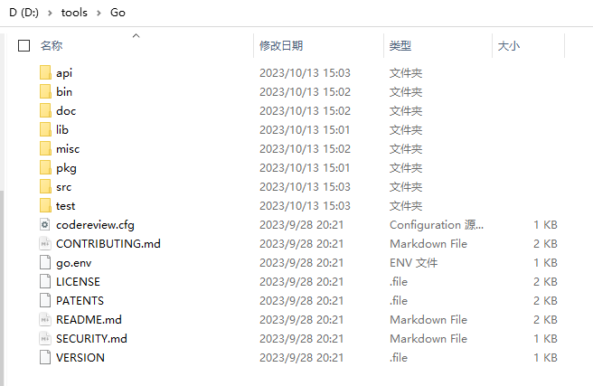

+++
title = "安装Go"
date = 2024-07-13T14:49:37+08:00
weight = 10
type = "docs"
description = ""
isCJKLanguage = true
draft = false

+++

## 安装包来源

- https://go.dev/dl/
- https://mirrors.aliyun.com/golang/
- https://github.com/golang/go/tags
- https://golang.google.cn/dl/
- https://studygolang.com/dl

> 说明
>
> ​	这里以go1.21.2为例，您安装时，请先查看[当前Go的最新版本](https://go.dev/dl/)，有最新版本推荐选择最新版本，毕竟Google内部的多个服务也是用最新版本的，其安全是一定保障的，相信其bug数应该很少。

## 在Linux上安装Go

### CentOS

（a）下载安装包：

```bash
cd /tmp
yum install wget
# 请从 https://go.dev/dl/页面中查看相关系统架构的最新版本
wget -c https://go.dev/dl/go1.21.2.linux-amd64.tar.gz
# 或者使用其他来源，例如：
wget -c https://mirrors.aliyun.com/golang/go1.21.2.linux-amd64.tar.gz
```

（b）解压`go1.21.2.linux-amd64.tar.gz`压缩包至`/usr/local`目录：

```bash
tar -C /usr/local -zxvf go1.21.2.linux-amd64.tar.gz
```

（c）添加`/usr/local/go/bin`至`PATH`环境变量。您可以通过在 `$HOME/.bash_profile`文件 或 `/etc/bashrc`文件（对于全系统的安装，推荐）中添加以下一行来实现。

```bash
export PATH=$PATH:/usr/local/go/bin
```

（d）创建`/home/lx/gopath`目录：

```bash
mkdir -m 777 /home/lx/gopath
```

并添加`/home/lx/gopath`至`GOPATH`环境变量（其中的`lx`为用户登录名）。您可以通过在 `$HOME/.bash_profile`文件 或 `/etc/bashrc`文件（对于全系统的安装，推荐）中添加以下一行来实现。

```bash
export GOPATH=/home/lx/gopath
```

（e）添加`$GOPATH/bin`至`GOBIN`环境变量。您可以通过在 `$HOME/.bash_profile`文件 或 `/etc/bashrc`文件（对于全系统的安装，推荐）中添加以下一行来实现。（注意这里这样设置是认为GOPATH环境变量设置的值只有一个，若`GOPATH`的值有多个这样设置可能会出现问题。）

```bash
export GOBIN=$GOPATH/bin
```

（e）添加`https://goproxy.cn,direct`至`GOPROXY`环境变量。您可以通过在 `$HOME/.bash_profile`文件 或 `/etc/bashrc`文件（对于全系统的安装，推荐）中添加以下一行来实现。

```bash
export GOPROXY=https://goproxy.cn,direct
```

（f）运行以下命令，使环境变量马上生效：

```bash
source $HOME/.bash_profile

# 或

source /etc/bashrc
```

（g）运行以下命令，查看Go是否已经安装成功（若安装成功，该命令将返回Go的相关版本号和架构类型）：

```bash
go version
```


> 问：
>
> ​	若设置`GOPATH`环境变量的路径，在某一非root用户的家目录下，且下载的安装依赖项都位于该非root用户的`$HOME/gopath`，例如：`/home/lx/gopath`下，那么当切换至root用户（root用户也设置了相关的`GOPATH`环境变量）进行项目编译的使用，root用户是否需要再次从新下载相关依赖项？
>
> 答：
>
> ​	不需要，因为所有路径对于root用户都是可见的。

### Ubuntu

（方式1）使用图形界面进行安装


> ```bash
> lx@lx-ub01:~/Desktop$ echo $PATH
> /usr/local/sbin:/usr/local/bin:/usr/sbin:/usr/bin:/sbin:/bin:/usr/games:/usr/local/games:/snap/bin:/snap/bin
> lx@lx-ub01:~/Desktop$ go version
> go version go1.21.2 linux/amd64
> ```
>
> ​	这里你会好奇为什么PATH环境变量中没有go/bin等路径？你可以查看下snap或Snapcraft的原理。
>
> snap的相关文章：
>
> - [我就是我，原理不一样的snap](https://www.ubuntukylin.com/news/666-cn.html)

（方式2）若是使用命令行安装Go，则安装步骤和CentOS一样（不同的是配置文件名称不一样，Ubuntu为`/etc/bash.bashrc`和家目录中的`.bashrc`）。


## 在Mac上安装Go

> 这里直接copy，Go官方文档上[关于在Mac上安装Go的说明](https://go.dev/doc/install)。因为我没有Mac电脑啦。

（a）打开您下载的包文件，按照提示安装Go。

该包将Go发行版安装到`/usr/local/go`。该包应该把 `/usr/local/go/bin` 目录放到您的 `PATH` 环境变量中。您可能需要重新启动任何打开的终端会话，以使该变化生效。

（b）通过打开命令提示符并输入以下命令来验证您已经安装了Go：

```bash
 go version
```

（c）确认该命令打印出已安装的Go的版本。

## 在Windows上安装Go

### Windows 10及以上版本

（a）下载`MSI`格式的安装包。例如：[https://mirrors.aliyun.com/golang/go1.21.2.windows-amd64.msi](https://mirrors.aliyun.com/golang/go1.21.2.windows-amd64.msi)

（b）打开安装包，按照提示进行安装。





（c）运行以下命令，查看Go是否已经安装成功（若安装成功，该命令将返回Go的相关版本号和架构类型）：

```bash
C:\Users\zlongxiang>go version
go version go1.21.2 windows/amd64
```

（d）设置相关环境变量，**避免升级Go版本时还需要重新手动设置相关配置**。在安装完Go后，也许你会注意到，Windows中的关于登录用户的用户环境变量中会自动设置一个环境变量`GOPATH`，其值类似：`C:\Users\zlongxiang\go`（这里的`zlongxiang`是我Windows系统的登录用户名），且在`Path`环境变量中多添加了两行：

```bash
C:\Users\zlongxiang\go\bin
%USERPROFILE%\go\bin
```

（`USERPROFILE`即登录用户的家目录，在我用`zlongxiang`这一用户登录Windows系统后，其值为：`C:\Users\zlongxiang`）。这里我把需要设置的相关环境变量以及值列在下面：

```bash
GOROOT=D:\tools\Go
GOPATH=F:\GoPath
GOBIN=%GOPATH%\bin
GOPROXY=https://goproxy.cn,direct

# 在Path这一环境变量中，将Go自动设置的有关Go的环境变量删除掉
# 新增以下行：

%GOROOT%\bin
%GOPATH%\bin
```

（e）使用`go env` 命令查看Go的相关环境变量：

```bash
C:\Users\zlongxiang>go env
set GO111MODULE=on
set GOARCH=amd64
set GOBIN=F:\GoPath\bin
set GOCACHE=C:\Users\zlongxiang\AppData\Local\go-build
set GOENV=C:\Users\zlongxiang\AppData\Roaming\go\env
set GOEXE=.exe
set GOEXPERIMENT=
set GOFLAGS=
set GOHOSTARCH=amd64
set GOHOSTOS=windows
set GOINSECURE=
set GOMODCACHE=F:\GoPath\pkg\mod
set GONOPROXY=
set GONOSUMDB=
set GOOS=windows
set GOPATH=F:\GoPath
set GOPRIVATE=
set GOPROXY=https://goproxy.cn,direct
set GOROOT=D:\tools\Go
set GOSUMDB=sum.golang.org
set GOTMPDIR=
set GOTOOLCHAIN=auto
set GOTOOLDIR=D:\tools\Go\pkg\tool\windows_amd64
set GOVCS=
set GOVERSION=go1.21.2
set GCCGO=gccgo
set GOAMD64=v1
set AR=ar
set CC=gcc
set CXX=g++
set CGO_ENABLED=1
set GOMOD=NUL
set GOWORK=
set CGO_CFLAGS=-O2 -g
set CGO_CPPFLAGS=
set CGO_CXXFLAGS=-O2 -g
set CGO_FFLAGS=-O2 -g
set CGO_LDFLAGS=-O2 -g
set PKG_CONFIG=pkg-config
set GOGCCFLAGS=-m64 -mthreads -Wl,--no-gc-sections -fmessage-length=0 -ffile-prefix-map=C:\Users\ZLONGX~1\AppData\Local\Temp\go-build444331135=/tmp/go-build -gno-record-gcc-switches
```

