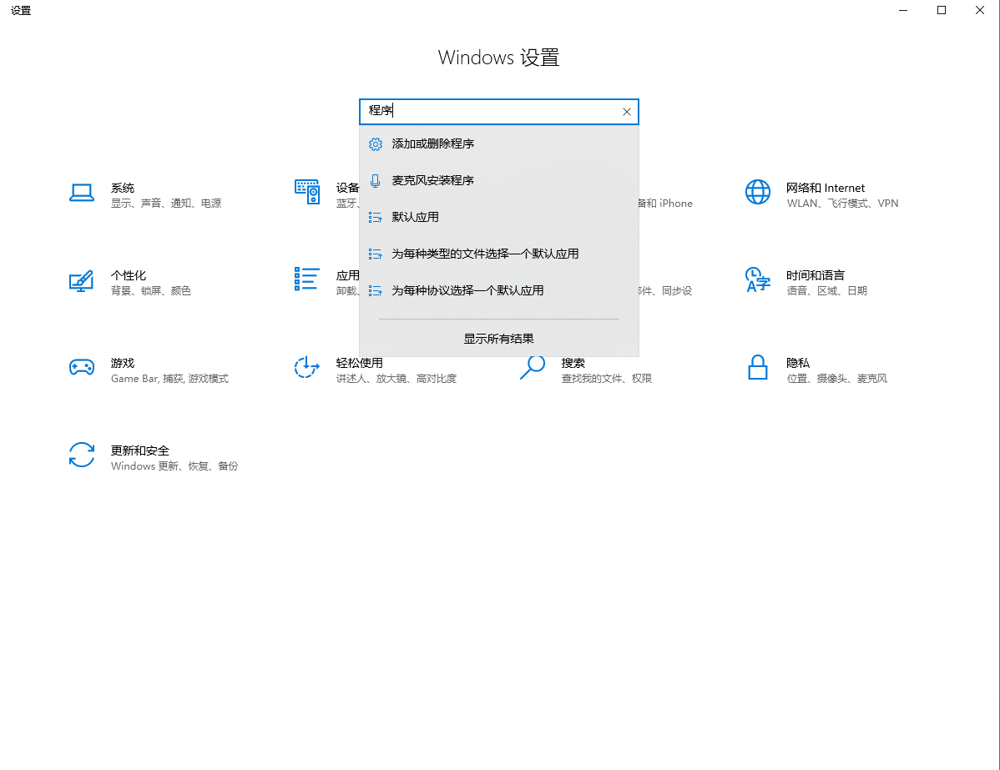
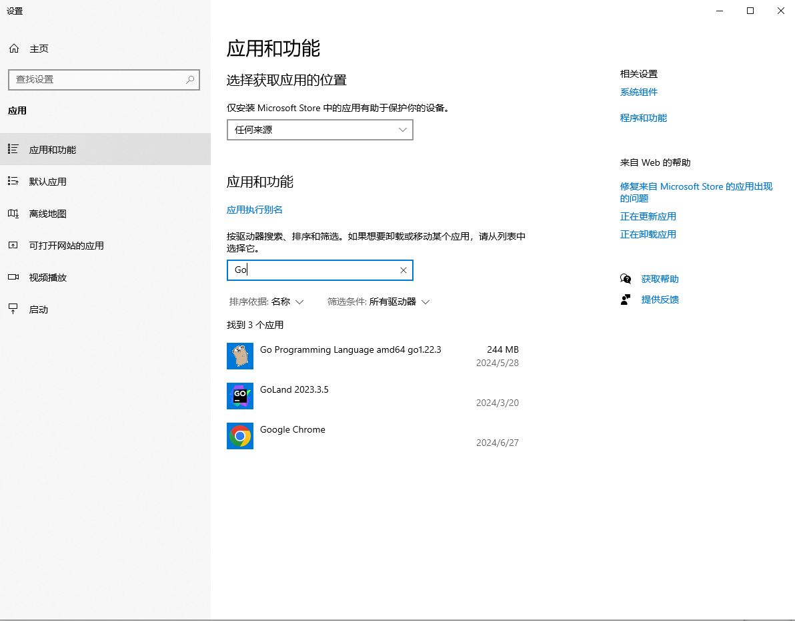
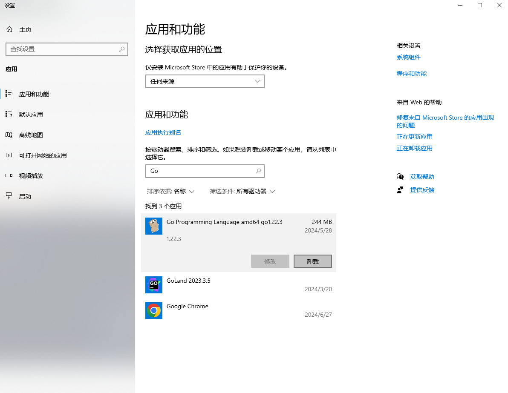
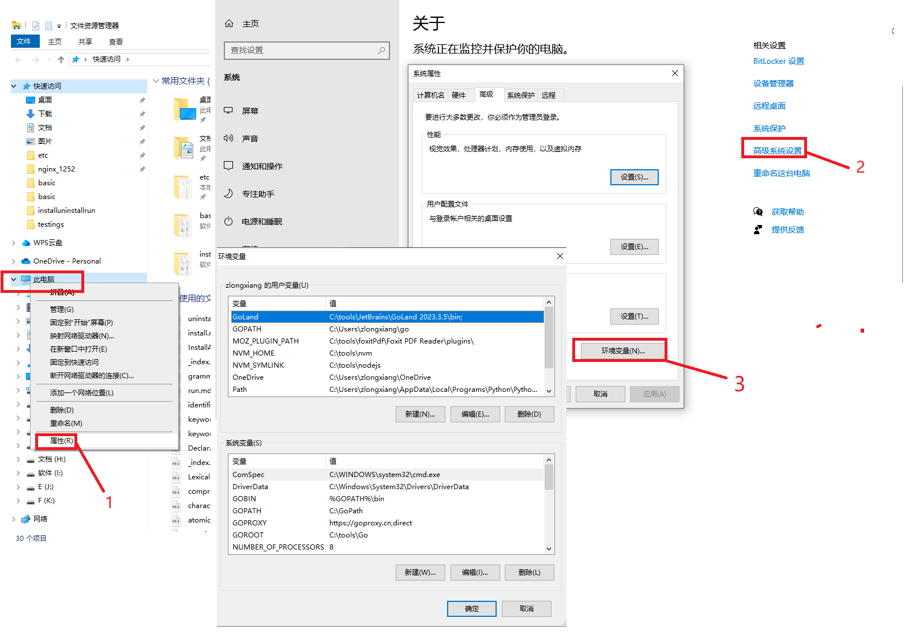

+++
title = "卸载Go"
date = 2024-07-13T14:49:45+08:00
weight = 20
type = "docs"
description = ""
isCJKLanguage = true
draft = false

+++

## 在Linux上卸载Go

### CentOS

（a）删除`/usr/local/go`目录；

（b）修改相关环境变量，将相关Go环境变量移除掉；

### Ubuntu

（a）若是使用snap安装Go，则直接打开snap，找到Go，点击右侧的`Uninstall`按钮进行卸载；

（b）若是使用命令行安装Go，则卸载操作和CentOS一样。

## 在Windows上卸载Go

### Windows 10及以上版本

（a）按`window` + `i`。

（b）在弹出的窗口中的输入`程序`。

（c）选中下拉菜单中的`添加或删除程序`。

（d）在弹出的窗口中输入`Go`。

（e）点击`Go Programming Language amd64 go1.xx.x`，再点击`卸载`按钮进行卸载。

（f）修改相关环境变量。

