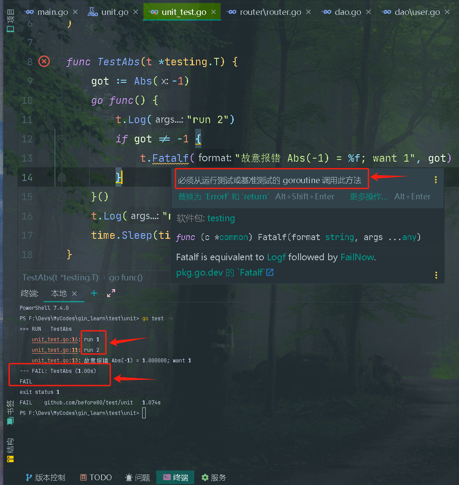

+++
title = "单元测试"
date = 2023-06-12T17:21:05+08:00
weight = 1
type = "docs"
description = ""
isCJKLanguage = true
draft = false
+++

## 函数参数

​	必须是`*testing.T`，可以用其来记录错误或测试状态。


## T结构体

​	`T`结构体是传递给`Test`函数以管理测试状态并支持格式化测试日志的类型。

​	当`Test`函数返回或调用任何`FailNow`方法、`Fatal`方法、`Fatalf`方法、`SkipNow`方法、`Skip`方法或`Skipf`方法时，测试结束。这些方法以及`Parallel`方法只能从运行`Test`函数的goroutine中调用。即这些方法（7个方法）不能用以下方式调用：

```go
import "testing"

func TestExample(t *testing.T) {
    go func() {
        t.Fatal("Test failed")  // 错误！不能在另一个 goroutine 中调用
    }()    
}
```

​	GoLand会有如下提示：



​	其他报告方法，如`Log`方法和`Error`方法的变体（4个方法），可以同时从多个goroutine调用。即这些方法可以用以下方式调用：

```go
import "testing"

func TestExample(t *testing.T) {
    go func() {
        t.Error("Test failed")  // 正确，可以在另一个 goroutine 中调用
    }()
    // 这里的代码会执行
}
```

​	关于`T`结构体的详情，请参阅[type T]()。