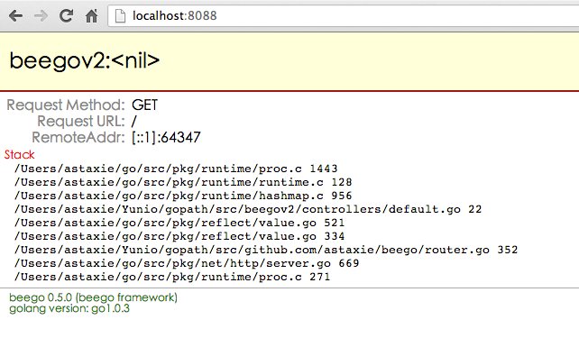

+++
title = "部署"
date = 2024-02-04T09:12:21+08:00
weight = 4
type = "docs"
description = ""
isCJKLanguage = true
draft = false

+++

> 原文：[https://beego.wiki/docs/deploy/]()

# Deployment 部署


## Releasing and Deploying 发布和部署

### Development mode 开发模式

The application created by `bee` is in development mode by default.

​	由 `bee` 创建的应用程序默认处于开发模式。

We can change the mode by:

​	我们可以通过以下方式更改模式：

```
beego.RunMode = "prod"
```

Or change it in conf/app.conf:

​	或在 conf/app.conf 中更改：

```
runmode = prod
```

In development mode: 
​	在开发模式下：

- If you don’t have a views folder, it will show this kind of error:

  ​	如果没有 views 文件夹，它将显示此类错误：

  ```
    2013/04/13 19:36:17 [W] [stat views: no such file or directory]
  ```

- Templates will load every time without cache.

  ​	模板将每次加载而不使用缓存。

- If server throws error, the response will look like:

  ​	如果服务器抛出错误，响应将如下所示：



### Releasing and Deploying 发布和部署

The Go application is a bytecode file after compiling. You just need to copy this file to the server and run it. But remember Beego might also include static files, configuration files and templates, so these three folders also need to be copied to server while deploying.

​	Go 应用程序在编译后是一个字节码文件。您只需要将此文件复制到服务器并运行它。但请记住，Beego 还可能包含静态文件、配置文件和模板，因此在部署时也需要将这三个文件夹复制到服务器。

```
$ mkdir /opt/app/beepkg
$ cp beepkg /opt/app/beepkg
$ cp -fr views /opt/app/beepkg
$ cp -fr static /opt/app/beepkg
$ cp -fr conf /opt/app/beepkg
```

Here is the folder structure in `/opt/app/beepkg`:

​	以下是 `/opt/app/beepkg` 中的文件夹结构：

```
.
├── conf
│   ├── app.conf
├── static
│   ├── css
│   ├── img
│   └── js
└── views
    └── index.tpl
├── beepkg
```

Now we’ve copied our entire application to the server. Next step is deploy it.

​	现在，我们已将整个应用程序复制到服务器。下一步是部署它。

There are three ways to run it:

​	有三种方法可以运行它：

- [Stand alone deploy 独立部署]()
- [Deploy with Supervisord 使用 Supervisord 部署]()
- [Deploy with Systemctl 使用 Systemctl 部署]()

The application is exposed above, then usually we will have a nginx or apache to serve pages and perform load balancing on our application.

​	应用程序在上面公开，那么通常我们会使用 nginx 或 apache 来提供页面并在我们的应用程序上执行负载平衡。

- [Deploy with Nginx 使用 Nginx 部署]()
- [Deploy with Apache 使用 Apache 部署]()
