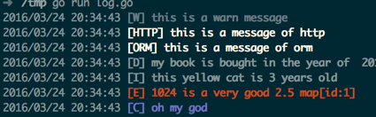
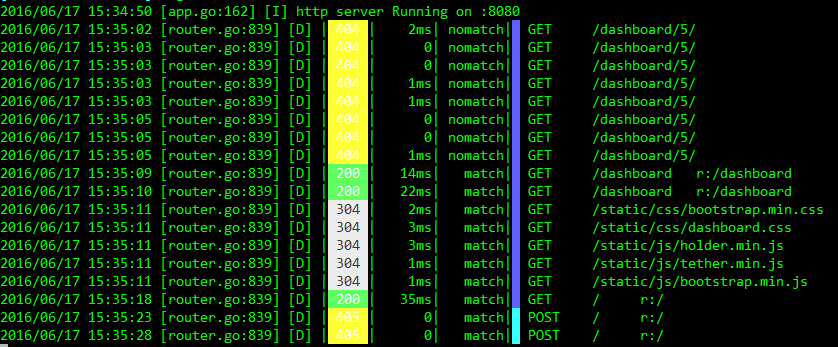
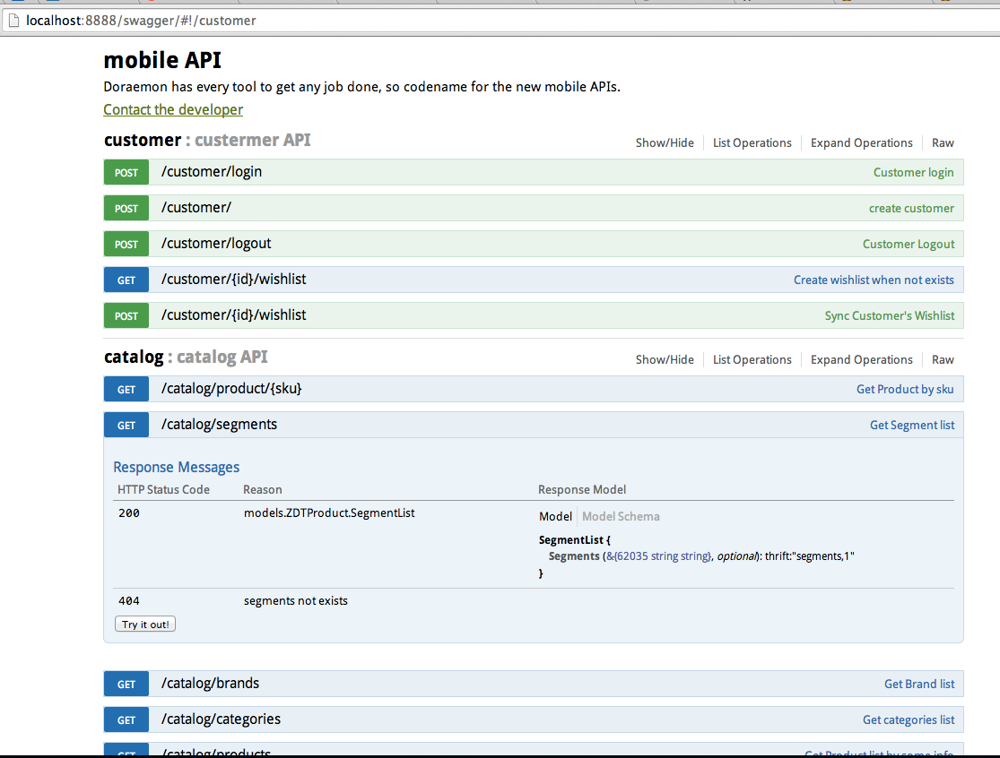
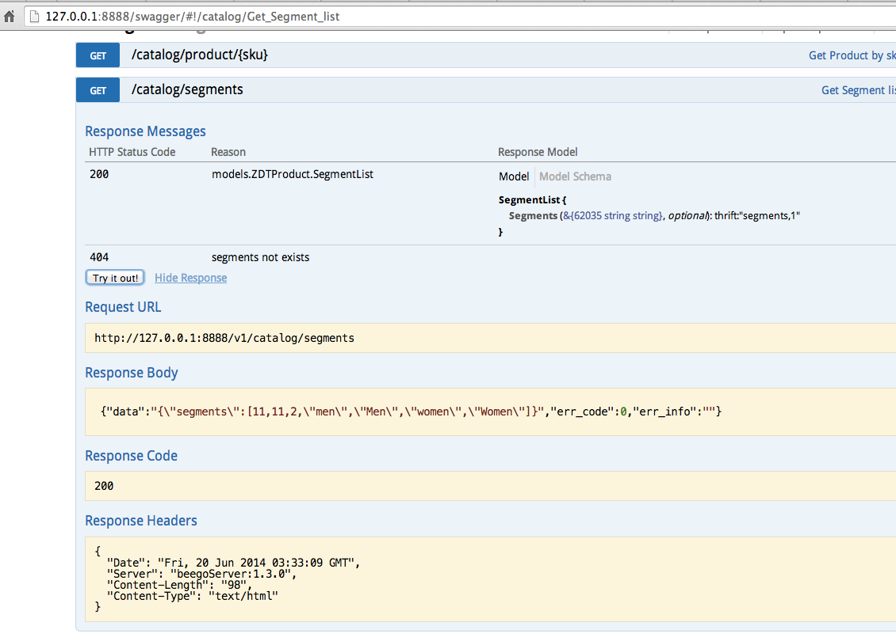

+++
title = "发行说明"
date = 2024-02-04T09:35:54+08:00
weight = 2
type = "docs"
description = ""
isCJKLanguage = true
draft = false

+++

> 原文：[https://beego.wiki/docs/intro/releases/]()

# Release Notes 发行说明


## beego 2.0.4

Note: now we force the web admin service serving HTTP only.

​	注意：现在我们强制 Web 管理服务仅提供 HTTP 服务。

[Change Log
更改日志](https://github.com/beego/beego/releases/tag/v2.0.4)

# beego 2.0.3

[Change Log
更改日志](https://github.com/beego/beego/releases/tag/v2.0.3)

# beego 2.0.2

[Change Log
更改日志](https://github.com/beego/beego/releases/tag/v2.0.2-beta.1)

# beego 2.0.1

When we release v2.0.0, something wrong and then we re-release v2.0.0.

​	当我们发布 v2.0.0 时，出现了一些问题，然后我们重新发布了 v2.0.0。

But the checksum in sum.golang.cn is immutable, so we release this version

​	但是 sum.golang.cn 中的校验和是不可变的，因此我们发布此版本

# beego 2.0.0

### Refactor 重构

1. Support the new project structure. We split the whole framework into four parts: 1.1 server: including web module. 1.2 client: including ORM, cache, httplib modules. 1.3 task: supporting timed tasks and other cyclic tasks. 1.4 core: including validation, config, logs and admin modules.
   支持新的项目结构。我们将整个框架分为四个部分：1.1 服务器：包括 web 模块。1.2 客户端：包括 ORM、缓存、httplib 模块。1.3 任务：支持定时任务和其他循环任务。1.4 核心：包括验证、配置、日志和管理模块。
2. Add `adapter` module which is used to reduce the effort of upgrading Beego from v1.x to v2.x
   添加 `adapter` 模块，用于减少将 Beego 从 v1.x 升级到 v2.x 的工作量
3. Add `context.Context` for `cache`, `httplib`, `session`, `task`, `ORM` modules’ API.
   为 `context.Context` 、 `cache` 、 `httplib` 、 `session` 、 `task` 、 `ORM` 模块的 API 添加
4. Add `error` as a return value for `cache`, `httplib`, `session`, `task`. Now users are able to know more info about what happen inside Beego.
   将 `error` 作为 `cache` 、 `httplib` 、 `session` 、 `task` 的返回值添加。现在用户能够了解有关 Beego 内部发生的事情的更多信息。
5. Decouple modules from each other. All modules only depend on `core` package.
   将模块彼此解耦。所有模块仅依赖于 `core` 包。
6. Support tracing, metrics in ORM, web, httplib modules.
   支持 ORM、web、httplib 模块中的跟踪、指标。
7. Introduce `filter-chain` patter to support AOP.
   引入 `filter-chain` 模式以支持 AOP。

### Feature: 功能：

1. Allow Healthcheck endpoint return JSON for Kubernetes. [4055](https://github.com/beego/beego/pull/4055)
   允许 Healthcheck 端点为 Kubernetes 返回 JSON。4055
2. Support `ClientAuth` for TLS. [4116](https://github.com/beego/beego/pull/4116)
   支持 `ClientAuth` 用于 TLS。4116
3. `orm.RawSeter` supports `orm.Fielder`. [4191](https://github.com/beego/beego/pull/4191)
   `orm.RawSeter` 支持 `orm.Fielder` 。4191
4. Add a new MySQL operator for strict case-sensitive query. [4198](https://github.com/beego/beego/pull/4198)
   添加一个新的 MySQL 运算符，用于严格区分大小写的查询。4198
5. Using `filter-chain` pattern in `orm` module. Support opentracing and prometheus by using filter. [4141](https://github.com/beego/beego/pull/4141)
   在 `orm` 模块中使用 `filter-chain` 模式。通过使用过滤器支持 opentracing 和 prometheus。4141
6. Support `prometheus` filter for `httplib` module. [4145](https://github.com/beego/beego/pull/4145)
   支持 `prometheus` 模块的过滤器。4145
7. Add additional options to redis session prov. [4137](https://github.com/beego/beego/pull/4137)
   为 redis 会话提供程序添加其他选项。4137
8. Support default value filter for `orm` module. [4156](https://github.com/beego/beego/pull/4156)
   支持 `orm` 模块的默认值过滤器。4156
9. Add methods `Unmarshaler`, `Sub`, `OnChange` for `Configer` module. [4175](https://github.com/beego/beego/pull/4175)
   为 `Configer` 模块添加方法 `Unmarshaler` 、 `Sub` 和 `OnChange` 。4175
10. Custom Log Formatter. [4174](https://github.com/beego/beego/pull/4174), [4179](https://github.com/beego/beego/pull/4179), [4188](https://github.com/beego/beego/pull/4188)
    自定义日志格式化程序。4174、4179、4188
11. Support the time precision for time.Time type. [4186](https://github.com/beego/beego/pull/4186)
    支持 time.Time 类型的 time 精度。4186
12. Support `etcd` in Config module. [4195](https://github.com/beego/beego/pull/4195)
    支持 Config 模块中的 `etcd` 。4195
13. Optimize rawSet.QueryRows to avoid many unnecessary calls to parseStructTag. [4210](https://github.com/beego/beego/pull/4210)
    优化 rawSet.QueryRows 以避免多次不必要的对 parseStructTag 的调用。4210
14. Allow users to ignore some table when run ORM commands. [4211](https://github.com/beego/beego/pull/4211)
    允许用户在运行 ORM 命令时忽略某些表。4211
15. PostgresQueryBuilder [4205](https://github.com/beego/beego/pull/4205)
16. Provides a powerful `LogFormatter` implementation PatternLogFormatter.[4229](https://github.com/beego/beego/pull/4229)
    提供了强大的 `LogFormatter` 实现 PatternLogFormatter。4229
17. Support custom ES index name. [4233](https://github.com/beego/beego/pull/4233)
    支持自定义 ES 索引名称。4233
18. Support multiple web servers. [4234](https://github.com/beego/beego/pull/4234)
    支持多个 Web 服务器。4234
19. Support toml config. [4262](https://github.com/beego/beego/pull/4262)
    支持 toml 配置。4262
20. Using unmarshaler to parse config in web module. [4266](https://github.com/beego/beego/pull/4266)
    使用 unmarshaler 解析 Web 模块中的配置。4266
21. Add MaxUploadFile to provide more safety uploading control. [4275](https://github.com/beego/beego/pull/4275)
    添加 MaxUploadFile 以提供更安全的上传控制。4275
22. Support using json string to init session. [4277](https://github.com/beego/beego/pull/4277)
    支持使用 json 字符串初始化会话。4277
23. Support global instance for config module. [4278](https://github.com/beego/beego/pull/4278)
    支持配置模块的全局实例。4278
24. Session: adds CookieSameSite to ManagerConfig. [4226](https://github.com/beego/beego/pull/4226)
    会话：将 CookieSameSite 添加到 ManagerConfig。4226

### Fix: 修复：

1. Fix reconnection bug in logs/conn.go. [4056](https://github.com/beego/beego/pull/4056)
   修复 logs/conn.go 中的重新连接错误。4056
2. Return 413 when request payload too large. [4058](https://github.com/beego/beego/pull/4058)
   当请求有效负载过大时返回 413。4058
3. Fix `index out of range` in session module when `len(sid) < 2`. [4068](https://github.com/beego/beego/pull/4068)
   修复 `index out of range` 在会话模块中时 `len(sid) < 2` . 4068
4. Fix concurrent issue of context/input Query method. [4066](https://github.com/beego/beego/pull/4066)
   修复 context/input Query 方法的并发问题。4066
5. Allow using environment variable to specific the config file. [4111](https://github.com/beego/beego/pull/4111)
   允许使用环境变量指定配置文件。4111
6. XSRF add secure and http only flag. [4126](https://github.com/beego/beego/pull/4126)
   XSRF 添加安全且仅限 http 的标志。4126
7. Fix temporary create failed on Windows [4244](https://github.com/beego/beego/pull/4244)
   修复 Windows 上临时创建失败的问题 4244
8. Fix:return error after inserting data when primary key is string. [4150](https://github.com/beego/beego/pull/4150)
   修复：在主键为字符串时插入数据后返回错误。4150
9. Fix the bug that Fielder’s SetRaw is not called when calling orm.Raw() to query from database. [4160](https://github.com/beego/beego/pull/4160)
   修复 Fielder 的 SetRaw 在调用 orm.Raw() 从数据库查询时未被调用的错误。4160
10. Fix: return error when calling `InsertOrUpdate` is successful with string primary key. [4158](https://github.com/beego/beego/pull/4158)
    修复：在使用字符串主键成功调用 `InsertOrUpdate` 时返回错误。4158
11. Fix the problem that the nested structure of queryRow() cannot assign values [4173](https://github.com/beego/beego/pull/4173)
    修复 queryRow() 的嵌套结构无法分配值的问题 4173
12. Empty field in validator.Error when label struct tag is not declared. [4225](https://github.com/beego/beego/pull/4225)
    当未声明标签结构时，validator.Error 中的字段为空。4225
13. Fix deadlock in task module. [4246](https://github.com/beego/beego/pull/4246)
    修复任务模块中的死锁。4246
14. Fix: form entity too large casue run out of memory. [4272](https://github.com/beego/beego/pull/4272)
    修复：表单实体太大导致内存不足。4272

### Doc: 文档：

1. Fix typo. [4251](https://github.com/beego/beego/pull/4251), [4135](https://github.com/beego/beego/pull/4135), [4107](https://github.com/beego/beego/pull/4107)
   修复错别字。4251、4135、4107

# beego 1.12.3

### Feature: 功能：

1. Allow Healthcheck endpoint return JSON for Kubernetes. [4055](https://github.com/beego/beego/pull/4055)
   允许 Healthcheck 端点为 Kubernetes 返回 JSON。4055
2. Support `ClientAuth` for TLS. [4116](https://github.com/beego/beego/pull/4116)
   支持 `ClientAuth` 用于 TLS。4116
3. `orm.RawSeter` support `orm.Fielder`. [4191](https://github.com/beego/beego/pull/4191)
   `orm.RawSeter` 支持 `orm.Fielder` 。4191
4. Add a new MySQL operator for strict case sensitive query. [4198](https://github.com/beego/beego/pull/4198)
   添加一个新的 MySQL 运算符，用于严格区分大小写的查询。4198

### Fix: 修复：

1. Fix reconnection bug in logs/conn.go. [4056](https://github.com/beego/beego/pull/4056)
   修复 logs/conn.go 中的重新连接错误。 4056
2. Return 403 when request payload too large. [4058](https://github.com/beego/beego/pull/4058)
   当请求有效负载过大时返回 403。 4058
3. Fix race condition for Prepare Statement cache. [4061](https://github.com/beego/beego/pull/4061)
   修复预处理语句缓存的竞争条件。4061
4. Fix `index out of range` in session module when `len(sid) < 2`. [4068](https://github.com/beego/beego/pull/4068)
   修复 `index out of range` 在 `len(sid) < 2` 时会话模块中的 4068
5. Fix concurrent issue of context/input Query method. [4066](https://github.com/beego/beego/pull/4066)
   修复 context/input Query 方法的并发问题。4066
6. Allow using environment variable to specific the config file. [4111](https://github.com/beego/beego/pull/4111)
   允许使用环境变量指定配置文件。4111
7. XSRF add secure and http only flag. [4126](https://github.com/beego/beego/pull/4126)
   XSRF 添加安全且仅限 http 的标志。4126
8. Fix temporary create failed on Windows [4244](https://github.com/beego/beego/pull/4244)
   修复 Windows 上的临时创建失败 4244
9. Session: adds CookieSameSite to ManagerConfig. [4226](https://github.com/beego/beego/pull/4226)
   Session：将 CookieSameSite 添加到 ManagerConfig。4226
10. Make stmt cache smaller to avoid `too many statement` error. [4261](https://github.com/beego/beego/pull/4261)
    减小语句缓存以避免 `too many statement` 错误。4261

# beego 1.12.2

1. Fix old process didn’t exist when graceful restart in beego 1.12.0 [#4005](https://github.com/beego/beego/pull/4005)
   修复 beego 1.12.0 中优雅重启时旧进程不存在的问题 #4005
2. Enhance: Print stack while orm abnormally exit [#3743](https://github.com/beego/beego/pull/3743)
   增强：在 orm 异常退出时打印堆栈 #3743
3. Enhance: Replacing lock with read lock in GetMapData [#3803](https://github.com/beego/beego/pull/3803)
   增强：在 GetMapData 中用读锁替换锁 #3803
4. Fix: Get the real location of the log directory if the path is symbolic path [#3818](https://github.com/beego/beego/pull/3818)
   修复：如果路径是符号路径，则获取日志目录的真实位置 #3818
5. Fix: Cache, context, session: add lock to fix inconsistent field protection [#3922](https://github.com/beego/beego/pull/3922)
   修复：缓存、上下文、会话：添加锁以修复不一致的字段保护 #3922
6. Fix: Encoded url(with slash) router mismatch problem [#3943](https://github.com/beego/beego/pull/3943)
   修复：编码的 url（带斜杠）路由器不匹配问题 #3943
7. Fix: genRouterCode method generate wrong codes [#3981](https://github.com/beego/beego/pull/3981)
   修复：genRouterCode 方法生成错误的代码 #3981
8. Enhance: Using LRU algorithm, ignoring big file and using max cache size to reduce the memory usage of file cache [#3984](https://github.com/beego/beego/pull/3984)
   增强：使用 LRU 算法，忽略大文件并使用最大缓存大小来减少文件缓存的内存使用量 #3984
9. Fix: Set max DB connections [#3985](https://github.com/beego/beego/pull/3985)
   修复：设置最大数据库连接数 #3985
10. Fix: SQLite don’t support SELECT … FOR UPDATE [#3992](https://github.com/beego/beego/pull/3992)
    修复：SQLite 不支持 SELECT … FOR UPDATE #3992
11. Enhance: Add Transfer-Encoding header in httplib’s PostFile method [#3993](https://github.com/beego/beego/pull/3993)
    增强：在 httplib 的 PostFile 方法中添加 Transfer-Encoding 头 #3993
12. Enhance: Support bit operation in ORM [#3994](https://github.com/beego/beego/pull/3994)
    增强：支持 ORM 中的位运算 #3994
13. Fix: net/http Middleware set via RunWithMiddleware or App.Run(middleware) doesn’t work when “BConfig.Listen.Graceful” is set to true [#3995](https://github.com/beego/beego/pull/3995)
    修复：当 “BConfig.Listen.Graceful” 设置为 true 时，通过 RunWithMiddleware 或 App.Run(middleware) 设置的 net/http 中间件不起作用 #3995
14. Fix: Empty field in validator.Error when label struct tag is not declared [#4001](https://github.com/beego/beego/pull/4001)
    修复：当标签结构未声明时，validator.Error 中的字段为空 #4001
15. Fix: panic: send on closed channel after closing logger [#4004](https://github.com/beego/beego/pull/4004)
    修复：在关闭日志记录器后恐慌：发送到已关闭的通道 #4004
16. Enhance: Store RouterPattern before filter execute [#4007](https://github.com/beego/beego/pull/4007)
    增强：在过滤器执行之前存储 RouterPattern #4007
17. Fix: Using HTMLEscapeString in adminui.go to avoid XSS attack [#4018](https://github.com/beego/beego/pull/4018)
    修复：在 adminui.go 中使用 HTMLEscapeString 以避免 XSS 攻击 #4018
18. Fix: Process not closed when graceful set to true [#4005](https://github.com/beego/beego/pull/4005)
    修复：当 graceful 设置为 true 时，进程未关闭 #4005
19. Enhance: Use scan instead of keys in redis [#4016](https://github.com/beego/beego/pull/4016)
    增强：在 redis 中使用 scan 代替 keys #4016
20. Feature: Support prometheus [#4021](https://github.com/beego/beego/pull/4021)
    特性：支持 prometheus #4021
21. Fix: Can’t create more than max_prepared_stmt_count statements [#4025](https://github.com/beego/beego/pull/4025)
    修复：无法创建超过 max_prepared_stmt_count 条语句 #4025
22. Enhance: Support more mobile number pattern [#4027](https://github.com/beego/beego/pull/4027)
    增强：支持更多手机号码模式 #4027
23. Fix: Can’t set section name [#4027](https://github.com/beego/beego/pull/4027)
    修复：无法设置节名称 #4027
24. Fix: strings.Repeat panic in orm/db.go [#4032](https://github.com/beego/beego/pull/4032)
    修复：orm/db.go 中的 strings.Repeat 恐慌 #4032
25. Enhance: Make redis client idle timeout configurable [#4033](https://github.com/beego/beego/pull/4033)
    增强：使 redis 客户端空闲超时时间可配置 #4033

# beego 1.10.0

1. Update log.go add GetLevel Function to Log [#2970](https://github.com/beego/beego/pull/2970)
   更新 log.go，为日志添加 GetLevel 函数 #2970
2. Fix a typo “conflict” [#2971](https://github.com/beego/beego/pull/2971)
   修复一个错别字“conflict” #2971
3. Bug on private fields [#2978](https://github.com/beego/beego/pull/2978)
   私有字段上的错误 #2978
4. Fix access log console unexpected ‘\n’ at end of each log. [#2976](https://github.com/beego/beego/pull/2976)
   修复访问日志控制台在每条日志末尾意外出现“\n”。#2976
5. Fix Documentation for HTTP status codes descriptions. [#2992](https://github.com/beego/beego/pull/2992)
   修复 HTTP 状态码说明的文档。#2992
6. Redis cache: make MaxIdle configurable [#3004](https://github.com/beego/beego/pull/3004)
   Redis 缓存：使 MaxIdle 可配置 #3004
7. Update: Fix migration generate SQL [#3017](https://github.com/beego/beego/pull/3017)
   更新：修复迁移生成 SQL #3017
8. Handle pointer validation [#3046](https://github.com/beego/beego/pull/3046)
   处理指针验证 #3046
9. Fix the issue TaseCase TestFormatHeader_0 is failed [#3066](https://github.com/beego/beego/pull/3066)
   修复问题 TaseCase TestFormatHeader_0 失败 #3066
10. Fix BEEGO_RUNMODE [#3064](https://github.com/beego/beego/pull/3064)
    修复 BEEGO_RUNMODE #3064
11. Swagger: Allow example values with different types, allow example for enum. [#3085](https://github.com/beego/beego/pull/3085)
    Swagger：允许具有不同类型的示例值，允许枚举的示例。#3085
12. Fix the bug: unable to add column with ALTER TABLE [#2999](https://github.com/beego/beego/pull/2999)
    修复错误：无法使用 ALTER TABLE 添加列 #2999
13. Set default Beego RunMode to production [#3076](https://github.com/beego/beego/pull/3076)
    将默认 Beego RunMode 设置为生产 #3076
14. Fix typo [#3103](https://github.com/beego/beego/pull/3103)
    修复错别字 #3103
15. In dev mode, template parse error cause program lock [#3126](https://github.com/beego/beego/pull/3126)
    在开发模式下，模板解析错误导致程序锁定 #3126
16. Amend a very minor typo in a variable name [#3115](https://github.com/beego/beego/pull/3115)
    修改变量名称中的一个非常小的错别字 #3115
17. When log maxSize set big int，FileWrite Init fail [#3109](https://github.com/beego/beego/pull/3109)
    当 log maxSize 设置为 big int 时，FileWrite Init 失败 #3109
18. Change github.com/garyburd/redigo to newest branch github.com/gomodul… [#3100](https://github.com/beego/beego/pull/3100)
    将 github.com/garyburd/redigo 更改为最新分支 github.com/gomodul… #3100
19. ExecElem.FieldByName as local variable [#3039](https://github.com/beego/beego/pull/3039)
    ExecElem.FieldByName 作为局部变量 #3039
20. Allow log prefix [#3145](https://github.com/beego/beego/pull/3145)
    允许日志前缀 #3145
21. Refactor yaml config for support multilevel [#3127](https://github.com/beego/beego/pull/3127)
    重构 yaml 配置以支持多级 #3127
22. Create redis_cluster.go [#3175](https://github.com/beego/beego/pull/3175)
    创建 redis_cluster.go #3175
23. Add field comment on create table [#3190](https://github.com/beego/beego/pull/3190)
    在创建表时添加字段注释 #3190
24. Update: use PathEscape replace QueryEscape [#3200](https://github.com/beego/beego/pull/3200)
    更新：使用 PathEscape 替换 QueryEscape #3200
25. Update gofmt [#3206](https://github.com/beego/beego/pull/3206)
    更新 gofmt #3206
26. Update: Htmlquote Htmlunquote [#3202](https://github.com/beego/beego/pull/3202)
    更新：Htmlquote Htmlunquote #3202
27. Add ‘FOR UPDATE’ support for querySet [#3208](https://github.com/beego/beego/pull/3208)
    为 querySet 添加“FOR UPDATE”支持 #3208
28. Debug stringsToJSON [#3171](https://github.com/beego/beego/pull/3171)
    调试 stringsToJSON #3171
29. Fix defaut value bug, and add config for maxfiles [#3185](https://github.com/beego/beego/pull/3185)
    修复默认值错误，并添加 maxfiles 的配置 #3185
30. Fix: correct MaxIdleConnsPerHost value to net/http default 100. [#3230](https://github.com/beego/beego/pull/3230)
    修复：将 MaxIdleConnsPerHost 值更正为 net/http 默认值 100。#3230
31. Fix: When multiply comment routers on one func [#3217](https://github.com/beego/beego/pull/3217)
    修复：在一个函数上多次注释路由器 #3217
32. Send ErrNoRows if the query returns zero rows … in method orm_query… [#3247](https://github.com/beego/beego/pull/3247)
    如果查询返回零行，则发送 ErrNoRows … 在方法 orm_query… 中 #3247
33. Fix typo [#3245](https://github.com/beego/beego/pull/3245)
    修复错别字 #3245
34. Add session redis IdleTimeout config [#3239](https://github.com/beego/beego/pull/3239)
    添加会话 redis IdleTimeout 配置 #3239
35. Fix the wrong status code in prod [#3226](https://github.com/beego/beego/pull/3226)
    修复产品中的错误状态代码 #3226
36. Add method to set the data depending on the accepted [#3182](https://github.com/beego/beego/pull/3182)
    添加根据接受的数据设置数据的方法 #3182
37. Fix Unexpected EOF bug in staticfile [#3152](https://github.com/beego/beego/pull/3152)
    修复 staticfile 中的意外 EOF 错误 #3152
38. Add code style for logs README [#3146](https://github.com/beego/beego/pull/3146)
    添加日志 README 的代码样式 #3146
39. Fix response http code [#3142](https://github.com/beego/beego/pull/3142)
    修复响应 http 代码 #3142
40. Improve access log [#3141](https://github.com/beego/beego/pull/3141)
    改进访问日志 #3141
41. Auto create log dir [#3105](https://github.com/beego/beego/pull/3105)
    自动创建日志目录 #3105
42. Html escape before display path, avoid xss [#3022](https://github.com/beego/beego/pull/3022)
    显示路径前进行 Html 转义，避免 xss #3022
43. Acquire lock when access config data [#3250](https://github.com/beego/beego/pull/3250)
    访问配置数据时获取锁 #3250
44. Fix orm fields SetRaw function error judge problem [#2985](https://github.com/beego/beego/pull/2985)
    修复 orm 字段 SetRaw 函数错误判断问题 #2985
45. Fix template rendering with automatic mapped parameters (see #2979) [#2981](https://github.com/beego/beego/pull/2981)
    修复使用自动映射参数进行模板渲染（参见 #2979） #2981
46. Fix the model can not be registered correctly on Ubuntu 32bit [#2997](https://github.com/beego/beego/pull/2997)
    修复模型无法在 Ubuntu 32 位上正确注册 #2997
47. Feature/yaml [#3181](https://github.com/beego/beego/pull/3181)
    功能/yaml #3181
48. Feature/autocert [#3249](https://github.com/beego/beego/pull/3249)
    功能/autocert #3249

# beego 1.9.0

1. Fix the new repo address for casbin [#2654](https://github.com/beego/beego/pull/2654)
   修复 casbin 的新仓库地址 #2654
2. Fix cache/memory fatal error: concurrent map iteration and map write [#2726](https://github.com/beego/beego/pull/2726)
   修复缓存/内存致命性问题：并发映射迭代和映射写入 #2726
3. AddAPPStartHook func modify [#2724](https://github.com/beego/beego/pull/2724)
   AddAPPStartHoook 函数进行更改 #2724
4. Fix panic: sync: negative WaitGroup counter [#2717](https://github.com/beego/beego/pull/2717)
   修复恐慌：同步：负的等待组计数器 #2717
5. incorrect error rendering (wrong status) [#2712](https://github.com/beego/beego/pull/2712)
   不正确的渲染（不正确的状况） #2712
6. validation: support int64 int32 int16 and int8 type [#2728](https://github.com/beego/beego/pull/2728)
   验证：int64 int32 int16 并且 int8 类型 #2728
7. validation: support required option for some struct tag valids [#2741](https://github.com/beego/beego/pull/2741)
   验证：为某些结构体标记有效值提供必需的选项 #2741
8. Fix big form parse issue [#2725](https://github.com/beego/beego/pull/2725)
   修复大型表格解析问题 #2725
9. File log add RotatePerm [#2683](https://github.com/beego/beego/pull/2683)
   文件日志中增加了 RotatePerm #2683
10. Fix Oracle placehold [#2749](https://github.com/beego/beego/pull/2749)
    修复 Oracle 占位符 #2749
11. Supported gzip for req.Header has Content-Encoding: gzip [#2754](https://github.com/beego/beego/pull/2754)
    Supported\u96e3 req.Header 中包含 Content-Coding：\u96e3 #2754
12. Add new Database Migrations [#2744](https://github.com/beego/beego/pull/2744)
    添加新的数据库迁移 #2744
13. Beego auto generate sort ControllerComments [#2766](https://github.com/beego/beego/pull/2766)
    Beego 自动生成排序 ControllerComments #2766
14. added statusCode and pattern to FilterMonitorFunc [#2692](https://github.com/beego/beego/pull/2692)
    在 FilterMonitorFunc 中添加了 statusCode 和 pattern #2692
15. fix the bugs in the “ParseBool” function in the file of config.go [#2740](https://github.com/beego/beego/pull/2740)
    修复 config.go 文件中“ParseBool”函数中的错误 #2740

## bee 1.9.0

1. Added MySQL year data type [#443](https://github.com/beego/beego/pull/443)
   添加了 MySQL 年数据类型 #443
2. support multiple http methods [#445](https://github.com/beego/beego/pull/445)
   支持多种 http 方法 #445
3. The DDL migration can now be generated by adding a -ddl and a proper “alter” or “create” as argument value. [#455](https://github.com/beego/beego/pull/455)
   现在可以通过添加 -ddl 和适当的“alter”或“create”作为参数值来生成 DDL 迁移。 #455
4. Fix: docs generator skips everything containing ‘vendor’ [#454](https://github.com/beego/beego/pull/454)
   修复：文档生成器跳过包含“vendor”的所有内容 #454
5. get these tables information in custom the option [#441](https://github.com/beego/beego/pull/441)
   在自定义选项中获取这些表信息 #441
6. read ref(pk) [#444](https://github.com/beego/beego/pull/444)
7. Add command bee server to server static folder.
   将命令 bee server 添加到服务器静态文件夹。

# beego 1.7.1

New features:

​	新功能：

1. Added IP for access log [#2156](https://github.com/beego/beego/pull/2156)
   添加 IP 以访问日志 #2156
2. ReadForUpdate or ORM [#2158](https://github.com/beego/beego/pull/2158)
   ReadForUpdate 或 ORM #2158
3. Parameters binding supports form，columns[0].Data=foo&columns[1].Data=bar&columns[2].Data=baz [#2111](https://github.com/beego/beego/pull/2111)
   参数绑定支持表单，columns[0].Data=foo&columns[1].Data=bar&columns[2].Data=baz #2111
4. Added `beego.BConfig.RecoverFunc` for custom recover method. [#2004](https://github.com/beego/beego/issues/2004)
   添加 `beego.BConfig.RecoverFunc` 以获取自定义恢复方法。#2004
5. memcache cache supports byte and string. So as to cache struct by gob[#1521](https://github.com/beego/beego/issues/1521)
   memcache 缓存支持字节和字符串。以便通过 gob 缓存结构 #1521
6. ORM delete by condition. [#1802](https://github.com/beego/beego/issues/1802)
   ORM 按条件删除。#1802
7. swagger doc supports yaml [#2162](https://github.com/beego/beego/pull/2162)
   swagger 文档支持 yaml #2162
8. Added RunController and RunMethod for customized router rules [#2017](https://github.com/beego/beego/issues/2017)
   添加了 RunController 和 RunMethod 以实现自定义路由规则 #2017

Bug fixes:

​	错误修复：

1. No / added while visiting static folder who contains index.html. For example visit /swagger won’t redirect to /swagger/ so that relitive css and js won’t be access. [#2142](https://github.com/beego/beego/issues/2142)
   访问包含 index.html 的静态文件夹时未添加 /。例如，访问 /swagger 不会重定向到 /swagger/，因此无法访问相对的 css 和 js。#2142
2. Time in Beego admin UI displayed alphabetically other than ordered by us or ms. [#1877](https://github.com/beego/beego/issues/1877)
   Beego 管理 UI 中的时间按字母顺序显示，而不是按我们或毫秒排序。#1877
3. Crash while captcha generates by custom height and width. [#2161](https://github.com/beego/beego/issues/2161)
   通过自定义高度和宽度生成验证码时崩溃。#2161
4. Panic while empty body requested with DELETE method when CopyBody enabled. [#1656](https://github.com/beego/beego/issues/1656)
   启用 CopyBody 时，使用 DELETE 方法请求空主体时发生恐慌。#1656

# beego 1.7.0

New features:

​	新特性：

1. Improved Filter speed by 7.5+ times [#1799](https://github.com/beego/beego/pull/1799)
   将 Filter 速度提高了 7.5 倍以上 #1799
2. Multiple level for Gzip compression [#1808](https://github.com/beego/beego/pull/1808)
   Gzip 压缩的多级 #1808
3. Negative numbers for ORM PK [#1810](https://github.com/beego/beego/pull/1810)
   ORM PK 的负数 #1810
4. Custom auto-increasing ID for ORM [#1826](https://github.com/beego/beego/pull/1826)
   ORM 的自定义自动递增 ID #1826
5. Improved Context file downloading: check file existence before download[#1827](https://github.com/beego/beego/pull/1827)
   改进的上下文文件下载：下载前检查文件是否存在 #1827
6. `GetLogger` method for log module [#1832](https://github.com/beego/beego/pull/1832)
   日志模块的 `GetLogger` 方法 #1832

```
package main

import "github.com/beego/beego/v2/logs"

func main() {
    logs.Warn("this is a warn message")

    l := logs.GetLogger("HTTP")
    l.Println("this is a message of http")

    logs.GetLogger("orm").Println("this is a message of orm")

    logs.Debug("my book is bought in the year of ", 2016)
    logs.Info("this %s cat is %v years old", "yellow", 3)
    logs.Error(1024, "is a very", "good", 2.5, map[string]int{"id": 1})
    logs.Critical("oh my god")
}
```

 7. Log for session if error occurred. [#1833](https://github.com/beego/beego/pull/1833) 8. Public methods for logs: `EnableFuncCallDepth` and `SetLogFuncCallDepth` for setting function call level. [#1837](https://github.com/beego/beego/pull/1837) 9. Use `go run` to run beego project [#1840](https://github.com/beego/beego/pull/1840) 10. Added `ExecuteTemplate` method which is used to access template other than use map since map is not safe for concurrent reading and writing. [#1848](https://github.com/beego/beego/pull/1848) 11. `time` type for ORM field [#1856](https://github.com/beego/beego/pull/1856) 12. ORM One only fetch one record [#1874](https://github.com/beego/beego/pull/1874) 13. ORM suports json jsonb type [#1875](https://github.com/beego/beego/pull/1875) 14. ORM uses text type by default. [#1879](https://github.com/beego/beego/pull/1879) 15. session configurations: `EnableSidInHttpHeader` `EnableSidInUrlQuery` `SessionNameInHttpHeader` let user pass sid in http header or in URL. [#1897](https://github.com/beego/beego/pull/1897) 16. Shorten fileanme of auto-generated router file name. [#1924](https://github.com/beego/beego/pull/1924) 17. Complex template engine. ace jade [#1940](https://github.com/beego/beego/pull/1940)

​	7. 如果发生错误，则记录会话。#1833 8. 日志的公共方法： `EnableFuncCallDepth` 和 `SetLogFuncCallDepth` 用于设置函数调用级别。#1837 9. 使用 `go run` 运行 beego 项目 #1840 10. 添加 `ExecuteTemplate` 方法，用于访问模板，而不是使用映射，因为映射不适用于并发读写。#1848 11. ORM 字段的 `time` 类型 #1856 12. ORM One 只获取一条记录 #1874 13. ORM 支持 json jsonb 类型 #1875 14. ORM 默认使用 text 类型。#1879 15. 会话配置： `EnableSidInHttpHeader` `EnableSidInUrlQuery` `SessionNameInHttpHeader` 允许用户在 http 头或 URL 中传递 sid。#1897 16. 缩短自动生成的路由器文件名。#1924 17. 复杂的模板引擎。ace jade #1940

```
beego.AddTemplateEngine("ace", func(root, path string, funcs template.FuncMap) (*template.Template, error) {
        aceOptions := &ace.Options{DynamicReload: true, FuncMap: funcs}
        aceBasePath := filepath.Join(root, "base/base")
        aceInnerPath := filepath.Join(root, strings.TrimSuffix(path, ".ace"))

        tpl, err := ace.Load(aceBasePath, aceInnerPath, aceOptions)
        if err != nil {
            return nil, fmt.Errorf("error loading ace template: %v", err)
        }

        return tpl, nil
    })
```

[#1940](https://github.com/beego/beego/pull/1940) 18. session suports ssdb [#1953](https://github.com/beego/beego/pull/1953) 19. RenderForm supports required [#1993](https://github.com/beego/beego/pull/1993) 20. Beautified beego logs [#1997](https://github.com/beego/beego/pull/1997)

​	#1940 18. 会话支持 ssdb #1953 19. RenderForm 支持 required #1993 20. 美化的 beego 日志 #1997  21. ORM suports `time.Time` pointer in struct [#2006](https://github.com/beego/beego/pull/2006) 22. `TplPrefix` in Controller for setting prefix folder in baseController [#2030](https://github.com/beego/beego/pull/2030) 23. js function checking in jsonb to avoid non-exist methods. [#2045](https://github.com/beego/beego/pull/2045) 24. `InsertOrUpdate` method in ORM [#2053](https://github.com/beego/beego/pull/2053) 25. Filter method added parameter for resetting parameters. Because when using `beego.InsertFilter("*", beego.BeforeStatic, RedirectHTTP)` parameter will be assigned to `:splat` which will affect other useful routers. [#2085](https://github.com/beego/beego/pull/2085) 26. session initialized by object other than json. *It might have issue for the projects use session module separately.* [#2096](https://github.com/beego/beego/pull/2096) 27. Upgraded Swagger to 2.0. The code generated now doesn’t rely on API. beego generat swagger.json directly.

​	21. ORM 支持结构体中的 `time.Time` 指针 #2006 22. `TplPrefix` 在 Controller 中用于设置 baseController 中的前缀文件夹 #2030 23. js 函数在 jsonb 中检查以避免不存在的方法。 #2045 24. `InsertOrUpdate` 方法在 ORM 中 #2053 25. Filter 方法添加了用于重置参数的参数。因为在使用 `beego.InsertFilter("*", beego.BeforeStatic, RedirectHTTP)` 时，参数将被分配给 `:splat` ，这会影响其他有用的路由器。 #2085 26. 由非 json 对象初始化的会话。对于单独使用会话模块的项目，这可能会出现问题。 #2096 27. 将 Swagger 升级到 2.0。现在生成的代码不依赖于 API。beego 直接生成 swagger.json。

bugfix:

​	错误修复：

1. `/m` redirect to `/m/` automatically in static reouters. [#1792](https://github.com/beego/beego/pull/1792)
   `/m` 在静态路由器中自动重定向到 `/m/` 。 #1792
2. Parsing config file error while testing [#1794](https://github.com/beego/beego/pull/1794)
   测试时解析配置文件错误 #1794
3. Race condition while rotate file. [#1803](https://github.com/beego/beego/pull/1803)
   轮换文件时出现竞争条件。 #1803
4. Fixed multiple response.WriteHeader calls error. [#1805](https://github.com/beego/beego/pull/1805)
   修复了多次调用 response.WriteHeader 的错误。 #1805
5. Fixed panic if primary key is uint in ORM [#1828](https://github.com/beego/beego/pull/1828)
   修复了 ORM 中主键为 uint 时出现的恐慌。 #1828
6. Fixed panic if current time is less than 2000 while rotate logs. [#]()
   修复了轮换日志时当前时间小于 2000 时出现的恐慌。 #
7. Fixed XSRF reuse caused by context reuse.[#1863](https://github.com/beego/beego/pull/1863)
   修复了由上下文重用导致的 XSRF 重用。 #1863
8. Panic while InsertMulti * type in ORM [#1882](https://github.com/beego/beego/pull/1882)
   ORM 中 InsertMulti * 类型时出现恐慌 #1882
9. Multiple execution of task in a very short time. [#1909](https://github.com/beego/beego/pull/1909)
   在很短的时间内多次执行任务。#1909
10. Garbled file name in IE [#1912](https://github.com/beego/beego/pull/1912)
    IE 中的文件名乱码 #1912
11. ORM DISTINCT [#1938](https://github.com/beego/beego/pull/1938)
12. Can’t use int while setting file permit in Logs module. [#1948](https://github.com/beego/beego/pull/1948) [#2003](https://github.com/beego/beego/pull/2003)
    在日志模块中设置文件权限时无法使用 int。#1948 #2003
13. Empty foreign key for QueryRow and QueryRows. [#1964](https://github.com/beego/beego/pull/1964)
    QueryRow 和 QueryRows 的外键为空。#1964
14. Retrieving scheme from X-Forwarded-Proto when it isn’t none. [#2050](https://github.com/beego/beego/pull/2050)
    当 X-Forwarded-Proto 不为 none 时，从其中检索方案。#2050
15. Add query parameters for redirecting static path to `path/` [#2064](https://github.com/beego/beego/pull/2064)
    添加查询参数以将静态路径重定向到 `path/` #2064

# beego 1.6.1

New features

​	新特性

1. Oracle driver for ORM
   ORM 的 Oracle 驱动程序
2. inline mode for ORM Model
   ORM 模型的内联模式
3. ssdb engine for Cache
   Cache 的 ssdb 引擎
4. Color scheme configure for console out
   控制台输出的颜色方案配置
5. travis integration
   travis 集成
6. mulitfile engine for Log. Write logs from different levels to different files.
   日志的多文件引擎。将不同级别的日志写入不同的文件。

bugfix：

​	错误修复：

1. cookie time config
   cookie 时间配置
2. Router rule mapping [#1580](https://github.com/beego/beego/issues/1580)
   路由规则映射 #1580
3. No logs before beego.Run()
   在 beego.Run() 之前没有日志
4. Returning nil while []string is empty in config
   在 config 中 []string 为空时返回 nil
5. Wrong comment for ini engine
   ini 引擎的错误注释
6. Log time delay while store log asynchronously
   异步存储日志时日志时间延迟
7. Config file parsed twice.
   配置文件被解析了两次。
8. Can’t handle `()` in URL for regex router.
   正则路由器 URL 中无法处理 `()` 。
9. Chinese encoding issue in mail
   邮件中的中文编码问题
10. No Distinct in ORM
    ORM 中没有 Distinct
11. Compiling error in Layout
    布局中的编译错误
12. Wrong file name in logrotate
    logrotate 中的文件名错误
13. Invalid CORS if CORS plugin fail.
    如果 CORS 插件失败，则 CORS 无效。
14. Conflicting between path params and router params in filters
    过滤器中路径参数和路由器参数冲突
15. Return 404 other than 200 if static files are not found.
    如果找不到静态文件，则返回 404 而不是 200。
16. Added GroupBy interface
    添加了 GroupBy 接口
17. Static file crush caused by accessing map concurrently of Go 1.6
    Go 1.6 中并发访问映射导致静态文件崩溃
18. Extra newline output by json.Encoder of JSONBody in httplib
    httplib 中 JSONBody 的 json.Encoder 输出额外的换行符
19. Missing log when Close if use flush in log under asynchronous mode.
    在异步模式下，如果在日志中使用 flush，则 Close 时缺少日志。

# beego 1.6.0

New features:

​	新特性：

1. `log` supports rotating files like `xx.2013-01-01.2.log` [#1265](https://github.com/beego/beego/pull/1265)
   `log` 支持轮换文件，例如 `xx.2013-01-01.2.log` #1265
2. `context.response` supports Flush, Hijack, CloseNotify
   `context.response` 支持 Flush、Hijack、CloseNotify
3. ORM supports Distinct [#1276](https://github.com/beego/beego/pull/1276)
   ORM 支持 Distinct #1276
4. `map_get` template method [#1305](https://github.com/beego/beego/pull/1305)
   `map_get` 模板方法 #1305
5. ORM supports [tidb](https://github.com/pingcap/tidb) engine [#1366](https://github.com/beego/beego/pull/1366)
   ORM 支持 tidb 引擎 #1366
6. httplib request supports []string [#1308](https://github.com/beego/beego/pull/1308)
   httplib 请求支持 []string #1308
7. ORM `querySeter` added `GroupBy` method [#1345](https://github.com/beego/beego/pull/1345)
   ORM `querySeter` 添加 `GroupBy` 方法 #1345
8. Session’s MySQL engine supports custom table name [#1348](https://github.com/beego/beego/pull/1348)
   Session 的 MySQL 引擎支持自定义表名 #1348
9. Performance of log’s file engine improved 30%; Supports set log file’s permission [#1560](https://github.com/beego/beego/pull/1560)
   日志文件引擎性能提升 30%；支持设置日志文件权限 #1560
10. Get session by query [#1507](https://github.com/beego/beego/pull/1507)
    通过查询获取会话 #1507
11. Cache module supports multiple Cache objects.
    Cache 模块支持多个 Cache 对象
12. validation supports custom validation functions
    验证支持自定义验证函数

bugfix:

1. `bind` method in `context` caused crash when parameter is empty. [#1245](https://github.com/beego/beego/issues/1245)
   `bind` 方法在参数为空时导致崩溃。#1245
2. manytomany in ORM reverse error [#671](https://github.com/beego/beego/issues/671)
   ORM 反向错误中的 manytomany #671
3. http: multiple response.WriteHeader calls [#1329](https://github.com/beego/beego/pull/1329)
   http: 多次 response.WriteHeader 调用 #1329
4. ParseForm uses local timezone while parsing date [#1343](https://github.com/beego/beego/pull/1343)
   ParseForm 在解析日期时使用本地时区 #1343
5. Emails sent by log’s SMTP engine can’t be authorised
   日志的 SMTP 引擎发送的电子邮件无法授权
6. Fixed some issues in router: `/topic/:id/?:auth`, `/topic/:id/?:auth:int` [#1349](https://github.com/beego/beego/pull/1349)
   修复了路由器中的某些问题： `/topic/:id/?:auth` 、 `/topic/:id/?:auth:int` #1349
7. Fixed the crash caused by nil while parsing comment documentation. [#1367](https://github.com/beego/beego/pull/1367)
   修复了在解析注释文档时由 nil 导致的崩溃。#1367
8. Can’t read `index.html` in static folder
   无法在静态文件夹中读取 `index.html`
9. `dbBase.Update` doesn’t return err if failed [#1384](https://github.com/beego/beego/pull/1384)
   `dbBase.Update` 在 中如果失败不会返回错误 #1384
10. `Required` in `validation` only works for int but not for int64
    `Required` 在 `validation` 中仅适用于 int，而不适用于 int64
11. orm: Fix handling of rel(fk) to model with string pk [#1379](https://github.com/beego/beego/pull/1379)
    orm: 修复 rel(fk) 到具有字符串 pk 的模型的处理 #1379
12. graceful error while both http and https enabled [#1414](https://github.com/beego/beego/pull/1414)
    在 http 和 https 均启用时优雅地出错 #1414
13. If ListenTCP4 enabled and httpaddr is empty, it still listens TCP6
    如果启用了 ListenTCP4 且 httpaddr 为空，它仍会侦听 TCP6
14. migration doesn’t support postgres [#1434](https://github.com/beego/beego/pull/1434)
    迁移不支持 postgres #1434
15. Default values of ORM text, bool will cause error while creating tables.
    ORM 文本、布尔值的默认值在创建表时会导致错误。
16. graceful panic: negative WaitGroup counter
    优雅地恐慌：负 WaitGroup 计数器

Improvement:

​	改进：

1. Moved example to [samples](https://github.com/beego/samples)
   将示例移至样本
2. Passed golint
   通过 golint
3. Rewrote router, improved performance by 3 times.
   重写路由器，将性能提高 3 倍。
4. Used `sync.Pool` for `context` to improve performance
   使用 `sync.Pool` 来 `context` 以提高性能
5. Improved template compiling speed. [#1298](https://github.com/beego/beego/pull/1298)
   提高了模板编译速度。#1298
6. Improved config
   改进了配置
7. Refactored whole codebase for readability and maintainability
   重构了整个代码库以提高可读性和可维护性
8. Moved all init code into `AddAPPStartHook`
   将所有初始化代码移至 `AddAPPStartHook`
9. Removed `middleware`. Will only use `plugins`
   移除了 `middleware` 。将只使用 `plugins`
10. Refactored `Error` handling.
    重构了 `Error` 处理。

# Beego 1.5.0

New Features:

​	新特性：

1. Graceful shutdown
   优雅关机
2. Added `JsonBody` method to `httplib` which supporting sending raw body as JSON format
   在 `httplib` 中添加 `JsonBody` 方法，该方法支持将原始正文作为 JSON 格式发送
3. Added `AcceptsHtml` `AcceptsXml` `AcceptsJson` methods to `context input`
   在 `context input` 中添加 `AcceptsHtml` `AcceptsXml` `AcceptsJson` 方法
4. Get config files from Runmode first
   首先从 Runmode 获取配置文件
5. `httplib` supports `gzip`
   `httplib` 支持 `gzip`
6. `log` module stop using asynchronous mode by default
   `log` 模块默认停止使用异步模式
7. `validation` supports recursion
   `validation` 支持递归
8. Added `apk mime`
   添加 `apk mime`
9. `ORM` supports `eq` an `ne`
   `ORM` 支持 `eq` 和 `ne`

Bugfixes:

​	错误修复：

1. Wrong parameters for ledis driver.
   ledis 驱动程序的参数错误。
2. When user refresh the page after the captcha code expired from the cache, it returns 404. Generating new captcha code for reloading.
   当用户在验证码从缓存中过期后刷新页面时，它会返回 404。生成新的验证码以重新加载。
3. Controller defines Error exception
   控制器定义错误异常
4. cookie doesn’t work in window IE
   cookie 在 window IE 中不起作用
5. GetIn returns nil error while getting non-exist variable
   GetIn 在获取不存在的变量时返回 nil 错误
6. More cellphone validation code
   更多手机验证代码
7. Wrong router matching
   错误的路由器匹配
8. The `panic` returns http 200
   `panic` 返回 http 200
9. The database setting erros caused by redis session
   由 redis 会话引起的数据库设置错误
10. The issue that https and http don’t share session
    https 和 http 不共享会话的问题
11. Memcache session driver returns error if it’s empty
    Memcache 会话驱动程序在为空时返回错误

# Beego 1.4.3

New Features:

​	新特性：

1. ORM support default settting
   ORM 支持默认设置
2. improve logs/file line count
   改进日志/文件行计数
3. sesesion ledis support select db
   sesesion ledis 支持选择数据库
4. session redis support select db
   session redis 支持选择数据库
5. cache redis support select db
   cache redis 支持选择数据库
6. `UrlFor` support all type of the parameters
   `UrlFor` 支持所有类型的参数
7. controller `GetInt/GetString` function support default value, like: `GetInt("a",12)`
   控制器 `GetInt/GetString` 函数支持默认值，例如： `GetInt("a",12)`
8. add `CompareNot/NotNil` template function
   添加 `CompareNot/NotNil` 模板函数
9. support Controller defeine error，[controller Error](http://beego.wiki/docs/mvc/controller/errors.md#controller定义error)
   支持控制器定义错误，控制器错误
10. `ParseForm` support slices of ints and strings
    `ParseForm` 支持整数和字符串切片
11. improve ORM interface
    改进 ORM 接口

bugfix:

1. context get wrong subdomain
   context 获取错误的子域
2. `beego.AppConfig.Strings` when the strings is empty, always return `[]string{}`
   `beego.AppConfig.Strings` 当字符串为空时，始终返回 `[]string{}`
3. utils/pagination can’t modify the attributes
   utils/pagination 无法修改属性
4. when the request url is empty, route tree crashes
   当请求 url 为空时，路由树崩溃
5. can’t click the link to run the task in adminui
   无法点击链接在 adminui 中运行任务
6. FASTCGI restart didn’t delete the unix Socket file
   FASTCGI 重启未删除 unix Socket 文件

# Beego 1.4.2

New Features:

​	新特性：

1. Added SQL Constructor inspired by ZEND ORM.

   ​	添加了受 ZEND ORM 启发的 SQL 构造器。

2. Added `GetInt()`, `GetInt8()`, `GetInt16()`, `GetInt32()`, `GetInt64()` for Controller.

   ​	为 Controller 添加了 `GetInt()` 、 `GetInt8()` 、 `GetInt16()` 、 `GetInt32()` 、 `GetInt64()` 。

3. Improved the logging. Added `FilterHandler` for filter logging output.

   ​	改进了日志记录。添加了 `FilterHandler` 用于过滤日志输出。

4. Static folder supports `index.html`. Automatically adding `/` for static folders.

   ​	静态文件夹支持 `index.html` 。自动为静态文件夹添加 `/` 。

5. `flash` supports `success` and `set` methods.

   ​	 `flash` 支持 `success` 和 `set` 方法。

6. Config for ignoring case for routers: `RouterCaseSensitive`. Case sensitive by default.

   ​	忽略路由器大小写的配置： `RouterCaseSensitive` 。默认情况下区分大小写。

7. Configs load based on environment: `beego.AppConfig.String("myvar")` return 456 on dev mode and return 123 on the other modes.

   ​	根据环境加载配置： `beego.AppConfig.String("myvar")` 在开发模式下返回 456，在其他模式下返回 123。

   > runmode = dev myvar = 123 [dev] myvar = 456

8. Added `include` for `ini` config files:

   ​	为 `ini` 配置文件添加 `include` ：

   > appname = btest include b.conf

9. Added `paginator` utils.

   ​	添加 `paginator` utils。

10. Added `BEEGO_RUNMODE` environment variable. You can change the application mode by changing this environment variable.

    ​	添加 `BEEGO_RUNMODE` 环境变量。您可以通过更改此环境变量来更改应用程序模式。

11. Added Json function for fetching `statistics` in `toolbox`.

    ​	添加 Json 函数以在 `toolbox` 中获取 `statistics` 。

12. Attachements support for mail utils.

    ​	邮件工具的附件支持。

13. Turn on fastcgi by standard IO.

    ​	通过标准 IO 打开 fastcgi。

14. Using `SETEX` command to support the old version redis in redis Session engine.

    ​	使用 `SETEX` 命令在 redis Session 引擎中支持旧版本 redis。

15. RenderForm supports html id and class by using id and class tag.

    ​	RenderForm 通过使用 id 和 class 标记支持 html id 和 class。

16. ini config files support BOM head.

    ​	ini 配置文件支持 BOM 头。

17. Added new Session engine `ledis`.

    ​	添加了新的 Session 引擎 `ledis` 。

18. Improved file uploading in `httplib`. Supporting extremely large files by using `io.Pipe`.

    ​	改进了 `httplib` 中的文件上传。通过使用 `io.Pipe` 支持超大文件。

19. Binding to TCP4 address by default. It will bind to ipv6 in GO. Added config variable `ListenTCP4`.

    ​	默认情况下绑定到 TCP4 地址。它将在 GO 中绑定到 ipv6。添加了配置变量 `ListenTCP4` 。

20. off/on/yes/no/1/0 will parse to `bool` in form rendering. Support time format.

    ​	off/on/yes/no/1/0 将在表单渲染中解析为 `bool` 。支持时间格式。

21. Simplify the generating of SeesionID. Using golang buildin `rand` function other than `hmac_sha1`.

    ​	简化 SeesionID 的生成。使用 golang 内置 `rand` 函数而不是 `hmac_sha1` 。

bugfix:

​	错误修复：

1. XSRF verification failure while `PUT` and `DELETE` cased by lowercased `_method`
   由于小写的 `_method` 导致 `PUT` 和 `DELETE` 中的 XSRF 验证失败
2. No error message returned while initialize the cache by `StartAndGC`
   使用 `StartAndGC` 初始化缓存时未返回错误消息
3. Can’t set `User-Agent` in `httplib`
   无法在 `httplib` 中设置 `User-Agent`
4. Improved `DelStaticPath`
   已改进 `DelStaticPath`
5. Only finding files in the first static folder when using multiple static folders
   使用多个静态文件夹时仅在第一个静态文件夹中查找文件
6. `Filter` functions can’t execute after `AfterExec` and `FinishRouter`
   `Filter` 函数无法在 `AfterExec` 和 `FinishRouter` 之后执行
7. Fixed uninitialized mime
   修复了未初始化的 mime
8. Wrong file name and line number in the log
   日志中的文件名和行号错误
9. Can’t send the request while only uploading one file in `httplib`
   在 `httplib` 中仅上传一个文件时无法发送请求
10. Improved the `Abort` output message. It couldn’t out undefined error message before.
    改进了 `Abort` 输出消息。以前无法输出未定义的错误消息。
11. Fixed the issue that can’t add inner Filter while no out Filter set in the nested `namespaces`
    修复了在嵌套的 `namespaces` 中未设置外部过滤器时无法添加内部过滤器的错误
12. Router mapping error while router has multiple level parameters. #824
    路由器有多级参数时出现路由器映射错误。#824
13. The information lossing while having many `namespaces` for the commented router. #770
    注释的路由器有多个 `namespaces` 时会丢失信息。#770
14. `urlfor` function calling useless {{placeholder}} #759
    `urlfor` 函数调用无用 {{placeholder}} #759

# Beego 1.4.1

New features:

​	新特性：

1. `context.Input.Url` get path info without domain scheme.
   `context.Input.Url` 获取不带域方案的路径信息。
2. Added plugin `apiauth` to simulate the `AWS` encrypted requests.
   添加插件 `apiauth` 来模拟 `AWS` 加密请求。
3. Simplified the debug output for router info.
   简化路由器信息的调试输出。
4. Supportting pointer type in ORM.
   在 ORM 中支持指针类型。
5. Added `BasicAuth`, cache for multiple requests
   添加 `BasicAuth` ，缓存多个请求

bugfix:

1. Router *.* can’t be parsed
   无法解析路由器

# Beego 1.3.0

Hi guys! After the hard working for one month, we are so excited to release Beego 1.3.0. We brought many useful features. [Upgrade notes](http://beego.wiki/docs/intro/upgrade.md)

​	嗨，伙计们！经过一个月的努力工作，我们非常高兴地发布 Beego 1.3.0。我们带来了许多有用的功能。升级说明

#### The brand new router system 全新的路由器系统

We rewrote the router system to tree router. It improved the performance significantly and supported more formats.

​	我们将路由器系统重写为树形路由器。它显著提高了性能并支持更多格式。

For the routers below:

​	对于以下路由器：

```
/user/astaxie
/user/:username
```

If the request is `/user/astaxie`, it will match fixed router which is the first one; If the request is `/user/slene`, it will match the second one. The register order doesn’t matter.

​	如果请求是 `/user/astaxie` ，它将匹配固定路由器，即第一个路由器；如果请求是 `/user/slene` ，它将匹配第二个路由器。注册顺序无关紧要。

#### namespace is more elegant 命名空间更加优雅

`namespace` is designed for modular applications. It was using chain style similar to jQuery in previous version but `gofmt` can’t format it very well. Now we are using multi parameters style: (The chain style still works)

​	 `namespace` 专为模块化应用程序而设计。它在以前的版本中使用类似于 jQuery 的链式样式，但 `gofmt` 无法很好地格式化它。现在我们使用多参数样式：（链式样式仍然有效）

```
ns :=
beego.NewNamespace("/v1",
    beego.NSNamespace("/shop",
        beego.NSGet("/:id", func(ctx *context.Context) {
            ctx.Output.Body([]byte("shopinfo"))
        }),
    ),
    beego.NSNamespace("/order",
        beego.NSGet("/:id", func(ctx *context.Context) {
            ctx.Output.Body([]byte("orderinfo"))
        }),
    ),
    beego.NSNamespace("/crm",
        beego.NSGet("/:id", func(ctx *context.Context) {
            ctx.Output.Body([]byte("crminfo"))
        }),
    ),
)
```

For more information please check [namespace](http://beego.wiki/docs/mvc/controller/router.md#namespace)

​	有关更多信息，请检查命名空间

#### Annotation Router 注释路由器

```
// CMS API
type CMSController struct {
    beego.Controller
}

func (c *CMSController) URLMapping() {
    c.Mapping("StaticBlock", c.StaticBlock)
    c.Mapping("AllBlock", c.AllBlock)
}

// @router /staticblock/:key [get]
func (this *CMSController) StaticBlock() {

}

// @router /all/:key [get]
func (this *CMSController) AllBlock() {
}
```

[Annotation Router
注释路由器](http://beego.wiki/docs/mvc/controller/router.md#annotations)

#### Automated API Document 自动 API 文档

Automated document is a very cool feature that I wish to have. Now it became real in Beego. As I said Beego will not only boost the development of API but also make the API easy to use for the user.

​	自动文档是我希望拥有的一个非常酷的功能。现在它在 Beego 中成为现实。如我所说，Beego 不仅会促进 API 的开发，还会让用户更轻松地使用 API。 API 文档可以由注释自动生成，并可以在线测试。

The API document can be generated by annotations automatically and can be tested online.

​	有关更多信息，请检查自动文档 config 支持不同的运行模式 您可以在其自己的部分下为不同的运行模式设置配置。默认情况下，Beego 将采用当前运行模式的配置。例如： 上面的配置为 dev、prod 和 test 环境设置了 httpport。Beego 将采用 httpport = 8080 作为当前运行模式“dev”。





For more information please check [Automated Document](http://beego.wiki/docs/advantage/docs.md)

#### config supports different Runmode

You can set configurations for different Runmode under their own sections. Beego will take the configurations of current Runmode by default. For example:

```
appname = beepkg
httpaddr = "127.0.0.1"
httpport = 9090
runmode ="dev"
autorender = false
autorecover = false
viewspath = "myview"

[dev]
httpport = 8080
[prod]
httpport = 8088
[test]
httpport = 8888
```

The configurations above set up httpport for dev, prod and test environment. Beego will take httpport = 8080 for current runmode “dev”.

#### Support Two Way Authentication for SSL 支持 SSL 的双向认证

```
config := tls.Config{
    ClientAuth: tls.RequireAndVerifyClientCert,
    Certificates: []tls.Certificate{cert},
    ClientCAs: pool,
}
config.Rand = rand.Reader

beego.BeeApp.Server.TLSConfig = &config
```

#### beego.Run supports parameter beego.Run 支持参数

`beego.Run()` Run on `HttpPort` by default

​	 `beego.Run()` 默认在 `HttpPort` 上运行

```
beego.Run(":8089")
beego.Run("127.0.0.1:8089")
```

#### Increased XSRFKEY token from 15 characters to 32 characters. 将 XSRFKEY 令牌从 15 个字符增加到 32 个字符。

#### Removed hot reload 移除了热重载

#### Template function supports Config. Get Config value from Template easily. 模板函数支持 Config。轻松从模板获取 Config 值。

```
{{config returnType key defaultValue}}

{{config "int" "httpport" 8080}}
```

#### httplib supports cookiejar. Thanks to curvesft httplib 支持 cookiejar。感谢 curvesft

#### orm suports time format. If empty return nil other than 0000.00.00 Thanks to JessonChan orm 支持时间格式。如果为空则返回 nil，而不是 0000.00.00。感谢 JessonChan

#### config module supports parsing a json array. Thanks to chrisport config 模块支持解析 json 数组。感谢 chrisport

### bug fix 错误修复

- Fixed static folder infinite loop
  修复静态文件夹无限循环
- Fixed typo
  修复错别字

# Beego 1.2.0

Hi guys! After one month of hard work, we released the new awesome version 1.2.0. Beego is the fastest Go framework in the latest [Web Framework Benchmarks](http://www.techempower.com/benchmarks/#section=data-r9&hw=i7&test=json) already though our goal is to make Beego the best and easiest framework to use. In this new release, we improved even more in both usability and performance which is closer to native Go.

​	大家好！经过一个月的努力工作，我们发布了新的 1.2.0 版本。Beego 是最新的 Web 框架基准测试中最快的 Go 框架，尽管我们的目标是让 Beego 成为最棒且最易用的框架。在此新版本中，我们在可用性和性能方面进行了更多改进，更接近原生 Go。

### New Features: 新功能：

#### 1. `namespace` Support 1. `namespace` 支持

```
    beego.NewNamespace("/v1").
        Filter("before", auth).
        Get("/notallowed", func(ctx *context.Context) {
        ctx.Output.Body([]byte("notAllowed"))
    }).
        Router("/version", &AdminController{}, "get:ShowAPIVersion").
        Router("/changepassword", &UserController{}).
        Namespace(
        beego.NewNamespace("/shop").
            Filter("before", sentry).
            Get("/:id", func(ctx *context.Context) {
            ctx.Output.Body([]byte("notAllowed"))
        }))
```

The code above supports the URL requests below:

​	上面的代码支持以下 URL 请求：

```
GET       /v1/notallowed
GET       /v1/version
GET       /v1/changepassword
POST      /v1/changepassword
GET       /v1/shop/123
namespace` also supports pre-filters, conditions checking and unlimited nested `namespace
```

​	 `namespace` 还支持预过滤器、条件检查和无限嵌套 `namespace`

#### 2. Supporting more flexible router modes 2. 支持更灵活的路由器模式

Custom functions from RESTful router

​	RESTful 路由器的自定义函数

```
beego.Get(router, beego.FilterFunc)
beego.Post(router, beego.FilterFunc)
beego.Put(router, beego.FilterFunc)
beego.Head(router, beego.FilterFunc)
beego.Options(router, beego.FilterFunc)
beego.Delete(router, beego.FilterFunc)

beego.Get("/user", func(ctx *context.Context) {
    ctx.Output.Body([]byte("Get userlist"))
})
```

More flexible Handler

​	更灵活的 Handler

```
beego.Handler(router, http.Handler)
```

Integrating other services easily

​	轻松集成其他服务

```
import (
    "http"
    "github.com/gorilla/rpc"
    "github.com/gorilla/rpc/json"
)

func init() {
    s := rpc.NewServer()
    s.RegisterCodec(json.NewCodec(), "application/json")
    s.RegisterService(new(HelloService), "")
    beego.Handler("/rpc", s)
}
```

#### 3. Binding request parameters to object directly 3. 将请求参数直接绑定到对象

For example: this request parameters

​	例如：此请求参数

```
?id=123&isok=true&ft=1.2&ol[0]=1&ol[1]=2&ul[]=str&ul[]=array&user.Name=astaxie
var id int
ctx.Input.Bind(&id, "id")  //id ==123

var isok bool
ctx.Input.Bind(&isok, "isok")  //isok ==true

var ft float64
ctx.Input.Bind(&ft, "ft")  //ft ==1.2

ol := make([]int, 0, 2)
ctx.Input.Bind(&ol, "ol")  //ol ==[1 2]

ul := make([]string, 0, 2)
ctx.Input.Bind(&ul, "ul")  //ul ==[str array]

user struct{Name}
ctx.Input.Bind(&user, "user")  //user =={Name:"astaxie"}
```

#### 4. Optimized the form parsing flow and improved the performance 4. 优化表单解析流程并提高性能

#### 5. Added more testcases 5. 添加更多测试用例

#### 6. Added links for admin monitoring module 6. 添加了用于管理监控模块的链接

#### 7. supporting saving struct into session 7. 支持将结构保存到会话中

#### 8.httplib supports file upload interface 8.httplib 支持文件上传接口

```
b:=httplib.Post("http://beego.wiki/")
b.Param("username","astaxie")
b.Param("password","123456")
b.PostFile("uploadfile1", "httplib.pdf")
b.PostFile("uploadfile2", "httplib.txt")
str, err := b.String()
if err != nil {
    t.Fatal(err)
}
```

`httplib` also supports custom protocol version

​	 `httplib` 还支持自定义协议版本

#### 9. ORM supports all the unexport fields of struct 9. ORM 支持 struct 的所有 unexport 字段

#### 10. Enable XSRF in controller level. XSRF can only be controlled in the whole project level. However, you may want to have more control for XSRF, so we let you control it in Prepare function in controller level. Default is true which means using the global setting. 10. 在控制器级别启用 XSRF。XSRF 只能在整个项目级别进行控制。但是，您可能希望对 XSRF 有更多控制权，因此我们允许您在控制器级别的 Prepare 函数中进行控制。默认值为 true，表示使用全局设置。

```
func (a *AdminController) Prepare(){
       a.EnableXSRF = false
}
```

#### 11. controller supports ServeFormatted function which supports calling ServeJson or ServeXML based on the request’s Accept 11. 控制器支持 ServeFormatted 函数，该函数支持根据请求的 Accept 调用 ServeJson 或 ServeXML

#### 12. session supports memcache engine 12. 会话支持 memcache 引擎

#### 13. The Download function of Context supports custom download file name 13. Context 的 Download 函数支持自定义下载文件名

## Bug Fixes 错误修复

1. Fixed the bug that session’s Cookie engine can’t set expiring time
   修复了会话的 Cookie 引擎无法设置过期时间的错误
2. Fixed the bug of saving and parsing flash data
   修复了保存和解析 flash 数据的错误
3. Fixed all the problems of `go vet`
   修复了 `go vet` 的所有问题
4. Fixed the bug of ParseFormOrMulitForm
   修复了 ParseFormOrMulitForm 的错误
5. Fixed the bug that only POST can parse raw body. Now all the requests except GET and HEAD support raw body.
   修复了只有 POST 才能解析原始正文的错误。现在除了 GET 和 HEAD 之外的所有请求都支持原始正文。
6. Fixed the bug that config module can’t parse `xml` and `yaml`
   修复了 config 模块无法解析 `xml` 和 `yaml` 的错误

# Beego 1.1.4

This is an emergency release for solving a serious security problem. Please update to the latest version! By the way released all changes together.

​	这是一个紧急版本，用于解决一个严重的安全性问题。请更新到最新版本！顺便一起发布了所有更改。

1. fixed a security problem. I will show the details in beego/security.md later.

   ​	修复了一个安全性问题。我稍后会在 beego/security.md 中显示详细信息。

2. `statifile` move to new file.

   ​	 `statifile` 移至新文件。

3. move dependence of the third libs,if you use this module in your application: session/cache/config, please import the submodule of the third libs:

   ​	移动第三方库的依赖项，如果您在应用程序中使用此模块：session/cache/config，请导入第三方库的子模块：

   ```
   import (
        "github.com/beego/beego/v2"
      _ "github.com/beego/beego/v2/session/mysql"
   )
   ```

4. modify some functions to private.

   ​	将一些函数修改为私有。

5. improve the FormParse.

   ​	改进了 FormParse。

released date: 2014-04-08

​	发布日期：2014-04-08

# Beego 1.1.3

this is a hot fixed:

​	这是一个热修复：

1. console engine for logs.It will not run if there’s no config.

   ​	日志的控制台引擎。如果无配置，它将不会运行。

2. Beego 1.1.2 support `go run main.go`, but if `main.go` bot abute the Beego’s project rule,use own AppConfigPath or not exist app.conf will panic.

   ​	Beego 1.1.2 支持 `go run main.go` ，但如果 `main.go` 机器人滥用 Beego 的项目规则，使用自己的 AppConfigPath 或不存在 app.conf 将会引发恐慌。

3. Beego 1.1.2 supports `go test` parse config,but actually when call TestBeegoInit still can’t parseconfig

   ​	Beego 1.1.2 支持 `go test` 分析配置，但实际上在调用 TestBeegoInit 时仍然无法分析配置

released date: 2014-04-04

​	发布日期：2014-04-04

# Beego 1.1.2

The improvements:

​	改进之处：

1. Added ExceptMethodAppend fuction which supports filter out some functions while run autorouter
   添加了 ExceptMethodAppend 函数，该函数支持在运行自动路由器时过滤掉某些函数
2. Supporting user-defined FlashName, FlashSeperator
   支持用户定义的 FlashName、FlashSeperato
3. ORM supports user-defined types such as type MyInt int
   ORM 支持用户自定义类型，如 type MyInt int
4. Fixed validation module return user-defined validating messages
   修复验证模块返回用户自定义验证消息
5. Improved logs module, added Init processing errors. Changed some unnecessory public function to private
   改进日志模块，添加 Init 处理错误。将一些不必要的公共函数更改为私有函数
6. Added PostgreSQL engine for session module
   为会话模块添加 PostgreSQL 引擎
7. logs module supports output caller filename and line number. Added EnableFuncCallDepth function, closed by default.
   日志模块支持输出调用者文件名和行号。添加 EnableFuncCallDepth 函数，默认情况下关闭。
8. Fixed bugs of Cookie engine in session module
   修复会话模块中 Cookie 引擎的 bug
9. Improved the error message for templates parsing error
   改进了模板解析错误的错误消息
10. Allowing modifing Context by Filter to skip Beego’s routering rules and using uder-defined routering rules. Added parameters RunController and RunMethod
    允许 Filter 修改 Context 以跳过 Beego 的路由规则并使用用户定义的路由规则。添加参数 RunController 和 RunMethod
11. Supporting to run Beego APP by using `go run main.go`
    支持使用 `go run main.go` 运行 Beego APP
12. Supporting to run test cases by using `go test`. Added TestBeegoInit function.
    支持使用 `go test` 运行测试用例。添加 TestBeegoInit 函数。

released date: 2014-04-03

​	发布日期：2014-04-03

# Beego 1.1.1

Added some new features and fixed some bugs in this release.

​	此版本中添加了一些新功能并修复了一些错误。

1. File engine can’t delete file in session module which will raise reading failure.
   文件引擎无法删除会话模块中的文件，这将引发读取失败。
2. File cache can’t read struct. Improved god automating register
   文件缓存无法读取结构。 改进了 god 自动注册
3. New couchbase engine for session module
   会话模块的新 couchbase 引擎
4. httplib supports transport and proxy
   httplib 支持传输和代理
5. Improved the Cookie function in context which support httponly by default as well as some other default parameters.
   改进了 context 中的 Cookie 函数，默认情况下支持 httponly 以及其他一些默认参数。
6. Improved validation module to support different cellphone No.
   改进了验证模块以支持不同的手机号码。
7. Made getstrings function to as same as getstring which doesn’t need parseform
   使 getstrings 函数与 getstring 相同，无需 parseform
8. Redis engine in session module will return error while connection failure
   会话模块中的 Redis 引擎在连接失败时将返回错误
9. Fixed the bug of unable to add GroupRouters
   修复了无法添加 GroupRouters 的错误
10. Fixed the bugs for multiple static files, routes matching bug and display the static folder automatically
    修复了多个静态文件、路由匹配错误以及自动显示静态文件夹的错误
11. Added GetDB to get connected *sql.DB in ORM
    添加了 GetDB 以在 ORM 中获取已连接的 *sql.DB
12. Added ResetModelCache for ORM to reset the struct which has already registered the cache in order to write tests easily
    为 ORM 添加了 ResetModelCache，以重置已注册缓存的结构，以便轻松编写测试
13. Supporting between in ORM
    支持 ORM 中的 between
14. Supporting sql.Null* type in ORM
    支持 ORM 中的 sql.Null* 类型
15. Modified auto_now_add which will skip time setting if there is default value.
    修改了 auto_now_add，如果存在默认值，它将跳过时间设置。

released date: 2014-03-12

​	发布日期：2014-03-12

# Beego 1.1.0

Added some new features and fixed some bugs in this release.

​	此版本中添加了一些新功能并修复了一些错误。

New features

​	新功能

1. Supporting AddAPPStartHook function
   支持 AddAPPStartHook 函数
2. Supporting plugin mode; Supporting AddGroupRouter for configuring plugin routes.
   支持插件模式；支持 AddGroupRouter 以配置插件路由。
3. Response supporting HiJacker interface
   响应支持 HiJacker 接口
4. AddFilter supports batch matching
   AddFilter 支持批量匹配
5. Refactored session module, supporting Cookie engine
   重构会话模块，支持 Cookie 引擎
6. Performance benchmark for ORM
   ORM 的性能基准
7. Added strings interface for config which allows configuration
   为允许配置的 config 添加字符串接口
8. Supporting template render control in controller level
   支持控制器级别的模板渲染控件
9. Added basicauth plugin which can implement authentication easily
   添加了可以轻松实现身份验证的基本身份验证插件
10. \#436 insert multiple objects
    \#436 插入多个对象
11. \#384 query map to struct
    \#384 查询映射到结构

bugfix

​	错误修复

1. Fixed the bug of FileCache
   修复了 FileCache 的错误
2. Fixed the import lib of websocket
   修复了 websocket 的导入库
3. Changed http status from 200 to 500 when there are internal error.
   当出现内部错误时，将 http 状态从 200 更改为 500。
4. gmfim map in memzipfile.go file should use some synchronization mechanism (for example sync.RWMutex) otherwise it errors sometimes.
   memzipfile.go 文件中的 gmfim 映射应使用某种同步机制（例如 sync.RWMutex），否则有时会出错。
5. Fixed #440 on_delete bug that not getting delted automatically
   修复了 #440 on_delete 错误，该错误不会自动删除
6. Fixed #441 timezone bug
   修复了 #441 时区错误

released date: 2014-02-10

​	发布日期：2014-02-10

# Beego 1.0 release Beego 1.0 发布

After four months code refactoring, we released the first stable version of Beego. We did a lot of refactoring and improved a lot in detail. Here is the list of the main improvements:

​	经过四个月的代码重构，我们发布了 Beego 的第一个稳定版本。我们做了很多重构，并在细节上做了很多改进。以下是主要改进列表：

1. Modular design. Right now Beego is a light weight assembling framework with eight powerful stand alone modules including cache, config, logs, sessions, httplibs, toolbox, orm and context. It might have more in the future. You can use all of these stand alone modules in your other applications directly no matter it’s web applications or any other applications such as web games and mobile games.

   ​	模块化设计。现在 Beego 是一个轻量级的组装框架，具有八个强大的独立模块，包括缓存、配置、日志、会话、httplibs、工具箱、orm 和上下文。未来可能会更多。您可以在其他应用程序中直接使用所有这些独立模块，无论它是 Web 应用程序还是任何其他应用程序，例如网络游戏和手机游戏。

2. Supervisor module. In the real world engineering, after the deployment of the application, we need to do many kinds of statistics and analytics for the application such as QPS statistics, GC analytics, memory and CPU monitoring and so on. When the live issue happends we also want to debug and profile our application on live. All of these real world engineering features are included in Beego. You can enable the supervisor module in Beego and visit it from default port 8088.

   ​	Supervisor 模块。在现实世界的工程中，在应用程序部署后，我们需要对应用程序执行多种统计和分析，例如 QPS 统计、GC 分析、内存和 CPU 监视等。当实时问题发生时，我们还希望在实时环境中调试和分析我们的应用程序。所有这些现实世界的工程功能都包含在 Beego 中。您可以在 Beego 中启用 Supervisor 模块，并从默认端口 8088 访问它。

3. Detailed document. We rewritten all the document. We improved the document based on many advices from the users. To make it communicate easier for different language speakers, now the comments of the document in each language are separated.

   ​	详细文档。我们重写了所有文档。我们根据许多用户的建议改进了文档。为了让不同语言的使用者更容易交流，现在文档中的注释以每种语言分开。

4. Demos. We provided three examples, chat room, url shortener and todo list. You can understand and use Beego easier and faster by learning the demos.

   ​	演示。我们提供了三个示例，聊天室、网址缩短器和待办事项列表。通过学习这些演示，您可以更容易、更快速地理解和使用 Beego。

5. Redesigned Beego website. Nice people from Beego community helped Beego for logo design and website design.

   ​	重新设计了 Beego 网站。Beego 社区的热心人士帮助 Beego 设计了徽标和网站。

6. More and more users. We listed our typical users in our homepage. They are all big companies and they are using Beego for their products already. Beego already tested by those live applications.

   ​	越来越多的用户。我们在主页上列出了我们的典型用户。他们都是大公司，并且已经在为他们的产品使用 Beego。Beego 已经通过这些实时应用程序进行了测试。

7. Growing active communities. There are more than 390 issues on github, more than 36 contributors and more than 700 commits. Google groups is also growing.

   ​	不断壮大的活跃社区。在 github 上有超过 390 个问题、超过 36 个贡献者和超过 700 次提交。Google 群组也在不断壮大。

8. More and more applications in Beego. There are some open source applications as well. E.g.: CMS system: https://github.com/insionng/toropress and admin system: https://github.com/beego/admin

   ​	Beego 中的应用程序越来越多。还有一些开源应用程序。例如：CMS 系统：https://github.com/insionng/toropress 和管理系统：https://github.com/beego/admin

9. Powerful assistance tools. bee is used to assist the development of Beego applications. It can create, compile, package the Beego application easily.

   ​	强大的辅助工具。bee 用于辅助 Beego 应用程序的开发。它可以轻松地创建、编译和打包 Beego 应用程序。

released date: 2013-12-19

​	发行日期：2013-12-19
