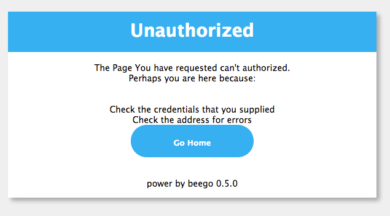

+++
title = "errorHanding"
date = 2024-02-04T09:59:10+08:00
weight = 12
type = "docs"
description = ""
isCJKLanguage = true
draft = false

+++

> 原文：[https://beego.wiki/docs/mvc/controller/errors/]()

# Error Handling 错误处理


## Error Handling 错误处理

In web development, we need to be able to redirect pages and handle errors. Beego uses `Redirect` for page redirection and error handling:

​	在 Web 开发中，我们需要能够重定向页面并处理错误。Beego 使用 `Redirect` 进行页面重定向和错误处理：

```go
func (this *AddController) Get() {
	this.Redirect("/", 302)
}
```

If you want to stop this request and throw an exception, you can do this in Beego’s controller:

​	如果您想停止此请求并抛出异常，可以在 Beego 的控制器中执行此操作：

```go
func (this *MainController) Get() {
	this.Abort("401")
	v := this.GetSession("asta")
	if v == nil {
		this.SetSession("asta", int(1))
		this.Data["Email"] = 0
	} else {
		this.SetSession("asta", v.(int)+1)
		this.Data["Email"] = v.(int)
	}
	this.TplName = "index.tpl"
}
```

The `this.Abort("401")` will stop any further execution and it will show this page:

​	 `this.Abort("401")` 将停止任何进一步的执行，并将显示此页面：



Beego supports 404, 401, 403, 500, 503 error handling by default. You can also define a custom error handling page. For example redefined 404 page:

​	Beego 默认支持 404、401、403、500、503 错误处理。您还可以定义自定义错误处理页面。例如，重新定义 404 页面：

```go
func page_not_found(rw http.ResponseWriter, r *http.Request){
	t,_:= template.ParseFiles(web.BConfig.WebConfig.ViewsPath +"/404.html")
	data :=make(map[string]interface{})
	data["content"] = "page not found"
	t.Execute(rw, data)
}

func main() {
	web.ErrorHandler("404",page_not_found)
	web.Router("/", &controllers.MainController{})
	web.Run()
}
```

We can therefore define our own `404.html` page to handle a 404 error.

​	因此，我们可以定义自己的 `404.html` 页面来处理 404 错误。

Another cool feature of Beego is support for customized string error handling functions, such as the code below which registers a database error page:

​	Beego 的另一个很酷的功能是对自定义字符串错误处理函数的支持，例如以下代码注册了一个数据库错误页面：

```go
func dbError(rw http.ResponseWriter, r *http.Request){
	t,_:= template.ParseFiles(web.BConfig.WebConfig.ViewsPath+"/dberror.html")
	data :=make(map[string]interface{})
	data["content"] = "database is now down"
	t.Execute(rw, data)
}

func main() {
	web.ErrorHandler("dbError",dbError)
	web.Router("/", &controllers.MainController{})
	web.Run()
}
```

After registering this error handling code, you can call `this.Abort("dbError")` at any point in your code to handle the database error.

​	注册此错误处理代码后，您可以在代码中的任何位置调用 `this.Abort("dbError")` 来处理数据库错误。

# Controller define Error 控制器定义错误

Beego version 1.4.3 added support for Controller defined Error handlers, so we can use the `web.Controller` and `template.Render` context functions

​	Beego 版本 1.4.3 添加了对控制器定义的错误处理程序的支持，因此我们可以使用 `web.Controller` 和 `template.Render` 上下文函数

```go
package controllers

import (
	"github.com/beego/beego/v2/server/web"
)

type ErrorController struct {
	web.Controller
}

func (c *ErrorController) Error404() {
	c.Data["content"] = "page not found"
	c.TplName = "404.tpl"
}

func (c *ErrorController) Error500() {
	c.Data["content"] = "internal server error"
	c.TplName = "500.tpl"
}

func (c *ErrorController) ErrorDb() {
	c.Data["content"] = "database is now down"
	c.TplName = "dberror.tpl"
}
```

From the example we can see that all the error handling functions have the prefix `Error`，the other string is the name of `Abort`，like `Error404` match `Abort("404")`

​	从示例中我们可以看到所有的错误处理函数都有前缀 `Error` ，另一个字符串是 `Abort` 的名称，如 `Error404` 匹配 `Abort("404")`

Use `web.ErrorController` to register the error controller before `web.Run`

​	在 `web.Run` 之前使用 `web.ErrorController` 注册错误控制器

```go
package main

import (
	_ "btest/routers"
	"btest/controllers"

	"github.com/beego/beego/v2/server/web"
)

func main() {
	web.ErrorController(&controllers.ErrorController{})
	web.Run()
}
```
