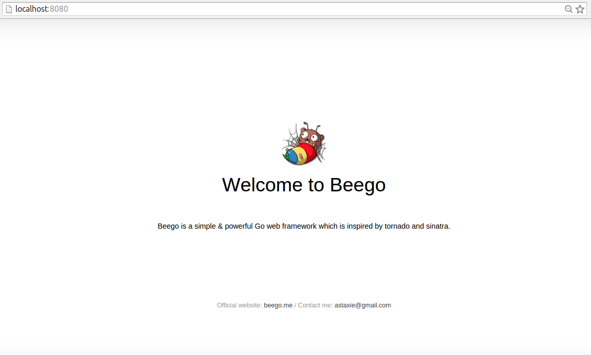

+++
title = "创建新项目"
date = 2024-02-04T09:09:54+08:00
weight = 1
type = "docs"
description = ""
isCJKLanguage = true
draft = false

+++

> 原文：[https://beego.wiki/docs/quickstart/new/]()

# Create a new project 创建新项目


## Requirements 要求

Before starting any Beego project make sure that you have installed the `bee` tool and the `beego` package. If you don’t have them yet please read [Installing beego]() and [Installing bee tool]() before you proceed.

​	在启动任何 Beego 项目之前，请确保已安装 `bee` 工具和 `beego` 包。如果您还没有，请在继续之前阅读安装 beego 和安装 bee 工具。

# Creating a new project 创建新项目

Create a new Beego project with the [`bee` command]().

​	使用 `bee` 命令创建新的 Beego 项目。

Open a terminal to your `$GOPATH` directory and enter `bee new quickstart`:

​	在 `$GOPATH` 目录中打开终端并输入 `bee new quickstart` ：

```
➜  src  bee new quickstart
[INFO] Creating application...
/gopath/src/quickstart/
/gopath/src/quickstart/conf/
/gopath/src/quickstart/controllers/
/gopath/src/quickstart/models/
/gopath/src/quickstart/routers/
/gopath/src/quickstart/tests/
/gopath/src/quickstart/static/
/gopath/src/quickstart/static/js/
/gopath/src/quickstart/static/css/
/gopath/src/quickstart/static/img/
/gopath/src/quickstart/views/
/gopath/src/quickstart/conf/app.conf
/gopath/src/quickstart/controllers/default.go
/gopath/src/quickstart/views/index.tpl
/gopath/src/quickstart/routers/router.go
/gopath/src/quickstart/tests/default_test.go
2015/05/02 11:55:28 [SUCC] New application successfully created!
```

The bee tool has created a new Beego project with the following structure:

​	bee 工具已创建具有以下结构的新 Beego 项目：

```
quickstart
├── conf
│   └── app.conf
├── controllers
│   └── default.go
├── main.go
├── models
├── routers
│   └── router.go
├── static
│   ├── css
│   ├── img
│   └── js
├── tests
│   └── default_test.go
└── views
    └── index.tpl
```

This is a typical MVC application and `main.go` is the project’s main file.

​	这是一个典型的 MVC 应用程序， `main.go` 是项目的源文件。

## Running project 运行项目

Go to the path of the newly created project and enter `bee run` to compile and run the project.

​	转到新创建项目的路径并输入 `bee run` 来编译并运行项目。

```
➜  src  cd quickstart
➜  quickstart  bee run
2015/05/02 12:01:31 [INFO] Uses 'quickstart' as 'appname'
2015/05/02 12:01:31 [INFO] Initializing watcher...
2015/05/02 12:01:31 [TRAC] Directory(/gopath/src/quickstart/controllers)
2015/05/02 12:01:31 [TRAC] Directory(/gopath/src/quickstart)
2015/05/02 12:01:31 [TRAC] Directory(/gopath/src/quickstart/routers)
2015/05/02 12:01:31 [TRAC] Directory(/gopath/src/quickstart/tests)
2015/05/02 12:01:31 [INFO] Start building...
2015/05/02 12:01:36 [SUCC] Build was successful
2015/05/02 12:01:36 [INFO] Restarting quickstart ...
2015/05/02 12:01:36 [INFO] ./quickstart is running...
2015/05/02 12:01:38 [app.go:103] [I] http server Running on :8080
```

The web application will run on the default Beego port `8080`. All of this has been accomplished using only Go and Beego, without the need for nginx or apache. Let’s look at our application in the browser now:

​	Web 应用程序将在默认的 Beego 端口 `8080` 上运行。所有这些都仅使用 Go 和 Beego 完成，无需 nginx 或 apache。现在让我们在浏览器中查看我们的应用程序：



Beego makes it so easy to create a web application! Let’s dive into the project now and see how everything works in the [next section]().

​	Beego 使创建 Web 应用程序变得如此容易！让我们现在深入研究该项目，并在下一节中了解一切是如何工作的。
