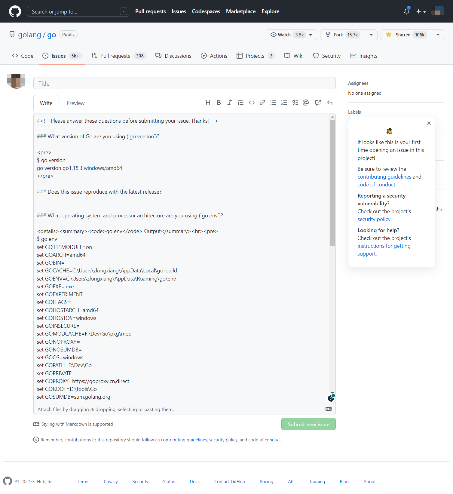

+++
title = "go1.19.3"
date = 2023-05-17T09:59:21+08:00
type = "docs"
weight = 4
description = ""
isCJKLanguage = true
draft = false

+++

# go

> 原文：[https://pkg.go.dev/cmd/go@go1.19.3](https://pkg.go.dev/cmd/go@go1.19.3)

### Overview 概述

​	Go是一个管理Go源代码的工具。

用法：

```shell 
go <command> [arguments]
```

这些命令（目前18个）是：

```shell 
bug         start a bug report 
			=> 开始一个bug报告
			
build       compile packages and dependencies 
			=> 编译包和依赖项
			
clean       remove object files and cached files 
			=> 删除对象文件和缓存文件
			
doc         show documentation for package or symbol 
			=> 显示包或符号的文档
			
env         print Go environment information 
			=> 打印Go环境信息
			
fix         update packages to use new APIs 
			=> 更新包以使用新的 API
			
fmt         gofmt (reformat) package sources 
			=> (重新格式化）包来源
			
generate    generate Go files by processing source 
			=> 通过处理源文件生成 Go 文件
			
get         add dependencies to current module and install them 			
			=> 为当前模块添加依赖项并安装它们
			
install     compile and install packages and dependencies 
			=> 编译并安装包和依赖项
			
list        list packages or modules 
			=> 列出包或模块
			
mod         module maintenance 
			=> 模块维护
			
work        workspace maintenance 
			=> 工作区维护
			
run         compile and run Go program 
			=> 编译和运行Go程序
			
test        test packages 
			=> 测试包
			
tool        run specified go tool 
			=> 运行指定的 go工具
			
version     print Go version 
			=> 打印 Go 版本
			
vet         report likely mistakes in packages 
			=> 报告包中可能存在的错误
```

使用 "`go help <command>`"获得更多关于命令的信息。

其他帮助主题：

```
buildconstraint build constraints
buildmode       build modes
c               calling between Go and C
cache           build and test caching
environment     environment variables
filetype        file types
go.mod          the go.mod file
gopath          GOPATH environment variable
gopath-get      legacy GOPATH go get
goproxy         module proxy protocol
importpath      import path syntax
modules         modules, module versions, and more
module-get      module-aware go get
module-auth     module authentication using go.sum
packages        package lists and patterns
private         configuration for downloading non-public code
testflag        testing flags
testfunc        testing functions
vcs             controlling version control with GOVCS
```

使用 "`go help <topic>`"获得更多关于该主题的信息。

#### Start a bug report  开始一个bug报告

使用方法：

```shell 
go bug
```

Bug打开默认的浏览器并启动一个新的错误报告。该报告包括有用的系统信息。



#### Compile packages and dependencies  编译包和依赖项

使用方法：

```shell 
go build [-o output] [build flags] [packages]
```

Build compiles the packages named by the import paths, along with their dependencies, but it does not install the results.

Build编译由导入路径命名的包，以及它们的依赖关系，但它并不安装这些结果。

If the arguments to build are a list of .go files from a single directory, build treats them as a list of source files specifying a single package.

如果 build 的参数是一个单一目录下的 .go 文件列表，build 会将其视为指定单一包的源文件列表。

When compiling packages, build ignores files that end in '_test.go'.

当编译包时，build 忽略了以 '_test.go' 结尾的文件。

When compiling a single main package, build writes the resulting executable to an output file named after the first source file ('go build ed.go rx.go' writes 'ed' or 'ed.exe') or the source code directory ('go build unix/sam' writes 'sam' or 'sam.exe'). The '.exe' suffix is added when writing a Windows executable.

当编译一个主包时，build 将生成的可执行文件写入以第一个源文件命名的输出文件（'go build ed.go rx.go'写'ed'或'ed.exe'）或源代码目录（'go build unix/sam' 写'sam'或'sam.exe'）。当编写Windows可执行文件时，会添加'.exe'后缀。

When compiling multiple packages or a single non-main package, build compiles the packages but discards the resulting object, serving only as a check that the packages can be built.

当编译多个包或单个非主包时，build 会编译这些包，但会丢弃生成的对象，只作为检查包是否可以被编译。

The -o flag forces build to write the resulting executable or object to the named output file or directory, instead of the default behavior described in the last two paragraphs. If the named output is an existing directory or ends with a slash or backslash, then any resulting executables will be written to that directory.

-o 标志强制 build 将生成的可执行文件或对象写入指定的输出文件或目录，而不是上两段中描述的默认行为。如果指定的输出是一个现有的目录，或者以斜线或反斜线结尾，那么任何结果的可执行文件都将被写入该目录。

The -i flag installs the packages that are dependencies of the target. The -i flag is deprecated. Compiled packages are cached automatically.

-i标志会安装作为目标依赖的包。-i标志已被弃用。编译的包会被自动缓存。

The build flags are shared by the build, clean, get, install, list, run, and test commands:

build、clean、get、install、list、run和test等命令都有的构建标志：

```
-a
	force rebuilding of packages that are already up-to-date.
	=> 强制重建已经是最新版本的包。
	
-n
	print the commands but do not run them.
	=> 打印命令但不运行它们。
	
-p n
	the number of programs, such as build commands or test binaries, that can be run in parallel. 	  The default is GOMAXPROCS, normally the number of CPUs available.
	=> （可以并行运行的）程序数量，如构建命令或测试二进制文件，默认是GOMAXPROCS，通常是可用的CPU数量。
	
-race
	enable data race detection.
	Supported only on linux/amd64, freebsd/amd64, darwin/amd64, darwin/arm64, windows/amd64,
	linux/ppc64le and linux/arm64 (only for 48-bit VMA).
	=> 启用数据竞争检测。
	仅在linux/amd64、freebsd/amd64、darwin/amd64、darwin/arm64、windows/amd64、
	linux/ppc64le和linux/arm64（仅支持48位VMA）上支持。
	
-msan
	enable interoperation with memory sanitizer.
	Supported only on linux/amd64, linux/arm64
	and only with Clang/LLVM as the host C compiler.
	On linux/arm64, pie build mode will be used.
	=> 启用与内存净化器的互操作。
	仅在linux/amd64、linux/arm64上支持，
	并且仅在Clang/LLVM作为主机C编译器时支持。
	在linux/arm64上，将使用pie构建模式。
	
-asan
	enable interoperation with address sanitizer.
	Supported only on linux/arm64, linux/amd64.
	Supported only on linux/amd64 or linux/arm64 and only with GCC 7 and higher
	or Clang/LLVM 9 and higher.
	=> 启用与地址净化器的互操作。
	仅在linux/arm64、linux/amd64上支持。
	仅在linux/amd64或linux/arm64，和仅在GCC 7及以上版本中
	或Clang/LLVM 9及以上版本上支持。
	
-v
	print the names of packages as they are compiled.
	=> 在编译过程中打印包的名称。
	
-work
	print the name of the temporary work directory and
	do not delete it when exiting.
	=> 打印临时工作目录的名称，并且在退出时不删除它。
	
-x
	print the commands.
	=> 打印命令。
	
-asmflags '[pattern=]arg list'
	arguments to pass on each go tool asm invocation.
	=> 每次调用 "go tool asm" 时要传递的参数。
	
-buildmode mode
	build mode to use. See 'go help buildmode' for more.
	=> 使用的构建模式。参见'go help buildmode'了解更多。
	
-buildvcs
	Whether to stamp binaries with version control information
	("true", "false", or "auto"). By default ("auto"), version control
	information is stamped into a binary if the main package, the main module
	containing it, and the current directory are all in the same repository.
	Use -buildvcs=false to always omit version control information, or
	-buildvcs=true to error out if version control information is available but
	cannot be included due to a missing tool or ambiguous directory structure.
	=> 	是否在二进制文件中加入版本控制信息（"true"，"false"，或 "auto"）。
	默认情况下（"auto"），如果main包、包含它的主模块和当前目录都在同一个版本库中，
	版本控制信息就会被压印到二进制文件中。	
	使用 -buildvcs=false 始终省略版本控制信息，
	或者使用 -buildvcs=true 在版本控制信息可用但由于缺少工具或目录结构不明确而无法包含时出错。
	
-compiler name
	name of compiler to use, as in runtime.Compiler (gccgo or gc).
	=> 要使用的编译器名称，如runtime.Compiler（gccgo 或 gc）。
	
-gccgoflags '[pattern=]arg list'
	arguments to pass on each gccgo compiler/linker invocation.
	=> 每次调用gccgo编译器/链接器时要传递的参数。
	
-gcflags '[pattern=]arg list'
	arguments to pass on each go tool compile invocation.
	=> 在每次调用"go tool compile"要传递的参数。
	
-installsuffix suffix
	a suffix to use in the name of the package installation directory,
	in order to keep output separate from default builds.
	If using the -race flag, the install suffix is automatically set to race
	or, if set explicitly, has _race appended to it. Likewise for the -msan
	and -asan flags. Using a -buildmode option that requires non-default compile
	flags has a similar effect.
	=> 在包安装目录的名称中使用的后缀，以便使输出与默认构建分开。	
	如果使用 -race 标志，安装后缀会自动设置为race，
	或者，如果明确设置，会有 _race 附加在它上面。
	同样，-msan 和 -asan 标志也是如此。使用需要非默认编译标志的 -buildmode 选项也有类似效果。
	
-ldflags '[pattern=]arg list'
	arguments to pass on each go tool link invocation.
	=> 每次调用"go tool link"时要传递的参数。
	
-linkshared
	build code that will be linked against shared libraries previously
	created with -buildmode=shared.
	=> 构建的代码将与之前用-buildmode=shared创建的共享库链接。
	
-mod mode
	module download mode to use: readonly, vendor, or mod.
	By default, if a vendor directory is present and the go version in go.mod
	is 1.14 or higher, the go command acts as if -mod=vendor were set.
	Otherwise, the go command acts as if -mod=readonly were set.
	See https://golang.org/ref/mod#build-commands for details.
	=> 	要使用的模块下载模式：readonly、vendor 或 mod。
	默认情况下，如果存在一个vendor目录，并且go.mod中的go版本是1.14或更高，go命令就像设置了-mod=vendor。
	否则，go命令会像设置了 -mod=readonly 一样行事。
	详见 https://golang.org/ref/mod#build-commands。
	
-modcacherw
	leave newly-created directories in the module cache read-write
	instead of making them read-only.
	=> 将新创建的目录留在模块缓存中的读写位置，而不是让它们成为只读。
	
-modfile file
	in module aware mode, read (and possibly write) an alternate go.mod
	file instead of the one in the module root directory. A file named
	"go.mod" must still be present in order to determine the module root
	directory, but it is not accessed. When -modfile is specified, an
	alternate go.sum file is also used: its path is derived from the
	-modfile flag by trimming the ".mod" extension and appending ".sum".
	=> 	在模块感知模式下，读取（也可能写入）一个备用的go.mod文件，而不是模块根目录下的文件。
	一个名为 "go.mod "的文件必须仍然存在，以确定模块根目录，但它不会被访问。
	当-modfile被指定时，另一个go.Sum文件也被使用：它的路径由-modfile标志通过去掉".mod"扩展名和追加".sum"后缀名。
	
-overlay file
	read a JSON config file that provides an overlay for build operations.
	The file is a JSON struct with a single field, named 'Replace', that
	maps each disk file path (a string) to its backing file path, so that
	a build will run as if the disk file path exists with the contents
	given by the backing file paths, or as if the disk file path does not
	exist if its backing file path is empty. Support for the -overlay flag
	has some limitations: importantly, cgo files included from outside the
	include path must be in the same directory as the Go package they are
	included from, and overlays will not appear when binaries and tests are
	run through go run and go test respectively.
	=> 读取一个JSON配置文件，为构建操作提供一个覆盖。
	该文件是一个JSON结构，有一个名为 "Replace "的字段。	将每个磁盘文件路径（一个字符串）映射到其支持的文件路径，以便 构建将在磁盘文件路径存在的情况下运行，其内容为 的情况下运行，或者，如果磁盘文件路径的备份文件路径是	存在，如果它的支持文件路径是空的。对-overlay标志的支持	的支持有一些限制：重要的是，从include路径以外包含的cgo文件必须在同一目录下。包含路径之外的 cgo 文件必须与它们所包含的 Go 包在同一目录中，而且覆盖将不会	包括在同一目录中，而且当二进制文件和测试分别通过 go run 和 go test 运行时，覆盖不会出现 运行时，覆盖不会出现。
	
-pkgdir dir
	install and load all packages from dir instead of the usual locations.
	For example, when building with a non-standard configuration,
	use -pkgdir to keep generated packages in a separate location.
	=> 从 dir 安装并加载所有包，而不是通常的位置。例如，在使用非标准配置构建时。使用 -pkgdir 将生成的包保存在一个单独的位置。
	
-tags tag,list
	a comma-separated list of additional build tags to consider satisfied
	during the build. For more information about build tags, see
	'go help buildconstraint'. (Earlier versions of Go used a
	space-separated list, and that form is deprecated but still recognized.)
	=> 逗号分隔的附加构建标签列表，以考虑在构建过程中满足 构建过程中要考虑满足的额外构建标签。关于构建标签的更多信息，见  'go help buildconstraint'。(早期版本的 Go 使用一个	空格分隔的列表，这种形式已被淘汰，但仍被认可）。
	
-trimpath
	remove all file system paths from the resulting executable.
	Instead of absolute file system paths, the recorded file names
	will begin either a module path@version (when using modules),
	or a plain import path (when using the standard library, or GOPATH).
	=> 从生成的可执行文件中删除所有文件系统的路径。
	取代绝对文件系统路径，记录的文件名	将以模块路径@版本开始（当使用模块时）。	或者一个普通的导入路径（当使用标准库或GOPATH时）。
	
-toolexec 'cmd args'
	a program to use to invoke toolchain programs like vet and asm.
	For example, instead of running asm, the go command will run
	'cmd args /path/to/asm <arguments for asm>'.
	The TOOLEXEC_IMPORTPATH environment variable will be set,
	matching 'go list -f {{.ImportPath}}' for the package being built.
	=> 一个用来调用工具链程序的程序，如vet和asm。
	例如，代替运行asm，go命令将运行	'cmd args /path/to/asm < asm的参数>'。
	TOOLEXEC_IMPORTPATH环境变量将被设置。
	匹配'go list -f {{.ImportPath}}'，用于正在构建的包。
```

The -asmflags, -gccgoflags, -gcflags, and -ldflags flags accept a space-separated list of arguments to pass to an underlying tool during the build. To embed spaces in an element in the list, surround it with either single or double quotes. The argument list may be preceded by a package pattern and an equal sign, which restricts the use of that argument list to the building of packages matching that pattern (see 'go help packages' for a description of package patterns). Without a pattern, the argument list applies only to the packages named on the command line. The flags may be repeated with different patterns in order to specify different arguments for different sets of packages. If a package matches patterns given in multiple flags, the latest match on the command line wins. For example, 'go build -gcflags=-S fmt' prints the disassembly only for package fmt, while 'go build -gcflags=all=-S fmt' prints the disassembly for fmt and all its dependencies.

-asmflags、-gccgoflags、-gcflags和-ldflags标志接受一个用空格分隔的参数列表，在构建过程中传递给底层工具。要在列表中的某个元素中嵌入空格，可以用单引号或双引号将其包围。参数列表前面可以有一个包模式和一个等号，它将参数列表的使用限制在构建与该模式相匹配的包上（参见 "go help packages "中对包模式的描述）。如果没有模式，参数列表只适用于命令行上命名的包。这些标志可以用不同的模式重复使用，以便为不同的包组指定不同的参数。如果一个包与多个标志中给出的模式相匹配，命令行中最新的匹配将获胜。例如，"go build -gcflags=-S fmt "只打印包fmt的反汇编，而 "go build -gcflags=all=-S fmt "则打印fmt和它所有依赖项的反汇编。

For more about specifying packages, see 'go help packages'. For more about where packages and binaries are installed, run 'go help gopath'. For more about calling between Go and C/C++, run 'go help c'.

更多关于指定包的信息，请参见'go help packages'。更多关于包和二进制文件的安装位置，运行'go help gopath'。更多关于Go和C/C++之间的调用，运行'go help c'。

Note: Build adheres to certain conventions such as those described by 'go help gopath'. Not all projects can follow these conventions, however. Installations that have their own conventions or that use a separate software build system may choose to use lower-level invocations such as 'go tool compile' and 'go tool link' to avoid some of the overheads and design decisions of the build tool.

注意：Build遵守某些惯例，如'go help gopath'所描述的那些。然而，并不是所有的项目都能遵循这些约定。那些有自己的约定或者使用单独的软件构建系统的安装项目可以选择使用较低级别的调用，比如'go tool compile'和'go tool link'，以避免一些构建工具的开销和设计决定。

See also: go install, go get, go clean.

参见：go install、go get、go clean。

#### Remove object files and cached files  删除对象文件和缓存文件∥。


使用方法：

```shell 
go clean [clean flags] [build flags] [packages]
```

Clean removes object files from package source directories. The go command builds most objects in a temporary directory, so go clean is mainly concerned with object files left by other tools or by manual invocations of go build.

Clean从包源目录中删除对象文件。go命令在一个临时目录中构建大多数对象，所以go clean主要关注其他工具或手动调用go build时留下的对象文件。

If a package argument is given or the -i or -r flag is set, clean removes the following files from each of the source directories corresponding to the import paths:

如果给出了包的参数或设置了-i或-r标志，clean会从对应于导入路径的每个源目录中删除以下文件：

```
_obj/            old object directory, left from Makefiles
_test/           old test directory, left from Makefiles
_testmain.go     old gotest file, left from Makefiles
test.out         old test log, left from Makefiles
build.out        old test log, left from Makefiles
*.[568ao]        object files, left from Makefiles

DIR(.exe)        from go build
DIR.test(.exe)   from go test -c
MAINFILE(.exe)   from go build MAINFILE.go
*.so             from SWIG
```

In the list, DIR represents the final path element of the directory, and MAINFILE is the base name of any Go source file in the directory that is not included when building the package.

在列表中，DIR代表目录的最后一个路径元素，MAINFILE是该目录中任何在构建包时未包含的Go源代码文件的基本名称。

The -i flag causes clean to remove the corresponding installed archive or binary (what 'go install' would create).

-i 标志使 clean 移除相应的已安装的归档文件或二进制文件（"go install "会创建）。

The -n flag causes clean to print the remove commands it would execute, but not run them.

n标志使clean打印它将执行的删除命令，但不运行它们。

The -r flag causes clean to be applied recursively to all the dependencies of the packages named by the import paths.

-r 标志使 clean 递归地应用于由导入路径命名的包的所有依赖关系。

The -x flag causes clean to print remove commands as it executes them.

-x标志使clean在执行删除命令时打印这些命令。

The -cache flag causes clean to remove the entire go build cache.

-cache 标志使 clean 移除整个 go build 缓存。

The -testcache flag causes clean to expire all test results in the go build cache.

-testcache标志使clean在go build cache中过期所有的测试结果。

The -modcache flag causes clean to remove the entire module download cache, including unpacked source code of versioned dependencies.

-modcache标志使clean删除整个模块下载缓存，包括版本依赖的未打包的源代码。

The -fuzzcache flag causes clean to remove files stored in the Go build cache for fuzz testing. The fuzzing engine caches files that expand code coverage, so removing them may make fuzzing less effective until new inputs are found that provide the same coverage. These files are distinct from those stored in testdata directory; clean does not remove those files.

-fuzzcache标志使clean删除存储在Go build cache中的文件，用于模糊测试。模糊测试引擎缓存了扩大代码覆盖率的文件，因此删除这些文件可能会降低模糊测试的效率，直到找到能提供相同覆盖率的新输入。这些文件与存储在testdata目录中的文件不同；clean不会删除这些文件。

For more about build flags, see 'go help build'.

关于构建标志的更多信息，请参见 "go help build"。

For more about specifying packages, see 'go help packages'.

更多关于指定包的信息，请参见 "go help packages"。

#### Show documentation for package or symbol  显示包或符号的文档

使用方法：

```shell 
go doc [doc flags] [package|[package.]symbol[.methodOrField]]
```

Doc prints the documentation comments associated with the item identified by its arguments (a package, const, func, type, var, method, or struct field) followed by a one-line summary of each of the first-level items "under" that item (package-level declarations for a package, methods for a type, etc.).

文档打印与参数标识的项目（包、const、func、类型、var、方法或结构域）相关的文档注释，然后是该项目 "下 "的每个一级项目（包的包级声明、类型的方法，等等）的单行摘要。

Doc accepts zero, one, or two arguments.

Doc接受零、一或两个参数。

Given no arguments, that is, when run as

在没有参数的情况下，也就是说，当运行为

```shell 
go doc
```

it prints the package documentation for the package in the current directory. If the package is a command (package main), the exported symbols of the package are elided from the presentation unless the -cmd flag is provided.

时，它会打印出当前目录下的包的文档。如果包是一个命令（包main），除非提供了-cmd标志，否则包的导出符号将从演示中省略。

When run with one argument, the argument is treated as a Go-syntax-like representation of the item to be documented. What the argument selects depends on what is installed in GOROOT and GOPATH, as well as the form of the argument, which is schematically one of these:

当运行时有一个参数，该参数被视为要记录的项目的类似Go-syntax的表述。参数选择的内容取决于GOROOT和GOPATH中安装的内容，以及参数的形式，从图上看是其中之一：

```shell 
go doc <pkg>
go doc <sym>[.<methodOrField>]
go doc [<pkg>.]<sym>[.<methodOrField>]
go doc [<pkg>.][<sym>.]<methodOrField>
```

The first item in this list matched by the argument is the one whose documentation is printed. (See the examples below.) However, if the argument starts with a capital letter it is assumed to identify a symbol or method in the current directory.

这个列表中由参数匹配的第一个项目是其文档被打印的项目。(见下面的例子。)然而，如果参数以大写字母开头，则假定它是指当前目录中的一个符号或方法。

For packages, the order of scanning is determined lexically in breadth-first order. That is, the package presented is the one that matches the search and is nearest the root and lexically first at its level of the hierarchy. The GOROOT tree is always scanned in its entirety before GOPATH.

对于包来说，扫描的顺序是按广度第一的顺序来确定的。也就是说，所呈现的包是与搜索相匹配的，并且是离根最近的，在其层次结构中词法第一的。GOROOT树总是在GOPATH之前被完整地扫描。

If there is no package specified or matched, the package in the current directory is selected, so "go doc Foo" shows the documentation for symbol Foo in the current package.

如果没有指定或匹配的包，则选择当前目录下的包，所以 "go doc Foo "显示当前包中符号Foo的文档。

The package path must be either a qualified path or a proper suffix of a path. The go tool's usual package mechanism does not apply: package path elements like . and ... are not implemented by go doc.

包的路径必须是一个合格的路径或者是一个路径的适当后缀。go工具通常的包机制并不适用：像.和...这样的包路径元素并没有被go doc实现。

When run with two arguments, the first is a package path (full path or suffix), and the second is a symbol, or symbol with method or struct field:

当运行时有两个参数，第一个是包的路径（完整的路径或后缀），第二个是一个符号，或带有方法或结构域的符号：

```shell 
go doc <pkg> <sym>[.<methodOrField>]
```

In all forms, when matching symbols, lower-case letters in the argument match either case but upper-case letters match exactly. This means that there may be multiple matches of a lower-case argument in a package if different symbols have different cases. If this occurs, documentation for all matches is printed.

在所有形式中，当匹配符号时，参数中的小写字母可以匹配任何一种情况，但大写字母则完全匹配。这意味着，如果不同的符号有不同的大小写，在一个包中可能有多个小写参数的匹配。如果发生这种情况，将打印所有匹配的文档。

Examples:

例子

```shell 
go doc
	Show documentation for current package.
go doc Foo
	Show documentation for Foo in the current package.
	(Foo starts with a capital letter so it cannot match
	a package path.)
go doc encoding/json
	Show documentation for the encoding/json package.
go doc json
	Shorthand for encoding/json.
go doc json.Number (or go doc json.number)
	Show documentation and method summary for json.Number.
go doc json.Number.Int64 (or go doc json.number.int64)
	Show documentation for json.Number's Int64 method.
go doc cmd/doc
	Show package docs for the doc command.
go doc -cmd cmd/doc
	Show package docs and exported symbols within the doc command.
go doc template.new
	Show documentation for html/template's New function.
	(html/template is lexically before text/template)
go doc text/template.new # One argument
	Show documentation for text/template's New function.
go doc text/template new # Two arguments
	Show documentation for text/template's New function.

At least in the current tree, these invocations all print the
documentation for json.Decoder's Decode method:

go doc json.Decoder.Decode
go doc json.decoder.decode
go doc json.decode
cd go/src/encoding/json; go doc decode
```

Flags:

标志

```
-all
	Show all the documentation for the package. 显示该包的所有文档。
-c
	Respect case when matching symbols. 匹配符号时尊重大小写。
-cmd
	Treat a command (package main) like a regular package.
	Otherwise package main's exported symbols are hidden
	when showing the package's top-level documentation.
	像对待普通包一样对待一个命令（package main）。
	否则包main的输出符号会在显示包的顶层文档时被隐藏
	当显示包的顶层文档时。
-short
	One-line representation for each symbol.
		每个符号的单行表示。
-src
	Show the full source code for the symbol. This will
	display the full Go source of its declaration and
	definition, such as a function definition (including
	the body), type declaration or enclosing const
	block. The output may therefore include unexported
	details.
	显示该符号的完整源代码。这将
	显示其声明和定义的完整Go源码
	定义的全部围棋源代码，例如函数定义（包括
	体）、类型声明或封闭的 const
	块。因此，输出可能包括未输出的
	细节。
-u
	Show documentation for unexported as well as exported
	symbols, methods, and fields.
	显示未导出的以及已导出的
	符号、方法和字段。
```

#### Print Go environment information  打印Go环境信息

使用方法：

```shell 
go env [-json] [-u] [-w] [var ...]
```

Env prints Go environment information.

Env可以打印围棋环境信息。

By default env prints information as a shell script (on Windows, a batch file). If one or more variable names is given as arguments, env prints the value of each named variable on its own line.

默认情况下，env以shell脚本的形式打印信息（在Windows下为批处理文件）。如果一个或多个变量名作为参数，env会在自己的行中打印出每个变量的值。

The -json flag prints the environment in JSON format instead of as a shell script.

-json标志将环境打印成JSON格式，而不是作为一个shell脚本。

The -u flag requires one or more arguments and unsets the default setting for the named environment variables, if one has been set with 'go env -w'.

-u标志需要一个或多个参数，并且取消指定环境变量的默认设置，如果已经用 "go env -w "设置了一个环境变量的话。

The -w flag requires one or more arguments of the form NAME=VALUE and changes the default settings of the named environment variables to the given values.

-w标志需要一个或多个参数，其形式为NAME=VALUE，并将命名的环境变量的默认设置改为给定的值。

For more about environment variables, see 'go help environment'.

关于环境变量的更多信息，请参见'go help environment'。

#### Update packages to use new APIs 更新包以使用新的API

使用方法：

```shell 
go fix [-fix list] [packages]
```

Fix runs the Go fix command on the packages named by the import paths.

Fix在导入路径命名的包上运行Go fix命令。

The -fix flag sets a comma-separated list of fixes to run. The default is all known fixes. (Its value is passed to 'go tool fix -r'.)

-fix标志设置了一个以逗号分隔的修复列表，以便运行。默认是所有已知的修复。(它的值会传递给'go tool fix -r'）。

For more about fix, see 'go doc cmd/fix'. For more about specifying packages, see 'go help packages'.

关于fix的更多信息，见 "go doc cmd/fix"。关于指定包的更多信息，请参见 "go help packages"。

To run fix with other options, run 'go tool fix'.

要用其他选项运行fix，请运行'go tool fix'。

See also: go fmt, go vet.

另见：go fmt，go vet。

#### Gofmt (reformat) package sources  Gofmt(重新格式化)包的来源

使用方法：

```shell 
go fmt [-n] [-x] [packages]
```

Fmt runs the command 'gofmt -l -w' on the packages named by the import paths. It prints the names of the files that are modified.

Fmt对导入路径命名的包运行'gofmt -l -w'命令。它打印出被修改的文件的名称。

For more about gofmt, see 'go doc cmd/gofmt'. For more about specifying packages, see 'go help packages'.

关于gofmt的更多信息，见'go doc cmd/gofmt'。关于指定包的更多信息，见'go help packages'。

The -n flag prints commands that would be executed. The -x flag prints commands as they are executed.

-n 标志打印将被执行的命令。-x标志在命令被执行时打印它们。

The -mod flag's value sets which module download mode to use: readonly or vendor. See 'go help modules' for more.

-mod标志的值设置使用哪种模块下载模式：只读或供应商。更多信息见 "go help modules"。

To run gofmt with specific options, run gofmt itself.

要用特定的选项运行gofmt，请运行gofmt本身。

See also: go fix, go vet.

参见：go fix, go vet。

#### Generate Go files by processing source  通过处理源代码生成Go文件

使用方法：

```shell 
go generate [-run regexp] [-n] [-v] [-x] [build flags] [file.go... | packages]
```

Generate runs commands described by directives within existing files. Those commands can run any process but the intent is to create or update Go source files.

Generate运行现有文件中指令描述的命令。这些命令可以运行任何进程，但其目的是创建或更新 Go 源文件。

Go generate is never run automatically by go build, go test, and so on. It must be run explicitly.

Go generate不会被go build、go test等自动运行。它必须明确地运行。

Go generate scans the file for directives, which are lines of the form,

Go generate 会扫描文件中的指令，这些指令的形式是。

```shell 
//go:generate command argument...
```

(note: no leading spaces and no space in "//go") where command is the generator to be run, corresponding to an executable file that can be run locally. It must either be in the shell path (gofmt), a fully qualified path (/usr/you/bin/mytool), or a command alias, described below.

(注意：没有前导空格，"//go "中也没有空格），其中命令是要运行的生成器，对应于一个可执行文件，可以在本地运行。它必须在shell路径中（gofmt），一个完全限定的路径（/usr/you/bin/mytool），或者一个命令别名，如下所述。

Note that go generate does not parse the file, so lines that look like directives in comments or multiline strings will be treated as directives.

注意，go generate并不解析文件，所以在注释或多行字符串中看起来像指令的行将被视为指令。

The arguments to the directive are space-separated tokens or double-quoted strings passed to the generator as individual arguments when it is run.

指令的参数是空格分隔的标记或双引号字符串，在运行时作为单独的参数传递给生成器。

Quoted strings use Go syntax and are evaluated before execution; a quoted string appears as a single argument to the generator.

带引号的字符串使用Go语法，并在执行前被评估；带引号的字符串作为一个单独的参数出现在生成器中。

To convey to humans and machine tools that code is generated, generated source should have a line that matches the following regular expression (in Go syntax):

为了向人类和机器工具传达代码是生成的，生成的源代码应该有一行与以下正则表达式相匹配（用Go语法）：

```
^// Code generated .* DO NOT EDIT\.$
```

This line must appear before the first non-comment, non-blank text in the file.

这一行必须出现在文件中第一个非注释、非空白文本之前。

Go generate sets several variables when it runs the generator:

Go generate在运行生成器时设置了几个变量：

```
$GOARCH
	The execution architecture (arm, amd64, etc.)
$GOOS
	The execution operating system (linux, windows, etc.)
$GOFILE
	The base name of the file.
$GOLINE
	The line number of the directive in the source file.
$GOPACKAGE
	The name of the package of the file containing the directive.
$GOROOT
	The GOROOT directory for the 'go' command that invoked the
	generator, containing the Go toolchain and standard library.
$DOLLAR
	A dollar sign.
```

Other than variable substitution and quoted-string evaluation, no special processing such as "globbing" is performed on the command line.

除了变量替换和加引号的字符串评估外，在命令行上不进行任何特殊处理，如 "球化"。

As a last step before running the command, any invocations of any environment variables with alphanumeric names, such as $GOFILE or $HOME, are expanded throughout the command line. The syntax for variable expansion is $NAME on all operating systems. Due to the order of evaluation, variables are expanded even inside quoted strings. If the variable NAME is not set, $NAME expands to the empty string.

作为运行命令前的最后一步，任何调用字母数字名称的环境变量，如$GOFILE或$HOME，都会在整个命令行中展开。变量扩展的语法在所有操作系统上都是$NAME。由于计算顺序的关系，即使在带引号的字符串中，变量也会被展开。如果没有设置变量NAME，$NAME将扩展为空字符串。

A directive of the form,

以下形式的指令，

```
//go:generate -command xxx args...
```

specifies, for the remainder of this source file only, that the string xxx represents the command identified by the arguments. This can be used to create aliases or to handle multiword generators. For example,

的指令指定，仅在本源文件的剩余部分，字符串xxx代表由参数确定的命令。这可以用来创建别名或处理多字生成器。例如。

```
//go:generate -command foo go tool foo
```

specifies that the command "foo" represents the generator "go tool foo".

指定命令 "foo "代表生成器 "go tool foo"。

Generate processes packages in the order given on the command line, one at a time. If the command line lists .go files from a single directory, they are treated as a single package. Within a package, generate processes the source files in a package in file name order, one at a time. Within a source file, generate runs generators in the order they appear in the file, one at a time. The go generate tool also sets the build tag "generate" so that files may be examined by go generate but ignored during build.

生成器按照命令行给出的顺序，一次一个地处理包。如果命令行列出了一个目录下的.go文件，它们会被当作一个包来处理。在一个包中，generate按照文件名的顺序，一次一个地处理包中的源文件。在一个源文件中，generate按照文件中出现的顺序，一次一个地运行生成器。go generate工具还设置了构建标签 "generate"，以便文件可以被go generate检查，但在构建过程中被忽略。

For packages with invalid code, generate processes only source files with a valid package clause.

对于有无效代码的包，generate只处理有有效包条款的源文件。

If any generator returns an error exit status, "go generate" skips all further processing for that package.

如果任何生成器返回错误的退出状态，"go generate "将跳过对该包的所有进一步处理。

The generator is run in the package's source directory.

生成器在包的源代码目录下运行。

Go generate accepts one specific flag:

Go generate接受一个特定的标志：

```
-run=""
	if non-empty, specifies a regular expression to select
	directives whose full original source text (excluding
	any trailing spaces and final newline) matches the
	expression.
```

It also accepts the standard build flags including -v, -n, and -x. The -v flag prints the names of packages and files as they are processed. The -n flag prints commands that would be executed. The -x flag prints commands as they are executed.

它也接受标准的编译标志，包括-v、-n和-x。-v标志在处理包和文件时打印它们的名字。n标志打印将被执行的命令。-x标志在命令被执行时打印它们。

For more about build flags, see 'go help build'.

关于构建标志的更多信息，见 "go help build"：

For more about specifying packages, see 'go help packages'.

关于指定包的更多信息，见'go help packages'：

#### Add dependencies to current module and install them  将依赖关系添加到当前模块并安装它们

使用方法：

```shell 
go get [-t] [-u] [-v] [build flags] [packages]
```

Get resolves its command-line arguments to packages at specific module versions, updates go.mod to require those versions, and downloads source code into the module cache.

get将其命令行参数解析为特定模块版本的包，更新go.mod以要求这些版本，并下载源代码到模块缓存中。

To add a dependency for a package or upgrade it to its latest version:

要添加一个包的依赖关系或将其升级到最新版本：

```shell 
go get example.com/pkg
```

To upgrade or downgrade a package to a specific version:

要将一个包升级或降级到一个特定的版本：

```shell 
go get example.com/pkg@v1.2.3
```

To remove a dependency on a module and downgrade modules that require it:

要删除一个模块的依赖关系和降级需要它的模块：

```shell 
go get example.com/mod@none
```

See https://golang.org/ref/mod#go-get for details.

详见https://golang.org/ref/mod#go-get。

In earlier versions of Go, 'go get' was used to build and install packages. Now, 'go get' is dedicated to adjusting dependencies in go.mod. 'go install' may be used to build and install commands instead. When a version is specified, 'go install' runs in module-aware mode and ignores the go.mod file in the current directory. For example:

在Go的早期版本中，'go get'被用来构建和安装包。现在，'go get'专门用来调整go.mod中的依赖关系。'go install'可以用来代替构建和安装命令。当指定一个版本时，'go install'在模块感知模式下运行，忽略当前目录下的go.mod文件。比如说：

```shell 
go install example.com/pkg@v1.2.3
go install example.com/pkg@latest
```

See 'go help install' or https://golang.org/ref/mod#go-install for details.

详情见'go help install'或https://golang.org/ref/mod#go-install。

'go get' accepts the following flags.

go get "接受以下标志。

The -t flag instructs get to consider modules needed to build tests of packages specified on the command line.

-t 标志指示 get 考虑构建测试命令行上指定的包所需的模块。

The -u flag instructs get to update modules providing dependencies of packages named on the command line to use newer minor or patch releases when available.

u 标志指示 get 更新提供命令行上指定的包的依赖项的模块，以使用较新的次要或补丁版本。

The -u=patch flag (not -u patch) also instructs get to update dependencies, but changes the default to select patch releases.

-u=patch 标志（不是 -u patch）也指示 get 更新依赖关系，但改变了默认的选择补丁版本。

When the -t and -u flags are used together, get will update test dependencies as well.

当-t和-u标志一起使用时，get也会更新测试依赖。

The -x flag prints commands as they are executed. This is useful for debugging version control commands when a module is downloaded directly from a repository.

-x标志在执行时打印命令。当一个模块直接从版本库下载时，这对调试版本控制命令很有用。

For more about modules, see https://golang.org/ref/mod.

关于模块的更多信息，见https://golang.org/ref/mod。

For more about specifying packages, see 'go help packages'.

关于指定包的更多信息，见'go help packages'。

This text describes the behavior of get using modules to manage source code and dependencies. If instead the go command is running in GOPATH mode, the details of get's flags and effects change, as does 'go help get'. See 'go help gopath-get'.

这段文字描述了使用模块来管理源代码和依赖关系的get的行为。如果go命令是在GOPATH模式下运行，get的标志和效果的细节就会改变，'go help get'也是如此。参见 "go help gopath-get"。

See also: go build, go install, go clean, go mod.

另见：go build、go install、go clean、go mod。

#### Compile and install packages and dependencies  编译和安装包和依赖项

使用方法：

```shell 
go install [build flags] [packages]
```

Install compiles and installs the packages named by the import paths.

安装编译并安装由导入路径命名的包。

Executables are installed in the directory named by the GOBIN environment variable, which defaults to $GOPATH/bin or $HOME/go/bin if the GOPATH environment variable is not set. Executables in $GOROOT are installed in $GOROOT/bin or $GOTOOLDIR instead of $GOBIN.

可执行文件被安装在由GOBIN环境变量命名的目录中，如果没有设置GOPATH环境变量，则默认为$GOPATH/bin或$HOME/go/bin。$GOROOT中的可执行文件会安装在$GOROOT/bin或$GOTOOLDIR中，而不是$GOBIN。

If the arguments have version suffixes (like @latest or @v1.0.0), "go install" builds packages in module-aware mode, ignoring the go.mod file in the current directory or any parent directory, if there is one. This is useful for installing executables without affecting the dependencies of the main module. To eliminate ambiguity about which module versions are used in the build, the arguments must satisfy the following constraints:

如果参数有版本后缀（如@latest或@v1.0.0），"go install "将以模块感知模式构建包，忽略当前目录或任何父目录中的go.mod文件，如果有的话。这对于安装可执行文件而不影响主模块的依赖关系很有用。为了消除在构建中使用哪些模块版本的歧义，参数必须满足以下限制。

\- Arguments must be package paths or package patterns (with "..." wildcards). They must not be standard packages (like fmt), meta-patterns (std, cmd, all), or relative or absolute file paths.

- 参数必须是包路径或包模式（有"... "通配符）。它们不能是标准包（如fmt）、元模式（std、cmd、all）或相对或绝对文件路径。

\- All arguments must have the same version suffix. Different queries are not allowed, even if they refer to the same version.

- 所有参数必须有相同的版本后缀。不同的查询是不允许的，即使它们引用的是同一个版本。

\- All arguments must refer to packages in the same module at the same version.

- 所有参数必须引用同一模块中同一版本的包。

\- Package path arguments must refer to main packages. Pattern arguments will only match main packages.

- 包路径参数必须指的是主包。模式参数将只匹配主包。

\- No module is considered the "main" module. If the module containing packages named on the command line has a go.mod file, it must not contain directives (replace and exclude) that would cause it to be interpreted differently than if it were the main module. The module must not require a higher version of itself.

- 没有模块被认为是 "主 "模块。如果包含命令行上命名的包的模块有一个go.mod文件，它不能包含指令（替换和排除），这将导致它的解释与主模块不同。该模块不能要求自己有更高的版本。

\- Vendor directories are not used in any module. (Vendor directories are not included in the module zip files downloaded by 'go install'.)

- 在任何模块中都不使用供应商目录。(供应商目录不包括在'go install'下载的模块压缩文件中)。

If the arguments don't have version suffixes, "go install" may run in module-aware mode or GOPATH mode, depending on the GO111MODULE environment variable and the presence of a go.mod file. See 'go help modules' for details. If module-aware mode is enabled, "go install" runs in the context of the main module.

如果参数没有版本后缀，"go install "可能在模块感知模式或GOPATH模式下运行，这取决于GO111MODULE环境变量和go.mod文件的存在。详情见 "go help modules"。如果启用了模块感知模式，"go install "将在主模块的上下文中运行。

When module-aware mode is disabled, other packages are installed in the directory $GOPATH/pkg/$GOOS_$GOARCH. When module-aware mode is enabled, other packages are built and cached but not installed.

当模块感知模式被禁用时，其他包被安装在$GOPATH/pkg/$GOOS_$GOARCH目录下。当模块感知模式被启用时，其他包被构建和缓存，但不安装。

The -i flag installs the dependencies of the named packages as well. The -i flag is deprecated. Compiled packages are cached automatically.

-i 标志也会安装指定包的依赖项。-i 标志已被弃用。编译的包会被自动缓存。

For more about the build flags, see 'go help build'. For more about specifying packages, see 'go help packages'.

关于构建标志的更多信息，请参见'go help build'。更多关于指定包的信息，请看'go help packages'。

See also: go build, go get, go clean.

另见：go build，go get，go clean。

#### List packages or modules  列出包或模块

使用方法：

```shell 
go list [-f format] [-json] [-m] [list flags] [build flags] [packages]
```

List lists the named packages, one per line. The most commonly-used flags are -f and -json, which control the form of the output printed for each package. Other list flags, documented below, control more specific details.

List列出了命名的包，每行一个。最常用的标志是 -f 和 -json，它们控制每个包的输出形式。其他的列表标志，如下文所述，控制更具体的细节。

The default output shows the package import path:

默认输出显示包的导入路径：

```
bytes
encoding/json
github.com/gorilla/mux
golang.org/x/net/html
```

The -f flag specifies an alternate format for the list, using the syntax of package template. The default output is equivalent to -f '{{.ImportPath}}'. The struct being passed to the template is:

-f标志指定了列表的另一种格式，使用包模板的语法。默认输出相当于-f '{{.ImportPath}}。被传递给模板的结构是：

```go 
type Package struct {
    Dir           string   // directory containing package sources
    ImportPath    string   // import path of package in dir
    ImportComment string   // path in import comment on package statement
    Name          string   // package name
    Doc           string   // package documentation string
    Target        string   // install path
    Shlib         string   // the shared library that contains this package (only set when -linkshared)
    Goroot        bool     // is this package in the Go root?
    Standard      bool     // is this package part of the standard Go library?
    Stale         bool     // would 'go install' do anything for this package?
    StaleReason   string   // explanation for Stale==true
    Root          string   // Go root or Go path dir containing this package
    ConflictDir   string   // this directory shadows Dir in $GOPATH
    BinaryOnly    bool     // binary-only package (no longer supported)
    ForTest       string   // package is only for use in named test
    Export        string   // file containing export data (when using -export)
    BuildID       string   // build ID of the compiled package (when using -export)
    Module        *Module  // info about package's containing module, if any (can be nil)
    Match         []string // command-line patterns matching this package
    DepOnly       bool     // package is only a dependency, not explicitly listed

    // Source files
    GoFiles         []string   // .go source files (excluding CgoFiles, TestGoFiles, XTestGoFiles)
    CgoFiles        []string   // .go source files that import "C"
    CompiledGoFiles []string   // .go files presented to compiler (when using -compiled)
    IgnoredGoFiles  []string   // .go source files ignored due to build constraints
    IgnoredOtherFiles []string // non-.go source files ignored due to build constraints
    CFiles          []string   // .c source files
    CXXFiles        []string   // .cc, .cxx and .cpp source files
    MFiles          []string   // .m source files
    HFiles          []string   // .h, .hh, .hpp and .hxx source files
    FFiles          []string   // .f, .F, .for and .f90 Fortran source files
    SFiles          []string   // .s source files
    SwigFiles       []string   // .swig files
    SwigCXXFiles    []string   // .swigcxx files
    SysoFiles       []string   // .syso object files to add to archive
    TestGoFiles     []string   // _test.go files in package
    XTestGoFiles    []string   // _test.go files outside package

    // Embedded files
    EmbedPatterns      []string // //go:embed patterns
    EmbedFiles         []string // files matched by EmbedPatterns
    TestEmbedPatterns  []string // //go:embed patterns in TestGoFiles
    TestEmbedFiles     []string // files matched by TestEmbedPatterns
    XTestEmbedPatterns []string // //go:embed patterns in XTestGoFiles
    XTestEmbedFiles    []string // files matched by XTestEmbedPatterns

    // Cgo directives
    CgoCFLAGS    []string // cgo: flags for C compiler
    CgoCPPFLAGS  []string // cgo: flags for C preprocessor
    CgoCXXFLAGS  []string // cgo: flags for C++ compiler
    CgoFFLAGS    []string // cgo: flags for Fortran compiler
    CgoLDFLAGS   []string // cgo: flags for linker
    CgoPkgConfig []string // cgo: pkg-config names

    // Dependency information
    Imports      []string          // import paths used by this package
    ImportMap    map[string]string // map from source import to ImportPath (identity entries omitted)
    Deps         []string          // all (recursively) imported dependencies
    TestImports  []string          // imports from TestGoFiles
    XTestImports []string          // imports from XTestGoFiles

    // Error information
    Incomplete bool            // this package or a dependency has an error
    Error      *PackageError   // error loading package
    DepsErrors []*PackageError // errors loading dependencies
}
```

Packages stored in vendor directories report an ImportPath that includes the path to the vendor directory (for example, "d/vendor/p" instead of "p"), so that the ImportPath uniquely identifies a given copy of a package. The Imports, Deps, TestImports, and XTestImports lists also contain these expanded import paths. See golang.org/s/go15vendor for more about vendoring.

存储在供应商目录中的包报告一个ImportPath，其中包括供应商目录的路径（例如，"d/vendor/p "而不是 "p"），这样ImportPath就能唯一地识别一个包的特定副本。Imports、Deps、TestImports和XTestImports列表也包含这些扩展的导入路径。参见 golang.org/s/go15vendor 了解更多关于 vendoring 的信息。

The error information, if any, is

错误信息，如果有的话，是

```go 
type PackageError struct {
    ImportStack   []string // shortest path from package named on command line to this one
    Pos           string   // position of error (if present, file:line:col)
    Err           string   // the error itself
}
```

The module information is a Module struct, defined in the discussion of list -m below.

模块信息是一个模块结构，在下面关于list -m的讨论中定义。

The template function "join" calls strings.Join.

模板函数 "join "调用 strings.Join。

The template function "context" returns the build context, defined as:

模板函数 "context "返回构建上下文，定义如下。

```go 
type Context struct {
    GOARCH        string   // target architecture
    GOOS          string   // target operating system
    GOROOT        string   // Go root
    GOPATH        string   // Go path
    CgoEnabled    bool     // whether cgo can be used
    UseAllFiles   bool     // use files regardless of +build lines, file names
    Compiler      string   // compiler to assume when computing target paths
    BuildTags     []string // build constraints to match in +build lines
    ToolTags      []string // toolchain-specific build constraints
    ReleaseTags   []string // releases the current release is compatible with
    InstallSuffix string   // suffix to use in the name of the install dir
}
```

For more information about the meaning of these fields see the documentation for the go/build package's Context type.

关于这些字段含义的更多信息，请参见go/build包的Context类型文档。

The -json flag causes the package data to be printed in JSON format instead of using the template format. The JSON flag can optionally be provided with a set of comma-separated required field names to be output. If so, those required fields will always appear in JSON output, but others may be omitted to save work in computing the JSON struct.

-json标志使包的数据以JSON格式打印，而不是使用模板格式。JSON标志可以选择提供一组用逗号分隔的所需字段名来输出。如果是这样，这些必需的字段将总是出现在JSON输出中，但其他字段可以省略，以节省计算JSON结构的工作。

The -compiled flag causes list to set CompiledGoFiles to the Go source files presented to the compiler. Typically this means that it repeats the files listed in GoFiles and then also adds the Go code generated by processing CgoFiles and SwigFiles. The Imports list contains the union of all imports from both GoFiles and CompiledGoFiles.

-compiled 标志使 list 将 CompiledGoFiles 设置为提交给编译器的 Go 源文件。通常这意味着它重复 GoFiles 中列出的文件，然后还添加处理 CgoFiles 和 SwigFiles 产生的 Go 代码。Imports 列表包含了从 GoFiles 和 CompiledGoFiles 中导入的所有文件。

The -deps flag causes list to iterate over not just the named packages but also all their dependencies. It visits them in a depth-first post-order traversal, so that a package is listed only after all its dependencies. Packages not explicitly listed on the command line will have the DepOnly field set to true.

-deps 标志使 list 不仅遍历命名的包，而且还遍历它们的所有依赖项。它以深度优先的后序遍历方式访问它们，因此一个包只在其所有依赖关系之后才被列出。在命令行中没有明确列出的包，其DepOnly字段将被设置为true。

The -e flag changes the handling of erroneous packages, those that cannot be found or are malformed. By default, the list command prints an error to standard error for each erroneous package and omits the packages from consideration during the usual printing. With the -e flag, the list command never prints errors to standard error and instead processes the erroneous packages with the usual printing. Erroneous packages will have a non-empty ImportPath and a non-nil Error field; other information may or may not be missing (zeroed).

-e 标志改变了对错误包的处理，即那些找不到的或格式不正确的包。默认情况下，list 命令会对每个错误的包打印一个错误到标准错误，并在通常的打印过程中省略这些包。如果使用 -e 标志，list 命令就不会将错误打印到标准错误中，而是用通常的打印方式处理错误的包。错误的包会有一个非空的 ImportPath 和一个非零的 Error 字段；其他信息可能会或不会丢失（归零）。

The -export flag causes list to set the Export field to the name of a file containing up-to-date export information for the given package, and the BuildID field to the build ID of the compiled package.

-export 标志使 list 将 Export 字段设置为包含给定包的最新导出信息的文件名，将 BuildID 字段设置为编译包的构建 ID。

The -find flag causes list to identify the named packages but not resolve their dependencies: the Imports and Deps lists will be empty.

-find 标志使 list 识别指定的包，但不解决它们的依赖关系：Imports 和 Deps 列表将为空。

The -test flag causes list to report not only the named packages but also their test binaries (for packages with tests), to convey to source code analysis tools exactly how test binaries are constructed. The reported import path for a test binary is the import path of the package followed by a ".test" suffix, as in "math/rand.test". When building a test, it is sometimes necessary to rebuild certain dependencies specially for that test (most commonly the tested package itself). The reported import path of a package recompiled for a particular test binary is followed by a space and the name of the test binary in brackets, as in "math/rand [math/rand.test](https://pkg.go.dev/math/rand.test)" or "regexp [sort.test]". The ForTest field is also set to the name of the package being tested ("math/rand" or "sort" in the previous examples).

-test 标志使 list 不仅报告命名的包，而且报告它们的测试二进制文件（对于有测试的包），以便向源代码分析工具准确传达测试二进制文件是如何构建的。报告的测试二进制文件的导入路径是包的导入路径，后面加一个".test "的后缀，如 "math/rand.test"。当构建一个测试时，有时需要专门为该测试重建某些依赖项（最常见的是被测包本身）。为特定测试二进制文件重新编译的包的报告导入路径后面是一个空格和括号中的测试二进制文件的名称，如 "math/rand math/rand.test "或 "regexp [sort.test]" 。ForTest字段也被设置为被测试包的名称（在前面的例子中为 "math/rand "或 "sort"）。

The Dir, Target, Shlib, Root, ConflictDir, and Export file paths are all absolute paths.

Dir、Target、Shlib、Root、ConflictDir和Export文件路径都是绝对路径。

By default, the lists GoFiles, CgoFiles, and so on hold names of files in Dir (that is, paths relative to Dir, not absolute paths). The generated files added when using the -compiled and -test flags are absolute paths referring to cached copies of generated Go source files. Although they are Go source files, the paths may not end in ".go".

默认情况下，GoFiles、CgoFiles等列表持有Dir中的文件名（即相对于Dir的路径，而不是绝对路径）。使用 -compiled 和 -test 标志时添加的生成文件是绝对路径，指的是生成的 Go 源文件的缓存副本。虽然它们是 Go 源文件，但路径可能不是以 ".go" 结尾。

The -m flag causes list to list modules instead of packages.

-m 标志使 list 列出模块而不是包。

When listing modules, the -f flag still specifies a format template applied to a Go struct, but now a Module struct:

当列出模块时，-f 标志仍然指定应用于 Go 结构的格式模板，但现在是一个 Module 结构：

```go 
type Module struct {
    Path       string        // module path
    Query      string        // version query corresponding to this version
    Version    string        // module version
    Versions   []string      // available module versions
    Replace    *Module       // replaced by this module
    Time       *time.Time    // time version was created
    Update     *Module       // available update (with -u)
    Main       bool          // is this the main module?
    Indirect   bool          // module is only indirectly needed by main module
    Dir        string        // directory holding local copy of files, if any
    GoMod      string        // path to go.mod file describing module, if any
    GoVersion  string        // go version used in module
    Retracted  []string      // retraction information, if any (with -retracted or -u)
    Deprecated string        // deprecation message, if any (with -u)
    Error      *ModuleError  // error loading module
    Origin     any           // provenance of module
    Reuse      bool          // reuse of old module info is safe
}

type ModuleError struct {
    Err string // the error itself
}
```

The file GoMod refers to may be outside the module directory if the module is in the module cache or if the -modfile flag is used.

如果模块在模块缓存中或使用了-modfile标志，GoMod所指的文件可能在模块目录之外。

The default output is to print the module path and then information about the version and replacement if any. For example, 'go list -m all' might print:

默认输出是打印模块路径，然后是版本和替换信息（如果有）。例如，"go list -m all "可能会打印：

```
my/main/module
golang.org/x/text v0.3.0 => /tmp/text
rsc.io/pdf v0.1.1
```

The Module struct has a String method that formats this line of output, so that the default format is equivalent to -f '{{.String}}'.

模块结构有一个String方法来格式化这一行的输出，所以默认格式相当于-f '{{.String}}。

Note that when a module has been replaced, its Replace field describes the replacement module, and its Dir field is set to the replacement's source code, if present. (That is, if Replace is non-nil, then Dir is set to Replace.Dir, with no access to the replaced source code.)

注意，当一个模块被替换时，它的Replace字段描述了替换的模块，它的Dir字段被设置为替换的源代码，如果存在的话。(也就是说，如果Replace不是nil，那么Dir被设置为Replace.Dir，不能访问被替换的源代码。)

The -u flag adds information about available upgrades. When the latest version of a given module is newer than the current one, list -u sets the Module's Update field to information about the newer module. list -u will also set the module's Retracted field if the current version is retracted. The Module's String method indicates an available upgrade by formatting the newer version in brackets after the current version. If a version is retracted, the string "(retracted)" will follow it. For example, 'go list -m -u all' might print:

-u标志增加了关于可用升级的信息。当给定模块的最新版本比当前版本新时，list -u 将模块的 Update 字段设置为较新模块的信息。如果当前版本被收回，list -u 也将设置模块的 Retracted 字段。Module的String方法通过在当前版本后的括号中格式化较新的版本来表示可用的升级。如果一个版本被收回，字符串"(retracted) "将跟随它。例如，"go list -m -u all "可能会打印：

```
my/main/module
golang.org/x/text v0.3.0 [v0.4.0] => /tmp/text
rsc.io/pdf v0.1.1 (retracted) [v0.1.2]
```

(For tools, 'go list -m -u -json all' may be more convenient to parse.)

(对于工具，'go list -m -u -json all'可能更方便解析)。

The -versions flag causes list to set the Module's Versions field to a list of all known versions of that module, ordered according to semantic versioning, earliest to latest. The flag also changes the default output format to display the module path followed by the space-separated version list.

-versions 标志使 list 将 Module 的 Versions 字段设置为该模块的所有已知版本的列表，按照语义版本排序，从最早到最新。该标志还改变了默认的输出格式，显示模块的路径，然后是用空格分隔的版本列表。

The -retracted flag causes list to report information about retracted module versions. When -retracted is used with -f or -json, the Retracted field will be set to a string explaining why the version was retracted. The string is taken from comments on the retract directive in the module's go.mod file. When -retracted is used with -versions, retracted versions are listed together with unretracted versions. The -retracted flag may be used with or without -m.

-retracted 标志使 list 报告关于缩减的模块版本的信息。当 -retracted 与 -f 或 -json 一起使用时，Retracted 字段将被设置为一个字符串，解释该版本被撤回的原因。这个字符串来自模块go.mod文件中retractive指令的注释。当-retracted与-versions一起使用时，撤回的版本会与未撤回的版本一起列出。-retracted标志可以和-m一起使用，也可以不使用。

The arguments to list -m are interpreted as a list of modules, not packages. The main module is the module containing the current directory. The active modules are the main module and its dependencies. With no arguments, list -m shows the main module. With arguments, list -m shows the modules specified by the arguments. Any of the active modules can be specified by its module path. The special pattern "all" specifies all the active modules, first the main module and then dependencies sorted by module path. A pattern containing "..." specifies the active modules whose module paths match the pattern. A query of the form path@version specifies the result of that query, which is not limited to active modules. See 'go help modules' for more about module queries.

list -m的参数被解释为一个模块的列表，而不是包的列表。主模块是包含当前目录的模块。活动模块是主模块和它的依赖关系。没有参数时，list -m 显示主模块。有参数时，list -m 显示由参数指定的模块。任何一个活动模块都可以通过其模块路径指定。特殊模式 "all "指定所有活动模块，首先是主模块，然后是按模块路径排序的依赖模块。包含"... "的模式指定模块路径与该模式相匹配的活动模块。path@version形式的查询指定了该查询的结果，它不限于活动模块。关于模块查询的更多信息，见 "go help modules"。

The template function "module" takes a single string argument that must be a module path or query and returns the specified module as a Module struct. If an error occurs, the result will be a Module struct with a non-nil Error field.

模板函数 "module "接收一个字符串参数，该参数必须是模块路径或查询，并将指定的模块作为Module结构返回。如果发生错误，结果将是一个带有非零错误字段的模块结构。

When using -m, the -reuse=old.json flag accepts the name of file containing the JSON output of a previous 'go list -m -json' invocation with the same set of modifier flags (such as -u, -retracted, and -versions). The go command may use this file to determine that a module is unchanged since the previous invocation and avoid redownloading information about it. Modules that are not redownloaded will be marked in the new output by setting the Reuse field to true. Normally the module cache provides this kind of reuse automatically; the -reuse flag can be useful on systems that do not preserve the module cache.

当使用-m时，-reuse=old.json标志接受包含先前'go list -m -json'调用的JSON输出的文件名，其修改标志（如-u，-retracted，和-versions）相同。go命令可以使用这个文件来确定某个模块自上次调用后没有变化，并避免重新下载该模块的信息。没有被重新下载的模块将在新的输出中通过将Reuse字段设置为true来标记。通常情况下，模块缓存会自动提供这种重用；-reuse标志在不保留模块缓存的系统上可能很有用。

For more about build flags, see 'go help build'.

关于构建标志的更多信息，见 "go help build"。

For more about specifying packages, see 'go help packages'.

更多关于指定包的信息，请参见'go help packages'。

For more about modules, see https://golang.org/ref/mod.

关于模块的更多信息，见https://golang.org/ref/mod。

#### Module maintenance  模块维护

Go mod provides access to operations on modules.

Go mod提供了对模块操作的访问。

Note that support for modules is built into all the go commands, not just 'go mod'. For example, day-to-day adding, removing, upgrading, and downgrading of dependencies should be done using 'go get'. See 'go help modules' for an overview of module functionality.

注意，对模块的支持是建立在所有go命令中的，而不仅仅是 "go mod"。例如，日常的添加、删除、升级和降级的依赖应该使用'go get'来完成。参见 "go help modules "以了解模块功能的概况。

使用方法：

```shell 
go mod <command> [arguments]
```

The commands are:

这些命令是：

```
download    download modules to local cache 下载模块到本地缓存
edit        edit go.mod from tools or scripts 从工具或脚本编辑go.mod
graph       print module requirement graph
init        initialize new module in current directory 在当前目录下初始化新模块
tidy        add missing and remove unused modules 添加缺失的模块和删除未使用的模块
vendor      make vendored copy of dependencies 制作依赖项的副本
verify      verify dependencies have expected content 检验依赖的内容是否符合要求
why         explain why packages or modules are needed 解释为什么需要包或模块
```

Use "go help mod <command>" for more information about a command.

使用 "go help mod <command>"获得更多关于命令的信息。

#### Download modules to local cache  下载模块到本地缓存

使用方法：

```shell 
go mod download [-x] [-json] [-reuse=old.json] [modules]
```

Download downloads the named modules, which can be module patterns selecting dependencies of the main module or module queries of the form path@version.

下载指定的模块，这些模块可以是选择主模块的依赖关系的模块模式，也可以是path@version形式的模块查询。

With no arguments, download applies to the modules needed to build and test the packages in the main module: the modules explicitly required by the main module if it is at 'go 1.17' or higher, or all transitively-required modules if at 'go 1.16' or lower.

在没有参数的情况下，下载适用于构建和测试主模块中的包所需的模块：如果主模块是在 "go 1.17 "或更高版本，则是明确需要的模块；如果是在 "go 1.16 "或更低版本，则是所有过渡需要的模块。

The go command will automatically download modules as needed during ordinary execution. The "go mod download" command is useful mainly for pre-filling the local cache or to compute the answers for a Go module proxy.

在普通执行过程中，go命令会根据需要自动下载模块。go mod download "命令主要用于预先填充本地缓存或计算Go模块代理的答案。

By default, download writes nothing to standard output. It may print progress messages and errors to standard error.

默认情况下，下载不会向标准输出写入任何内容。它可以将进度信息和错误打印到标准错误中。

The -json flag causes download to print a sequence of JSON objects to standard output, describing each downloaded module (or failure), corresponding to this Go struct:

-json 标志使 download 将一连串的 JSON 对象打印到标准输出，描述每个下载的模块（或失败），对应于这个 Go 结构：

```go
type Module struct {
    Path     string // module path
    Query    string // version query corresponding to this version
    Version  string // module version
    Error    string // error loading module
    Info     string // absolute path to cached .info file
    GoMod    string // absolute path to cached .mod file
    Zip      string // absolute path to cached .zip file
    Dir      string // absolute path to cached source root directory
    Sum      string // checksum for path, version (as in go.sum)
    GoModSum string // checksum for go.mod (as in go.sum)
    Origin   any    // provenance of module
    Reuse    bool   // reuse of old module info is safe
}
```

The -reuse flag accepts the name of file containing the JSON output of a previous 'go mod download -json' invocation. The go command may use this file to determine that a module is unchanged since the previous invocation and avoid redownloading it. Modules that are not redownloaded will be marked in the new output by setting the Reuse field to true. Normally the module cache provides this kind of reuse automatically; the -reuse flag can be useful on systems that do not preserve the module cache.

重用标志接受包含先前 "go mod download -json "调用的JSON输出的文件名。go命令可以使用这个文件来确定一个模块自上一次调用后没有变化，并避免重新下载它。没有被重新下载的模块将在新的输出中通过将Reuse字段设置为true来标记。通常情况下，模块缓存会自动提供这种重用；-reuse标志在不保留模块缓存的系统上可能很有用。

The -x flag causes download to print the commands download executes.

-x标志使download打印download执行的命令。

See https://golang.org/ref/mod#go-mod-download for more about 'go mod download'.

关于 "go mod download "的更多信息，见https://golang.org/ref/mod#go-mod-download。

See https://golang.org/ref/mod#version-queries for more about version queries.

更多关于版本查询的信息，见https://golang.org/ref/mod#version-queries。

#### Edit go.mod from tools or scripts  从工具或脚本中编辑go.mod

使用方法：

```shell 
go mod edit [editing flags] [-fmt|-print|-json] [go.mod]
```

Edit provides a command-line interface for editing go.mod, for use primarily by tools or scripts. It reads only go.mod; it does not look up information about the modules involved. By default, edit reads and writes the go.mod file of the main module, but a different target file can be specified after the editing flags.

Edit为编辑go.mod提供了一个命令行接口，主要供工具或脚本使用。它只读取go.mod；不查询相关模块的信息。默认情况下，edit读写主模块的go.mod文件，但可以在编辑标志后指定一个不同的目标文件。

The editing flags specify a sequence of editing operations.

编辑标志指定了一连串的编辑操作。

The -fmt flag reformats the go.mod file without making other changes. This reformatting is also implied by any other modifications that use or rewrite the go.mod file. The only time this flag is needed is if no other flags are specified, as in 'go mod edit -fmt'.

-fmt标志对go.mod文件进行重新格式化，而不做其他修改。这种重新格式化也被任何其他使用或重写go.mod文件的修改所暗示。唯一需要这个标志的时候是在没有指定其他标志的情况下，如'go mod edit -fmt'。

The -module flag changes the module's path (the go.mod file's module line).

-module标志改变模块的路径（go.mod文件的模块行）。

The -require=path@version and -droprequire=path flags add and drop a requirement on the given module path and version. Note that -require overrides any existing requirements on path. These flags are mainly for tools that understand the module graph. Users should prefer 'go get path@version' or 'go get path@none', which make other go.mod adjustments as needed to satisfy constraints imposed by other modules.

-require=path@version 和 -droprequire=path 标志在给定的模块路径和版本上添加和删除一个需求。注意，-require 覆盖路径上的任何现有需求。这些标志主要用于理解模块图的工具。用户应该更喜欢'go get path@version'或'go get path@none'，它们会根据需要进行其他go.mod调整以满足其他模块的约束。

The -exclude=path@version and -dropexclude=path@version flags add and drop an exclusion for the given module path and version. Note that -exclude=path@version is a no-op if that exclusion already exists.

-exclude=path@version 和 -dropexclude=path@version 标志为给定的模块路径和版本添加和删除一个排除项。注意 -exclude=path@version 是一个无用功，如果该排除法已经存在。

The -replace=old[@v]=new[@v] flag adds a replacement of the given module path and version pair. If the @v in old@v is omitted, a replacement without a version on the left side is added, which applies to all versions of the old module path. If the @v in new@v is omitted, the new path should be a local module root directory, not a module path. Note that -replace overrides any redundant replacements for old[@v], so omitting @v will drop existing replacements for specific versions.

-replace=old[@v]=new[@v] 标志增加了对给定模块路径和版本的替换。如果省略了old@v中的@v，就会添加一个左侧没有版本的替换，它适用于旧模块路径的所有版本。如果new@v中的@v被省略，新路径应该是本地模块根目录，而不是模块路径。注意，-replace 覆盖了old[@v]的任何多余的替换，所以省略@v将放弃特定版本的现有替换。

The -dropreplace=old[@v] flag drops a replacement of the given module path and version pair. If the @v is omitted, a replacement without a version on the left side is dropped.

-dropreplace=old[@v]标志会放弃对给定模块路径和版本的替换。如果省略了@v，左边没有版本的替换会被丢弃。

The -retract=version and -dropretract=version flags add and drop a retraction on the given version. The version may be a single version like "v1.2.3" or a closed interval like "[v1.1.0,v1.1.9]". Note that -retract=version is a no-op if that retraction already exists.

-retract=version 和 -dropretract=version 标志在给定的版本上添加和删除一个回缩。版本可以是一个单一的版本，如 "v1.2.3 "或一个封闭的区间，如"[v1.1.0,v1.1.9]"。需要注意的是，如果该版本已经存在，那么-retract=version就是一个无用的选项。

The -require, -droprequire, -exclude, -dropexclude, -replace, -dropreplace, -retract, and -dropretract editing flags may be repeated, and the changes are applied in the order given.

-require、-droprequire、-exclude、-dropexclude、-replace、-dropreplace、-retract和-dropretract等编辑标志可以重复使用，并且按照给出的顺序应用这些变化。

The -go=version flag sets the expected Go language version.

-go=version标志设置预期的Go语言版本。

The -print flag prints the final go.mod in its text format instead of writing it back to go.mod.

-print标志以其文本格式打印最终的go.mod，而不是写回go.mod。

The -json flag prints the final go.mod file in JSON format instead of writing it back to go.mod. The JSON output corresponds to these Go types:

-json标志以JSON格式打印最终的go.mod文件，而不是将其写回go.mod。JSON输出对应的是这些Go类型：

```go 
type Module struct {
	Path    string
	Version string
}

type GoMod struct {
	Module  ModPath
	Go      string
	Require []Require
	Exclude []Module
	Replace []Replace
	Retract []Retract
}

type ModPath struct {
	Path       string
	Deprecated string
}

type Require struct {
	Path string
	Version string
	Indirect bool
}

type Replace struct {
	Old Module
	New Module
}

type Retract struct {
	Low       string
	High      string
	Rationale string
}
```

Retract entries representing a single version (not an interval) will have the "Low" and "High" fields set to the same value.

代表单一版本（不是一个区间）的Retract条目将把 "Low "和 "High "字段设置为相同的值。

Note that this only describes the go.mod file itself, not other modules referred to indirectly. For the full set of modules available to a build, use 'go list -m -json all'.

注意，这只是描述go.mod文件本身，而不是间接引用的其他模块。对于构建中可用的全部模块，使用 "go list -m -json all"。

See https://golang.org/ref/mod#go-mod-edit for more about 'go mod edit'.

更多关于'go mod edit'的信息请参见https://golang.org/ref/mod#go-mod-edit。

#### Print module requirement graph  打印模块需求图

使用方法：

```shell 
go mod graph [-go=version]
```

Graph prints the module requirement graph (with replacements applied) in text form. Each line in the output has two space-separated fields: a module and one of its requirements. Each module is identified as a string of the form path@version, except for the main module, which has no @version suffix.

图形以文本形式打印模块需求图（已应用替换）。输出的每一行都有两个空格分隔的区域：一个模块和一个需求。每个模块都被识别为path@version形式的字符串，除了主模块，它没有@version后缀。

The -go flag causes graph to report the module graph as loaded by the given Go version, instead of the version indicated by the 'go' directive in the go.mod file.

-go标志使graph报告由指定Go版本加载的模块图，而不是go.mod文件中'go'指令所指示的版本。

See https://golang.org/ref/mod#go-mod-graph for more about 'go mod graph'.

更多关于'go mod graph'的信息请参见https://golang.org/ref/mod#go-mod-graph。

#### Initialize new module in current directory  在当前目录下初始化新模块

使用方法：

```shell 
go mod init [module-path]
```

Init initializes and writes a new go.mod file in the current directory, in effect creating a new module rooted at the current directory. The go.mod file must not already exist.

Init在当前目录下初始化并写入一个新的go.mod文件，实际上是在当前目录下创建一个新模块。这个go.mod文件必须不存在。

Init accepts one optional argument, the module path for the new module. If the module path argument is omitted, init will attempt to infer the module path using import comments in .go files, vendoring tool configuration files (like Gopkg.lock), and the current directory (if in GOPATH).

Init接受一个可选参数，即新模块的模块路径。如果省略了模块路径参数，init将尝试使用.go文件中的导入注释、销售工具配置文件（如Gopkg.lock）和当前目录（如果在GOPATH中）来推断模块路径。

If a configuration file for a vendoring tool is present, init will attempt to import module requirements from it.

如果卖家工具的配置文件存在，init将尝试从其中导入模块需求。

See https://golang.org/ref/mod#go-mod-init for more about 'go mod init'.

关于 "go mod init "的更多信息，请参见https://golang.org/ref/mod#go-mod-init。

#### Add missing and remove unused modules  添加缺失和删除未使用的模块

使用方法：

```shell 
go mod tidy [-e] [-v] [-go=version] [-compat=version]
```

Tidy makes sure go.mod matches the source code in the module. It adds any missing modules necessary to build the current module's packages and dependencies, and it removes unused modules that don't provide any relevant packages. It also adds any missing entries to go.sum and removes any unnecessary ones.

Tidy确保go.mod与模块中的源代码相匹配。它添加任何缺失的模块来构建当前模块的包和依赖关系，并删除不提供任何相关包的未使用模块。它还在go.sum中添加任何缺少的条目，并删除任何不必要的条目。

The -v flag causes tidy to print information about removed modules to standard error.

-v标志使tidy将删除模块的信息打印到标准错误中。

The -e flag causes tidy to attempt to proceed despite errors encountered while loading packages.

-e标志使tidy尝试继续进行，尽管在加载包时遇到了错误。

The -go flag causes tidy to update the 'go' directive in the go.mod file to the given version, which may change which module dependencies are retained as explicit requirements in the go.mod file. (Go versions 1.17 and higher retain more requirements in order to support lazy module loading.)

-go标志使tidy将go.mod文件中的'go'指令更新为给定的版本，这可能会改变哪些模块的依赖项被保留为go.mod文件中的明确要求。(Go 1.17及更高版本保留了更多的需求，以支持懒惰的模块加载）。

The -compat flag preserves any additional checksums needed for the 'go' command from the indicated major Go release to successfully load the module graph, and causes tidy to error out if that version of the 'go' command would load any imported package from a different module version. By default, tidy acts as if the -compat flag were set to the version prior to the one indicated by the 'go' directive in the go.mod file.

-compat 标志保留了任何额外的校验和，以使指定的主要 Go 版本的'go'命令能够成功加载模块图，并且如果该版本的'go'命令将加载任何来自不同模块版本的导入包，则会导致 tidy 出错。默认情况下，tidy的行为就像-compat标志被设置为go.mod文件中'go'指令所指示的版本之前的版本。

See https://golang.org/ref/mod#go-mod-tidy for more about 'go mod tidy'.

关于 "go mod tidy "的更多信息，见https://golang.org/ref/mod#go-mod-tidy。

#### Make vendored copy of dependencies  制作依赖关系的卖点拷贝

使用方法：

```shell 
go mod vendor [-e] [-v] [-o outdir]
```

Vendor resets the main module's vendor directory to include all packages needed to build and test all the main module's packages. It does not include test code for vendored packages.

Vendor重设了主模块的vendor目录，以包括构建和测试所有主模块的包所需的所有包。它不包括卖主包的测试代码。

The -v flag causes vendor to print the names of vendored modules and packages to standard error.

-v标志使Vendor打印出vendored模块和包的名称到标准错误。

The -e flag causes vendor to attempt to proceed despite errors encountered while loading packages.

-e 标志使Vendor在加载包时遇到错误的情况下仍试图继续进行。

The -o flag causes vendor to create the vendor directory at the given path instead of "vendor". The go command can only use a vendor directory named "vendor" within the module root directory, so this flag is primarily useful for other tools.

o标志使vendor在给定的路径上创建vendor目录而不是 "vendor"。go命令只能在模块根目录下使用名为 "vendor "的厂商目录，所以这个标志主要对其他工具有用。

See https://golang.org/ref/mod#go-mod-vendor for more about 'go mod vendor'.

关于 "go mod vendor "的更多信息，见https://golang.org/ref/mod#go-mod-vendor。

#### Verify dependencies have expected content 验证依赖关系是否有预期的内容

使用方法：

```shell 
go mod verify
```

Verify checks that the dependencies of the current module, which are stored in a local downloaded source cache, have not been modified since being downloaded. If all the modules are unmodified, verify prints "all modules verified." Otherwise it reports which modules have been changed and causes 'go mod' to exit with a non-zero status.

Verify检查当前模块的依赖关系，这些依赖关系存储在本地下载的源码缓存中，在下载后没有被修改。如果所有的模块都没有被修改，verify会打印出 "所有模块已验证"。否则，它报告哪些模块被修改了，并使'go mod'以非零状态退出。

See https://golang.org/ref/mod#go-mod-verify for more about 'go mod verify'.

关于'go mod verify'的更多信息，见https://golang.org/ref/mod#go-mod-verify。

#### Explain why packages or modules are needed   解释为什么需要包或模块

使用方法：

```shell 
go mod why [-m] [-vendor] packages...
```

Why shows a shortest path in the import graph from the main module to each of the listed packages. If the -m flag is given, why treats the arguments as a list of modules and finds a path to any package in each of the modules.

Why显示了导入图中从主模块到每个列出的包的最短路径。如果给了-m标志，why会把参数当作一个模块列表，并在每个模块中找到通往任何包的路径。

By default, why queries the graph of packages matched by "go list all", which includes tests for reachable packages. The -vendor flag causes why to exclude tests of dependencies.

默认情况下，why查询由 "go list all "匹配的包图，其中包括对可达包的测试。-vendor标志使why排除了对依赖关系的测试。

The output is a sequence of stanzas, one for each package or module name on the command line, separated by blank lines. Each stanza begins with a comment line "# package" or "# module" giving the target package or module. Subsequent lines give a path through the import graph, one package per line. If the package or module is not referenced from the main module, the stanza will display a single parenthesized note indicating that fact.

输出是一连串的句子，命令行上的每个包或模块名称都有一个句子，用空行隔开。每一节以注释行 "# package "或 "# module "开始，给出目标包或模块。随后的几行给出了导入图的路径，每行一个包。如果该包或模块没有被主模块引用，节段将显示一个括号说明这一事实。

For example:

比如说：

```shell 
$ go mod why golang.org/x/text/language golang.org/x/text/encoding
# golang.org/x/text/language
rsc.io/quote
rsc.io/sampler
golang.org/x/text/language

# golang.org/x/text/encoding
(main module does not need package golang.org/x/text/encoding)
$
```

See https://golang.org/ref/mod#go-mod-why for more about 'go mod why'.

更多关于 "go mod why "的信息，请参见https://golang.org/ref/mod#go-mod-why。

#### Workspace maintenance  工作区维护

Work provides access to operations on workspaces.

Work提供了对工作区操作的访问。

Note that support for workspaces is built into many other commands, not just 'go work'.

请注意，对工作区的支持是内置于许多其他命令中的，而不仅仅是'go work'。

See 'go help modules' for information about Go's module system of which workspaces are a part.

参见 "go help modules "以了解Go的模块系统，工作区是其中的一部分。

See https://go.dev/ref/mod#workspaces for an in-depth reference on workspaces.

参见 https://go.dev/ref/mod#workspaces 以了解关于工作区的深入参考。

See https://go.dev/doc/tutorial/workspaces for an introductory tutorial on workspaces.

参见 https://go.dev/doc/tutorial/workspaces 了解关于工作空间的介绍性教程。

A workspace is specified by a go.work file that specifies a set of module directories with the "use" directive. These modules are used as root modules by the go command for builds and related operations. A workspace that does not specify modules to be used cannot be used to do builds from local modules.

一个工作空间是由go.work文件指定的，该文件用 "use "指令指定了一系列的模块目录。这些模块被go命令作为根模块用于构建和相关操作。没有指定要使用的模块的工作区不能用于从本地模块进行构建。

go.work files are line-oriented. Each line holds a single directive, made up of a keyword followed by arguments. For example:

go.work文件是以行为单位的。每一行都有一个指令，由一个关键词和参数组成。比如说：

```
go 1.18

use ../foo/bar
use ./baz

replace example.com/foo v1.2.3 => example.com/bar v1.4.5
```

The leading keyword can be factored out of adjacent lines to create a block, like in Go imports.

领头的关键词可以从相邻的行中派生出来，形成一个块，就像Go导入中一样。

```
use (
  ../foo/bar
  ./baz
)
```

The use directive specifies a module to be included in the workspace's set of main modules. The argument to the use directive is the directory containing the module's go.mod file.

use指令指定一个模块被包含在工作区的主模块集中。use指令的参数是包含该模块的go.mod文件的目录。

The go directive specifies the version of Go the file was written at. It is possible there may be future changes in the semantics of workspaces that could be controlled by this version, but for now the version specified has no effect.

go指令指定了该文件编写的Go版本。未来工作区的语义可能会有变化，可以由这个版本控制，但目前指定的版本没有影响。

The replace directive has the same syntax as the replace directive in a go.mod file and takes precedence over replaces in go.mod files. It is primarily intended to override conflicting replaces in different workspace modules.

替换指令的语法与go.mod文件中的替换指令相同，并优先于go.mod文件中的替换指令。它主要是为了覆盖不同工作区模块中相互冲突的替换。

To determine whether the go command is operating in workspace mode, use the "go env GOWORK" command. This will specify the workspace file being used.

要确定go命令是否在工作区模式下运行，可以使用 "go env GOWORK "命令。这将指定正在使用的工作区文件。

使用方法：

```shell 
go work <command> [arguments]
```

The commands are:

这些命令是：

```
edit        edit go.work from tools or scripts
init        initialize workspace file
sync        sync workspace build list to modules
use         add modules to workspace file
```

Use "go help work <command>" for more information about a command.

使用 "go help work <command>"可以获得更多关于命令的信息。

#### Edit go.work from tools or scripts  从工具或脚本中编辑go.work

使用方法：

```shell 
go work edit [editing flags] [go.work]
```

Edit provides a command-line interface for editing go.work, for use primarily by tools or scripts. It only reads go.work; it does not look up information about the modules involved. If no file is specified, Edit looks for a go.work file in the current directory and its parent directories

编辑为编辑go.work提供了一个命令行界面，主要供工具或脚本使用。它只读取go.work，并不查询相关模块的信息。如果没有指定文件，Edit会在当前目录及其父目录中寻找一个go.work文件。

The editing flags specify a sequence of editing operations.

编辑标志指定了一连串的编辑操作。

The -fmt flag reformats the go.work file without making other changes. This reformatting is also implied by any other modifications that use or rewrite the go.mod file. The only time this flag is needed is if no other flags are specified, as in 'go work edit -fmt'.

-fmt标志对go.work文件进行重新格式化，而不做其他修改。这种重新格式化也被任何其他使用或重写go.mod文件的修改所暗示。唯一需要这个标志的时候是在没有指定其他标志的情况下，如 "go work edit -fmt"。

The -use=path and -dropuse=path flags add and drop a use directive from the go.work file's set of module directories.

-use=path 和 -dropuse=path 标志从 go.work 文件的模块目录组中添加和删除一个使用指令。

The -replace=old[@v]=new[@v] flag adds a replacement of the given module path and version pair. If the @v in old@v is omitted, a replacement without a version on the left side is added, which applies to all versions of the old module path. If the @v in new@v is omitted, the new path should be a local module root directory, not a module path. Note that -replace overrides any redundant replacements for old[@v], so omitting @v will drop existing replacements for specific versions.

-replace=old[@v]=new[@v] 标志增加了对给定模块路径和版本的替换。如果省略了old@v中的@v，就会添加一个左侧没有版本的替换，这适用于旧模块路径的所有版本。如果new@v中的@v被省略，新路径应该是本地模块根目录，而不是模块路径。注意，-replace 覆盖了old[@v]的任何多余的替换，所以省略@v将放弃特定版本的现有替换。

The -dropreplace=old[@v] flag drops a replacement of the given module path and version pair. If the @v is omitted, a replacement without a version on the left side is dropped.

-dropreplace=old[@v]标志会放弃对给定模块路径和版本的替换。如果省略了@v，左边没有版本的替换会被丢弃。

The -use, -dropuse, -replace, and -dropreplace, editing flags may be repeated, and the changes are applied in the order given.

-use, -dropuse, -replace, 和 -dropreplace, 编辑标志可以重复使用，并且按照给定的顺序应用这些变化。

The -go=version flag sets the expected Go language version.

-go=version 标志设置预期的 Go 语言版本。

The -print flag prints the final go.work in its text format instead of writing it back to go.mod.

-print标志以其文本格式打印最终的go.work，而不是写回go.mod。

The -json flag prints the final go.work file in JSON format instead of writing it back to go.mod. The JSON output corresponds to these Go types:

-json标志以JSON格式打印最终的go.work文件，而不是将其写回go.mod。JSON输出对应的是这些Go类型。

```go 
type GoWork struct {
	Go      string
	Use     []Use
	Replace []Replace
}

type Use struct {
	DiskPath   string
	ModulePath string
}

type Replace struct {
	Old Module
	New Module
}

type Module struct {
	Path    string
	Version string
}
```

See the workspaces reference at https://go.dev/ref/mod#workspaces for more information.

更多信息请参见工作区参考，网址：https://go.dev/ref/mod#workspaces。

#### Initialize workspace file  初始化工作区文件

使用方法：

```shell 
go work init [moddirs]
```

Init initializes and writes a new go.work file in the current directory, in effect creating a new workspace at the current directory.

Init在当前目录下初始化并写入一个新的go.work文件，实际上是在当前目录下创建一个新的工作空间。

go work init optionally accepts paths to the workspace modules as arguments. If the argument is omitted, an empty workspace with no modules will be created.

go work init可以选择接受工作区模块的路径作为参数。如果省略该参数，将创建一个没有模块的空工作区。

Each argument path is added to a use directive in the go.work file. The current go version will also be listed in the go.work file.

每个参数路径都被添加到go.work文件中的一个使用指令中。当前的go版本也将被列在go.work文件中。

See the workspaces reference at https://go.dev/ref/mod#workspaces for more information.

更多信息请参见工作空间参考，网址为https://go.dev/ref/mod#workspaces。

#### Sync workspace build list to modules  同步工作空间构建列表到模块

使用方法：

```shell 
go work sync
```

Sync syncs the workspace's build list back to the workspace's modules

同步将工作区的构建列表同步到工作区的模块中。

The workspace's build list is the set of versions of all the (transitive) dependency modules used to do builds in the workspace. go work sync generates that build list using the Minimal Version Selection algorithm, and then syncs those versions back to each of modules specified in the workspace (with use directives).

工作区的构建列表是用于在工作区中进行构建的所有（横向）依赖模块的版本集合。go work sync使用最小版本选择算法生成该构建列表，然后将这些版本同步回工作区中指定的每个模块（使用指令）。

The syncing is done by sequentially upgrading each of the dependency modules specified in a workspace module to the version in the build list if the dependency module's version is not already the same as the build list's version. Note that Minimal Version Selection guarantees that the build list's version of each module is always the same or higher than that in each workspace module.

如果依赖模块的版本与构建列表中的版本不一致，则通过将工作区模块中指定的每个依赖模块依次升级到构建列表中的版本来完成同步。请注意，最小版本选择保证构建列表中的每个模块的版本总是与每个工作空间模块中的版本相同或更高。

See the workspaces reference at https://go.dev/ref/mod#workspaces for more information.

更多信息请参见工作区参考资料 https://go.dev/ref/mod#workspaces。

#### Add modules to workspace file 将模块添加到工作区文件中

使用方法：

```shell 
go work use [-r] moddirs
```

Use provides a command-line interface for adding directories, optionally recursively, to a go.work file.

Use提供了一个命令行接口，用于向go.work文件中添加目录，可以选择递归。

A use directive will be added to the go.work file for each argument directory listed on the command line go.work file, if it exists on disk, or removed from the go.work file if it does not exist on disk.

对于命令行go.work文件中列出的每个参数目录，如果它存在于磁盘上，将在go.work文件中添加一个使用指令，如果它不存在于磁盘上，则从go.work文件中删除。

The -r flag searches recursively for modules in the argument directories, and the use command operates as if each of the directories were specified as arguments: namely, use directives will be added for directories that exist, and removed for directories that do not exist.

-r标志在参数目录中递归地搜索模块，use命令的操作就像每个目录都被指定为参数一样：即，use指令将被添加到存在的目录中，而被删除的目录则不存在。

See the workspaces reference at https://go.dev/ref/mod#workspaces for more information.

更多信息请参见工作空间参考，网址：https://go.dev/ref/mod#workspaces。

#### Compile and run Go program  编译和运行Go程序

使用方法：

```shell 
go run [build flags] [-exec xprog] package [arguments...]
```

Run compiles and runs the named main Go package. Typically the package is specified as a list of .go source files from a single directory, but it may also be an import path, file system path, or pattern matching a single known package, as in 'go run .' or 'go run my/cmd'.

运行编译并运行指定的主Go包。通常情况下，包被指定为单个目录下的.go源文件列表，但也可以是导入路径、文件系统路径或匹配单个已知包的模式，如'go run .'或'go run my/cmd'中。

If the package argument has a version suffix (like @latest or @v1.0.0), "go run" builds the program in module-aware mode, ignoring the go.mod file in the current directory or any parent directory, if there is one. This is useful for running programs without affecting the dependencies of the main module.

如果包参数有一个版本后缀（如@latest或@v1.0.0），"go run "将以模块感知模式构建程序，忽略当前目录或任何父目录中的go.mod文件，如果有的话。这对于运行程序而不影响主模块的依赖项很有用。

If the package argument doesn't have a version suffix, "go run" may run in module-aware mode or GOPATH mode, depending on the GO111MODULE environment variable and the presence of a go.mod file. See 'go help modules' for details. If module-aware mode is enabled, "go run" runs in the context of the main module.

如果包参数没有版本后缀，"go run "可能以模块感知模式或GOPATH模式运行，这取决于GO111MODULE环境变量和go.mod文件的存在。详见 "go help modules"。如果启用了模块感知模式，"go run "将在主模块的上下文中运行。

By default, 'go run' runs the compiled binary directly: 'a.out arguments...'. If the -exec flag is given, 'go run' invokes the binary using xprog:

默认情况下，"go run "直接运行编译后的二进制文件。'a.out arguments...'。如果给了-exec标志，"go run "会使用xprog调用二进制文件：

```
'xprog a.out arguments...'.
```

If the -exec flag is not given, GOOS or GOARCH is different from the system default, and a program named go_$GOOS_$GOARCH_exec can be found on the current search path, 'go run' invokes the binary using that program, for example 'go_js_wasm_exec a.out arguments...'. This allows execution of cross-compiled programs when a simulator or other execution method is available.

如果没有给出-exec标志，GOOS或GOARCH与系统默认值不同，并且在当前搜索路径上可以找到一个名为go_$GOOS_$GOARCH_exec的程序，'go run'使用该程序调用二进制文件，例如'go_js_wasm_exec a.out arguments...'。这允许在有模拟器或其他执行方法的情况下执行交叉编译的程序。

By default, 'go run' compiles the binary without generating the information used by debuggers, to reduce build time. To include debugger information in the binary, use 'go build'.

默认情况下，'go run'编译二进制文件时不产生调试器使用的信息，以减少构建时间。要在二进制文件中包含调试器信息，请使用'go build'。

The exit status of Run is not the exit status of the compiled binary.

运行的退出状态不是编译后的二进制文件的退出状态。

For more about build flags, see 'go help build'. For more about specifying packages, see 'go help packages'.

关于构建标志的更多信息，请参见'go help build'。关于指定包的更多信息，请参见'go help packages'。

See also: go build.

另见：go build。

#### Test packages 

使用方法：

```shell 
go test [build/test flags] [packages] [build/test flags & test binary flags]
```

'go test'可以自动测试由导入路径命名的包。它以如下格式打印出测试结果的摘要：

```
ok   archive/tar   0.011s
FAIL archive/zip   0.022s
ok   compress/gzip 0.033s
...
```

之后是每个失败包的详细输出。

​	'go test'重新编译每个包，以及任何名称与文件模式 "`*_test.go`"相匹配的文件。这些附加文件可以包含测试函数、基准测试函数、模糊测试和示例函数。更多信息见 "`go help testfunc`"。列出的每个包都会导致执行单独的测试二进制文件。名称以"`_`"（包括"`_test.go`"）或"`.`"开头的文件会被忽略。

​	声明带有"`_test`"后缀的包的测试文件将被编译为一个单独的包，然后与主测试二进制文件链接并运行。

​	`go`工具将忽略名为 "`testdata` "的目录，使其可用于保存测试所需的辅助数据。

​	作为构建测试二进制文件的一部分，`go test`在包及其测试源文件上运行`go vet`以识别重大问题。如果`go vet`发现了任何问题，`go test`会报告这些问题，并且不运行测试二进制文件。只有默认的`go vet`检查的高置信度子集被使用。这个子集是：'`atomic`', '`bool`', '`buildtags`', '`errorsas`', '`ifaceassert`', '`nilfunc`', '`printf`', 和 '`stringintconv`'。您可以通过 "`go doc cmd/vet` "查看这些和其他vet测试的文档。要禁用`go vet`的运行，请使用`-vet=off`标志。要运行所有检查，请使用`-vet=all`标志。

​	所有的测试输出和摘要行都被打印到`go`命令的标准输出，即使测试将它们打印到自己的标准错误中。(`go`命令的标准错误保留用于打印构建测试的错误。)。

​	`go test`在两种不同的模式下运行：

​	第一种，称为本地目录模式，发生在调用`go test`时，没有包参数（例如，"`go test`"或 "`go test -v`"）。在这种模式下，`go test`编译在当前目录下找到的包源和测试，然后运行产生的测试二进制文件。在这种模式下，缓存（在下面讨论）被禁用。在包测试完成后，`go test`会打印一个摘要行，显示测试状态（'`ok`'或'`FAIL`'）、包名称和经过的时间。

​	第二种，称为包列表模式，发生在`go test`被调用时，有明确的包参数（例如 "`go test math`"，"`go test ./...`"，甚至是 "`go test .`"）。在这种模式下，`go test`编译并测试命令行上列出的每个包。如果一个包测试通过，go test只打印最后的 "`ok`"摘要行。如果一个包测试失败，go test会打印出完整的测试输出。如果调用`-bench`或`-v`标志，即使是通过的包测试，go test也会打印完整的输出，以便显示所要求的基准测试结果或详细的日志。在所有列出的包的测试结束后，如果有任何包测试失败，go test会打印一个最终的 "`FAIL`"状态。

​	仅在包列表模式下，go test会缓存成功的包测试结果，以避免不必要地重复运行测试。当测试结果可以从缓存中恢复时，go test将重新显示之前的输出，而不是再次运行测试二进制。当这种情况发生时，go test会在摘要行中打印'(cached)'来代替经过的时间。

​	缓存中的匹配规则是，运行涉及相同的测试二进制文件，并且命令行上的标志完全来自于限制性的 "cacheable（可缓存） "测试标志集，定义为`-benchtime`、`-cpu`、`-list`、`-parallel`、`-run`、`-short`、`-timeout`、`-failfast`和`-v`。如果go test的运行有任何测试或非测试标志在这个集合之外，其结果不会被缓存。要禁用测试缓存，请使用除可缓存标志以外的任何测试标志或参数。明确禁止测试缓存的惯用方法是使用 `-count=1`。打开包的源根目录（通常是`$GOPATH`）内的文件或参考环境变量的测试只匹配未来的运行，其中的文件和环境变量没有变化。缓存的测试结果会被视为在任何时候都在执行，所以一个成功的包测试结果会被缓存并重复使用，与`-timeout`设置无关。

​	除了构建标志之外，"`go test`"本身处理的标志有：

```
-args
    将命令行的其余部分（-args之后的所有内容）传递给测试二进制文件，不作解释，不作改动。
    因为这个标志会消耗命令行的剩余部分。包列表（如果有的话）必须出现在这个标志之前。

-c
    将测试二进制文件编译为 pkg.test，但不运行它
    (其中 pkg 是包导入路径的最后一个元素)。
    文件名可以用-o标志来改变。

-exec xprog
    使用xprog运行测试二进制文件。其行为与'go run'相同。详见'go help run'。

-i
    安装测试的依赖包。
    不要运行测试。
    -i标志已被弃用。已编译包会自动缓存。

-json
	将测试输出转换为适合自动处理的JSON。
    编码细节见'go doc test2json'。

-o file
    将测试的二进制文件编译到指定的文件中。
    测试仍然运行（除非指定-c或-i）。
```

​	测试二进制文件也接受控制测试执行的标志；这些标志也可以通过'go test'访问。详情见'`go help testflag`'。

​	更多关于构建标志的信息，见'`go help build`'。关于指定包的更多信息，见'`go help packages`'。

​	另见：go build，go vet。

#### Run specified go tool  运行指定的go tool

使用方法：

```shell 
go tool [-n] command [args...]
```

Tool runs the go tool command identified by the arguments. With no arguments it prints the list of known tools.

工具运行由参数确定的go工具命令。在没有参数的情况下，它会打印出已知工具的列表。

The -n flag causes tool to print the command that would be executed but not execute it.

-n标志使工具打印将被执行的命令，但不执行它。

For more about each tool command, see 'go doc cmd/<command>'.

关于每个工具命令的更多信息，见'go doc cmd/<command>'。

#### Print Go version  打印Go版本

使用方法：

```shell 
go version [-m] [-v] [file ...]
```

Version prints the build information for Go executables.

版本打印Go可执行文件的构建信息。

Go version reports the Go version used to build each of the named executable files.

Go版本报告用于构建每个指定可执行文件的Go版本。

If no files are named on the command line, go version prints its own version information.

如果在命令行中没有指定文件，go version 会打印自己的版本信息。

If a directory is named, go version walks that directory, recursively, looking for recognized Go binaries and reporting their versions. By default, go version does not report unrecognized files found during a directory scan. The -v flag causes it to report unrecognized files.

如果命名了一个目录，go version 会递归地浏览该目录，寻找公认的 Go 二进制文件并报告其版本。默认情况下，go版本不报告在目录扫描中发现的未识别文件。-v 标志使它报告未被识别的文件。

The -m flag causes go version to print each executable's embedded module version information, when available. In the output, the module information consists of multiple lines following the version line, each indented by a leading tab character.

-m 标志使 go version 打印每个可执行文件的嵌入式模块版本信息（如果有的话）。在输出中，模块信息由版本行之后的多行组成，每行都有一个领先的制表符缩进。

See also: go doc runtime/debug.BuildInfo.

参见：go doc runtime/debug.BuildInfo。

#### Report likely mistakes in packages  报告包中可能出现的错误

使用方法：

```shell 
go vet [-n] [-x] [-vettool prog] [build flags] [vet flags] [packages]
```

Vet runs the Go vet command on the packages named by the import paths.

Vet在由导入路径命名的包上运行Go vet命令。

For more about vet and its flags, see 'go doc cmd/vet'. For more about specifying packages, see 'go help packages'. For a list of checkers and their flags, see 'go tool vet help'. For details of a specific checker such as 'printf', see 'go tool vet help printf'.

关于vet和它的标志的更多信息，见'go doc cmd/vet'。更多关于指定包的信息，请参见'go help packages'。关于检查器和它们的标志的列表，见'go tool vet help'。关于特定检查器的细节，比如 "printf"，见 "go tool vet help printf"。

The -n flag prints commands that would be executed. The -x flag prints commands as they are executed.

-n标志打印将被执行的命令。-x标志在命令被执行时打印出来。

The -vettool=prog flag selects a different analysis tool with alternative or additional checks. For example, the 'shadow' analyzer can be built and run using these commands:

-vettool=prog标志选择了一个不同的分析工具，具有替代或额外的检查。例如，"shadow "分析器可以用这些命令来构建和运行：

```
go install golang.org/x/tools/go/analysis/passes/shadow/cmd/shadow
go vet -vettool=$(which shadow)
```

The build flags supported by go vet are those that control package resolution and execution, such as -n, -x, -v, -tags, and -toolexec. For more about these flags, see 'go help build'.

go vet支持的构建标志是那些控制包解析和执行的标志，如-n、-x、-v、-tags和-toolexec。关于这些标志的更多信息，请参阅 "go help build"。

See also: go fmt, go fix.

另见：go fmt、go fix。

#### Build constraints  构建约束

A build constraint, also known as a build tag, is a condition under which a file should be included in the package. Build constraints are given by a line comment that begins

构建约束，也被称为构建标签，是一个文件应该包括在包中的条件。构建约束是由一行注释给出的，注释的开头是

```
//go:build
```

Constraints may appear in any kind of source file (not just Go), but they must appear near the top of the file, preceded only by blank lines and other line comments. These rules mean that in Go files a build constraint must appear before the package clause.

约束条件可以出现在任何类型的源文件中（不仅仅是Go），但它们必须出现在文件的顶部，前面只能有空行和其他行的注释。这些规则意味着在 Go 文件中，构建约束必须出现在 package 条款之前。

To distinguish build constraints from package documentation, a build constraint should be followed by a blank line.

为了区分构建约束和包文件，构建约束的后面应该有一个空行。

A build constraint comment is evaluated as an expression containing build tags combined by ||, &&, and ! operators and parentheses. Operators have the same meaning as in Go.

构建约束注释被评估为一个表达式，其中包含由||、&&、！等操作符和圆括号组成的构建标记。操作符的含义与Go中相同。

For example, the following build constraint constrains a file to build when the "linux" and "386" constraints are satisfied, or when "darwin" is satisfied and "cgo" is not:

例如，下面的构建约束在满足 "linux "和 "386 "约束时，或者在满足 "darwin "而不满足 "cgo "时，约束一个文件的构建：

```
//go:build (linux && 386) || (darwin && !cgo)
```

It is an error for a file to have more than one //go:build line.

如果一个文件有多于一个//go:build行，那是一个错误。

During a particular build, the following build tags are satisfied:

在一个特定的构建过程中，要满足以下构建标记：

- the target operating system, as spelled by runtime.GOOS, set with the GOOS environment variable. 目标操作系统，由 runtime.GOOS 拼写，用 GOOS 环境变量设置。
- the target architecture, as spelled by runtime.GOARCH, set with the GOARCH environment variable.目标架构，由 runtime.GOARCH 拼写，用 GOARCH 环境变量设置。
- "unix", if GOOS is a Unix or Unix-like system."unix"，如果GOOS是一个Unix或类Unix系统。
- the compiler being used, either "gc" or "gccgo"正在使用的编译器，可以是 "gc "或 "gccgo"
- "cgo", if the cgo command is supported (see CGO_ENABLED in 'go help environment')."cgo"，如果支持cgo命令（见 "go帮助环境 "中的CGO_ENABLED）。
- a term for each Go major release, through the current version: "go1.1" from Go version 1.1 onward, "go1.12" from Go 1.12, and so on.每个Go主要版本的术语，直到当前版本。"go1.1 "代表Go 1.1以后的版本，"go1.12 "代表Go 1.12，以此类推。
- any additional tags given by the -tags flag (see 'go help build').任何由 -tags 标志提供的额外标签（见 "go help build"）。

There are no separate build tags for beta or minor releases.

测试版或次要版本没有单独的构建标签。

If a file's name, after stripping the extension and a possible _test suffix, matches any of the following patterns:

如果一个文件的名字，在去掉扩展名和可能的 _test 后缀后，符合以下任何一种模式：

```
*_GOOS
*_GOARCH
*_GOOS_GOARCH
```

(example: source_windows_amd64.go) where GOOS and GOARCH represent any known operating system and architecture values respectively, then the file is considered to have an implicit build constraint requiring those terms (in addition to any explicit constraints in the file).

(例如：source_windows_amd64.go），其中GOOS和GOARCH分别代表任何已知的操作系统和架构值，那么该文件被认为有一个隐含的构建约束，需要这些术语（除了文件中的任何显式约束之外）。

Using GOOS=android matches build tags and files as for GOOS=linux in addition to android tags and files.

使用 GOOS=android 匹配构建标签和文件，就像 GOOS=linux 匹配 android 标签和文件一样。

Using GOOS=illumos matches build tags and files as for GOOS=solaris in addition to illumos tags and files.

使用 GOOS=illumos 与 GOOS=solaris 的构建标签和文件相匹配，此外还有 illumos 标签和文件。

Using GOOS=ios matches build tags and files as for GOOS=darwin in addition to ios tags and files.

使用 GOOS=ios 除了 ios 标签和文件外，还与 GOOS=darwin 的构建标签和文件相匹配。

To keep a file from being considered for the build:

要使一个文件不被考虑在构建中：

```
//go:build ignore
```

(any other unsatisfied word will work as well, but "ignore" is conventional.)

(任何其他不满足的词也可以，但 "忽略 "是传统的。)

To build a file only when using cgo, and only on Linux and OS X:

只在使用 cgo 时构建一个文件，而且只在 Linux 和 OS X 上：

```
//go:build cgo && (linux || darwin)
```

Such a file is usually paired with another file implementing the default functionality for other systems, which in this case would carry the constraint:

这样的文件通常与另一个实现其他系统默认功能的文件配对，在这种情况下，它将带有约束条件：

```
//go:build !(cgo && (linux || darwin))
```

Naming a file dns_windows.go will cause it to be included only when building the package for Windows; similarly, math_386.s will be included only when building the package for 32-bit x86.

将文件命名为dns_windows.go将导致它只在为Windows构建包时被包含；类似地，math_386.s将只在为32位x86构建包时被包含。

Go versions 1.16 and earlier used a different syntax for build constraints, with a "// +build" prefix. The gofmt command will add an equivalent //go:build constraint when encountering the older syntax.

Go 1.16及以前的版本对构建约束使用了不同的语法，前缀为"// +build"。当遇到旧的语法时，gofmt命令会添加一个等价的//go:build约束。

#### Build modes  构建模式

The 'go build' and 'go install' commands take a -buildmode argument which indicates which kind of object file is to be built. Currently supported values are:

go build "和 "go install "命令需要一个-buildmode参数，用于指示要构建的对象文件的类型。目前支持的值是：

```
-buildmode=archive
	Build the listed non-main packages into .a files. Packages named
	main are ignored.

-buildmode=c-archive
	Build the listed main package, plus all packages it imports,
	into a C archive file. The only callable symbols will be those
	functions exported using a cgo //export comment. Requires
	exactly one main package to be listed.

-buildmode=c-shared
	Build the listed main package, plus all packages it imports,
	into a C shared library. The only callable symbols will
	be those functions exported using a cgo //export comment.
	Requires exactly one main package to be listed.

-buildmode=default
	Listed main packages are built into executables and listed
	non-main packages are built into .a files (the default
	behavior).

-buildmode=shared
	Combine all the listed non-main packages into a single shared
	library that will be used when building with the -linkshared
	option. Packages named main are ignored.

-buildmode=exe
	Build the listed main packages and everything they import into
	executables. Packages not named main are ignored.

-buildmode=pie
	Build the listed main packages and everything they import into
	position independent executables (PIE). Packages not named
	main are ignored.

-buildmode=plugin
	Build the listed main packages, plus all packages that they
	import, into a Go plugin. Packages not named main are ignored.
```

On AIX, when linking a C program that uses a Go archive built with -buildmode=c-archive, you must pass -Wl,-bnoobjreorder to the C compiler.

在AIX上，当连接使用以-buildmode=c-archive构建的Go存档的C程序时，必须将-Wl,-bnoobjreorder传递给C编译器。

#### Calling between Go and C 在 Go 和 C 之间的调用

There are two different ways to call between Go and C/C++ code.

有两种不同的方法可以在Go和C/C++代码之间进行调用。

The first is the cgo tool, which is part of the Go distribution. For information on how to use it see the cgo documentation (go doc cmd/cgo).

第一种是cgo工具，它是Go发行版的一部分。关于如何使用它的信息，请参见cgo文档（go doc cmd/cgo）。

The second is the SWIG program, which is a general tool for interfacing between languages. For information on SWIG see http://swig.org/. When running go build, any file with a .swig extension will be passed to SWIG. Any file with a .swigcxx extension will be passed to SWIG with the -c++ option.

第二个是SWIG程序，它是一个用于语言间接口的通用工具。关于SWIG的信息见http://swig.org/。当运行go build时，任何带有.swig扩展名的文件都会被传递给SWIG。任何以.swigcxx为扩展名的文件都将被传递给带有-c++选项的SWIG。

When either cgo or SWIG is used, go build will pass any .c, .m, .s, .S or .sx files to the C compiler, and any .cc, .cpp, .cxx files to the C++ compiler. The CC or CXX environment variables may be set to determine the C or C++ compiler, respectively, to use.

当使用cgo或SWIG时，go build将把任何.c、.m、.s、.S或.sx文件传给C编译器，把任何.cc、.cpp、.cxx文件传给C++编译器。可以设置CC或CXX环境变量来决定分别使用C或C++编译器。

#### Build and test caching 构建和测试缓存

The go command caches build outputs for reuse in future builds. The default location for cache data is a subdirectory named go-build in the standard user cache directory for the current operating system. Setting the GOCACHE environment variable overrides this default, and running 'go env GOCACHE' prints the current cache directory.

go命令对构建输出进行缓存，以便在未来的构建中重复使用。缓存数据的默认位置是当前操作系统的标准用户缓存目录下的一个名为go-build的子目录。设置GOCACHE环境变量可以覆盖这个默认位置，运行 "go env GOCACHE "可以打印出当前的缓存目录。

The go command periodically deletes cached data that has not been used recently. Running 'go clean -cache' deletes all cached data.

go命令会定期删除最近没有使用过的缓存数据。运行'go clean -cache'可以删除所有缓存数据。

The build cache correctly accounts for changes to Go source files, compilers, compiler options, and so on: cleaning the cache explicitly should not be necessary in typical use. However, the build cache does not detect changes to C libraries imported with cgo. If you have made changes to the C libraries on your system, you will need to clean the cache explicitly or else use the -a build flag (see 'go help build') to force rebuilding of packages that depend on the updated C libraries.

构建缓存可以正确地说明 Go 源文件、编译器、编译器选项等的变化：在通常的使用中，应该没有必要明确地清理缓存。然而，构建缓存并不能检测到用 cgo 导入的 C 库的变化。如果您对系统中的C库进行了修改，您将需要明确地清理缓存，或者使用-a build标志（见 "go help build"）来强制重建依赖于更新的C库的包。

The go command also caches successful package test results. See 'go help test' for details. Running 'go clean -testcache' removes all cached test results (but not cached build results).

go命令也会缓存成功的包测试结果。详情见'go help test'。运行'go clean -testcache'可以删除所有缓存的测试结果（但不包括缓存的构建结果）。

The go command also caches values used in fuzzing with 'go test -fuzz', specifically, values that expanded code coverage when passed to a fuzz function. These values are not used for regular building and testing, but they're stored in a subdirectory of the build cache. Running 'go clean -fuzzcache' removes all cached fuzzing values. This may make fuzzing less effective, temporarily.

go命令还缓存了用于'go test -fuzz'的模糊测试的值，特别是传递给模糊测试函数时扩大代码覆盖率的值。这些值不用于常规的构建和测试，但它们被存储在构建缓存的一个子目录中。运行 "go clean -fuzzcache "可以删除所有缓存的模糊值。这可能使模糊测试暂时不那么有效。

The GODEBUG environment variable can enable printing of debugging information about the state of the cache:

GODEBUG环境变量可以启用打印关于缓存状态的调试信息：

GODEBUG=gocacheverify=1 causes the go command to bypass the use of any cache entries and instead rebuild everything and check that the results match existing cache entries.

GODEBUG=gocacheverify=1 导致go命令绕过使用任何缓存条目，而是重建一切，并检查结果是否与现有的缓存条目相符。

GODEBUG=gocachehash=1 causes the go command to print the inputs for all of the content hashes it uses to construct cache lookup keys. The output is voluminous but can be useful for debugging the cache.

GODEBUG=gocachehash=1使go命令打印所有用于构建缓存查找键的内容哈希值的输入。输出量很大，但对调试缓存很有用。

GODEBUG=gocachetest=1 causes the go command to print details of its decisions about whether to reuse a cached test result.

GODEBUG=gocachetest=1 会使go命令打印关于是否重复使用缓存测试结果的决定细节。

#### Environment variables 环境变量

The go command and the tools it invokes consult environment variables for configuration. If an environment variable is unset, the go command uses a sensible default setting. To see the effective setting of the variable <NAME>, run 'go env <NAME>'. To change the default setting, run 'go env -w <NAME>=<VALUE>'. Defaults changed using 'go env -w' are recorded in a Go environment configuration file stored in the per-user configuration directory, as reported by os.UserConfigDir. The location of the configuration file can be changed by setting the environment variable GOENV, and 'go env GOENV' prints the effective location, but 'go env -w' cannot change the default location. See 'go help env' for details.

go命令和它调用的工具会参考环境变量进行配置。如果一个环境变量没有设置，go命令会使用一个合理的默认设置。要查看变量<NAME>的有效设置，运行'go env <NAME>'。要改变默认设置，运行'go env -w <NAME>=<VALUE>'。使用'go env -w'改变的默认值会记录在Go环境配置文件中，该文件存储在每个用户的配置目录中，由os.UserConfigDir报告。配置文件的位置可以通过设置环境变量GOENV来改变，'go env GOENV'会打印出有效的位置，但'go env -w'不能改变默认位置。详见'go help env'。

General-purpose environment variables:

通用的环境变量：

```
GO111MODULE
	Controls whether the go command runs in module-aware mode or GOPATH mode.
	May be "off", "on", or "auto".
	See https://golang.org/ref/mod#mod-commands.
GCCGO
	The gccgo command to run for 'go build -compiler=gccgo'.
GOARCH
	The architecture, or processor, for which to compile code.
	Examples are amd64, 386, arm, ppc64.
GOBIN
	The directory where 'go install' will install a command.
GOCACHE
	The directory where the go command will store cached
	information for reuse in future builds.
GOMODCACHE
	The directory where the go command will store downloaded modules.
GODEBUG
	Enable various debugging facilities. See 'go doc runtime'
	for details.
GOENV
	The location of the Go environment configuration file.
	Cannot be set using 'go env -w'.
	Setting GOENV=off in the environment disables the use of the
	default configuration file.
GOFLAGS
	A space-separated list of -flag=value settings to apply
	to go commands by default, when the given flag is known by
	the current command. Each entry must be a standalone flag.
	Because the entries are space-separated, flag values must
	not contain spaces. Flags listed on the command line
	are applied after this list and therefore override it.
GOINSECURE
	Comma-separated list of glob patterns (in the syntax of Go's path.Match)
	of module path prefixes that should always be fetched in an insecure
	manner. Only applies to dependencies that are being fetched directly.
	GOINSECURE does not disable checksum database validation. GOPRIVATE or
	GONOSUMDB may be used to achieve that.
GOOS
	The operating system for which to compile code.
	Examples are linux, darwin, windows, netbsd.
GOPATH
	For more details see: 'go help gopath'.
GOPROXY
	URL of Go module proxy. See https://golang.org/ref/mod#environment-variables
	and https://golang.org/ref/mod#module-proxy for details.
GOPRIVATE, GONOPROXY, GONOSUMDB
	Comma-separated list of glob patterns (in the syntax of Go's path.Match)
	of module path prefixes that should always be fetched directly
	or that should not be compared against the checksum database.
	See https://golang.org/ref/mod#private-modules.
GOROOT
	The root of the go tree.
GOSUMDB
	The name of checksum database to use and optionally its public key and
	URL. See https://golang.org/ref/mod#authenticating.
GOTMPDIR
	The directory where the go command will write
	temporary source files, packages, and binaries.
GOVCS
	Lists version control commands that may be used with matching servers.
	See 'go help vcs'.
GOWORK
	In module aware mode, use the given go.work file as a workspace file.
	By default or when GOWORK is "auto", the go command searches for a
	file named go.work in the current directory and then containing directories
	until one is found. If a valid go.work file is found, the modules
	specified will collectively be used as the main modules. If GOWORK
	is "off", or a go.work file is not found in "auto" mode, workspace
	mode is disabled.
```

Environment variables for use with cgo:

与cgo一起使用的环境变量：

```
AR
	The command to use to manipulate library archives when
	building with the gccgo compiler.
	The default is 'ar'.
CC
	The command to use to compile C code.
CGO_ENABLED
	Whether the cgo command is supported. Either 0 or 1.
CGO_CFLAGS
	Flags that cgo will pass to the compiler when compiling
	C code.
CGO_CFLAGS_ALLOW
	A regular expression specifying additional flags to allow
	to appear in #cgo CFLAGS source code directives.
	Does not apply to the CGO_CFLAGS environment variable.
CGO_CFLAGS_DISALLOW
	A regular expression specifying flags that must be disallowed
	from appearing in #cgo CFLAGS source code directives.
	Does not apply to the CGO_CFLAGS environment variable.
CGO_CPPFLAGS, CGO_CPPFLAGS_ALLOW, CGO_CPPFLAGS_DISALLOW
	Like CGO_CFLAGS, CGO_CFLAGS_ALLOW, and CGO_CFLAGS_DISALLOW,
	but for the C preprocessor.
CGO_CXXFLAGS, CGO_CXXFLAGS_ALLOW, CGO_CXXFLAGS_DISALLOW
	Like CGO_CFLAGS, CGO_CFLAGS_ALLOW, and CGO_CFLAGS_DISALLOW,
	but for the C++ compiler.
CGO_FFLAGS, CGO_FFLAGS_ALLOW, CGO_FFLAGS_DISALLOW
	Like CGO_CFLAGS, CGO_CFLAGS_ALLOW, and CGO_CFLAGS_DISALLOW,
	but for the Fortran compiler.
CGO_LDFLAGS, CGO_LDFLAGS_ALLOW, CGO_LDFLAGS_DISALLOW
	Like CGO_CFLAGS, CGO_CFLAGS_ALLOW, and CGO_CFLAGS_DISALLOW,
	but for the linker.
CXX
	The command to use to compile C++ code.
FC
	The command to use to compile Fortran code.
PKG_CONFIG
	Path to pkg-config tool.
```

Architecture-specific environment variables:

架构特定的环境变量：

```
GOARM
	For GOARCH=arm, the ARM architecture for which to compile.
	Valid values are 5, 6, 7.
GO386
	For GOARCH=386, how to implement floating point instructions.
	Valid values are sse2 (default), softfloat.
GOAMD64
	For GOARCH=amd64, the microarchitecture level for which to compile.
	Valid values are v1 (default), v2, v3, v4.
	See https://golang.org/wiki/MinimumRequirements#amd64
GOMIPS
	For GOARCH=mips{,le}, whether to use floating point instructions.
	Valid values are hardfloat (default), softfloat.
GOMIPS64
	For GOARCH=mips64{,le}, whether to use floating point instructions.
	Valid values are hardfloat (default), softfloat.
GOPPC64
	For GOARCH=ppc64{,le}, the target ISA (Instruction Set Architecture).
	Valid values are power8 (default), power9.
GOWASM
	For GOARCH=wasm, comma-separated list of experimental WebAssembly features to use.
	Valid values are satconv, signext.
```

Special-purpose environment variables:

特殊用途的环境变量：

```
GCCGOTOOLDIR
	If set, where to find gccgo tools, such as cgo.
	The default is based on how gccgo was configured.
GOEXPERIMENT
	Comma-separated list of toolchain experiments to enable or disable.
	The list of available experiments may change arbitrarily over time.
	See src/internal/goexperiment/flags.go for currently valid values.
	Warning: This variable is provided for the development and testing
	of the Go toolchain itself. Use beyond that purpose is unsupported.
GOROOT_FINAL
	The root of the installed Go tree, when it is
	installed in a location other than where it is built.
	File names in stack traces are rewritten from GOROOT to
	GOROOT_FINAL.
GO_EXTLINK_ENABLED
	Whether the linker should use external linking mode
	when using -linkmode=auto with code that uses cgo.
	Set to 0 to disable external linking mode, 1 to enable it.
GIT_ALLOW_PROTOCOL
	Defined by Git. A colon-separated list of schemes that are allowed
	to be used with git fetch/clone. If set, any scheme not explicitly
	mentioned will be considered insecure by 'go get'.
	Because the variable is defined by Git, the default value cannot
	be set using 'go env -w'.
```

Additional information available from 'go env' but not read from the environment:

从'go env'可以获得额外的信息，但不能从环境中读取：

```
GOEXE
	The executable file name suffix (".exe" on Windows, "" on other systems).
GOGCCFLAGS
	A space-separated list of arguments supplied to the CC command.
GOHOSTARCH
	The architecture (GOARCH) of the Go toolchain binaries.
GOHOSTOS
	The operating system (GOOS) of the Go toolchain binaries.
GOMOD
	The absolute path to the go.mod of the main module.
	If module-aware mode is enabled, but there is no go.mod, GOMOD will be
	os.DevNull ("/dev/null" on Unix-like systems, "NUL" on Windows).
	If module-aware mode is disabled, GOMOD will be the empty string.
GOTOOLDIR
	The directory where the go tools (compile, cover, doc, etc...) are installed.
GOVERSION
	The version of the installed Go tree, as reported by runtime.Version.
```

#### File types  文件类型

The go command examines the contents of a restricted set of files in each directory. It identifies which files to examine based on the extension of the file name. These extensions are:

go 命令检查每个目录中受限制的文件集的内容。它根据文件名的扩展名来确定要检查的文件。这些扩展名是：

```
.go
	Go source files.
.c, .h
	C source files.
	If the package uses cgo or SWIG, these will be compiled with the
	OS-native compiler (typically gcc); otherwise they will
	trigger an error.
.cc, .cpp, .cxx, .hh, .hpp, .hxx
	C++ source files. Only useful with cgo or SWIG, and always
	compiled with the OS-native compiler.
.m
	Objective-C source files. Only useful with cgo, and always
	compiled with the OS-native compiler.
.s, .S, .sx
	Assembler source files.
	If the package uses cgo or SWIG, these will be assembled with the
	OS-native assembler (typically gcc (sic)); otherwise they
	will be assembled with the Go assembler.
.swig, .swigcxx
	SWIG definition files.
.syso
	System object files.
```

Files of each of these types except .syso may contain build constraints, but the go command stops scanning for build constraints at the first item in the file that is not a blank line or //-style line comment. See the go/build package documentation for more details.

除.syso外，上述每种类型的文件都可能包含构建约束，但go命令会在文件中第一项不是空行或//式行注释时停止扫描构建约束。更多细节请参见go/build包文档。

#### The go.mod file go.mod文件

A module version is defined by a tree of source files, with a go.mod file in its root. When the go command is run, it looks in the current directory and then successive parent directories to find the go.mod marking the root of the main (current) module.

一个模块版本由一棵源文件树定义，其根部有一个go.mod文件。当go命令运行时，它会在当前目录中寻找，然后在连续的父目录中寻找标记主（当前）模块根部的go.mod。

The go.mod file format is described in detail at https://golang.org/ref/mod#go-mod-file.

go.mod文件格式的详细描述见https://golang.org/ref/mod#go-mod-file。

To create a new go.mod file, use 'go mod init'. For details see 'go help mod init' or https://golang.org/ref/mod#go-mod-init.

要创建一个新的go.mod文件，使用'go mod init'。详情见'go help mod init'或https://golang.org/ref/mod#go-mod-init。

To add missing module requirements or remove unneeded requirements, use 'go mod tidy'. For details, see 'go help mod tidy' or https://golang.org/ref/mod#go-mod-tidy.

要添加缺失的模块需求或删除不需要的需求，使用'go mod tidy'。详情请见'go help mod tidy'或https://golang.org/ref/mod#go-mod-tidy。

To add, upgrade, downgrade, or remove a specific module requirement, use 'go get'. For details, see 'go help module-get' or https://golang.org/ref/mod#go-get.

要添加，升级，降级，或删除一个特定的模块需求，使用'go get'。详情请见'go help module-get'或https://golang.org/ref/mod#go-get。

To make other changes or to parse go.mod as JSON for use by other tools, use 'go mod edit'. See 'go help mod edit' or https://golang.org/ref/mod#go-mod-edit.

要进行其他修改或将go.mod解析为JSON格式供其他工具使用，使用'go mod edit'。参见'go help mod edit'或https://golang.org/ref/mod#go-mod-edit。

#### GOPATH environment variable GOPATH环境变量

The Go path is used to resolve import statements. It is implemented by and documented in the go/build package.

Go路径用于解决导入语句。它由go/build包实现并记录在案。

The GOPATH environment variable lists places to look for Go code. On Unix, the value is a colon-separated string. On Windows, the value is a semicolon-separated string. On Plan 9, the value is a list.

GOPATH 环境变量列出了寻找 Go 代码的地方。在 Unix 上，该值是一个用冒号分隔的字符串。在Windows上，该值是一个分号分隔的字符串。在 Plan 9 上，该值是一个列表。

If the environment variable is unset, GOPATH defaults to a subdirectory named "go" in the user's home directory ($HOME/go on Unix, %USERPROFILE%\go on Windows), unless that directory holds a Go distribution. Run "go env GOPATH" to see the current GOPATH.

如果环境变量没有设置，GOPATH默认为用户主目录中名为 "go "的子目录（Unix中为$HOME/go，Windows中为%USERPROFILE%\go），除非该目录中有Go发行版。运行 "go env GOPATH "可以看到当前的 GOPATH。

See https://golang.org/wiki/SettingGOPATH to set a custom GOPATH.

参见 https://golang.org/wiki/SettingGOPATH 来设置一个自定义的 GOPATH。

Each directory listed in GOPATH must have a prescribed structure:

GOPATH 中列出的每个目录必须有规定的结构：

The src directory holds source code. The path below src determines the import path or executable name.

src目录存放源代码。src下面的路径决定了导入路径或可执行文件名。

The pkg directory holds installed package objects. As in the Go tree, each target operating system and architecture pair has its own subdirectory of pkg (pkg/GOOS_GOARCH).

pkg目录存放已安装的包对象。和Go树一样，每个目标操作系统和架构对都有自己的pkg子目录（pkg/GOOS_GOARCH）。

If DIR is a directory listed in the GOPATH, a package with source in DIR/src/foo/bar can be imported as "foo/bar" and has its compiled form installed to "DIR/pkg/GOOS_GOARCH/foo/bar.a".

如果DIR是GOPATH中列出的目录，一个源码在DIR/src/foo/bar的包可以被导入为 "foo/bar"，并将其编译后的形式安装到 "DIR/pkg/GOOS_GOARCH/foo/bar.a"。

The bin directory holds compiled commands. Each command is named for its source directory, but only the final element, not the entire path. That is, the command with source in DIR/src/foo/quux is installed into DIR/bin/quux, not DIR/bin/foo/quux. The "foo/" prefix is stripped so that you can add DIR/bin to your PATH to get at the installed commands. If the GOBIN environment variable is set, commands are installed to the directory it names instead of DIR/bin. GOBIN must be an absolute path.

bin目录存放编译后的命令。每条命令都以其源目录命名，但只是最后的元素，而不是整个路径。也就是说，源码在DIR/src/foo/quux的命令被安装到DIR/bin/quux，而不是DIR/bin/foo/quux。foo/"前缀被去掉了，这样您就可以在PATH中加入DIR/bin来获取已安装的命令。如果设置了GOBIN环境变量，命令会被安装到它命名的目录中，而不是DIR/bin。GOBIN必须是一个绝对路径。

Here's an example directory layout:

下面是一个目录布局的例子：

```
GOPATH=/home/user/go

/home/user/go/
    src/
        foo/
            bar/               (go code in package bar)
                x.go
            quux/              (go code in package main)
                y.go
    bin/
        quux                   (installed command)
    pkg/
        linux_amd64/
            foo/
                bar.a          (installed package object)
```

Go searches each directory listed in GOPATH to find source code, but new packages are always downloaded into the first directory in the list.

Go会搜索GOPATH中列出的每个目录来寻找源代码，但新的包总是被下载到列表中的第一个目录。

See https://golang.org/doc/code.html for an example.

请参阅 https://golang.org/doc/code.html 以了解一个例子。

#### GOPATH and Modules GOPATH 和模块

When using modules, GOPATH is no longer used for resolving imports. However, it is still used to store downloaded source code (in GOPATH/pkg/mod) and compiled commands (in GOPATH/bin).

当使用模块时，GOPATH 不再用于解决导入问题。然而，它仍然被用来存储下载的源代码（在GOPATH/pkg/mod）和编译的命令（在GOPATH/bin）。

#### Internal Directories 内部目录

Code in or below a directory named "internal" is importable only by code in the directory tree rooted at the parent of "internal". Here's an extended version of the directory layout above:

在名为 "内部 "的目录中或其下的代码只能被根植于 "内部 "的父目录树中的代码所导入。下面是上述目录布局的一个扩展版本：

```
/home/user/go/
    src/
        crash/
            bang/              (go code in package bang)
                b.go
        foo/                   (go code in package foo)
            f.go
            bar/               (go code in package bar)
                x.go
            internal/
                baz/           (go code in package baz)
                    z.go
            quux/              (go code in package main)
                y.go
```

The code in z.go is imported as "foo/internal/baz", but that import statement can only appear in source files in the subtree rooted at foo. The source files foo/f.go, foo/bar/x.go, and foo/quux/y.go can all import "foo/internal/baz", but the source file crash/bang/b.go cannot.

z.go中的代码被导入为 "foo/internal/baz"，但该导入语句只能出现在以foo为根的子树上的源文件中。源文件foo/f.go、foo/bar/x.go和foo/quux/y.go都可以导入 "foo/internal/baz"，但源文件crash/bang/b.go不能。

See https://golang.org/s/go14internal for details.

详见https://golang.org/s/go14internal。

#### Vendor Directories - Vendor目录

Go 1.6 includes support for using local copies of external dependencies to satisfy imports of those dependencies, often referred to as vendoring.

Go 1.6包括支持使用外部依赖的本地副本来满足对这些依赖的导入，通常被称为vendoring。

Code below a directory named "vendor" is importable only by code in the directory tree rooted at the parent of "vendor", and only using an import path that omits the prefix up to and including the vendor element.

在名为 "vendor "的目录下的代码只能被根植于 "vendor "的父目录树中的代码导入，并且只能使用省略前缀的导入路径，直到并包括vendor元素。

Here's the example from the previous section, but with the "internal" directory renamed to "vendor" and a new foo/vendor/crash/bang directory added:

下面是上一节的例子，但 "内部 "目录重命名为 "vendor"，并添加了一个新的foo/vendor/crash/bang目录：

```
/home/user/go/
    src/
        crash/
            bang/              (go code in package bang)
                b.go
        foo/                   (go code in package foo)
            f.go
            bar/               (go code in package bar)
                x.go
            vendor/
                crash/
                    bang/      (go code in package bang)
                        b.go
                baz/           (go code in package baz)
                    z.go
            quux/              (go code in package main)
                y.go
```

The same visibility rules apply as for internal, but the code in z.go is imported as "baz", not as "foo/vendor/baz".

同样的可见性规则适用于内部，但z.go中的代码被导入为 "baz"，而不是 "foo/vendor/baz"。

Code in vendor directories deeper in the source tree shadows code in higher directories. Within the subtree rooted at foo, an import of "crash/bang" resolves to "foo/vendor/crash/bang", not the top-level "crash/bang".

源代码树中较深的供应商目录中的代码会对较高目录中的代码产生阴影。在以foo为根的子树中，"crash/bang "的导入被解析为 "foo/vendor/crash/bang"，而不是顶级的 "crash/bang"。

Code in vendor directories is not subject to import path checking (see 'go help importpath').

供应商目录中的代码不受导入路径检查的影响（参见 "go help importpath"）。

When 'go get' checks out or updates a git repository, it now also updates submodules.

当'go get'检出或更新 git 仓库时，它现在也会更新子模块。

Vendor directories do not affect the placement of new repositories being checked out for the first time by 'go get': those are always placed in the main GOPATH, never in a vendor subtree.

供应商目录不会影响'go get'首次签出的新仓库的位置：这些仓库总是被放在主GOPATH中，而不是供应商子树中。

See https://golang.org/s/go15vendor for details.

详见https://golang.org/s/go15vendor。

#### Legacy GOPATH go get  传统的GOPATH go get

The 'go get' command changes behavior depending on whether the go command is running in module-aware mode or legacy GOPATH mode. This help text, accessible as 'go help gopath-get' even in module-aware mode, describes 'go get' as it operates in legacy GOPATH mode.

go get "命令的行为变化取决于go命令是在模块感知模式还是传统的GOPATH模式下运行。这个帮助文本，即使在模块感知模式下也可以通过 "go help gopath-get "访问，描述了 "go get "在传统GOPATH模式下的操作。

使用方法： go get [-d] [-f] [-t] [-u] [-v] [-fix] [build flags] [packages]

Get downloads the packages named by the import paths, along with their dependencies. It then installs the named packages, like 'go install'.

get下载由导入路径命名的包，以及它们的依赖关系。然后它安装这些命名的包，就像 "go install"：

The -d flag instructs get to stop after downloading the packages; that is, it instructs get not to install the packages.

-d 标志指示 get 在下载包后停止；也就是说，它指示 get 不要安装这些包。

The -f flag, valid only when -u is set, forces get -u not to verify that each package has been checked out from the source control repository implied by its import path. This can be useful if the source is a local fork of the original.

-f 标志，只有在设置了 -u 时才有效，它迫使 get -u 不去验证每个包是否已经从其导入路径所暗示的源控制库中签出。如果源文件是原始文件的本地分叉，这可能很有用。

The -fix flag instructs get to run the fix tool on the downloaded packages before resolving dependencies or building the code.

-fix 标志指示 get 在解决依赖关系或构建代码之前对下载的包运行修复工具。

The -t flag instructs get to also download the packages required to build the tests for the specified packages.

-t 标志指示 get 也下载为指定包构建测试所需的包。

The -u flag instructs get to use the network to update the named packages and their dependencies. By default, get uses the network to check out missing packages but does not use it to look for updates to existing packages.

u标志指示get使用网络来更新指定的包和它们的依赖关系。默认情况下，get 使用网络来检查缺失的包，但不使用它来寻找现有包的更新。

The -v flag enables verbose progress and debug output.

-v 标志可以使进度和调试输出更加详细。

Get also accepts build flags to control the installation. See 'go help build'.

Get也接受构建标志来控制安装。参见 "go help build"：

When checking out a new package, get creates the target directory GOPATH/src/<import-path>. If the GOPATH contains multiple entries, get uses the first one. For more details see: 'go help gopath'.

当检查一个新的包时，get会创建目标目录GOPATH/src/<import-path>。如果GOPATH包含多个条目，get使用第一个。更多细节见。'go help gopath'。

When checking out or updating a package, get looks for a branch or tag that matches the locally installed version of Go. The most important rule is that if the local installation is running version "go1", get searches for a branch or tag named "go1". If no such version exists it retrieves the default branch of the package.

当签出或更新包时，get 会寻找与本地安装的 Go 版本相匹配的分支或标签。最重要的规则是，如果本地安装的版本是 "go1"，get 会搜索名为 "go1 "的分支或标签。如果没有这样的版本，它会检索包的默认分支。

When go get checks out or updates a Git repository, it also updates any git submodules referenced by the repository.

当 go get 签出或更新一个 Git 仓库时，它也会更新该仓库所引用的任何 git 子模块。

Get never checks out or updates code stored in vendor directories.

Get不会检出或更新存储在供应商目录中的代码。

For more about specifying packages, see 'go help packages'.

关于指定包的更多信息，请参见 "go help packages"。

For more about how 'go get' finds source code to download, see 'go help importpath'.

更多关于'go get'如何找到要下载的源代码，见'go help importpath'。

This text describes the behavior of get when using GOPATH to manage source code and dependencies. If instead the go command is running in module-aware mode, the details of get's flags and effects change, as does 'go help get'. See 'go help modules' and 'go help module-get'.

这段文字描述了使用GOPATH来管理源代码和依赖关系时get的行为。如果go命令是在模块感知模式下运行，get的标志和效果的细节就会改变，'go help get'也是如此。参见 "go help modules "和 "go help module-get"。

See also: go build, go install, go clean.

另见：go build，go install，go clean。

#### Module proxy protocol  模块代理协议

A Go module proxy is any web server that can respond to GET requests for URLs of a specified form. The requests have no query parameters, so even a site serving from a fixed file system (including a file:/// URL) can be a module proxy.

Go模块代理是任何能够响应指定形式的URL的GET请求的网络服务器。这些请求没有查询参数，所以即使是一个从固定文件系统（包括file:/// URL）提供服务的网站也可以是一个模块代理。

For details on the GOPROXY protocol, see https://golang.org/ref/mod#goproxy-protocol.

关于GOPROXY协议的细节，见https://golang.org/ref/mod#goproxy-protocol。

#### Import path syntax 导入路径语法

An import path (see 'go help packages') denotes a package stored in the local file system. In general, an import path denotes either a standard package (such as "unicode/utf8") or a package found in one of the work spaces (For more details see: 'go help gopath').

一个导入路径（见 "go help packages"）表示一个存储在本地文件系统中的包。一般来说，导入路径表示一个标准包（如 "unicode/utf8"）或一个在工作空间中发现的包（更多细节见："go help gopath"）。

#### Relative import paths 相对的导入路径

An import path beginning with ./ or ../ is called a relative path. The toolchain supports relative import paths as a shortcut in two ways.

一个以./或./开头的导入路径被称为相对路径。工具链以两种方式支持相对导入路径作为一种快捷方式。

First, a relative path can be used as a shorthand on the command line. If you are working in the directory containing the code imported as "unicode" and want to run the tests for "unicode/utf8", you can type "go test ./utf8" instead of needing to specify the full path. Similarly, in the reverse situation, "go test .." will test "unicode" from the "unicode/utf8" directory. Relative patterns are also allowed, like "go test ./..." to test all subdirectories. See 'go help packages' for details on the pattern syntax.

首先，相对路径可以作为命令行上的速记方式。如果您在包含作为 "unicode "导入的代码的目录中工作，并想运行 "unicode/utf8 "的测试，您可以输入 "go test ./utf8"，而不需要指定全路径。同样，在相反的情况下，"go test ... "将测试 "unicode/utf8 "目录下的 "unicode"。相对模式也是允许的，比如 "go test ./... "可以测试所有子目录。关于模式语法的细节，请参见 "go help packages"。

Second, if you are compiling a Go program not in a work space, you can use a relative path in an import statement in that program to refer to nearby code also not in a work space. This makes it easy to experiment with small multipackage programs outside of the usual work spaces, but such programs cannot be installed with "go install" (there is no work space in which to install them), so they are rebuilt from scratch each time they are built. To avoid ambiguity, Go programs cannot use relative import paths within a work space.

其次，如果您正在编译一个不在工作空间的Go程序，您可以在该程序的导入语句中使用相对路径来引用附近也不在工作空间的代码。这使得在通常的工作空间之外试验小型多包程序变得很容易，但这样的程序不能用 "go install "来安装（没有工作空间可以安装它们），所以每次构建它们时都要从头开始重建。为了避免歧义，Go程序不能在工作空间内使用相对导入路径。

#### Remote import paths 远程导入路径

Certain import paths also describe how to obtain the source code for the package using a revision control system.

某些导入路径还描述了如何使用修订控制系统获得包的源代码。

A few common code hosting sites have special syntax:

一些常见的代码托管网站有特殊的语法：

```
Bitbucket (Git, Mercurial)

	import "bitbucket.org/user/project"
	import "bitbucket.org/user/project/sub/directory"

GitHub (Git)

	import "github.com/user/project"
	import "github.com/user/project/sub/directory"

Launchpad (Bazaar)

	import "launchpad.net/project"
	import "launchpad.net/project/series"
	import "launchpad.net/project/series/sub/directory"

	import "launchpad.net/~user/project/branch"
	import "launchpad.net/~user/project/branch/sub/directory"

IBM DevOps Services (Git)

	import "hub.jazz.net/git/user/project"
	import "hub.jazz.net/git/user/project/sub/directory"
```

For code hosted on other servers, import paths may either be qualified with the version control type, or the go tool can dynamically fetch the import path over https/http and discover where the code resides from a <meta> tag in the HTML.

对于托管在其他服务器上的代码，导入路径可以用版本控制类型来限定，或者go工具可以通过https/http动态获取导入路径，并从HTML中的<meta>标签发现代码的位置。

To declare the code location, an import path of the form

为了声明代码的位置，一个导入路径的形式为

```
repository.vcs/path
```

specifies the given repository, with or without the .vcs suffix, using the named version control system, and then the path inside that repository. The supported version control systems are:

的形式指定给定的版本库，无论是否带有 .vcs 后缀，使用指定的版本控制系统，然后是该版本库内的路径。支持的版本控制系统有：

```
Bazaar      .bzr
Fossil      .fossil
Git         .git
Mercurial   .hg
Subversion  .svn
```

For example,

比如说，

```go 
import "example.org/user/foo.hg"
```

denotes the root directory of the Mercurial repository at example.org/user/foo or foo.hg, and

表示位于example.org/user/foo或foo.hg的Mercurial仓库的根目录，而

```go 
import "example.org/repo.git/foo/bar"
```

denotes the foo/bar directory of the Git repository at example.org/repo or repo.git.

表示位于 example.org/repo 或 repo.git 的 Git 仓库的 foo/bar 目录。

When a version control system supports multiple protocols, each is tried in turn when downloading. For example, a Git download tries https://, then git+ssh://.

当一个版本控制系统支持多种协议时，在下载的时候会依次尝试各种协议。例如，Git下载会尝试https://，然后是git+ssh://。

By default, downloads are restricted to known secure protocols (e.g. https, ssh). To override this setting for Git downloads, the GIT_ALLOW_PROTOCOL environment variable can be set (For more details see: 'go help environment').

默认情况下，下载被限制在已知的安全协议上（例如 https、ssh）。要覆盖这一设置，可以设置GIT_ALLOW_PROTOCOL环境变量（更多细节见："go help environment"）。

If the import path is not a known code hosting site and also lacks a version control qualifier, the go tool attempts to fetch the import over https/http and looks for a <meta> tag in the document's HTML <head>.

如果导入路径不是一个已知的代码托管网站，并且缺乏一个版本控制限定符，go工具会尝试通过https/http来获取导入，并在文档的HTML <head>中寻找一个<meta>标签。

The meta tag has the form:

这个 meta 的形式是：

```html 
<meta name="go-import" content="import-prefix vcs repo-root">
```

The import-prefix is the import path corresponding to the repository root. It must be a prefix or an exact match of the package being fetched with "go get". If it's not an exact match, another http request is made at the prefix to verify the <meta> tags match.

import-prefix 是对应于版本库根的导入路径。它必须是被 "go get "获取的包的前缀或完全匹配。如果不是完全匹配，会在前缀处发出另一个http请求，以验证<meta>标签的匹配。

The meta tag should appear as early in the file as possible. In particular, it should appear before any raw JavaScript or CSS, to avoid confusing the go command's restricted parser.

元标签应该尽可能早地出现在文件中。特别是，它应该出现在任何原始JavaScript或CSS之前，以避免混淆go命令的限制性分析器。

The vcs is one of "bzr", "fossil", "git", "hg", "svn".

vcs是 "bzr"、"fossil"、"git"、"hg"、"svn "中的一个。

The repo-root is the root of the version control system containing a scheme and not containing a .vcs qualifier.

repo-root是包含一个方案的版本控制系统的根，不包含.vcs限定符。

For example,

比如说，

```go 
import "example.org/pkg/foo"
```

will result in the following requests:

将导致以下请求：

```
https://example.org/pkg/foo?go-get=1 (preferred)
http://example.org/pkg/foo?go-get=1  (fallback, only with use of correctly set GOINSECURE)
```

If that page contains the meta tag

如果该页面包含meta 

```html 
<meta name="go-import" content="example.org git https://code.org/r/p/exproj">
```

the go tool will verify that https://example.org/?go-get=1 contains the same meta tag and then git clone https://code.org/r/p/exproj into GOPATH/src/example.org.

go工具将验证https://example.org/?go-get=1 是否包含相同的元标签，然后git克隆https://code.org/r/p/exproj 到GOPATH/src/example.org。

When using GOPATH, downloaded packages are written to the first directory listed in the GOPATH environment variable. (See 'go help gopath-get' and 'go help gopath'.)

当使用GOPATH时，下载的包被写入GOPATH环境变量中列出的第一个目录。(参见 "go help gopath-get "和 "go help gopath"）。

When using modules, downloaded packages are stored in the module cache. See https://golang.org/ref/mod#module-cache.

当使用模块时，下载的包被存储在模块缓存中。参见https://golang.org/ref/mod#module-cache。

When using modules, an additional variant of the go-import meta tag is recognized and is preferred over those listing version control systems. That variant uses "mod" as the vcs in the content value, as in:

当使用模块时，go-import元标签的另一个变体被识别，并且比那些列出版本控制系统的变体更受欢迎。该变体在内容值中使用 "mod "作为vcs，如：。

```html 
<meta name="go-import" content="example.org mod https://code.org/moduleproxy">
```

This tag means to fetch modules with paths beginning with example.org from the module proxy available at the URL https://code.org/moduleproxy. See https://golang.org/ref/mod#goproxy-protocol for details about the proxy protocol.

这个标签意味着从URL https://code.org/moduleproxy上的模块代理中获取路径以example.org开头的模块。关于代理协议的细节，见https://golang.org/ref/mod#goproxy-protocol。

#### Import path checking 导入路径检查

When the custom import path feature described above redirects to a known code hosting site, each of the resulting packages has two possible import paths, using the custom domain or the known hosting site.

当上面描述的自定义导入路径功能重定向到一个已知的代码托管网站时，产生的每个包都有两个可能的导入路径，使用自定义域名或已知托管网站。

A package statement is said to have an "import comment" if it is immediately followed (before the next newline) by a comment of one of these two forms:

如果一个包的语句后面（在下一个换行之前）紧跟着这两种形式的注释，则被称为有一个 "导入注释"：

``` go
package math // import "path"
package math /* import "path" */
```

The go command will refuse to install a package with an import comment unless it is being referred to by that import path. In this way, import comments let package authors make sure the custom import path is used and not a direct path to the underlying code hosting site.

go命令将拒绝安装带有导入注释的包，除非它被该导入路径所引用。通过这种方式，导入注释让包作者确保使用自定义的导入路径，而不是直接指向底层代码托管网站的路径。

Import path checking is disabled for code found within vendor trees. This makes it possible to copy code into alternate locations in vendor trees without needing to update import comments.

对于在供应商树中发现的代码，导入路径检查被禁用。这使得将代码复制到供应商树中的其他位置成为可能，而不需要更新导入注释。

Import path checking is also disabled when using modules. Import path comments are obsoleted by the go.mod file's module statement.

当使用模块时，导入路径检查也被禁用。导入路径注释被go.mod文件的模块声明所取代。

See https://golang.org/s/go14customimport for details.

详见https://golang.org/s/go14customimport。

#### Modules, module versions, and more  模块、模块版本，以及更多

Modules are how Go manages dependencies.

模块是Go管理依赖项的方式。

A module is a collection of packages that are released, versioned, and distributed together. Modules may be downloaded directly from version control repositories or from module proxy servers.

一个模块是一个包的集合，它被发布、版本化，并一起分发。模块可以直接从版本控制库或模块代理服务器上下载。

For a series of tutorials on modules, see https://golang.org/doc/tutorial/create-module.

关于模块的一系列教程，见https://golang.org/doc/tutorial/create-module。

For a detailed reference on modules, see https://golang.org/ref/mod.

关于模块的详细参考资料，见https://golang.org/ref/mod。

By default, the go command may download modules from [https://proxy.golang.org](https://proxy.golang.org/). It may authenticate modules using the checksum database at [https://sum.golang.org](https://sum.golang.org/). Both services are operated by the Go team at Google. The privacy policies for these services are available at https://proxy.golang.org/privacy and https://sum.golang.org/privacy, respectively.

默认情况下，go命令可以从https://proxy.golang.org 下载模块。它可以使用 https://sum.golang.org 的校验和数据库来验证模块。这两项服务都是由Google的Go团队运营的。这些服务的隐私政策分别在 https://proxy.golang.org/privacy 和 https://sum.golang.org/privacy 上提供。

The go command's download behavior may be configured using GOPROXY, GOSUMDB, GOPRIVATE, and other environment variables. See 'go help environment' and https://golang.org/ref/mod#private-module-privacy for more information.

go命令的下载行为可以通过GOPROXY、GOSUMDB、GOPRIVATE和其他环境变量进行配置。更多信息见 "go help environment "和https://golang.org/ref/mod#private-module-privacy。

#### Module authentication using go.sum 使用go.sum进行模块认证

When the go command downloads a module zip file or go.mod file into the module cache, it computes a cryptographic hash and compares it with a known value to verify the file hasn't changed since it was first downloaded. Known hashes are stored in a file in the module root directory named go.sum. Hashes may also be downloaded from the checksum database depending on the values of GOSUMDB, GOPRIVATE, and GONOSUMDB.

当go命令下载一个模块压缩文件或go.mod文件到模块缓存中时，它会计算一个加密哈希值，并与一个已知值进行比较，以验证该文件自首次下载以来没有变化。已知的哈希值存储在模块根目录下一个名为go.sum的文件中。哈希值也可以根据GOSUMDB、GOPRIVATE和GONOSUMDB的值从校验数据库下载。

For details, see https://golang.org/ref/mod#authenticating.

详情请见https://golang.org/ref/mod#authenticating。

#### Package lists and patterns 包列表和模式

Many commands apply to a set of packages:

许多命令适用于一组包：

```shell 
go action [packages]
```

Usually, [packages] is a list of import paths.

通常，[packages]是一个导入路径的列表。

An import path that is a rooted path or that begins with a . or .. element is interpreted as a file system path and denotes the package in that directory.

一个导入路径如果是一个有根的路径或者以.或.元素开头，则被解释为一个文件系统路径，并表示该目录下的包。

Otherwise, the import path P denotes the package found in the directory DIR/src/P for some DIR listed in the GOPATH environment variable (For more details see: 'go help gopath').

否则，导入路径P表示在GOPATH环境变量中列出的某个DIR的目录DIR/src/P中找到的包（更多细节见：'go help gopath'）。

If no import paths are given, the action applies to the package in the current directory.

如果没有给出导入路径，该动作适用于当前目录下的包。

There are four reserved names for paths that should not be used for packages to be built with the go tool:

有四个保留的路径名称，它们不应该被用于用go工具构建的包：

\- "main" denotes the top-level package in a stand-alone executable.

- "main "表示一个独立的可执行程序中的顶级包。

\- "all" expands to all packages found in all the GOPATH trees. For example, 'go list all' lists all the packages on the local system. When using modules, "all" expands to all packages in the main module and their dependencies, including dependencies needed by tests of any of those.

- "all "扩展到所有GOPATH树中发现的所有包。例如，"go list all "列出了本地系统中的所有包。当使用模块时，"all "扩展到主模块中的所有包和它们的依赖项，包括任何一个模块的测试所需要的依赖项。

\- "std" is like all but expands to just the packages in the standard Go library.

- "std "与all类似，但只扩展到标准Go库中的包。

\- "cmd" expands to the Go repository's commands and their internal libraries.

- cmd "扩展到 Go 仓库的命令和它们的内部库。

Import paths beginning with "cmd/" only match source code in the Go repository.

以 "cmd/"开头的导入路径只匹配 Go 代码库中的源代码。

An import path is a pattern if it includes one or more "..." wildcards, each of which can match any string, including the empty string and strings containing slashes. Such a pattern expands to all package directories found in the GOPATH trees with names matching the patterns.

如果一个导入路径包含一个或多个"... "通配符，那么它就是一个模式，每个通配符可以匹配任何字符串，包括空字符串和包含斜线的字符串。这样的模式会扩展到GOPATH树中发现的所有名称与模式相匹配的包目录。

To make common patterns more convenient, there are two special cases. First, /... at the end of the pattern can match an empty string, so that net/... matches both net and packages in its subdirectories, like net/http. Second, any slash-separated pattern element containing a wildcard never participates in a match of the "vendor" element in the path of a vendored package, so that ./... does not match packages in subdirectories of ./vendor or ./mycode/vendor, but ./vendor/... and ./mycode/vendor/... do. Note, however, that a directory named vendor that itself contains code is not a vendored package: cmd/vendor would be a command named vendor, and the pattern cmd/... matches it. See golang.org/s/go15vendor for more about vendoring.

为了使常用模式更加方便，有两种特殊情况。首先，模式末尾的/...可以匹配一个空字符串，所以net/...可以同时匹配net和其子目录中的包，如net/http。其次，任何包含通配符的斜线分隔的模式元素都不会参与匹配被卖掉的包的路径中的 "vendor "元素，所以./...不匹配./vendor或./mycode/vendor子目录中的包，但./vendor/...和./mycode/vendor/...可以。但是请注意，一个名为vendor的目录本身包含的代码并不是一个vendored包：cmd/vendor将是一个名为vendor的命令，模式cmd/...与之匹配。参见 golang.org/s/go15vendor 了解更多关于 vendoring 的信息。

An import path can also name a package to be downloaded from a remote repository. Run 'go help importpath' for details.

一个导入路径也可以命名一个要从远程仓库下载的包。运行 "go help importpath "以了解详情。

Every package in a program must have a unique import path. By convention, this is arranged by starting each path with a unique prefix that belongs to you. For example, paths used internally at Google all begin with 'google', and paths denoting remote repositories begin with the path to the code, such as 'github.com/user/repo'.

一个程序中的每个包都必须有一个唯一的导入路径。根据惯例，这是以属于您的独特前缀开始每个路径的安排。例如，谷歌内部使用的路径都以 "google "开头，而表示远程存储库的路径则以代码的路径开头，如 "github.com/user/repo"。

Packages in a program need not have unique package names, but there are two reserved package names with special meaning. The name main indicates a command, not a library. Commands are built into binaries and cannot be imported. The name documentation indicates documentation for a non-Go program in the directory. Files in package documentation are ignored by the go command.

程序中的包不需要有唯一的包名，但有两个保留的包名具有特殊意义。main这个名字表示一个命令，而不是一个库。命令是内置在二进制文件中的，不能被导入。文件名表示目录中的非围棋程序的文件。包文件中的文件会被go命令忽略。

As a special case, if the package list is a list of .go files from a single directory, the command is applied to a single synthesized package made up of exactly those files, ignoring any build constraints in those files and ignoring any other files in the directory.

作为一种特殊情况，如果包列表是一个单一目录下的.go文件列表，则该命令将应用于由这些文件组成的单一合成包，忽略这些文件中的任何构建约束，并忽略该目录中的任何其他文件。

Directory and file names that begin with "." or "_" are ignored by the go tool, as are directories named "testdata".

以". "或"_"开头的目录和文件名会被go工具忽略，名为 "testdata "的目录也是如此。

#### Configuration for downloading non-public code 下载非公开代码的配置

The go command defaults to downloading modules from the public Go module mirror at proxy.golang.org. It also defaults to validating downloaded modules, regardless of source, against the public Go checksum database at sum.golang.org. These defaults work well for publicly available source code.

go命令默认从proxy.golang.org上的公共Go模块镜像下载模块。它也默认从sum.golang.org上的公共Go校验数据库验证下载的模块，无论其来源如何。这些默认值对于公开可用的源代码来说非常有效。

The GOPRIVATE environment variable controls which modules the go command considers to be private (not available publicly) and should therefore not use the proxy or checksum database. The variable is a comma-separated list of glob patterns (in the syntax of Go's path.Match) of module path prefixes. For example,

GOPRIVATE 环境变量控制 go 命令认为哪些模块是私有的（不公开），因此不应该使用代理或校验数据库。该变量是一个以逗号分隔的模块路径前缀的glob模式列表（采用Go的path.Match语法）。例如，

```
GOPRIVATE=*.corp.example.com,rsc.io/private
```

causes the go command to treat as private any module with a path prefix matching either pattern, including git.corp.example.com/xyzzy, rsc.io/private, and rsc.io/private/quux.

导致go命令将任何路径前缀匹配这两种模式的模块视为私有，包括git.corp.example.com/xyzzy，rsc.io/private，以及rsc.io/private/quux。

For fine-grained control over module download and validation, the GONOPROXY and GONOSUMDB environment variables accept the same kind of glob list and override GOPRIVATE for the specific decision of whether to use the proxy and checksum database, respectively.

为了对模块下载和验证进行细粒度的控制，GONOPROXY和GONOSUMDB环境变量接受相同类型的glob列表，并在是否使用代理和校验数据库的具体决定中分别覆盖GOPRIVATE。

For example, if a company ran a module proxy serving private modules, users would configure go using:

例如，如果一个公司运行一个为私有模块服务的模块代理，用户将使用以下方式配置去：

```
GOPRIVATE=*.corp.example.com
GOPROXY=proxy.example.com
GONOPROXY=none
```

The GOPRIVATE variable is also used to define the "public" and "private" patterns for the GOVCS variable; see 'go help vcs'. For that usage, GOPRIVATE applies even in GOPATH mode. In that case, it matches import paths instead of module paths.

GOPRIVATE变量也被用来定义GOVCS变量的 "公共 "和 "私人 "模式；见 "go help vcs"。对于这种用法，GOPRIVATE甚至在GOPATH模式下也适用。在这种情况下，它匹配导入路径而不是模块路径。

The 'go env -w' command (see 'go help env') can be used to set these variables for future go command invocations.

go env -w "命令（见 "go help env"）可以用来为未来的go命令调用设置这些变量。

For more details, see https://golang.org/ref/mod#private-modules.

更多细节，见https://golang.org/ref/mod#private-modules。

#### Testing flags 测试标志

The 'go test' command takes both flags that apply to 'go test' itself and flags that apply to the resulting test binary.

go test "命令包括适用于 "go test "本身的标志和适用于结果测试二进制的标志。

Several of the flags control profiling and write an execution profile suitable for "go tool pprof"; run "go tool pprof -h" for more information. The --alloc_space, --alloc_objects, and --show_bytes options of pprof control how the information is presented.

其中一些标志控制剖析和编写适合于 "go tool pprof "的执行配置文件；运行 "go tool pprof -h "以获得更多信息。pprof的--alloc_space、--alloc_objects和--show_bytes选项控制信息的呈现方式。

The following flags are recognized by the 'go test' command and control the execution of any test:

以下标志可以被 "go test "命令识别，并控制任何测试的执行：

```
-bench regexp
    Run only those benchmarks matching a regular expression.
    By default, no benchmarks are run.
    To run all benchmarks, use '-bench .' or '-bench=.'.
    The regular expression is split by unbracketed slash (/)
    characters into a sequence of regular expressions, and each
    part of a benchmark's identifier must match the corresponding
    element in the sequence, if any. Possible parents of matches
    are run with b.N=1 to identify sub-benchmarks. For example,
    given -bench=X/Y, top-level benchmarks matching X are run
    with b.N=1 to find any sub-benchmarks matching Y, which are
    then run in full.

-benchtime t
    Run enough iterations of each benchmark to take t, specified
    as a time.Duration (for example, -benchtime 1h30s).
    The default is 1 second (1s).
    The special syntax Nx means to run the benchmark N times
    (for example, -benchtime 100x).

-count n
    Run each test, benchmark, and fuzz seed n times (default 1).
    If -cpu is set, run n times for each GOMAXPROCS value.
    Examples are always run once. -count does not apply to
    fuzz tests matched by -fuzz.

-cover
    Enable coverage analysis.
    Note that because coverage works by annotating the source
    code before compilation, compilation and test failures with
    coverage enabled may report line numbers that don't correspond
    to the original sources.

-covermode set,count,atomic
    Set the mode for coverage analysis for the package[s]
    being tested. The default is "set" unless -race is enabled,
    in which case it is "atomic".
    The values:
	set: bool: does this statement run?
	count: int: how many times does this statement run?
	atomic: int: count, but correct in multithreaded tests;
		significantly more expensive.
    Sets -cover.

-coverpkg pattern1,pattern2,pattern3
    Apply coverage analysis in each test to packages matching the patterns.
    The default is for each test to analyze only the package being tested.
    See 'go help packages' for a description of package patterns.
    Sets -cover.

-cpu 1,2,4
    Specify a list of GOMAXPROCS values for which the tests, benchmarks or
    fuzz tests should be executed. The default is the current value
    of GOMAXPROCS. -cpu does not apply to fuzz tests matched by -fuzz.

-failfast
    Do not start new tests after the first test failure.

-fuzz regexp
    Run the fuzz test matching the regular expression. When specified,
    the command line argument must match exactly one package within the
    main module, and regexp must match exactly one fuzz test within
    that package. Fuzzing will occur after tests, benchmarks, seed corpora
    of other fuzz tests, and examples have completed. See the Fuzzing
    section of the testing package documentation for details.

-fuzztime t
    Run enough iterations of the fuzz target during fuzzing to take t,
    specified as a time.Duration (for example, -fuzztime 1h30s).
	The default is to run forever.
    The special syntax Nx means to run the fuzz target N times
    (for example, -fuzztime 1000x).

-fuzzminimizetime t
    Run enough iterations of the fuzz target during each minimization
    attempt to take t, as specified as a time.Duration (for example,
    -fuzzminimizetime 30s).
	The default is 60s.
    The special syntax Nx means to run the fuzz target N times
    (for example, -fuzzminimizetime 100x).

-json
    Log verbose output and test results in JSON. This presents the
    same information as the -v flag in a machine-readable format.

-list regexp
    List tests, benchmarks, fuzz tests, or examples matching the regular
    expression. No tests, benchmarks, fuzz tests, or examples will be run.
    This will only list top-level tests. No subtest or subbenchmarks will be
    shown.

-parallel n
    Allow parallel execution of test functions that call t.Parallel, and
    fuzz targets that call t.Parallel when running the seed corpus.
    The value of this flag is the maximum number of tests to run
    simultaneously.
    While fuzzing, the value of this flag is the maximum number of
    subprocesses that may call the fuzz function simultaneously, regardless of
    whether T.Parallel is called.
    By default, -parallel is set to the value of GOMAXPROCS.
    Setting -parallel to values higher than GOMAXPROCS may cause degraded
    performance due to CPU contention, especially when fuzzing.
    Note that -parallel only applies within a single test binary.
    The 'go test' command may run tests for different packages
    in parallel as well, according to the setting of the -p flag
    (see 'go help build').

-run regexp
    Run only those tests, examples, and fuzz tests matching the regular
    expression. For tests, the regular expression is split by unbracketed
    slash (/) characters into a sequence of regular expressions, and each
    part of a test's identifier must match the corresponding element in
    the sequence, if any. Note that possible parents of matches are
    run too, so that -run=X/Y matches and runs and reports the result
    of all tests matching X, even those without sub-tests matching Y,
    because it must run them to look for those sub-tests.

-short
    Tell long-running tests to shorten their run time.
    It is off by default but set during all.bash so that installing
    the Go tree can run a sanity check but not spend time running
    exhaustive tests.

-shuffle off,on,N
    Randomize the execution order of tests and benchmarks.
    It is off by default. If -shuffle is set to on, then it will seed
    the randomizer using the system clock. If -shuffle is set to an
    integer N, then N will be used as the seed value. In both cases,
    the seed will be reported for reproducibility.

-timeout d
    If a test binary runs longer than duration d, panic.
    If d is 0, the timeout is disabled.
    The default is 10 minutes (10m).

-v
    Verbose output: log all tests as they are run. Also print all
    text from Log and Logf calls even if the test succeeds.

-vet list
    Configure the invocation of "go vet" during "go test"
    to use the comma-separated list of vet checks.
    If list is empty, "go test" runs "go vet" with a curated list of
    checks believed to be always worth addressing.
    If list is "off", "go test" does not run "go vet" at all.
```

The following flags are also recognized by 'go test' and can be used to profile the tests during execution:

以下标志也可以被 "go test "识别，并可以在执行过程中用于描述测试：

```
-benchmem
    Print memory allocation statistics for benchmarks.

-blockprofile block.out
    Write a goroutine blocking profile to the specified file
    when all tests are complete.
    Writes test binary as -c would.

-blockprofilerate n
    Control the detail provided in goroutine blocking profiles by
    calling runtime.SetBlockProfileRate with n.
    See 'go doc runtime.SetBlockProfileRate'.
    The profiler aims to sample, on average, one blocking event every
    n nanoseconds the program spends blocked. By default,
    if -test.blockprofile is set without this flag, all blocking events
    are recorded, equivalent to -test.blockprofilerate=1.

-coverprofile cover.out
    Write a coverage profile to the file after all tests have passed.
    Sets -cover.

-cpuprofile cpu.out
    Write a CPU profile to the specified file before exiting.
    Writes test binary as -c would.

-memprofile mem.out
    Write an allocation profile to the file after all tests have passed.
    Writes test binary as -c would.

-memprofilerate n
    Enable more precise (and expensive) memory allocation profiles by
    setting runtime.MemProfileRate. See 'go doc runtime.MemProfileRate'.
    To profile all memory allocations, use -test.memprofilerate=1.

-mutexprofile mutex.out
    Write a mutex contention profile to the specified file
    when all tests are complete.
    Writes test binary as -c would.

-mutexprofilefraction n
    Sample 1 in n stack traces of goroutines holding a
    contended mutex.

-outputdir directory
    Place output files from profiling in the specified directory,
    by default the directory in which "go test" is running.

-trace trace.out
    Write an execution trace to the specified file before exiting.
```

Each of these flags is also recognized with an optional 'test.' prefix, as in -test.v. When invoking the generated test binary (the result of 'go test -c') directly, however, the prefix is mandatory.

当直接调用生成的测试二进制文件（"go test -c "的结果）时，前缀是强制性的。

The 'go test' command rewrites or removes recognized flags, as appropriate, both before and after the optional package list, before invoking the test binary.

在调用测试二进制文件之前，"go test "命令会根据情况改写或删除公认的标志，包括在可选的包列表之前和之后。

For instance, the command

例如，命令

```
go test -v -myflag testdata -cpuprofile=prof.out -x
```

will compile the test binary and then run it as

将编译测试二进制文件，然后作为

```
pkg.test -test.v -myflag testdata -test.cpuprofile=prof.out
```

(The -x flag is removed because it applies only to the go command's execution, not to the test itself.)

(-x标志被删除，因为它只适用于go命令的执行，而不是测试本身)。

The test flags that generate profiles (other than for coverage) also leave the test binary in pkg.test for use when analyzing the profiles.

产生配置文件的测试标志（除覆盖率外）也会在pkg.test中留下测试二进制文件，以便分析配置文件时使用。

When 'go test' runs a test binary, it does so from within the corresponding package's source code directory. Depending on the test, it may be necessary to do the same when invoking a generated test binary directly. Because that directory may be located within the module cache, which may be read-only and is verified by checksums, the test must not write to it or any other directory within the module unless explicitly requested by the user (such as with the -fuzz flag, which writes failures to testdata/fuzz).

当'go test'运行一个测试二进制文件时，它是从相应包的源代码目录中进行的。根据测试的情况，在直接调用生成的测试二进制文件时，可能也需要这样做。因为该目录可能位于模块缓存中，而模块缓存可能是只读的，并由校验和验证，除非用户明确要求，否则测试不能写到它或模块中的任何其他目录（比如用-fuzz标志，将故障写到testdata/fuzz）。

The command-line package list, if present, must appear before any flag not known to the go test command. Continuing the example above, the package list would have to appear before -myflag, but could appear on either side of -v.

命令行包列表，如果存在，必须出现在任何不为go test命令所知的标志之前。继续上面的例子，包列表必须出现在-myflag之前，但可以出现在-v的任何一侧。

When 'go test' runs in package list mode, 'go test' caches successful package test results to avoid unnecessary repeated running of tests. To disable test caching, use any test flag or argument other than the cacheable flags. The idiomatic way to disable test caching explicitly is to use -count=1.

当 "go test "在包列表模式下运行时，"go test "会缓存成功的包测试结果，以避免不必要地重复运行测试。要禁用测试缓存，请使用除可缓存标志以外的任何测试标志或参数。明确禁用测试缓存的惯用方法是使用-count=1。

To keep an argument for a test binary from being interpreted as a known flag or a package name, use -args (see 'go help test') which passes the remainder of the command line through to the test binary uninterpreted and unaltered.

为了防止测试二进制文件的参数被解释为已知的标志或包名，使用 -args (见 'go help test')，它将命令行的其余部分传递给测试二进制文件，不被解释和改变。

For instance, the command

例如，命令

```shell 
go test -v -args -x -v
```

will compile the test binary and then run it as

将编译测试二进制文件，然后作为

```shell 
pkg.test -test.v -x -v
```

Similarly,

类似地，

```shell 
go test -args math
```

will compile the test binary and then run it as

将编译测试二进制文件，然后以

```
pkg.test math
```

In the first example, the -x and the second -v are passed through to the test binary unchanged and with no effect on the go command itself. In the second example, the argument math is passed through to the test binary, instead of being interpreted as the package list.

在第一个例子中，-x和第二个-v被传递到测试二进制文件中，没有改变，对go命令本身没有影响。在第二个例子中，参数math被传递到测试二进制文件中，而不是被解释为包列表。

#### Testing functions 测试函数

The 'go test' command expects to find test, benchmark, and example functions in the "*_test.go" files corresponding to the package under test.

go test "命令希望在与被测包对应的 "*_test.go "文件中找到测试、基准和示例函数。

A test function is one named TestXxx (where Xxx does not start with a lower case letter) and should have the signature,

一个测试函数被命名为TestXxx（其中Xxx不以小写字母开头），并且应该有这样的签名。

```go 
func TestXxx(t *testing.T) { ... }
```

A benchmark function is one named BenchmarkXxx and should have the signature,

基准函数是一个名为BenchmarkXxx的函数，应该有这样的签名，

```go 
func BenchmarkXxx(b *testing.B) { ... }
```

A fuzz test is one named FuzzXxx and should have the signature,

一个模糊测试是一个名为FuzzXxx的测试，应该有这样的签名，

```go 
func FuzzXxx(f *testing.F) { ... }
```

An example function is similar to a test function but, instead of using *testing.T to report success or failure, prints output to os.Stdout. If the last comment in the function starts with "Output:" then the output is compared exactly against the comment (see examples below). If the last comment begins with "Unordered output:" then the output is compared to the comment, however the order of the lines is ignored. An example with no such comment is compiled but not executed. An example with no text after "Output:" is compiled, executed, and expected to produce no output.

一个示例函数类似于一个测试函数，但不是用*testing.T来报告成功或失败，而是将输出打印到os.Stdout。如果函数中的最后一个注释以 "Output: "开头，那么输出就会与注释完全比较（见下面的例子）。如果最后一条注释以 "无序输出: "开始，那么输出将与注释进行比较，但是行的顺序将被忽略。一个没有这种注释的例子会被编译，但不会被执行。一个在 "Output: "之后没有文本的例子被编译、执行，并且预期不会产生任何输出。

Godoc displays the body of ExampleXxx to demonstrate the use of the function, constant, or variable Xxx. An example of a method M with receiver type T or *T is named ExampleT_M. There may be multiple examples for a given function, constant, or variable, distinguished by a trailing _xxx, where xxx is a suffix not beginning with an upper case letter.

Godoc显示ExampleXxx的正文，演示函数、常数或变量Xxx的使用。一个带有接收器类型T或*T的方法M的例子被命名为ExampleT_M。一个给定的函数、常量或变量可能有多个例子，用尾部的_xxx来区分，其中xxx是一个非大写字母开头的后缀。

Here is an example of an example:

下面是一个例子的例子：

```go 
func ExamplePrintln() {
	Println("The output of\nthis example.")
	// Output: The output of
	// this example.
}
```

Here is another example where the ordering of the output is ignored:

这里是另一个例子，输出的顺序被忽略了：

```go 
func ExamplePerm() {
	for _, value := range Perm(4) {
		fmt.Println(value)
	}

	// Unordered output: 4
	// 2
	// 1
	// 3
	// 0
}
```

The entire test file is presented as the example when it contains a single example function, at least one other function, type, variable, or constant declaration, and no tests, benchmarks, or fuzz tests.

当整个测试文件包含一个示例函数，至少有一个其他函数、类型、变量或常量声明，并且没有测试、基准或模糊测试时，该文件将作为示例呈现。

See the documentation of the testing package for more information.

更多信息请参见测试包的文档。

#### Controlling version control with GOVCS 用GOVCS控制版本控制

The 'go get' command can run version control commands like git to download imported code. This functionality is critical to the decentralized Go package ecosystem, in which code can be imported from any server, but it is also a potential security problem, if a malicious server finds a way to cause the invoked version control command to run unintended code.

go get "命令可以运行版本控制命令，如git来下载导入的代码。这个功能对于分散的Go包生态系统至关重要，因为代码可以从任何服务器上导入，但这也是一个潜在的安全问题，如果一个恶意的服务器找到一种方法，使调用的版本控制命令运行非预期的代码。

To balance the functionality and security concerns, the 'go get' command by default will only use git and hg to download code from public servers. But it will use any known version control system (bzr, fossil, git, hg, svn) to download code from private servers, defined as those hosting packages matching the GOPRIVATE variable (see 'go help private'). The rationale behind allowing only Git and Mercurial is that these two systems have had the most attention to issues of being run as clients of untrusted servers. In contrast, Bazaar, Fossil, and Subversion have primarily been used in trusted, authenticated environments and are not as well scrutinized as attack surfaces.

为了平衡功能和安全问题，"go get "命令默认只使用git和hg从公共服务器下载代码。但它会使用任何已知的版本控制系统（bzr、fossil、git、hg、svn）从私有服务器下载代码，私有服务器的定义是那些与GOPRIVATE变量相匹配的托管包（见'go help private'）。只允许Git和Mercurial的理由是，这两个系统作为不受信任的服务器的客户端运行的问题最受关注。相比之下，Bazaar、Fossil和Subversion主要用于可信的、经过验证的环境中，没有被作为攻击面进行仔细检查。

The version control command restrictions only apply when using direct version control access to download code. When downloading modules from a proxy, 'go get' uses the proxy protocol instead, which is always permitted. By default, the 'go get' command uses the Go module mirror (proxy.golang.org) for public packages and only falls back to version control for private packages or when the mirror refuses to serve a public package (typically for legal reasons). Therefore, clients can still access public code served from Bazaar, Fossil, or Subversion repositories by default, because those downloads use the Go module mirror, which takes on the security risk of running the version control commands using a custom sandbox.

版本控制命令的限制只适用于使用直接版本控制访问下载代码时。当从代理处下载模块时，'go get'使用代理协议代替，这总是被允许的。默认情况下，'go get'命令使用Go模块镜像（proxy.golang.org）下载公共包，只有在下载私有包或镜像拒绝提供公共包时（通常是出于法律原因）才会返回到版本控制。因此，客户端仍然可以访问Bazaar、Fossil或Subversion库提供的公共代码，因为这些下载使用Go模块镜像，它承担了使用自定义沙盒运行版本控制命令的安全风险。

The GOVCS variable can be used to change the allowed version control systems for specific packages (identified by a module or import path). The GOVCS variable applies when building package in both module-aware mode and GOPATH mode. When using modules, the patterns match against the module path. When using GOPATH, the patterns match against the import path corresponding to the root of the version control repository.

GOVCS变量可以用来改变特定包（由模块或导入路径识别）所允许的版本控制系统。GOVCS变量适用于在模块感知模式和GOPATH模式下构建包。当使用模块时，这些模式与模块路径相匹配。当使用GOPATH时，模式与版本控制库的根部对应的导入路径相匹配。

The general form of the GOVCS setting is a comma-separated list of pattern:vcslist rules. The pattern is a glob pattern that must match one or more leading elements of the module or import path. The vcslist is a pipe-separated list of allowed version control commands, or "all" to allow use of any known command, or "off" to disallow all commands. Note that if a module matches a pattern with vcslist "off", it may still be downloaded if the origin server uses the "mod" scheme, which instructs the go command to download the module using the GOPROXY protocol. The earliest matching pattern in the list applies, even if later patterns might also match.

GOVCS 设置的一般形式是一个逗号分隔的 pattern:vcslist 规则列表。pattern是一个glob模式，必须与模块或导入路径的一个或多个前导元素相匹配。vcslist是一个用管道分隔的允许使用的版本控制命令的列表，或者用 "all "来允许使用任何已知的命令，或者用 "off "来不允许使用所有命令。注意，如果一个模块与vcslist "off "的模式相匹配，如果原服务器使用 "mod "方案，它仍然可以下载，该方案指示go命令使用GOPROXY协议下载该模块。列表中最早的匹配模式适用，即使后来的模式也可能匹配。

For example, consider:

例如，考虑：

```
GOVCS=github.com:git,evil.com:off,*:git|hg
```

With this setting, code with a module or import path beginning with github.com/ can only use git; paths on evil.com cannot use any version control command, and all other paths (* matches everything) can use only git or hg.

有了这个设置，模块或导入路径以github.com/开头的代码只能使用git；evil.com上的路径不能使用任何版本控制命令，而所有其他路径（*匹配所有）只能使用git或hg。

The special patterns "public" and "private" match public and private module or import paths. A path is private if it matches the GOPRIVATE variable; otherwise it is public.

特殊模式 "public "和 "private "匹配公共和私人模块或导入路径。如果一个路径与GOPRIVATE变量相匹配，那么它就是私有的；否则就是公共的。

If no rules in the GOVCS variable match a particular module or import path, the 'go get' command applies its default rule, which can now be summarized in GOVCS notation as 'public:git|hg,private:all'.

如果GOVCS变量中没有规则与某个特定的模块或导入路径相匹配，"go get "命令会应用其默认规则，现在可以用GOVCS的符号将其概括为 "public:git|hg,private:all"。

To allow unfettered use of any version control system for any package, use:

要允许任何包不受限制地使用任何版本控制系统，请使用：

```
GOVCS=*:all
```

To disable all use of version control, use:

要禁用所有版本控制的使用，请使用：

```
GOVCS=*:off
```

The 'go env -w' command (see 'go help env') can be used to set the GOVCS variable for future go command invocations.

go env -w "命令（见 "go help env"）可以用来设置GOVCS变量，以便今后调用go命令。