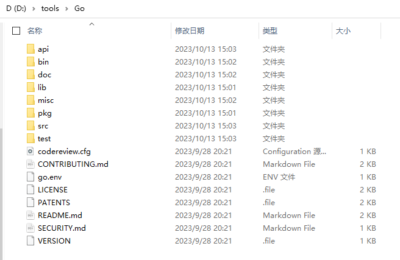

+++
title = "安装、配置、卸载、更新、运行代码"
date = 2024-08-19T09:29:49+08:00
weight = 10
type = "docs"
description = ""
isCJKLanguage = true
draft = false

+++

## 安装和配置

### 安装包来源

- [https://go.dev/dl/](https://go.dev/dl/)
- [https://mirrors.aliyun.com/golang/](https://mirrors.aliyun.com/golang/)
- [https://github.com/golang/go/tags](https://github.com/golang/go/tags)
- [https://golang.google.cn/dl/](https://golang.google.cn/dl/)
- [https://studygolang.com/dl](https://studygolang.com/dl)

### 在Linux上安装和配置

#### CentOS

（a）下载安装包：

```bash
cd /tmp
# 请从 https://go.dev/dl/页面中查看相关系统架构的最新版本
wget -c https://go.dev/dl/go1.21.2.linux-amd64.tar.gz
# 或者使用其他来源，例如：
wget -c https://mirrors.aliyun.com/golang/go1.21.2.linux-amd64.tar.gz
```

（b）解压`go1.21.2.linux-amd64.tar.gz`压缩包至`/usr/local`目录：

```bash
tar -C /usr/local -zxvf go1.21.2.linux-amd64.tar.gz
```

（c）添加`/usr/local/go/bin`至`PATH`环境变量。您可以通过在 `$HOME/.bash_profile`文件 或 `/etc/bashrc`文件（对于全系统的安装）中添加以下一行来实现。

```bash
export PATH=$PATH:/usr/local/go/bin
```

（d）创建`/home/lx/gopath`目录：

```bash
mkdir -m 755 /home/lx/gopath
```

并添加`/home/lx/gopath`至`GOPATH`环境变量（其中的`lx`为用户登录名）。您可以通过在 `$HOME/.bash_profile`文件 或 `/etc/bashrc`文件（对于全系统的安装）中添加以下一行来实现。

```bash
export GOPATH=/home/lx/gopath
```

（e）添加`$GOPATH/bin`至`GOBIN`环境变量。您可以通过在 `$HOME/.bash_profile`文件 或 `/etc/bashrc`文件（对于全系统的安装）中添加以下一行来实现。（注意这里这样设置是认为GOPATH环境变量设置的值只有一个，若`GOPATH`的值有多个这样设置可能会出现问题。）

```bash
export GOBIN=$GOPATH/bin
```

（e）添加`https://goproxy.cn,direct`至`GOPROXY`环境变量。您可以通过在 `$HOME/.bash_profile`文件 或 `/etc/bashrc`文件（对于全系统的安装）中添加以下一行来实现。

```bash
export GOPROXY=https://goproxy.cn,direct
```

（f）运行以下命令，使环境变量马上生效：

```bash
source $HOME/.bash_profile

# 或

source /etc/bashrc
```

（g）运行以下命令，查看go是否已经安装成功（若安装成功，该命令将返回go的相关版本号和架构类型）：

```bash
go version
```


> ​	若设置`GOPATH`环境变量的路径，在某一非root用户的家目录下，且下载的安装依赖项都位于该非root用户的`$HOME/gopath`，例如：`/home/lx/gopath`下，那么当切换至root用户（root用户也设置了相关的`GOPATH`环境变量）进行项目编译的使用，root用户是否需要再次从新下载相关依赖项？
>
> 答案：不需要，因为所有路径对于root用户都是可见的。

#### Ubuntu

（a）使用图形界面进行安装


> ```bash
> lx@lx-ub01:~/Desktop$ echo $PATH
> /usr/local/sbin:/usr/local/bin:/usr/sbin:/usr/bin:/sbin:/bin:/usr/games:/usr/local/games:/snap/bin:/snap/bin
> lx@lx-ub01:~/Desktop$ go version
> go version go1.21.2 linux/amd64
> ```
>
> 这里你会好奇为什么PATH环境变量中没有go/bin等路径？你可以查看下snap或Snapcraft的原理。
>
> snap的相关文章：
>
> - [我就是我，原理不一样的snap](https://www.ubuntukylin.com/news/666-cn.html)

（b）若是使用命令行安装go，则安装步骤和CentOS一样（不同的是配置文件名称不一样，Ubuntu为`/etc/bash.bashrc`和主目录中的`.bashrc`）。

### 在Windows 10上安装和配置

（a）下载`MSI`格式的安装包。例如：[https://mirrors.aliyun.com/golang/go1.21.2.windows-amd64.msi](https://mirrors.aliyun.com/golang/go1.21.2.windows-amd64.msi)

（b）打开安装包，按照提示进行安装。





（c）运行以下命令，查看go是否已经安装成功（若安装成功，该命令将返回go的相关版本号和架构类型）：

```bash
C:\Users\zlongxiang>go version
go version go1.21.2 windows/amd64
```

（d）设置相关环境变量，**避免升级go版本时还需要重新手动设置相关配置**。在安装完go后，也许你会注意到，Windows中的关于登录用户的用户环境变量中会自动设置一个环境变量`GOPATH`，其值类似：`C:\Users\zlongxiang\go`（这里的`zlongxiang`是我Windows系统的登录用户名），且在`Path`环境变量中多添加了两行：

```bash
C:\Users\zlongxiang\go\bin
%USERPROFILE%\go\bin
```

（`USERPROFILE`即登录用户的主目录，在我使用`zlongxiang`登录的Windows系统后，其值为：`C:\Users\zlongxiang`）。这里我把需要设置的相关环境变量以及值列在下面：

```bash
GOROOT=D:\tools\Go
GOPATH=F:\GoPath
GOBIN=%GOPATH%\bin
GOPROXY=https://goproxy.cn,direct

# Path将go自动设置的有关go的环境变量删除掉
# 新增以下行：

%GOROOT%\bin
%GOPATH%\bin
```

（e）使用`go env` 命令查看go的相关环境变量：

```bash
C:\Users\zlongxiang>go env
set GO111MODULE=on
set GOARCH=amd64
set GOBIN=F:\GoPath\bin
set GOCACHE=C:\Users\zlongxiang\AppData\Local\go-build
set GOENV=C:\Users\zlongxiang\AppData\Roaming\go\env
set GOEXE=.exe
set GOEXPERIMENT=
set GOFLAGS=
set GOHOSTARCH=amd64
set GOHOSTOS=windows
set GOINSECURE=
set GOMODCACHE=F:\GoPath\pkg\mod
set GONOPROXY=
set GONOSUMDB=
set GOOS=windows
set GOPATH=F:\GoPath
set GOPRIVATE=
set GOPROXY=https://goproxy.cn,direct
set GOROOT=D:\tools\Go
set GOSUMDB=sum.golang.org
set GOTMPDIR=
set GOTOOLCHAIN=auto
set GOTOOLDIR=D:\tools\Go\pkg\tool\windows_amd64
set GOVCS=
set GOVERSION=go1.21.2
set GCCGO=gccgo
set GOAMD64=v1
set AR=ar
set CC=gcc
set CXX=g++
set CGO_ENABLED=1
set GOMOD=NUL
set GOWORK=
set CGO_CFLAGS=-O2 -g
set CGO_CPPFLAGS=
set CGO_CXXFLAGS=-O2 -g
set CGO_FFLAGS=-O2 -g
set CGO_LDFLAGS=-O2 -g
set PKG_CONFIG=pkg-config
set GOGCCFLAGS=-m64 -mthreads -Wl,--no-gc-sections -fmessage-length=0 -ffile-prefix-map=C:\Users\ZLONGX~1\AppData\Local\Temp\go-build444331135=/tmp/go-build -gno-record-gcc-switches
```

## 多版本安装

​	参见：[安装多个Go版本]()

## 运行代码

代码如下：

```go
package main

import "fmt"

func main() {
    fmt.Println("Hello World!")
}
```



{}

CentOS：

假设以上代码存放于`$HOME/goprjs/demo/app.go` 文件中

（a）切换至`$HOME/goprjs/demo/`：

```bash
cd ~/goprjs/demo/
```

（b）编译后运行或直接运行：

```bash
# 编译后运行
go build app.go
./app

# 直接运行
go run app.go
```

Ubuntu：

假设以上代码存放于`$HOME/goprjs/demo/app.go` 文件中

（a）切换至`$HOME/goprjs/demo/`：

```bash
cd ~/goprjs/demo/
```

（b）编译后运行或直接运行：

```bash
# 编译后运行
go build app.go
./app

# 或直接运行
go run app.go
```


{}

{}

假设以上代码存放于`F:\goprjs\demog\app.go` 文件中

（a）切换至`F:\goprjs\demog\`（这里使用`powershell`命令行，关于如何安装`powershell`，你可以查看[https://learn.microsoft.com/en-us/powershell/scripting/install/installing-powershell-on-windows?view=powershell-7.3](https://learn.microsoft.com/en-us/powershell/scripting/install/installing-powershell-on-windows?view=powershell-7.3)）：

```bash
cd F:\goprjs\demog\
```

（b）编译后运行或直接运行：

```bash
# 编译后运行
go build app.go
./app

# 或直接运行
go run app.go
```


{}

{}

（a）

（b）

（c）

（d）






## 卸载

### Linux

#### CentOS

（a）删除`/usr/local/go`目录；

（b）修改相关环境变量，将相关go环境变量移除掉；

#### Ubuntu

（a）若是使用snap安装go，则直接打开snap，找到go，点击右侧的`Uninstall`按钮进行卸载；

（b）若是使用命令行安装go，则卸载操作和CentOS一样。

### Windows

（a）按 Window + I 快捷键，进入Windows设置，输入`程序`，并选择`添加或删除程序`：


（b）接着输入`go`，按`Enter`键，进行搜索：


（c）点击`Go programming Language amd64 go1.xx.x`，点击`卸载`，当弹出警告时，再次点击`卸载`：


## 更新

### 在Linux上更新

（1）先删除go安装路径下的所有文件，（具体安装路径，根据你的实际进行修改）

```sh
sudo rm -rf /usr/local/go
```

（2）接下来的步骤和之前在Linux系统上安装Go是一致的。

### 在Windows 10上更新

（1）下载新版本的go

（2）双击安装包，点击`next`按钮


（3）点击`Yes,Uninstall`按钮


（4）勾选同意许可证


（5）更改安装路径


（6）等待大概几分钟后


（7）此时原安装路径中的文件还在，点击`Install`按钮继续安装


（8）等待几分钟后


（9）查看Go环境变量

```sh
PS F:\Hugos\go_docs> go env
set GO111MODULE=
set GOARCH=amd64
set GOBIN=C:\GoPath\bin
set GOCACHE=C:\Users\zlongxiang\AppData\Local\go-build
set GOENV=C:\Users\zlongxiang\AppData\Roaming\go\env
set GOEXE=.exe
set GOEXPERIMENT=
set GOFLAGS=
set GOHOSTARCH=amd64
set GOHOSTOS=windows
set GOINSECURE=
set GOMODCACHE=C:\Users\zlongxiang\go\pkg\mod
set GONOPROXY=
set GONOSUMDB=
set GOOS=windows
set GOPATH=C:\Users\zlongxiang\go
set GOPRIVATE=
set GOPROXY=https://goproxy.cn,direct
set GOROOT=C:\tools\Go
set GOSUMDB=sum.golang.org
set GOTMPDIR=
set GOTOOLCHAIN=auto
set GOTOOLDIR=C:\tools\Go\pkg\tool\windows_amd64
set GOVCS=
set GOVERSION=go1.23.0
set GODEBUG=
set GOTELEMETRY=local
set GOTELEMETRYDIR=C:\Users\zlongxiang\AppData\Roaming\go\telemetry
set GCCGO=gccgo
set GOAMD64=v1
set AR=ar
set CC=gcc
set CXX=g++
set CGO_ENABLED=1
set GOMOD=F:\Hugos\go_docs\go.mod
set GOWORK=
set CGO_CFLAGS=-O2 -g
set CGO_CPPFLAGS=
set CGO_CXXFLAGS=-O2 -g
set CGO_FFLAGS=-O2 -g
set CGO_LDFLAGS=-O2 -g
set PKG_CONFIG=pkg-config
set GOGCCFLAGS=-m64 -mthreads -Wl,--no-gc-sections -fmessage-length=0 -ffile-prefix-map=C:\Users\ZLONGX~1\AppData\Local\Temp\go-build2937212879=/tmp/go-build -gno-record-gcc-switches
PS F:\Hugos\go_docs>
```

