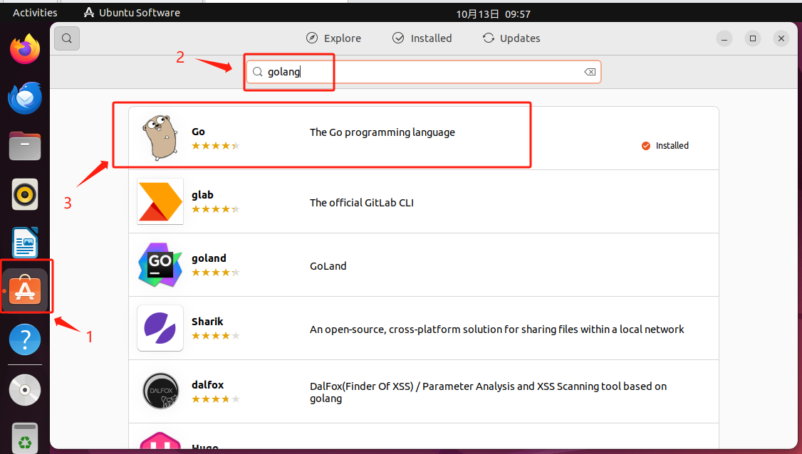
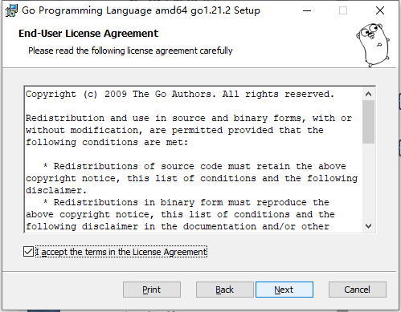
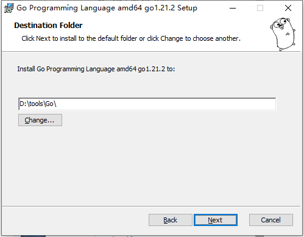

+++
title = "安装、运行代码、卸载"
date = 2023-10-06T21:15:41+08:00
type = "docs"
weight = -1
description = ""
isCJKLanguage = true
draft = false

+++

# 安装、运行代码、卸载

## Go

### 安装包来源

- [https://go.dev/dl/](https://go.dev/dl/)
- [https://mirrors.aliyun.com/golang/](https://mirrors.aliyun.com/golang/)
- [https://github.com/golang/go/tags](https://github.com/golang/go/tags)
- [https://golang.google.cn/dl/](https://golang.google.cn/dl/)
- [https://studygolang.com/dl](https://studygolang.com/dl)

### 安装





CentOS：

（a）下载安装包：

```bash
cd /tmp
# 请从 https://go.dev/dl/页面中查看相关系统架构的最新版本
wget -c https://go.dev/dl/go1.21.2.linux-amd64.tar.gz
# 或者使用其他来源，例如：
wget -c https://mirrors.aliyun.com/golang/go1.21.2.linux-amd64.tar.gz
```

（b）解压`go1.21.2.linux-amd64.tar.gz`压缩包至`/usr/local`目录：

```bash
tar -C /usr/local -zxvf go1.21.2.linux-amd64.tar.gz
```

（c）添加`/usr/local/go/bin`至`PATH`环境变量。您可以通过在 `$HOME/.bash_profile`文件 或 `/etc/bashrc`文件（对于全系统的安装）中添加以下一行来实现。

```bash
export PATH=$PATH:/usr/local/go/bin
```

（d）创建`/home/lx/gopath`目录：

```bash
mkdir -m 777 /home/lx/gopath
```

并添加`/home/lx/gopath`至`GOPATH`环境变量（其中的`lx`为用户登录名）。您可以通过在 `$HOME/.bash_profile`文件 或 `/etc/bashrc`文件（对于全系统的安装）中添加以下一行来实现。

```bash
export GOPATH=/home/lx/gopath
```

（e）添加`$GOPATH/bin`至`GOBIN`环境变量。您可以通过在 `$HOME/.bash_profile`文件 或 `/etc/bashrc`文件（对于全系统的安装）中添加以下一行来实现。（注意这里这样设置是认为GOPATH环境变量设置的值只有一个，若`GOPATH`的值有多个这样设置可能会出现问题。）

```bash
export GOBIN=$GOPATH/bin
```

（e）添加`https://goproxy.cn,direct`至`GOPROXY`环境变量。您可以通过在 `$HOME/.bash_profile`文件 或 `/etc/bashrc`文件（对于全系统的安装）中添加以下一行来实现。

```bash
export GOPROXY=https://goproxy.cn,direct
```

（f）运行以下命令，使环境变量马上生效：

```bash
source $HOME/.bash_profile

# 或

source /etc/bashrc
```

（g）运行以下命令，查看go是否已经安装成功（若安装成功，该命令将返回go的相关版本号和架构类型）：

```bash
go version
```


> ​	若设置`GOPATH`环境变量的路径，在某一非root用户的家目录下，且下载的安装依赖项都位于该非root用户的`$HOME/gopath`，例如：`/home/lx/gopath`下，那么当切换至root用户（root用户也设置了相关的`GOPATH`环境变量）进行项目编译的使用，root用户是否需要再次从新下载相关依赖项？
>
> 答案：不需要，因为所有路径对于root用户都是可见的。

Ubuntu：


（a）使用图形界面进行安装



> ```bash
> lx@lx-ub01:~/Desktop$ echo $PATH
> /usr/local/sbin:/usr/local/bin:/usr/sbin:/usr/bin:/sbin:/bin:/usr/games:/usr/local/games:/snap/bin:/snap/bin
> lx@lx-ub01:~/Desktop$ go version
> go version go1.21.2 linux/amd64
> ```
>
> 这里你会好奇为什么PATH环境变量中没有go/bin等路径？你可以查看下snap或Snapcraft的原理。
>
> snap的相关文章：
>
> - [我就是我，原理不一样的snap](https://www.ubuntukylin.com/news/666-cn.html)

（b）若是使用命令行安装go，则安装步骤和CentOS一样（不同的是配置文件名称不一样，Ubuntu为`/etc/bash.bashrc`和主目录中的`.bashrc`）。





（a）

（b）

（c）

（d）





（a）下载`MSI`格式的安装包。例如：[https://mirrors.aliyun.com/golang/go1.21.2.windows-amd64.msi](https://mirrors.aliyun.com/golang/go1.21.2.windows-amd64.msi)

（b）打开安装包，按照提示进行安装。






（c）运行以下命令，查看go是否已经安装成功（若安装成功，该命令将返回go的相关版本号和架构类型）：

```bash
C:\Users\zlongxiang>go version
go version go1.21.2 windows/amd64
```

（d）设置相关环境变量，**避免升级go版本时还需要重新手动设置相关配置**。在安装完go后，也许你会注意到，Windows中的关于登录用户的用户环境变量中会自动设置一个环境变量`GOPATH`，其值类似：`C:\Users\zlongxiang\go`（这里的`zlongxiang`是我Windows系统的登录用户名），且在`Path`环境变量中多添加了两行：

```bash
C:\Users\zlongxiang\go\bin
%USERPROFILE%\go\bin
```

（`USERPROFILE`即登录用户的主目录，在我使用`zlongxiang`登录的Windows系统后，其值为：`C:\Users\zlongxiang`）。这里我把需要设置的相关环境变量以及值列在下面：

```bash
GOROOT=D:\tools\Go
GOPATH=F:\GoPath
GOBIN=%GOPATH%\bin
GOPROXY=https://goproxy.cn,direct

# Path将go自动设置的有关go的环境变量删除掉
# 新增以下行：

%GOROOT%\bin
%GOPATH%\bin
```

（e）使用`go env` 命令查看go的相关环境变量：

```bash
C:\Users\zlongxiang>go env
set GO111MODULE=on
set GOARCH=amd64
set GOBIN=F:\GoPath\bin
set GOCACHE=C:\Users\zlongxiang\AppData\Local\go-build
set GOENV=C:\Users\zlongxiang\AppData\Roaming\go\env
set GOEXE=.exe
set GOEXPERIMENT=
set GOFLAGS=
set GOHOSTARCH=amd64
set GOHOSTOS=windows
set GOINSECURE=
set GOMODCACHE=F:\GoPath\pkg\mod
set GONOPROXY=
set GONOSUMDB=
set GOOS=windows
set GOPATH=F:\GoPath
set GOPRIVATE=
set GOPROXY=https://goproxy.cn,direct
set GOROOT=D:\tools\Go
set GOSUMDB=sum.golang.org
set GOTMPDIR=
set GOTOOLCHAIN=auto
set GOTOOLDIR=D:\tools\Go\pkg\tool\windows_amd64
set GOVCS=
set GOVERSION=go1.21.2
set GCCGO=gccgo
set GOAMD64=v1
set AR=ar
set CC=gcc
set CXX=g++
set CGO_ENABLED=1
set GOMOD=NUL
set GOWORK=
set CGO_CFLAGS=-O2 -g
set CGO_CPPFLAGS=
set CGO_CXXFLAGS=-O2 -g
set CGO_FFLAGS=-O2 -g
set CGO_LDFLAGS=-O2 -g
set PKG_CONFIG=pkg-config
set GOGCCFLAGS=-m64 -mthreads -Wl,--no-gc-sections -fmessage-length=0 -ffile-prefix-map=C:\Users\ZLONGX~1\AppData\Local\Temp\go-build444331135=/tmp/go-build -gno-record-gcc-switches
```





### 运行代码

代码：

```go
package main

import "fmt"

func main() {
    fmt.Println("Hello World!")
}
```





CentOS：

假设以上代码存放于`$HOME/goprjs/demo/app.go` 文件中

（a）切换至`$HOME/goprjs/demo/`：

```bash
cd ~/goprjs/demo/
```

（b）编译后运行或直接运行：

```bash
# 编译后运行
go build app.go
./app

# 直接运行
go run app.go
```


Ubuntu：

假设以上代码存放于`$HOME/goprjs/demo/app.go` 文件中

（a）切换至`$HOME/goprjs/demo/`：

```bash
cd ~/goprjs/demo/
```

（b）编译后运行或直接运行：

```bash
# 编译后运行
go build app.go
./app

# 直接运行
go run app.go
```






（a）

（b）

（c）

（d）





假设以上代码存放于`F:\goprjs\demog\app.go` 文件中

（a）切换至`F:\goprjs\demog\`（这里使用`powershell`命令行，关于如何安装`powershell`，你可以查看[https://learn.microsoft.com/en-us/powershell/scripting/install/installing-powershell-on-windows?view=powershell-7.3](https://learn.microsoft.com/en-us/powershell/scripting/install/installing-powershell-on-windows?view=powershell-7.3)）：

```bash
cd F:\goprjs\demog\
```

（b）编译后运行或直接运行：

```bash
# 编译后运行
go build app.go
./app

# 直接运行
go run app.go
```






### 卸载





CentOS：

（a）删除`/usr/local/go`目录；

（b）修改相关环境变量，将相关go环境变量移除掉；

Ubuntu：

（a）若是使用snap安装go，则直接打开snap，找到go，点击右侧的`Uninstall`按钮进行卸载；

（b）若是使用命令行安装go，则卸载操作和CentOS一样。





（a）

（b）

（c）

（d）





（a）

（b）

（c）

（d）





## C

### 安装





CentOS：

（a）使用命令`yum groupinstall 'Development Tools'`安装相关开发工具：

```bash
[root@lx-cent01 ~]# yum groupinstall 'Development Tools'
Loaded plugins: fastestmirror, langpacks
There is no installed groups file.
Maybe run: yum groups mark convert (see man yum)
Loading mirror speeds from cached hostfile
 * base: mirrors.aliyun.com
 * extras: mirrors.aliyun.com
 * updates: mirrors.aliyun.com
base                                                            | 3.6 kB  00:00:00     
epel                                                            | 4.7 kB  00:00:00     
extras                                                          | 2.9 kB  00:00:00     
updates                                                         | 2.9 kB  00:00:00     
(1/2): epel/x86_64/updateinfo                                   | 1.0 MB  00:00:00     
(2/2): epel/x86_64/primary_db                                   | 7.0 MB  00:00:05     
Resolving Dependencies
--> Running transaction check
---> Package autoconf.noarch 0:2.69-11.el7 will be installed
--> Processing Dependency: m4 >= 1.4.14 for package: autoconf-2.69-11.el7.noarch
--> Processing Dependency: perl(Data::Dumper) for package: autoconf-2.69-11.el7.noarch
---> Package automake.noarch 0:1.13.4-3.el7 will be installed
--> Processing Dependency: perl(Thread::Queue) for package: automake-1.13.4-3.el7.noarch
--> Processing Dependency: perl(TAP::Parser) for package: automake-1.13.4-3.el7.noarch
---> Package bison.x86_64 0:3.0.4-2.el7 will be installed
---> Package byacc.x86_64 0:1.9.20130304-3.el7 will be installed
---> Package cscope.x86_64 0:15.8-10.el7 will be installed
---> Package ctags.x86_64 0:5.8-13.el7 will be installed
---> Package diffstat.x86_64 0:1.57-4.el7 will be installed
---> Package doxygen.x86_64 1:1.8.5-4.el7 will be installed
---> Package flex.x86_64 0:2.5.37-6.el7 will be installed
---> Package gcc-c++.x86_64 0:4.8.5-44.el7 will be installed
--> Processing Dependency: libstdc++-devel = 4.8.5-44.el7 for package: gcc-c++-4.8.5-44.el7.x86_64
---> Package gcc-gfortran.x86_64 0:4.8.5-44.el7 will be installed
--> Processing Dependency: libquadmath-devel = 4.8.5-44.el7 for package: gcc-gfortran-4.8.5-44.el7.x86_64
--> Processing Dependency: libquadmath = 4.8.5-44.el7 for package: gcc-gfortran-4.8.5-44.el7.x86_64
--> Processing Dependency: libgfortran = 4.8.5-44.el7 for package: gcc-gfortran-4.8.5-44.el7.x86_64
--> Processing Dependency: libgfortran.so.3()(64bit) for package: gcc-gfortran-4.8.5-44.el7.x86_64
---> Package git.x86_64 0:1.8.3.1-25.el7_9 will be installed
--> Processing Dependency: perl-Git = 1.8.3.1-25.el7_9 for package: git-1.8.3.1-25.el7_9.x86_64
--> Processing Dependency: perl(Term::ReadKey) for package: git-1.8.3.1-25.el7_9.x86_64
--> Processing Dependency: perl(Git) for package: git-1.8.3.1-25.el7_9.x86_64
--> Processing Dependency: perl(Error) for package: git-1.8.3.1-25.el7_9.x86_64
---> Package indent.x86_64 0:2.2.11-13.el7 will be installed
---> Package intltool.noarch 0:0.50.2-7.el7 will be installed
--> Processing Dependency: perl(XML::Parser) for package: intltool-0.50.2-7.el7.noarch
--> Processing Dependency: gettext-devel for package: intltool-0.50.2-7.el7.noarch
---> Package libtool.x86_64 0:2.4.2-22.el7_3 will be installed
---> Package patch.x86_64 0:2.7.1-12.el7_7 will be installed
---> Package patchutils.x86_64 0:0.3.3-5.el7_9 will be installed
---> Package rcs.x86_64 0:5.9.0-7.el7 will be installed
---> Package redhat-rpm-config.noarch 0:9.1.0-88.el7.centos will be installed
--> Processing Dependency: dwz >= 0.4 for package: redhat-rpm-config-9.1.0-88.el7.centos.noarch
--> Processing Dependency: python-srpm-macros for package: redhat-rpm-config-9.1.0-88.el7.centos.noarch
--> Processing Dependency: perl-srpm-macros for package: redhat-rpm-config-9.1.0-88.el7.centos.noarch
---> Package rpm-build.x86_64 0:4.11.3-48.el7_9 will be installed
---> Package rpm-sign.x86_64 0:4.11.3-48.el7_9 will be installed
---> Package subversion.x86_64 0:1.7.14-16.el7 will be installed
--> Processing Dependency: subversion-libs(x86-64) = 1.7.14-16.el7 for package: subversion-1.7.14-16.el7.x86_64
--> Processing Dependency: libsvn_wc-1.so.0()(64bit) for package: subversion-1.7.14-16.el7.x86_64
--> Processing Dependency: libsvn_subr-1.so.0()(64bit) for package: subversion-1.7.14-16.el7.x86_64
--> Processing Dependency: libsvn_repos-1.so.0()(64bit) for package: subversion-1.7.14-16.el7.x86_64
--> Processing Dependency: libsvn_ra_svn-1.so.0()(64bit) for package: subversion-1.7.14-16.el7.x86_64
--> Processing Dependency: libsvn_ra_neon-1.so.0()(64bit) for package: subversion-1.7.14-16.el7.x86_64
--> Processing Dependency: libsvn_ra_local-1.so.0()(64bit) for package: subversion-1.7.14-16.el7.x86_64
--> Processing Dependency: libsvn_ra-1.so.0()(64bit) for package: subversion-1.7.14-16.el7.x86_64
--> Processing Dependency: libsvn_fs_util-1.so.0()(64bit) for package: subversion-1.7.14-16.el7.x86_64
--> Processing Dependency: libsvn_fs_fs-1.so.0()(64bit) for package: subversion-1.7.14-16.el7.x86_64
--> Processing Dependency: libsvn_fs_base-1.so.0()(64bit) for package: subversion-1.7.14-16.el7.x86_64
--> Processing Dependency: libsvn_fs-1.so.0()(64bit) for package: subversion-1.7.14-16.el7.x86_64
--> Processing Dependency: libsvn_diff-1.so.0()(64bit) for package: subversion-1.7.14-16.el7.x86_64
--> Processing Dependency: libsvn_delta-1.so.0()(64bit) for package: subversion-1.7.14-16.el7.x86_64
--> Processing Dependency: libsvn_client-1.so.0()(64bit) for package: subversion-1.7.14-16.el7.x86_64
--> Processing Dependency: libaprutil-1.so.0()(64bit) for package: subversion-1.7.14-16.el7.x86_64
--> Processing Dependency: libapr-1.so.0()(64bit) for package: subversion-1.7.14-16.el7.x86_64
---> Package swig.x86_64 0:2.0.10-5.el7 will be installed
---> Package systemtap.x86_64 0:4.0-13.el7 will be installed
--> Processing Dependency: systemtap-devel = 4.0-13.el7 for package: systemtap-4.0-13.el7.x86_64
--> Processing Dependency: systemtap-client = 4.0-13.el7 for package: systemtap-4.0-13.el7.x86_64
--> Running transaction check
---> Package apr.x86_64 0:1.4.8-7.el7 will be installed
---> Package apr-util.x86_64 0:1.5.2-6.el7_9.1 will be installed
---> Package dwz.x86_64 0:0.11-3.el7 will be installed
---> Package gettext-devel.x86_64 0:0.19.8.1-3.el7 will be installed
--> Processing Dependency: gettext-common-devel = 0.19.8.1-3.el7 for package: gettext-devel-0.19.8.1-3.el7.x86_64
---> Package libgfortran.x86_64 0:4.8.5-44.el7 will be installed
---> Package libquadmath.x86_64 0:4.8.5-44.el7 will be installed
---> Package libquadmath-devel.x86_64 0:4.8.5-44.el7 will be installed
---> Package libstdc++-devel.x86_64 0:4.8.5-44.el7 will be installed
---> Package m4.x86_64 0:1.4.16-10.el7 will be installed
---> Package perl-Data-Dumper.x86_64 0:2.145-3.el7 will be installed
---> Package perl-Error.noarch 1:0.17020-2.el7 will be installed
---> Package perl-Git.noarch 0:1.8.3.1-25.el7_9 will be installed
---> Package perl-TermReadKey.x86_64 0:2.30-20.el7 will be installed
---> Package perl-Test-Harness.noarch 0:3.28-3.el7 will be installed
---> Package perl-Thread-Queue.noarch 0:3.02-2.el7 will be installed
---> Package perl-XML-Parser.x86_64 0:2.41-10.el7 will be installed
---> Package perl-srpm-macros.noarch 0:1-8.el7 will be installed
---> Package python-srpm-macros.noarch 0:3-34.el7 will be installed
---> Package subversion-libs.x86_64 0:1.7.14-16.el7 will be installed
---> Package systemtap-client.x86_64 0:4.0-13.el7 will be installed
---> Package systemtap-devel.x86_64 0:4.0-13.el7 will be installed
--> Processing Dependency: kernel-devel-uname-r for package: systemtap-devel-4.0-13.el7.x86_64
--> Running transaction check
---> Package gettext-common-devel.noarch 0:0.19.8.1-3.el7 will be installed
---> Package kernel-debug-devel.x86_64 0:3.10.0-1160.99.1.el7 will be installed
--> Finished Dependency Resolution

Dependencies Resolved

=======================================================================================
 Package                   Arch        Version                      Repository    Size
=======================================================================================
Installing for group install "Development Tools":
 autoconf                  noarch      2.69-11.el7                  base         701 k
 automake                  noarch      1.13.4-3.el7                 base         679 k
 bison                     x86_64      3.0.4-2.el7                  base         674 k
 byacc                     x86_64      1.9.20130304-3.el7           base          65 k
 cscope                    x86_64      15.8-10.el7                  base         203 k
 ctags                     x86_64      5.8-13.el7                   base         155 k
 diffstat                  x86_64      1.57-4.el7                   base          35 k
 doxygen                   x86_64      1:1.8.5-4.el7                base         3.6 M
 flex                      x86_64      2.5.37-6.el7                 base         293 k
 gcc-c++                   x86_64      4.8.5-44.el7                 base         7.2 M
 gcc-gfortran              x86_64      4.8.5-44.el7                 base         6.7 M
 git                       x86_64      1.8.3.1-25.el7_9             updates      4.4 M
 indent                    x86_64      2.2.11-13.el7                base         150 k
 intltool                  noarch      0.50.2-7.el7                 base          59 k
 libtool                   x86_64      2.4.2-22.el7_3               base         588 k
 patch                     x86_64      2.7.1-12.el7_7               base         111 k
 patchutils                x86_64      0.3.3-5.el7_9                updates      104 k
 rcs                       x86_64      5.9.0-7.el7                  base         230 k
 redhat-rpm-config         noarch      9.1.0-88.el7.centos          base          81 k
 rpm-build                 x86_64      4.11.3-48.el7_9              updates      150 k
 rpm-sign                  x86_64      4.11.3-48.el7_9              updates       49 k
 subversion                x86_64      1.7.14-16.el7                base         1.0 M
 swig                      x86_64      2.0.10-5.el7                 base         1.3 M
 systemtap                 x86_64      4.0-13.el7                   base          15 k
Installing for dependencies:
 apr                       x86_64      1.4.8-7.el7                  base         104 k
 apr-util                  x86_64      1.5.2-6.el7_9.1              updates       92 k
 dwz                       x86_64      0.11-3.el7                   base          99 k
 gettext-common-devel      noarch      0.19.8.1-3.el7               base         410 k
 gettext-devel             x86_64      0.19.8.1-3.el7               base         320 k
 kernel-debug-devel        x86_64      3.10.0-1160.99.1.el7         updates       18 M
 libgfortran               x86_64      4.8.5-44.el7                 base         301 k
 libquadmath               x86_64      4.8.5-44.el7                 base         190 k
 libquadmath-devel         x86_64      4.8.5-44.el7                 base          54 k
 libstdc++-devel           x86_64      4.8.5-44.el7                 base         1.5 M
 m4                        x86_64      1.4.16-10.el7                base         256 k
 perl-Data-Dumper          x86_64      2.145-3.el7                  base          47 k
 perl-Error                noarch      1:0.17020-2.el7              base          32 k
 perl-Git                  noarch      1.8.3.1-25.el7_9             updates       56 k
 perl-TermReadKey          x86_64      2.30-20.el7                  base          31 k
 perl-Test-Harness         noarch      3.28-3.el7                   base         302 k
 perl-Thread-Queue         noarch      3.02-2.el7                   base          17 k
 perl-XML-Parser           x86_64      2.41-10.el7                  base         223 k
 perl-srpm-macros          noarch      1-8.el7                      base         4.6 k
 python-srpm-macros        noarch      3-34.el7                     base         8.8 k
 subversion-libs           x86_64      1.7.14-16.el7                base         922 k
 systemtap-client          x86_64      4.0-13.el7                   base         3.6 M
 systemtap-devel           x86_64      4.0-13.el7                   base         2.2 M

Transaction Summary
=======================================================================================
Install  24 Packages (+23 Dependent packages)

Total download size: 57 M
Installed size: 164 M
Is this ok [y/d/N]: y
Downloading packages:
(1/47): apr-1.4.8-7.el7.x86_64.rpm                              | 104 kB  00:00:00     
(2/47): apr-util-1.5.2-6.el7_9.1.x86_64.rpm                     |  92 kB  00:00:00     
(3/47): autoconf-2.69-11.el7.noarch.rpm                         | 701 kB  00:00:01     
(4/47): automake-1.13.4-3.el7.noarch.rpm                        | 679 kB  00:00:01     
(5/47): byacc-1.9.20130304-3.el7.x86_64.rpm                     |  65 kB  00:00:00     
(6/47): cscope-15.8-10.el7.x86_64.rpm                           | 203 kB  00:00:00     
(7/47): ctags-5.8-13.el7.x86_64.rpm                             | 155 kB  00:00:00     
(8/47): bison-3.0.4-2.el7.x86_64.rpm                            | 674 kB  00:00:00     
(9/47): diffstat-1.57-4.el7.x86_64.rpm                          |  35 kB  00:00:00     
(10/47): dwz-0.11-3.el7.x86_64.rpm                              |  99 kB  00:00:00     
(11/47): flex-2.5.37-6.el7.x86_64.rpm                           | 293 kB  00:00:00     
(12/47): doxygen-1.8.5-4.el7.x86_64.rpm                         | 3.6 MB  00:00:03     
(13/47): gcc-c++-4.8.5-44.el7.x86_64.rpm                        | 7.2 MB  00:00:05     
(14/47): gcc-gfortran-4.8.5-44.el7.x86_64.rpm                   | 6.7 MB  00:00:05     
(15/47): gettext-devel-0.19.8.1-3.el7.x86_64.rpm                | 320 kB  00:00:00     
(16/47): indent-2.2.11-13.el7.x86_64.rpm                        | 150 kB  00:00:00     
(17/47): intltool-0.50.2-7.el7.noarch.rpm                       |  59 kB  00:00:00     
(18/47): libgfortran-4.8.5-44.el7.x86_64.rpm                    | 301 kB  00:00:00     
(19/47): libquadmath-4.8.5-44.el7.x86_64.rpm                    | 190 kB  00:00:00     
(20/47): libquadmath-devel-4.8.5-44.el7.x86_64.rpm              |  54 kB  00:00:00     
(21/47): libstdc++-devel-4.8.5-44.el7.x86_64.rpm                | 1.5 MB  00:00:01     
(22/47): git-1.8.3.1-25.el7_9.x86_64.rpm                        | 4.4 MB  00:00:04     
(23/47): libtool-2.4.2-22.el7_3.x86_64.rpm                      | 588 kB  00:00:00     
(24/47): m4-1.4.16-10.el7.x86_64.rpm                            | 256 kB  00:00:00     
(25/47): patch-2.7.1-12.el7_7.x86_64.rpm                        | 111 kB  00:00:00     
(26/47): perl-Data-Dumper-2.145-3.el7.x86_64.rpm                |  47 kB  00:00:00     
(27/47): perl-Error-0.17020-2.el7.noarch.rpm                    |  32 kB  00:00:00     
(28/47): patchutils-0.3.3-5.el7_9.x86_64.rpm                    | 104 kB  00:00:00     
(29/47): perl-Git-1.8.3.1-25.el7_9.noarch.rpm                   |  56 kB  00:00:00     
(30/47): perl-TermReadKey-2.30-20.el7.x86_64.rpm                |  31 kB  00:00:00     
(31/47): gettext-common-devel-0.19.8.1-3.el7.noarch.rpm         | 410 kB  00:00:10     
(32/47): perl-Thread-Queue-3.02-2.el7.noarch.rpm                |  17 kB  00:00:00     
(33/47): perl-Test-Harness-3.28-3.el7.noarch.rpm                | 302 kB  00:00:00     
(34/47): perl-srpm-macros-1-8.el7.noarch.rpm                    | 4.6 kB  00:00:00     
(35/47): python-srpm-macros-3-34.el7.noarch.rpm                 | 8.8 kB  00:00:00     
(36/47): perl-XML-Parser-2.41-10.el7.x86_64.rpm                 | 223 kB  00:00:00     
(37/47): redhat-rpm-config-9.1.0-88.el7.centos.noarch.rpm       |  81 kB  00:00:00     
(38/47): rcs-5.9.0-7.el7.x86_64.rpm                             | 230 kB  00:00:00     
(39/47): rpm-build-4.11.3-48.el7_9.x86_64.rpm                   | 150 kB  00:00:00     
(40/47): rpm-sign-4.11.3-48.el7_9.x86_64.rpm                    |  49 kB  00:00:00     
(41/47): subversion-libs-1.7.14-16.el7.x86_64.rpm               | 922 kB  00:00:00     
(42/47): subversion-1.7.14-16.el7.x86_64.rpm                    | 1.0 MB  00:00:01     
(43/47): systemtap-4.0-13.el7.x86_64.rpm                        |  15 kB  00:00:00     
(44/47): swig-2.0.10-5.el7.x86_64.rpm                           | 1.3 MB  00:00:00     
(45/47): systemtap-devel-4.0-13.el7.x86_64.rpm                  | 2.2 MB  00:00:01     
(46/47): systemtap-client-4.0-13.el7.x86_64.rpm                 | 3.6 MB  00:00:02     
(47/47): kernel-debug-devel-3.10.0-1160.99.1.el7.x86_64.rpm     |  18 MB  00:00:13     
---------------------------------------------------------------------------------------
Total                                                     2.1 MB/s |  57 MB  00:26     
Running transaction check
Running transaction test
Transaction test succeeded
Running transaction
  Installing : apr-1.4.8-7.el7.x86_64                                             1/47 
  Installing : libquadmath-4.8.5-44.el7.x86_64                                    2/47 
  Installing : m4-1.4.16-10.el7.x86_64                                            3/47 
  Installing : apr-util-1.5.2-6.el7_9.1.x86_64                                    4/47 
  Installing : patch-2.7.1-12.el7_7.x86_64                                        5/47 
  Installing : 1:perl-Error-0.17020-2.el7.noarch                                  6/47 
  Installing : perl-Thread-Queue-3.02-2.el7.noarch                                7/47 
  Installing : subversion-libs-1.7.14-16.el7.x86_64                               8/47 
  Installing : libgfortran-4.8.5-44.el7.x86_64                                    9/47 
  Installing : libquadmath-devel-4.8.5-44.el7.x86_64                             10/47 
  Installing : gettext-common-devel-0.19.8.1-3.el7.noarch                        11/47 
  Installing : python-srpm-macros-3-34.el7.noarch                                12/47 
  Installing : libstdc++-devel-4.8.5-44.el7.x86_64                               13/47 
  Installing : dwz-0.11-3.el7.x86_64                                             14/47 
  Installing : kernel-debug-devel-3.10.0-1160.99.1.el7.x86_64                    15/47 
  Installing : systemtap-devel-4.0-13.el7.x86_64                                 16/47 
  Installing : systemtap-client-4.0-13.el7.x86_64                                17/47 
  Installing : perl-Data-Dumper-2.145-3.el7.x86_64                               18/47 
  Installing : autoconf-2.69-11.el7.noarch                                       19/47 
  Installing : perl-srpm-macros-1-8.el7.noarch                                   20/47 
  Installing : redhat-rpm-config-9.1.0-88.el7.centos.noarch                      21/47 
  Installing : perl-Test-Harness-3.28-3.el7.noarch                               22/47 
  Installing : automake-1.13.4-3.el7.noarch                                      23/47 
  Installing : perl-TermReadKey-2.30-20.el7.x86_64                               24/47 
  Installing : perl-Git-1.8.3.1-25.el7_9.noarch                                  25/47 
  Installing : git-1.8.3.1-25.el7_9.x86_64                                       26/47 
  Installing : gettext-devel-0.19.8.1-3.el7.x86_64                               27/47 
  Installing : perl-XML-Parser-2.41-10.el7.x86_64                                28/47 
  Installing : intltool-0.50.2-7.el7.noarch                                      29/47 
  Installing : libtool-2.4.2-22.el7_3.x86_64                                     30/47 
  Installing : rpm-build-4.11.3-48.el7_9.x86_64                                  31/47 
  Installing : systemtap-4.0-13.el7.x86_64                                       32/47 
  Installing : gcc-c++-4.8.5-44.el7.x86_64                                       33/47 
  Installing : gcc-gfortran-4.8.5-44.el7.x86_64                                  34/47 
  Installing : subversion-1.7.14-16.el7.x86_64                                   35/47 
  Installing : flex-2.5.37-6.el7.x86_64                                          36/47 
  Installing : bison-3.0.4-2.el7.x86_64                                          37/47 
  Installing : rpm-sign-4.11.3-48.el7_9.x86_64                                   38/47 
  Installing : diffstat-1.57-4.el7.x86_64                                        39/47 
  Installing : cscope-15.8-10.el7.x86_64                                         40/47 
  Installing : indent-2.2.11-13.el7.x86_64                                       41/47 
  Installing : swig-2.0.10-5.el7.x86_64                                          42/47 
  Installing : 1:doxygen-1.8.5-4.el7.x86_64                                      43/47 
  Installing : rcs-5.9.0-7.el7.x86_64                                            44/47 
  Installing : byacc-1.9.20130304-3.el7.x86_64                                   45/47 
  Installing : patchutils-0.3.3-5.el7_9.x86_64                                   46/47 
  Installing : ctags-5.8-13.el7.x86_64                                           47/47 
  Verifying  : ctags-5.8-13.el7.x86_64                                            1/47 
  Verifying  : gcc-c++-4.8.5-44.el7.x86_64                                        2/47 
  Verifying  : gcc-gfortran-4.8.5-44.el7.x86_64                                   3/47 
  Verifying  : perl-XML-Parser-2.41-10.el7.x86_64                                 4/47 
  Verifying  : patchutils-0.3.3-5.el7_9.x86_64                                    5/47 
  Verifying  : systemtap-devel-4.0-13.el7.x86_64                                  6/47 
  Verifying  : byacc-1.9.20130304-3.el7.x86_64                                    7/47 
  Verifying  : apr-util-1.5.2-6.el7_9.1.x86_64                                    8/47 
  Verifying  : automake-1.13.4-3.el7.noarch                                       9/47 
  Verifying  : m4-1.4.16-10.el7.x86_64                                           10/47 
  Verifying  : systemtap-client-4.0-13.el7.x86_64                                11/47 
  Verifying  : rcs-5.9.0-7.el7.x86_64                                            12/47 
  Verifying  : 1:doxygen-1.8.5-4.el7.x86_64                                      13/47 
  Verifying  : libquadmath-4.8.5-44.el7.x86_64                                   14/47 
  Verifying  : perl-TermReadKey-2.30-20.el7.x86_64                               15/47 
  Verifying  : perl-Test-Harness-3.28-3.el7.noarch                               16/47 
  Verifying  : apr-1.4.8-7.el7.x86_64                                            17/47 
  Verifying  : perl-Thread-Queue-3.02-2.el7.noarch                               18/47 
  Verifying  : git-1.8.3.1-25.el7_9.x86_64                                       19/47 
  Verifying  : intltool-0.50.2-7.el7.noarch                                      20/47 
  Verifying  : perl-srpm-macros-1-8.el7.noarch                                   21/47 
  Verifying  : swig-2.0.10-5.el7.x86_64                                          22/47 
  Verifying  : 1:perl-Error-0.17020-2.el7.noarch                                 23/47 
  Verifying  : libtool-2.4.2-22.el7_3.x86_64                                     24/47 
  Verifying  : patch-2.7.1-12.el7_7.x86_64                                       25/47 
  Verifying  : rpm-build-4.11.3-48.el7_9.x86_64                                  26/47 
  Verifying  : systemtap-4.0-13.el7.x86_64                                       27/47 
  Verifying  : gettext-devel-0.19.8.1-3.el7.x86_64                               28/47 
  Verifying  : perl-Data-Dumper-2.145-3.el7.x86_64                               29/47 
  Verifying  : libgfortran-4.8.5-44.el7.x86_64                                   30/47 
  Verifying  : indent-2.2.11-13.el7.x86_64                                       31/47 
  Verifying  : perl-Git-1.8.3.1-25.el7_9.noarch                                  32/47 
  Verifying  : subversion-1.7.14-16.el7.x86_64                                   33/47 
  Verifying  : subversion-libs-1.7.14-16.el7.x86_64                              34/47 
  Verifying  : flex-2.5.37-6.el7.x86_64                                          35/47 
  Verifying  : cscope-15.8-10.el7.x86_64                                         36/47 
  Verifying  : bison-3.0.4-2.el7.x86_64                                          37/47 
  Verifying  : autoconf-2.69-11.el7.noarch                                       38/47 
  Verifying  : kernel-debug-devel-3.10.0-1160.99.1.el7.x86_64                    39/47 
  Verifying  : libquadmath-devel-4.8.5-44.el7.x86_64                             40/47 
  Verifying  : dwz-0.11-3.el7.x86_64                                             41/47 
  Verifying  : libstdc++-devel-4.8.5-44.el7.x86_64                               42/47 
  Verifying  : python-srpm-macros-3-34.el7.noarch                                43/47 
  Verifying  : diffstat-1.57-4.el7.x86_64                                        44/47 
  Verifying  : gettext-common-devel-0.19.8.1-3.el7.noarch                        45/47 
  Verifying  : rpm-sign-4.11.3-48.el7_9.x86_64                                   46/47 
  Verifying  : redhat-rpm-config-9.1.0-88.el7.centos.noarch                      47/47 

Installed:
  autoconf.noarch 0:2.69-11.el7                    automake.noarch 0:1.13.4-3.el7      
  bison.x86_64 0:3.0.4-2.el7                       byacc.x86_64 0:1.9.20130304-3.el7   
  cscope.x86_64 0:15.8-10.el7                      ctags.x86_64 0:5.8-13.el7           
  diffstat.x86_64 0:1.57-4.el7                     doxygen.x86_64 1:1.8.5-4.el7        
  flex.x86_64 0:2.5.37-6.el7                       gcc-c++.x86_64 0:4.8.5-44.el7       
  gcc-gfortran.x86_64 0:4.8.5-44.el7               git.x86_64 0:1.8.3.1-25.el7_9       
  indent.x86_64 0:2.2.11-13.el7                    intltool.noarch 0:0.50.2-7.el7      
  libtool.x86_64 0:2.4.2-22.el7_3                  patch.x86_64 0:2.7.1-12.el7_7       
  patchutils.x86_64 0:0.3.3-5.el7_9                rcs.x86_64 0:5.9.0-7.el7            
  redhat-rpm-config.noarch 0:9.1.0-88.el7.centos   rpm-build.x86_64 0:4.11.3-48.el7_9  
  rpm-sign.x86_64 0:4.11.3-48.el7_9                subversion.x86_64 0:1.7.14-16.el7   
  swig.x86_64 0:2.0.10-5.el7                       systemtap.x86_64 0:4.0-13.el7       

Dependency Installed:
  apr.x86_64 0:1.4.8-7.el7                                                             
  apr-util.x86_64 0:1.5.2-6.el7_9.1                                                    
  dwz.x86_64 0:0.11-3.el7                                                              
  gettext-common-devel.noarch 0:0.19.8.1-3.el7                                         
  gettext-devel.x86_64 0:0.19.8.1-3.el7                                                
  kernel-debug-devel.x86_64 0:3.10.0-1160.99.1.el7                                     
  libgfortran.x86_64 0:4.8.5-44.el7                                                    
  libquadmath.x86_64 0:4.8.5-44.el7                                                    
  libquadmath-devel.x86_64 0:4.8.5-44.el7                                              
  libstdc++-devel.x86_64 0:4.8.5-44.el7                                                
  m4.x86_64 0:1.4.16-10.el7                                                            
  perl-Data-Dumper.x86_64 0:2.145-3.el7                                                
  perl-Error.noarch 1:0.17020-2.el7                                                    
  perl-Git.noarch 0:1.8.3.1-25.el7_9                                                   
  perl-TermReadKey.x86_64 0:2.30-20.el7                                                
  perl-Test-Harness.noarch 0:3.28-3.el7                                                
  perl-Thread-Queue.noarch 0:3.02-2.el7                                                
  perl-XML-Parser.x86_64 0:2.41-10.el7                                                 
  perl-srpm-macros.noarch 0:1-8.el7                                                    
  python-srpm-macros.noarch 0:3-34.el7                                                 
  subversion-libs.x86_64 0:1.7.14-16.el7                                               
  systemtap-client.x86_64 0:4.0-13.el7                                                 
  systemtap-devel.x86_64 0:4.0-13.el7                                                  

Complete!
[root@lx-cent01 ~]# 
```

（b）

（c）

（d）

Ubuntu：

（a）

（b）

（c）

（d）





（a）

（b）

（c）

（d）





（a）

（b）

（c）

（d）





### 运行代码





CentOS：

（a）

（b）

（c）

（d）

Ubuntu：

（a）

（b）

（c）

（d）





（a）

（b）

（c）

（d）





（a）

（b）

（c）

（d）





### 卸载





CentOS：

（a）

（b）

（c）

（d）

Ubuntu：

（a）

（b）

（c）

（d）





（a）

（b）

（c）

（d）





（a）

（b）

（c）

（d）





## C++

### 安装





CentOS：

（a）

（b）

（c）

（d）

Ubuntu：

（a）

（b）

（c）

（d）





（a）

（b）

（c）

（d）





（a）

（b）

（c）

（d）





### 运行代码





CentOS：

（a）

（b）

（c）

（d）

Ubuntu：

（a）

（b）

（c）

（d）





（a）

（b）

（c）

（d）





（a）

（b）

（c）

（d）





### 卸载





CentOS：

（a）

（b）

（c）

（d）

Ubuntu：

（a）

（b）

（c）

（d）





（a）

（b）

（c）

（d）





（a）

（b）

（c）

（d）





## Python

### 安装





CentOS：

（a）

（b）

（c）

（d）

Ubuntu：

（a）

（b）

（c）

（d）





（a）

（b）

（c）

（d）





（a）

（b）

（c）

（d）





### 运行代码





CentOS：

（a）

（b）

（c）

（d）

Ubuntu：

（a）

（b）

（c）

（d）





（a）

（b）

（c）

（d）





（a）

（b）

（c）

（d）





### 卸载





CentOS：

（a）

（b）

（c）

（d）

Ubuntu：

（a）

（b）

（c）

（d）





（a）

（b）

（c）

（d）





（a）

（b）

（c）

（d）





## PHP

### 安装





CentOS：

（a）

（b）

（c）

（d）

Ubuntu：

（a）

（b）

（c）

（d）





（a）

（b）

（c）

（d）





（a）

（b）

（c）

（d）





### 运行代码





CentOS：

（a）

（b）

（c）

（d）

Ubuntu：

（a）

（b）

（c）

（d）





（a）

（b）

（c）

（d）





（a）

（b）

（c）

（d）





### 卸载





CentOS：

（a）

（b）

（c）

（d）

Ubuntu：

（a）

（b）

（c）

（d）





（a）

（b）

（c）

（d）





（a）

（b）

（c）

（d）





## Ruby

### 安装





CentOS：

（a）

（b）

（c）

（d）

Ubuntu：

（a）

（b）

（c）

（d）





（a）

（b）

（c）

（d）





（a）

（b）

（c）

（d）





### 运行代码





CentOS：

（a）

（b）

（c）

（d）

Ubuntu：

（a）

（b）

（c）

（d）





（a）

（b）

（c）

（d）





（a）

（b）

（c）

（d）





### 卸载





CentOS：

（a）

（b）

（c）

（d）

Ubuntu：

（a）

（b）

（c）

（d）





（a）

（b）

（c）

（d）





（a）

（b）

（c）

（d）





## Java

### 安装





CentOS：

（a）

（b）

（c）

（d）

Ubuntu：

（a）

（b）

（c）

（d）





（a）

（b）

（c）

（d）





（a）

（b）

（c）

（d）





### 运行代码





CentOS：

（a）

（b）

（c）

（d）

Ubuntu：

（a）

（b）

（c）

（d）





（a）

（b）

（c）

（d）





（a）

（b）

（c）

（d）





### 卸载





CentOS：

（a）

（b）

（c）

（d）

Ubuntu：

（a）

（b）

（c）

（d）





（a）

（b）

（c）

（d）





（a）

（b）

（c）

（d）





## JavaScript

### 安装





CentOS：

（a）

（b）

（c）

（d）

Ubuntu：

（a）

（b）

（c）

（d）





（a）

（b）

（c）

（d）





（a）

（b）

（c）

（d）





### 运行代码





CentOS：

（a）

（b）

（c）

（d）

Ubuntu：

（a）

（b）

（c）

（d）





（a）

（b）

（c）

（d）





（a）

（b）

（c）

（d）





### 卸载





CentOS：

（a）

（b）

（c）

（d）

Ubuntu：

（a）

（b）

（c）

（d）





（a）

（b）

（c）

（d）





（a）

（b）

（c）

（d）





## TypeScript

### 安装





CentOS：

（a）

（b）

（c）

（d）

Ubuntu：

（a）

（b）

（c）

（d）





（a）

（b）

（c）

（d）





（a）

（b）

（c）

（d）





### 运行代码





CentOS：

（a）

（b）

（c）

（d）

Ubuntu：

（a）

（b）

（c）

（d）





（a）

（b）

（c）

（d）





（a）

（b）

（c）

（d）





### 卸载





CentOS：

（a）

（b）

（c）

（d）

Ubuntu：

（a）

（b）

（c）

（d）





（a）

（b）

（c）

（d）





（a）

（b）

（c）

（d）





## C#

### 安装





CentOS：

（a）

（b）

（c）

（d）

Ubuntu：

（a）

（b）

（c）

（d）





（a）

（b）

（c）

（d）





（a）

（b）

（c）

（d）





### 运行代码





CentOS：

（a）

（b）

（c）

（d）

Ubuntu：

（a）

（b）

（c）

（d）





（a）

（b）

（c）

（d）





（a）

（b）

（c）

（d）





### 卸载





CentOS：

（a）

（b）

（c）

（d）

Ubuntu：

（a）

（b）

（c）

（d）





（a）

（b）

（c）

（d）





（a）

（b）

（c）

（d）





## Erlang

### 安装





CentOS：

（a）

（b）

（c）

（d）

Ubuntu：

（a）

（b）

（c）

（d）





（a）

（b）

（c）

（d）





（a）

（b）

（c）

（d）





### 运行代码





CentOS：

（a）

（b）

（c）

（d）

Ubuntu：

（a）

（b）

（c）

（d）





（a）

（b）

（c）

（d）





（a）

（b）

（c）

（d）





### 卸载





CentOS：

（a）

（b）

（c）

（d）

Ubuntu：

（a）

（b）

（c）

（d）





（a）

（b）

（c）

（d）





（a）

（b）

（c）

（d）




