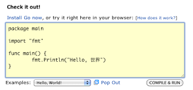

+++
title = "介绍 go Playground"
weight = 5
date = 2023-05-18T17:03:08+08:00
description = ""
isCJKLanguage = true
draft = false
+++

# Introducing the Go Playground - 介绍 go Playground

https://go.dev/blog/playground-intro

Andrew Gerrand
15 September 2010

2010年9月15日

​	如果您今天访问[golang.org](https://go.dev/)，您会看到我们的新外观。我们重新组织了网站的内容，使其更易于查找，并对其进行了重新设计。这些变化也反映在godoc的网络界面中，[godoc](https://go.dev/cmd/godoc/)是Go文档工具。但真正的新闻是一个突出的新功能：[Go Playground](https://go.dev/)。

​	Playground允许任何人使用Web浏览器编写Go代码，我们会立即在我们的服务器上编译、链接和运行它。有一些示例程序可供您使用（请参见“示例”下拉菜单）。我们希望这将给有好奇心的程序员一个机会，在[安装](https://go.dev/doc/install.html)Go之前尝试该语言，并为有经验的Go用户提供一个方便的实验场所。除了主页之外，这个功能还有潜力使我们的参考和教程材料更加有吸引力。我们希望在不久的将来扩展它的使用。

​	当然，您可以在Playground中运行的程序有一些限制。我们不能简单地接受任意代码并在我们的服务器上运行它而不加限制。这些程序在沙盒中构建和运行，其中有一个缩减的标准库；您的程序与外部世界的唯一通信是通过标准输出，而且CPU和内存的使用也有限制。因此，将其视为了解Go精彩世界的一小部分；要完全体验，您需要自己[下载](https://go.dev/doc/install.html)。如果您一直想尝试Go，但从未开始，请立即访问[golang.org](https://go.dev/)进行尝试。
