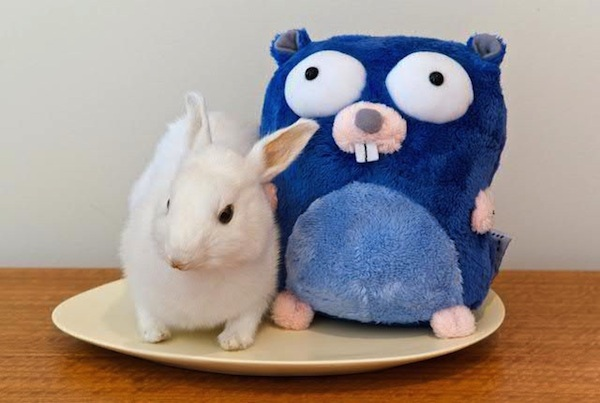
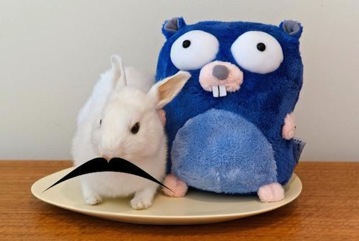
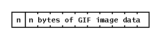

+++
title = "GIF解码器：go 接口的练习"
weight = 7
date = 2023-05-18T17:03:08+08:00
description = ""
isCJKLanguage = true
draft = false
+++

# A GIF decoder: an exercise in Go interfaces - GIF解码器：go 接口的练习

https://go.dev/blog/gif-decoder

Rob Pike
25 May 2011

## Introduction 简介

At the Google I/O conference in San Francisco on May 10, 2011, we announced that the Go language is now available on Google App Engine. Go is the first language to be made available on App Engine that compiles directly to machine code, which makes it a good choice for CPU-intensive tasks such as image manipulation.

在2011年5月10日于旧金山举行的Google I/O大会上，我们宣布Go语言现在可以在Google App Engine上使用。Go是App Engine上第一种可以直接编译成机器码的语言，这使得它成为图像处理等CPU密集型任务的良好选择。

In that vein, we demonstrated a program called [Moustachio](http://moustach-io.appspot.com/) that makes it easy to improve a picture such as this one:

在这种情况下，我们展示了一个名为Moustachio的程序，该程序可以很容易地改进像这样的图片。



by adding a moustache and sharing the result:

通过添加一个小胡子并分享其结果。



All the graphical processing, including rendering the antialiased moustache, is done by a Go program running on App Engine. (The source is available at [the appengine-go project](http://code.google.com/p/appengine-go/source/browse/example/moustachio/).)

所有的图形处理，包括渲染抗锯齿的小胡子，都是由一个运行在App Engine上的Go程序完成的。(源代码可在appengine-go项目中找到)。

Although most images on the web—at least those likely to be moustachioed—are JPEGs, there are countless other formats floating around, and it seemed reasonable for Moustachio to accept uploaded images in a few of them. JPEG and PNG decoders already existed in the Go image library, but the venerable GIF format was not represented, so we decided to write a GIF decoder in time for the announcement. That decoder contains a few pieces that demonstrate how Go’s interfaces make some problems easier to solve. The rest of this blog post describes a couple of instances.

虽然网络上的大多数图片--至少是那些有可能是小胡子的图片--都是JPEG格式，但还有无数其他格式的图片在流传，因此，Moustachio接受以其中一些格式上传的图片似乎是合理的。JPEG和PNG解码器已经存在于Go图像库中，但古老的GIF格式却没有得到体现，所以我们决定及时编写一个GIF解码器来发布。那个解码器包含了一些片段，展示了Go的接口如何使一些问题更容易解决。本博文的其余部分描述了几个实例。

## The GIF format - GIF格式

First, a quick tour of the GIF format. A GIF image file is *paletted*, that is, each pixel value is an index into a fixed color map that is included in the file. The GIF format dates from a time when there were usually no more than 8 bits per pixel on the display, and a color map was used to convert the limited set of values into the RGB (red, green, blue) triples needed to light the screen. (This is in contrast to a JPEG, for example, which has no color map because the encoding represents the distinct color signals separately.)

首先，快速浏览一下GIF格式。GIF图像文件是调色板，也就是说，每个像素值都是文件中包含的固定颜色图谱的一个索引。GIF格式可以追溯到一个时代，当时显示屏上的每个像素点通常不超过8位，色彩图谱被用来将有限的一组数值转换为照亮屏幕所需的RGB（红、绿、蓝）三要素。(这与JPEG相反，例如，它没有颜色地图，因为编码分别代表不同的颜色信号)。

A GIF image can contain anywhere from 1 to 8 bits per pixel, inclusive, but 8 bits per pixel is the most common.

一个GIF图像可以包含每像素1到8比特的任何地方，包括在内，但每像素8比特是最常见的。

Simplifying somewhat, a GIF file contains a header defining the pixel depth and image dimensions, a color map (256 RGB triples for an 8-bit image), and then the pixel data. The pixel data is stored as a one-dimensional bit stream, compressed using the LZW algorithm, which is quite effective for computer-generated graphics although not so good for photographic imagery. The compressed data is then broken into length-delimited blocks with a one-byte count (0-255) followed by that many bytes:

简而言之，一个GIF文件包含一个定义像素深度和图像尺寸的标题，一个色彩图谱（8位的图像有256个RGB三元组），然后是像素数据。像素数据以一维比特流的形式存储，使用LZW算法进行压缩，该算法对计算机生成的图形相当有效，但对摄影图像则不太理想。压缩后的数据被分解成有长度限制的块，后面是一个字节的计数（0-255）。



## Deblocking the pixel data 解除像素数据的锁定

To decode GIF pixel data in Go, we can use the LZW decompressor from the `compress/lzw` package. It has a NewReader function that returns an object that, as [the documentation](https://go.dev/pkg/compress/lzw/#NewReader) says, “satisfies reads by decompressing the data read from r”:

要在Go中解码GIF像素数据，我们可以使用compress/lzw软件包中的LZW解压器。它有一个NewReader函数，可以返回一个对象，正如文档中所说，"通过解压从r读取的数据来满足读取"。

```go linenums="1"
func NewReader(r io.Reader, order Order, litWidth int) io.ReadCloser
```

Here `order` defines the bit-packing order and `litWidth` is the word size in bits, which for a GIF file corresponds to the pixel depth, typically 8.

这里order定义了比特打包的顺序，litWidth是以比特为单位的字大小，对于GIF文件来说，它对应于像素深度，通常是8。

But we can’t just give `NewReader` the input file as its first argument because the decompressor needs a stream of bytes but the GIF data is a stream of blocks that must be unpacked. To address this problem, we can wrap the input `io.Reader` with some code to deblock it, and make that code again implement `Reader`. In other words, we put the deblocking code into the `Read` method of a new type, which we call `blockReader`.

但我们不能只把输入文件作为第一个参数给NewReader，因为解压器需要一个字节流，但GIF数据是一个必须解包的块流。为了解决这个问题，我们可以用一些代码包住输入的io.Reader来解锁，并使该代码再次实现Reader。换句话说，我们把解锁代码放到一个新类型的读取方法中，我们称之为blockReader。

Here’s the data structure for a `blockReader`.

下面是一个blockReader的数据结构。

```go linenums="1"
type blockReader struct {
   r     reader    // Input source; implements io.Reader and io.ByteReader.
   slice []byte    // Buffer of unread data.
   tmp   [256]byte // Storage for slice.
}
```

The reader, `r`, will be the source of the image data, perhaps a file or HTTP connection. The `slice` and `tmp` fields will be used to manage the deblocking. Here’s the `Read` method in its entirety. It’s a nice example of the use of slices and arrays in Go.

读取器，r，将是图像数据的来源，也许是一个文件或HTTP连接。slice和tmp字段将被用来管理解锁。下面是读取方法的全部内容。这是在Go中使用分片和数组的一个好例子。

```go linenums="1"
1  func (b *blockReader) Read(p []byte) (int, os.Error) {
2      if len(p) == 0 {
3          return 0, nil
4      }
5      if len(b.slice) == 0 {
6          blockLen, err := b.r.ReadByte()
7          if err != nil {
8              return 0, err
9          }
10          if blockLen == 0 {
11              return 0, os.EOF
12          }
13          b.slice = b.tmp[0:blockLen]
14          if _, err = io.ReadFull(b.r, b.slice); err != nil {
15              return 0, err
16          }
17      }
18      n := copy(p, b.slice)
19      b.slice = b.slice[n:]
20      return n, nil
21  }
```

Lines 2-4 are just a sanity check: if there’s no place to put data, return zero. That should never happen, but it’s good to be safe.

第2-4行只是一个理智的检查：如果没有地方放数据，就返回0。这种情况不应该发生，但安全起见还是好的。

Line 5 asks if there’s data left over from a previous call by checking the length of `b.slice`. If there isn’t, the slice will have length zero and we need to read the next block from `r`.

第5行通过检查b.slice的长度来询问是否有前一次调用留下的数据。如果没有，切片的长度将为零，我们需要从r读取下一个块。

A GIF block starts with a byte count, read on line 6. If the count is zero, GIF defines this to be a terminating block, so we return `EOF` on line 11.

一个GIF块以一个字节数开始，在第6行读取。如果计数为零，GIF将其定义为一个终止块，所以我们在第11行返回EOF。

Now we know we should read `blockLen` bytes, so we point `b.slice` to the first `blockLen` bytes of `b.tmp` and then use the helper function `io.ReadFull` to read that many bytes. That function will return an error if it can’t read exactly that many bytes, which should never happen. Otherwise we have `blockLen` bytes ready to read.

现在我们知道我们应该读取blockLen字节，所以我们将b.slice指向b.tmp的第一个blockLen字节，然后使用辅助函数io.ReadFull来读取这个字节。如果该函数不能准确地读取这么多字节，将返回一个错误，这种情况不应该发生。否则，我们有blockLen字节可以读取。

Lines 18-19 copy the data from `b.slice` to the caller’s buffer. We are implementing `Read`, not `ReadFull`, so we are allowed to return fewer than the requested number of bytes. That makes it easy: we just copy the data from `b.slice` to the caller’s buffer (`p`), and the return value from copy is the number of bytes transferred. Then we reslice `b.slice` to drop the first `n` bytes, ready for the next call.

第18-19行将数据从b.slice复制到调用者的缓冲区。我们正在实现Read，而不是ReadFull，所以我们被允许返回少于要求的字节数的数据。这就很容易了：我们只是把数据从b.slice拷贝到调用者的缓冲区（p），拷贝的返回值是传输的字节数。然后我们重新切分b.slice，去掉前n个字节，为下一次调用做好准备。

It’s a nice technique in Go programming to couple a slice (`b.slice`) to an array (`b.tmp`). In this case, it means `blockReader` type’s `Read` method never does any allocations. It also means we don’t need to keep a count around (it’s implicit in the slice length), and the built-in `copy` function guarantees we never copy more than we should. (For more about slices, see [this post from the Go Blog](https://blog.golang.org/2011/01/go-slices-usage-and-internals.html).)

在Go编程中，将一个slice（b.slice）和一个数组（b.tmp）结合起来是一种很好的技术。在这种情况下，这意味着blockReader类型的读法不会做任何分配。这也意味着我们不需要保留计数（它隐含在分片长度中），而且内置的复制函数保证我们不会复制超过我们应该复制的内容。(关于分片的更多信息，请看Go博客的这篇文章）。

Given the `blockReader` type, we can unblock the image data stream just by wrapping the input reader, say a file, like this:

考虑到blockReader类型，我们可以通过包装输入的阅读器（比如一个文件）来解锁图像数据流，就像这样。

```go linenums="1"
deblockingReader := &blockReader{r: imageFile}
```

This wrapping turns a block-delimited GIF image stream into a simple stream of bytes accessible by calls to the `Read` method of the `blockReader`.

这种包装将一个以块为界限的GIF图像流变成一个简单的字节流，可以通过调用blockReader的Read方法来访问。

## Connecting the pieces 连接各个部分

With `blockReader` implemented and the LZW compressor available from the library, we have all the pieces we need to decode the image data stream. We stitch them together with this thunderclap, straight from the code:

有了blockReader和LZW压缩器，我们就有了解码图像数据流所需的所有部分。我们用这个直接来自代码的雷鸣般的声音把它们连接起来。

```go linenums="1"
lzwr := lzw.NewReader(&blockReader{r: d.r}, lzw.LSB, int(litWidth))
if _, err = io.ReadFull(lzwr, m.Pix); err != nil {
   break
}
```

That’s it.

这就是它。

The first line creates a `blockReader` and passes it to `lzw.NewReader` to create a decompressor. Here `d.r` is the `io.Reader` holding the image data, `lzw.LSB` defines the byte order in the LZW decompressor, and `litWidth` is the pixel depth.

第一行创建了一个blockReader，并把它传递给lzw.NewReader来创建一个解压器。这里d.r是持有图像数据的io.Reader，lzw.LSB定义了LZW解压器中的字节顺序，而litWidth是像素深度。

Given the decompressor, the second line calls `io.ReadFull` to decompress the data and store it in the image, `m.Pix`. When `ReadFull` returns, the image data is decompressed and stored in the image, `m`, ready to be displayed.

考虑到解压器，第二行调用io.ReadFull来解压数据，并将其存储在图像中，m.Pix。当ReadFull返回时，图像数据被解压并存储在图像m中，准备被显示。

This code worked first time. Really.

这段代码第一次就成功了。真的。

We could avoid the temporary variable `lzwr` by placing the `NewReader` call into the argument list for `ReadFull`, just as we built the `blockReader` inside the call to `NewReader`, but that might be packing too much into a single line of code.

我们可以通过将NewReader的调用放在ReadFull的参数列表中来避免临时变量lzwr，就像我们在调用NewReader时建立blockReader一样，但这可能会在一行代码中包含太多的东西。

## Conclusion 总结

Go’s interfaces make it easy to construct software by assembling piece parts like this to restructure data. In this example, we implemented GIF decoding by chaining together a deblocker and a decompressor using the `io.Reader` interface, analogous to a type-safe Unix pipeline. Also, we wrote the deblocker as an (implicit) implementation of a `Reader` interface, which then required no extra declaration or boilerplate to fit it into the processing pipeline. It’s hard to implement this decoder so compactly yet cleanly and safely in most languages, but the interface mechanism plus a few conventions make it almost natural in Go.

Go的接口使我们可以很容易地通过组装像这样的部件来构造软件，从而重组数据。在这个例子中，我们通过使用io.Reader接口将一个解锁器和一个解压器连在一起来实现GIF解码，类似于一个类型安全的Unix管道。另外，我们把解锁器写成Reader接口的（隐式）实现，这样就不需要额外的声明或模板来把它纳入处理管道。在大多数语言中很难如此紧凑而又干净安全地实现这个解码器，但接口机制加上一些惯例使它在Go中几乎是自然的。

That deserves another picture, a GIF this time:

这值得另一张图片，这次是一张GIF。


The GIF format is defined at http://www.w3.org/Graphics/GIF/spec-gif89a.txt.

GIF格式的定义在http://www.w3.org/Graphics/GIF/spec-gif89a.txt。
