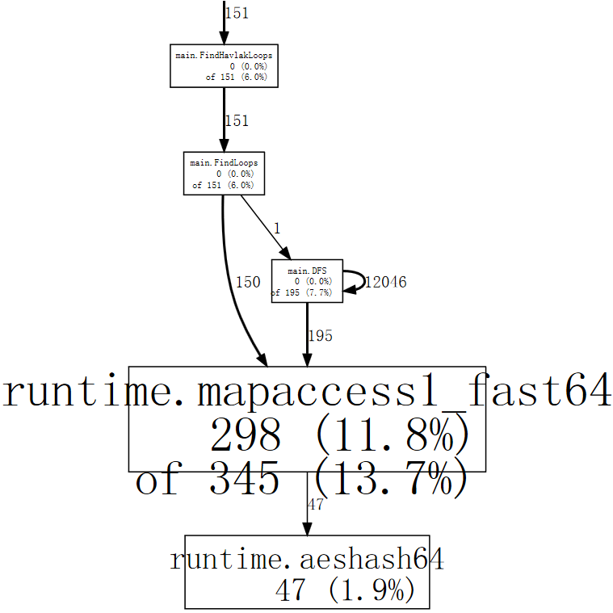

+++
title = "剖析 go 程序"
weight = 17
date = 2023-05-18T17:03:08+08:00
description = ""
isCJKLanguage = true
draft = false
+++

# Profiling Go Programs - 剖析 go 程序

https://go.dev/blog/pprof

Russ Cox, July 2011; updated by Shenghou Ma, May 2013
24 June 2011

At Scala Days 2011, Robert Hundt presented a paper titled [Loop Recognition in C++/Java/Go/Scala.](http://research.google.com/pubs/pub37122.html) The paper implemented a specific loop finding algorithm, such as you might use in a flow analysis pass of a compiler, in C++, Go, Java, Scala, and then used those programs to draw conclusions about typical performance concerns in these languages. The Go program presented in that paper runs quite slowly, making it an excellent opportunity to demonstrate how to use Go’s profiling tools to take a slow program and make it faster.

在2011年Scala日上，Robert Hundt发表了一篇题为《C++/Java/Go/Scala中的循环识别》的论文。该论文在C++、Go、Java、Scala中实现了一种特定的循环查找算法，比如您可能会在编译器的流程分析环节中使用，然后用这些程序对这些语言的典型性能问题得出了结论。在那篇论文中介绍的Go程序运行得相当慢，这使得它成为一个很好的机会来展示如何使用Go的剖析工具来处理一个慢的程序并使其更快。

*By using Go’s profiling tools to identify and correct specific bottlenecks, we can make the Go loop finding program run an order of magnitude faster and use 6x less memory.* (Update: Due to recent optimizations of `libstdc++` in `gcc`, the memory reduction is now 3.7x.)

通过使用Go的剖析工具来识别和纠正特定的瓶颈，我们可以使Go的循环查找程序的运行速度提高一个数量级，并减少6倍的内存使用。(更新：由于最近对gcc中的libstdc++进行了优化，现在内存减少了3.7倍。)

Hundt’s paper does not specify which versions of the C++, Go, Java, and Scala tools he used. In this blog post, we will be using the most recent weekly snapshot of the `6g` Go compiler and the version of `g++` that ships with the Ubuntu Natty distribution. (We will not be using Java or Scala, because we are not skilled at writing efficient programs in either of those languages, so the comparison would be unfair. Since C++ was the fastest language in the paper, the comparisons here with C++ should suffice.) (Update: In this updated post, we will be using the most recent development snapshot of the Go compiler on amd64 and the most recent version of `g++` – 4.8.0, which was released in March 2013.)

Hundt的论文没有说明他使用了哪些版本的C++、Go、Java和Scala工具。在这篇博文中，我们将使用6g Go编译器的最新每周快照和Ubuntu Natty发行版中的g++版本。(我们不会使用Java或Scala，因为我们并不擅长用这两种语言编写高效的程序，所以比较起来会很不公平）。由于C++是论文中速度最快的语言，这里与C++的比较应该足够了）。(更新：在这个更新的帖子中，我们将使用amd64上Go编译器的最新开发快照和g++的最新版本--4.8.0，该版本于2013年3月发布)

```shell linenums="1"
$ go version
go version devel +08d20469cc20 Tue Mar 26 08:27:18 2013 +0100 linux/amd64
$ g++ --version
g++ (GCC) 4.8.0
Copyright (C) 2013 Free Software Foundation, Inc.
...
$
```

The programs are run on a computer with a 3.4GHz Core i7-2600 CPU and 16 GB of RAM running Gentoo Linux’s 3.8.4-gentoo kernel. The machine is running with CPU frequency scaling disabled via

这些程序在一台拥有3.4GHz酷睿i7-2600处理器和16GB内存的计算机上运行，运行Gentoo Linux的3.8.4-gentoo内核。这台机器在运行时禁用了CPU的频率缩放功能，方法是

```shell linenums="1"
$ sudo bash
# for i in /sys/devices/system/cpu/cpu[0-7]
do
    echo performance > $i/cpufreq/scaling_governor
done
#
```

We’ve taken [Hundt’s benchmark programs](https://github.com/hundt98847/multi-language-bench) in C++ and Go, combined each into a single source file, and removed all but one line of output. We’ll time the program using Linux’s `time` utility with a format that shows user time, system time, real time, and maximum memory usage:

我们把Hundt的C++和Go的基准程序，分别合并到一个源文件中，并删除了除一行之外的所有输出。我们将使用Linux的时间工具为程序计时，其格式显示用户时间、系统时间、实时时间和最大内存使用量：

```shell linenums="1"
$ cat xtime
#!/bin/sh
/usr/bin/time -f '%Uu %Ss %er %MkB %C' "$@"
$

$ make havlak1cc
g++ -O3 -o havlak1cc havlak1.cc
$ ./xtime ./havlak1cc
# of loops: 76002 (total 3800100)
loop-0, nest: 0, depth: 0
17.70u 0.05s 17.80r 715472kB ./havlak1cc
$

$ make havlak1
go build havlak1.go
$ ./xtime ./havlak1
# of loops: 76000 (including 1 artificial root node)
25.05u 0.11s 25.20r 1334032kB ./havlak1
$
```

The C++ program runs in 17.80 seconds and uses 700 MB of memory. The Go program runs in 25.20 seconds and uses 1302 MB of memory. (These measurements are difficult to reconcile with the ones in the paper, but the point of this post is to explore how to use `go tool pprof`, not to reproduce the results from the paper.)

C++程序的运行时间为17.80秒，使用700MB的内存。Go程序的运行时间为25.20秒，使用1302MB的内存。(这些测量结果很难与论文中的测量结果相吻合，但这篇文章的重点是探讨如何使用Go工具pprof，而不是重现论文中的结果)。

To start tuning the Go program, we have to enable profiling. If the code used the [Go testing package](https://go.dev/pkg/testing/)’s benchmarking support, we could use gotest’s standard `-cpuprofile` and `-memprofile` flags. In a standalone program like this one, we have to import `runtime/pprof` and add a few lines of code:

为了开始调整Go程序，我们必须启用剖析功能。如果代码使用了Go测试包的基准测试支持，我们可以使用gotest的标准-cpuprofile和-memprofile标志。在像这样的独立程序中，我们必须导入 runtime/pprof 并添加几行代码：

```go linenums="1"
var cpuprofile = flag.String("cpuprofile", "", "write cpu profile to file")

func main() {
    flag.Parse()
    if *cpuprofile != "" {
        f, err := os.Create(*cpuprofile)
        if err != nil {
            log.Fatal(err)
        }
        pprof.StartCPUProfile(f)
        defer pprof.StopCPUProfile()
    }
    ...
```

The new code defines a flag named `cpuprofile`, calls the [Go flag library](https://go.dev/pkg/flag/) to parse the command line flags, and then, if the `cpuprofile` flag has been set on the command line, [starts CPU profiling](https://go.dev/pkg/runtime/pprof/#StartCPUProfile) redirected to that file. The profiler requires a final call to [`StopCPUProfile`](https://go.dev/pkg/runtime/pprof/#StopCPUProfile) to flush any pending writes to the file before the program exits; we use `defer` to make sure this happens as `main` returns.

新代码定义了一个名为cpuprofile的标志，调用Go标志库来解析命令行标志，然后，如果cpuprofile标志已经在命令行上设置，就开始重定向到该文件的CPU剖析。剖析器需要最后调用StopCPUProfile，以便在程序退出前刷新任何待写的文件；我们使用defer来确保main返回时发生这种情况。

After adding that code, we can run the program with the new `-cpuprofile` flag and then run `go tool pprof` to interpret the profile.

添加完这些代码后，我们可以用新的-cpuprofile标志运行程序，然后运行go工具prof来解释剖析。

```shell linenums="1"
$ make havlak1.prof
./havlak1 -cpuprofile=havlak1.prof
# of loops: 76000 (including 1 artificial root node)
$ go tool pprof havlak1 havlak1.prof
Welcome to pprof!  For help, type 'help'.
(pprof)
```

The `go tool pprof` program is a slight variant of [Google’s `pprof` C++ profiler](https://github.com/gperftools/gperftools). The most important command is `topN`, which shows the top `N` samples in the profile:

go tool pprof程序是Google的pprof C++剖析器的一个轻微变种。最重要的命令是topN，它显示剖析中的前N个样本。

```
(pprof) top10
Total: 2525 samples
     298  11.8%  11.8%      345  13.7% runtime.mapaccess1_fast64
     268  10.6%  22.4%     2124  84.1% main.FindLoops
     251   9.9%  32.4%      451  17.9% scanblock
     178   7.0%  39.4%      351  13.9% hash_insert
     131   5.2%  44.6%      158   6.3% sweepspan
     119   4.7%  49.3%      350  13.9% main.DFS
      96   3.8%  53.1%       98   3.9% flushptrbuf
      95   3.8%  56.9%       95   3.8% runtime.aeshash64
      95   3.8%  60.6%      101   4.0% runtime.settype_flush
      88   3.5%  64.1%      988  39.1% runtime.mallocgc
```

When CPU profiling is enabled, the Go program stops about 100 times per second and records a sample consisting of the program counters on the currently executing goroutine’s stack. The profile has 2525 samples, so it was running for a bit over 25 seconds. In the `go tool pprof` output, there is a row for each function that appeared in a sample. The first two columns show the number of samples in which the function was running (as opposed to waiting for a called function to return), as a raw count and as a percentage of total samples. The `runtime.mapaccess1_fast64` function was running during 298 samples, or 11.8%. The `top10` output is sorted by this sample count. The third column shows the running total during the listing: the first three rows account for 32.4% of the samples. The fourth and fifth columns show the number of samples in which the function appeared (either running or waiting for a called function to return). The `main.FindLoops` function was running in 10.6% of the samples, but it was on the call stack (it or functions it called were running) in 84.1% of the samples.

当启用CPU剖析时，Go程序每秒会停止约100次，并记录由当前执行的goroutine的堆栈上的程序计数器组成的样本。剖析有2525个样本，所以它的运行时间有点超过25秒。在go工具pprof的输出中，有一行是出现在样本中的每个函数。前两列显示了函数在其中运行的样本数（相对于等待被调用的函数返回），分别是原始计数和占总样本的百分比。runtime.mapaccess1_fast64函数在298个样本中运行，即11.8%。前10名的输出是按这个样本数排序的。第三列显示了列表期间的运行总量：前三行占了32.4%的样本。第四列和第五列显示了函数出现的样本数（要么在运行，要么在等待被调用的函数返回）。main.FindLoops函数在10.6%的样本中运行，但它在84.1%的样本中出现在调用栈中（它或它调用的函数在运行）。

To sort by the fourth and fifth columns, use the `-cum` (for cumulative) flag:

要按第四和第五列排序，请使用-cum（代表累积）标志：

```
(pprof) top5 -cum
Total: 2525 samples
       0   0.0%   0.0%     2144  84.9% gosched0
       0   0.0%   0.0%     2144  84.9% main.main
       0   0.0%   0.0%     2144  84.9% runtime.main
       0   0.0%   0.0%     2124  84.1% main.FindHavlakLoops
     268  10.6%  10.6%     2124  84.1% main.FindLoops
(pprof) top5 -cum
```

In fact the total for `main.FindLoops` and `main.main` should have been 100%, but each stack sample only includes the bottom 100 stack frames; during about a quarter of the samples, the recursive `main.DFS` function was more than 100 frames deeper than `main.main` so the complete trace was truncated.

事实上，main.FindLoops和main.main的总数应该是100%，但是每个堆栈样本只包括最下面的100个堆栈帧；在大约四分之一的样本中，递归的main.DFS函数比main.main的深度超过100帧，所以完整的跟踪被截断了。

The stack trace samples contain more interesting data about function call relationships than the text listings can show. The `web` command writes a graph of the profile data in SVG format and opens it in a web browser. (There is also a `gv` command that writes PostScript and opens it in Ghostview. For either command, you need [graphviz](http://www.graphviz.org/) installed.)

堆栈跟踪样本包含了比文本列表所能显示的更有趣的函数调用关系数据。web命令以SVG格式写出剖析数据的图表，并在web浏览器中打开它。(还有一个gv命令可以写出PostScript并在Ghostview中打开。对于这两个命令，您都需要安装graphviz）。

```
(pprof) web
```

A small fragment of [the full graph](https://rawgit.com/rsc/benchgraffiti/master/havlak/havlak1.svg) looks like:

完整图形的一个小片段看起来像：


Each box in the graph corresponds to a single function, and the boxes are sized according to the number of samples in which the function was running. An edge from box X to box Y indicates that X calls Y; the number along the edge is the number of times that call appears in a sample. If a call appears multiple times in a single sample, such as during recursive function calls, each appearance counts toward the edge weight. That explains the 21342 on the self-edge from `main.DFS` to itself.

图中的每个方框都对应于一个函数，方框的大小是根据该函数运行的样本数来确定的。从盒子X到盒子Y的边表示X调用Y；沿边的数字是该调用在一个样本中出现的次数。如果一个调用在一个样本中出现多次，比如在递归函数调用过程中，每次出现都会计入边缘权重。这就解释了从main.DFS到它自己的21342条自我边缘的情况。

Just at a glance, we can see that the program spends much of its time in hash operations, which correspond to use of Go’s `map` values. We can tell `web` to use only samples that include a specific function, such as `runtime.mapaccess1_fast64`, which clears some of the noise from the graph:

只需看一眼，我们就可以看到程序花了很多时间在散列操作上，这相当于使用了Go的映射值。我们可以告诉web只使用包含特定函数的样本，比如runtime.mapaccess1_fast64，这样可以清除图中的一些噪音：

```
(pprof) web mapaccess1
```



If we squint, we can see that the calls to `runtime.mapaccess1_fast64` are being made by `main.FindLoops` and `main.DFS`.

如果我们眯起眼睛，我们可以看到对runtime.mapaccess1_fast64的调用是由main.FindLoops和main.DFS进行的。

Now that we have a rough idea of the big picture, it’s time to zoom in on a particular function. Let’s look at `main.DFS` first, just because it is a shorter function:

现在我们对大局有了一个粗略的概念，现在是时候放大某个特定的函数了。让我们先看看 main.DFS，因为它是一个较短的函数：

```
(pprof) list DFS
Total: 2525 samples
ROUTINE ====================== main.DFS in /home/rsc/g/benchgraffiti/havlak/havlak1.go
   119    697 Total samples (flat / cumulative)
     3      3  240: func DFS(currentNode *BasicBlock, nodes []*UnionFindNode, number map[*BasicBlock]int, last []int, current int) int {
     1      1  241:     nodes[current].Init(currentNode, current)
     1     37  242:     number[currentNode] = current
     .      .  243:
     1      1  244:     lastid := current
    89     89  245:     for _, target := range currentNode.OutEdges {
     9    152  246:             if number[target] == unvisited {
     7    354  247:                     lastid = DFS(target, nodes, number, last, lastid+1)
     .      .  248:             }
     .      .  249:     }
     7     59  250:     last[number[currentNode]] = lastid
     1      1  251:     return lastid
(pprof)
```

The listing shows the source code for the `DFS` function (really, for every function matching the regular expression `DFS`). The first three columns are the number of samples taken while running that line, the number of samples taken while running that line or in code called from that line, and the line number in the file. The related command `disasm` shows a disassembly of the function instead of a source listing; when there are enough samples this can help you see which instructions are expensive. The `weblist` command mixes the two modes: it shows [a source listing in which clicking a line shows the disassembly](https://rawgit.com/rsc/benchgraffiti/master/havlak/havlak1.html).

该清单显示了DFS函数的源代码（实际上是每个与正则表达式DFS匹配的函数的源代码）。前三列是运行该行时的样本数，运行该行时或从该行调用的代码中的样本数，以及文件中的行号。相关的命令disasm显示了函数的反汇编，而不是源列表；当有足够的样本时，这可以帮助您看到哪些指令是昂贵的。weblist命令混合了这两种模式：它显示了一个源列表，点击其中的一行就可以看到反汇编。

Since we already know that the time is going into map lookups implemented by the hash runtime functions, we care most about the second column. A large fraction of time is spent in recursive calls to `DFS` (line 247), as would be expected from a recursive traversal. Excluding the recursion, it looks like the time is going into the accesses to the `number` map on lines 242, 246, and 250. For that particular lookup, a map is not the most efficient choice. Just as they would be in a compiler, the basic block structures have unique sequence numbers assigned to them. Instead of using a `map[*BasicBlock]int` we can use a `[]int`, a slice indexed by the block number. There’s no reason to use a map when an array or slice will do.

由于我们已经知道时间是花在由哈希运行时函数实现的地图查找上，我们最关心的是第二列。很大一部分时间花在了对DFS的递归调用上（第247行），这是对递归遍历的预期。如果不考虑递归，看起来时间花在了对第242、246和250行的数字地图的访问上。对于这个特定的查询，地图不是最有效的选择。就像它们在编译器中一样，基本块结构有唯一的序列号分配给它们。与其使用map[*BasicBlock]int，我们不如使用[]int，一个由块号索引的片断。当一个数组或片断就可以的时候，没有理由使用map。

Changing `number` from a map to a slice requires editing seven lines in the program and cut its run time by nearly a factor of two:

从map到slice的改变需要在程序中编辑7行，并将其运行时间减少近1倍：

```shell linenums="1"
$ make havlak2
go build havlak2.go
$ ./xtime ./havlak2
# of loops: 76000 (including 1 artificial root node)
16.55u 0.11s 16.69r 1321008kB ./havlak2
$
```

(See the [diff between `havlak1` and `havlak2`](https://github.com/rsc/benchgraffiti/commit/58ac27bcac3ffb553c29d0b3fb64745c91c95948))

(参见havlak1和havlak2之间的差异)

We can run the profiler again to confirm that `main.DFS` is no longer a significant part of the run time:

我们可以再次运行剖析器以确认main.DFS不再是运行时间的重要部分：

```shell linenums="1"
$ make havlak2.prof
./havlak2 -cpuprofile=havlak2.prof
# of loops: 76000 (including 1 artificial root node)
$ go tool pprof havlak2 havlak2.prof
Welcome to pprof!  For help, type 'help'.
(pprof)
(pprof) top5
Total: 1652 samples
     197  11.9%  11.9%      382  23.1% scanblock
     189  11.4%  23.4%     1549  93.8% main.FindLoops
     130   7.9%  31.2%      152   9.2% sweepspan
     104   6.3%  37.5%      896  54.2% runtime.mallocgc
      98   5.9%  43.5%      100   6.1% flushptrbuf
(pprof)
```

The entry `main.DFS` no longer appears in the profile, and the rest of the program runtime has dropped too. Now the program is spending most of its time allocating memory and garbage collecting (`runtime.mallocgc`, which both allocates and runs periodic garbage collections, accounts for 54.2% of the time). To find out why the garbage collector is running so much, we have to find out what is allocating memory. One way is to add memory profiling to the program. We’ll arrange that if the `-memprofile` flag is supplied, the program stops after one iteration of the loop finding, writes a memory profile, and exits:

main.DFS条目不再出现在配置文件中，程序的其他运行时间也下降了。现在，程序的大部分时间都花在分配内存和垃圾回收上（runtime.mallocgc，既分配内存又运行定期的垃圾回收，占了54.2%的时间）。为了找出垃圾收集器运行的原因，我们必须找出是什么在分配内存。一种方法是在程序中加入内存剖析。我们将安排，如果提供了-memprofile标志，程序会在循环查找的一次迭代后停止，写一个内存剖析，然后退出。

```go linenums="1"
var memprofile = flag.String("memprofile", "", "write memory profile to this file")
...

    FindHavlakLoops(cfgraph, lsgraph)
    if *memprofile != "" {
        f, err := os.Create(*memprofile)
        if err != nil {
            log.Fatal(err)
        }
        pprof.WriteHeapProfile(f)
        f.Close()
        return
    }
```

We invoke the program with `-memprofile` flag to write a profile:

我们调用带有-memprofile标志的程序来写一个配置文件：

```go linenums="1"
$ make havlak3.mprof
go build havlak3.go
./havlak3 -memprofile=havlak3.mprof
$
```

(See the [diff from havlak2](https://github.com/rsc/benchgraffiti/commit/b78dac106bea1eb3be6bb3ca5dba57c130268232))

(见与havlak2的差异)

We use `go tool pprof` exactly the same way. Now the samples we are examining are memory allocations, not clock ticks.

我们以完全相同的方式使用go工具pprof。现在我们要检查的样本是内存分配，而不是时钟刻度。

```shell linenums="1"
$ go tool pprof havlak3 havlak3.mprof
Adjusting heap profiles for 1-in-524288 sampling rate
Welcome to pprof!  For help, type 'help'.
(pprof) top5
Total: 82.4 MB
    56.3  68.4%  68.4%     56.3  68.4% main.FindLoops
    17.6  21.3%  89.7%     17.6  21.3% main.(*CFG).CreateNode
     8.0   9.7%  99.4%     25.6  31.0% main.NewBasicBlockEdge
     0.5   0.6% 100.0%      0.5   0.6% itab
     0.0   0.0% 100.0%      0.5   0.6% fmt.init
(pprof)
```

The command `go tool pprof` reports that `FindLoops` has allocated approximately 56.3 of the 82.4 MB in use; `CreateNode` accounts for another 17.6 MB. To reduce overhead, the memory profiler only records information for approximately one block per half megabyte allocated (the "1-in-524288 sampling rate"), so these are approximations to the actual counts.

命令去工具pprof报告说，FindLoops在使用的82.4MB中分配了大约56.3MB；CreateNode又占了17.6MB。为了减少开销，内存剖析器只记录每半兆字节分配的大约一个块的信息（"1-in-524288采样率"），所以这些是实际计数的近似值。

To find the memory allocations, we can list those functions.

为了找到内存分配，我们可以列出这些函数。

```
(pprof) list FindLoops
Total: 82.4 MB
ROUTINE ====================== main.FindLoops in /home/rsc/g/benchgraffiti/havlak/havlak3.go
  56.3   56.3 Total MB (flat / cumulative)
...
   1.9    1.9  268:     nonBackPreds := make([]map[int]bool, size)
   5.8    5.8  269:     backPreds := make([][]int, size)
     .      .  270:
   1.9    1.9  271:     number := make([]int, size)
   1.9    1.9  272:     header := make([]int, size, size)
   1.9    1.9  273:     types := make([]int, size, size)
   1.9    1.9  274:     last := make([]int, size, size)
   1.9    1.9  275:     nodes := make([]*UnionFindNode, size, size)
     .      .  276:
     .      .  277:     for i := 0; i < size; i++ {
   9.5    9.5  278:             nodes[i] = new(UnionFindNode)
     .      .  279:     }
...
     .      .  286:     for i, bb := range cfgraph.Blocks {
     .      .  287:             number[bb.Name] = unvisited
  29.5   29.5  288:             nonBackPreds[i] = make(map[int]bool)
     .      .  289:     }
...
```

It looks like the current bottleneck is the same as the last one: using maps where simpler data structures suffice. `FindLoops` is allocating about 29.5 MB of maps.

看起来目前的瓶颈与上一个瓶颈相同：在更简单的数据结构中使用地图就够了。FindLoops正在分配大约29.5MB的地图。

As an aside, if we run `go tool pprof` with the `--inuse_objects` flag, it will report allocation counts instead of sizes:

顺便提一下，如果我们用-inuse_objects标志运行go tool pprof，它将报告分配数量而不是大小。

```shell linenums="1"
$ go tool pprof --inuse_objects havlak3 havlak3.mprof
Adjusting heap profiles for 1-in-524288 sampling rate
Welcome to pprof!  For help, type 'help'.
(pprof) list FindLoops
Total: 1763108 objects
ROUTINE ====================== main.FindLoops in /home/rsc/g/benchgraffiti/havlak/havlak3.go
720903 720903 Total objects (flat / cumulative)
...
     .      .  277:     for i := 0; i < size; i++ {
311296 311296  278:             nodes[i] = new(UnionFindNode)
     .      .  279:     }
     .      .  280:
     .      .  281:     // Step a:
     .      .  282:     //   - initialize all nodes as unvisited.
     .      .  283:     //   - depth-first traversal and numbering.
     .      .  284:     //   - unreached BB's are marked as dead.
     .      .  285:     //
     .      .  286:     for i, bb := range cfgraph.Blocks {
     .      .  287:             number[bb.Name] = unvisited
409600 409600  288:             nonBackPreds[i] = make(map[int]bool)
     .      .  289:     }
...
(pprof)
```

Since the ~200,000 maps account for 29.5 MB, it looks like the initial map allocation takes about 150 bytes. That’s reasonable when a map is being used to hold key-value pairs, but not when a map is being used as a stand-in for a simple set, as it is here.

由于~200,000个地图占29.5MB，看起来初始地图分配需要大约150字节。当地图被用来保存键值对时，这是合理的，但当地图被用作简单集合的替身时，就不是这样了。

Instead of using a map, we can use a simple slice to list the elements. In all but one of the cases where maps are being used, it is impossible for the algorithm to insert a duplicate element. In the one remaining case, we can write a simple variant of the `append` built-in function:

我们可以用一个简单的片断来列出元素，而不是使用一个地图。除了一种情况，在所有使用地图的情况下，算法都不可能插入一个重复的元素。在剩下的一种情况下，我们可以写一个append内置函数的简单变体。

```go linenums="1"
func appendUnique(a []int, x int) []int {
    for _, y := range a {
        if x == y {
            return a
        }
    }
    return append(a, x)
}
```

In addition to writing that function, changing the Go program to use slices instead of maps requires changing just a few lines of code.

除了编写该函数外，将Go程序改为使用切片而不是地图，只需要修改几行代码。

```shell linenums="1"
$ make havlak4
go build havlak4.go
$ ./xtime ./havlak4
# of loops: 76000 (including 1 artificial root node)
11.84u 0.08s 11.94r 810416kB ./havlak4
$
```

(See the [diff from havlak3](https://github.com/rsc/benchgraffiti/commit/245d899f7b1a33b0c8148a4cd147cb3de5228c8a))

(参见与havlak3的差异)

We’re now at 2.11x faster than when we started. Let’s look at a CPU profile again.

我们现在的速度是开始时的2.11倍。让我们再看一下CPU配置文件。

```shell linenums="1"
$ make havlak4.prof
./havlak4 -cpuprofile=havlak4.prof
# of loops: 76000 (including 1 artificial root node)
$ go tool pprof havlak4 havlak4.prof
Welcome to pprof!  For help, type 'help'.
(pprof) top10
Total: 1173 samples
     205  17.5%  17.5%     1083  92.3% main.FindLoops
     138  11.8%  29.2%      215  18.3% scanblock
      88   7.5%  36.7%       96   8.2% sweepspan
      76   6.5%  43.2%      597  50.9% runtime.mallocgc
      75   6.4%  49.6%       78   6.6% runtime.settype_flush
      74   6.3%  55.9%       75   6.4% flushptrbuf
      64   5.5%  61.4%       64   5.5% runtime.memmove
      63   5.4%  66.8%      524  44.7% runtime.growslice
      51   4.3%  71.1%       51   4.3% main.DFS
      50   4.3%  75.4%      146  12.4% runtime.MCache_Alloc
(pprof)
```

Now memory allocation and the consequent garbage collection (`runtime.mallocgc`) accounts for 50.9% of our run time. Another way to look at why the system is garbage collecting is to look at the allocations that are causing the collections, the ones that spend most of the time in `mallocgc`:

现在，内存分配和随之而来的垃圾收集（runtime.mallocgc）占了我们运行时间的50.9%。观察系统为什么要进行垃圾收集的另一个方法是看一下导致收集的分配，也就是那些在mallocgc中花费了大部分时间的分配：

```
(pprof) web mallocgc
```


It’s hard to tell what’s going on in that graph, because there are many nodes with small sample numbers obscuring the big ones. We can tell `go tool pprof` to ignore nodes that don’t account for at least 10% of the samples:

在这张图中很难分辨出发生了什么，因为有很多节点的小样本数掩盖了大样本数。我们可以告诉go tool pprof忽略那些至少不占10%样本数的节点：

```shell linenums="1"
$ go tool pprof --nodefraction=0.1 havlak4 havlak4.prof
Welcome to pprof!  For help, type 'help'.
(pprof) web mallocgc
```


We can follow the thick arrows easily now, to see that `FindLoops` is triggering most of the garbage collection. If we list `FindLoops` we can see that much of it is right at the beginning:

我们现在可以很容易地跟随粗大的箭头，看到FindLoops触发了大部分的垃圾收集。如果我们列出FindLoops，我们可以看到它的大部分都是在开头：

```
(pprof) list FindLoops
...
     .      .  270: func FindLoops(cfgraph *CFG, lsgraph *LSG) {
     .      .  271:     if cfgraph.Start == nil {
     .      .  272:             return
     .      .  273:     }
     .      .  274:
     .      .  275:     size := cfgraph.NumNodes()
     .      .  276:
     .    145  277:     nonBackPreds := make([][]int, size)
     .      9  278:     backPreds := make([][]int, size)
     .      .  279:
     .      1  280:     number := make([]int, size)
     .     17  281:     header := make([]int, size, size)
     .      .  282:     types := make([]int, size, size)
     .      .  283:     last := make([]int, size, size)
     .      .  284:     nodes := make([]*UnionFindNode, size, size)
     .      .  285:
     .      .  286:     for i := 0; i < size; i++ {
     2     79  287:             nodes[i] = new(UnionFindNode)
     .      .  288:     }
...
(pprof)
```

Every time `FindLoops` is called, it allocates some sizable bookkeeping structures. Since the benchmark calls `FindLoops` 50 times, these add up to a significant amount of garbage, so a significant amount of work for the garbage collector.

每次FindLoops被调用时，它都会分配一些可观的记账结构。由于该基准调用FindLoops 50次，这些加起来就是大量的垃圾，所以对垃圾收集器来说也是大量的工作。

Having a garbage-collected language doesn’t mean you can ignore memory allocation issues. In this case, a simple solution is to introduce a cache so that each call to `FindLoops` reuses the previous call’s storage when possible. (In fact, in Hundt’s paper, he explains that the Java program needed just this change to get anything like reasonable performance, but he did not make the same change in the other garbage-collected implementations.)

拥有一个垃圾收集器的语言并不意味着您可以忽视内存分配问题。在这种情况下，一个简单的解决方案是引入一个缓存，使每次对FindLoops的调用都尽可能地重用前一次调用的存储。(事实上，在Hundt的论文中，他解释说Java程序只需要这样的改变就可以获得合理的性能，但他在其他垃圾收集的实现中没有做同样的改变)。

We’ll add a global `cache` structure:

我们将添加一个全局缓存结构：

```go linenums="1"
var cache struct {
    size int
    nonBackPreds [][]int
    backPreds [][]int
    number []int
    header []int
    types []int
    last []int
    nodes []*UnionFindNode
}
```

and then have `FindLoops` consult it as a replacement for allocation:

然后让FindLoops咨询它作为分配的替代：

```go linenums="1"
if cache.size < size {
    cache.size = size
    cache.nonBackPreds = make([][]int, size)
    cache.backPreds = make([][]int, size)
    cache.number = make([]int, size)
    cache.header = make([]int, size)
    cache.types = make([]int, size)
    cache.last = make([]int, size)
    cache.nodes = make([]*UnionFindNode, size)
    for i := range cache.nodes {
        cache.nodes[i] = new(UnionFindNode)
    }
}

nonBackPreds := cache.nonBackPreds[:size]
for i := range nonBackPreds {
    nonBackPreds[i] = nonBackPreds[i][:0]
}
backPreds := cache.backPreds[:size]
for i := range nonBackPreds {
    backPreds[i] = backPreds[i][:0]
}
number := cache.number[:size]
header := cache.header[:size]
types := cache.types[:size]
last := cache.last[:size]
nodes := cache.nodes[:size]
```

Such a global variable is bad engineering practice, of course: it means that concurrent calls to `FindLoops` are now unsafe. For now, we are making the minimal possible changes in order to understand what is important for the performance of our program; this change is simple and mirrors the code in the Java implementation. The final version of the Go program will use a separate `LoopFinder` instance to track this memory, restoring the possibility of concurrent use.

当然，这样一个全局变量是不好的工程实践：它意味着现在对FindLoops的并发调用是不安全的。目前，我们正在做尽可能少的改动，以便了解什么对我们的程序的性能是重要的；这种改动很简单，反映了Java实现中的代码。Go程序的最终版本将使用一个单独的LoopFinder实例来跟踪这段内存，恢复了并发使用的可能性。

```shell linenums="1"
$ make havlak5
go build havlak5.go
$ ./xtime ./havlak5
# of loops: 76000 (including 1 artificial root node)
8.03u 0.06s 8.11r 770352kB ./havlak5
$
```

(See the [diff from havlak4](https://github.com/rsc/benchgraffiti/commit/2d41d6d16286b8146a3f697dd4074deac60d12a4))

(参见与havlak4的差异)

There’s more we can do to clean up the program and make it faster, but none of it requires profiling techniques that we haven’t already shown. The work list used in the inner loop can be reused across iterations and across calls to `FindLoops`, and it can be combined with the separate "node pool" generated during that pass. Similarly, the loop graph storage can be reused on each iteration instead of reallocated. In addition to these performance changes, the [final version](https://github.com/rsc/benchgraffiti/blob/master/havlak/havlak6.go) is written using idiomatic Go style, using data structures and methods. The stylistic changes have only a minor effect on the run time: the algorithm and constraints are unchanged.

我们还可以做更多的事情来清理程序，使其更快，但这都不需要我们还没有展示过的剖析技术。在内循环中使用的工作列表可以在不同的迭代和对FindLoops的调用中重复使用，它可以与该过程中产生的单独的 "节点池 "结合起来。同样地，循环图的存储可以在每次迭代中重复使用，而不是重新分配。除了这些性能上的变化外，最终的版本是使用惯用的Go风格编写的，使用数据结构和方法。风格上的变化对运行时间只有很小的影响：算法和约束条件没有变化。

The final version runs in 2.29 seconds and uses 351 MB of memory:

最终版本的运行时间为2.29秒，使用351MB的内存：

```shell linenums="1"
$ make havlak6
go build havlak6.go
$ ./xtime ./havlak6
# of loops: 76000 (including 1 artificial root node)
2.26u 0.02s 2.29r 360224kB ./havlak6
$
```

That’s 11 times faster than the program we started with. Even if we disable reuse of the generated loop graph, so that the only cached memory is the loop finding bookkeeping, the program still runs 6.7x faster than the original and uses 1.5x less memory.

这比我们开始时的程序快了11倍。即使我们禁止重复使用生成的循环图，使唯一的缓存内存是寻找循环的簿记，程序的运行速度仍然比原来的快6.7倍，使用的内存也少1.5倍。

```shell linenums="1"
$ ./xtime ./havlak6 -reuseloopgraph=false
# of loops: 76000 (including 1 artificial root node)
3.69u 0.06s 3.76r 797120kB ./havlak6 -reuseloopgraph=false
$
```

Of course, it’s no longer fair to compare this Go program to the original C++ program, which used inefficient data structures like `set`s where `vector`s would be more appropriate. As a sanity check, we translated the final Go program into [equivalent C++ code](https://github.com/rsc/benchgraffiti/blob/master/havlak/havlak6.cc). Its execution time is similar to the Go program’s:

当然，将这个Go程序与原来的C++程序进行比较已经不公平了，因为后者使用了低效的数据结构，如集合，而向量则更为合适。作为理智的检查，我们将最终的Go程序翻译成等效的C++代码。它的执行时间与Go程序的执行时间相似。


```shell linenums="1"
$ make havlak6cc
g++ -O3 -o havlak6cc havlak6.cc
$ ./xtime ./havlak6cc
# of loops: 76000 (including 1 artificial root node)
1.99u 0.19s 2.19r 387936kB ./havlak6cc
```

The Go program runs almost as fast as the C++ program. As the C++ program is using automatic deletes and allocation instead of an explicit cache, the C++ program a bit shorter and easier to write, but not dramatically so:

Go程序的运行速度几乎和C++程序一样快。由于C++程序使用的是自动删除和分配，而不是显式缓存，所以C++程序更短一些，更容易编写，但并不明显：

```shell linenums="1"
$ wc havlak6.cc; wc havlak6.go
 401 1220 9040 havlak6.cc
 461 1441 9467 havlak6.go
$
```

(See [havlak6.cc](https://github.com/rsc/benchgraffiti/blob/master/havlak/havlak6.cc) and [havlak6.go](https://github.com/rsc/benchgraffiti/blob/master/havlak/havlak6.go))

(见havlak6.cc和havlak6.go)

Benchmarks are only as good as the programs they measure. We used `go tool pprof` to study an inefficient Go program and then to improve its performance by an order of magnitude and to reduce its memory usage by a factor of 3.7. A subsequent comparison with an equivalently optimized C++ program shows that Go can be competitive with C++ when programmers are careful about how much garbage is generated by inner loops.

基准只有在它们所测量的程序中才是好的。我们使用go工具pprof来研究一个低效的Go程序，然后将其性能提高了一个数量级，并将其内存使用量减少了3.7倍。随后与一个同等优化的C++程序的比较表明，当程序员注意内循环产生的垃圾数量时，Go可以与C++竞争。

The program sources, Linux x86-64 binaries, and profiles used to write this post are available in the [benchgraffiti project on GitHub](https://github.com/rsc/benchgraffiti/).

写这篇文章所用的程序源、Linux x86-64二进制文件和配置文件都可以在GitHub上的benchgraffiti项目中找到。

As mentioned above, [`go test`](https://go.dev/cmd/go/#Test_packages) includes these profiling flags already: define a [benchmark function](https://go.dev/pkg/testing/) and you’re all set. There is also a standard HTTP interface to profiling data. In an HTTP server, adding

如上所述，go test已经包括了这些剖析标志：定义一个基准函数，您就可以了。也有一个标准的HTTP接口来获取剖析数据。在一个HTTP服务器中，添加

```shell linenums="1"
import _ "net/http/pprof"
```

will install handlers for a few URLs under `/debug/pprof/`. Then you can run `go tool pprof` with a single argument—the URL to your server’s profiling data and it will download and examine a live profile.

将为/debug/pprof/下的几个URL安装处理程序。然后您可以用一个参数运行go tool pprof--您的服务器的剖析数据的URL，它将下载并检查一个实时剖析。

```shell linenums="1"
go tool pprof http://localhost:6060/debug/pprof/profile   # 30-second CPU profile
go tool pprof http://localhost:6060/debug/pprof/heap      # heap profile
go tool pprof http://localhost:6060/debug/pprof/block     # goroutine blocking profile
```

The goroutine blocking profile will be explained in a future post. Stay tuned.

goroutine阻塞配置文件将在未来的文章中解释。敬请关注。
