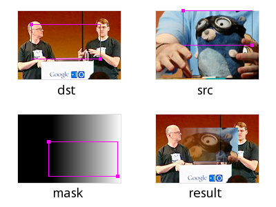
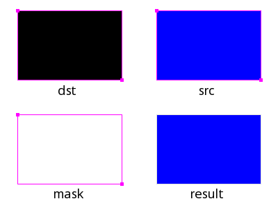
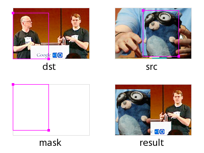
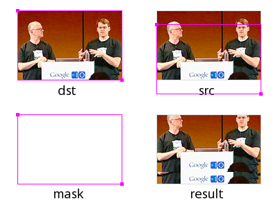
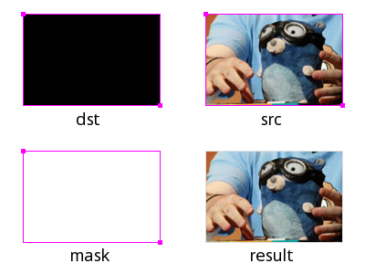
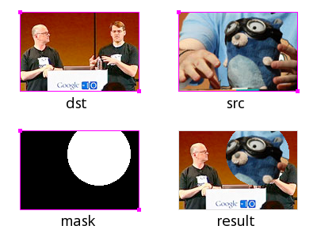
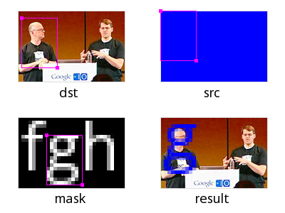

+++
title = "go 的image/draw包"
weight = 7
date = 2023-05-18T17:03:08+08:00
description = ""
isCJKLanguage = true
draft = false
+++

# The Go image/draw package - go 的image/draw包

https://go.dev/blog/image-draw

Nigel Tao
29 September 2011

## Introduction 简介

[Package image/draw](https://go.dev/pkg/image/draw/) defines only one operation: drawing a source image onto a destination image, through an optional mask image. This one operation is surprisingly versatile and can perform a number of common image manipulation tasks elegantly and efficiently.

包image/draw只定义了一个操作：通过一个可选的遮罩图像，将源图像绘制到目标图像上。这一个操作出乎意料的通用性，可以优雅而有效地执行许多常见的图像处理任务。

Composition is performed pixel by pixel in the style of the Plan 9 graphics library and the X Render extension. The model is based on the classic “Compositing Digital Images” paper by Porter and Duff, with an additional mask parameter: `dst = (src IN mask) OP dst`. For a fully opaque mask, this reduces to the original Porter-Duff formula: `dst = src OP dst`. In Go, a nil mask image is equivalent to an infinitely sized, fully opaque mask image.

合成是按照Plan 9图形库和X Render扩展的风格逐像素进行的。该模型基于Porter和Duff的经典论文 "Compositing Digital Images"，并增加了一个遮罩参数：dst = (src IN mask) OP dst。对于一个完全不透明的遮罩，这可以简化为波特-达夫的原始公式：dst = src OP dst。在Go中，无掩码图像相当于一个无限大的、完全不透明的掩码图像。

The Porter-Duff paper presented [12 different composition operators](http://www.w3.org/TR/SVGCompositing/examples/compop-porterduff-examples.png), but with an explicit mask, only 2 of these are needed in practice: source-over-destination and source. In Go, these operators are represented by the `Over` and `Src` constants. The `Over` operator performs the natural layering of a source image over a destination image: the change to the destination image is smaller where the source (after masking) is more transparent (that is, has lower alpha). The `Src` operator merely copies the source (after masking) with no regard for the destination image’s original content. For fully opaque source and mask images, the two operators produce the same output, but the `Src` operator is usually faster.

Porter-Duff的论文提出了12种不同的组合运算符，但在明确的掩码下，实际中只需要其中的两种：源-过-目的和源。在Go中，这些运算符由Over和Src常数表示。Over运算符在目标图像上执行源图像的自然分层：在源图像（屏蔽后）更透明（即α值更低）的地方，对目标图像的改变更小。Src运算符只是复制源图像（屏蔽后），不考虑目的图像的原始内容。对于完全不透明的源图像和屏蔽图像，这两个运算符产生相同的输出，但Src运算符通常更快。

## Geometric Alignment 几何排列

Composition requires associating destination pixels with source and mask pixels. Obviously, this requires destination, source and mask images, and a composition operator, but it also requires specifying what rectangle of each image to use. Not every drawing should write to the entire destination: when updating an animating image, it is more efficient to only draw the parts of the image that have changed. Not every drawing should read from the entire source: when using a sprite that combines many small images into one large one, only a part of the image is needed. Not every drawing should read from the entire mask: a mask image that collects a font’s glyphs is similar to a sprite. Thus, drawing also needs to know three rectangles, one for each image. Since each rectangle has the same width and height, it suffices to pass a destination rectangle `r` and two points `sp` and `mp`: the source rectangle is equal to `r` translated so that `r.Min` in the destination image aligns with `sp` in the source image, and similarly for `mp`. The effective rectangle is also clipped to each image’s bounds in their respective co-ordinate space.

合成需要将目标像素与源和遮罩像素联系起来。显然，这需要目标、源和遮罩图像，以及一个组合运算符，但它也需要指定每个图像的哪个矩形来使用。不是每次绘图都要写到整个目的地：当更新一个动画图像时，只绘制图像中发生变化的部分会更有效率。不是每次绘图都应该从整个源头读取：当使用一个将许多小图像合并成一个大图像的精灵时，只需要图像的一部分就可以了。并非每次绘图都应从整个掩码中读取：收集字体字形的掩码图像与精灵类似。因此，绘图也需要知道三个矩形，每个图像一个。由于每个矩形具有相同的宽度和高度，只需传递一个目的矩形r和两个点sp和mp：源矩形等于r的平移，以便目的图像中的r.Min与源图像中的sp对齐，mp也是如此。有效矩形也被剪切到每个图像在其各自坐标空间的边界上。



The [`DrawMask`](https://go.dev/pkg/image/draw/#DrawMask) function takes seven arguments, but an explicit mask and mask-point are usually unnecessary, so the [`Draw`](https://go.dev/pkg/image/draw/#Draw) function takes five:

DrawMask函数需要7个参数，但明确的遮罩和遮罩点通常是不必要的，所以Draw函数需要5个参数：

```
// Draw calls DrawMask with a nil mask.
func Draw(dst Image, r image.Rectangle, src image.Image, sp image.Point, op Op)
func DrawMask(dst Image, r image.Rectangle, src image.Image, sp image.Point,
 mask image.Image, mp image.Point, op Op)
```

The destination image must be mutable, so the image/draw package defines a [`draw.Image`](https://go.dev/pkg/image/draw/#Image) interface which has a `Set` method.

目的图像必须是可变的，所以image/draw包定义了一个draw.Image接口，它有一个Set方法。

```
type Image interface {
    image.Image
    Set(x, y int, c color.Color)
}
```

## Filling a Rectangle 填充一个矩形

To fill a rectangle with a solid color, use an `image.Uniform` source. The `ColorImage` type re-interprets a `Color` as a practically infinite-sized `Image` of that color. For those familiar with the design of Plan 9’s draw library, there is no need for an explicit “repeat bit” in Go’s slice-based image types; the concept is subsumed by `Uniform`.

要用纯色填充一个矩形，请使用image.Uniform源。ColorImage类型将一个颜色重新解释为该颜色的一个几乎无限大的图像。对于那些熟悉Plan 9绘图库设计的人来说，在Go的基于片断的图像类型中不需要明确的 "重复位"；这个概念被Uniform所包含。

```go linenums="1"
// image.ZP is the zero point -- the origin.
draw.Draw(dst, r, &image.Uniform{c}, image.ZP, draw.Src)
```

To initialize a new image to all-blue:

将一个新图像初始化为全蓝色：

```go linenums="1"
m := image.NewRGBA(image.Rect(0, 0, 640, 480))
blue := color.RGBA{0, 0, 255, 255}
draw.Draw(m, m.Bounds(), &image.Uniform{blue}, image.ZP, draw.Src)
```

To reset an image to transparent (or black, if the destination image’s color model cannot represent transparency), use `image.Transparent`, which is an `image.Uniform`:

要将图像重置为透明（或黑色，如果目标图像的颜色模型不能表示透明），请使用image.Transparent，它是image.Uniform的：

```go linenums="1"
draw.Draw(m, m.Bounds(), image.Transparent, image.ZP, draw.Src)
```



## Copying an Image 复制一个图像

To copy from a rectangle `sr` in the source image to a rectangle starting at a point `dp` in the destination, convert the source rectangle into the destination image’s co-ordinate space:

要从源图像中的矩形sr复制到目标图像中以点dp为起点的矩形，请将源矩形转换成目标图像的坐标空间：

```go linenums="1"
r := image.Rectangle{dp, dp.Add(sr.Size())}
draw.Draw(dst, r, src, sr.Min, draw.Src)
```

Alternatively:

或者说：

```go linenums="1"
r := sr.Sub(sr.Min).Add(dp)
draw.Draw(dst, r, src, sr.Min, draw.Src)
```

To copy the entire source image, use `sr = src.Bounds()`.

要复制整个源图像，使用sr = src.Bounds()。



## Scrolling an Image 滚动图像

Scrolling an image is just copying an image to itself, with different destination and source rectangles. Overlapping destination and source images are perfectly valid, just as Go’s built-in copy function can handle overlapping destination and source slices. To scroll an image m by 20 pixels:

滚动图像只是将一个图像复制到自己身上，目标和源矩形不同。重叠的目标和源图像是完全有效的，就像Go的内置复制函数可以处理重叠的目标和源切片一样。要将一个图像m滚动20个像素：

```go linenums="1"
b := m.Bounds()
p := image.Pt(0, 20)
// Note that even though the second argument is b,
// the effective rectangle is smaller due to clipping.
draw.Draw(m, b, m, b.Min.Add(p), draw.Src)
dirtyRect := b.Intersect(image.Rect(b.Min.X, b.Max.Y-20, b.Max.X, b.Max.Y))
```



## Converting an Image to RGBA 将一个图像转换为RGBA

The result of decoding an image format might not be an `image.RGBA`: decoding a GIF results in an `image.Paletted`, decoding a JPEG results in a `ycbcr.YCbCr`, and the result of decoding a PNG depends on the image data. To convert any image to an `image.RGBA`:

解码一个图像格式的结果可能不是image.RGBA：解码GIF的结果是image.Paletted，解码JPEG的结果是ycbcr.YCbCr，而解码PNG的结果取决于图像数据。要将任何图像转换为`image.RGBA`：

```go linenums="1"
b := src.Bounds()
m := image.NewRGBA(image.Rect(0, 0, b.Dx(), b.Dy()))
draw.Draw(m, m.Bounds(), src, b.Min, draw.Src)
```



## Drawing Through a Mask 通过遮罩画图

To draw an image through a circular mask with center `p` and radius `r`:

通过一个中心为p、半径为r的圆形遮罩来绘制图像：

```go linenums="1"
type circle struct {
    p image.Point
    r int
}

func (c *circle) ColorModel() color.Model {
    return color.AlphaModel
}

func (c *circle) Bounds() image.Rectangle {
    return image.Rect(c.p.X-c.r, c.p.Y-c.r, c.p.X+c.r, c.p.Y+c.r)
}

func (c *circle) At(x, y int) color.Color {
    xx, yy, rr := float64(x-c.p.X)+0.5, float64(y-c.p.Y)+0.5, float64(c.r)
    if xx*xx+yy*yy < rr*rr {
        return color.Alpha{255}
    }
    return color.Alpha{0}
}

    draw.DrawMask(dst, dst.Bounds(), src, image.ZP, &circle{p, r}, image.ZP, draw.Over)
```



## Drawing Font Glyphs 绘制字体字形

To draw a font glyph in blue starting from a point `p`, draw with an `image.ColorImage` source and an `image.Alpha mask`. For simplicity, we aren’t performing any sub-pixel positioning or rendering, or correcting for a font’s height above a baseline.

为了从一个点p开始绘制一个蓝色的字体字形，用image.ColorImage源和image.Alpha蒙版进行绘制。为了简单起见，我们不进行任何亚像素定位或渲染，也不对字体在基线上的高度进行校正。

```go linenums="1"
src := &image.Uniform{color.RGBA{0, 0, 255, 255}}
mask := theGlyphImageForAFont()
mr := theBoundsFor(glyphIndex)
draw.DrawMask(dst, mr.Sub(mr.Min).Add(p), src, image.ZP, mask, mr.Min, draw.Over)
```



## Performance 性能

The image/draw package implementation demonstrates how to provide an image manipulation function that is both general purpose, yet efficient for common cases. The `DrawMask` function takes arguments of interface types, but immediately makes type assertions that its arguments are of specific struct types, corresponding to common operations like drawing one `image.RGBA` image onto another, or drawing an `image.Alpha` mask (such as a font glyph) onto an `image.RGBA` image. If a type assertion succeeds, that type information is used to run a specialized implementation of the general algorithm. If the assertions fail, the fallback code path uses the generic `At` and `Set` methods. The fast-paths are purely a performance optimization; the resultant destination image is the same either way. In practice, only a small number of special cases are necessary to support typical applications.

image/draw包的实现演示了如何提供一个既通用又对普通情况有效的图像操作函数。DrawMask函数接受接口类型的参数，但立即进行类型断言，它的参数是特定的结构类型，对应于常见的操作，如将一个image.RGBA图像绘制到另一个图像上，或将一个image.Alpha掩码（如一个字体字形）绘制到image.RGBA图像上。如果一个类型断言成功，该类型信息就会被用来运行一般算法的专门实现。如果断言失败，后备代码路径使用通用的At和Set方法。快速路径纯粹是一种性能优化；无论哪种方式，所产生的目标图像都是一样的。在实践中，只有少量的特殊情况是必要的，以支持典型的应用。
