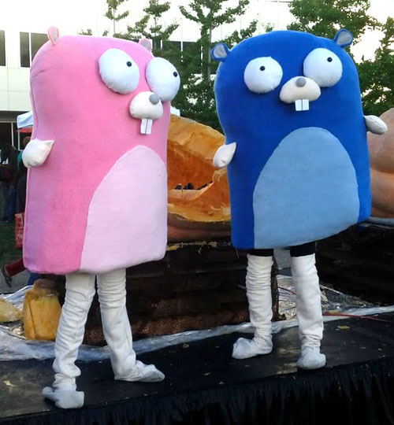

+++
title = "go 编程语言两岁了"
weight = 4
date = 2023-05-18T17:03:08+08:00
description = ""
isCJKLanguage = true
draft = false
+++

# The Go Programming Language turns two - go 编程语言两岁了

https://go.dev/blog/2years

Andrew Gerrand
10 November 2011

Two years ago a small team at Google went public with their fledgling project - the Go Programming Language. They presented a language spec, two compilers, a modest standard library, some novel tools, and plenty of accurate (albeit succinct) documentation. They watched with excitement as programmers around the world began to play with Go. The team continued to iterate and improve on what they had built, and were gradually joined by dozens - and then hundreds - of programmers from the open source community. The Go Authors went on to produce lots of libraries, new tools, and reams of [documentation](https://go.dev/doc/docs.html). They celebrated a successful year in the public eye with a [blog post](https://blog.golang.org/2010/11/go-one-year-ago-today.html) last November that concluded "Go is certainly ready for production use, but there is still room for improvement. Our focus for the immediate future is making Go programs faster and more efficient in the context of high performance systems."

两年前，谷歌的一个小团队公开了他们刚刚起步的项目--Go编程语言。他们提出了一个语言规范，两个编译器，一个适度的标准库，一些新的工具，以及大量准确（尽管简洁）的文档。他们兴奋地看着全世界的程序员开始玩Go。该团队继续迭代和改进他们所建立的东西，并逐渐有几十个--然后是几百个--开源社区的程序员加入。Go作者们继续制作了许多库、新工具和大量的文档。他们在去年11月发表了一篇博客文章来庆祝在公众面前成功的一年，文章的结论是："Go当然已经准备好用于生产，但仍有改进的空间。我们近期的重点是使Go程序在高性能系统的背景下更快、更有效"。

Today is the second anniversary of Go’s release, and Go is faster and more stable than ever. Careful tuning of Go’s code generators, concurrency primitives, garbage collector, and core libraries have increased the performance of Go programs, and native support for [profiling](https://blog.golang.org/2011/06/profiling-go-programs.html) and [debugging](http://blog.golang.org/2011/10/debugging-go-programs-with-gnu-debugger.html) makes it easier to detect and remove performance issues in user code. Go is also now easier to learn with [A Tour of Go](https://go.dev/tour/), an interactive tutorial you can take from the comfort of your web browser.

今天是Go发布的两周年，Go比以前更快、更稳定。对Go的代码生成器、并发基元、垃圾收集器和核心库的仔细调整提高了Go程序的性能，而对剖析和调试的本地支持使其更容易检测和消除用户代码中的性能问题。Go现在也更容易学习了，A Tour of Go是一个交互式的教程，您可以在您的网络浏览器中舒适地学习。

This year we introduced the experimental [Go runtime](http://code.google.com/appengine/docs/go/) for Google’s App Engine platform, and we have been steadily increasing the Go runtime’s support for App Engine’s APIs. Just this week we released [version 1.6.0](http://code.google.com/appengine/downloads.html) of the Go App Engine SDK, which includes support for [backends](http://code.google.com/appengine/docs/go/backends/overview.html) (long-running processes), finer control over datastore indexes, and various other improvements. Today, the Go runtime is near feature parity with - and is a viable alternative to - the Python and Java runtimes. In fact, we now serve [golang.org](https://go.dev/) by running a version of [godoc](https://go.dev/cmd/godoc/) on the App Engine service.

今年，我们为谷歌的App Engine平台引入了实验性的Go运行时，并且我们一直在稳步增加Go运行时对App Engine的API的支持。就在本周，我们发布了1.6.0版本的Go App Engine SDK，其中包括对后端（长期运行的进程）的支持，对数据存储索引的更精细控制，以及其他各种改进。今天，Go运行时的功能已经接近于Python和Java运行时，并且是一个可行的替代品。事实上，我们现在通过在App Engine服务上运行godoc的一个版本来为golang.org服务。

While 2010 was a year of discovery and experimentation, 2011 was a year of fine tuning and planning for the future. This year we issued several "[release](https://go.dev/doc/devel/release.html)" versions of Go that were more reliable and better supported than weekly snapshots. We also introduced [gofix](https://go.dev/cmd/gofix/) to take the pain out of migrating to newer releases. Furthermore, last month we announced a [plan for Go version 1](https://blog.golang.org/2011/10/preview-of-go-version-1.html) - a release that will be supported for years to come. Work toward Go 1 is already underway and you can observe our progress by the latest weekly snapshot at [weekly.golang.org](http://weekly.golang.org/pkg/).

2010年是探索和实验的一年，2011年则是微调和规划未来的一年。这一年，我们发布了几个Go的 "发布 "版本，这些版本比每周的快照更可靠，支持更强。我们还推出了gofix，以减轻迁移到较新版本的痛苦。此外，上个月我们宣布了一个Go 1版本的计划--这个版本将在未来几年内得到支持。Go 1的工作已经开始，您可以通过weekly.golang.org上的最新每周快照观察我们的进展。

The plan is to launch Go 1 in early 2012. We hope to bring the Go App Engine runtime out of "experimental" status at the same time.

我们的计划是在2012年初推出Go 1。我们希望在同一时间将 Go App Engine 运行时间从 "实验 "状态中解放出来。

But that’s not all. 2011 was an exciting year for the gopher, too. He has manifested himself as a plush toy (a highly prized gift at Google I/O and other Go talks) and in vinyl form (received by every attendee at OSCON and now available at the [Google Store](http://www.googlestore.com/Fun/Go+Gopher+Figurine.axd)).

但这还不是全部。2011年对地鼠来说也是令人兴奋的一年。他以毛绒玩具的形式出现（在Google I/O和其他Go会议上是非常珍贵的礼物），并以黑胶唱片的形式出现（OSCON的每个与会者都收到了，现在在Google商店可以买到）。

And, most surprisingly, at Halloween he made an appearance with his gopher girlfriend!

而且，最令人惊讶的是，在万圣节，他和他的地鼠女友一起出现了。

Photograph by [Chris Nokleberg](https://plus.google.com/106640494112897458359/posts).

照片由Chris Nokleberg拍摄。
