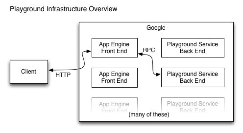

+++
title = "Go Playground内部情况"
weight = 1
date = 2023-05-18T17:03:08+08:00
description = ""
isCJKLanguage = true
draft = false
+++

# Inside the Go Playground - Go Playground内部情况

https://go.dev/blog/playground

Andrew Gerrand
12 December 2013

## Introduction 简介

*NOTE: This article does not describe the current version of the Go Playground.*

注意：本文并没有描述当前版本的Go Playground。

In September 2010 we [introduced the Go Playground](https://blog.golang.org/introducing-go-playground), a web service that compiles and executes arbitrary Go code and returns the program output.

2010年9月，我们推出了Go Playground，这是一个可以编译和执行任意Go代码并返回程序输出的网络服务。

If you’re a Go programmer then you have probably already used the playground by using the [Go Playground](https://go.dev/play/) directly, taking the [Go Tour](https://go.dev/tour/), or running [executable examples](https://go.dev/pkg/strings/#pkg-examples) from the Go documentation.

如果您是一个Go程序员，那么您可能已经通过直接使用Go Playground，参加Go Tour，或运行Go文档中的可执行示例来使用过该游乐场。

You may also have used it by clicking one of the "Run" buttons in a slide deck on [go.dev/talks](https://go.dev/talks/) or a post on this very blog (such as the [recent article on Strings](https://blog.golang.org/strings)).

您也可能通过点击go.dev/talks上的幻灯片或本博客上的文章（如最近关于字符串的文章）中的一个 "运行 "按钮来使用它。

In this article we will take a look at how the playground is implemented and integrated with these services. The implementation involves a variant operating system environment and runtime and our description here assumes you have some familiarity with systems programming using Go.

在这篇文章中，我们将看看游乐场是如何实现并与这些服务整合的。这个实现涉及到一个不同的操作系统环境和运行时间，我们在这里的描述假定您对使用Go的系统编程有一定的熟悉程度。

## Overview 概述



The playground service has three parts:

playground 服务有三个部分：

- A back end that runs on Google’s servers. It receives RPC requests, compiles the user program using the gc tool chain, executes the user program, and returns the program output (or compilation errors) as the RPC response.一个在谷歌服务器上运行的后端。它接收RPC请求，使用gc工具链编译用户程序，执行用户程序，并将程序输出（或编译错误）作为RPC响应返回。
- A front end that runs on [Google App Engine](https://cloud.google.com/appengine/docs/go/). It receives HTTP requests from the client and makes corresponding RPC requests to the back end. It also does some caching. 一个在谷歌应用引擎上运行的前端。它接收来自客户端的HTTP请求，并向后端发出相应的RPC请求。它也做一些缓存。
- A JavaScript client that implements the user interface and makes HTTP requests to the front end.一个实现用户界面的JavaScript客户端，向前端发出HTTP请求。

## The back end 后端

The back end program itself is trivial, so we won’t discuss its implementation here. The interesting part is how we safely execute arbitrary user code in a secure environment while still providing core functionality such as time, the network, and the file system.

后端程序本身是微不足道的，所以我们不会在这里讨论其实现。有趣的部分是我们如何在一个安全的环境中安全地执行任意的用户代码，同时仍然提供核心功能，如时间、网络和文件系统。

To isolate user programs from Google’s infrastructure, the back end runs them under [Native Client](https://developers.google.com/native-client/) (or "NaCl"), a technology developed by Google to permit the safe execution of x86 programs inside web browsers. The back end uses a special version of the gc tool chain that generates NaCl executables.

为了将用户程序与谷歌的基础设施隔离开来，后端在Native Client（或称 "NaCl"）下运行这些程序，该技术由谷歌开发，允许在网络浏览器内安全执行x86程序。后端使用一个特殊版本的gc工具链来生成NaCl可执行文件。

(This special tool chain was merged into Go 1.3. To learn more, read the [design document](https://go.dev/s/go13nacl).)

(这个特殊的工具链已经并入Go 1.3。要了解更多，请阅读设计文档）。

NaCl limits the amount of CPU and RAM a program may consume, and it prevents programs from accessing the network or file system. This presents a problem, however. Go’s concurrency and networking support are among its key strengths, and access to the file system is vital for many programs. To demonstrate concurrency effectively we need time, and to demonstrate networking and the file system we obviously need a network and a file system.

NaCl限制了程序可能消耗的CPU和RAM的数量，而且它可以防止程序访问网络或文件系统。然而，这带来了一个问题。Go的并发性和网络支持是其主要优势之一，而对文件系统的访问对许多程序来说是至关重要的。为了有效地演示并发性，我们需要时间，而为了演示网络和文件系统，我们显然需要一个网络和一个文件系统。

Although all these things are supported today, the first version of the playground, launched in 2010, had none of them. The current time was fixed at 10 November 2009, `time.Sleep` had no effect, and most functions of the `os` and `net` packages were stubbed out to return an `EINVALID` error.

尽管今天所有这些东西都得到了支持，但2010年推出的第一个版本的游乐场却没有这些东西。当前的时间被固定在2009年11月10日，time.Sleep没有任何作用，os和net包的大部分函数被存根出来，返回一个EINVALID错误。

A year ago we [implemented fake time](https://groups.google.com/d/msg/golang-nuts/JBsCrDEVyVE/30MaQsiQcWoJ) in the playground, so that programs that sleep would behave correctly. A more recent update to the playground introduced a fake network stack and a fake file system, making the playground’s tool chain similar to a normal Go tool chain. These facilities are described in the following sections.

一年前，我们在playground中实现了假时间，这样睡觉的程序就会表现正确。在最近的一次更新中，Playground引入了一个假的网络堆栈和一个假的文件系统，使得Playground的工具链类似于普通的Go工具链。这些设施将在下面的章节中描述。

### Faking time 伪造时间

Playground programs are limited in the amount of CPU time and memory they can use, but they are also restricted in how much real time they can use. This is because each running program consumes resources on the back end and any stateful infrastructure between it and the client. Limiting the run time of each playground program makes our service more predictable and defends us against denial of service attacks.

Playground 程序在它们能使用的CPU时间和内存数量上是有限的，但它们在能使用多少真实时间上也是受限制的。这是因为每个正在运行的程序都会消耗后端和它与客户端之间任何有状态的基础设施的资源。限制每个游乐场程序的运行时间使我们的服务更可预测，并能抵御拒绝服务攻击。

But these restrictions become stifling when running code that uses time. The [Go Concurrency Patterns](https://go.dev/talks/2012/concurrency.slide) talk demonstrates concurrency with examples that use timing functions like [`time.Sleep`](https://go.dev/pkg/time/#Sleep) and [`time.After`](https://go.dev/pkg/time/#After). When run under early versions of the playground, these programs' sleeps would have no effect and their behavior would be strange (and sometimes wrong).

但是当运行使用时间的代码时，这些限制就会变得令人窒息。Go并发模式讲座通过使用time.Sleep和time.After等计时函数的例子来演示并发。当在早期版本的游乐场下运行时，这些程序的睡眠不会有任何效果，它们的行为会很奇怪（有时是错误的）。

By using a clever trick we can make a Go program *think* that it is sleeping, when really the sleeps take no time at all. To explain the trick we first need to understand how the scheduler manages sleeping goroutines.

通过使用一个巧妙的技巧，我们可以让Go程序认为它在睡觉，而实际上睡眠根本不需要时间。为了解释这个技巧，我们首先需要了解调度器是如何管理睡眠的goroutine的。

When a goroutine calls `time.Sleep` (or similar) the scheduler adds a timer to a heap of pending timers and puts the goroutine to sleep. Meanwhile, a special timer goroutine manages that heap. When the timer goroutine starts it tells the scheduler to wake it when the next pending timer is ready to fire and then sleeps. When it wakes up it checks which timers have expired, wakes the appropriate goroutines, and goes back to sleep.

当一个goroutine调用time.Sleep（或类似的）时，调度器将一个定时器添加到待定定时器堆中，并使goroutine进入睡眠状态。同时，一个特殊的定时器goroutine管理着这个堆。当定时器goroutine启动时，它告诉调度器，当下一个待定的定时器准备启动时唤醒它，然后睡觉。当它醒来时，它检查哪些定时器已经过期，唤醒相应的goroutine，然后继续睡觉。

The trick is to change the condition that wakes the timer goroutine. Instead of waking it after a specific time period, we modify the scheduler to wait for a deadlock; the state where all goroutines are blocked.

诀窍是改变唤醒定时器goroutine的条件。我们不是在特定的时间段后唤醒它，而是修改调度器以等待死锁；即所有的goroutine被阻塞的状态。

The playground version of the runtime maintains its own internal clock. When the modified scheduler detects a deadlock it checks whether any timers are pending. If so, it advances the internal clock to the trigger time of the earliest timer and then wakes the timer goroutine. Execution continues and the program believes that time has passed, when in fact the sleep was nearly instantaneous.

运行时的操场版本保持着自己的内部时钟。当修改后的调度器检测到一个死锁时，它会检查是否有任何定时器正在等待。如果有，它就把内部时钟推进到最早的定时器的触发时间，然后唤醒定时器的goroutine。执行继续进行，程序认为时间已经过去，而实际上睡眠几乎是瞬间完成的。

These changes to the scheduler can be found in [`proc.c`](https://go.dev/cl/73110043) and [`time.goc`](https://go.dev/cl/73110043).

对调度器的这些修改可以在proc.c和time.goc中找到。

Fake time fixes the issue of resource exhaustion on the back end, but what about the program output? It would be odd to see a program that sleeps run to completion correctly without taking any time.

假的时间解决了后端资源耗尽的问题，但是程序的输出呢？如果看到一个程序在不占用任何时间的情况下正确地运行到完成，那就很奇怪了。

The following program prints the current time each second and then exits after three seconds. Try running it.

下面的程序每秒钟打印一次当前时间，然后在三秒钟后退出。试着运行它。

```go linenums="1"
func main() {
    stop := time.After(3 * time.Second)
    tick := time.NewTicker(1 * time.Second)
    defer tick.Stop()
    for {
        select {
        case <-tick.C:
            fmt.Println(time.Now())
        case <-stop:
            return
        }
    }
}
```

Run 运行

How does this work? It is a collaboration between the back end, front end, and client.

这是如何工作的？这是一个后端、前端和客户端之间的协作。

We capture the timing of each write to standard output and standard error and provide it to the client. Then the client can "play back" the writes with the correct timing, so that the output appears just as if the program were running locally.

我们捕捉每个写入标准输出和标准错误的时间，并将其提供给客户端。然后，客户端可以用正确的时间 "回放 "写入的内容，这样，输出就像程序在本地运行一样。

The playground’s `runtime` package provides a special [`write` function](https://github.com/golang/go/blob/go1.3/src/pkg/runtime/sys_nacl_amd64p32.s#L54) that includes a small "playback header" before each write. The playback header comprises a magic string, the current time, and the length of the write data. A write with a playback header has this structure:

Playground的运行包提供了一个特殊的写入功能，在每次写入前包括一个小的 "回放头"。回放头包括一个神奇的字符串、当前时间和写入数据的长度。一个有回放头的写有这样的结构：

```
0 0 P B <8-byte time> <4-byte data length> <data>
```

The raw output of the program above looks like this:

上述程序的原始输出看起来像这样：

```
\x00\x00PB\x11\x74\xef\xed\xe6\xb3\x2a\x00\x00\x00\x00\x1e2009-11-10 23:00:01 +0000 UTC
\x00\x00PB\x11\x74\xef\xee\x22\x4d\xf4\x00\x00\x00\x00\x1e2009-11-10 23:00:02 +0000 UTC
\x00\x00PB\x11\x74\xef\xee\x5d\xe8\xbe\x00\x00\x00\x00\x1e2009-11-10 23:00:03 +0000 UTC
```

The front end parses this output as a series of events and returns a list of events to the client as a JSON object:

前端将这个输出解析为一系列的事件，并将事件列表以JSON对象的形式返回给客户端：

```json
{
    "Errors": "",
    "Events": [
        {
            "Delay": 1000000000,
            "Message": "2009-11-10 23:00:01 +0000 UTC\n"
        },
        {
            "Delay": 1000000000,
            "Message": "2009-11-10 23:00:02 +0000 UTC\n"
        },
        {
            "Delay": 1000000000,
            "Message": "2009-11-10 23:00:03 +0000 UTC\n"
        }
    ]
}
```

The JavaScript client (running in the user’s web browser) then plays back the events using the provided delay intervals. To the user it appears that the program is running in real time.

然后，JavaScript客户端（在用户的网络浏览器中运行）使用所提供的延迟间隔回放事件。对用户来说，程序似乎是在实时运行。

### Faking the file system 伪造文件系统

Programs built with the Go’s NaCl tool chain cannot access the local machine’s file system. Instead, the `syscall` package’s file-related functions (`Open`, `Read`, `Write`, and so on) operate on an in-memory file system that is implemented by the `syscall` package itself. Since package `syscall` is the interface between the Go code and the operating system kernel, user programs see the file system exactly the same way as they would a real one.

用Go的NaCl工具链构建的程序不能访问本地机器的文件系统。相反，syscall包的文件相关功能（Open、Read、Write等）在内存中的文件系统上操作，该系统由syscall包本身实现。由于syscall包是Go代码和操作系统内核之间的接口，用户程序看到文件系统的方式与真实的文件系统完全相同。

The following example program writes data to a file, and then copies its contents to standard output. Try running it. (You can edit it, too!)

下面的例子程序将数据写入一个文件，然后将其内容复制到标准输出。试着运行它。(您也可以编辑它！）。

```go linenums="1"
func main() {
    const filename = "/tmp/file.txt"

    err := ioutil.WriteFile(filename, []byte("Hello, file system\n"), 0644)
    if err != nil {
        log.Fatal(err)
    }

    b, err := ioutil.ReadFile(filename)
    if err != nil {
        log.Fatal(err)
    }

    fmt.Printf("%s", b)
}
```

Run 运行

When a process starts, the file system is populated with some devices under `/dev` and an empty `/tmp` directory. The program can manipulate the file system as usual, but when the process exits any changes to the file system are lost.

当一个进程启动时，文件系统被填充为/dev下的一些设备和一个空的/tmp目录。程序可以像往常一样操作文件系统，但是当进程退出时，对文件系统的任何改变都会丢失。

There is also a provision to load a zip file into the file system at init time (see [`unzip_nacl.go`](https://github.com/golang/go/blob/go1.3/src/pkg/syscall/unzip_nacl.go)). So far we have only used the unzip facility to provide the data files required to run the standard library tests, but we intend to provide playground programs with a set of files that can be used in documentation examples, blog posts, and the Go Tour.

还有一项规定是在启动时将压缩文件加载到文件系统中（见unzip_nacl.go）。到目前为止，我们只用unzip设施来提供运行标准库测试所需的数据文件，但我们打算为游乐场程序提供一组文件，这些文件可以在文档示例、博客文章和Go之旅中使用。

The implementation can be found in the [`fs_nacl.go`](https://github.com/golang/go/blob/2197321db1dd997165c0091ba2bcb3b6be7633d0/src/syscall/fs_nacl.go) and [`fd_nacl.go`](https://github.com/golang/go/blob/2197321db1dd997165c0091ba2bcb3b6be7633d0/src/syscall/fd_nacl.go) files (which, by virtue of their `_nacl` suffix, are built into package `syscall` only when `GOOS` is set to `nacl`).

该实现可以在fs_nacl.go和fd_nacl.go文件中找到（由于它们的_nacl后缀，只有当GOOS设置为nacl时，它们才被内置到包syscall中）。

The file system itself is represented by the [`fsys` struct](https://github.com/golang/go/blob/2197321db1dd997165c0091ba2bcb3b6be7633d0/src/syscall/fs_nacl.go#L26), of which a global instance (named `fs`) is created during init time. The various file-related functions then operate on `fs` instead of making the actual system call. For instance, here is the [`syscall.Open`](https://github.com/golang/go/blob/2197321db1dd997165c0091ba2bcb3b6be7633d0/src/syscall/fs_nacl.go#L473) function:

文件系统本身由fsys结构表示，它的一个全局实例（名为fs）在初始化时被创建。各种与文件有关的函数在fs上操作，而不是进行实际的系统调用。例如，下面是syscall.Open函数：

```go linenums="1"
func Open(path string, openmode int, perm uint32) (fd int, err error) {
    fs.mu.Lock()
    defer fs.mu.Unlock()
    f, err := fs.open(path, openmode, perm&0777|S_IFREG)
    if err != nil {
        return -1, err
    }
    return newFD(f), nil
}
```

File descriptors are tracked by a global slice named [`files`](https://github.com/golang/go/blob/2197321db1dd997165c0091ba2bcb3b6be7633d0/src/syscall/fd_nacl.go#L17). Each file descriptor corresponds to a [`file`](https://github.com/golang/go/blob/2197321db1dd997165c0091ba2bcb3b6be7633d0/src/syscall/fd_nacl.go#L23) and each `file` provides a value that implements the [`fileImpl`](https://github.com/golang/go/blob/2197321db1dd997165c0091ba2bcb3b6be7633d0/src/syscall/fd_nacl.go#L30) interface. There are several implementations of the interface:

文件描述符是由一个名为files的全局片断来跟踪的。每个文件描述符对应一个文件，每个文件提供一个实现fileImpl接口的值。该接口有几种实现方式：

- regular files and devices (such as `/dev/random`) are represented by [`fsysFile`](https://github.com/golang/go/blob/2197321db1dd997165c0091ba2bcb3b6be7633d0/src/syscall/fs_nacl.go#L58),常规文件和设备（如/dev/random）由fsysFile表示。
- standard input, output, and error are instances of [`naclFile`](https://github.com/golang/go/blob/2197321db1dd997165c0091ba2bcb3b6be7633d0/src/syscall/fd_nacl.go#L216), which uses system calls to interact with the actual files (these are a playground program’s only way to interact with the outside world),标准输入、输出和错误是naclFile的实例，它使用系统调用与实际的文件进行交互（这些是游乐场程序与外部世界交互的唯一方式）。
- network sockets have their own implementation, discussed in the next section.网络套接字有自己的实现，在下一节讨论。

### Faking the network 假装网络

Like the file system, the playground’s network stack is an in-process fake implemented by the `syscall` package. It permits playground projects to use the loopback interface (`127.0.0.1`). Requests to other hosts will fail. 

像文件系统一样，游乐场的网络堆栈是一个由syscall包实现的进程内假象。它允许游乐场项目使用回环接口（127.0.0.1）。对其他主机的请求将失败。

For an executable example, run the following program. It listens on a TCP port, waits for an incoming connection, copies the data from that connection to standard output, and exits. In another goroutine, it makes a connection to the listening port, writes a string to the connection, and closes it.

对于一个可执行的例子，运行下面的程序。它在一个TCP端口上监听，等待一个传入的连接，将该连接的数据复制到标准输出，然后退出。在另一个goroutine中，它建立一个连接到监听端口，向连接写入一个字符串，并关闭它。

```go linenums="1"
func main() {
    l, err := net.Listen("tcp", "127.0.0.1:4000")
    if err != nil {
        log.Fatal(err)
    }
    defer l.Close()

    go dial()

    c, err := l.Accept()
    if err != nil {
        log.Fatal(err)
    }
    defer c.Close()

    io.Copy(os.Stdout, c)
}

func dial() {
    c, err := net.Dial("tcp", "127.0.0.1:4000")
    if err != nil {
        log.Fatal(err)
    }
    defer c.Close()
    c.Write([]byte("Hello, network\n"))
}
```

Run 运行

The interface to the network is more complex than the one for files, so the implementation of the fake network is larger and more complex than the fake file system. It must simulate read and write timeouts, different address types and protocols, and so on.

网络的接口比文件的接口更复杂，所以假网络的实现比假文件系统更大、更复杂。它必须模拟读写超时、不同的地址类型和协议，等等。

The implementation can be found in [`net_nacl.go`](https://github.com/golang/go/blob/2197321db1dd997165c0091ba2bcb3b6be7633d0/src/syscall/net_nacl.go). A good place to start reading is [`netFile`](https://github.com/golang/go/blob/2197321db1dd997165c0091ba2bcb3b6be7633d0/src/syscall/net_nacl.go#L461), the network socket implementation of the `fileImpl` interface.

该实现可以在net_nacl.go中找到。一个很好的开始阅读的地方是 netFile，它是 fileImpl 接口的网络套接字实现。

## The front end 前端

The playground front end is another simple program (shorter than 100 lines). It receives HTTP requests from the client, makes RPC requests to the back end, and does some caching.

游乐场的前端是另一个简单的程序（短于100行）。它接收来自客户端的 HTTP 请求，向后端发出 RPC 请求，并做一些缓存。

The front end serves an HTTP handler at `https://golang.org/compile`. The handler expects a POST request with a `body` field (the Go program to run) and an optional `version` field (for most clients this should be `"2"`).

前端为一个HTTP处理程序服务，网址是https://golang.org/compile。处理程序期待一个带有正文字段（要运行的Go程序）和可选版本字段（对于大多数客户端来说，应该是 "2"）的POST请求。

When the front end receives a compilation request it first checks [memcache](https://developers.google.com/appengine/docs/memcache/) to see if it has cached the results of a previous compilation of that source. If found, it returns the cached response. The cache prevents popular programs such as those on the [Go home page](https://go.dev/) from overloading the back ends. If there is no cached response, the front end makes an RPC request to the back end, stores the response in memcache, parses the playback events, and returns a JSON object to the client as the HTTP response (as described above).

当前端收到一个编译请求时，它首先检查memcache，看它是否已经缓存了该源程序的先前编译结果。如果找到了，它就返回缓存的响应。缓存可以防止流行的程序，如Go主页上的程序，使后端负担过重。如果没有缓存的响应，前端会向后端发出RPC请求，将响应存储在memcache中，解析播放事件，并将JSON对象作为HTTP响应返回给客户端（如上所述）。

## The client 客户端

The various sites that use the playground each share some common JavaScript code for setting up the user interface (the code and output boxes, the run button, and so on) and communicating with the playground front end.

使用游乐场的各个网站都共享一些共同的JavaScript代码，用于设置用户界面（代码和输出框、运行按钮等）以及与游乐场前端通信。

This implementation is in the file [`playground.js`](https://github.com/golang/tools/blob/f8e922be8efeabd06a510065ca5836b62fa10b9a/godoc/static/playground.js) in the `go.tools` repository, which can be imported from the [`golang.org/x/tools/godoc/static`](https://godoc.org/golang.org/x/tools/godoc/static) package. Some of it is clean and some is a bit crufty, as it is the result of consolidating several divergent implementations of the client code.

这个实现在 go.tools 仓库中的 playground.js 文件中，可以从 golang.org/x/tools/godoc/static 包中导入。其中有些是干净的，有些则有点粗糙，因为它是整合了客户端代码的几个不同的实现的结果。

The [`playground`](https://github.com/golang/tools/blob/f8e922be8efeabd06a510065ca5836b62fa10b9a/godoc/static/playground.js#L227) function takes some HTML elements and turns them into an interactive playground widget. You should use this function if you want to put the playground on your own site (see ‘Other clients’ below).

playground函数接收一些HTML元素，并将它们变成一个交互式的游乐场小部件。如果您想把游乐场放在您自己的网站上，您应该使用这个函数（见下面的 "其他客户端"）。

The [`Transport`](https://github.com/golang/tools/blob/f8e922be8efeabd06a510065ca5836b62fa10b9a/godoc/static/playground.js#L6) interface (not formally defined, this being JavaScript) abstracts the user interface from the means of talking to the web front end. [`HTTPTransport`](https://github.com/golang/tools/blob/f8e922be8efeabd06a510065ca5836b62fa10b9a/godoc/static/playground.js#L43) is an implementation of `Transport` that speaks the HTTP-based protocol described earlier. [`SocketTransport`](https://github.com/golang/tools/blob/f8e922be8efeabd06a510065ca5836b62fa10b9a/godoc/static/playground.js#L115) is another implementation that speaks WebSocket (see ‘Playing offline’ below).

Transport接口（没有正式定义，这是JavaScript）将用户界面从与Web前端对话的方式中抽象出来。HTTPTransport是Transport的一个实现，说的是前面描述的基于HTTP的协议。SocketTransport是另一个实现，它使用WebSocket（见下面的 "离线播放"）。

To comply with the [same-origin policy](https://en.wikipedia.org/wiki/Same-origin_policy), the various web servers (godoc, for instance) proxy requests to `/compile` through to the playground service at `https://golang.org/compile`. The common [`golang.org/x/tools/playground`](https://godoc.org/golang.org/x/tools/playground) package does this proxying.

为了遵守同源政策，各种网络服务器（例如godoc）将对/compile的请求代理到https://golang.org/compile 的游戏场服务。常用的 golang.org/x/tools/playground 包负责这个代理。

## Playing offline 离线playing

Both the [Go Tour](https://go.dev/tour/) and the [Present Tool](https://godoc.org/golang.org/x/tools/present) can be run offline. This is great for people with limited internet connectivity or presenters at conferences who cannot (and *should* not) rely on a working internet connection.

Go Tour和Present Tool都可以离线运行。这对于网络连接有限的人或在会议上不能（也不应该）依赖工作网络连接的演讲者来说是非常好的。

To run offline, the tools run their own version of the playground back end on the local machine. The back end uses a regular Go tool chain with none of the aforementioned modifications and uses a WebSocket to communicate with the client.

为了离线运行，这些工具在本地机器上运行它们自己版本的操场后端。后端使用常规的Go工具链，没有上述的修改，并使用WebSocket与客户端通信。

The WebSocket back end implementation can be found in the [`golang.org/x/tools/playground/socket`](https://godoc.org/golang.org/x/tools/playground/socket) package. The [Inside Present](https://go.dev/talks/2012/insidepresent.slide#1) talk discusses this code in detail.

WebSocket后端实现可以在golang.org/x/tools/playground/socket包中找到。Inside Present讲座中详细讨论了这段代码。

## Other clients 其他客户端

The playground service is used by more than just the official Go project ([Go by Example](https://gobyexample.com/) is one other instance) and we are happy for you to use it on your own site. All we ask is that you [contact us first](mailto:golang-dev@googlegroups.com), use a unique user agent in your requests (so we can identify you), and that your service is of benefit to the Go community.

不仅仅是官方Go项目在使用playground服务（Go by Example是另一个例子），我们很乐意让您在自己的网站上使用它。我们只要求您先与我们联系，在您的请求中使用一个独特的用户代理（以便我们能够识别您），并且您的服务对Go社区有益。

## Conclusion 结论

From godoc to the tour to this very blog, the playground has become an essential part of our Go documentation story. With the recent additions of the fake file system and network stack we are excited to expand our learning materials to cover those areas.

从godoc到旅游，再到这个博客，操场已经成为我们Go文档故事的重要组成部分。随着最近假文件系统和网络栈的加入，我们很高兴能将我们的学习材料扩展到这些领域。

But, ultimately, the playground is just the tip of the iceberg. With Native Client support scheduled for Go 1.3, we look forward to seeing what the community can do with it.

但是，最终，游乐场只是冰山一角。随着Native Client支持计划在Go 1.3中出现，我们期待着看到社区能用它做什么。

*This article is part 12 of the* [Go Advent Calendar](https://blog.gopheracademy.com/go-advent-2013), *a series of daily blog posts throughout December .*

本文是Go Advent Calendar的第12部分，这是一个贯穿12月的每日博文系列。
