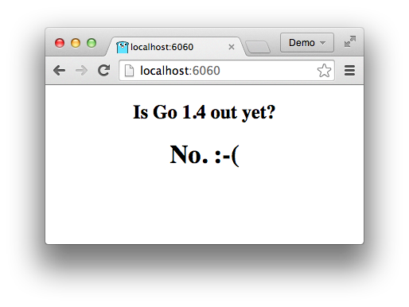

+++
title = "用Docker部署 go 服务器"
weight = 7
date = 2023-05-18T17:03:08+08:00
description = ""
isCJKLanguage = true
draft = false
+++

# Deploying Go servers with Docker - 用Docker部署 go 服务器

https://go.dev/blog/docker

Andrew Gerrand
26 September 2014

## Introduction 简介

This week Docker [announced](https://blog.docker.com/2014/09/docker-hub-official-repos-announcing-language-stacks/) official base images for Go and other major languages, giving programmers a trusted and easy way to build containers for their Go programs.

本周，Docker发布了针对Go和其他主要语言的官方基础镜像，为程序员提供了一个值得信赖的、简单的方法来为他们的Go程序构建容器。

In this article we’ll walk through a recipe for creating a Docker container for a simple Go web application and deploying that container to Google Compute Engine. If you’re not familiar with Docker, you should read [Understanding Docker](https://docs.docker.com/engine/understanding-docker/) before reading on.

在这篇文章中，我们将介绍如何为一个简单的Go网络应用程序创建Docker容器，并将该容器部署到Google Compute Engine。如果你对Docker不熟悉，在继续阅读之前，你应该先阅读《理解Docker》。

## The demo app 演示应用程序

For our demonstration we will use the [outyet](https://pkg.go.dev/golang.org/x/example/outyet) program from the [Go examples repository](https://cs.opensource.google/go/x/example), a simple web server that reports whether the next version of Go has been released (designed to power sites like [isgo1point4.outyet.org](http://isgo1point4.outyet.org/)). It has no dependencies outside the standard library and requires no additional data files at run time; for a web server, it’s about as simple as it gets.

对于我们的演示，我们将使用Go实例库中的outyet程序，这是一个简单的网络服务器，用于报告Go的下一个版本是否已经发布（旨在为isgo1point4.outyet.org等网站提供支持）。它没有标准库以外的依赖关系，在运行时也不需要额外的数据文件；对于一个网络服务器来说，它是最简单的。

Use “go get” to fetch and install outyet in your [workspace](https://go.dev/doc/code.html#Workspaces):

使用 "go get "来获取并安装outyet到你的工作区。

```
$ go get golang.org/x/example/outyet
```

## Write a Dockerfile 写一个Dockerfile

Replace a file named `Dockerfile` in the `outyet` directory with the following contents:

在outyet目录下替换一个名为Dockerfile的文件，内容如下：

```dockerfile
# Start from a Debian image with the latest version of Go installed
# and a workspace (GOPATH) configured at /go.
FROM golang

# Copy the local package files to the container's workspace.
ADD . /go/src/golang.org/x/example/outyet

# Build the outyet command inside the container.
# (You may fetch or manage dependencies here,
# either manually or with a tool like "godep".)
RUN go install golang.org/x/example/outyet

# Run the outyet command by default when the container starts.
ENTRYPOINT /go/bin/outyet

# Document that the service listens on port 8080.
EXPOSE 8080
```

This `Dockerfile` specifies how to construct a container that runs `outyet`, starting with the basic dependencies (a Debian system with Go installed; the [official `golang` docker image](https://registry.hub.docker.com/_/golang/)), adding the `outyet` package source, building it, and then finally running it.

这个Docker文件规定了如何构建一个运行outyet的容器，从基本的依赖关系开始（安装了Go的Debian系统；官方的golang docker镜像），添加outyet包源，构建它，然后最后运行它。

The `ADD`, `RUN`, and `ENTRYPOINT` steps are common tasks for any Go project. To simplify this, there is an [`onbuild` variant](https://github.com/docker-library/golang/blob/9ff2ccca569f9525b023080540f1bb55f6b59d7f/1.3.1/onbuild/Dockerfile) of the `golang` image that automatically copies the package source, fetches the application dependencies, builds the program, and configures it to run on startup.

ADD、RUN和ENTRYPOINT这三个步骤是任何Go项目的常见任务。为了简化这个步骤，golang镜像有一个onbuild的变体，可以自动复制包源，获取应用程序的依赖性，构建程序，并配置为启动时运行。

With the `onbuild` variant, the `Dockerfile` is much simpler:

有了onbuild变体，Docker文件就简单多了：

```dockerfile
FROM golang:onbuild
EXPOSE 8080
```

## Build and run the image 构建并运行镜像

Invoke Docker from the `outyet` package directory to build an image using the `Dockerfile`:

从outyet包目录下调用Docker，使用Docker文件构建一个镜像：

```shell
$ docker build -t outyet .
```

This will fetch the `golang` base image from Docker Hub, copy the package source to it, build the package inside it, and tag the resulting image as `outyet`.

这将从Docker Hub获取golang基础镜像，将包的源代码复制到其中，在其中构建包，并将生成的镜像标记为outyet。

To run a container from the resulting image:

要从生成的镜像中运行一个容器：

```shell
$ docker run --publish 6060:8080 --name test --rm outyet
```

The `--publish` flag tells docker to publish the container’s port `8080` on the external port `6060`.

--publish标志告诉docker将容器的8080端口发布到外部6060端口。

The `--name` flag gives our container a predictable name to make it easier to work with.

--name标志给了我们的容器一个可预测的名字，使它更容易工作。

The `--rm` flag tells docker to remove the container image when the outyet server exits.

--rm标志告诉docker在outyet服务器退出时删除容器镜像。

With the container running, open `http://localhost:6060/` in a web browser and you should see something like this:

容器运行后，在网络浏览器中打开http://localhost:6060/，你应该看到类似这样的东西。



(If your docker daemon is running on another machine (or in a virtual machine), you should replace `localhost` with the address of that machine. If you’re using [boot2docker](http://boot2docker.io/) on OS X or Windows you can find that address with `boot2docker ip`.)

(如果你的docker守护程序运行在另一台机器上（或在虚拟机中），你应该用该机器的地址替换localhost。如果你在OS X或Windows上使用boot2docker，你可以用boot2docker ip找到这个地址）。

Now that we’ve verified that the image works, shut down the running container from another terminal window:

现在我们已经验证了镜像的工作，从另一个终端窗口关闭运行中的容器。

```shell
$ docker stop test
```

## Create a repository on Docker Hub 在Docker Hub上创建一个资源库

[Docker Hub](https://hub.docker.com/), the container registry from which we pulled the `golang` image earlier, offers a feature called [Automated Builds](http://docs.docker.com/docker-hub/builds/) that builds images from a GitHub or BitBucket repository.

Docker Hub，也就是我们之前提取golang镜像的那个容器注册中心，提供了一个叫做自动构建的功能，可以从GitHub或BitBucket仓库构建镜像。

By committing [the Dockerfile](https://go.googlesource.com/example/+/refs/heads/master/outyet/) to the repository and creating an [automated build](https://registry.hub.docker.com/u/adg1/outyet/) for it, anyone with Docker installed can download and run our image with a single command. (We will see the utility of this in the next section.)

通过将Docker文件提交到仓库并为其创建一个自动构建，任何安装了Docker的人都可以用一个命令下载并运行我们的镜像。(我们将在下一节中看到它的效用)。

To set up an Automated Build, commit the Dockerfile to your repo on [GitHub](https://github.com/) or [BitBucket](https://bitbucket.org/), create an account on Docker Hub, and follow the instructions for [creating an Automated Build](http://docs.docker.com/docker-hub/builds/).

要设置自动构建，请将Docker文件提交到GitHub或BitBucket上的仓库，在Docker Hub上创建一个账户，然后按照说明创建一个自动构建。

When you’re done, you can run your container using the name of the automated build:

当你完成后，你可以使用自动构建的名称来运行你的容器：

```shell
$ docker run goexample/outyet
```

(Replace `goexample/outyet` with the name of the automated build you created.)

(将goexample/outyet替换为你创建的自动化构建的名称）。

## Deploy the container to Google Compute Engine 将容器部署到Google Compute Engine

Google provides [container-optimized Google Compute Engine images](https://developers.google.com/compute/docs/containers/container_vms) that make it easy to spin up a virtual machine running an arbitrary Docker container. On startup, a program running on the instance reads a configuration file that specifies which container to run, fetches the container image, and runs it.

Google提供了容器优化的Google Compute Engine镜像，使其能够轻松地启动运行任意Docker容器的虚拟机。在启动时，运行在实例上的程序会读取指定要运行的容器的配置文件，获取容器镜像，并运行它。

Create a [containers.yaml](https://cloud.google.com/compute/docs/containers/container_vms#container_manifest) file that specifies the docker image to run and the ports to expose:

创建一个 containers.yaml 文件，指定要运行的 docker 镜像和要公开的端口：

```yaml
version: v1beta2
containers:
- name: outyet
  image: goexample/outyet
  ports:
  - name: http
    hostPort: 80
    containerPort: 8080
```

(Note that we’re publishing the container’s port `8080` as external port `80`, the default port for serving HTTP traffic. And, again, you should replace `goexample/outyet` with the name of your Automated Build.)

(注意，我们将容器的8080端口发布为外部端口80，这是服务HTTP流量的默认端口。还有，你应该用你的自动构建的名称来替换goexample/outyet）。

Use the [gcloud tool](https://cloud.google.com/sdk/#Quick_Start) to create a VM instance running the container:

使用gcloud工具来创建一个运行容器的虚拟机实例：

```shell
$ gcloud compute instances create outyet \
    --image container-vm-v20140925 \
    --image-project google-containers \
    --metadata-from-file google-container-manifest=containers.yaml \
    --tags http-server \
    --zone us-central1-a \
    --machine-type f1-micro
```

The first argument (`outyet`) specifies the instance name, a convenient label for administrative purposes.

第一个参数（outyet）指定了实例名称，这是一个方便管理的标签。

The `--image` and `--image-project` flags specify the special container-optimized system image to use (copy these flags verbatim).

--image和--image-project标志指定了要使用的特殊容器优化的系统镜像（逐字复制这些标志）。

The `--metadata-from-file` flag supplies your `containers.yaml` file to the VM.

--metadata-from-file标志向虚拟机提供你的containers.yaml文件。

The `--tags` flag tags your VM instance as an HTTP server, adjusting the firewall to expose port 80 on the public network interface.

--tags标志将你的虚拟机实例标记为HTTP服务器，调整防火墙以暴露公共网络接口上的80端口。

The `--zone` and `--machine-type` flags specify the zone in which to run the VM and the type of machine to run. (To see a list of machine types and the zones, run `gcloud compute machine-types list`.)

--zone 和 --machine-type 标志指定了运行 VM 的区域和运行的机器类型。(要查看机器类型和区域的列表，请运行gcloud compute machine-types list）。

Once this has completed, the gcloud command should print some information about the instance. In the output, locate the `networkInterfaces` section to find the instance’s external IP address. Within a couple of minutes you should be able to access that IP with your web browser and see the “Has Go 1.4 been released yet?” page.

一旦完成了这些，gcloud 命令应该会打印出关于该实例的一些信息。在输出中，找到 networkInterfaces 部分，找到实例的外部 IP 地址。在几分钟内，你应该能够用你的网络浏览器访问该IP，并看到 "Go 1.4已经发布了吗？"的页面。

(To see what’s happening on the new VM instance you can ssh into it with `gcloud compute ssh outyet`. From there, try `sudo docker ps` to see which Docker containers are running.)

(要查看新的虚拟机实例上的情况，你可以用gcloud compute ssh outyet登录它。在那里，试试sudo docker ps，看看哪些Docker容器正在运行）。

## Learn more 了解更多

This is just the tip of the iceberg—there’s a lot more you can do with Go, Docker, and Google Compute Engine.

这只是冰山一角--你可以用Go、Docker和Google Compute Engine做的事情还有很多。

To learn more about Docker, see their [extensive documentation](https://docs.docker.com/).

要了解更多关于Docker的信息，请看他们的大量文档。

To learn more about Docker and Go, see the [official `golang` Docker Hub repository](https://registry.hub.docker.com/_/golang/) and Kelsey Hightower’s [Optimizing Docker Images for Static Go Binaries](https://medium.com/@kelseyhightower/optimizing-docker-images-for-static-binaries-b5696e26eb07).

要了解更多关于Docker和Go的信息，请看官方的golang Docker Hub仓库和Kelsey Hightower的优化Docker镜像的静态Go二进制文件。

To learn more about Docker and [Google Compute Engine](http://cloud.google.com/compute), see the [Container-optimized VMs page](https://cloud.google.com/compute/docs/containers/container_vms) and the [google/docker-registry Docker Hub repository](https://registry.hub.docker.com/u/google/docker-registry/).

要了解更多关于Docker和Google Compute Engine的信息，请参见容器优化的虚拟机页面和google/docker-registry Docker Hub资源库。
