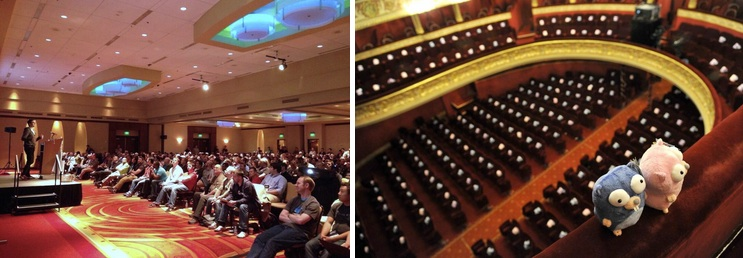

+++
title = "与 go 相处的5年"
weight = 7
date = 2023-05-18T17:03:08+08:00
description = ""
isCJKLanguage = true
draft = false
+++

# Half a decade with Go - 与 go 相处的5年

https://go.dev/blog/5years

Andrew Gerrand
10 November 2014

Five years ago we launched the Go project. It seems like only yesterday that we were preparing the initial public release: our [website](https://web.archive.org/web/20091112094121/http://golang.org/) was a lovely shade of yellow, we were calling Go a “systems language”, and you had to terminate statements with a semicolon and write Makefiles to build your code. We had no idea how Go would be received. Would people share our vision and goals? Would people find Go useful?

五年前，我们启动了Go项目。我们在准备最初的公开发布时，仿佛就在昨天：我们的网站是可爱的黄色，我们称Go为 "系统语言"，你必须用分号来结束语句，并编写Makefiles来构建你的代码。我们不知道Go会被如何接受。人们会认同我们的愿景和目标吗？人们会觉得Go有用吗？

At launch, there was a flurry of attention. Google had produced a new programming language, and everyone was eager to check it out. Some programmers were turned off by Go’s conservative feature set—at first glance they saw “nothing to see here”—but a smaller group saw the beginnings of an ecosystem tailored to their needs as working software engineers. These few would form the kernel of the Go community.

在发布的时候，大家都很关注。谷歌开发了一种新的编程语言，每个人都急于想知道它的情况。一些程序员被Go的保守的功能集拒之门外--他们第一眼看到的是 "这里没有什么可看的"--但有一小部分人看到了一个为他们工作的软件工程师量身定做的生态系统的开始。这些少数人形成了Go社区的核心。

[*Gopher*](https://go.dev/blog/gopher) *illustration by* [*Renee French*](http://reneefrench.blogspot.com.au/)

Gopher 插图：Renee French

After the initial release, it took us a while to properly communicate the goals and design ethos behind Go. Rob Pike did so eloquently in his 2012 essay [*Go at Google: Language Design in the Service of Software Engineering*](https://go.dev/talks/2012/splash.article) and more personally in his blog post [*Less is exponentially more*](https://commandcenter.blogspot.com.au/2012/06/less-is-exponentially-more.html). Andrew Gerrand’s [*Code that grows with grace*](http://vimeo.com/53221560) ([slides](https://go.dev/talks/2012/chat.slide)) and [*Go for Gophers*](https://www.youtube.com/watch?v=dKGmK_Z1Zl0) ([slides](https://go.dev/talks/2014/go4gophers.slide)) give a more in-depth, technical take on Go’s design philosophy.

在最初的发布之后，我们花了一些时间来正确传达Go背后的目标和设计精神。Rob Pike在他2012年的文章《Go at Google》中雄辩地阐述了这一点。语言设计为软件工程服务，并在他的博文《少即是多》中做了更深入的介绍。Andrew Gerrand的《优雅成长的代码》（幻灯片）和《Go for Gophers》（幻灯片）对Go的设计理念进行了更深入的技术分析。

Over time, the few became many. The turning point for the project was the release of Go 1 in March 2012, which provided a stable language and standard library that developers could trust. By 2014, the project had hundreds of core contributors, the ecosystem had countless [libraries and tools](https://godoc.org/) maintained by thousands of developers, and the greater community had many passionate members (or, as we call them, “gophers”). Today, by our current metrics, the Go community is growing faster than we believed possible.

随着时间的推移，少数人变成了多数人。项目的转折点是2012年3月发布的Go 1，它提供了一个稳定的语言和标准库，让开发者可以信赖。到2014年，该项目有数百名核心贡献者，生态系统有无数的库和工具，由成千上万的开发者维护，更大的社区有许多热情的成员（或者，我们称之为 "地鼠"）。今天，按照我们目前的衡量标准，Go社区的发展速度比我们认为的要快。

Where can those gophers be found? They are at the many Go events that are popping up around the world. This year we saw several dedicated Go conferences: the inaugural [GopherCon](https://blog.golang.org/gophercon) and [dotGo](http://www.dotgo.eu/) conferences in Denver and Paris, the [Go DevRoom at FOSDEM](https://blog.golang.org/fosdem14) and two more instances of the biannual [GoCon](https://github.com/GoCon/GoCon) conference in Tokyo. At each event, gophers from around the globe eagerly presented their Go projects. For the Go team, it is very satisfying to meet so many programmers that share our vision and excitement.

在哪里可以找到这些 "地鼠 "呢？他们就在世界各地涌现的许多Go活动中。今年，我们看到了几个专门的Go会议：在丹佛和巴黎举行的首届GopherCon和dotGo会议，FOSDEM上的Go DevRoom，以及在东京举行的两年一度的GoCon会议的另外两个实例。在每一次活动中，来自全球的地鼠们都热切地展示了他们的Go项目。对于Go团队来说，能遇到这么多与我们有共同愿景和兴奋点的程序员是非常令人满意的。

*More than 1,200 gophers attended GopherCon in Denver and dotGo in Paris.*

超过1200名地鼠参加了丹佛的GopherCon和巴黎的dotGo。

There are also dozens of community-run [Go User Groups](https://go.dev/wiki/GoUserGroups) spread across cities worldwide. If you haven’t visited your local group, consider going along. And if there isn’t a group in your area, maybe you should [start one](https://blog.golang.org/getthee-to-go-meetup)?

还有几十个由社区管理的Go用户组分布在世界各地的城市。如果你还没有访问过你当地的小组，可以考虑一起去看看。如果你所在的地区没有这样的小组，也许你应该建立一个？

Today, Go has found a home in the cloud. Go arrived as the industry underwent a tectonic shift toward cloud computing, and we were thrilled to see it quickly become an important part of that movement. Its simplicity, efficiency, built-in concurrency primitives, and modern standard library make it a great fit for cloud software development (after all, that’s what it was designed for). Significant open source cloud projects like [Docker](https://www.docker.com/) and [Kubernetes](https://github.com/GoogleCloudPlatform/kubernetes) have been written in Go, and infrastructure companies like Google, CloudFlare, Canonical, Digital Ocean, GitHub, Heroku, and Microsoft are now using Go to do some heavy lifting.

今天，Go已经在云中找到了家。Go是在行业经历了向云计算的构造性转变时出现的，我们很高兴地看到它迅速成为这一运动的重要组成部分。它的简单、高效、内置并发原语和现代标准库使它非常适合云计算软件开发（毕竟，这正是它的设计目的）。像Docker和Kubernetes这样重要的开源云项目都是用Go编写的，而像谷歌、CloudFlare、Canonical、Digital Ocean、GitHub、Heroku和微软这样的基础设施公司现在也在使用Go来做一些重活。

So, what does the future hold? We think that 2015 will be Go’s biggest year yet.

那么，未来会怎样呢？我们认为，2015年将是Go最大的一年。

Go 1.4—in addition to its [new features and fixes](https://go.dev/doc/go1.4)—lays the groundwork for a new low-latency garbage collector and support for running Go on mobile devices. It is due to be released on December 1st 2014. We expect the new GC to be available in Go 1.5, due June 1st 2015, which will make Go appealing for a broader range of applications. We can’t wait to see where people take it.

Go 1.4除了新功能和修复之外，还为新的低延迟垃圾收集器和支持在移动设备上运行Go奠定了基础。它将于2014年12月1日发布。我们预计新的GC将在2015年6月1日发布的Go 1.5中使用，这将使Go对更多的应用产生吸引力。我们迫不及待地想看到人们对它的看法。

And there will be more great events, with [GothamGo](http://gothamgo.com/) in New York (15 Nov), another Go DevRoom at FOSDEM in Brussels (Jan 31 and Feb 1; [get involved!](https://groups.google.com/d/msg/golang-nuts/1xgBazQzs1I/hwrZ5ni8cTEJ)), [GopherCon India](http://www.gophercon.in/) in Bengaluru (19-21 Feb), the original [GopherCon](http://gophercon.com/) back at Denver in July, and [dotGo](http://www.dotgo.eu/) on again at Paris in November.

还有更多精彩的活动，纽约的GothamGo（11月15日），布鲁塞尔FOSDEM的另一个Go DevRoom（1月31日和2月1日；请参与！），班加罗尔的GopherCon India（2月19-21日），7月在丹佛举行的原始GopherCon，以及11月在巴黎举行的dotGo。

The Go team would like to extend its thanks to all the gophers out there. Here’s to the next five years.

Go团队要向所有的地鼠表示感谢。为下一个五年干杯。

*To celebrate 5 years of Go, over the coming month the* [*Gopher Academy*](http://blog.gopheracademy.com/) *will publish a series of articles by prominent Go users. Be sure to check out* [*their blog*](http://blog.gopheracademy.com/) *for more Go action.*

为了庆祝Go的5周年，在接下来的一个月里，Gopher学院将发表一系列由著名Go用户撰写的文章。请务必查看他们的博客，了解更多的Go行动。
