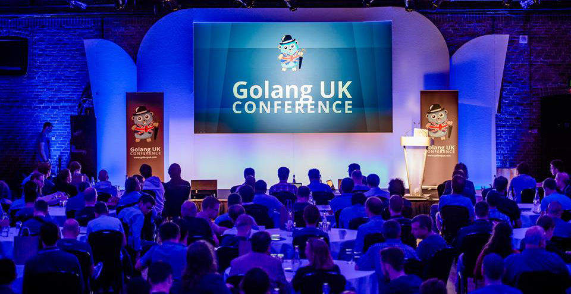

+++
title = "2015年英国Golang展会"
weight = 2
date = 2023-05-18T17:03:08+08:00
description = ""
isCJKLanguage = true
draft = false
+++

# Golang UK 2015 - 2015年英国Golang展会

https://go.dev/blog/gouk15

Francesc Campoy
9 October 2015

On August 21st the Go community gathered in London for the first edition of [Golang UK](https://golanguk.com/). The conference featured two parallel tracks and nearly 400 gophers attended.

8月21日，Go社区在伦敦举行了第一届Golang UK会议。本次会议有两个平行轨道，近400名地鼠参加。

The conference started with the opening keynote by [David Calavera](https://twitter.com/calavera) called Crossing the Language Chasm ([video](https://www.youtube.com/watch?v=JPVRnEZ4v_w&list=PLDWZ5uzn69ezRJYeWxYNRMYebvf8DerHd)) and continued with two concurrently executed [tracks](http://golanguk.com/schedule/).

会议以David Calavera的开幕主题演讲《跨越语言的鸿沟》（视频）开始，然后是两个同时进行的轨道。

Main track:

主赛道：

- Stupid Gopher Tricks, by [Andrew Gerrand](https://twitter.com/enneff) ([video](https://www.youtube.com/watch?v=UECh7X07m6E&list=PLDWZ5uzn69ezRJYeWxYNRMYebvf8DerHd)) 愚蠢的地鼠技巧，由Andrew Gerrand主持（视频）
- Complex Concurrency Patterns in Go, by [Evan Huus](https://twitter.com/eapache) ([video](https://www.youtube.com/watch?v=2HOO5gIgyMg&list=PLDWZ5uzn69ezRJYeWxYNRMYebvf8DerHd)) Go中的复杂并发模式，作者Evan Huus（视频）
- Code Analysis [no reading required], by [Francesc Campoy](https://twitter.com/francesc) ([video](https://www.youtube.com/watch?v=oorX84tBMqo&list=PLDWZ5uzn69ezRJYeWxYNRMYebvf8DerHd)) 代码分析[不需要阅读]，作者：Francesc Campoy（视频）
- Go kit: a toolkit for microservices, by [Peter Bourgon](https://twitter.com/peterbourgon) ([video](https://www.youtube.com/watch?v=aL6sd4d4hxk&list=PLDWZ5uzn69ezRJYeWxYNRMYebvf8DerHd)) Go套件：微服务的工具包, 作者：Peter Bourgon (视频)
- Dependency Management Conundrum, by [William Kennedy](https://twitter.com/goinggodotnet) ([video](https://www.youtube.com/watch?v=CdhucJShJU8&list=PLDWZ5uzn69ezRJYeWxYNRMYebvf8DerHd)) 依赖项管理难题, 作者：William Kennedy (视频)

Side track:

侧重点：

- Building APIs, by [Mat Ryer](https://twitter.com/matryer) ([video](https://www.youtube.com/watch?v=tIm8UkSf6RA&list=PLDWZ5uzn69ezRJYeWxYNRMYebvf8DerHd)) 构建API, by Mat Ryer (视频)
- Building a Bank with Go, by [Matt Heath](https://twitter.com/mattheath) ([video](https://www.youtube.com/watch?v=cFJkLfujOts&list=PLDWZ5uzn69ezRJYeWxYNRMYebvf8DerHd)) 用Go构建银行，作者：Matt Heath (视频)
- CockroachDB: Make Data Easy, by [Ben Darnell](https://twitter.com/bendarnell) ([video](https://www.youtube.com/watch?v=33oqpLmQ3LE&list=PLDWZ5uzn69ezRJYeWxYNRMYebvf8DerHd)) CockroachDB：让数据变得简单，作者：Ben Darnell (视频)
- Understanding memory allocation in Go, by [Dean Elbaz](https://twitter.com/DeanElbaz) ([video](https://www.youtube.com/watch?v=zjoieOpy5hE&list=PLDWZ5uzn69ezRJYeWxYNRMYebvf8DerHd)) 了解Go中的内存分配，作者：Dean Elbaz (视频) 
- Whispered Secrets, by [Eleanor McHugh](https://twitter.com/feyeleanor) ([video](https://www.youtube.com/watch?v=ViBRx-F4Z2U&list=PLDWZ5uzn69ezRJYeWxYNRMYebvf8DerHd)) 低调的秘密, 作者：Eleanor McHugh (视频)

Finally [Damian Gryski](https://twitter.com/dgryski) took the stage for the closing keynote ([video](https://www.youtube.com/watch?v=IiSyFc10Jj0&list=PLDWZ5uzn69ezRJYeWxYNRMYebvf8DerHd)), giving an overview of how the Go community has evolved over time and hinting to what the future might look like.

最后，Damian Gryski在闭幕式上发表了主题演讲（视频），概述了Go社区随着时间的推移所发生的变化，并暗示了未来可能出现的情况。

On the day before the conference, [William Kennedy](https://twitter.com/goinggodotnet) gave a full day Go workshop.

在会议的前一天，William Kennedy举办了一整天的Go研讨会。

It was a great conference, so congratulations to the organizers and see you next year in London!

这是一次伟大的会议，祝贺组织者，明年在伦敦见!
