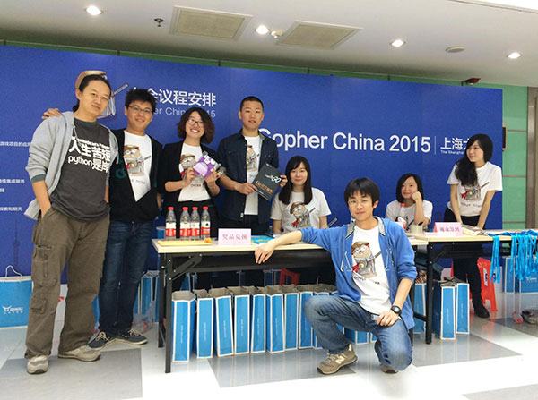
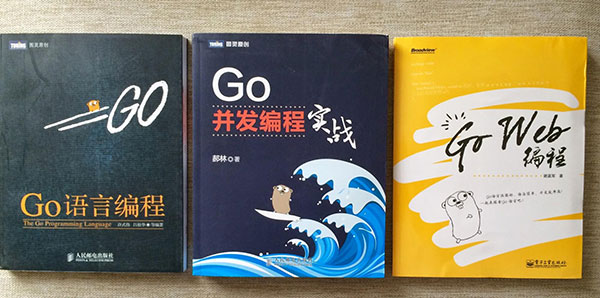
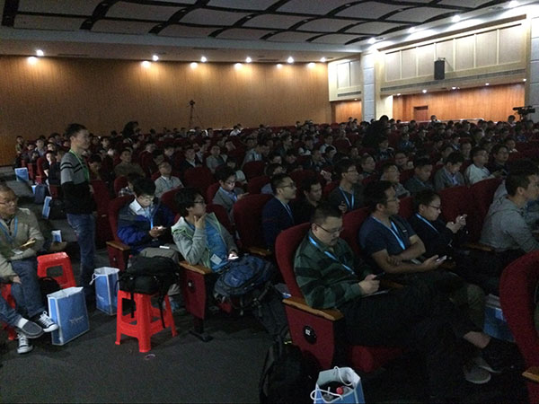
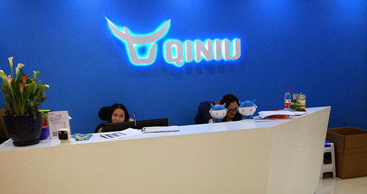
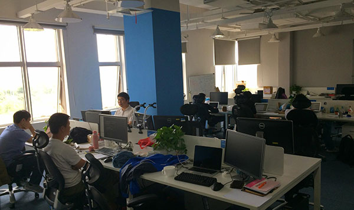

+++
title = "GopherChina之旅报告"
weight = 7
date = 2023-05-18T17:03:08+08:00
description = ""
isCJKLanguage = true
draft = false
+++

# GopherChina Trip Report - GopherChina之旅报告

https://go.dev/blog/gopherchina

Robert Griesemer
1 July 2015

We have known for some time that Go is more popular in China than in any other country. According to Google Trends, most [searches for the term “golang”](https://www.google.com/trends/explore#q=golang) come from The People’s Republic than anywhere else. [Others](http://herman.asia/why-is-go-popular-in-china) have speculated on the same observation, yet so far we have had [sparse concrete information](https://news.ycombinator.com/item?id=8872400) about the phenomenon.

我们知道Go在中国比其他国家更受欢迎已经有一段时间了。根据谷歌趋势，"golang "一词的大部分搜索来自中华人民共和国，而不是其他地方。其他人也对同样的观察进行了推测，然而到目前为止，我们对这一现象的具体信息还很稀少。

The first Go conference in China, [GopherChina](http://gopherchina.org/), seemed like an excellent opportunity to explore the situation by putting some Western Gopher feet on Chinese ground. An actual invitation made it real and I decided to accept and give a presentation about gofmt’s impact on software development.

在中国举行的第一次Go会议，GopherChina，似乎是一个很好的机会，可以通过把一些西方的Gopher放在中国的土地上来探索这种情况。一个实际的邀请使它成为现实，我决定接受并做一个关于gofmt对软件开发的影响的演讲。

*Hello, Shanghai!*

你好，上海!

The conference took place over an April weekend in Shanghai, in the [Puruan Building](https://www.google.com/maps/place/Puruan+Bldg,+Pudong,+Shanghai,+China) of the Shanghai Pudong Software Park, easily reachable by subway within an hour or less from Shanghai’s more central parts. Modelled after [GopherCon](http://www.gophercon.com/), the conference was single-track, with all talks presented in a conference room that fit about 400 attendees. It was organized by volunteers, lead by [Asta Xie](https://github.com/astaxie), and with robust sponsorship from major industry names. According to the organizers, many more people were hoping to attend than could be accommodated due to space constraints.

会议在四月的一个周末在上海举行，地点在上海浦东软件园的普源大厦，从上海较中心的地区乘坐地铁一个小时以内就可以到达。仿照GopherCon的模式，会议是单轨的，所有的会谈都在一个能容纳400人的会议室里进行。它是由志愿者组织的，由Asta Xie领导，并得到了主要行业公司的大力赞助。据组织者说，由于空间的限制，希望参加的人比能容纳的人多得多。

*The welcoming committee with Asta Xie (2nd from left), the primary organizer.*

欢迎委员会与主要组织者Asta Xie（左二）。

Each attendee received a bag filled with the obligatory GopherChina t-shirt, various sponsor-related informational brochures, stickers, and the occasional stuffed “something” (no fluffy Gophers, though). At least one 3rd party vendor was advertising technical books, including several original (not translated from English) Go books.

每个与会者都收到了一个袋子，里面装满了GopherChina的T恤，各种赞助商相关的信息手册，贴纸，以及偶尔的毛绒 "东西"（不过没有毛绒的地鼠）。至少有一个第三方供应商在宣传技术书籍，包括几本原版（非英文翻译）Go书。

*Go books!*

Go书!

On first impression, the average attendee seemed pretty young, which made for an enthusiastic crowd, and the event appeared well run.

在第一印象中，一般的与会者似乎都很年轻，这使得人群很热情，而且活动看起来运行良好。

With the exception of my talk, all presentations were given in Mandarin and thus were incomprehensible to me. Asta Xie, the primary organizer, assisted with a few simultaneous translations whispered into my ear, and the occasional English slide provided additional clues: “69GB” stands out even without any Mandarin knowledge (more on that below). Consequently, I ended up listening to a handful of presentations only, and instead spent much of my time talking with attendees outside the main conference room. Yet judging from the slides, the quality of most presentations seemed high, comparable with our experience at GopherCon in Denver last year. Each talk got a one hour time slot which allowed for plenty of technical detail, and many (dozens) of questions from an enthusiastic audience.

除了我的演讲之外，所有的演讲都是用普通话进行的，因此我无法理解。主要组织者Asta Xie协助我进行了一些同声传译，偶尔的英文幻灯片也提供了额外的线索。即使没有任何普通话知识，"69GB "也很突出（下面会有更多介绍）。因此，我最终只听了几场演讲，而把大部分时间花在了与主会议室外的与会者交谈上。然而，从幻灯片来看，大多数演讲的质量似乎很高，与我们去年在丹佛的GopherCon的经验相当。每场演讲都有一个小时的时间段，允许大量的技术细节，以及来自热情观众的许多（几十个）问题。

As expected, many of the presentations were about web services, backends for mobile applications, and so on. Some of the systems appear to be huge by any measure. For instance, a talk by [Yang Zhou](http://gopherchina.org/user/zhouyang) described a large-scale internal messaging system, used by [Qihoo 360](http://www.360.cn/), a major Chinese software firm, all written in Go. The presentation discussed how his team managed to reduce an original heap size of 69GB (!) and the resulting long GC pauses of 3-6s to more manageable numbers, and how they run millions of goroutines per machine, on a fleet of thousands of machines. A future guest blog post is planned describing this system in more detail.

正如预期的那样，许多演讲都是关于网络服务、移动应用的后端，等等。有些系统无论从哪个角度看都显得很庞大。例如，周扬的演讲描述了一个大规模的内部信息传递系统，该系统由中国一家主要的软件公司奇虎360使用，全部用Go编写。该演讲讨论了他的团队是如何将最初的69GB的堆大小（！）和由此产生的3-6s的长时间GC暂停减少到更容易管理的数字，以及他们如何在成千上万的机器上每台机器上运行数百万个goroutine。计划在未来发表一篇客座博文，更详细地描述这个系统。

*Packed conference room on Saturday.*

周六的会议室里座无虚席。

In another presentation, [Feng Guo](http://gopherchina.org/user/guofeng) from [DaoCloud](https://www.daocloud.io/) talked about how they use Go in their company for what they call the “continuous delivery” of applications. DaoCloud takes care of automatically moving software hosted on GitHub (and Chinese equivalents) to the cloud. A software developer simply pushes a new version on GitHub and DaoCloud takes care of the rest: running tests, [Dockerizing](https://www.docker.com/) it, and shipping it using your preferred cloud service provider.

在另一个演讲中，来自DaoCloud的Feng Guo谈到了他们如何在公司中使用Go来实现他们所谓的 "持续交付 "的应用。DaoCloud负责将托管在GitHub上的软件（和中国的同类产品）自动转移到云端。软件开发者只需在GitHub上推送一个新版本，DaoCloud就会负责其余的工作：运行测试、Docker化，并使用你喜欢的云服务提供商进行运输。

Several speakers were from well-recognized major software firms (I showed the conference program to non-technical people and they easily recognized several of the firm’s names). Much more so than in the US, it seems Go is not just hugely popular with newcomers and startups, but has very much found its way into larger organizations and is employed at a scale that we are only starting to see elsewhere.

有几位发言人来自知名的大型软件公司（我向非技术人员展示了会议程序，他们很容易就认出了几个公司的名字）。与美国相比，Go似乎不仅在新人和初创企业中大受欢迎，而且已经在很大程度上进入了大型组织，其应用规模也是我们在其他地方才开始看到的。

Not being an expert in web services myself, in my presentation I veered off the general conference theme a bit by talking about [gofmt](https://go.dev/cmd/gofmt/) and how its widespread use has started to shape expectations not just for Go but other languages as well. I presented in English but had my slides translated to Mandarin beforehand. Due to the significant language barrier I wasn’t expecting too many questions on my talk itself. Instead I decided the keep it short and leave plenty of time for general questions on Go, which the audience appreciated.

我自己并不是网络服务方面的专家，在我的演讲中，我稍微偏离了一般会议的主题，谈到了gofmt，以及它的广泛使用如何开始塑造对Go以及其他语言的期望。我是用英语演讲的，但事先将我的幻灯片翻译成了普通话。由于语言上的障碍，我并不指望在我的演讲中会有太多的问题。相反，我决定保持简短，并留出足够的时间来回答关于Go的一般问题，这一点得到了听众的赞赏。

*No social event in China is complete without fantastic food.*

在中国的社交活动中，没有精彩的食物是不完整的。

A couple of days after the conference I visited the 4-year-old startup company [Qiniu](http://www.qiniu.com/) (“Seven Bulls”), at the invitation of its [CEO](http://gopherchina.org/user/xushiwei) Wei Hsu, facilitated and translated with the help of Asta Xie. Qiniu is a cloud-based storage provider for mobile applications; Wei Hsu presented at the conference and also happens to be the author of one of the first Chinese books on Go (the leftmost one in the picture above).

会议结束后的几天，我拜访了有4年历史的创业公司Qiniu（"七牛"），应其CEO Wei Hsu的邀请，在Asta Xie的帮助下进行了翻译。七牛是一家基于云计算的移动应用存储供应商；许世伟在会议上发表了演讲，同时也是中国最早的Go书籍之一的作者（上图中最左边的一本）。

*Qiniu lobby, engineering.*

七牛大堂，工程。

Qiniu is an extremely successful all-Go shop, with about 160 employees, serving over 150,000 companies and developers, storing over 50 Billion files, and growing by over 500 Million files per day. When asked about the reasons for Go’s success in China, Wei Hsu is quick to answer: PHP is extremely popular in China, but relatively slow and not well-suited for large systems. Like in the US, universities teach C++ and Java as primary languages, but for many applications C++ is too complex a tool and Java too bulky. In his opinion, Go now plays the role that traditionally belonged to PHP, but Go runs much faster, is type safe, and scales more easily. He loves the fact that Go is simple and applications are easy to deploy. He thought the language to be “perfect” for them and his primary request was for a recommended or even standardized package to easily access database systems. He did mention that they had GC problems in the past but were able to work around them. Hopefully our upcoming 1.5 release will address this. For Qiniu, Go appeared just at the right time and the right (open source) place.

七牛是一家非常成功的全Go商店，有大约160名员工，为超过15万家公司和开发者提供服务，存储了超过500亿个文件，并且每天有超过5亿个文件的增长。当被问及Go在中国成功的原因时，徐伟很快就回答了。PHP在中国非常流行，但相对较慢，不适合大型系统。就像在美国一样，大学将C++和Java作为主要语言来教授，但对于许多应用来说，C++是一个太复杂的工具，而Java又太笨重。在他看来，Go现在扮演着传统上属于PHP的角色，但Go运行速度更快，类型安全，而且更容易扩展。他喜欢Go的简单，应用程序容易部署。他认为这种语言对他们来说是 "完美的"，他的主要要求是要有一个推荐的甚至是标准化的软件包来轻松访问数据库系统。他确实提到，他们过去曾遇到过GC问题，但都能解决。希望我们即将发布的1.5版本能解决这个问题。对于奇牛来说，Go出现的时间和地点都是正确的（开源）。

According to Asta Xie, Qiniu is just one of many Go shops in the PRC. Large companies such as Alibaba, Baidu, Tencent, and Weibo, are now all using Go in one form or another. He pointed out that while Shanghai and neighboring cities like [Suzhou](https://www.google.com/maps/place/Suzhou,+Jiangsu,+China) are high-tech centres, even more software developers are found in the Beijing area. For 2016,  Asta hopes to organize a larger (1000, perhaps 1500 people) successor conference in Beijing.

根据Asta Xie的说法，奇牛只是中国众多Go商店中的一个。阿里巴巴、百度、腾讯和微博等大公司现在都在以这样或那样的形式使用Go。他指出，虽然上海和苏州等周边城市是高科技中心，但在北京地区发现的软件开发人员甚至更多。对于2016年，Asta希望在北京组织一次更大规模（1000人，也许1500人）的成功者会议。

It appears that we have found the Go users in China: They are everywhere!

看来，我们已经找到了中国的Go用户。他们无处不在!

*Some of the GopherChina materials, including videos, are now available alongside Go coursework on a* [*3rd party site*](http://www.imooc.com/view/407).

GopherChina的一些资料，包括视频，现在可以在第三方网站上与Go课件一起使用。
