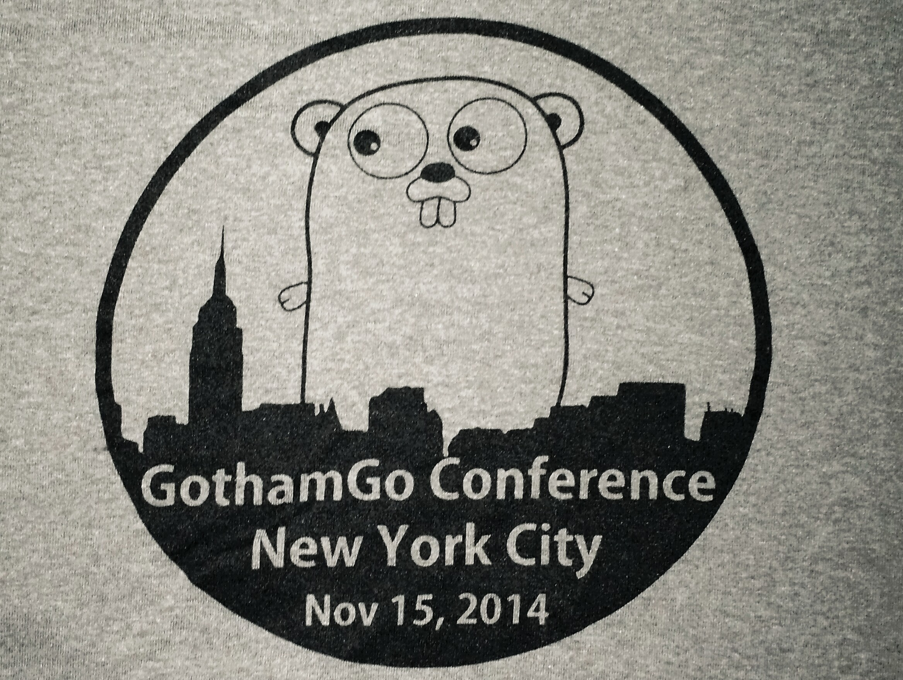

+++
title = "GothamGo：大苹果中的地鼠"
weight = 12
date = 2023-05-18T17:03:08+08:00
description = ""
isCJKLanguage = true
draft = false
+++

# GothamGo: gophers in the big apple - GothamGo：大苹果中的地鼠

https://go.dev/blog/gothamgo

Francesc Campoy
9 January 2015

Last November more than two hundred gophers from all across the United States got together for the first full-day Go conference in New York City.

去年11月，来自美国各地的两百多名地鼠聚集在一起，参加在纽约市举行的第一次全天Go会议。

The diverse speaker lineup included university students, industry experts, and Go team members.

不同的演讲者阵容包括大学生、行业专家和Go团队成员。

And good news, everybody! All the talks were recorded and are available:

还有一个好消息，大家好! 所有的演讲都被录制下来了，并且可以使用。

- [Launching into Go](http://vimeo.com/115728346) *by Kathy Spardlin* - a CockroachDB contributor provides pointers for people getting started with Go. 凯西-斯帕德林（Kathy Spardlin）的 "Go入门"--CockroachDB的贡献者为开始使用Go的人提供了一些指导。
- [Error Handling](http://vimeo.com/115782573) *by* [*Bill Kennedy*](https://twitter.com/goinggodotnet) - ideas on how to use the Go error interface. Bill Kennedy的错误处理--关于如何使用Go错误界面的想法。
- [7 common mistakes in Go and how to avoid them](http://vimeo.com/115776445) *by* [*Steve Francia*](https://twitter.com/spf13) - the author of some popular Go libraries shares his experience. Steve Francia的《Go中的7个常见错误以及如何避免它们》--一些流行的Go库的作者分享了他的经验。
- [Cancellation, Context, and Plumbing](http://vimeo.com/115309491) *by* [*Sameer Ajmani*](https://twitter.com/sajma) - the Google NYC Go team lead explains how cancellation works in Go, and how we’re retrofitting the Google code base to use it. 取消、上下文和管道，作者：Sameer Ajmani - Google NYC Go 团队负责人解释了 Go 中的取消是如何工作的，以及我们是如何对 Google 代码库进行改造以使用它。
- [Dethorning Package Management](http://vimeo.com/115940605) *by* [*Keith Rarick*](https://twitter.com/krarick) - the creator of godep talks about how to manage your dependencies well. Keith Rarick的《Dethorning Package Management》--godep的创建者讲述了如何良好地管理你的依赖关系。
- [Everything You’ve Always Wanted to Know About Go Web Apps (But were afraid to ask)](http://vimeo.com/115940590) *by* [*Mark Bates*](https://twitter.com/markbates) - a survey of Go packages for building web apps, and insights into why there are so few Go “frameworks”. Mark Bates的《关于Go网络应用的一切（但不敢问）》--对用于构建网络应用的Go软件包的调查，以及对为什么Go "框架 "这么少的见解。
- [Building high-performance database applications using Aerospike](http://vimeo.com/116215450) *by Chris Stivers* - a principal engineer at Aerospike shares his experiences building scalable applications. 使用Aerospike构建高性能的数据库应用，作者是Chris Stivers--Aerospike的首席工程师，分享他构建可扩展应用的经验。
- [The state of Go on the Android platform](http://vimeo.com/115307069) *by* [*David Crawshaw*](https://twitter.com/davidcrawshaw) - the leader of the Go on mobile platforms project tells us what’s coming up and shows a working demo. David Crawshaw的《Android平台上的Go》--Go移动平台项目的负责人告诉我们即将发生的事情，并展示了一个工作演示。
- [Mutexes and Locks](http://vimeo.com/116108566) *by* [*Jessie Frazelle*](https://twitter.com/frazelledazzell) - a member of the Docker core team tells us about concurrency and what to do when things go wrong. Jessie Frazelle的《Mutexes和Locks》--Docker核心团队的一名成员告诉我们关于并发性和出错时该怎么做。
- [Gobot.io](http://vimeo.com/115618722) *by* [*Ron Evans*](https://twitter.com/deadprogram) - awesome robots controlled by Go, with demos! Ron Evans的Gobot.io - 由Go控制的很棒的机器人，并有演示
- [Doing Go](http://vimeo.com/114941260) *by* [*Bryan Liles*](https://twitter.com/bryanl) - a DigitalOcean engineer delivers a hilarious comedy routine that happens to be about Go. Bryan Liles的《Doing Go》--一位DigitalOcean的工程师提供了一个关于Go的搞笑喜剧表演。
- [Things I learned teaching Go](http://vimeo.com/115308225) *by* [*Francesc Campoy*](https://twitter.com/francesc) - the Developer Advocate for the Go team shares his experience teaching Go and some advice on how to become a better gopher. Francesc Campoy的《我在教Go时学到的东西》--Go团队的开发者倡导者分享了他教Go的经验和一些关于如何成为一个更好的打地鼠的建议。

Two more talks come from the Go meetup in New York City, which met the day before GothamGo:

还有两个讲座来自于纽约市的Go聚会，该聚会在GothamGo的前一天举行：

- [Benchmarking Go](http://vimeo.com/114975899) *by* [*Brian Bulkowski*](https://twitter.com/bbulkow) - the founder of Aerospike talks about profiling tools for Go and Linux, and micro benchmarks for goroutines, channels, buffers, and other Go features. Brian Bulkowski的Go基准测试--Aerospike的创始人谈到了Go和Linux的剖析工具，以及goroutines、通道、缓冲区和其他Go特性的微观基准。
- [Go Static Analysis Tools](http://vimeo.com/114736889) *by Alan Donovan* - a member of the Go team at Google NY gives a guided tour of several static analysis tools designed to help Go programmers understand, navigate , and refactor their code.Go静态分析工具，作者Alan Donovan--Google NY的Go团队成员介绍了几种静态分析工具，旨在帮助Go程序员理解、浏览和重构他们的代码。

Make sure to have a look at all of those in preparation for the [FOSDEM](https://fosdem.org/) Go devroom FOSDEM in Brussels (Belgium) and [gophercon.in](http://www.gophercon.in/) in Bengaluru (India).

请务必看一看所有这些，为布鲁塞尔（比利时）的FOSDEM Go devroom和班加罗尔（印度）的gophercon.in做准备。
