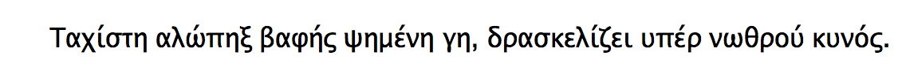

+++
title = "go 字体"
weight = 2
date = 2023-05-18T17:03:08+08:00
description = ""
isCJKLanguage = true
draft = false
+++

# Go fonts - go 字体

https://go.dev/blog/go-fonts

Nigel Tao, Chuck Bigelow, and Rob Pike
16 November 2016

## An Announcement 一个公告

The experimental user interface toolkit being built at [`golang.org/x/exp/shiny`](https://godoc.org/golang.org/x/exp/shiny) includes several text elements, but there is a problem with testing them: What font should be used? Answering this question led us to today’s announcement, the release of a family of high-quality [WGL4](https://en.wikipedia.org/wiki/Windows_Glyph_List_4) TrueType fonts, created by the [Bigelow & Holmes](http://bigelowandholmes.typepad.com/) type foundry specifically for the Go project.

正在golang.org/x/exp/shiny上构建的实验性用户界面工具包包括几个文本元素，但在测试时有一个问题。应该使用什么字体？为了回答这个问题，我们发布了今天的公告，即由Bigelow & Holmes字体铸造厂专门为Go项目创建的高质量WGL4 TrueType字体系列。

The font family, called Go (naturally), includes proportional- and fixed-width faces in normal, bold, and italic renderings. The fonts have been tested for technical uses, particularly programming. Go source code looks particularly good when displayed in Go fonts, as its name implies, with things like punctuation characters easily distinguishable and operators lined up and placed consistently:

该字体系列被称为Go（自然），包括正常、粗体和斜体的比例和固定宽度的字体。这些字体经过了技术用途的测试，尤其是编程。正如其名称所暗示的那样，用Go字体显示Go源代码时看起来特别好，标点符号等很容易区分，运算符的排列和位置也很一致：


Perhaps the most remarkable feature of the Go fonts is their license: They are licensed under the same open source license as the rest of the Go project’s software, an unusually free arrangement for a high-quality font set.

也许Go字体最显著的特点是其许可证。它们的许可证与Go项目的其他软件一样，都是开放源码许可证，对于高质量的字体集来说，这是一种不同寻常的自由安排。

Here are samples of the proportionally-spaced…

下面是按比例排列的字体样本...


and monospaced fonts:

和单行线字体：


## How to use them 如何使用它们

If you just want the TTF files, run

如果您只想要TTF文件，请运行

```
git clone https://go.googlesource.com/image
```

and copy them from the subsequent `image/font/gofont/ttfs` directory. If you want to use Go (the fonts) with Go (the software), each font is provided by a separate package. To use the Go Regular font in a program, import `golang.org/x/image/font/gofont/goregular`, and write:

并从随后的image/font/gofont/ttfs目录中复制它们。如果您想将Go（字体）与Go（软件）一起使用，每一种字体都由一个单独的软件包提供。要在程序中使用Go常规字体，请导入golang.org/x/image/font/gofont/goregular，然后写上：

```
font, err := truetype.Parse(goregular.TTF)
```

The [`github.com/golang/freetype/truetype`](https://godoc.org/github.com/golang/freetype/truetype) package provides the [`truetype.Parse`](https://godoc.org/github.com/golang/freetype/truetype#Parse) function today. There is also work underway to add a TrueType package under `golang.org/x` again licensed under the same open source license as the rest of the Go project’s software.

github.com/golang/freetype/truetype软件包今天提供了truetype.Parse函数。还有一项工作正在进行，就是在golang.org/x下增加一个TrueType包，这也是在与Go项目的其他软件相同的开源许可下进行的。

We leave it to you to find some of the other unusual properties the fonts have, but for an overview of the fonts' design we asked Chuck Bigelow to provide some background. The remainder of this blog post is his response.

我们让您自己去寻找这些字体的其他不寻常的特性，但为了概述这些字体的设计，我们请Chuck Bigelow提供一些背景。本博文的其余部分是他的回答。

## Notes on the fonts, by Chuck Bigelow 关于这些字体的说明，由Chuck Bigelow撰写

The Go fonts are divided into two sets, Go proportional, which is sans-serif, and Go Mono, which is slab-serif.

Go字体分为两套，无衬线字体Go proportional，和板状衬线字体Go mono。

## Go proportional fonts Go比例字体

### Sans-serif 无衬线字体

Go proportional fonts are sans-serif, like several popular fonts for screen displays. There is some evidence that some sans-serif faces at small sizes and low resolutions on screens are slightly more legible than their seriffed counterparts, while at large sizes, there is not a significant difference in legibility between sans and seriffed faces, at least in the pair tested. [1] (The bracketed numbers refer to the references listed at the end of this article.)

Go proportional 字体是无衬线字体，就像几种用于屏幕显示的流行字体。有证据表明，一些无衬线字体在小尺寸和低分辨率的屏幕上比有衬线的字体略微清晰，而在大尺寸的屏幕上，无衬线和有衬线的字体在可读性上没有明显的区别，至少在测试的一对字体中是如此。[1] （括号中的数字指的是本文末尾列出的参考文献。）

### Style 风格

Go sans-serif fonts are "humanist" rather than "grotesque" in style. This is an historical distinction, not an aesthetic judgment. Widely used sans-serif fonts like Helvetica and Arial are called grotesque because an early 19th century sans-serif typeface was named "Grotesque," and the name became generic.

Go无衬线字体在风格上是 "人文主义的 "而不是 "怪诞的"。这是一种历史上的区别，而不是一种审美判断。广泛使用的无衬线字体，如Helvetica和Arial，之所以被称为 "怪诞"，是因为19世纪早期的一种无衬线字体被命名为 "怪诞"，而且这个名字已经成为通用名称。

The shapes of modern grotesque fonts like Helvetica are sculpted, with smooth, assimilated forms.

像Helvetica这样的现代怪诞字体的形状是经过雕刻的，具有平滑、同化的形式。

Humanist sans-serifs are derived from Humanist handwriting and early fonts of the Italian Renaissance and still show subtle traces of pen-written calligraphy. There is some evidence that humanist fonts are more legible than grotesque fonts. [2]

人文主义无衬线字体源自人文主义手写体和意大利文艺复兴时期的早期字体，仍然显示出钢笔书写书法的微妙痕迹。有一些证据表明，人文主义字体比怪诞的字体更容易辨认。[2]

### Italics 斜体字

Go proportional italics have the same width metrics as the roman fonts. Go italics are oblique versions of the romans, with one noticeable exception: the italic lowercase ‘a’ is redesigned as a cursive single-story form to harmonize with the bowl shapes of the b d g p q set, in which the upright forms also adapt well to slanting, The addition of cursive ‘a’ makes the italics appear more lively than a simply slanted roman. Some typographers believe that slanted roman sans-serif italics are preferable to truly "cursive" sans Italics, in part because of history and design. [3]

按比例的斜体字具有与罗马字体相同的宽度度量。Go斜体是罗马体的斜体，但有一个明显的例外：斜体的小写字母'a'被重新设计为草书的单层形式，以与b d g p q套装的碗形相协调，其中直立的形式也能很好地适应斜体，草书'a'的加入使斜体比简单的斜体罗马体显得更加生动。一些编排者认为，倾斜的罗马无衬线斜体比真正的 "草书 "无衬线斜体要好，部分原因在于历史和设计。[3]


### The x-height x-高度

The x-height of a typeface is the height of the lowercase ‘x’ relative to the body size. The x-height of Go fonts is 53.0% of body size, a bit larger than the x-heights of Helvetica (52.3%) or Arial (51.9%), but the difference is usually unnoticeable at normal reading sizes. Typographers believe that larger x-heights contribute to greater legibility in small sizes and on screens. A study of "print size" (particularly x-height) and reading noted that types for reading on screens and for small sizes tend to have large x-heights. [4]

字体的X高度是指小写字母 "x "相对于字体尺寸的高度。Go字体的X高度为正文尺寸的53.0%，比Helvetica（52.3%）或Arial（51.9%）的X高度大一点，但在正常的阅读尺寸下，这种差别通常不会被注意到。排版师认为，较大的X高度有助于在小尺寸和屏幕上提高可读性。一项关于 "印刷尺寸"（尤其是X-高度）和阅读的研究指出，用于在屏幕上阅读和小尺寸的字体往往具有较大的X-高度。[4]

### DIN Legibility Standard DIN可读性标准

The recent German DIN 1450 legibility standard recommends several features for font legibility, including differentiation of letter shapes to reduce confusion. The Go fonts conform to the 1450 standard by carefully differentiating zero from capital O; numeral 1 from capital I (eye) and lowercase l (ell); numeral 5 from capital S; and numeral 8 from capital B. The shapes of bowls of b d p q follow the natural asymmetries of legible Renaissance handwriting, aiding differentiation to reduce confusion. [5]

最近的德国DIN 1450可读性标准对字体的可读性提出了一些建议，包括区分字母形状以减少混淆。Go字体符合1450标准，仔细区分了零和大写的O；数字1和大写的I（eye）以及小写的l（ell）；数字5和大写的S；以及数字8和大写的B；b d p q的碗形遵循文艺复兴时期手写体的自然不对称性，有助于区分以减少混淆。[5]

### Weights 重量

The Go proportional fonts come in three weights: Normal, Medium, and Bold. The Normal weight is strong enough that it maintains clarity on backlit screens, which often tend to erode letter features and thickness. The Medium weight has stem thickness 1.25 times the Normal, for greater sturdiness on bright screens or for users who prefer a sturdy font. The Bold weight has stem thickness 1.5 times the Normal, bold enough to be distinct from the normal weight. These Go fonts have CSS numerical weights of 400, 500, and 600. Although CSS specifies "Bold" as a 700 weight and 600 as Semibold or Demibold, the Go numerical weights match the actual progression of the ratios of stem thicknesses: Normal:Medium = 400:500; Normal:Bold = 400:600. The Bold weight name matches the use of "Bold" as the usual corresponding bold weight of a normal font. More discussion of the relationship of stem thicknesses, weight names, and CSS numbering is in [6].

Go比例字体有三种重量。普通、中等和粗体。普通重量的字体足够强大，可以在背光屏幕上保持清晰，而背光屏幕往往会侵蚀字母的特征和厚度。中等字体的字干厚度是普通字体的1.25倍，在明亮的屏幕上更加坚固，也适合那些喜欢坚固字体的用户。粗体字的字干厚度是普通字的1.5倍，足够粗大，可以与普通字区分开来。这些Go字体的CSS数字权重为400、500和600。虽然CSS规定 "粗体 "为700重量，600为半粗体或去粗体，但Go字体的数字重量与字干厚度比例的实际进展相符。正常：中等=400：500；正常：粗体=400：600。粗体权重名称与 "粗体 "作为普通字体的通常对应的粗体权重的使用相匹配。关于字干粗细、重量名称和CSS编号的关系的更多讨论见[6]。

### WGL4 character set - WGL4字符集

The WGL4 character set, originally developed by Microsoft, is often used as an informal standard character set. WGL4 includes Western and Eastern European Latin characters plus Modern Greek and Cyrillic, with additional symbols, signs, and graphical characters, totalling more than 650 characters in all. The Go WGL4 fonts can be used to compose a wide range of languages. [7]

WGL4字符集最初由微软开发，经常被用作非正式的标准字符集。WGL4包括西欧和东欧的拉丁语字符，加上现代希腊语和西里尔语，以及其他符号、标志和图形字符，总共有650多个字符。Go WGL4字体可用于编排各种语言。[7]

### Metric compatibility with Arial and Helvetica 与Arial和Helvetica的度量兼容

The Go sans-serif fonts are nearly metrically compatible with standard Helvetica or Arial characters. Texts set in Go occupy nearly the same space as texts in Helvetica or Arial (at the same size), but Go has a different look and texture because of its humanist style. Some Go letters with DIN legibility features are wider than corresponding letters in Helvetica or Arial, so some texts set in Go may take slightly more space.

Go无衬线字体在度量上几乎与标准的Helvetica或Arial字符兼容。使用Go字体的文本与使用Helvetica或Arial字体的文本所占空间几乎相同（尺寸相同），但由于Go字体的人文主义风格，其外观和质地有所不同。一些具有DIN可读性特征的Go字母比Helvetica或Arial中的相应字母更宽，因此一些用Go设置的文本可能会占用稍多的空间。

## Go Mono fonts Go单行字体

### Monospaced 单行体

Go Mono fonts are monospaced—each letter has the same width as the other letters. Monospaced fonts have been used in programming since the beginning of computing and are still widely used because the typewriter regularity of their spacing makes text align in columns and rows, a style also found in Greek inscriptions of the 5th century BC. (The ancient Greeks didn’t have typewriters or computer keyboards, but they did have great mathematicians and a great sense of symmetry and pattern that shaped their alphabet.)

Go Mono字体是单行线字体，每个字母的宽度都与其他字母相同。单行字体从计算机诞生之初就被用于编程，现在仍然被广泛使用，因为其打字机的规则性使文本按列和行排列，这种风格在公元前5世纪的希腊铭文中也能找到。（古希腊人没有打字机或电脑键盘，但他们确实有伟大的数学家和对对称性和模式的巨大感觉，形成了其字母表。）

### Slab-serif 板式衬线

The Go Mono fonts have slab-shaped serifs, giving them a sturdy appearance.

Go Mono字体具有板状衬线，使其具有坚固的外观。

### Style 风格

The underlying letter shapes of Go Mono are, like the Go sans-serif fonts, derived from humanist handwriting, but the monospacing and slab serifs tend to obscure the historical and stylistic connections.

Go Mono字体的基本字母形状与Go sans-serif字体一样，源自人文主义手写体，但单行线和板状衬线往往会掩盖其历史和风格上的联系。

### Italics 斜体字

Go Mono Italics are oblique versions of the romans, with the exception that the italic lowercase ‘a’ is redesigned as a cursive single-story form to harmonize with the bowl shapes of the b d g p q. The cursive ‘a’ makes the italics appear more lively than a simply slanted roman. As with many sans-serif fonts, it is believed that slanted roman slab-serifs fonts may be more legible than truly "cursive" italics.

Go Mono Italics是罗马体的斜体版本，除了斜体的小写字母 "a "被重新设计为草书的单层形式，以与b d g p q的碗形相协调。就像许多无衬线字体一样，人们认为斜的罗马字板状衬线字体可能比真正的 "草书 "斜体更易读。


### The x-height x-高度

Go Mono fonts have the same x-height as Go sans-serif fonts, 53% of the body size. Go Mono looks almost 18% bigger than Courier, which has an x-height 45% of body size. Yet Go Mono has the same width as Courier, so the bigger look is gained with no loss of economy in characters per line.

Go Mono字体的X高度与Go sans-serif字体相同，为字体大小的53%。Go Mono字体看起来比Courier字体大18%，Courier字体的X高度为正文尺寸的45%。然而Go Mono的宽度与Courier相同，因此在获得更大的外观的同时，并没有损失每行字符的经济性。

### DIN Legibility Standard DIN - 可读性标准

Go Mono fonts conform to the DIN 1450 standard by differentiating zero from capital O; numeral 1 from capital I (eye) and lowercase l (ell); numeral 5 from capital S; and numeral 8 from capital B. The shapes of bowls of b d p q follow the natural asymmetries of legible Renaissance handwriting, aiding differentiation and reducing confusion.

Go Mono字体符合DIN 1450标准，将零与大写O区分开来；将数字1与大写I（眼睛）和小写l（椭圆）区分开来；将数字5与大写S区分开来；将数字8与大写B区分开来。

### Weights 重量

Go Mono fonts have two weights: Normal and Bold. The normal weight stem is the same as in Go Normal and thus maintains clarity on backlit screens, which tend to erode letter features and stem thickness. The bold stem thickness is 1.5 times thicker than the normal weight, hence the Bold Mono has the same stem thickness as Bold Go proportional. Because the letter width of monospaced bold is identical to the width of monospaced normal, the bold Mono appears slightly bolder than the proportional Go Bold, as more black pixels are put into the same area.

Go Mono字体有两种重量。普通和粗体。正常重量的字干与Go Normal相同，因此在背光屏幕上可以保持清晰，因为背光屏幕容易侵蚀字母特征和字干厚度。粗体字的字干厚度是正常重量的1.5倍，因此粗体单字的字干厚度与粗体Go比例相同。因为单行黑体的字母宽度与单行普通字体的宽度相同，所以黑体单字看起来比按比例的Go Bold略为粗大，因为在相同的区域内有更多的黑色像素。

### Metric compatibility with popular monospaced fonts 与流行的单行线字体的度量兼容

Go Mono is metrically compatible with Courier and other monospaced fonts that match the "Pica" typewriter type widths of 10 characters per linear inch at 12 point. At 10 point, Go Mono fonts set 12 characters per inch. The TrueType fonts are scalable, of course, so Go Mono can be set at any size.

Go Mono 与 Courier 和其他单行本字体在度量上是兼容的，这些字体符合 12 点时每线英寸 10 个字符的 "Pica "打字机字体宽度。在10点时，Go Mono字体设定每英寸12个字符。当然，TrueType字体是可扩展的，所以Go Mono字体可以设置为任何尺寸。

### WGL4 character set - WGL4字符集

The Go Mono fonts offer the WGL4 character set often used as an informal standard character set. WGL4 includes Western and Eastern European Latin characters plus Modern Greek and Cyrillic, with additional symbols, signs, and graphical characters. The 650+ characters of the Go WGL4 sets can be used for a wide range of languages.

Go Mono字体提供WGL4字符集，通常作为非正式的标准字符集使用。WGL4包括西欧和东欧的拉丁文字符，加上现代希腊文和西里尔文，以及其他符号、标志和图形字符。Go WGL4字符集的650多个字符可用于多种语言。

## References 参考文献

[1] Morris, R. A., Aquilante, K., Yager, D., & Bigelow, C. (2002, May). P‐13: Serifs Slow RSVP Reading at Very Small Sizes, but Don’t Matter at Larger Sizes. In SID Symposium Digest of Technical Papers (Vol. 33, No. 1, pp. 244-247). Blackwell Publishing Ltd.

[1] Morris, R. A., Aquilante, K., Yager, D., & Bigelow, C. (2002, May). P-13：在非常小的尺寸下，衬线会减慢RSVP的阅读速度，但在较大的尺寸下并不重要。In SID Symposium Digest of Technical Papers (Vol. 33, No. 1, pp. 244-247). 布莱克韦尔出版有限公司。

[2] Bryan Reimer et al. (2014) "Assessing the impact of typeface design in a text-rich automotive user interface", Ergonomics, 57:11, 1643-1658. http://www.tandfonline.com/doi/abs/10.1080/00140139.2014.940000

[2] Bryan Reimer等人（2014）"评估字体设计在文字丰富的汽车用户界面中的影响"，《人体工程学》，57:11，1643-1658。http://www.tandfonline.com/doi/abs/10.1080/00140139.2014.940000

[3] Adrian Frutiger - Typefaces: The Complete Works. H. Osterer and P. Stamm, editors. Birkhäuser, Basel, 2009, page 257.

[3] Adrian Frutiger--字体。The Complete Works. H. Osterer和P. Stamm，编辑。Birkhäuser, Basel, 2009, page 257.

[4] Legge, G. E., & Bigelow, C. A. (2011). Does print size matter for reading? A review of findings from vision science and typography. Journal of Vision, 11(5), 8-8. http://jov.arvojournals.org/article.aspx?articleid=2191906

[4] Legge, G. E., & Bigelow, C. A. (2011). 印刷品大小对阅读有影响吗？对视觉科学和排版学研究结果的回顾。视觉杂志，11（5），8-8。http://jov.arvojournals.org/article.aspx?articleid=2191906

[5] Charles Bigelow. "Oh, oh, zero!" TUGboat, Volume 34 (2013), No. 2. https://tug.org/TUGboat/tb34-2/tb107bigelow-zero.pdf https://tug.org/TUGboat/tb34-2/tb107bigelow-wang.pdf

[5] Charles Bigelow。"哦，哦，零！" TUGboat，第34卷（2013），第2号。https://tug.org/TUGboat/tb34-2/tb107bigelow-zero.pdf https://tug.org/TUGboat/tb34-2/tb107bigelow-wang.pdf

[6] "Lucida Basic Font Weights" Bigelow & Holmes. http://lucidafonts.com/pages/facts

[6] "Lucida Basic Font Weights" Bigelow & Holmes. http://lucidafonts.com/pages/facts

[7] WGL4 language coverage: Afrikaans, Albanian, Asu, Basque, Belarusian, Bemba, Bena, Bosnian, Bulgarian, Catalan, Chiga, Colognian, Cornish, Croatian, Czech, Danish, Embu, English, Esperanto, Estonian, Faroese, Filipino, Finnish, French, Friulian, Galician, Ganda, German, Greek, Gusii, Hungarian, Icelandic, Inari Sami, Indonesian, Irish, Italian, Jola-Fonyi, Kabuverdianu, Kalaallisut, Kalenjin, Kamba, Kikuyu, Kinyarwanda, Latvian, Lithuanian, Lower Sorbian, Luo, Luxembourgish, Luyia, Macedonian, Machame, Makhuwa-Meetto, Makonde, Malagasy, Malay, Maltese, Manx, Meru, Morisyen, North Ndebele, Northern Sami, Norwegian Bokmål, Norwegian Nynorsk, Nyankole, Oromo, Polish, Portuguese, Romanian, Romansh, Rombo, Rundi, Russian, Rwa, Samburu, Sango, Sangu, Scottish Gaelic, Sena, Serbian, Shambala, Shona, Slovak, Slovenian, Soga, Somali, Spanish, Swahili, Swedish, Swiss German, Taita, Teso, Turkish, Turkmen, Upper Sorbian, Vunjo, Walser, Welsh, Zulu

[7] WGL4语言覆盖率。南非语、阿尔巴尼亚语、阿苏语、巴斯克语、白俄罗斯语、本巴语、贝纳语、波斯尼亚语、保加利亚语、加泰罗尼亚语、奇加语、科隆语、康沃尔语、克罗地亚语、捷克语、丹麦语、恩布语、英语、世界语、爱沙尼亚语、法罗语、菲律宾语、芬兰语、法语、弗留利语、加利西亚语。Ganda, 德语, 希腊语, Gusii, 匈牙利语, 冰岛语, Inari Sami, 印度尼西亚语, 爱尔兰语, 意大利语, Jola-Fonyi, Kabuverdianu, Kalaallisut, Kalenjin, Kamba, Kikuyu, Kinyarwanda, Latvian, Lithuanian, Lower Sorbian, Luo, Luxembourgish, Luuyia, Macedonian, Machame, Makhuwa-Meetto, Makonde, Malagasy, Malay, Maltese, Manx, Meru, Morisyen, North Ndebele, Northern Sami, Norwegian Bokmål, Norwegian Nynorsk, Nyankole, Oromo, Polish, Portuguese, Romanian, Rombo, Rundi, 俄语、Rwa、Samburu、Sango、Sangu、苏格兰盖尔语、Sena、塞尔维亚语、Shambala、Shona、斯洛伐克语、斯洛文尼亚语、Soga、索马里语、西班牙语、斯瓦希里语、瑞典语、瑞士德语、Taita、Teso、土耳其语、土库曼语、上索布语、Vunjo、Walser、威尔士语、Zulu

## Jabberwocky in Go Regular - Go规则中的贾伯乌克语

From [en.wikipedia.org/wiki/Jabberwocky](https://en.wikipedia.org/wiki/Jabberwocky):

来自en.wikipedia.org/wiki/Jabberwocky：


There is no Greek version listed. Instead, a pangram from [clagnut.com/blog/2380/#Greek](http://clagnut.com/blog/2380/#Greek):

没有列出希腊语版本。取而代之的是来自clagnut.com/blog/2380/#Greek的pangram：


