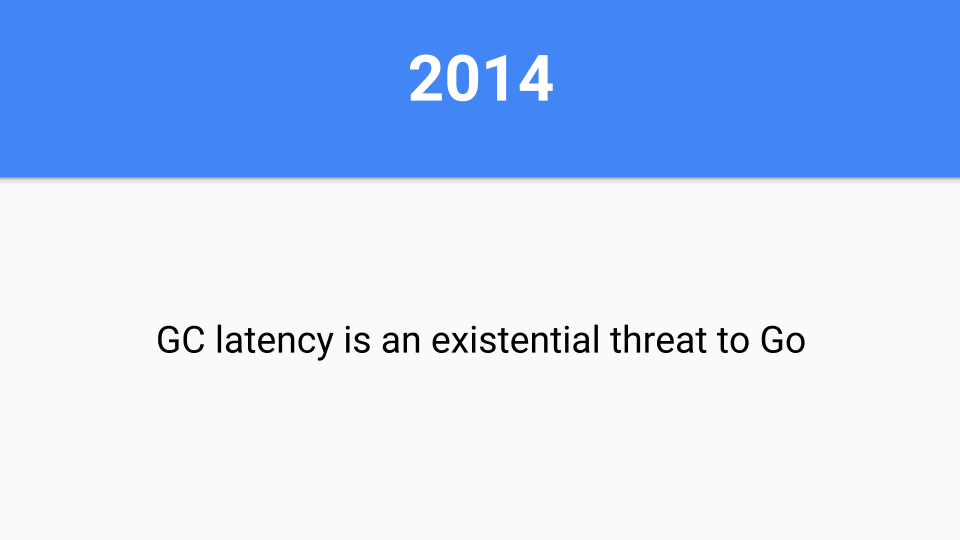
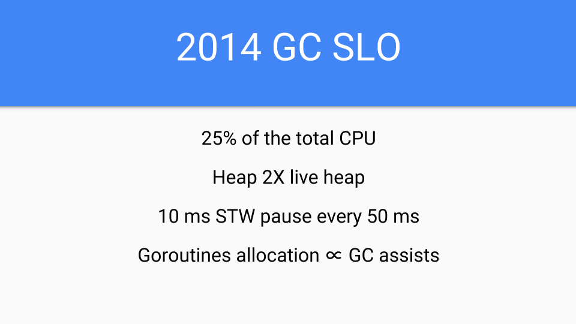
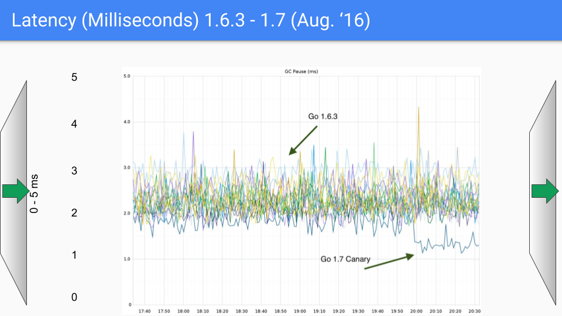
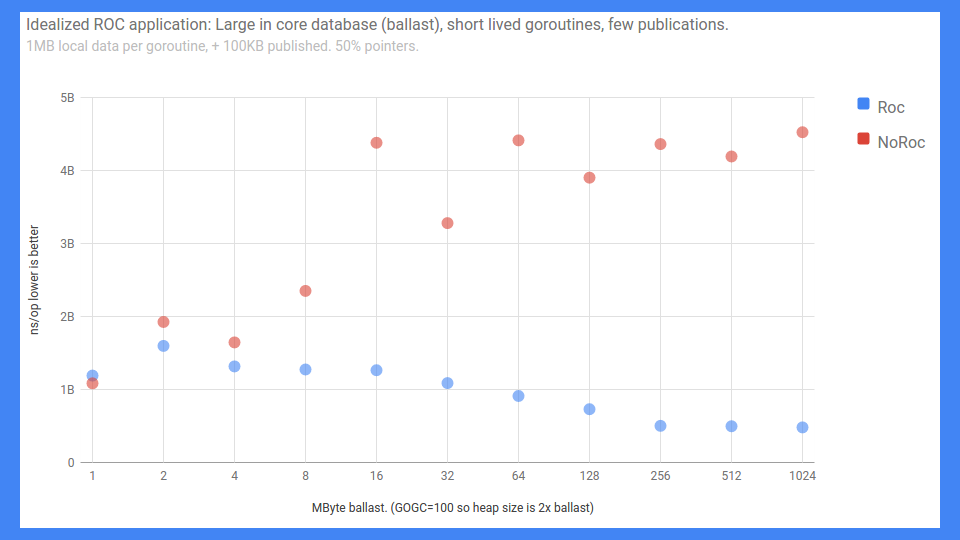
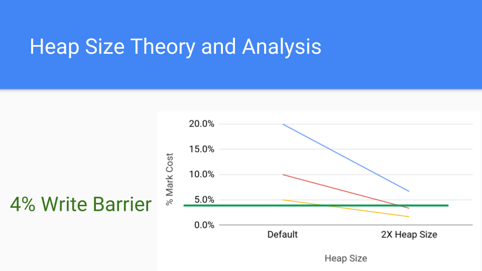
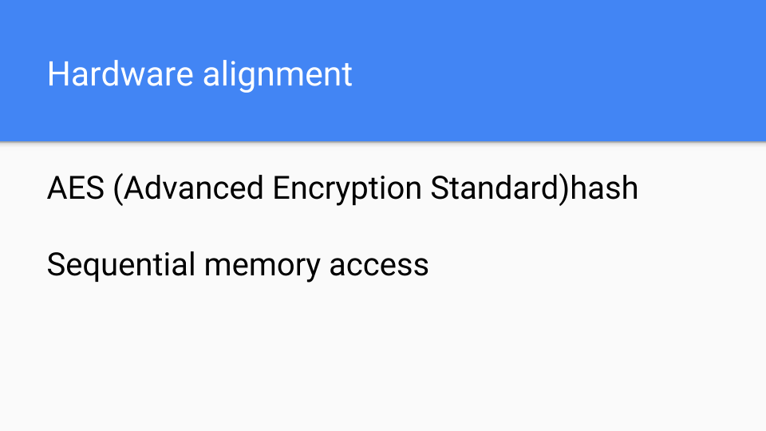

+++
title = "走向 go：go垃圾收集器的历程"
weight = 11
date = 2023-05-18T17:03:08+08:00
description = ""
isCJKLanguage = true
draft = false
+++

# Getting to Go: The Journey of Go's Garbage Collector - 走向 go：go垃圾收集器的历程

https://go.dev/blog/ismmkeynote

Rick Hudson
12 July 2018

This is the transcript from the keynote I gave at the International Symposium on Memory Management (ISMM) on June 18, 2018. For the past 25 years ISMM has been the premier venue for publishing memory management and garbage collection papers and it was an honor to have been invited to give the keynote.

这是我于2018年6月18日在国际内存管理研讨会（ISMM）上发表的主题演讲的记录。在过去的25年里，ISMM一直是发表内存管理和垃圾收集论文的首要场所，很荣幸被邀请发表主题演讲。

## Abstract 摘要

The Go language features, goals, and use cases have forced us to rethink the entire garbage collection stack and have led us to a surprising place. The journey has been exhilarating. This talk describes our journey. It is a journey motivated by open source and Google’s production demands. Included are side hikes into dead end box canyons where numbers guided us home. This talk will provide insight into the how and the why of our journey, where we are in 2018, and Go’s preparation for the next part of the journey.

Go语言的特性、目标和用例迫使我们重新思考整个垃圾收集栈，并将我们引向一个令人惊讶的地方。这段旅程是令人振奋的。本讲座描述了我们的旅程。这是一个由开放源码和Google的生产需求推动的旅程。其中包括了进入死胡同的盒子峡谷的侧面徒步旅行，数字引导我们回家。本讲座将深入介绍我们的旅程的方式和原因，我们在2018年的情况，以及Go为下一段旅程所做的准备。

## Bio 个人简介

Richard L. Hudson (Rick) is best known for his work in memory management including the invention of the Train, Sapphire, and Mississippi Delta algorithms as well as GC stack maps which enabled garbage collection in statically typed languages such as Modula-3, Java, C#, and Go. Rick is currently a member of Google’s Go team where he is working on Go’s garbage collection and runtime issues.

Richard L. Hudson（Rick）因其在内存管理方面的工作而闻名，包括发明了Train、Sapphire和Mississippi Delta算法以及GC堆栈图，使Modula-3、Java、C#和Go等静态类型语言中的垃圾收集成为可能。Rick目前是谷歌Go团队的成员，他正在研究Go的垃圾收集和运行时问题。

Contact: rlh@golang.org

Comments: See [the discussion on golang-dev](https://groups.google.com/forum/#!topic/golang-dev/UuDv7W1Hsns).

## The Transcript 实录

Rick Hudson here.

我是Rick Hudson。

This is a talk about the Go runtime and in particular the garbage collector. I have about 45 or 50 minutes of prepared material and after that we will have time for discussion and I’ll be around so feel free to come up afterwards.

这是一个关于Go运行时，特别是垃圾收集器的讲座。我准备了大约45或50分钟的材料，之后我们将有时间进行讨论，我也会在旁边，所以之后可以自由地提出来。

Before I get started I want to acknowledge some people.

在我开始之前，我想对一些人表示感谢。

A lot of the good stuff in the talk was done by Austin Clements. Other people on the Cambridge Go team, Russ, Than, Cherry, and David have been an engaging, exciting, and fun group to work with.

讲座中的很多好东西都是由Austin Clements完成的。剑桥Go团队的其他成员，Russ、Than、Cherry和David都是一个有吸引力的、令人兴奋的、有趣的工作团队。

We also want to thank the 1.6 million Go users worldwide for giving us interesting problems to solve. Without them a lot of these problems would never come to light.

我们也要感谢全球160万Go用户给我们提供了有趣的问题来解决。没有他们，很多问题就不会被发现。

And finally I want to acknowledge Renee French for all these nice Gophers that she has been producing over the years. You will see several of them throughout the talk.

最后我想感谢Renee French，感谢她多年来制作的所有这些漂亮的Gophers。您会在整个讲座中看到其中的几个。

Before we get revved up and going on this stuff we really have to show what GC’s view of Go looks like.

在我们开始讨论这些东西之前，我们真的要展示一下GC对Go的看法是什么样子的。

Well first of all Go programs have hundreds of thousands of stacks. They are managed by the Go scheduler and are always preempted at GC safepoints. The Go scheduler multiplexes Go routines onto OS threads which hopefully run with one OS thread per HW thread. We manage the stacks and their size by copying them and updating pointers in the stack. It’s a local operation so it scales fairly well.

首先，Go程序有成千上万的堆栈。它们由Go调度器管理，并且总是在GC安全点被抢占。Go调度器将Go程序复用到操作系统线程上，希望每个HW线程运行一个操作系统线程。我们通过复制堆栈和更新堆栈中的指针来管理堆栈和它们的大小。这是一个本地操作，所以它的扩展性相当好。

The next thing that is important is the fact that Go is a value-oriented language in the tradition of C-like systems languages rather than reference-oriented language in the tradition of most managed runtime languages. For example, this shows how a type from the tar package is laid out in memory. All of the fields are embedded directly in the Reader value. This gives programmers more control over memory layout when they need it. One can collocate fields that have related values which helps with cache locality.

接下来重要的一点是，Go是一种类似C语言的系统语言传统中的面向价值的语言，而不是大多数托管运行语言传统中的面向引用的语言。例如，这显示了tar包中的一个类型是如何在内存中布局的。所有的字段都直接嵌入到Reader的值中。这让程序员在需要时对内存布局有更多的控制。人们可以把有相关值的字段放在一起，这有助于缓存的定位。

Value-orientation also helps with the foreign function interfaces. We have a fast FFI with C and C++. Obviously Google has a tremendous number of facilities available but they are written in C++. Go couldn’t wait to reimplement all of these things in Go so Go had to have access to these systems through the foreign function interface.

以值为导向也有助于外国函数接口。我们有一个快速的FFI与C和C++。很明显，Google有大量的可用设施，但它们是用C++编写的。Go无法等待在Go中重新实现所有这些东西，所以Go必须通过对外函数接口来访问这些系统。

This one design decision has led to some of the more amazing things that have to go on with the runtime. It is probably the most important thing that differentiates Go from other GCed languages.

这一个设计决定导致了一些更惊人的事情，必须在运行时进行。这可能是Go区别于其他GCed语言的最重要的东西。

Of course Go can have pointers and in fact they can have interior pointers. Such pointers keep the entire value live and they are fairly common.

当然Go可以有指针，事实上它们可以有内部指针。这样的指针可以保持整个值的实时性，而且它们是相当常见的。

We also have a way ahead of time compilation system so the binary contains the entire runtime.

我们也有一个超前的编译系统，所以二进制文件包含了整个运行时间。

There is no JIT recompilation. There are pluses and minuses to this. First of all, reproducibility of program execution is a lot easier which makes moving forward with compiler improvements much faster.

没有JIT重新编译。这有好处也有坏处。首先，程序执行的可重复性要容易得多，这使得编译器的改进工作进展得更快。

On the sad side of it we don’t have the chance to do feedback optimizations as you would with a JITed system.

不幸的是，我们没有机会像在JIT系统中那样进行反馈优化。

So there are pluses and minuses.

因此，有好处也有坏处。

Go comes with two knobs to control the GC. The first one is GCPercent. Basically this is a knob that adjusts how much CPU you want to use and how much memory you want to use. The default is 100 which means that half the heap is dedicated to live memory and half the heap is dedicated to allocation. You can modify this in either direction.

Go有两个旋钮来控制GC。第一个是GCPercent。基本上，这是一个可以调整您想使用多少CPU和多少内存的旋钮。默认值是100，这意味着一半的堆被用于实时内存，一半的堆被用于分配。您可以在任何一个方向上修改。

MaxHeap, which is not yet released but is being used and evaluated internally, lets the programmer set what the maximum heap size should be. Out of memory, OOMs, are tough on Go; temporary spikes in memory usage should be handled by increasing CPU costs, not by aborting. Basically if the GC sees memory pressure it informs the application that it should shed load. Once things are back to normal the GC informs the application that it can go back to its regular load. MaxHeap also provides a lot more flexibility in scheduling. Instead of always being paranoid about how much memory is available the runtime can size the heap up to the MaxHeap.

MaxHeap，尚未发布，但正在内部使用和评估，让程序员设置最大的堆尺寸应该是多少。内存不足，OOMs，对Go来说是很困难的；临时的内存使用高峰应该通过增加CPU成本来处理，而不是通过中止。基本上，如果GC看到了内存压力，它就会通知应用程序，它应该减掉负载。一旦事情恢复正常，GC就会通知应用程序可以恢复正常的负载。MaxHeap在调度方面也提供了更多的灵活性。运行时可以将堆的大小调整到MaxHeap，而不是总是偏执于有多少内存可用。

This wraps up our discussion on the pieces of Go that are important to the garbage collector.

这就结束了我们对Go中对垃圾收集器很重要的部分的讨论。

So now let’s talk about the Go runtime and how did we get here, how we got to where we are.

现在我们来谈谈Go的运行时，以及我们是如何走到这里的，我们是如何走到这里的。

So it’s 2014. If Go does not solve this GC latency problem somehow then Go isn’t going to be successful. That was clear.

所以现在是2014年。如果Go不以某种方式解决GC延迟的问题，那么Go就不会成功。这很清楚。

Other new languages were facing the same problem. Languages like Rust went a different way but we are going to talk about the path that Go took.

其他新语言也面临着同样的问题。像Rust这样的语言走的是另一条路，但我们要谈的是Go走的路。

Why is latency so important?

为什么延迟如此重要？

The math is completely unforgiving on this.

在这个问题上，数学是完全不可饶恕的。

A 99%ile isolated GC latency service level objective (SLO), such as 99% of the time a GC cycle takes < 10ms, just simply doesn’t scale. What matters is latency during an entire session or through the course of using an app many times in a day. Assume a session that browses several web pages ends up making 100 server requests during a session or it makes 20 requests and you have 5 sessions packed up during the day. In that situation only 37% of users will have a consistent sub 10ms experience across the entire session.

一个99%的孤立的GC延迟服务水平目标（SLO），例如99%的GC周期所需时间小于10ms，根本无法扩展。重要的是在整个会话期间或在一天内多次使用一个应用程序的过程中的延迟。假设一个浏览几个网页的会话在一个会话中最终发出了100个服务器请求，或者它发出了20个请求，而您在一天内有5个会话被打包。在这种情况下，只有37%的用户会在整个会话中获得一致的低于10ms的体验。

If you want 99% of those users to have a sub 10ms experience, as we are suggesting, the math says you really need to target 4 9s or the 99.99%ile.

如果您想让99%的用户拥有10毫秒以下的体验，就像我们建议的那样，数学上说您真的需要以4个9或99.99%为目标。

So it’s 2014 and Jeff Dean had just come out with his paper called ‘The Tail at Scale’ which this digs into this further. It was being widely read around Google since it had serious ramifications for Google going forward and trying to scale at Google scale.

所以，这是2014年，杰夫-迪安刚刚发表了他的论文，名为 "规模的尾巴"，这进一步挖掘了这一点。这篇论文在谷歌周围被广泛阅读，因为它对谷歌未来的发展和试图以谷歌的规模进行扩展有着严重的影响。

We call this problem the tyranny of the 9s.

我们把这个问题称为 "9 "的暴政。

So how do you fight the tyranny of the 9s?

那么，您如何与 "9 "的暴政作斗争？

A lot of things were being done in 2014.

2014年，很多事情都在做。

If you want 10 answers ask for several more and take the first 10 and those are the answers you put on your search page. If the request exceeds 50%ile reissue or forward the request to another server. If GC is about to run, refuse new requests or forward the requests to another server until GC is done. And so forth and so on.

如果您想要10个答案，再问几个，取前10个，这些就是您放在搜索页面上的答案。如果请求超过50%ile，则重新发布或将请求转发给另一个服务器。如果GC即将运行，拒绝新的请求或将请求转发到另一台服务器，直到GC完成。诸如此类，不一而足。

All these are workarounds come from very clever people with very real problems but they didn’t tackle the root problem of GC latency. At Google scale we had to tackle the root problem. Why?

所有这些都是解决方法，来自于非常聪明的人，他们有非常真实的问题，但他们没有解决GC延迟的根本问题。在谷歌，我们必须解决这个根本问题。为什么？

Redundancy wasn’t going to scale, redundancy costs a lot. It costs new server farms.

冗余是无法扩展的，冗余的成本很高。它需要新的服务器群。

We hoped we could solve this problem and saw it as an opportunity to improve the server ecosystem and in the process save some of the endangered corn fields and give some kernel of corn the chance to be knee high by the fourth of July and reach its full potential.

我们希望我们能解决这个问题，并把它看作是一个改善服务器生态系统的机会，并在这个过程中拯救一些濒临灭绝的玉米田，让一些玉米粒有机会在7月4日之前长到膝盖高，并发挥其全部潜力。

So here is the 2014 SLO. Yes, it was true that I was sandbagging, I was new on the team, it was a new process to me, and I didn’t want to over promise.

因此，这里是2014年的SLO。是的，我确实是在打沙袋，我是团队中的新人，对我来说是一个新的过程，我不想过度承诺。

Furthermore presentations about GC latency in other languages were just plain scary.

此外，关于其他语言的GC延迟的介绍也是非常可怕的。

The original plan was to do a read barrier free concurrent copying GC. That was the long term plan. There was a lot of uncertainty about the overhead of read barriers so Go wanted to avoid them.

最初的计划是做一个无读取障碍的并发复制的GC。那是长期的计划。读取障碍的开销有很大的不确定性，所以Go想避免它们。

But short term 2014 we had to get our act together. We had to convert all of the runtime and compiler to Go. They were written in C at the time. No more C, no long tail of bugs due to C coders not understanding GC but having a cool idea about how to copy strings. We also needed something quickly and focused on latency but the performance hit had to be less than the speedups provided by the compiler. So we were limited. We had basically a year of compiler performance improvements that we could eat up by making the GC concurrent. But that was it. We couldn’t slow down Go programs. That would have been untenable in 2014.

但在2014年的短期内，我们必须把我们的工作做好。我们必须将所有的运行时和编译器转换为Go。他们当时是用C语言编写的。没有了C语言，也就没有了由于C语言编码者不理解GC而产生的长长的bug尾巴，但却有一个关于如何复制字符串的很酷的想法。我们还需要一些快速的、专注于延迟的东西，但对性能的影响必须小于编译器所提供的速度提升。所以我们受到了限制。我们基本上有一年的编译器性能改进时间，我们可以通过让GC并发来吃掉。但也就这样了。我们不能降低Go程序的速度。这在2014年是站不住脚的。

So we backed off a bit. We weren’t going to do the copying part.

所以我们退缩了一些。我们不打算做复制的部分。

The decision was to do a tri-color concurrent algorithm. Earlier in my career Eliot Moss and I had done the journal proofs showing that Dijkstra’s algorithm worked with multiple application threads. We also showed we could knock off the STW problems, and we had proofs that it could be done.

我们的决定是做一个三色并发算法。在我职业生涯的早期，Eliot Moss和我已经完成了期刊证明，表明Dijkstra的算法在多个应用线程中是可行的。我们还证明了我们可以解决STW问题，而且我们有证明可以做到这一点。

We were also concerned about compiler speed, that is the code the compiler generated. If we kept the write barrier turned off most of the time the compiler optimizations would be minimally impacted and the compiler team could move forward rapidly. Go also desperately needed short term success in 2015.

我们还关注编译器的速度，也就是编译器生成的代码。如果我们在大多数时候都关闭写障碍，那么编译器的优化就会受到最小的影响，编译器团队就可以快速前进。Go在2015年也迫切需要短期的成功。

So let’s look at some of the things we did.

因此，让我们来看看我们所做的一些事情。

We went with a size segregated span. Interior pointers were a problem.

我们采用了一个大小分离的跨度。内部指针是一个问题。

The garbage collector needs to efficiently find the start of the object. If it knows the size of the objects in a span it simply rounds down to that size and that will be the start of the object.

垃圾收集器需要有效地找到对象的起点。如果它知道一个跨度中的对象的大小，它可以简单地向下舍入该大小，这将是该对象的开始。

Of course size segregated spans have some other advantages.

当然，尺寸隔离的跨度还有其他一些优点。

Low fragmentation: Experience with C, besides Google’s TCMalloc and Hoard, I was intimately involved with Intel’s Scalable Malloc and that work gave us confidence that fragmentation was not going to be a problem with non-moving allocators.

低碎片化。除了Google的TCMalloc和Hoard之外，我还密切参与了Intel的Scalable Malloc，这项工作让我们相信碎片化不会成为非移动分配器的一个问题。

Internal structures: We fully understood and had experience with them. We understood how to do size segregated spans, we understood how to do low or zero contention allocation paths.

内部结构。我们完全理解并拥有这方面的经验。我们知道如何做大小分离的跨度，我们知道如何做低或零竞争的分配路径。

Speed: Non-copy did not concern us, allocation admittedly might be slower but still in the order of C. It might not be as fast as bump pointer but that was OK.

速度：我们并不关心非拷贝的问题，分配可能会慢一些，但仍在C的范围内。它可能没有凹凸指针那么快，但那是可以的。

We also had this foreign function interface issue. If we didn’t move our objects then we didn’t have to deal with the long tail of bugs you might encounter if you had a moving collector as you attempt to pin objects and put levels of indirection between C and the Go object you are working with.

我们也有这个外来函数接口的问题。如果我们不移动我们的对象，那么我们就不必处理如果您有一个移动的收集器，您可能会遇到的长尾错误，因为您试图钉住对象，并在C和您正在工作的Go对象之间设置层级的指示。

The next design choice was where to put the object’s metadata. We needed to have some information about the objects since we didn’t have headers. Mark bits are kept on the side and used for marking as well as allocation. Each word has 2 bits associated with it to tell you if it was a scalar or a pointer inside that word. It also encoded whether there were more pointers in the object so we could stop scanning objects sooner than later. We also had an extra bit encoding that we could use as an extra mark bit or to do other debugging things. This was really valuable for getting this stuff running and finding bugs.

下一个设计选择是把对象的元数据放在哪里。我们需要有一些关于对象的信息，因为我们没有标头。标记位被保留在侧面，用于标记以及分配。每个字都有2个比特与之相关，以告诉您这个字里面是标量还是指针。它还编码对象中是否有更多的指针，所以我们可以尽早停止扫描对象。我们还有一个额外的编码位，我们可以把它作为一个额外的标记位，或者用来做其他调试工作。这对于让这些东西运行和发现错误来说，真的很有价值。

So what about write barriers? The write barrier is on only during the GC. At other times the compiled code loads a global variable and looks at it. Since the GC was typically off the hardware correctly speculates to branch around the write barrier. When we are inside the GC that variable is different, and the write barrier is responsible for ensuring that no reachable objects get lost during the tri-color operations.

那么，写障碍是怎么回事呢？写入障碍只在GC期间开启。在其他时候，编译后的代码会加载一个全局变量并查看它。由于GC通常是关闭的，所以硬件正确地推测了写屏障周围的分支。当我们在GC里面的时候，那个变量就不一样了，写屏障负责确保在三色操作中没有可到达的对象被丢失。

The other piece of this code is the GC Pacer. It is some of the great work that Austin did. It is basically based on a feedback loop that determines when to best start a GC cycle. If the system is in a steady state and not in a phase change, marking will end just about the time memory runs out.

这段代码的另一块是GC Pacer。它是Austin所做的一些伟大的工作。它基本上是基于一个反馈循环，决定什么时候开始GC循环最好。如果系统处于稳定状态，没有发生阶段性变化，标记将在内存耗尽的时候结束。

That might not be the case so the Pacer also has to monitor the marking progress and ensure allocation doesn’t overrun the concurrent marking.

但情况可能并非如此，所以Pacer也必须监控标记进度，确保分配不会超过并发标记。

If need be, the Pacer slows down allocation while speeding up marking. At a high level the Pacer stops the Goroutine, which is doing a lot of the allocation, and puts it to work doing marking. The amount of work is proportional to the Goroutine’s allocation. This speeds up the garbage collector while slowing down the mutator.

如果需要的话，Pacer会在加快打标速度的同时减慢分配速度。在高水平上，Pacer停止了正在进行大量分配的Goroutine，并让它进行标记工作。工作量与Goroutine的分配成正比。这加快了垃圾收集器的速度，同时减慢了突变器的速度。

When all of this is done the Pacer takes what it has learnt from this GC cycle as well as previous ones and projects when to start the next GC.

当所有这些都完成后，Pacer从这个GC周期和以前的周期中学习到的东西，并预测何时开始下一次GC。

It does much more than this but that is the basic approach.

它所做的远不止这些，但这是基本的方法。

The math is absolutely fascinating, ping me for the design docs. If you are doing a concurrent GC you really owe it to yourself to look at this math and see if it’s the same as your math. If you have any suggestions let us know.

这方面的数学知识绝对令人着迷，请联系我索取设计文档。如果您正在做一个并发的GC，您真的应该看看这个数学，看看它是否和您的数学一样。如果您有什么建议，请告诉我们。

[*Go 1.5 concurrent garbage collector pacing](https://go.dev/s/go15gcpacing) and [Proposal: Separate soft and hard heap size goal

*Go 1.5 并发垃圾收集器的节奏和建议。分开软堆和硬堆的大小目标

Yes, so we had successes, lots of them. A younger crazier Rick would have taken some of these graphs and tattooed them on my shoulder I was so proud of them.

是的，所以我们取得了成功，很多成功。一个更年轻的疯狂的Rick会把其中一些图纹在我的肩膀上，我为它们感到骄傲。

This is a series of graphs that was done for a production server at Twitter. We of course had nothing to do with that production server. Brian Hatfield did these measurements and oddly enough tweeted about them.

这是一系列图表，是为Twitter的一个生产服务器做的。当然，我们与该生产服务器没有任何关系。布莱恩-哈特菲尔德做了这些测量，奇怪的是，他在推特上发表了这些测量结果。

On the Y axis we have GC latency in milliseconds. On the X axis we have time. Each of the points is a stop the world pause time during that GC.

在Y轴上，我们有GC延迟，单位是毫秒。在X轴上我们有时间。每一个点都是在GC期间停止世界的暂停时间。

On our first release, which was in August of 2015, we saw a drop from around 300 - 400 milliseconds down to 30 or 40 milliseconds. This was good, order of magnitude good.

在我们的第一个版本，也就是2015年8月，我们看到从大约300-400毫秒下降到30或40毫秒。这很好，是数量级的好。

We are going to change the Y-axis here radically from 0 to 400 milliseconds down to 0 to 50 milliseconds.

我们要把这里的Y轴从0到400毫秒彻底改变为0到50毫秒。

This is 6 months later. The improvement was largely due to systematically eliminating all the O(heap) things we were doing during the stop the world time. This was our second order of magnitude improvement as we went from 40 milliseconds down to 4 or 5.

这是6个月后的情况。这种改进主要是由于系统地消除了我们在停止世界时间内所做的所有O(heap)事情。这是我们的第二个数量级的改进，因为我们从40毫秒下降到4或5。

There were some bugs in there that we had to clean up and we did this during a minor release 1.6.3. This dropped latency down to well under 10 milliseconds, which was our SLO.

其中有一些我们必须清理的bug，我们在1.6.3的小版本中做了这些。这使延迟下降到10毫秒以下，这是我们的SLO。

We are about to change our Y-axis again, this time down to 0 to 5 milliseconds.

我们将再次改变我们的Y轴，这次下降到0到5毫秒。

So here we are, this is August of 2016, a year after the first release. Again we kept knocking off these O(heap size) stop the world processes. We are talking about an 18Gbyte heap here. We had much larger heaps and as we knocked off these O(heap size) stop the world pauses, the size of the heap could obviously grow considerable without impacting latency. So this was a bit of a help in 1.7.

所以我们在这里，这是2016年8月，第一个版本发布一年后。我们再次不断地敲掉这些O（堆大小）停止世界进程。我们在这里谈论的是一个18G字节的堆。我们有更大的堆，当我们取消这些O（堆大小）停止世界的暂停时，堆的大小显然可以相当大的增长而不影响延迟。所以这在1.7版本中有点帮助。

The next release was in March of 2017. We had the last of our large latency drops which was due to figuring out how to avoid the stop the world stack scanning at the end of the GC cycle. That dropped us into the sub-millisecond range. Again the Y axis is about to change to 1.5 milliseconds and we see our third order of magnitude improvement.

下一个版本是在2017年3月。我们有了最后一次大规模的延迟下降，这是因为我们找到了如何避免在GC周期结束时停止世界栈扫描的方法。这使我们下降到了亚毫秒的范围。同样，Y轴即将改变为1.5毫秒，我们看到了我们的第三个数量级的改进。

The August 2017 release saw little improvement. We know what is causing the remaining pauses. The SLO whisper number here is around 100-200 microseconds and we will push towards that. If you see anything over a couple hundred microseconds then we really want to talk to you and figure out whether it fits into the stuff we know about or whether it is something new we haven’t looked into. In any case there seems to be little call for lower latency. It is important to note these latency levels can happen for a wide variety of non-GC reasons and as the saying goes "You don’t have to be faster than the bear, you just have to be faster than the guy next to you."

2017年8月的版本几乎没有改善。我们知道是什么导致了剩余的停顿。这里的SLO低语数字大约是100-200微秒，我们将向这个数字推进。如果您看到任何超过几百微秒的东西，那么我们真的想和您谈谈，弄清楚它是否符合我们所知道的东西，或者它是否是我们没有研究过的新东西。在任何情况下，似乎很少有人要求降低延迟。值得注意的是，这些延迟水平可能会因为各种非GC的原因而发生，就像那句话说的 "您不必比熊快，您只需要比您旁边的人快"。

There was no substantial change in the Feb'18 1.10 release just some clean-up and chasing corner cases.

在18年2月的1.10版本中，没有实质性的变化，只是进行了一些清理和处理角落里的情况。

So a new year and a new SLO This is our 2018 SLO.

因此，新的一年和新的SLO 这是我们2018年的SLO。

We have dropped total CPU to CPU used during a GC cycle.

我们已经将总的CPU降到了GC周期内使用的CPU。

The heap is still at 2x.

堆仍然是2倍。

We now have an objective of 500 microseconds stop the world pause per GC cycle. Perhaps a little sandbagging here.

我们现在的目标是每个GC周期有500微秒的世界停顿。也许这里有一点沙袋的感觉。

The allocation would continue to be proportional to the GC assists.

分配将继续与GC的助攻成正比。

The Pacer had gotten much better so we looked to see minimal GC assists in a steady state.

Pacer已经变得更好，所以我们希望在稳定状态下看到最小的GC助攻。

We were pretty happy with this. Again this is not an SLA but an SLO so it’s an objective, not an agreement, since we can’t control such things as the OS.

我们对这一点很满意。这不是一个SLA，而是一个SLO，所以它是一个目标，而不是一个协议，因为我们无法控制诸如操作系统这样的东西。

That’s the good stuff. Let’s shift and start talking about our failures. These are our scars; they are sort of like tattoos and everyone gets them. Anyway they come with better stories so let’s do some of those stories.

这就是好东西。让我们转移话题，开始谈论我们的失败。这些是我们的伤疤；它们有点像纹身，每个人都会得到它们。无论如何，它们伴随着更好的故事，所以让我们做一些这样的故事。

Our first attempt was to do something called the request oriented collector or ROC. The hypothesis can be seen here.

我们的第一次尝试是做一个叫做面向请求的收集器或ROC的东西。这个假说可以在这里看到。

So what does this mean?

那么这意味着什么呢？

Goroutines are lightweight threads that look like Gophers, so here we have two Goroutines. They share some stuff such as the two blue objects there in the middle. They have their own private stacks and their own selection of private objects. Say the guy on the left wants to share the green object.

Goroutines是轻量级线程，看起来像Gophers，所以这里我们有两个Goroutines。它们共享一些东西，比如中间的两个蓝色对象。他们有自己的私有堆栈和自己的私有对象的选择。假设左边的那个人想分享绿色的对象。

The goroutine puts it in the shared area so the other Goroutine can access it. They can hook it to something in the shared heap or assign it to a global variable and the other Goroutine can see it.

这个Goroutine把它放在共享区域，这样其他Goroutine就可以访问它。他们可以把它挂在共享堆中的某个地方，或者把它分配给一个全局变量，其他Goroutine就可以看到它。

Finally the Goroutine on the left goes to its death bed, it’s about to die, sad.

最后，左边的Goroutine走到了它的死亡之床，它即将死去，很悲伤。

As you know you can’t take your objects with you when you die. You can’t take your stack either. The stack is actually empty at this time and the objects are unreachable so you can simply reclaim them.

如您所知，您死后不能带走您的对象。您也不能带走您的堆栈。这时的堆栈实际上是空的，物体是不可触及的，所以您可以简单地回收它们。

The important thing here is that all actions were local and did not require any global synchronization. This is fundamentally different than approaches like a generational GC, and the hope was that the scaling we would get from not having to do that synchronization would be sufficient for us to have a win.

这里重要的是，所有的动作都是局部的，不需要任何全局同步。这与代际GC等方法有着本质的区别，我们希望从不需要做同步的情况下获得的扩展性足以让我们获得胜利。

The other issue that was going on with this system was that the write barrier was always on. Whenever there was a write, we would have to see if it was writing a pointer to a private object into a public object. If so, we would have to make the referent object public and then do a transitive walk of reachable objects making sure they were also public. That was a pretty expensive write barrier that could cause many cache misses.

这个系统的另一个问题是，写屏障一直是打开的。每当有写操作时，我们就得看它是否在把一个指向私有对象的指针写进一个公共对象。如果是这样的话，我们就必须把所指的对象变成公共的，然后对可触及的对象进行遍历，确保它们也是公共的。这是一个相当昂贵的写入障碍，可能会导致许多缓存丢失。

That said, wow, we had some pretty good successes.

也就是说，哇，我们取得了一些很好的成功。

This is an end-to-end RPC benchmark. The mislabeled Y axis goes from 0 to 5 milliseconds (lower is better), anyway that is just what it is. The X axis is basically the ballast or how big the in-core database is.

这是一个端到端的RPC基准测试。标签错误的Y轴从0到5毫秒（越低越好），反正这就是它的情况。X轴基本上是压舱物或核心数据库有多大。

As you can see if you have ROC on and not a lot of sharing, things actually scale quite nicely. If you don’t have ROC on it wasn’t nearly as good.

正如您所看到的，如果您有ROC，并且没有大量的共享，事情的规模实际上是相当不错的。如果您没有开启ROC，那就没有那么好。

But that wasn’t good enough, we also had to make sure that ROC didn’t slow down other pieces of the system. At that point there was a lot of concern about our compiler and we could not slow down our compilers. Unfortunately the compilers were exactly the programs that ROC did not do well at. We were seeing 30, 40, 50% and more slowdowns and that was unacceptable. Go is proud of how fast its compiler is so we couldn’t slow the compiler down, certainly not this much.

但这还不够好，我们还必须确保ROC不会拖累系统的其他部分。在这一点上，有很多人关注我们的编译器，我们不能减慢我们的编译器。不幸的是，编译器正是ROC不擅长的程序。我们看到30％、40％、50％甚至更多的速度下降，这是不可接受的。Go以其编译器的速度为荣，所以我们不能降低编译器的速度，当然也不能降低这么多。

We then went and looked at some other programs. These are our performance benchmarks. We have a corpus of 200 or 300 benchmarks and these were the ones the compiler folks had decided were important for them to work on and improve. These weren’t selected by the GC folks at all. The numbers were uniformly bad and ROC wasn’t going to become a winner.

然后我们去看了一些其他的程序。这些是我们的性能基准。我们有一个由200或300个基准组成的语料库，这些是编译器人员认为对他们的工作和改进很重要的那些。这些根本不是由GC的人选择的。这些数字都很糟糕，ROC不可能成为赢家。

It’s true we scaled but we only had 4 to 12 hardware thread system so we couldn’t overcome the write barrier tax. Perhaps in the future when we have 128 core systems and Go is taking advantage of them, the scaling properties of ROC might be a win. When that happens we might come back and revisit this, but for now ROC was a losing proposition.

我们确实在扩大规模，但我们只有4到12个硬件线程系统，所以我们无法克服写障碍税。也许在未来，当我们有了128个内核的系统，并且Go正在利用它们的时候，ROC的扩展特性可能会成为一种胜利。当这种情况发生时，我们可能会回来重新审视这个问题，但现在ROC是一个失败的提议。

So what were we going to do next? Let’s try the generational GC. It’s an oldie but a goodie. ROC didn’t work so let’s go back to stuff we have a lot more experience with.

那么我们接下来要做什么呢？让我们试试代际GC。这是个老办法，但也是个好办法。ROC不起作用，所以让我们回到我们有更多经验的东西上。

We weren’t going to give up our latency, we weren’t going to give up the fact that we were non-moving. So we needed a non-moving generational GC.

我们不打算放弃我们的延迟，我们不打算放弃我们是不移动的事实。所以我们需要一个不移动的一代GC。

So could we do this? Yes, but with a generational GC, the write barrier is always on. When the GC cycle is running we use the same write barrier we use today, but when GC is off we use a fast GC write barrier that buffers the pointers and then flushes the buffer to a card mark table when it overflows.

那么我们能做到这一点吗？是的，但是在生成型GC中，写屏障一直是打开的。当GC循环运行时，我们使用与现在相同的写屏障，但当GC关闭时，我们使用一个快速的GC写屏障，它对指针进行缓冲，然后在缓冲区溢出时将其冲到一个卡片标记表中。

So how is this going to work in a non-moving situation? Here is the mark / allocation map. Basically you maintain a current pointer. When you are allocating you look for the next zero and when you find that zero you allocate an object in that space.

那么，在非移动情况下，这将如何工作呢？这里是标记/分配图。基本上您保持一个当前的指针。当您分配时，您寻找下一个零，当您找到那个零时，您在那个空间分配一个对象。

You then update the current pointer to the next 0.

然后您将当前指针更新到下一个0。

You continue until at some point it is time to do a generation GC. You will notice that if there is a one in the mark/allocation vector then that object was alive at the last GC so it is mature. If it is zero and you reach it then you know it is young.

您一直这样做，直到在某个时间点，是时候做一次生成GC了。您会注意到，如果在标记/分配向量中有一个1，那么这个对象在上一次GC时是活的，所以它是成熟的。如果它是0，而您达到了它，那么您知道它是年轻的。

So how do you do promoting. If you find something marked with a 1 pointing to something marked with a 0 then you promote the referent simply by setting that zero to a one.

那么，您是如何做推广的。如果您发现标有1的东西指向标有0的东西，那么您就通过将0设为1来提升指代对象。

You have to do a transitive walk to make sure all reachable objects are promoted.

您必须做一个递归行走，以确保所有可触及的对象都被提升。

When all reachable objects have been promoted the minor GC terminates.

当所有可到达的对象都被提升后，次要的GC就结束了。

Finally, to finish your generational GC cycle you simply set the current pointer back to the start of the vector and you can continue. All the zeros weren’t reached during that GC cycle so are free and can be reused. As many of you know this is called ‘sticky bits’ and was invented by Hans Boehm and his colleagues.

最后，为了完成您的世代GC循环，您只需将当前指针设置到向量的起始位置，就可以继续了。在这个GC周期中，所有的零都没有到达，所以是自由的，可以被重新使用。正如您们中的许多人所知，这被称为 "粘性位"，是由Hans Boehm和他的同事发明的。

So what did the performance look like? It wasn’t bad for the large heaps. These were the benchmarks that the GC should do well on. This was all good.

那么，性能是怎样的呢？对于大堆来说，它并不坏。这些都是GC应该做得好的基准。这一切都很好。

We then ran it on our performance benchmarks and things didn’t go as well. So what was going on?

然后我们在我们的性能基准上运行它，事情就不那么顺利了。那么，到底发生了什么？

The write barrier was fast but it simply wasn’t fast enough. Furthermore it was hard to optimize for. For example, write barrier elision can happen if there is an initializing write between when the object was allocated and the next safepoint. But we were having to move to a system where we have a GC safepoint at every instruction so there really wasn’t any write barrier that we could elide going forward.

写入障碍是很快的，但它根本不够快。此外，它很难被优化。例如，如果在对象分配和下一个安全点之间有一个初始化的写入，就会发生写入障碍的消除。但是我们不得不转移到一个每条指令都有一个GC安全点的系统中，所以我们真的没有任何可以消除的写障碍。

We also had escape analysis and it was getting better and better. Remember the value-oriented stuff we were talking about? Instead of passing a pointer to a function we would pass the actual value. Because we were passing a value, escape analysis would only have to do intraprocedural escape analysis and not interprocedural analysis.

我们也有逃逸分析，而且它越来越好了。还记得我们说过的面向价值的东西吗？我们不是向一个函数传递一个指针，而是传递实际的值。因为我们传递的是一个值，逃逸分析只需要做程序内的逃逸分析，而不是程序间的分析。

Of course in the case where a pointer to the local object escapes, the object would be heap allocated.

当然，在本地对象的指针逃逸的情况下，该对象将被堆分配。

It isn’t that the generational hypothesis isn’t true for Go, it’s just that the young objects live and die young on the stack. The result is that generational collection is much less effective than you might find in other managed runtime languages.

并不是说代际假设对Go来说不成立，只是年轻的对象在堆栈中生老病死。其结果是，代际收集比您在其他管理运行时语言中发现的要少得多。

So these forces against the write barrier were starting to gather. Today, our compiler is much better than it was in 2014. Escape analysis is picking up a lot of those objects and sticking them on the stack-objects that the generational collector would have helped with. We started creating tools to help our users find objects that escaped and if it was minor they could make changes to the code and help the compiler allocate on the stack.

所以这些反对写障碍的力量开始聚集起来。今天，我们的编译器比2014年的时候要好得多。逃逸分析正在捡起很多这些对象，并把它们粘在堆栈上--这些对象是生成收集器会帮助解决的。我们开始创建工具，帮助用户找到逃逸的对象，如果是小事，他们可以对代码进行修改，帮助编译器在堆栈上进行分配。

Users are getting more clever about embracing value-oriented approaches and the number of pointers is being reduced. Arrays and maps hold values and not pointers to structs. Everything is good.

用户在接受面向价值的方法方面变得越来越聪明，指针的数量也在减少。数组和地图持有值，而不是指向结构的指针。一切都很好。

But that’s not the main compelling reason why write barriers in Go have an uphill fight going forward.

但这并不是Go中的写法障碍在未来会有一场艰难的战斗的主要原因。

Let’s look at this graph. It’s just an analytical graph of mark costs. Each line represents a different application that might have a mark cost. Say your mark cost is 20%, which is pretty high but it’s possible. The red line is 10%, which is still high. The lower line is 5% which is about what a write barrier costs these days. So what happens if you double the heap size? That’s the point on the right. The cumulative cost of the mark phase drops considerably since GC cycles are less frequent. The write barrier costs are constant so the cost of increasing the heap size will drive that marking cost underneath the cost of the write barrier.

让我们看一下这个图。这只是一个标记成本的分析图。每条线代表一个可能有标记成本的不同应用。假设您的标记成本是20%，这是很高的，但这是可能的。红线是10%，这仍然很高。下线是5%，这大约是现在的写障成本。那么，如果您把堆的大小增加一倍会怎样呢？这就是右边的那一点。标记阶段的累积成本大幅下降，因为GC周期的频率降低了。写入屏障的成本是恒定的，所以增加堆的大小的成本会使该标记成本低于写入屏障的成本。

Here is a more common cost for a write barrier, which is 4%, and we see that even with that we can drive the cost of the mark barrier down below the cost of the write barrier by simply increasing the heap size.

这里是一个比较常见的写屏障的成本，是4%，我们看到，即使是这样，我们也可以通过简单地增加堆的大小来使标记屏障的成本降到写屏障的成本之下。

The real value of generational GC is that, when looking at GC times, the write barrier costs are ignored since they are smeared across the mutator. This is generational GC’s great advantage, it greatly reduces the long STW times of full GC cycles but it doesn’t necessarily improve throughput. Go doesn’t have this stop the world problem so it had to look more closely at the throughput problems and that is what we did.

生成式GC的真正价值在于，当看GC时间时，写屏障的成本被忽略了，因为它们被分散到了整个变体中。这是代际GC的巨大优势，它大大减少了完整的GC周期的漫长的STW时间，但它不一定能提高吞吐量。Go没有这个停止世界的问题，所以它必须更仔细地研究吞吐量的问题，这就是我们所做的。

That’s a lot of failure and with such failure comes food and lunch. I’m doing my usual whining "Gee wouldn’t this be great if it wasn’t for the write barrier."

这是一个很大的失败，随着这样的失败而来的是食物和午餐。我正在做我一贯的抱怨："哎呀，如果不是因为写障碍，这不是很好吗。"

Meanwhile Austin has just spent an hour talking to some of the HW GC folks at Google and he was saying we should talk to them and try and figure out how to get HW GC support that might help. Then I started telling war stories about zero-fill cache lines, restartable atomic sequences, and other things that didn’t fly when I was working for a large hardware company. Sure we got some stuff into a chip called the Itanium, but we couldn’t get them into the more popular chips of today. So the moral of the story is simply to use the HW we have.

与此同时，奥斯汀刚刚花了一个小时和谷歌的一些HW GC人员交谈，他说我们应该和他们谈谈，并试图找出如何获得HW GC支持，这可能会有帮助。然后我开始讲述关于零填充缓存线、可重启原子序列以及其他一些在我为一家大型硬件公司工作时没有飞起来的东西的战争故事。当然，我们在一个叫Itanium的芯片中得到了一些东西，但我们不能把它们放到今天更流行的芯片中。因此，这个故事的寓意是简单地使用我们拥有的硬件。

Anyway that got us talking, what about something crazy?

总之，这让我们开始讨论，那一些疯狂的东西呢？

What about card marking without a write barrier? It turns out that Austin has these files and he writes into these files all of his crazy ideas that for some reason he doesn’t tell me about. I figure it is some sort of therapeutic thing. I used to do the same thing with Eliot. New ideas are easily smashed and one needs to protect them and make them stronger before you let them out into the world. Well anyway he pulls this idea out.

没有写入障碍的卡片标记怎么样？事实证明，奥斯汀有这些文件，他把他所有的疯狂想法都写进了这些文件，但由于某些原因他没有告诉我。我想这是某种治疗性的东西。我以前对艾略特也是这样做的。新的想法很容易被打碎，人们需要保护它们，在您让它们进入世界之前让它们变得更强大。好吧，无论如何，他把这个想法拉了出来。

The idea is that you maintain a hash of mature pointers in each card. If pointers are written into a card, the hash will change and the card will be considered marked. This would trade the cost of write barrier off for cost of hashing.

这个想法是，您在每张卡中保持一个成熟指针的哈希。如果指针被写入卡片，哈希值就会改变，卡片就会被认为有标记。这将用写入障碍的成本换取散列的成本。

But more importantly it’s hardware aligned.

但更重要的是，它是与硬件相一致的。

Today’s modern architectures have AES (Advanced Encryption Standard) instructions. One of those instructions can do encryption-grade hashing and with encryption-grade hashing we don’t have to worry about collisions if we also follow standard encryption policies. So hashing is not going to cost us much but we have to load up what we are going to hash. Fortunately we are walking through memory sequentially so we get really good memory and cache performance. If you have a DIMM and you hit sequential addresses, then it’s a win because they will be faster than hitting random addresses. The hardware prefetchers will kick in and that will also help. Anyway we have 50 years, 60 years of designing hardware to run Fortran, to run C, and to run the SPECint benchmarks. It’s no surprise that the result is hardware that runs this kind of stuff fast.

今天的现代架构有AES（高级加密标准）指令。其中一个指令可以进行加密级散列，有了加密级散列，如果我们也遵循标准的加密策略，我们就不必担心碰撞问题。因此，散列不会让我们花费很多，但我们必须加载我们要散列的东西。幸运的是，我们是按顺序走过内存，所以我们得到了非常好的内存和缓存性能。如果您有一个DIMM，并且您击中了顺序地址，那么这就是一个胜利，因为它们将比击中随机地址更快。硬件预取器将启动，这也会有所帮助。总之，我们有50年、60年的时间设计硬件来运行Fortran，运行C，以及运行SPECint基准测试。其结果是硬件能够快速运行这种东西，这并不奇怪。

We took the measurement. This is pretty good. This is the benchmark suite for large heaps which should be good.

我们进行了测量。这是很好的。这是大堆的基准套件，应该是不错的。

We then said what does it look like for the performance benchmark? Not so good, a couple of outliers. But now we have moved the write barrier from always being on in the mutator to running as part of the GC cycle. Now making a decision about whether we are going to do a generational GC is delayed until the start of the GC cycle. We have more control there since we have localized the card work. Now that we have the tools we can turn it over to the Pacer, and it could do a good job of dynamically cutting off programs that fall to the right and do not benefit from generational GC. But is this going to win going forward? We have to know or at least think about what hardware is going to look like going forward.

我们接着说，它的性能基准是什么样子的？不太好，有几个异常值。但是现在我们已经把写屏障从一直在突变器中打开转为作为GC周期的一部分运行。现在，关于我们是否要做一代GC的决定被推迟到GC周期的开始。由于我们已经将卡的工作本地化，所以我们在这方面有更多的控制。现在我们有了工具，我们可以把它交给Pacer，它可以很好地动态地切断那些属于右边的、不能从代际GC中受益的项目。但是，这是否会在未来获胜？我们必须知道或至少要思考硬件的未来是什么样子的。

What are the memories of the future?

未来的记忆是什么？

Let’s take a look at this graph. This is your classic Moore’s law graph. You have a log scale on the Y axis showing the number of transistors in a single chip. The X-axis is the years between 1971 and 2016. I will note that these are the years when someone somewhere predicted that Moore’s law was dead.

让我们来看看这个图表。这是您的经典摩尔定律图。您在Y轴上有一个对数刻度，显示单个芯片中晶体管的数量。X轴是1971年至2016年之间的年份。我要指出的是，这些年有人在某个地方预测摩尔定律已经死亡。

Dennard scaling had ended frequency improvements ten years or so ago. New processes are taking longer to ramp. So instead of 2 years they are now 4 years or more. So it’s pretty clear that we are entering an era of the slowing of Moore’s law.

Dennard缩放法在十年左右前就已经结束了频率改进。新工艺需要更长的时间来提升。因此，现在不是2年，而是4年或更长时间。所以很明显，我们正在进入一个摩尔定律放缓的时代。

Let’s just look at the chips in the red circle. These are the chips that are the best at sustaining Moore’s law.

让我们看一下红圈中的芯片。这些是最能维持摩尔定律的芯片。

They are chips where the logic is increasingly simple and duplicated many times. Lots of identical cores, multiple memory controllers and caches, GPUs, TPUs, and so forth.

它们是逻辑越来越简单并多次重复的芯片。很多相同的内核，多个内存控制器和缓存，GPU，TPU，等等。

As we continue to simplify and increase duplication we asymptotically end up with a couple of wires, a transistor, and a capacitor. In other words a DRAM memory cell.

随着我们继续简化和增加重复，我们渐进地以几根线、一个晶体管和一个电容结束。换句话说，就是一个DRAM存储单元。

Put another way, we think that doubling memory is going to be a better value than doubling cores.

换句话说，我们认为加倍内存比加倍内核更有价值。

[Original graph](http://www.kurzweilai.net/ask-ray-the-future-of-moores-law) at [www.kurzweilai.net/ask-ray-the-future-of-moores-law](http://www.kurzweilai.net/ask-ray-the-future-of-moores-law).

原图在www.kurzweilai.net/ask-ray-the-future-of-moores-law。

Let’s look at another graph focused on DRAM. These are numbers from a recent PhD thesis from CMU. If we look at this we see that Moore’s law is the blue line. The red line is capacity and it seems to be following Moore’s law. Oddly enough I saw a graph that goes all the way back to 1939 when we were using drum memory and that capacity and Moore’s law were chugging along together so this graph has been going on for a long time, certainly longer than probably anybody in this room has been alive.

让我们看一下另一张专注于DRAM的图表。这些数字来自CMU最近的一篇博士论文。如果我们看一下这个，我们会发现摩尔定律是蓝线。红线是容量，它似乎是遵循摩尔定律的。奇怪的是，我看到一个图表可以追溯到1939年，当时我们使用的是鼓形内存，容量和摩尔定律是一起运行的，所以这个图表已经持续了很长时间，当然比这个房间里的任何人都要长。

If we compare this graph to CPU frequency or the various Moore’s-law-is-dead graphs, we are led to the conclusion that memory, or at least chip capacity, will follow Moore’s law longer than CPUs. Bandwidth, the yellow line, is related not only to the frequency of the memory but also to the number of pins one can get off of the chip so it’s not keeping up as well but it’s not doing badly.

如果我们将这张图与CPU频率或各种摩尔定律死亡图相比较，我们就会得出这样的结论：内存，或者至少是芯片容量，将比CPU更长时间地遵循摩尔定律。带宽，即黄线，不仅与内存的频率有关，而且还与人们可以从芯片上获得的引脚数量有关，所以它没有跟上，但也没有做得很差。

Latency, the green line, is doing very poorly, though I will note that latency for sequential accesses does better than latency for random access.

延迟，绿线，做得很差，尽管我要指出，顺序访问的延迟比随机访问的延迟要好。

(Data from "Understanding and Improving the Latency of DRAM-Based Memory Systems Submitted in partial fulfillment of the requirements for the degree of Doctor of Philosophy in Electrical and Computer Engineering Kevin K. Chang M.S., Electrical & Computer Engineering, Carnegie Mellon University B.S., Electrical & Computer Engineering, Carnegie Mellon University Carnegie Mellon University Pittsburgh, PA May, 2017". See [Kevin K. Chang’s thesis.](http://repository.cmu.edu/cgi/viewcontent.cgi?article%3D1946%26context%3Ddissertations&sa=D&ust=1531164842660000) The original graph in the introduction was not in a form that I could draw a Moore’s law line on it easily so I changed the X-axis to be more uniform.)

(数据来自 "理解和改进基于DRAM的内存系统的延迟提交，以部分满足电子和计算机工程哲学博士学位的要求Kevin K. Chang卡内基梅隆大学电子和计算机工程硕士，卡内基梅隆大学电子和计算机工程学士卡内基梅隆大学匹兹堡，PA2017年5月"。见Kevin K. Chang的论文。介绍中的原图的形式不便于我在上面画摩尔定律线，所以我把X轴改得更均匀)。

Let’s go to where the rubber meets the road. This is actual DRAM pricing and it has generally declined from 2005 to 2016. I chose 2005 since that is around the time when Dennard scaling ended and along with it frequency improvements.

让我们来看看橡胶与道路的结合处。这是实际的DRAM价格，它从2005年到2016年普遍下降。我选择了2005年，因为那大约是Dennard扩展结束的时候，同时也是频率提高的时候。

If you look at the red circle, which is basically the time our work to reduce Go’s GC latency has been going on, we see that for the first couple of years prices did well. Lately, not so good, as demand has exceeded supply leading to price increases over the last two years. Of course, transistors haven’t gotten bigger and in some cases chip capacity has increased so this is driven by market forces. RAMBUS and other chip manufacturers say that moving forward we will see our next process shrink in the 2019-2020 time frame.

如果您看一下红圈，这基本上是我们减少Go的GC延迟的工作一直在进行的时间，我们看到前几年的价格表现不错。最近，就不那么好了，因为需求超过了供应，导致过去两年的价格上涨。当然，晶体管并没有变大，在某些情况下，芯片容量也增加了，所以这是由市场力量推动的。RAMBUS和其他芯片制造商说，向前看，我们将在2019-2020年的时间框架内看到我们的下一个工艺缩减。

I will refrain from speculating on global market forces in the memory industry beyond noting that pricing is cyclic and in the long term supply has a tendency to meet demand.

除了指出定价是周期性的，而且从长远来看，供应有满足需求的趋势，我将避免对内存行业的全球市场力量进行猜测。

Long term, it is our belief that memory pricing will drop at a rate that is much faster than CPU pricing.

长期而言，我们认为内存价格的下降速度将比CPU价格的下降速度快得多。

(Sources https://hblok.net/blog/ and https://hblok.net/storage_data/storage_memory_prices_2005-2017-12.png)

(来源：https://hblok.net/blog/ 和 https://hblok.net/storage_data/storage_memory_prices_2005-2017-12.png)

Let’s look at this other line. Gee it would be nice if we were on this line. This is the SSD line. It is doing a better job of keeping prices low. The material physics of these chips is much more complicated that with DRAM. The logic is more complex, instead of a one transistor per cell there are half a dozen or so.

让我们来看看这另一行。天哪，如果我们在这条线上就好了。这是固态硬盘生产线。它在保持低价方面做得更好。这些芯片的材料物理学要比DRAM复杂得多。逻辑也更复杂，每个单元不是只有一个晶体管，而是有半打或更多。

Going forward there is a line between DRAM and SSD where NVRAM such as Intel’s 3D XPoint and Phase Change Memory (PCM) will live. Over the next decade increased availability of this type of memory is likely to become more mainstream and this will only reinforce the idea that adding memory is the cheap way to add value to our servers.

展望未来，在DRAM和SSD之间有一条线，NVRAM，如英特尔的3D XPoint和相变存储器（PCM）将在那里生存。在未来十年，这种类型的内存的可用性增加，可能会成为更多的主流，这只会加强增加内存是增加服务器价值的廉价方式的想法。

More importantly we can expect to see other competing alternatives to DRAM. I won’t pretend to know which one will be favored in five or ten years but the competition will be fierce and heap memory will move closer to the highlighted blue SSD line here.

更重要的是，我们可以期待看到其他竞争性的DRAM替代品。我不会假装知道五年或十年后哪一个会受到青睐，但竞争会很激烈，堆内存会向这里突出的蓝色固态硬盘线靠近。

All of this reinforces our decision to avoid always-on barriers in favor of increasing memory.

所有这些都加强了我们的决定，即避免永远在线的障碍，支持增加内存。

So what does all this mean for Go going forward?

那么这一切对Go的发展意味着什么呢？

We intend to make the runtime more flexible and robust as we look at corner cases that come in from our users. The hope is to tighten the scheduler down and get better determinism and fairness but we don’t want to sacrifice any of our performance.

我们打算让运行时变得更加灵活和稳健，因为我们正在研究来自用户的角落案例。我们希望收紧调度器，获得更好的确定性和公平性，但我们不希望牺牲任何性能。

We also do not intend to increase the GC API surface. We’ve had almost a decade now and we have two knobs and that feels about right. There is not an application that is important enough for us to add a new flag.

我们也不打算增加GC的API表面。我们已经有近十年的时间了，我们有两个旋钮，感觉差不多了。没有一个应用程序重要到让我们增加一个新的标志。

We will also be looking into how to improve our already pretty good escape analysis and optimize for Go’s value-oriented programming. Not only in the programming but in the tools we provide our users.

我们还将研究如何改进我们已经相当不错的逃逸分析，并针对Go的价值导向编程进行优化。不仅是在编程方面，而且在我们为用户提供的工具方面。

Algorithmically, we will focus on parts of the design space that minimize the use of barriers, particularly those that are turned on all the time.

在算法上，我们将专注于设计空间的部分，尽量减少障碍物的使用，特别是那些一直开启的障碍物。

Finally, and most importantly, we hope to ride Moore’s law’s tendency to favor RAM over CPU certainly for the next 5 years and hopefully for the next decade.

最后，也是最重要的一点，我们希望在未来5年内，并希望在未来10年内，能够驾驭摩尔定律的趋势，即有利于RAM而不是CPU。

So that’s it. Thank you.

就这样吧。谢谢您。

P.S. The Go team is looking to hire engineers to help develop and maintain the Go runtime and compiler toolchain.

P.S. Go团队正在招聘工程师，帮助开发和维护Go运行时和编译器工具链。

Interested? Have a look at our [open positions](https://go-jobs-at-goog.firebaseapp.com/).

有兴趣吗？请看看我们的空缺职位。
