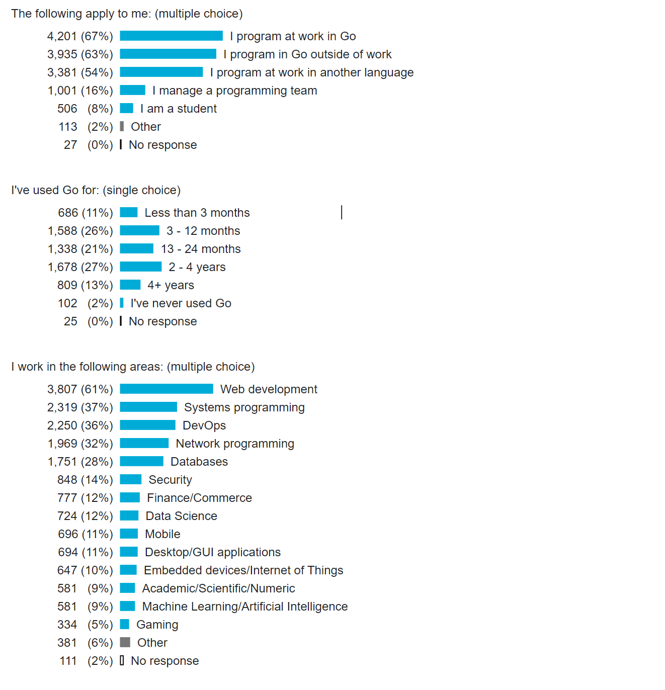
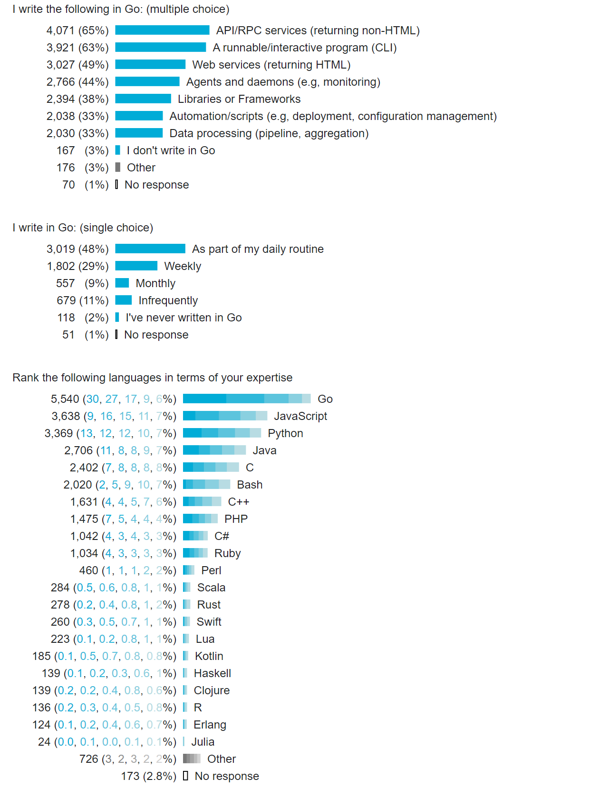
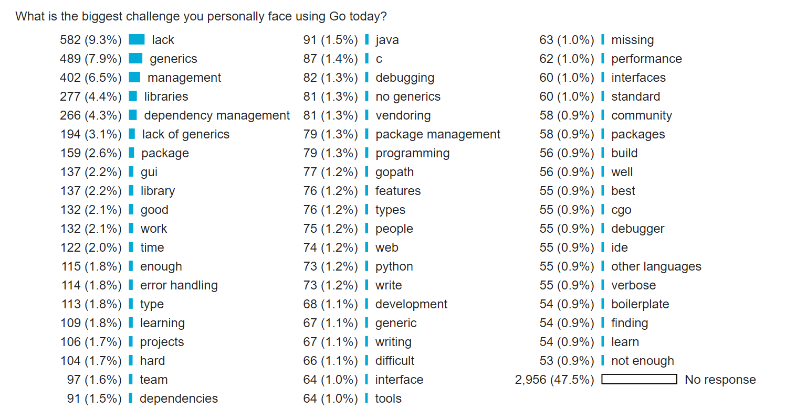

+++
title = "2017年 go 调查结果"
weight = 7
date = 2023-05-18T17:03:08+08:00
description = ""
isCJKLanguage = true
draft = false
+++

# Go 2017 Survey Results - 2017年 go 调查结果

https://go.dev/blog/survey2017-results

Steve Francia
26 February 2018

## Thank you 谢谢你

This post summarizes the result of our 2017 user survey along with commentary and insights. It also draws key comparisons between the results of the 2016 and 2017 survey.

这篇文章总结了我们2017年用户调查的结果，以及评论和见解。它还对2016年和2017年的调查结果进行了关键的比较。

This year we had 6,173 survey respondents, 70% more than the 3,595 we had in the [Go 2016 User Survey](https://blog.golang.org/survey2016-results). In addition, it also had a slightly higher completion rate (84% → 87%) and a higher response rate to most of the questions. We believe that survey length is the main cause of this improvement as the 2017 survey was shortened in response to feedback that the 2016 survey was too long.

今年我们有6173名调查对象，比去2016年用户调查中的3595人多了70%。此外，它的完成率也略高（84% → 87%），对大多数问题的答复率也更高。我们认为，调查长度是这一改进的主要原因，因为2017年的调查是针对2016年调查过长的反馈而缩短的。

We are grateful to everyone who provided their feedback through the survey to help shape the future of Go.

我们感谢每个通过调查提供反馈的人，以帮助塑造Go的未来。

## Programming background 编程背景

For the first time, more survey respondents say they are paid to write Go than say they write it outside work. This indicates a significant shift in Go’s user base and in its acceptance by companies for professional software development.

第一次，有更多的调查对象说他们写Go是有报酬的，而不是说他们在工作之外写Go。这表明Go的用户群以及公司对其专业软件开发的接受程度发生了重大转变。

The areas people who responded to the survey work in is mostly consistent with last year, however, mobile and desktop applications have fallen significantly.

回复调查的人所从事的领域与去年基本一致，然而，移动和桌面应用却明显下降了。

Another important shift: the #1 use of Go is now writing API/RPC services (65%, up 5% over 2016), taking over the top spot from writing CLI tools in Go (63%). Both take full advantage of Go’s distinguishing features and are key elements of modern cloud computing. As more companies adopt Go, we expect these two uses of Go to continue to thrive.

另一个重要的转变是：现在Go的第一大用途是编写API/RPC服务（65%，比2016年增长5%），取代了用Go编写CLI工具（63%）的位置。两者都充分利用了Go的突出特点，是现代云计算的关键因素。随着越来越多的公司采用Go，我们预计Go的这两种用途将继续蓬勃发展。

Most of the metrics reaffirm things we have learned in prior years. Go programmers still overwhelmingly prefer Go. As more time passes Go users are deepening their experience in Go. While Go has increased its lead among Go developers, the order of language rankings remains quite consistent with last year.

大多数指标都重申了我们在前几年学到的东西。Go程序员仍然压倒性地喜欢Go。随着时间的推移，Go用户正在加深对Go的体验。虽然Go在Go开发者中的领先优势有所增加，但语言排名的顺序仍与去年相当一致。

## Go usage Go的使用情况

In nearly every question around the usage and perception of Go, Go has demonstrated improvement over our prior survey. Users are happier using Go, and a greater percentage prefer using Go for their next project.

在几乎所有围绕Go的使用和认知的问题上，Go都比我们之前的调查显示出了进步。用户在使用Go时更加开心，更多的人喜欢在他们的下一个项目中使用Go。

When asked about the biggest challenges to their own personal use of Go, users clearly conveyed that lack of dependency management and lack of generics were their two biggest issues, consistent with 2016. In 2017 we laid a foundation to be able to address these issues. We improved our proposal and development process with the addition of [Experience Reports](https://go.dev/wiki/ExperienceReports) which is enabling the project to gather and obtain feedback critical to making these significant changes. We also made [significant changes](https://go.dev/doc/go1.10#build) under the hood in how Go obtains, and builds packages. This is foundational work essential to addressing our dependency management needs.

当被问及自己个人使用Go的最大挑战时，用户明确表示，缺乏依赖性管理和缺乏泛型是他们最大的两个问题，与2016年一致。2017年，我们为能够解决这些问题奠定了基础。我们改进了我们的建议和开发流程，增加了经验报告，使项目能够收集和获得对做出这些重大改变至关重要的反馈。我们还对Go的获取和构建包的方式进行了重大改变。这是解决我们依赖性管理需求的基础性工作。

These two issues will continue to be a major focus of the project through 2018.

这两个问题将在2018年继续成为项目的主要焦点。

In this section we asked two new questions. Both center around what developers are doing with Go in a more granular way than we’ve previously asked. We hope this data will provide insights for the Go project and ecosystem.

在这一部分，我们提出了两个新问题。这两个问题都是围绕着开发者在使用Go的过程中所做的事情，比我们之前的问题更加细化。我们希望这些数据能够为Go项目和生态系统提供洞察力。

Since last year there has been an increase of the percentage of people who identified “Go lacks critical features” as the reason they don’t use Go more and a decreased percentage who identified “Go not being an appropriate fit”. Other than these changes, the list remains consistent with last year.

自去年以来，认为 "Go缺乏关键功能 "是他们不更多使用Go的原因的人的比例有所增加，而认为 "Go不适合 "的比例则有所下降。除了这些变化之外，名单与去年保持一致。

*Reading the data*: This question asked how strongly the respondent agreed or disagreed with the statement. The responses for each statement are displayed as sections of a single bar, from “strongly disagree” in deep red on the left end to “strongly agree” in deep blue on the right end. The bars use the same scale as the rest of the graphs, so they can (and do, especially later in the survey) vary in overall length due to lack of responses.

阅读数据。这个问题问的是受访者对陈述的同意或不同意程度。对每个陈述的回答都以单条的形式显示，从左端深红色的 "非常不同意 "到右端深蓝色的 "非常同意"。条形图使用与其他图表相同的比例，因此它们可以（而且确实如此，特别是在调查的后期）由于缺乏回应而在整体长度上有所变化。

The ratio after the text compares the number of respondents who agreed (including “somewhat agree” and “strongly agree”) to those who disagreed (including “somewhat disagree” and “strongly disagree”). For example, the ratio of respondents agreeing that they would recommend Go to respondents disagreeing was 19 to 1. The second ratio (within the brackets) is simply a weighted ratio with each somewhat = 1, agree/disagree = 2, and strongly = 4.

文字后面的比率比较了同意（包括 "有点同意 "和 "非常同意"）的受访者与不同意（包括 "有点不同意 "和 "非常不同意"）的受访者的人数。例如，同意推荐Go的受访者与不同意的受访者的比例是19比1。第二个比例（在括号内）只是一个加权的比例，每个有点=1，同意/不同意=2，强烈=4。

*Reading the data*: This question asked for write-in responses. The bars above show the fraction of surveys mentioning common words or phrases. Only words or phrases that appeared in 20 or more surveys are listed, and meaningless common words or phrases like “the” or “to be” are omitted. The displayed results do overlap: for example, the 402 responses that mentioned “management” do include the 266 listed separately that mentioned “dependency management” and the 79 listed separately that mentioned “package management.”

阅读数据。这个问题要求写上答案。上面的条形图显示了调查中提到常见词汇或短语的比例。只列出了在20份或更多调查中出现的单词或短语，并省略了 "the "或 "to be "等无意义的常用单词或短语。显示的结果确实有重叠：例如，提到 "管理 "的402份答复确实包括单独列出的提到 "依赖性管理 "的266份和单独列出的提到 "包管理 "的79份。

However, nearly or completely redundant shorter entries are omitted: there are not twenty or more surveys that listed “dependency” without mentioning “dependency management,” so there is no separate entry for “dependency.”

然而，几乎或完全多余的较短条目被省略了：没有20个或更多的调查列出了 "依赖性 "而没有提到 "依赖性管理"，所以没有 "依赖性 "的单独条目。

## Development and deployment 开发和部署

We asked programmers which operating systems they develop Go on; the ratios of their responses remain consistent with last year. 64% of respondents say they use Linux, 49% use MacOS, and 18% use Windows, with multiple choices allowed.

我们问程序员他们在哪些操作系统上开发Go；他们的回答比例与去年保持一致。64%的受访者说他们使用Linux，49%使用MacOS，18%使用Windows，允许多选。

Continuing its explosive growth, VSCode is now the most popular editor among Gophers. IntelliJ/GoLand also saw significant increase in usage. These largely came at the expense of Atom and Sublime Text which saw relative usage drops. This question had a 6% higher response rate from last year.

VSCode继续其爆炸性增长，现在是Gophers中最受欢迎的编辑器。IntelliJ/GoLand的使用率也有明显的增长。这些主要是以Atom和Sublime Text为代价的，它们的使用率相对下降了。这个问题的回答率比去年高6%。

Survey respondents demonstrated significantly higher satisfaction with Go support in their editors over 2016 with the ratio of satisfied to dissatisfied doubling (9:1 → 18:1). Thank you to everyone who worked on Go editor support for all your hard work.

调查对象对他们的编辑器中的Go支持的满意度比2016年明显提高，满意和不满意的比例翻了一番（9:1 → 18:1）。感谢每一位从事Go编辑器支持工作的人，感谢你们的辛勤工作。

Go deployment is roughly evenly split between privately managed servers and hosted cloud servers. For Go applications, Google Cloud services saw significant increase over 2016. For Non-Go applications, AWS Lambda saw the largest increase in use.

Go的部署在私人管理的服务器和托管的云服务器之间大致上是平均分配的。对于Go应用，谷歌云服务比2016年有明显增长。对于非Go应用，AWS Lambda的使用量增幅最大。

## Working Effectively 有效地工作

We asked how strongly people agreed or disagreed with various statements about Go. All questions are repeated from last year with the addition of one new question which we introduced to add further clarification around how users are able to both find and **use** Go libraries.

我们询问了人们对有关Go的各种说法的同意或不同意程度。所有问题都与去年相同，但增加了一个新问题，我们引入这个问题是为了进一步澄清用户如何找到和使用Go库。

All responses either indicated a small improvement or are comparable to 2016.

所有的回答都表明有小幅改善，或者与2016年相当。

As in 2016, the most commonly requested missing library for Go is one for writing GUIs though the demand is not as pronounced as last year. No other missing library registered a significant number of responses.

和2016年一样，Go最常要求的缺失库是用于编写GUI的库，尽管需求没有去年那么明显。没有其他缺失的库得到大量的回应。

The primary sources for finding answers to Go questions are the Go web site, Stack Overflow, and reading source code directly. Stack Overflow showed a small increase from usage over last year.

寻找Go问题答案的主要来源是Go网站、Stack Overflow和直接阅读源代码。Stack Overflow的使用率比去年有小幅上升。

The primary sources for Go news are still the Go blog, Reddit’s /r/golang and Twitter; like last year, there may be some bias here since these are also how the survey was announced.

Go新闻的主要来源仍然是Go博客、Reddit的/r/golang和Twitter；和去年一样，这里可能有一些偏见，因为这些也是调查的公布方式。

## The Go Project - Go项目

59% of respondents expressed interest in contributing in some way to the Go community and projects, up from 55% last year. Respondents also indicated that they felt much more welcome to contribute than in 2016. Unfortunately, respondents indicated only a very tiny improvement in understanding how to contribute. We will be actively working with the community and its leaders to make this a more accessible process.

59%的受访者表示有兴趣以某种方式为Go社区和项目做出贡献，比去年的55%有所提高。受访者还表示，与2016年相比，他们觉得自己的贡献更受欢迎。不幸的是，受访者表示在了解如何贡献方面只有非常微小的进步。我们将与社区及其领导人积极合作，使之成为一个更容易理解的过程。

Respondents showed an increase in agreement that they are confident in the leadership of the Go project (9:1 → 11:1). They also showed a small increase in agreement that the project leadership understands their needs (2.6:1 → 2.8:1) and in agreement that they feel comfortable approaching project leadership with questions and feedback (2.2:1 → 2.4:1). While improvements were made, this continues to be an area of focus for the project and its leadership going forward. We will continue to work to improve our understanding of user needs and approachability.

受访者对他们对Go项目的领导有信心的认同度有所提高（9:1 → 11:1）。他们对项目领导层了解他们的需求（2.6:1 → 2.8:1）的认同度也有小幅提高，他们对向项目领导层提出问题和反馈感到自如（2.2:1 → 2.4:1）。虽然取得了改善，但这仍然是项目及其领导层未来的一个重点领域。我们将继续努力提高我们对用户需求和可接近性的理解。

We tried some [new ways](https://blog.golang.org/8years#TOC_1.3.) to engage with users in 2017 and while progress was made, we are still working on making these solutions scalable for our growing community.

我们在2017年尝试了一些与用户接触的新方法，虽然取得了进展，但我们仍在努力使这些解决方案对我们不断增长的社区具有可扩展性。

## Community 社区

At the end of the survey, we asked some demographic questions.

在调查的最后，我们问了一些人口统计学问题。

The country distribution of responses is largely similar to last year with minor fluctuations. Like last year, the distribution of countries is similar to the visits to golang.org, though some Asian countries remain under-represented in the survey.

答复的国家分布与去年基本相似，有轻微的波动。与去年一样，国家的分布与golang.org的访问量相似，尽管一些亚洲国家在调查中的代表性仍然不足。

Perhaps the most significant improvement over 2016 came from the question which asked to what degree do respondents agreed with the statement, “I feel welcome in the Go community”. Last year the agreement to disagreement ratio was 15:1. In 2017 this ratio nearly doubled to 25:1.

与2016年相比，最显著的改进可能来自于这个问题，它问受访者在多大程度上同意 "我觉得自己在Go社区受到欢迎 "的说法。去年，同意与不同意的比例是15:1。在2017年，这个比例几乎翻了一番，达到25:1。

An important part of a community is making everyone feel welcome, especially people from under-represented demographics. We asked an optional question about identification across a few underrepresented groups. We had a 4% increase in response rate over last year. The percentage of each underrepresented group increased over 2016, some quite significantly.

社区的一个重要部分是让每个人都感到受欢迎，特别是来自代表性不足的人口群体的人。我们在几个代表性不足的群体中提出了一个关于身份认同的可选问题。我们的答复率比去年增加了4%。每个代表性不足的群体的比例都比2016年有所增加，有些还相当明显。

Like last year, we took the results of the statement “I feel welcome in the Go community” and broke them down by responses to the various underrepresented categories. Like the whole, most of the respondents who identified as underrepresented also felt significantly more welcome in the Go community than in 2016. Respondents who identified as a woman showed the most significant improvement with an increase of over 400% in the ratio of agree:disagree to this statement (3:1 → 13:1). People who identified as ethnically or racially underrepresented had an increase of over 250% (7:1 → 18:1). Like last year, those who identified as not underrepresented still had a much higher percentage of agreement to this statement than those identifying from underrepresented groups.

和去年一样，我们把 "我觉得自己在Go界很受欢迎 "这一陈述的结果，按照对各种代表性不足的类别的回答进行了细分。与整体一样，大多数认定为代表不足的受访者也觉得自己在Go界明显比2016年更受欢迎。被认定为女性的受访者表现出最明显的改善，对这句话的同意：不同意的比例增加了400%以上（3：1→13：1）。被认定为民族或种族代表不足的人增加了250%以上（7：1 → 18：1）。与去年一样，那些被认定为没有代表权的人对这一声明的同意率仍然比那些被认定为代表权不足的人高得多。

We are encouraged by this progress and hope that the momentum continues.

我们对这一进展感到鼓舞，并希望这一势头能够继续下去。

The final question on the survey was just for fun: what’s your favorite Go keyword? Perhaps unsurprisingly, the most popular response was `go`, followed by `defer`, `func`, `interface`, and `select`, unchanged from last year.

调查的最后一个问题只是为了好玩：你最喜欢的Go关键词是什么？也许不出意料，最受欢迎的回答是go，其次是defer、func、interface和select，与去年相比没有变化。

Finally, on behalf of the entire Go project, we are grateful for everyone who has contributed to our project, whether by being a part of our great community, by taking this survey or by taking an interest in Go.

最后，我们代表整个Go项目，感谢每一个为我们的项目做出贡献的人，无论是成为我们伟大社区的一员，还是参加这次调查，或者对Go感兴趣。
