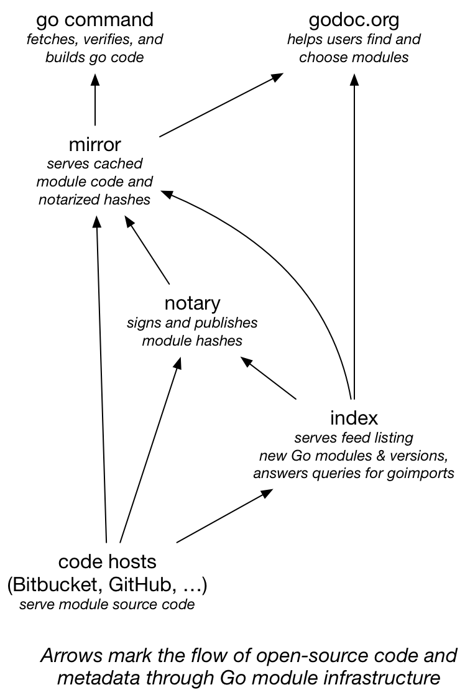

+++
title = "2019年的 go 模块"
weight = 1
date = 2023-05-18T17:03:08+08:00
description = ""
isCJKLanguage = true
draft = false
+++

# Go Modules in 2019 - 2019年的 go 模块

https://go.dev/blog/modules2019

Russ Cox
19 December 2018

## What a year! 多么美好的一年啊

2018 was a great year for the Go ecosystem, with package management as one of our major focuses. In February, we started a community-wide discussion about how to integrate package management directly into the Go toolchain, and in August we delivered the first rough implementation of that feature, called Go modules, in Go 1.11. The migration to Go modules will be the most far-reaching change for the Go ecosystem since Go 1. Converting the entire ecosystem—code, users, tools, and so on—from GOPATH to modules will require work in many different areas. The module system will in turn help us deliver better authentication and build speeds to the Go ecosystem.

2018年对于Go生态系统来说是伟大的一年，包管理是我们的主要焦点之一。2月，我们在社区范围内开始讨论如何将包管理直接集成到Go工具链中，8月，我们在Go 1.11中交付了该功能的第一个粗略实现，称为Go模块。迁移到Go模块将是Go 1以来对Go生态系统影响最深远的变化。将整个生态系统--代码、用户、工具等从GOPATH转换到模块，需要在许多不同领域开展工作。模块系统将反过来帮助我们为Go生态系统提供更好的认证和构建速度。

This post is a preview of what the Go team is planning relating to modules in 2019.

这篇文章是对Go团队在2019年与模块有关的计划的预览。

## Releases 发布内容

Go 1.11, released in August 2018, introduced [preliminary support for modules](https://go.dev/doc/go1.11#modules). For now, module support is maintained alongside the traditional GOPATH-based mechanisms. The `go` command defaults to module mode when run in directory trees outside GOPATH/src and marked by `go.mod` files in their roots. This setting can be overridden by setting the transitional environment variable `$GO111MODULE` to `on` or `off`; the default behavior is `auto` mode. We’ve already seen significant adoption of modules across the Go community, along with many helpful suggestions and bug reports to help us improve modules.

2018年8月发布的Go 1.11，引入了对模块的初步支持。目前，模块支持与传统的基于GOPATH的机制一起被维持。当在GOPATH/src之外的目录树中运行并在其根部由go.mod文件标记时，go命令默认为模块模式。这个设置可以通过设置过渡性环境变量$GO111MODULE为on或off来覆盖；默认行为是自动模式。我们已经看到整个Go社区对模块的大量采用，还有许多有用的建议和错误报告，帮助我们改进模块。

Go 1.12, scheduled for February 2019, will refine module support but still leave it in `auto` mode by default. In addition to many bug fixes and other minor improvements, perhaps the most significant change in Go 1.12 is that commands like `go` `run` `x.go` or `go` `get` `rsc.io/2fa@v1.1.0` can now operate in `GO111MODULE=on` mode without an explicit `go.mod` file.

计划于2019年2月发布的Go 1.12将完善对模块的支持，但默认情况下仍将其置于自动模式。除了许多bug修复和其他小的改进之外，Go 1.12中最重要的变化可能是，像go run x.go或go get rsc.io/2fa@v1.1.0这样的命令现在可以在GO111MODULE=on模式下操作，而不需要明确的go.mod文件。

Our aim is for Go 1.13, scheduled for August 2019, to enable module mode by default (that is, to change the default from `auto` to `on`) and deprecate GOPATH mode. In order to do that, we’ve been working on better tooling support along with better support for the open-source module ecosystem.

我们的目标是在计划于2019年8月发布的Go 1.13中，默认启用模块模式（也就是说，将默认值从自动改为开启）并废除GOPATH模式。为了做到这一点，我们一直在努力提供更好的工具支持，以及对开源模块生态系统的更好支持。

## Tooling & IDE Integration 工具和IDE集成

In the eight years that we’ve had GOPATH, an incredible amount of tooling has been created that assumes Go source code is stored in GOPATH. Moving to modules requires updating all code that makes that assumption. We’ve designed a new package, [golang.org/x/tools/go/packages](https://godoc.org/golang.org/x/tools/go/packages), that abstracts the operation of finding and loading information about the Go source code for a given target. This new package adapts automatically to both GOPATH and modules mode and is also extensible to tool-specific code layouts, such as the one used by Bazel. We’ve been working with tool authors throughout the Go community to help them adopt golang.org/x/tools/go/packages in their tools.

在我们拥有GOPATH的八年时间里，已经创建了大量的工具，这些工具假定Go源代码存储在GOPATH中。迁移到模块需要更新所有做出这种假设的代码。我们设计了一个新的包，golang.org/x/tools/go/packages，它对寻找和加载特定目标的 Go 源代码信息的操作进行了抽象。这个新包可以自动适应GOPATH和模块模式，也可以扩展到特定工具的代码布局，如Bazel使用的布局。我们一直在与Go社区的工具作者合作，帮助他们在其工具中采用golang.org/x/tools/go/packages。

As part of this effort, we’ve also been working to unify the various source code querying tools like gocode, godef, and go-outline into a single tool that can be used from the command line and also supports the [language server protocol](https://langserver.org/) used by modern IDEs.

作为这项工作的一部分，我们也一直在努力将各种源代码查询工具，如gocode、godef和go-outline，统一为一个可以从命令行使用的工具，同时也支持现代IDE使用的语言服务器协议。

The transition to modules and the changes in package loading also prompted a significant change to Go program analysis. As part of reworking `go` `vet` to support modules, we introduced a generalized framework for incremental analysis of Go programs, in which an analyzer is invoked for one package at a time. In this framework, the analysis of one package can write out facts made available to analyses of other packages that import the first. For example, `go` `vet`’s analysis of the [log package](https://go.dev/pkg/log/) determines and records the fact that `log.Printf` is a `fmt.Printf` wrapper. Then `go` `vet` can check printf-style format strings in other packages that call `log.Printf`. This framework should enable many new, sophisticated program analysis tools to help developers find bugs earlier and understand code better.

向模块的过渡和软件包加载的变化也促使Go程序分析发生了重大变化。作为重塑go vet以支持模块的一部分，我们引入了一个对Go程序进行增量分析的通用框架，在这个框架中，分析器被一次调用一个包。在这个框架中，一个包的分析可以写出事实，供导入第一个包的其他包的分析使用。例如，go vet对log包的分析确定并记录了log.Printf是fmt.Printf的封装器这一事实。然后，go vet可以在其他调用log.Printf的包中检查printf风格的格式字符串。这个框架应该能够实现许多新的、复杂的程序分析工具，以帮助开发者更早地发现错误并更好地理解代码。

## Module Index 模块索引

One of the most important parts of the original design for `go` `get` was that it was *decentralized*: we believed then—and we still believe today—that anyone should be able to publish their code on any server, in contrast to central registries such as Perl’s CPAN, Java’s Maven, or Node’s NPM. Placing domain names at the start of the `go` `get` import space reused an existing decentralized system and avoided needing to solve anew the problems of deciding who can use which names. It also allowed companies to import code on private servers alongside code from public servers. It is critical to preserve this decentralization as we shift to Go modules.

go get最初设计中最重要的部分之一是它是去中心化的：我们当时认为--我们现在仍然认为--任何人都应该能够在任何服务器上发布他们的代码，与Perl的CPAN、Java的Maven或Node的NPM等中心注册机构形成鲜明对比。将域名放在 "导入空间 "的开头，重新利用了现有的分散系统，避免了需要重新解决决定谁可以使用哪些名字的问题。它还允许公司将私人服务器上的代码与公共服务器上的代码一起导入。在我们转向Go模块的过程中，保留这种分散性是至关重要的。

Decentralization of Go’s dependencies has had many benefits, but it also brought a few significant drawbacks. The first is that it’s too hard to find all the publicly-available Go packages. Every site that wants to deliver information about packages has to do its own crawling, or else wait until a user asks about a particular package before fetching it.

Go的依赖关系的分散化有很多好处，但也带来了一些明显的缺点。首先是要找到所有公开可用的Go软件包太难了。每一个想要提供软件包信息的网站都必须自己爬行，否则就得等到用户问起某个特定的软件包时再去获取它。

We are working on a new service, the Go Module Index, that will provide a public log of packages entering the Go ecosystem. Sites like godoc.org and goreportcard.com will be able to watch this log for new entries instead of each independently implementing code to find new packages. We also want the service to allow looking up packages using simple queries, to allow `goimports` to add imports for packages that have not yet been downloaded to the local system.

我们正在开发一项新的服务，即Go模块索引，它将提供一个进入Go生态系统的软件包的公共日志。像godoc.org和goreportcard.com这样的网站将能够观察这个日志中的新条目，而不是各自独立实现代码来寻找新的包。我们还希望该服务能够允许使用简单的查询来查找软件包，以使goimports能够为尚未下载到本地系统的软件包添加导入。

## Module Authentication 模块认证

Today, `go` `get` relies on connection-level authentication (HTTPS or SSH) to check that it is talking to the right server to download code. There is no additional check of the code itself, leaving open the possibility of man-in-the-middle attacks if the HTTPS or SSH mechanisms are compromised in some way. Decentralization means that the code for a build is fetched from many different servers, which means the build depends on many systems to serve correct code.

今天，go get依靠连接级认证（HTTPS或SSH）来检查它是否与正确的服务器对话以下载代码。对代码本身没有额外的检查，如果HTTPS或SSH机制以某种方式被破坏，就有可能出现中间人攻击。分散化意味着构建的代码是从许多不同的服务器中获取的，这意味着构建依赖于许多系统来提供正确的代码。

The Go modules design improves code authentication by storing a `go.sum` file in each module; that file lists the cryptographic hash of the expected file tree for each of the module’s dependencies. When using modules, the `go` command uses `go.sum` to verify that dependencies are bit-for-bit identical to the expected versions before using them in a build. But the `go.sum` file only lists hashes for the specific dependencies used by that module. If you are adding a new dependency or updating dependencies with `go` `get` `-u`, there is no corresponding entry in `go.sum` and therefore no direct authentication of the downloaded bits.

Go模块的设计通过在每个模块中存储一个go.sum文件来改善代码验证；该文件列出了该模块每个依赖项的预期文件树的加密哈希值。当使用模块时，go命令使用go.sum来验证依赖项在构建中使用前是否与预期的版本逐位相同。但go.sum文件只列出了该模块所使用的特定依赖关系的哈希值。如果你要添加一个新的依赖，或者用 go get -u 来更新依赖，在 go.sum 中没有相应的条目，因此无法直接验证下载的比特。

For publicly-available modules, we intend to run a service we call a *notary* that follows the module index log, downloads new modules, and cryptographically signs statements of the form “module M at version V has file tree hash H.” The notary service will publish all these notarized hashes in a queryable, [Certificate Transparency](https://www.certificate-transparency.org/)-style [tamper-proof log](http://static.usenix.org/event/sec09/tech/full_papers/crosby.pdf), so that anyone can verify that the notary is behaving correctly. This log will serve as a public, global `go.sum` file that `go` `get` can use to authenticate modules when adding or updating dependencies.

对于公开的模块，我们打算运行一个我们称之为公证的服务，它跟踪模块索引日志，下载新的模块，并对 "模块M在版本V有文件树H "这样的语句进行加密签名。公证服务将把所有这些经过公证的哈希值公布在一个可查询的、透明证书式的防篡改日志中，这样任何人都可以验证公证员的行为是否正确。这个日志将作为一个公共的、全局的go.sum文件，go get可以在添加或更新依赖关系时用来验证模块。

We are aiming to have the `go` command check notarized hashes for publicly-available modules not already in `go.sum` starting in Go 1.13.

我们的目标是，从Go 1.13开始，让go命令检查尚未在go.sum中的公开可用模块的公证散列。

## Module Mirrors 模块镜像

Because the decentralized `go` `get` fetches code from multiple origin servers, fetching code is only as fast and reliable as the slowest, least reliable server. The only defense available before modules was to vendor dependencies into your own repositories. While vendoring will continue to be supported, we’d prefer a solution that works for all modules—not just the ones you’re already using—and that does not require duplicating a dependency into every repository that uses it.

由于分散的go get从多个源服务器获取代码，获取代码的速度和可靠性只能与最慢、最不可靠的服务器一样。在模块之前，唯一可用的防御措施是把依赖关系卖给自己的仓库。虽然我们会继续支持销售，但我们更倾向于一个对所有模块都有效的解决方案，而不仅仅是你已经在使用的模块，而且不需要将一个依赖关系复制到每个使用它的仓库。

The Go module design introduces the idea of a module proxy, which is a server that the `go` command asks for modules, instead of the origin servers. One important kind of proxy is a *module mirror*, which answers requests for modules by fetching them from origin servers and then caching them for use in future requests. A well-run mirror should be fast and reliable even when some origin servers have gone down. We are planning to launch a mirror service for publicly-available modules in 2019. Other projects, like GoCenter and Athens, are planning mirror services too. (We anticipate that companies will have multiple options for running their own internal mirrors as well, but this post is focusing on public mirrors.)

Go的模块设计引入了模块代理的概念，即Go命令向其询问模块的服务器，而不是原生服务器。一种重要的代理是模块镜像，它通过从源服务器获取模块，然后将其缓存起来供以后的请求使用。一个运行良好的镜像应该是快速和可靠的，即使一些原点服务器已经关闭。我们计划在2019年为公开可用的模块推出一个镜像服务。其他项目，如GoCenter和Athens，也在计划镜像服务。(我们预计公司也会有多种选择来运行他们自己的内部镜像，但这篇文章的重点是公共镜像。)

One potential problem with mirrors is that they are precisely man-in-the-middle servers, making them a natural target for attacks. Go developers need some assurance that the mirrors are providing the same bits that the origin servers would. The notary process we described in the previous section addresses exactly this concern, and it will apply to downloads using mirrors as well as downloads using origin servers. The mirrors themselves need not be trusted.

镜像的一个潜在问题是，它们恰恰是中间人服务器，使它们成为攻击的自然目标。Go开发者需要一些保证，以确保镜像提供与源服务器相同的比特。我们在上一节描述的公证过程正是为了解决这个问题，它将适用于使用镜像的下载和使用原点服务器的下载。镜像本身不需要被信任。

We are aiming to have the Google-run module mirror ready to be used by default in the `go` command starting in Go 1.13. Using an alternate mirror, or no mirror at all, will be trivial to configure.

我们的目标是让谷歌运行的镜像模块从Go 1.13开始默认用于go命令中。使用另一个镜像，或者根本没有镜像，都是很容易配置的。

## Module Discovery 模块发现

Finally, we mentioned earlier that the module index will make it easier to build sites like godoc.org. Part of our work in 2019 will be a major revamp of godoc.org to make it more useful for developers who need to discover available modules and then decide whether to rely on a given module or not.

最后，我们在前面提到，模块索引将使建立像godoc.org这样的网站更加容易。我们在2019年的部分工作将是对godoc.org进行重大改造，使其对需要发现可用模块的开发者更有用，然后决定是否依赖某个特定的模块。

## Big Picture 大图片

This diagram shows how module source code moves through the design in this post.

这张图显示了模块源代码是如何在本帖的设计中移动的。

Before, all consumers of Go source code—the `go` command and any sites like godoc.org—fetched code directly from each code host. Now they can fetch cached code from a fast, reliable mirror, while still authenticating that the downloaded bits are correct. And the index service makes it easy for mirrors, godoc.org, and any other similar sites to keep up with all the great new code being added to the Go ecosystem every day.

以前，所有Go源代码的消费者--go命令和任何像godoc.org这样的网站--都是直接从每个代码主机获取代码。现在，他们可以从一个快速、可靠的镜像中获取缓存的代码，同时还可以验证下载的比特是否正确。索引服务使镜像、godoc.org和任何其他类似的网站能够轻松地跟上每天被添加到Go生态系统中的所有伟大的新代码。

We’re excited about the future of Go modules in 2019, and we hope you are too. Happy New Year!

我们对2019年Go模块的未来感到兴奋，我们希望你也是如此。新年快乐!
