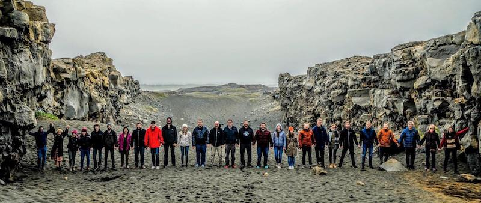
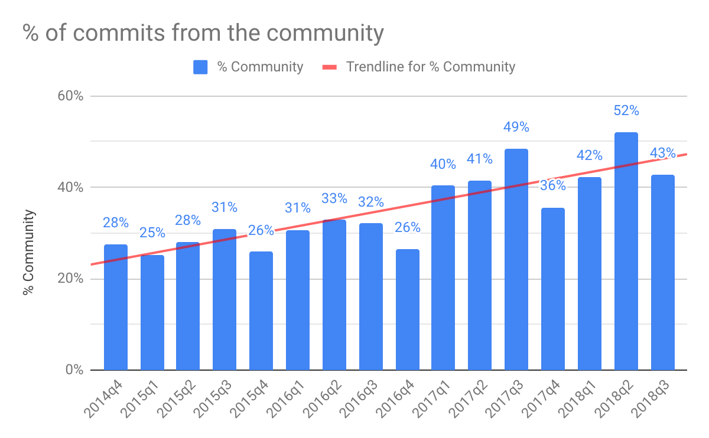

+++
title = "go 9 岁了"
weight = 3
date = 2023-05-18T17:03:08+08:00
description = ""
isCJKLanguage = true
draft = false
+++

# Nine years of Go - go 9 岁了

https://go.dev/blog/9years

Steve Francia
10 November 2018

## Introduction 简介

Today marks the ninth anniversary of the day we open-sourced our initial sketch of Go. On each anniversary we like to take time to reflect on what has happened over the past year. The past 12 months have been a breakout year for the Go language and community.

今天是我们开源Go的最初草图的九周年。在每一个周年纪念日，我们都喜欢花时间来反思过去一年所发生的事情。过去的12个月是Go语言和社区爆发的一年。

## Go Love & Adoption Go之爱与采用

Thanks to all of you, 2018 was an amazing year for Go! In multiple industry surveys Gophers expressed how happy they were using Go, and many non-Go developers indicated they intended to learn Go before any other language.

感谢大家，2018年对Go来说是了不起的一年! 在多个行业调查中，Gophers表示他们对使用Go非常满意，许多非Go开发人员表示他们打算在任何其他语言之前学习Go。

In [Stack Overflow’s 2018 Developer Survey](https://insights.stackoverflow.com/survey/2018#most-loved-dreaded-and-wanted), Go retained its coveted spot in both the top 5 most loved and top 5 most wanted languages. People who use Go love it, and people who aren’t using Go want to.

在Stack Overflow的2018年开发者调查中，Go在最受喜爱的前5名和最受欢迎的前5名语言中都保留了其令人羡慕的位置。使用Go的人喜欢它，而没有使用Go的人也想使用。

In [ActiveState’s 2018 Developer Survey](https://www.activestate.com/developer-survey-2018-open-source-runtime-pains), Go topped the charts with 36% of users responding they were “Extremely Satisfied” using Go and 61% responding “Very Satisfied” or better.

在ActiveState的2018年开发者调查中，Go位居榜首，36%的用户回答他们对Go的使用 "极其满意"，61%的用户回答 "非常满意 "或更好。

[JetBrains’s 2018 Developer Survey](https://www.jetbrains.com/research/devecosystem-2018/) awarded Go the “Most promising language” with 12% of respondents using Go today and 16% intending to use Go in the future.

JetBrains的2018年开发者调查将Go评为 "最有前途的语言"，12%的受访者现在使用Go，16%的人打算在未来使用Go。

In [HackerRank’s 2018 Developer Survey](https://research.hackerrank.com/developer-skills/2018/), 38% of developers responded that they were intending to learn Go next.

在HackerRank的2018年开发者调查中，38%的开发者回答说他们接下来打算学习Go。

We are excited about all of our new gophers and actively working to improve our educational and community resources.

我们对所有的新gophers感到兴奋，并积极致力于改善我们的教育和社区资源。

## Go Community - Go 社区

It’s hard to believe that it’s only been five years since the first Go conferences and Go meetups. We’ve seen major growth in this area of community leadership over the last year. There are now over 20 [Go conferences](https://github.com/golang/go/wiki/Conferences) and over 300 [Go-related meetups](https://www.meetup.com/topics/golang/) spanning the globe.

很难相信，从第一次Go会议和Go聚会到现在只有五年的时间。在过去的一年里，我们看到了社区领导力在这个领域的重大发展。现在有超过20个Go会议和超过300个与Go有关的聚会，遍布全球。

Thanks to the hard work put into these many conferences and meetups, there have been hundreds of great talks this year. Here are a few of our favorite talks specifically discussing the growth of our community and how we can better support gophers worldwide.

得益于这些会议和聚会的辛勤工作，今年有数百场精彩的会谈。以下是我们最喜欢的几个会谈，专门讨论了我们社区的发展以及我们如何更好地支持世界各地的gophers。

- [Writing Accessible Go](https://www.youtube.com/watch?v=cVaDY0ChvOQ), by Julia Ferraioli at GopherCon 编写无障碍Go，Julia Ferraioli在GopherCon上的演讲。
- [The Importance of Beginners](https://www.youtube.com/watch?v=7yMXs9TRvVI), by Natalie Pistunovich at GopherCon 初学者的重要性，由Natalie Pistunovich在GopherCon上发表。
- [The Legacy of Go, Part 2](https://www.youtube.com/watch?v=I_KcpgxcFyU), by Carmen Andoh at GothamGo Go的遗产，第二部分，作者：Carmen Andoh at GothamGo
- [Growing a Community of Gophers](https://www.youtube.com/watch?v=dl1mCGKwlYY), by Cassandra Salisbury at Gopherpalooza 壮大gophers社区，作者：Cassandra Salisbury（Gopherpalooza）。

On that theme, this year we also [revised our code of conduct](https://blog.golang.org/conduct-2018) to better support inclusivity in the Go community.

关于这个主题，今年我们还修订了我们的行为准则，以更好地支持Go社区的包容性。

The Go community is truly global. At GopherCon Europe in Iceland this past summer, gophers literally spanned the gap between the continents.

Go社区是真正的全球化。在去年夏天在冰岛举行的GopherCon欧洲大会上，gophers实际上跨越了各大洲之间的差距。

*(Photo by Winter Francia.)*

(照片由Winter Francia拍摄)。

## Go 2

After five years of experience with Go 1, we’ve started looking at what we should change about Go to better support [programming at scale](https://go.dev/talks/2012/splash.article).

在经历了五年的Go 1之后，我们已经开始研究我们应该对Go做哪些改变，以更好地支持大规模编程。

Last spring, we published a [draft design for Go modules](https://blog.golang.org/versioning-proposal), which provide an integrated mechanism for versioning and package distribution. The most recent Go release, Go 1.11, included [preliminary support for modules](https://go.dev/doc/go1.11#modules).

去年春天，我们发布了Go模块的设计草案，它为版本和包的分发提供了一个综合机制。最近的Go版本，Go 1.11，包括了对模块的初步支持。

Last summer we published [early draft designs](https://blog.golang.org/go2draft) for how Go 2 might better support error values, error handling, and generic programming.

去年夏天，我们发布了关于Go 2如何更好地支持错误值、错误处理和通用编程的早期设计草案。

We are excited about refining these designs with the community’s help as we work [toward Go 2](https://blog.golang.org/toward-go2).

我们很高兴能在社区的帮助下完善这些设计，因为我们正在努力实现Go 2。

## Go Contributors - Go 贡献者

The Go project has been increasing in the number of contributions from the community for several years. The project hit a major milestone in mid-2018 when, for the first time, we had more contributions coming from the community than the Go team.

几年来，Go 项目的社区贡献数量一直在增加。该项目在2018年年中达到了一个重要的里程碑，当时我们的社区贡献首次超过了Go团队的贡献。

## Thank You 感谢你

On a personal note, from the entire Go team, we want to sincerely thank all of you. We feel privileged to be able to work on the Go project and are grateful to the many gophers around the world who have joined us.

就个人而言，从整个Go团队来说，我们要真诚地感谢你们所有人。我们为能够从事Go项目而感到荣幸，并对世界各地众多加入我们的gophers表示感谢。

We are especially thankful for the thousands of volunteers who help through mentorship, organizing, contributing, and supporting your fellow gophers. You have made Go what it is today.

我们特别感谢数以千计的志愿者，他们通过指导、组织、贡献和支持你们的gophers同伴来帮助我们。是你们让Go有了今天的成就。
