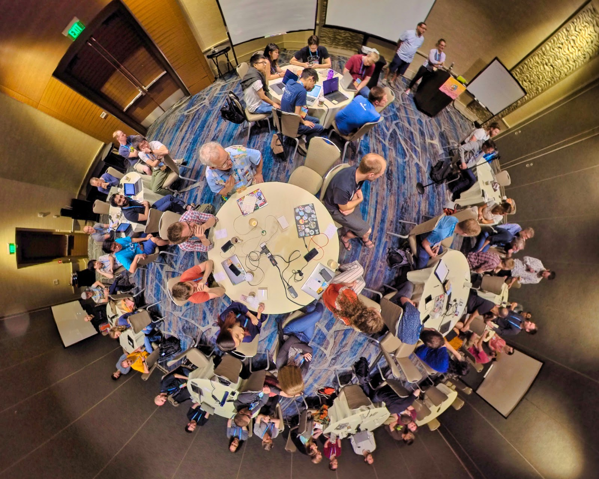

+++
title = "Contributors Summit 2019"
weight = 10
date = 2023-05-18T17:03:08+08:00
description = ""
isCJKLanguage = true
draft = false
+++

# Contributors Summit 2019

https://go.dev/blog/contributors-summit-2019

Carmen Andoh and contributors
15 August 2019

## Introduction 简介

For the third year in a row, the Go team and contributors convened the day before GopherCon to discuss and plan for the future of the Go project. The event included self-organizing into breakout groups, a town-hall style discussion about the proposal process in the morning, and afternoon break-out roundtable discussions based on topics our contributors chose. We asked five contributors to write about their experience in various discussions at this year’s summit.

连续第三年，Go团队和贡献者在GopherCon前一天召开会议，讨论和规划Go项目的未来。这次活动包括自我组织成分组，上午是关于提案过程的市政厅式讨论，下午则是根据我们的贡献者选择的主题进行分组圆桌讨论。我们要求五位撰稿人写下他们在今年峰会上各种讨论的经验。

*(Photo by Steve Francia.)*

## Compiler and Runtime (report by Lynn Boger) 编译器和运行时（报告人：Lynn Boger）

The Go contributors summit was a great opportunity to meet and discuss topics and ideas with others who also contribute to Go.

Go贡献者峰会是一个很好的机会，可以和其他同样对Go有贡献的人见面并讨论话题和想法。

The day started out with a time to meet everyone in the room. There was a good mix of the core Go team and others who actively contribute to Go. From there we decided what topics were of interest and how to split the big group into smaller groups. My area of interest is the compiler, so I joined that group and stayed with them for most of the time.

这一天从认识房间里的每个人开始。Go的核心团队和其他积极为Go做贡献的人都有很好的组合。在此基础上，我们决定了哪些是大家感兴趣的话题，以及如何将大组分成小组。我感兴趣的领域是编译器，所以我加入了这个小组，并在大部分时间里和他们在一起。

At our first meeting, a long list of topics were brought up and as a result the compiler group decided to keep meeting throughout the day. I had a few topics of interest that I shared and many that others suggested were also of interest to me. Not all items on the list were discussed in detail; here is my list of those topics which had the most interest and discussion, followed by some brief comments that were made on other topics.

在我们的第一次会议上，提出了一长串的话题，结果编译器组决定全天持续开会。我有几个感兴趣的话题与大家分享，还有很多人提出的话题也是我感兴趣的。并非清单上的所有项目都得到了详细的讨论；这里是我列出的那些最感兴趣和讨论最多的话题，后面是对其他话题的一些简要评论。

**Binary size**. There was a concern expressed about binary size, especially that it continues to grow with each release. Some possible reasons were identified such as increased inlining and other optimizations. Most likely there is a set of users who want small binaries, and another group who wants the best performance possible and maybe some don’t care. This led to the topic of TinyGo, and it was noted that TinyGo was not a full implementation of Go and that it is important to keep TinyGo from diverging from Go and splitting the user base. More investigation is required to understand the need among users and the exact reasons contributing to the current size. If there are opportunities to reduce the size without affecting performance, those changes could be made, but if performance were affected some users would prefer better performance.

二进制大小。有人对二进制大小表示关切，特别是它随着每个版本的发布而持续增长。一些可能的原因被确认，如增加内联和其他优化。最有可能的是，有一组用户想要小的二进制文件，而另一组用户想要尽可能好的性能，也许有些人并不关心。这就引出了TinyGo的话题，有人指出TinyGo并不是Go的完全实现，重要的是要让TinyGo不与Go背道而驰，分裂用户群。需要进行更多的调查，以了解用户中的需求以及造成目前规模的确切原因。如果有机会在不影响性能的情况下减少大小，可以进行这些改变，但如果性能受到影响，一些用户会更喜欢更好的性能。

**Vector assembly**. How to leverage vector assembly in Go was discussed for a while and has been a topic of interest in the past. I have split this into three separate possibilities, since they all relate to the use of vector instructions, but the way they are used are different, starting with the topic of vector assembly. This is another case of a compiler trade off.

矢量汇编。如何在Go中利用矢量汇编，已经讨论了一段时间，也是过去人们关注的话题。我把它分成三个独立的可能性，因为它们都与使用矢量指令有关，但使用的方式不同，首先是矢量汇编的话题。这是另一个编译器交易的案例。

For most targets, there are critical functions in standard packages such as crypto, hash, math and others, where the use of assembly is necessary to get the best possible performance; however having large functions written in assembly makes them difficult to support and maintain and could require different implementations for each target platform. One solution is to make use of macro assembly or other high-level generation techniques to make the vector assembly easier to read and understand.

对于大多数目标来说，在标准包中有一些关键的功能，如加密、哈希、数学和其他功能，在这些功能中使用汇编是必要的，以获得尽可能好的性能；然而，用汇编编写的大型功能使它们难以支持和维护，并可能需要为每个目标平台提供不同的实现。一个解决方案是利用宏汇编或其他高级生成技术，使矢量汇编更容易阅读和理解。

Another side to this question is whether the Go compiler can directly generate SIMD vector instructions when compiling a Go source file, by enhancing the Go compiler to transform code sequences to “simdize” the code to make use of vector instructions. Implementing SIMD in the Go compiler would add complexity and compile time, and might not always result in code that performs better. The way the code is transformed could in some cases depend on the target platform so that would not be ideal.

这个问题的另一个方面是，Go编译器是否可以在编译Go源文件时直接生成SIMD矢量指令，通过增强Go编译器来转换代码序列，使代码 "模拟化 "以利用矢量指令。在Go编译器中实施SIMD会增加复杂性和编译时间，而且不一定能使代码表现得更好。代码转换的方式在某些情况下可能取决于目标平台，所以这并不理想。

Another way to leverage vector instructions in Go is to provide a way to make it easier to make use of vector instructions from within the Go source code. Topics discussed were intrinsics, or implementations that exist in other compilers like Rust. In gcc some platforms provide inline asm, and Go possibly could provide this capability, but I know from experience that intermixing inline asm with Go code adds complexity to the compiler in terms of tracking register use and debugging. It allows the user to do things the compiler might not expect or want, and it does add an extra level of complexity. It could be inserted in places that are not ideal.

在Go中利用矢量指令的另一种方式是提供一种方法，使其更容易从Go源代码中使用矢量指令。讨论的主题是本征，或者在其他编译器中存在的实现，如Rust。在gcc中，一些平台提供了内联asm，Go也可能提供这种能力，但我从经验中知道，将内联asm与Go代码混合在一起会增加编译器在跟踪寄存器使用和调试方面的复杂性。它允许用户做一些编译器可能不期望或不想要的事情，而且它确实增加了额外的复杂性。它可能被插入到一些不理想的地方。

In summary, it is important to provide a way to leverage the available vector instructions, and make it easier and safer to write. Where possible, functions use as much Go code as possible, and potentially find a way to use high level assembly. There was some discussion of designing an experimental vector package to try and implement some of these ideas.

总之，提供一种方法来利用可用的矢量指令，并使其更容易、更安全地编写是很重要的。在可能的情况下，函数尽可能多地使用Go代码，并有可能找到一种使用高级汇编的方法。有一些讨论是关于设计一个实验性的向量包来尝试和实现其中的一些想法。

**New calling convention**. Several people were interested in the topic of the [ABI changes to provide a register based calling convention](https://go.dev/issue/18597). The current status was reported with details. There was discussion on what remained to be done before it could be used. The ABI specification needs to be written first and it was not clear when that would be done. I know this will benefit some target platforms more than others and a register calling convention is used in most compilers for other platforms.

新的调用惯例。有几个人对ABI的变化感兴趣，以提供一个基于寄存器的调用约定。报告了当前的状态和细节。大家讨论了在使用之前还需要做什么。ABI规范需要首先编写，不清楚什么时候能完成。我知道这对一些目标平台比其他平台更有利，而且在其他平台的大多数编译器中都使用了寄存器调用惯例。

**General optimizations**. Certain optimizations that are more beneficial for some platforms other than x86 were discussed. In particular, loop optimizations such as hoisting of invariants and strength reduction could be done and provide more benefit on some platforms. Potential solutions were discussed, and implementation would probably be up to the targets that find those improvements important.

一般性的优化。讨论了某些对X86以外的一些平台更有利的优化。特别是循环优化，如不变量的提升和强度的降低，可以在一些平台上进行并提供更多的好处。讨论了潜在的解决方案，而实施可能取决于那些认为这些改进很重要的目标。

**Feedback-directed optimizations**. This was discussed and debated as a possible future enhancement. In my experience, it is hard to find meaningful programs to use for collecting performance data that can later be used to optimize code. It increases compile time and takes a lot of space to save the data which might only be meaningful for a small set of programs.

反馈导向的优化。这一点作为未来可能的改进被讨论和争论。根据我的经验，很难找到有意义的程序来收集性能数据，然后用于优化代码。它增加了编译时间，并且需要大量的空间来保存数据，这可能只对一小部分程序有意义。

**Pending submissions**. A few members in the group mentioned changes they had been working on and plan to submit soon, including improvements to makeslice, and a rewrite of rulegen.

待定的提交。小组中的一些成员提到了他们一直在进行的修改，并计划很快提交，包括对makeslice的改进，以及rulegen的重写。

**Compile time concerns**. Compile time was discussed briefly. It was noted that phase timing was added to the GOSSAFUNC output.

编译时间问题。编译时间被简单地讨论了。有人指出，在GOSSAFUNC的输出中加入了相位计时。

**Compiler contributor communication**. Someone asked if there was a need for a Go compiler mailing list. It was suggested that we use golang-dev for that purpose, adding compiler to the subject line to identify it. If there is too much traffic on golang-dev, then a compiler-specific mailing list can be considered at some later point in time.

编译器贡献者的交流。有人问是否需要一个Go编译器邮件列表。有人建议我们使用golang-dev来实现这一目的，并在主题栏中加入编译器来识别它。如果golang-dev的流量太大，那么可以考虑在以后的某个时间点建立一个编译器专用邮件列表。

**Community**. I found the day very beneficial in terms of connecting with people who have been active in the community and have similar areas of interest. I was able to meet many people who I’ve only known by the user name appearing in issues or mailing lists or CLs. I was able to discuss some topics and existing issues and get direct interactive feedback instead of waiting for online responses. I was encouraged to write issues on problems I have seen. These connections happened not just during this day but while running into others throughout the conference, having been introduced on this first day, which led to many interesting discussions. Hopefully these connections will lead to more effective communication and improved handling of issues and code changes in the future.

社区。我发现这一天在与那些一直活跃在社区并有类似兴趣领域的人联系方面非常有益。我能够见到许多人，我只是通过出现在问题或邮件列表或CL中的用户名认识他们。我能够讨论一些主题和现有的问题，并得到直接的互动反馈，而不是等待在线回复。我被鼓励就我所看到的问题写问题。这些联系不仅发生在这一天，而且在整个会议期间遇到其他人时，在这第一天就被介绍了，这导致了许多有趣的讨论。希望这些联系将导致未来更有效的沟通和改进对问题和代码修改的处理。

## Tools (report by Paul Jolly) 工具（报告人：Paul Jolly）

The tools breakout session during the contributor summit took an extended form, with two further sessions on the main conference days organized by the [golang-tools](https://github.com/golang/go/wiki/golang-tools) group. This summary is broken down into two parts: the tools session at the contributor workshop, and a combined report from the golang-tools sessions on the main conference days.

贡献者峰会期间的工具分组会议采取了扩展的形式，在主要会议日期间，由golang-tools小组组织了另外两次会议。本总结分为两部分：贡献者研讨会上的工具会议，以及主要会议日上的golang-tools会议的综合报告。

**Contributor summit**. The tools session started with introductions from ~25 folks gathered, followed by a brainstorming of topics, including: gopls, ARM 32-bit, eval, signal, analysis, go/packages api, refactoring, pprof, module experience, mono repo analysis, go mobile, dependencies, editor integrations, compiler opt decisions, debugging, visualization, documentation. A lot of people with lots of interest in lots of tools!

贡献者峰会。在工具会议上，首先有大约25位与会者进行了介绍，然后是主题的头脑风暴，包括：gopls、ARM 32位、评估、信号、分析、go/packages api、重构、pprof、模块经验、mono repo分析、go移动、依赖性、编辑器集成、编译器选择决策、调试、可视化、文档。很多人对很多工具有很大的兴趣!

The session focused on two areas (all that time allowed): gopls and visualizations. [Gopls](https://go.dev/wiki/gopls) (pronounced: “go please”) is an implementation of the [Language Server Protocol (LSP)](https://langserver.org/) server for Go. Rebecca Stambler, the gopls lead author, and the rest of the Go tools team were interested in hearing people’s experiences with gopls: stability, missing features, integrations in editors working, etc? The general feeling was that gopls was in really good shape and working extremely well for the majority of use cases. Integration test coverage needs to be improved, but this is a hard problem to get “right” across all editors. We discussed a better means of users reporting gopls errors they encounter via their editor, telemetry/diagnostics, gopls performance metrics, all subjects that got more detailed coverage in golang-tools sessions that followed on the main conference days (see below). A key area of discussion was how to extend gopls, e.g., in the form of additional go/analysis vet-like checks, lint checks, refactoring, etc. Currently there is no good solution, but it’s actively under investigation. Conversation shifted to the very broad topic of visualizations, with a demo-based introduction from Anthony Starks (who, incidentally, gave an excellent talk about [Go for information displays](https://www.youtube.com/watch?v=NyDNJnioWhI) at GopherCon 2018).

会议集中在两个领域（所有允许的时间）：Gopls和可视化。Gopls（读作："go please"）是Go语言服务器协议（LSP）服务器的一个实现。gopls的主要作者Rebecca Stambler和Go工具团队的其他成员很想听听大家对gopls的经验：稳定性、缺失的功能、在编辑器中的集成工作等？普遍的感觉是，gopls的状况非常好，对于大多数的使用情况来说工作得非常好。集成测试的覆盖率需要改进，但这是一个很难在所有编辑器中得到 "正确 "的问题。我们讨论了如何让用户通过他们的编辑器报告他们遇到的gopls错误，遥测/诊断，gopls的性能指标，所有这些主题在主要会议日的golang-tools会议上得到了更详细的报道（见下文）。讨论的一个关键领域是如何扩展gopls，例如，以额外的go/analysis vet-like检查、lint检查、重构等形式。目前还没有很好的解决方案，但正在积极调查中。谈话转向了非常广泛的可视化话题，Anthony Starks做了基于演示的介绍（顺便说一下，他在GopherCon 2018上做了一个关于Go用于信息显示的出色演讲）。

**Conference days**. The golang-tools sessions on the main conference days were a continuation of the [monthly calls](https://go.dev/wiki/golang-tools) that have been happening since the group’s inception at GopherCon 2018. Full notes are available for the [day 1](https://docs.google.com/document/d/1-RVyttQ0ncjCpR_sRwizf-Ubedkr0Emwmk2LhnsUOmE/edit) and [day 2](https://docs.google.com/document/d/1ZI_WqpLCB8DO6teJ3aBuXTeYD2iZZZlkDptmcY6Ja60/edit#heading=h.x9lkytc2gxmg) sessions. These sessions were again well attended with 25-30 people at each session. The Go tools team was there in strength (a good sign of the support being put behind this area), as was the Uber platform team. In contrast to the contributor summit, the goal from these sessions was to come away with specific action items.

会议日。主要会议日的golang-tools会议是自该小组在GopherCon 2018上成立以来每月电话会议的延续。第1天和第2天的会议都有完整的笔记。这些会议再次得到广泛参与，每场会议有25-30人参加。Go工具团队在那里很有实力（这是一个很好的迹象，说明这个领域得到了支持），Uber平台团队也是如此。与贡献者峰会不同的是，这些会议的目标是带着具体的行动项目离开。

**Gopls**. Gopls “readiness” was a major focus for both sessions. This answer effectively boiled down to determining when it makes sense to tell editor integrators “we have a good first cut of gopls” and then compiling a list of “blessed” editor integrations/plugins known to work with gopls. Central to this “certification” of editor integrations/plugins is a well-defined process by which users can report problems they experience with gopls. Performance and memory are not blockers for this initial “release”. The conversation about how to extend gopls, started in the contributor summit the day before, continued in earnest. Despite the many obvious benefits and attractions to extending gopls (custom go/analysis checks, linter support, refactoring, code generation…), there isn’t a clear answer on how to implement this in a scalable way. Those gathered agreed that this should not be seen as a blocker for the initial “release”, but should continue to be worked on. In the spirit of gopls and editor integrations, Heschi Kreinick from the Go tools team brought up the topic of debugging support. Delve has become the de facto debugger for Go and is in good shape; now the state of debugger-editor integration needs to be established, following a process similar to that of gopls and the “blessed” integrations.

Gopls。Gopls的 "准备情况 "是两个会议的主要焦点。这个答案实际上可以归结为确定什么时候告诉编辑器集成商 "我们有一个很好的gopls的第一部分 "是有意义的，然后编制一个 "受祝福的 "编辑器集成/插件的列表，已知可以与gopls一起使用。编辑器集成/插件的 "认证 "的核心是一个定义明确的过程，用户可以通过这个过程报告他们在使用gopls时遇到的问题。性能和内存不是这个初始 "版本 "的障碍。在前一天的贡献者峰会上开始的关于如何扩展gopls的对话继续认真进行。尽管扩展gopls有许多明显的好处和吸引力（自定义go/分析检查、linter支持、重构、代码生成......），但对于如何以可扩展的方式实现，还没有一个明确的答案。参加会议的人一致认为，这不应该被看作是最初 "发布 "的障碍，而应该继续努力。本着gopls和编辑器整合的精神，Go工具团队的Heschi Kreinick提出了调试支持的话题。Delve已经成为Go事实上的调试器，并且状态良好；现在需要建立调试器-编辑器集成的状态，遵循与gopls和 "祝福 "集成类似的过程。

**Go Discovery Site**. The second golang-tools session started with an excellent introduction to the Go Discovery Site by Julie Qiu from the Go tools team, along with a quick demo. Julie talked about the plans for the Discovery Site: open sourcing the project, what signals are used in search ranking, how [godoc.org](http://godoc.org/) will ultimately be replaced, how submodules should work, how users can discover new major versions.

Go发现站点。第二场golang-tools会议开始时，来自Go工具团队的Julie Qiu对Go发现网站进行了精彩的介绍，并进行了快速的演示。Julie谈到了发现网站的计划：项目的开源，搜索排名中使用的信号，godoc.org最终将如何被取代，子模块应该如何工作，用户如何发现新的主要版本。

**Build Tags**. Conversation then moved to build tag support within gopls. This is an area that clearly needs to be better understood (use cases are currently being gathered in [issue 33389](https://go.dev/issue/33389)). In light of this conversation, the session wrapped up with Alexander Zolotov from the JetBrains GoLand team suggesting that the gopls and GoLand teams should share experience in this and more areas, given GoLand has already gained lots of experience.

构建标签。然后，对话转向了gopls内的构建标签支持。这显然是一个需要更好地理解的领域（目前正在33389问题中收集使用案例）。鉴于这一对话，会议结束时，来自JetBrains GoLand团队的Alexander Zolotov建议gopls和GoLand团队应该在这一领域和更多领域分享经验，因为GoLand已经获得了很多经验。

**Join Us!** We could easily have talked about tools-related topics for days! The good news is that the golang-tools calls will continue for the foreseeable future. Anyone interested in Go tooling is very much encouraged to join: [the wiki](https://go.dev/wiki/golang-tools) has more details.

加入我们! 我们可以很容易地谈论与工具有关的话题好几天! 好消息是，在可预见的未来，golang-tools的调用将继续进行。我们非常鼓励任何对Go工具感兴趣的人加入：wiki上有更多细节。

## Enterprise Use (report by Daniel Theophanes) 企业使用（报告人：Daniel Theophanes）

Actively asking after the needs of less vocal developers will be the largest challenge, and greatest win, for the Go language. There is a large segment of programmers who don’t actively participate in the Go community. Some are business associates, marketers, or quality assurance who also do development. Some will wear management hats and make hiring or technology decisions. Others just do their job and return to their families. And lastly, many times these developers work in businesses with strict IP protection contracts. Even though most of these developers won’t end up directly participating in open source or the Go community proposals, their ability to use Go depends on both.

积极关注那些不善言辞的开发者的需求将是Go语言最大的挑战，也是最大的胜利。有很大一部分程序员并不积极参加Go社区。有些人是商业伙伴、营销人员或质量保证，他们也做开发。有些人会戴上管理的帽子，做出招聘或技术的决定。其他人只是做他们的工作，然后回到他们的家庭。最后，很多时候这些开发者在有严格知识产权保护合同的企业工作。即使这些开发者中的大多数最终不会直接参与开源或Go社区的提案，他们使用Go的能力也取决于这两者。

The Go community and Go proposals need to understand the needs of these less vocal developers. Go proposals can have a large impact on what is adopted and used. For instance, the vendor folder and later the Go modules proxy are incredibly important for businesses that strictly control source code and typically have fewer direct conversations with the Go community. Having these mechanisms allow these organizations to use Go at all. It follows that we must not only pay attention to current Go users, but also to developers and organizations who have considered Go, but have chosen against it. We need to understand these reasons.

Go社区和Go提案需要了解这些不怎么发声的开发者的需求。Go提案可以对采用和使用的内容产生很大的影响。例如，供应商文件夹和后来的Go模块代理对于那些严格控制源代码的企业来说是非常重要的，通常与Go社区的直接对话较少。有了这些机制，这些组织就可以完全使用Go了。由此可见，我们不仅要关注当前的Go用户，也要关注那些曾经考虑过Go但选择放弃的开发者和组织。我们需要了解这些原因。

Similarly, should the Go community pay attention to “enterprise” environments it would unlock many additional organizations who can utilize Go. By ensuring active directory authentication works, users who would be forced to use a different ecosystem can keep Go on the table. By ensuring WSDL just works, a section of users can pick Go up as a tool. No one suggested blindly making changes to appease non-Go users. But rather we should be aware of untapped potential and unrecognized hindrances in the Go language and ecosystem.

同样地，如果Go社区关注 "企业 "环境，就会释放出更多可以利用Go的组织。通过确保活动目录认证的工作，那些将被迫使用不同生态系统的用户可以继续使用Go。通过确保WSDL只是工作，一部分用户可以把Go作为一个工具来使用。没有人建议盲目地做出改变来讨好非Go用户。而是我们应该意识到Go语言和生态系统中未被开发的潜力和未被认识的阻碍。

While several different possibilities to actively solicit this information from the outside were discussed, this is a problem we fundamentally need your help. If you are in an organization that doesn’t use Go even though it was considered, let us know why Go wasn’t chosen. If you are in an organization where Go is only used for a subsection of programming tasks, but not others, why isn’t it used for more? Are there specific blockers to adoption?

虽然讨论了几种不同的可能性，从外部积极征集这些信息，但这个问题我们从根本上需要你的帮助。如果您所在的组织没有使用Go，尽管它被考虑过，请让我们知道为什么没有选择Go。如果您所在的组织只将Go用于部分编程任务，而不是其他任务，那么为什么它没有被用于更多的任务？是否有具体的阻碍采用的因素？

## Education (report by Andy Walker) 教育（Andy Walker的报告）

One of the roundtables I was involved in at the Contributors Summit this year was on the topic of Go education, specifically what kind of resources we make available to the new Go programmer, and how we can improve them. Present were a number of very passionate organizers, engineers and educators, each of whom had a unique perspective on the subject, either through tools they’d designed, documents they’d written or workshops they’d given to developers of all stripes.

在今年的贡献者峰会上，我参加了一个圆桌会议，主题是Go教育，特别是我们为新的Go程序员提供了什么样的资源，以及我们如何改进这些资源。出席会议的有一些非常有激情的组织者、工程师和教育家，他们每个人都对这个话题有独特的看法，有的是通过他们设计的工具，有的是他们编写的文档，有的是他们给各种类型的开发者举办的研讨会。

Early on, talk turned to whether or not Go makes a good first programming language. I wasn’t sure, and advocated against it. Go isn’t a good first language, I argued, because it isn’t intended to be. As Rob Pike [wrote back in 2012](https://go.dev/talks/2012/splash.article), “the language was designed by and for people who write—and read and debug and maintain—large software systems”. To me, this guiding ethos is clear: Go is a deliberate response to perceived flaws in the processes used by experienced engineers, not an attempt to create an ideal programming language, and as such a certain basic familiarity with programming concepts is assumed.

早期，讨论转向Go是否是一种好的第一种编程语言。我不确定，并主张反对。我认为，Go并不是一门好的第一语言，因为它并不打算成为这样的语言。正如Rob Pike在2012年写的那样，"这门语言是由那些编写、阅读、调试和维护大型软件系统的人设计的"。对我来说，这一指导思想很清楚：Go是对有经验的工程师所使用的程序中的缺陷的刻意回应，而不是试图创造一种理想的编程语言，因此假定对编程概念有一定的基本熟悉程度。

This is evident in the official documentation at [golang.org/doc](https://go.dev/doc/). It jumps right into how to install the language before passing the user on to the [tour](https://go.dev/tour/), which is geared towards programmers who are already familiar with a C-like language. From there, they are taken to [How to Write Go Code](https://go.dev/doc/code.html), which provides a very basic introduction to the classic non-module Go workspace, before moving immediately on to writing libraries and testing. Finally, we have [Effective Go](https://go.dev/doc/effective_go.html), and a series of references including the [spec](https://go.dev/ref/spec), rounded out by some examples. These are all decent resources if you’re already familiar with a C-like language, but they still leave a lot to be desired, and there’s nothing to be found for the raw beginner or even someone coming directly from a language like Python.

这在golang.org/doc的官方文档中很明显。它在把用户带到参观之前就直接进入了如何安装语言的问题，这是为那些已经熟悉类似C语言的程序员准备的。在那里，他们被带到了如何编写Go代码，它对经典的非模块Go工作区进行了非常基本的介绍，然后立即转向编写库和测试。最后，我们有了Effective Go，以及一系列的参考资料，包括规范，并以一些例子作为补充。如果你已经熟悉了一种类似C语言，这些都是不错的资源，但它们仍然有很多不足之处，对于原始的初学者，甚至是直接从Python这样的语言来的人来说，没有什么可以找到的。

As an accessible, interactive starting point, the tour is a natural first target towards making the language more beginner friendly, and I think a lot of headway can be made targeting that alone. First, it should be the first link in the documentation, if not the first link in the bar at the top of golang.org, front and center. We should encourage the curious user to jump right in and start playing with the language. We should also consider including optional introductory sections on coming from other common languages, and the differences they are likely to encounter in Go, with interactive exercises. This would go a long way to helping new Go programmers in mapping the concepts they are already familiar with onto Go.

作为一个可访问的、交互式的起点，参观是使语言对初学者更加友好的第一个目标，而且我认为仅仅针对这一点就可以取得很大的进展。首先，它应该是文档中的第一个链接，如果不是golang.org顶部栏中的第一个链接的话，也应该是最前面和中间的。我们应该鼓励好奇的用户直接跳进去，开始玩这个语言。我们还应该考虑加入一些可选的介绍性章节，介绍来自其他通用语言的情况，以及他们在Go中可能遇到的差异，并配以互动练习。这将大大有助于帮助新的Go程序员将他们已经熟悉的概念映射到Go上。

For experienced programmers, an optional, deeper treatment should be given to most sections in the tour, allowing them to drill down into more detailed documentation or interactive exercises enumerating the design decisions principles of good architecture in Go. They should find answers to questions like:

对于有经验的程序员来说，应该对导览中的大部分章节进行选择性的深入处理，让他们深入了解更详细的文档或互动练习，列举Go中良好架构的设计决策原则。他们应该找到问题的答案，比如：

- Why are there so many integer types when I am encouraged to use `int` most of the time?
- Is there ever a good reason to pick a value receiver?
- Why is there a plain `int`, but no plain `float`?
- What are send- and receive-only channels, and when would I use them?
- How do I effectively compose concurrency primitives, and when would I *not* want to use channels?
- What is `uint` good for? Should I use it to restrict my user to positive values? Why not?
- 为什么有这么多的整数类型，而我被鼓励在大多数时候使用int？
  是否有很好的理由去选择一个值接收器？
  为什么有一个普通int，而没有普通float？
  什么是只发送和只接收的通道，我什么时候会使用它们？
  我如何有效地组成并发原语，什么时候我不想使用通道？
  uint有什么用？我应该用它来限制我的用户使用正值吗？为什么不呢？

The tour should be someplace they can revisit upon finishing the first run-through to dive more deeply into some of the more interesting choices in language design.

参观应该是他们在完成第一次运行后可以重温的地方，以便更深入地研究语言设计中的一些更有趣的选择。

But we can do more. Many people seek out programming as a way to design applications or scratch a particular itch, and they are most likely to want to target the interface they are most familiar with: the browser. Go does not have a good front-end story yet. Javascript is still the only language that really provides both a frontend and a backend environment, but WASM is fast becoming a first-order platform, and there are so many places we could go with that. We could provide something like [vecty](https://github.com/gopherjs/vecty) in [The Go Play Space](https://goplay.space/), or perhaps [Gio](https://gioui.org/), targeting WASM, for people to get started programming in the browser right away, inspiring their imagination, and provide them a migration path out of our playground into a terminal and onto GitHub.

但我们可以做得更多。许多人寻求编程作为设计应用程序的一种方式，或者是挠痒痒，而他们最有可能想针对他们最熟悉的界面：浏览器。Go还没有一个好的前端故事。Javascript仍然是唯一能真正提供前端和后端环境的语言，但WASM正迅速成为一个一阶平台，我们有很多地方可以利用。我们可以在The Go Play Space中提供类似vecty的东西，或者是针对WASM的Gio，让人们立即开始在浏览器中编程，激发他们的想象力，并为他们提供一条从我们的游乐场迁移到终端和GitHub上的路径。

So, is Go a good first language? I honestly don’t know, but it’s certainly true there are a significant number of people entering the programming profession with Go as their starting point, and I am very interested in talking to them, learning about their journey and their process, and shaping the future of Go education with their input.

那么，Go是一种好的第一种语言吗？老实说，我不知道，但肯定的是，有相当多的人是以Go为起点进入编程行业的，我非常有兴趣与他们交谈，了解他们的旅程和过程，并以他们的意见来塑造Go教育的未来。

## Learning Platforms (report by Ronna Steinberg) 学习平台（报告人：Ronna Steinberg）

We discussed what a learning platform for Go should look like and how we can combine global resources to effectively teach the language. We generally agreed that teaching and learning is easier with visualization and that a REPL is very gratifying. We also overviewed some existing solutions for visualization with Go: templates, Go WASM, GopherJS as well as SVG and GIFs generation.

我们讨论了Go的学习平台应该是什么样子的，以及我们如何结合全球资源来有效地教授Go语言。我们普遍认为，可视化的教学更容易，而REPL是非常令人满意的。我们还概述了一些现有的Go可视化解决方案：模板、Go WASM、GopherJS以及SVG和GIFs生成。

Compiler errors not making sense to the new developer was also brought up and we considered ideas of how to handle it, perhaps a bank of errors and how they would be useful. One idea was a wrapper for the compiler that explains your errors to you, with examples and solutions.

对于新的开发者来说，编译器的错误是没有意义的，我们考虑了如何处理这个问题的想法，也许可以建立一个错误库，以及如何让它们发挥作用。一个想法是为编译器提供一个包装，向你解释你的错误，并提供例子和解决方案。

A new group convened for a second round later and we focused more on what UX should the Go learning platform have, and if and how we can take existing materials (talks, blog posts, podcasts, etc) from the community and organize them into a program people can learn from. Should such a platform link to those external resources? Embed them? Cite them? We agreed that a portal-like-solution (of external links to resources) makes navigation difficult and takes away from the learning experience, which led us to the conclusion that such contribution cannot be passive, and contributors will likely have to opt in to have their material on the platform. There was then much excitement around the idea of adding a voting mechanism to the platform, effectively turning the learners into contributors, too, and incentivizing the contributors to put their materials on the platform.

后来，一个新的小组召开了第二轮会议，我们更关注Go学习平台应该有什么样的用户体验，以及我们是否以及如何从社区中获取现有的材料（讲座、博文、播客等）并将它们组织成一个人们可以学习的程序。这样一个平台应该链接到那些外部资源吗？嵌入它们？引用它们？我们一致认为，一个类似于门户网站的解决方案（外部资源链接）会使导航变得困难，并使学习体验大打折扣，这使我们得出结论，这种贡献不可能是被动的，贡献者可能必须选择将他们的材料放在平台上。于是，大家对在平台上增加一个投票机制的想法非常兴奋，有效地将学习者也变成了贡献者，并激励贡献者将他们的材料放在平台上。

(If you are interested in helping in educational efforts for Go, please email Carmen Andoh candoh@google.com.)

(如果你有兴趣帮助Go的教育工作，请发邮件给Carmen Andoh candoh@google.com）。

## Thank You! 谢谢大家!

Thanks to all the attendees for the excellent discussions on contributor day, and thanks especially to Lynn, Paul, Daniel, Andy, and Ronna for taking the time to write these reports.

感谢所有与会者在贡献者日的精彩讨论，并特别感谢Lynn、Paul、Daniel、Andy和Ronna抽出时间来写这些报告。
