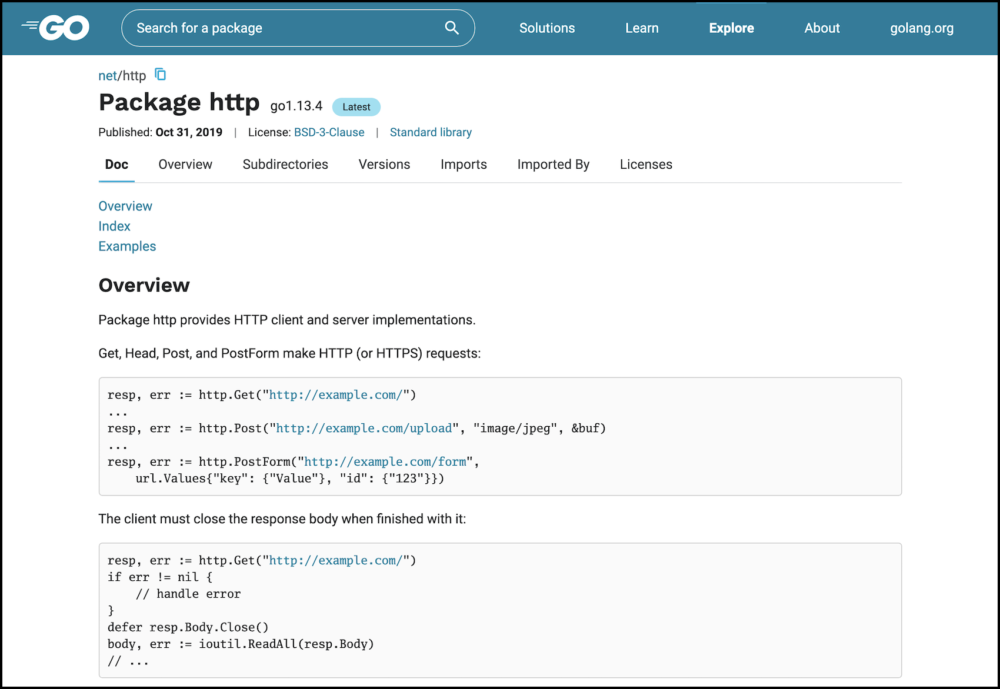

+++
title = "go.dev：go开发者的新中心"
weight = 2
date = 2023-05-18T17:03:08+08:00
description = ""
isCJKLanguage = true
draft = false
+++

# Go.dev: a new hub for Go developers - go.dev：go开发者的新中心

https://go.dev/blog/go.dev

Steve Francia and Julie Qiu
13 November 2019

Over the last two years, as we’ve spoken with users at companies of all sizes, we’ve heard three questions repeatedly: who else is using Go, what do they use it for, and how can I find useful Go packages?

在过去的两年里，当我们与各种规模的公司的用户交谈时，我们反复听到三个问题：还有谁在使用Go，他们用它做什么，以及我如何找到有用的Go包？

Today we are launching [go.dev](https://go.dev/), a new hub for Go developers, to help answer those questions. There you will find a wealth of learning resources to get started with the language, featured use cases, and case studies of companies using Go.

今天，我们推出了go.dev，一个为Go开发者服务的新中心，以帮助回答这些问题。在那里，你会发现大量的学习资源，可以让你开始使用Go语言，有特色的用例，以及使用Go的公司的案例研究。

(Note that [golang.org](https://go.dev/) is still the home for the open source Go project and the Go distribution. Go.dev is a companion site to provide these supporting resources.)

(请注意，golang.org仍然是开源Go项目和Go发行版的所在地。Go.dev是一个提供这些支持资源的配套网站）。

Clicking on Explore brings you to [pkg.go.dev](https://pkg.go.dev/), a central source of information about Go packages and modules. Like [godoc.org](https://godoc.org/), pkg.go.dev serves Go documentation. However, it also understands modules and has information about all versions of a package, including [all releases of the standard library](https://pkg.go.dev/std?tab=versions)! And it detects and displays licenses and has a better search algorithm. You can follow [Go issue 33654](https://go.dev/issue/33654) for future developments.

点击 "探索 "可以进入pkg.go.dev，这是一个关于Go软件包和模块的中心信息来源。和godoc.org一样，pkg.go.dev也提供Go文档。然而，它也能理解模块，并拥有软件包所有版本的信息，包括标准库的所有版本 而且它能检测和显示许可证，并有更好的搜索算法。你可以关注Go问题33654，了解未来的发展。

Today’s launch is our minimum viable product for go.dev, so we can share what we’ve built to help the community and get feedback. We intend to expand the site over time. If you have any ideas, suggestions or issues, please let us know via the “Share Feedback” and “Report an Issue” links at the bottom of every page. Or you can send your bugs, ideas, feature requests, and questions to [go-discovery-feedback@google.com](mailto:go-discovery-feedback@google.com).

今天的发布是我们为go.dev开发的最小可行产品，所以我们可以分享我们建立的东西来帮助社区并获得反馈。我们打算随着时间的推移扩大这个网站。如果你有任何想法、建议或问题，请通过每个页面底部的 "分享反馈 "和 "报告问题 "链接让我们知道。或者你可以把你的错误、想法、功能请求和问题发送到go-discovery-feedback@google.com。
