+++
title = "2019年Go开发者调查结果"
weight = 11
date = 2023-05-18T17:03:08+08:00
description = ""
isCJKLanguage = true
draft = false
+++

# Go Developer Survey 2019 Results - 2019年Go开发者调查结果

https://go.dev/blog/survey2019-results

Todd Kulesza
20 April 2020

## What a response! 多么大的反响啊!

I want to start with an enormous **thank you** to the thousands of Go developers who participated in this year’s survey. For 2019, we saw 10,975 responses, nearly [twice as many as last year](https://blog.golang.org/survey2018-results)! On behalf of the rest of the team, I cannot adequately stress how much we appreciate you taking the time and effort to tell us about your experiences with Go. Thank you!

首先，我想对参与今年调查的数千名Go开发者表示极大的感谢。在2019年，我们看到了10975份回复，几乎是去年的两倍！我代表团队的其他成员感谢他们。我代表团队的其他成员，无法充分强调我们有多么感谢你们花时间和精力来告诉我们你们使用Go的经验。谢谢你们!

## A note about prior years 关于往年的说明

Sharp-eyed readers may notice that our year-over-year comparisons don’t quite square with numbers we’ve shared in the past. The reason is that from 2016–2018, we calculated percentages for each question using the total number of people who started the survey as the denominator. While that’s nice and consistent, it ignores the fact that not everyone finishes the survey—up to 40% of participants stop before reaching the final page, which meant questions that occurred later in the survey appeared to perform worse solely because they were later. Thus, this year we’ve recalculated all of our results (including the 2016–2018 responses shown in this post) to use the number of people who responded to a given question as the denominator for that question. We’ve included the number of 2019 responses for each chart—in the form of “n=[number of respondents]” on the x-axis or in the chart’s legend—to give readers a better understanding of the weight of evidence underlying each finding.

眼尖的读者可能会注意到，我们的年度比较与我们过去分享的数字不大一致。原因是，从2016-2018年，我们以开始调查的总人数为分母，计算每个问题的百分比。虽然这很好，也很一致，但它忽略了一个事实，即不是每个人都能完成调查--多达40%的参与者在到达最后一页之前就停止了，这意味着调查中较晚出现的问题似乎表现得更差，仅仅是因为它们较晚。因此，今年我们重新计算了所有的结果（包括本篇文章中显示的2016-2018年的答复），使用对某一问题作出答复的人数作为该问题的分母。我们将2019年每张图表的回复人数以X轴上的 "n=[回复人数]"的形式或在图表的图例中列出，以使读者更好地了解每项发现所依据的证据的权重。

Similarly, we learned that in prior surveys options that appeared earlier in response lists had a disproportionate response rate. To address this, we added an element of randomization into the survey. Some of our multiple-choice questions have lists of choices with no logical ordering, such as “I write the following in Go: [list of types of applications]”. Previously these choices had been alphabetized, but for 2019 they were presented in a random order to each participant. This means year-over-year comparison for certain questions are invalid for 2018 → 2019, but trends from 2016–2018 are not invalidated. You can think of this as setting a more accurate baseline for 2019. We retained alphabetical ordering in cases where respondents are likely to scan for a particular name, such as their preferred editor. We explicitly call out which questions this applies to below.

同样，我们了解到，在以前的调查中，在回复列表中出现较早的选项有不相称的回复率。为了解决这个问题，我们在调查中加入了随机化的元素。我们的一些多选题有一些没有逻辑顺序的选项清单，例如 "我在Go中写了以下内容：[应用程序类型清单]"。以前这些选择是按字母顺序排列的，但在2019年，它们是以随机顺序呈现给每个参与者。这意味着某些问题的同比比较在2018年→2019年是无效的，但2016-2018年的趋势并没有失效。你可以认为这是为2019年设定一个更准确的基线。在受访者可能会扫描某个特定名字的情况下，我们保留了字母排序，例如他们喜欢的编辑。我们在下面明确指出了这适用于哪些问题。

A third major change was to improve our analysis of questions with open-ended, free-text responses. Last year we used machine learning to roughly—but quickly—categorize these responses. This year two researchers manually analyzed and categorized these responses, allowing for a more granular analysis but preventing valid comparisons with last year’s numbers. Like the randomization discussed above, the purpose of this change is to give us a reliable baseline for 2019 onward.

第三个主要变化是改进我们对具有开放性、自由文本回答的问题的分析。去年我们用机器学习对这些回答进行了粗略但快速的分类。今年，两名研究人员对这些回答进行了人工分析和分类，从而可以进行更细化的分析，但却无法与去年的数字进行有效比较。与上面讨论的随机化一样，这一变化的目的是为2019年以后的工作提供一个可靠的基线。

## Without further ado… 不再多说了...

This is a long post. Here’s the tl;dr of our major findings:

这是一个很长的帖子。以下是我们主要调查结果的摘要：

- The demographics of our respondents are similar to Stack Overflow’s survey respondents, which increases our confidence that these results are representative of the larger Go developer audience.我们的受访者的人口统计学特征与Stack Overflow的调查对象相似，这增加了我们的信心，这些结果代表了更大的Go开发者受众。
- A majority of respondents use Go every day, and this number has been trending up each year.大多数受访者每天都在使用Go，而且这个数字每年都有上升的趋势。
- Go’s use is still concentrated in technology companies, but Go is increasingly found in a wider variety of industries, such as finance and media.Go的使用仍然集中在技术公司，但Go越来越多地出现在更多的行业，如金融和媒体。
- Methodology changes showed us that most of our year-over-year metrics are stable and higher than we previously realized.方法的改变让我们看到，我们的大部分同比指标都很稳定，而且比我们之前意识到的要高。
- Respondents are using Go to solve similar problems, particularly building API/RPC services and CLIs, regardless of the size of organization they work at.受访者正在使用Go来解决类似的问题，特别是构建API/RPC服务和CLI，无论他们工作的组织规模如何。
- Most teams try to update to the latest Go release quickly; when third-party providers are late to support the current Go release, this creates an adoption blocker for developers.大多数团队都试图快速更新到最新的Go版本；当第三方供应商迟迟不支持当前的Go版本时，这就给开发者带来了采用障碍。
- Almost everyone in the Go ecosystem is now using modules, but some confusion around package management remains.现在Go生态系统中几乎所有人都在使用模块，但在软件包管理方面仍然存在一些混乱。
- High-priority areas for improvement include improving the developer experience for debugging, working with modules, and working with cloud services.需要改进的高度优先领域包括改善开发者在调试、使用模块和使用云服务方面的体验。
- VS Code and GoLand have continued to see increased use; they’re now preferred by 3 out of 4 respondents.VS Code和GoLand的使用持续增加；现在每4个受访者中就有3个喜欢它们。

## Who did we hear from?我们听取了谁的意见？

This year we asked some new demographic questions to help us better understand the people who’ve responded to this survey. In particular, we asked about the duration of professional programming experience and the size of the organizations where people work. These were modeled on questions that StackOverflow asks in their annual survey, and the distribution of responses we saw is very close to StackOverflow’s 2019 results. Our take-away is the respondents to this survey have similar levels of professional experience and proportional representation of different sizes of organizations as the StackOverflow survey audience (with the obvious difference that we’re primarily hearing from developers working with Go). That increases our confidence when generalizing these findings to the estimated 1 million Go developers worldwide. These demographic questions will also help us in the future to identify which year-over-year changes may be the result of a shift in who responded to the survey, rather than changes in sentiment or behavior.

今年，我们问了一些新的人口统计学问题，以帮助我们更好地了解对这项调查作出反应的人。特别是，我们询问了专业编程经验的持续时间和人们工作的组织的规模。这些问题是以StackOverflow在其年度调查中提出的问题为模型，我们看到的答复分布与StackOverflow的2019年结果非常接近。我们的收获是，这次调查的受访者的专业经验水平和不同规模的组织的比例代表与StackOverflow的调查对象相似（明显的区别是我们主要听到的是使用Go的开发人员的意见）。这增加了我们将这些发现归纳为全球约100万Go开发者的信心。这些人口统计学问题也将帮助我们在未来确定哪些年复一年的变化可能是回应调查者的转变，而不是情绪或行为的变化。

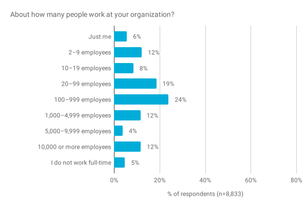

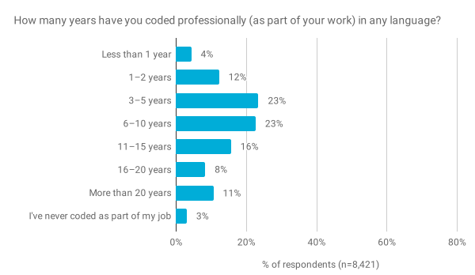

Looking at Go experience, we see that a majority of respondents (56%) are relatively new to Go, having used it for less than two years. Majorities also said they use Go at work (72%) and outside of work (62%). The percentage of respondents using Go professionally appears to be trending up each year.

从Go经验来看，我们发现大多数受访者（56%）对Go比较陌生，使用Go的时间不到两年。大多数人还说他们在工作中（72%）和工作之外（62%）使用Go。专业使用Go的受访者比例似乎每年都有上升的趋势。

As you can see in the chart below, in 2018 we saw a spike in these numbers, but that increase disappeared this year. This is one of many signals suggesting that the audience who answered the survey in 2018 was significantly different than in the other three years. In this case they were significantly more likely to be using Go outside of work and a different language while at work, but we see similar outliers across multiple survey questions.

正如你在下图中看到的那样，在2018年，我们看到了这些数字的飙升，但这种增长在今年消失了。这是许多信号之一，表明2018年回答调查的受众与其他三年明显不同。在这种情况下，他们明显更有可能在工作之外使用Go，在工作时使用不同的语言，但我们在多个调查问题中看到类似的离群值。

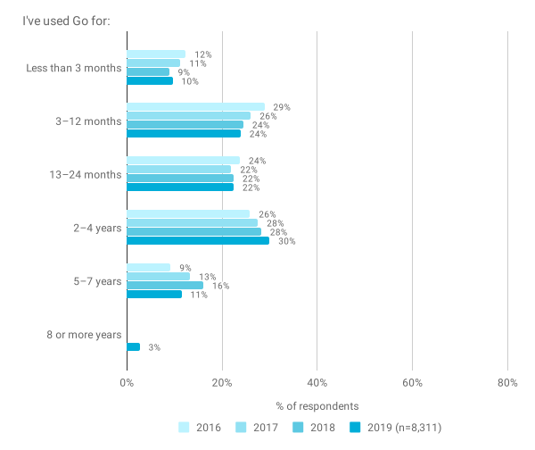

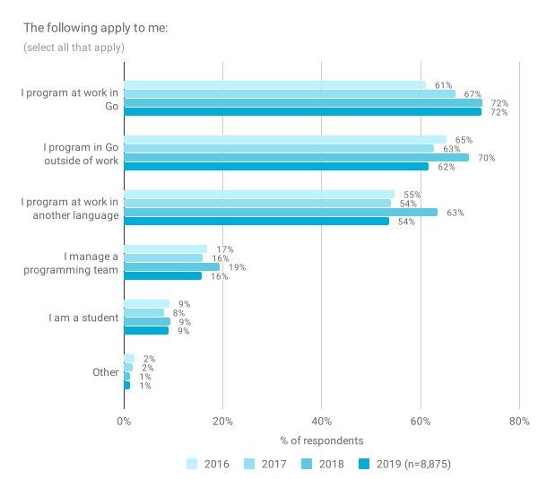

Respondents who have been using Go the longest have different backgrounds than newer Go developers. These Go veterans were more likely to claim expertise in C/C++ and less likely to claim expertise in JavaScript, TypeScript, and PHP. One caveat is that this is self-reported “expertise”; it may be more helpful to think of it instead as “familiarity”. Python appears to be the language (other than Go) familiar to the most respondents, regardless of how long they’ve been working with Go.

使用Go时间最长的受访者与较新的Go开发者有着不同的背景。这些Go老手更有可能声称在C/C++方面有专长，而在JavaScript、TypeScript和PHP方面的专长则较少。需要注意的是，这是自我报告的 "专业知识"；将其视为 "熟悉程度 "可能更有帮助。Python似乎是最多受访者熟悉的语言（除Go外），不管他们使用Go多久了。

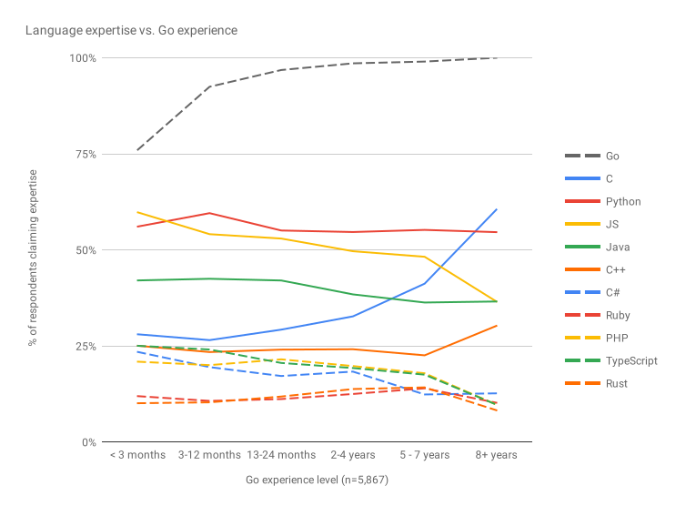

Last year we asked about which industries respondents work in, finding that a majority reported working in software, internet, or web service companies. This year it appears respondents represent a broader range of industries. However, we also simplified the list of industries to reduce confusion from potentially overlapping categories (e.g., the separate categories for “Software” and “Internet / web services” from 2018 were combined into “Technology” for 2019). Thus, this isn’t strictly an apples-to-apples comparison. For example, it’s possible that one effect of simplifying the category list was to reduce the use of the “Software” category as a catch-all for respondents writing Go software for an industry that wasn’t explicitly listed.

去年，我们询问了受访者所处的行业，发现大多数人在软件、互联网或网络服务公司工作。今年，受访者似乎代表了更广泛的行业。然而，我们也简化了行业列表，以减少可能重叠的类别带来的混乱（例如，2018年的 "软件 "和 "互联网/网络服务 "的单独类别被合并为2019年的 "技术"）。因此，这并不是严格意义上的苹果对苹果的比较。例如，简化类别列表的一个效果可能是减少使用 "软件 "类别，作为为没有明确列出的行业编写Go软件的受访者的集合。

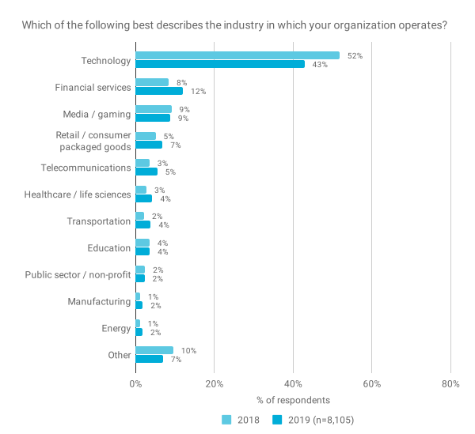

Go is a successful open-source project, but that doesn’t mean the developers working with it are also writing free or open-source software. As in prior years, we found that most respondents are not frequent contributors to Go open-source projects, with 75% saying they do so “infrequently” or “never”. As the Go community expands, we see the proportion of respondents who’ve never contributed to Go open-source projects slowly trending up.

Go是一个成功的开源项目，但这并不意味着使用它的开发者也在编写免费或开源的软件。与往年一样，我们发现大多数受访者并不经常为Go开源项目做贡献，75%的人表示他们 "不经常 "或 "从不 "这样做。随着Go社区的扩大，我们看到从未对Go开源项目做出贡献的受访者的比例在慢慢上升。

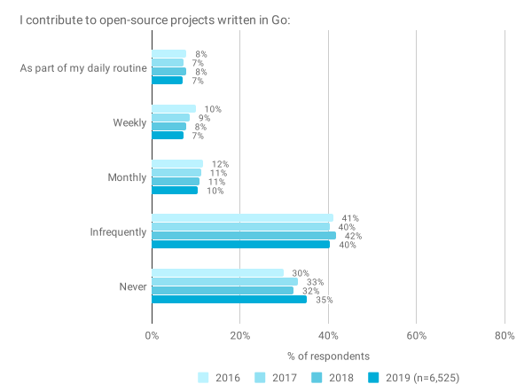

## Developer tools 开发者工具

As in prior years, the vast majority of survey respondents reported working with Go on Linux and macOS systems. This is one area of strong divergence between our respondents and StackOverflow’s 2019 results: in our survey, only 20% of respondents use Windows as a primary development platform, while for StackOverflow it was 45% of respondents. Linux is used by 66% and macOS by 53%—both much higher than the StackOverflow audience, which reported 25% and 30%, respectively.

与往年一样，绝大多数调查对象都表示在Linux和macOS系统上使用Go。这是我们的受访者和StackOverflow的2019年结果之间存在强烈分歧的一个领域：在我们的调查中，只有20%的受访者使用Windows作为主要的开发平台，而StackOverflow则是45%的受访者。66%的人使用Linux，53%的人使用macOS--两者都比StackOverflow的受众高得多，后者报告的比例分别为25%和30%。

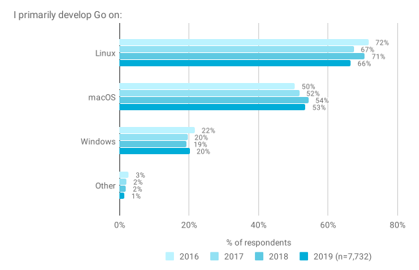

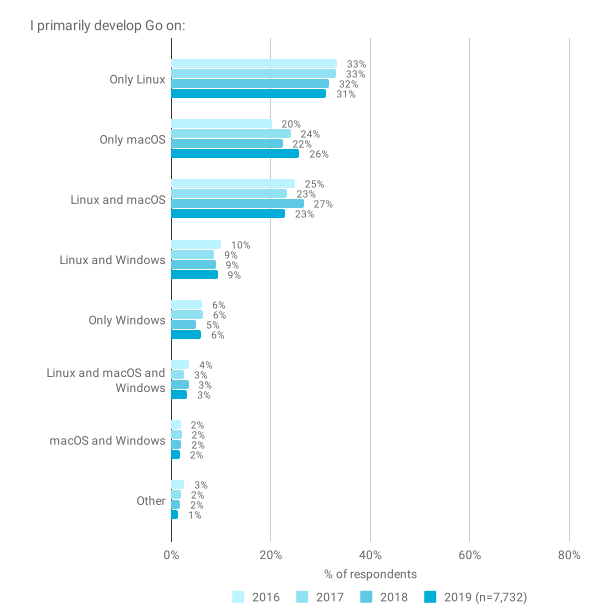

The trend in editor consolidation has continued this year. GoLand saw the sharpest increase in use this year, rising from 24% → 34%. VS Code’s growth slowed, but it remains the most popular editor among respondents at 41%. Combined, these two editors are now preferred by 3 out of 4 respondents.

编辑器整合的趋势在今年继续。GoLand的使用量在今年增长最快，从24%上升到34%。VS Code的增长放缓，但它仍然是受访者中最受欢迎的编辑器，占41%。这两个编辑器加起来，现在每4个受访者中就有3个喜欢使用。

Every other editor saw a small decrease. This doesn’t mean those editors aren’t being used at all, but they’re not what respondents say they *prefer* to use for writing Go code.

其他每个编辑器都有小幅下降。这并不意味着这些编辑器完全没有被使用，但它们并不是受访者所说的写Go代码时喜欢使用的编辑器。

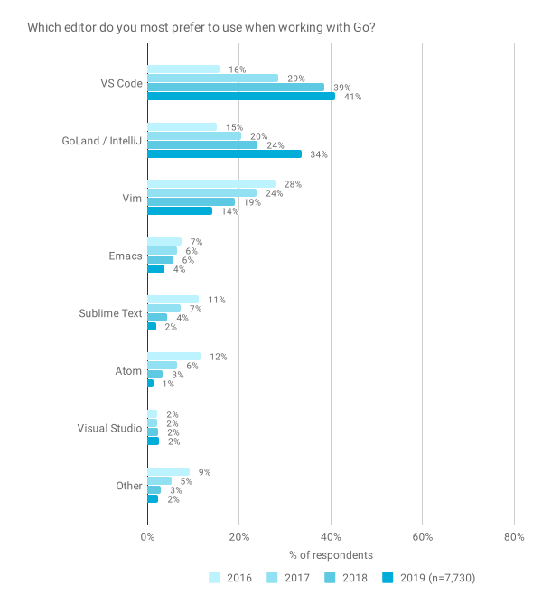

This year we added a question about internal Go documentation tooling, such as [gddo](https://github.com/golang/gddo). A small minority of respondents (6%) reported that their organization runs its own Go documentation server, though this proportion nearly doubles (to 11%) when we look at respondents at large organizations (those with at least 5,000 employees). A follow-up asked of respondents who said their organization had stopped running its own documentation server suggests that the top reason to retire their server was a combination of low perceived benefits (23%) versus the amount of effort required to initially set it up and maintain it (38%).

今年我们增加了一个关于内部Go文档工具的问题，例如gddo。少数受访者（6%）表示他们的组织运行自己的Go文档服务器，不过当我们观察大型组织（至少有5000名员工的组织）的受访者时，这一比例几乎翻了一番（达到11%）。对那些说他们的组织已经停止运行自己的文档服务器的受访者进行的跟踪调查表明，退出他们的服务器的首要原因是感知到的低效益（23%）与最初设置和维护它所需的工作量（38%）的结合。

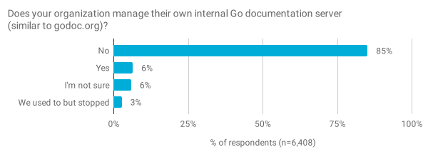

## Sentiments towards Go 对Go的感情

Large majorities of respondents agreed that Go is working well for their teams (86%) and that they’d prefer to use it for their next project (89%). We also found that over half of respondents (59%) believe Go is critical to the success of their companies. All of these metrics have remained stable since 2016.

绝大多数受访者认为Go对他们的团队来说运行良好（86%），他们更愿意在下一个项目中使用Go（89%）。我们还发现，超过一半的受访者（59%）认为Go对于他们公司的成功至关重要。自2016年以来，所有这些指标都保持稳定。

Normalizing the results changed most of these numbers for prior years. For example, the percentage of respondents who agreed with the statement “Go is working well for my team” was previously in the 50’s and 60’s because of participant drop-off; when we remove participants who never saw the question, we see it’s been fairly stable since 2016.

对结果进行归一化处理，改变了前几年的大部分数字。例如，同意 "Go在我的团队中运作良好 "这一说法的受访者的百分比以前是在50和60之间，因为参与者退出；当我们删除从未见过这个问题的参与者时，我们看到它自2016年以来一直相当稳定。

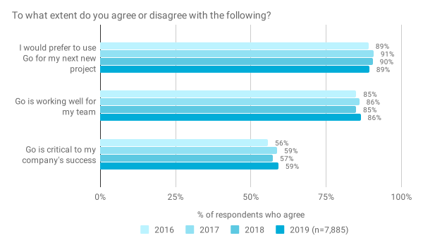

Looking at sentiments toward problem solving in the Go ecosystem, we see similar results. Large percentages of respondents agreed with each statement (82%–88%), and these rates have been largely stable over the past four years.

看看对Go生态系统中的问题解决的看法，我们看到类似的结果。大比例的受访者同意每条陈述（82%-88%），而且这些比例在过去四年里基本稳定。

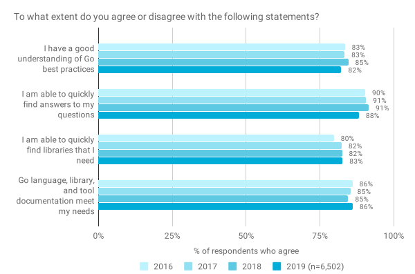

This year we took a more nuanced look at satisfaction across industries to establish a baseline. Overall, respondents were positive about using Go at work, regardless of industry sector. We do see small variations in dissatisfaction in a few areas, most notably manufacturing, which we plan to investigate with follow-up research. Similarly, we asked about satisfaction with—and the importance of—various aspects of Go development. Pairing these measures together highlighted three topics of particular focus: debugging (including debugging concurrency), using modules, and using cloud services. Each of these topics was rated “very” or “critically” important by a majority of respondents but had significantly lower satisfaction scores compared to other topics.

今年，我们对各行业的满意度进行了更细致的研究，以建立一个基线。总的来说，受访者对在工作中使用Go持积极态度，无论哪个行业领域。我们确实看到少数领域的不满意度有小的差异，最明显的是制造业，我们计划在后续研究中对此进行调查。同样地，我们询问了对Go发展各方面的满意度和重要性。将这些衡量标准放在一起，突出了三个特别关注的主题：调试（包括调试并发性）、使用模块和使用云服务。这些主题中的每一个都被大多数受访者评为 "非常 "或 "非常 "重要，但与其他主题相比，其满意度明显较低。

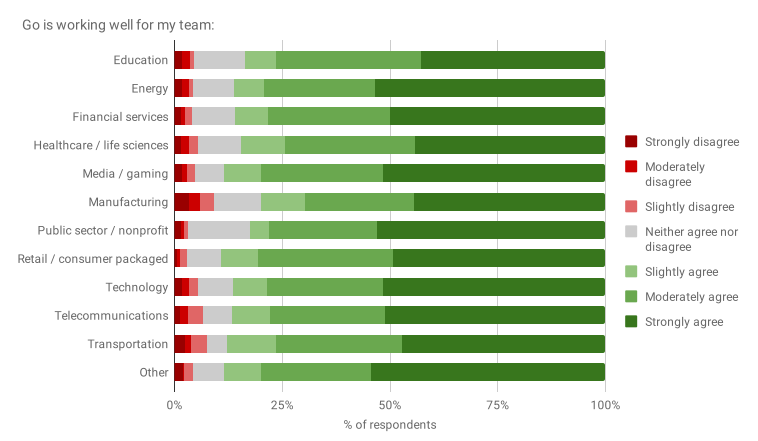

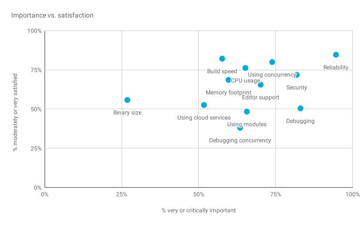

Turning to sentiments toward the Go community, we see some differences from prior years. First, there is a dip in the percentage of respondents who agreed with the statement “I feel welcome in the Go community”, from 82% to 75%. Digging deeper revealed that the proportion of respondents who “slightly” or “moderately agreed” decreased, while the proportions who “neither agree nor disagree” and “strongly agree” both increased (up 5 and 7 points, respectively). This polarizing split suggests two or more groups whose experiences in the Go community are diverging, and is thus another area we plan to further investigate.

在谈到对Go社区的看法时，我们看到与往年的一些不同。首先，同意 "我觉得自己在Go界很受欢迎 "这一说法的受访者比例从82%下降到75%。深入调查发现，"略微同意 "或 "适度同意 "的受访者比例有所下降，而 "既不同意也不反对 "和 "非常同意 "的比例都有所上升（分别上升5和7个百分点）。这种两极分化表明有两个或更多的群体在Go界的经验出现了分歧，因此是我们计划进一步调查的另一个领域。

The other big differences are a clear upward trend in responses to the statement “I feel welcome to contribute to the Go project” and a large year-over-year increase in the proportion of respondents who feel Go’s project leadership understands their needs.

其他较大的差异是对 "我觉得欢迎为Go项目做贡献 "这一说法的回答有明显的上升趋势，而认为Go项目领导层了解他们的需求的受访者比例也同比大幅上升。

All of these results show a pattern of higher agreement correlated with increased Go experience, beginning at about two years. In other words, the longer a respondent has been using Go, the more likely they were to agree with each of these statements.

所有这些结果都显示出一种模式，即从两年左右开始，较高的认同度与Go经验的增加相关。换句话说，受访者使用Go的时间越长，他们就越有可能同意这些陈述的内容。

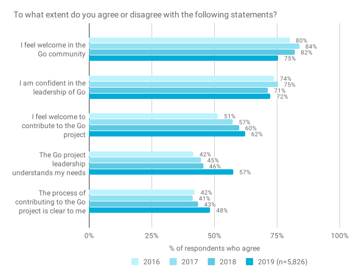

This likely comes as no surprise, but people who responded to the Go Developer Survey tended to like Go. However, we also wanted to understand which *other* languages respondents enjoy working with. Most of these numbers have not significantly changed from prior years, with two exceptions: TypeScript (which has increased 10 points), and Rust (up 7 points). When we break these results down by duration of Go experience, we see the same pattern as we found for language expertise. In particular, Python is the language and ecosystem that Go developers are most likely to also enjoy building with.

这可能并不令人惊讶，但回应Go开发者调查的人倾向于喜欢Go。然而，我们也想了解受访者喜欢用哪些其他语言工作。这些数字中的大多数与往年相比没有明显变化，但有两个例外。TypeScript（增加了10分）和Rust（增加了7分）。当我们将这些结果按Go经验的时间长短进行细分时，我们看到了与我们发现的语言专长相同的模式。特别是，Python是Go开发人员最有可能也喜欢用它来构建的语言和生态系统。

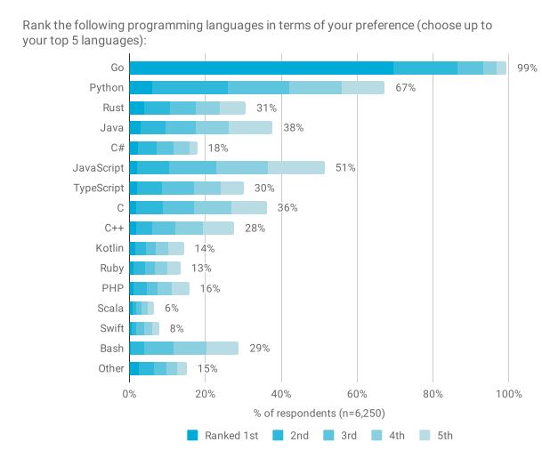

In 2018 we first asked the “Would you recommend…” [Net Promoter Score](https://en.wikipedia.org/wiki/Net_Promoter) (NPS) question, yielding a score of 61. This year our NPS result is a statistically unchanged 60 (67% “promoters” minus 7% “detractors”).

2018年，我们首先询问了 "你是否会推荐......" Net Promoter Score（NPS）问题，得出的分数是61分。今年，我们的NPS结果是统计学上没有变化的60分（67%的 "促进者 "减去7%的 "反对者"）。

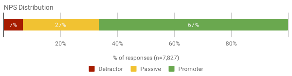

## Working with Go 与Go一起工作

Building API/RPC services (71%) and CLIs (62%) remain the most common uses of Go. The chart below appears to show major changes from 2018, but these are most likely the result of randomizing the order of choices, which used to be listed alphabetically: 3 of the 4 choices beginning with ’A’ decreased, while everything else remained stable or increased. Thus, this chart is best interpreted as a more accurate baseline for 2019 with trends from 2016–2018. For example, we believe that the proportion of respondents building web services which return HTML has been decreasing since 2016 but were likely undercounted because this response was always at the bottom of a long list of choices. We also broke this out by organization size and industry but found no significant differences: it appears respondents use Go in roughly similar ways whether they work at a small tech start-up or a large retail enterprise.

构建API/RPC服务（71%）和CLI（62%）仍然是Go的最常见用途。下图似乎显示了与2018年相比的重大变化，但这些很可能是随机选择顺序的结果，过去是按字母顺序排列的。以'A'开头的4个选择中有3个减少了，而其他都保持稳定或增加。因此，这张图最好被解释为2019年更准确的基线与2016-2018年的趋势。例如，我们认为，自2016年以来，构建返回HTML的网络服务的受访者的比例一直在下降，但很可能被低估了，因为这个响应总是在一长串选择的底部。我们还按组织规模和行业进行了细分，但没有发现明显的差异：看来受访者无论在小型科技创业公司还是大型零售企业工作，使用Go的方式都大致相同。

A related question asked about the larger areas in which respondents work with Go. The most common area by far was web development (66%), but other common areas included databases (45%), network programming (42%), systems programming (38%), and DevOps tasks (37%).

一个相关的问题询问了受访者使用Go的较大领域。到目前为止，最常见的领域是网页开发（66%），但其他常见领域包括数据库（45%）、网络编程（42%）、系统编程（38%）和DevOps任务（37%）。

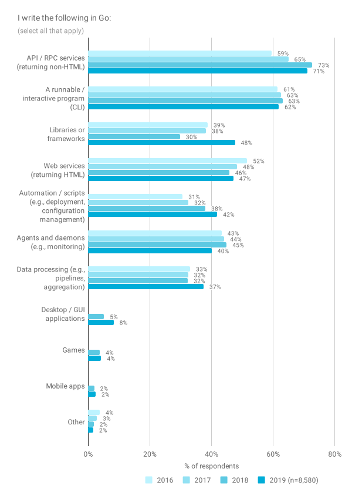

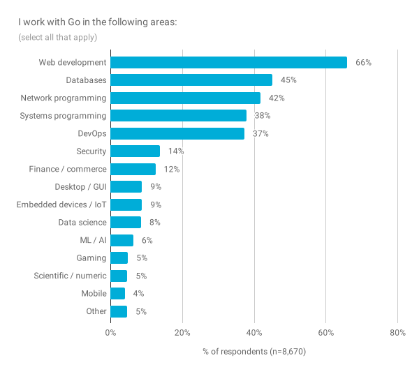

In addition to what respondents are building, we also asked about some of the development techniques they use. A large majority of respondents said they depend upon text logs for debugging (88%), and their free-text responses suggest this is because alternative tooling is challenging to use effectively. However, local stepwise debugging (e.g., with Delve), profiling, and testing with the race detector were not uncommon, with ~50% of respondents depending upon at least one of these techniques.

除了受访者正在建造的东西，我们还询问了他们使用的一些开发技术。绝大多数受访者表示，他们依赖文本日志进行调试（88%），他们的自由文本回答表明，这是因为替代工具的有效使用具有挑战性。然而，本地逐步调试（例如，使用Delve）、剖析和使用竞赛检测器进行测试的情况并不少见，约50%的受访者至少依赖其中一种技术。

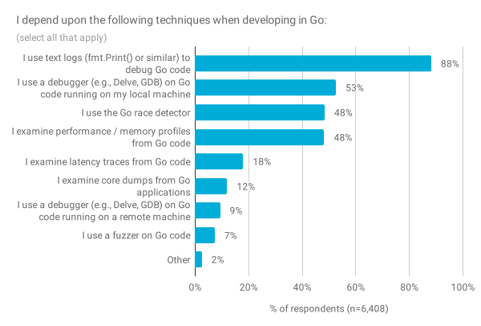

Regarding package management, we found that the vast majority of respondents have adopted modules for Go (89%). This has been a big shift for developers, and nearly the entire community appears to be going through it simultaneously.

关于包管理，我们发现绝大多数的受访者都采用了Go的模块（89%）。这对开发者来说是一个很大的转变，几乎整个社区都在同时经历这个转变。

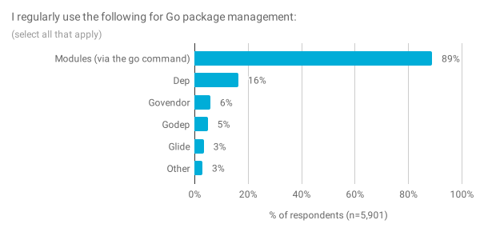

We also found that 75% of respondents evaluate the current Go release for production use, with an additional 12% waiting one release cycle. This suggests a large majority of Go developers are using (or at the least, trying to use) the current or previous stable release, highlighting the importance for platform-as-a-service providers to quickly support new stable releases of Go.

我们还发现，75%的受访者对当前的Go版本进行了评估，以便在生产中使用，另有12%的人在等待一个发布周期。这表明大部分Go开发者都在使用（或者至少在尝试使用）当前或之前的稳定版本，凸显了平台即服务提供商快速支持Go新稳定版本的重要性。

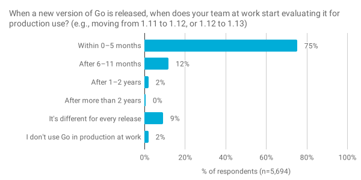

## Go in the clouds 云中的Go

Go was designed with modern distributed computing in mind, and we want to continue to improve the developer experience of building cloud services with Go. This year we expanded the questions we asked about cloud development to better understand how respondents are working with cloud providers, what they like about the current developer experience, and what can be improved. As mentioned earlier, some of the 2018 results appear to be outliers, such as an unexpectedly low result for self-owned servers, and an unexpectedly high result for GCP deployments.

Go的设计考虑到了现代分布式计算，我们希望继续改善开发者使用Go构建云服务的体验。今年，我们扩大了关于云开发的问题，以更好地了解受访者如何与云供应商合作，他们喜欢当前的开发者体验，以及可以改进的地方。如前所述，2018年的一些结果似乎是离群索居的，例如自备服务器的结果意外地低，而GCP部署的结果意外地高。

We see two clear trends:

我们看到两个明显的趋势：

1. The three largest global cloud providers (Amazon Web Services, Google Cloud Platform, and Microsoft Azure) all appear to be trending up in usage among survey respondents, while most other providers are used by a smaller proportion of respondents each year.三个最大的全球云供应商（亚马逊网络服务、谷歌云平台和微软Azure）在调查对象中的使用率似乎都呈上升趋势，而其他大多数供应商每年使用的比例较小。
2. On-prem deployments to self-owned or company-owned servers continue to decrease and are now statistically tied with AWS (44% vs. 42%) as the most common deployment targets.在自家或公司拥有的服务器上的内部部署继续减少，目前在统计上与AWS并列成为最常见的部署目标（44%对42%）。

Looking at which types of cloud platforms respondents are using, we see differences between the major providers. Respondents deploying to AWS and Azure were most likely to be using VMs directly (65% and 51%, respectively), while those deploying to GCP were almost twice as likely to be using the managed Kubernetes platform (GKE, 64%) than VMs (35%). We also found that respondents deploying to AWS were equally likely to be using a managed Kubernetes platform (32%) as they were to be using a managed serverless platform (AWS Lambda, 33%). Both GCP (17%) and Azure (7%) had lower proportions of respondents using serverless platforms, and free-text responses suggest a primary reason was delayed support for the latest Go runtime on these platforms.

看看受访者正在使用哪些类型的云平台，我们看到主要供应商之间的差异。部署到AWS和Azure的受访者最有可能直接使用虚拟机（分别为65%和51%），而部署到GCP的受访者使用管理型Kubernetes平台（GKE，64%）的可能性几乎是虚拟机（35%）的两倍。我们还发现，部署到AWS的受访者使用受管理的Kubernetes平台（32%）和使用受管理的无服务器平台（AWS Lambda，33%）的可能性相同。GCP（17%）和Azure（7%）使用无服务器平台的受访者比例较低，而自由文本答复表明，主要原因是这些平台对最新Go运行时的支持延迟。

Overall, a majority of respondents were satisfied with using Go on all three major cloud providers. Respondents reported similar satisfaction levels with Go development for AWS (80% satisfied) and GCP (78%). Azure received a lower satisfaction score (57% satisfied), and free-text responses suggest that the main driver was a perception that Go lacks first-class support on this platform (25% of free-text responses). Here, “first-class support” refers to always staying up-to-date with the latest Go release, and ensuring new features are available to Go developers at time of launch. This was the same top pain-point reported by respondents using GCP (14%), and particularly focused on support for the latest Go runtime in serverless deployments. Respondents deploying to AWS, in contrast, were most likely to say the SDK could use improvements, such as being more idiomatic (21%). SDK improvements were also the second most common request for both GCP (9%) and Azure (18%) developers.

总体而言，大多数受访者对在所有三个主要云提供商上使用Go表示满意。受访者对AWS（80%满意）和GCP（78%）的Go开发的满意程度相似。Azure的满意度较低（57%满意），而自由文本回复表明，主要驱动因素是认为Go在这个平台上缺乏一流的支持（25%的自由文本回复）。这里，"一流的支持 "指的是始终保持最新的Go版本，并确保新功能在发布时提供给Go开发者。这也是使用GCP的受访者报告的首要痛点（14%），尤其是在无服务器部署中对最新Go运行时间的支持。相比之下，部署到AWS的受访者最有可能说SDK需要改进，比如说更符合习惯（21%）。SDK的改进也是GCP（9%）和Azure（18%）开发者的第二大要求。

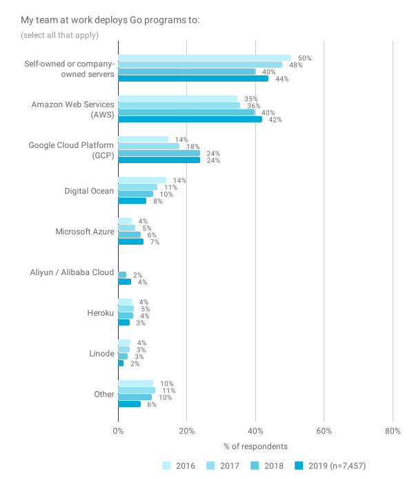

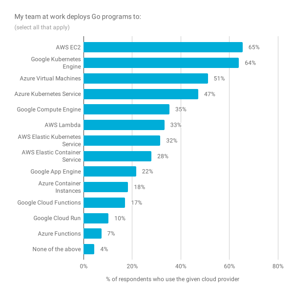

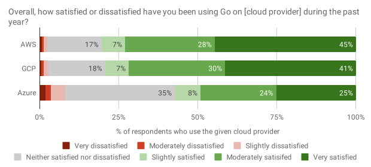

## Pain points 痛点

The top reasons respondents say they are unable to use Go more remain working on a project in another language (56%), working on a team that prefers to use another language (37%), and the lack of a critical feature in Go itself (25%).

受访者说他们无法更多使用Go的首要原因仍然是在用另一种语言进行项目工作（56%），在喜欢使用另一种语言的团队中工作（37%），以及Go本身缺乏关键功能（25%）。

This was one of the questions where we randomized the choice list, so year-over-year comparisons aren’t valid, though 2016–2018 trends are. For example, we are confident that the number of developers unable to use Go more frequently because their team prefers a different language is decreasing each year, but we don’t know whether that decrease dramatically accelerated this year, or was always a bit lower than our 2016–2018 numbers estimated.

这是我们随机选择列表的问题之一，所以同比的比较并不有效，不过2016-2018年的趋势是有效的。例如，我们确信，因为他们的团队喜欢不同的语言而无法更频繁地使用Go的开发人员的数量每年都在减少，但我们不知道这种减少是在今年急剧加速，还是一直比我们2016-2018年的数字估计要低一点。

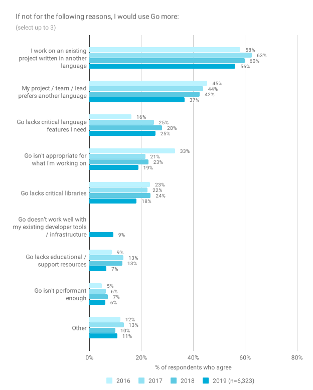

The top two adoption blockers (working on an existing non-Go project and working on a team that prefers a different language) don’t have direct technical solutions, but the remaining blockers might. Thus, this year we asked for more details, to better understand how we might help developers increase their use of Go. The charts in the remainder of this section are based on free-text responses which were manually categorized, so they have *very* long tails; categories totalling less than 3% of the total responses have been grouped into the “Other” category for each chart. A single response may mention multiple topics, thus charts do not sum to 100%.

前两个采用障碍（在现有的非Go项目中工作和在喜欢不同语言的团队中工作）并没有直接的技术解决方案，但其余的障碍可能会。因此，今年我们要求提供更多的细节，以更好地了解我们如何帮助开发者增加对Go的使用。本节其余部分的图表是基于自由文本的回复，这些回复是人工分类的，所以它们的尾巴非常长；占总回复量不到3%的类别被归入每个图表的 "其他 "类别。一个回答可能提到多个主题，因此图表的总和不是100%。

Among the 25% of respondents who said Go lacks language features they need, 79% pointed to generics as a critical missing feature. Continued improvements to error handling (in addition to the Go 1.13 changes) was cited by 22%, while 13% requested more functional programming features, particularly built-in map/filter/reduce functionality. To be clear, these numbers are from the subset of respondents who said they would be able to use Go more were it not missing one or more critical features they need, not the entire population of survey respondents.

在25%表示Go缺乏他们需要的语言功能的受访者中，79%指出泛型是一个关键的缺失功能。22%的人提到继续改进错误处理（除了Go 1.13的变化），而13%的人要求更多的函数式编程功能，特别是内置的map/filter/reduce功能。明确地说，这些数字来自于那些说如果Go不缺少他们需要的一个或多个关键功能，他们就会更多地使用Go的受访者，而不是整个调查对象。

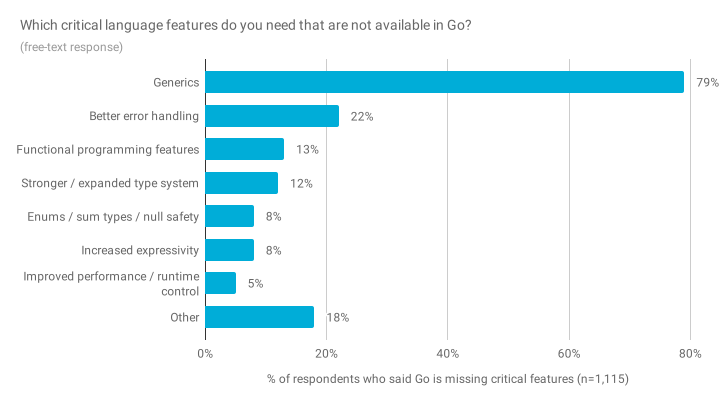

Respondents who said Go “isn’t an appropriate language” for what they work on had a wide variety of reasons and use-cases. The most common was that they work on some form of front-end development (22%), such as GUIs for web, desktop, or mobile. Another common response was that the respondent said they worked in a domain with an already-dominant language (9%), making it a challenge to use something different. Some respondents also told us which domain they were referring to (or simply mentioned a domain without mentioning another language being more common), which we show via the “I work on [domain]” rows below. An additional top reason cited by respondents was a need for better performance (9%), particularly for real-time computing.

那些说Go "不适合 "他们的工作的受访者有各种各样的原因和使用情况。最常见的是他们从事某种形式的前端开发（22%），例如用于网页、桌面或移动的图形用户界面。另一个常见的回答是，受访者说他们工作的领域有一种已经占主导地位的语言（9%），这使得使用不同的语言成为一种挑战。一些受访者还告诉我们他们指的是哪个领域（或者只是提到一个领域而没有提到另一种语言更常见），我们通过下面的 "我在[领域]工作 "行来显示。受访者提到的另一个首要原因是需要更好的性能（9%），特别是对于实时计算。

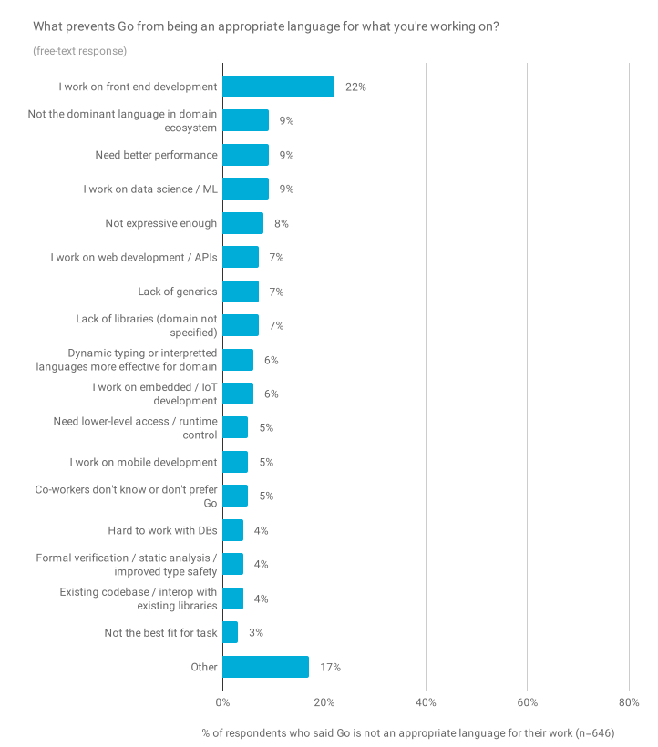

The biggest challenges respondents reported remain largely consistent with last year. Go’s lack of generics and modules/package management still top the list (15% and 12% of responses, respectively), and the proportion of respondents highlighting tooling problems increased. These numbers are different from the above charts because this question was asked of *all* respondents, regardless of what they said their biggest Go adoption blockers were. All three of these are areas of focus for the Go team this year, and we hope to greatly improve the developer experience, particularly around modules, tooling, and the getting started experience, in the coming months.

受访者报告的最大挑战与去年基本一致。Go缺乏泛型和模块/包管理仍然位居榜首（分别占答复的15%和12%），而强调工具问题的受访者比例也有所增加。这些数字与上面的图表不同，因为这个问题是向所有受访者提出的，无论他们说他们最大的Go应用障碍是什么。这三个问题都是Go团队今年重点关注的领域，我们希望在未来几个月内大大改善开发者的体验，特别是围绕模块、工具和入门体验。

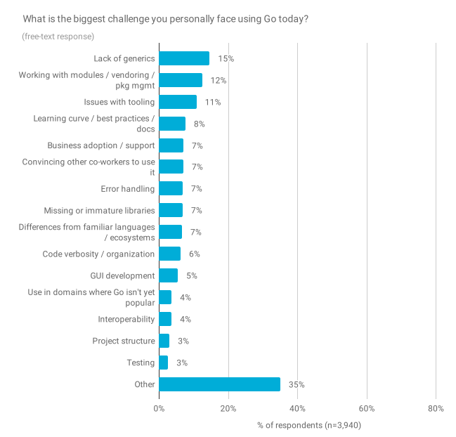

Diagnosing faults and performance issues can be challenging in any language. Respondents told us their top challenge for both of these was not something specific to Go’s implementation or tooling, but a more fundamental issue: a self-reported lack of knowledge, experience, or best practices. We hope to help address these knowledge gaps via documentation and other educational materials later this year. The other major problems do involve tooling, specifically a perceived unfavorable cost/benefit trade-off to learning/using Go’s debugging and profiling tooling, and challenges making the tooling work in various environments (e.g., debugging in containers, or getting performance profiles from production systems).

在任何语言中，诊断故障和性能问题都是一种挑战。受访者告诉我们，他们在这两方面的最大挑战不是Go的实现或工具的具体问题，而是一个更根本的问题：自我报告的知识、经验或最佳实践的缺乏。我们希望在今年晚些时候通过文档和其他教育材料帮助解决这些知识差距。其他的主要问题确实涉及到工具，特别是认为学习/使用Go的调试和剖析工具的成本/收益权衡不利，以及在各种环境中使用工具的挑战（例如，在容器中调试，或从生产系统中获得性能剖析）。

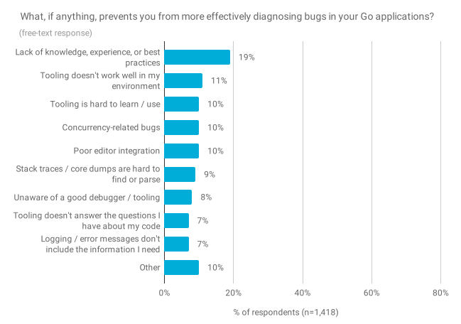

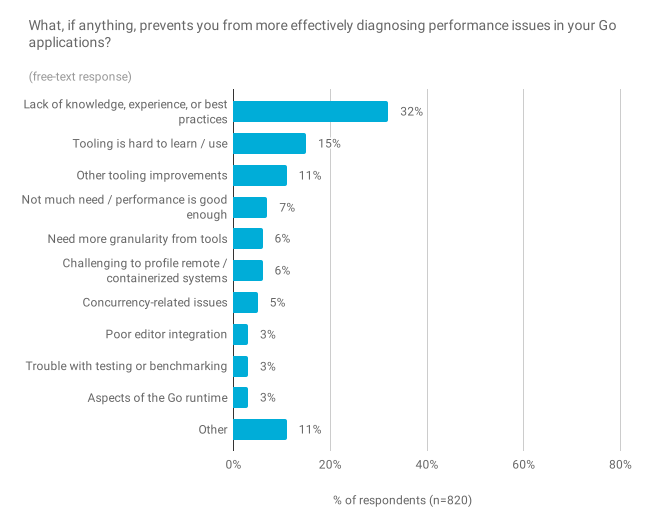

Finally, when we asked what would most improve Go support in respondents’ editing environment, the most common response was for general improvements or better support for the language server (gopls, 19%). This was expected, as gopls replaces about 80 extant tools and is still in beta. When respondents were more specific about what they’d like to see improved, they were most likely to report the debugging experience (14%) and faster or more reliable code completion (13%). A number of participants also explicitly referenced the need to frequently restart VS Code when using gopls (8%); in the time since this survey was in the field (late November – early December 2019), many of these gopls improvements have already landed, and this continues to be a high-priority area for the team.

最后，当我们问到什么能最有效地改善受访者编辑环境中的Go支持时，最常见的回答是对语言服务器（gopls，19%）的一般改进或更好的支持。这是意料之中的，因为gopls取代了大约80个现存的工具，而且仍在测试阶段。当受访者对他们希望看到的改进更加具体时，他们最有可能报告的是调试经验（14%）以及更快或更可靠的代码完成（13%）。一些参与者还明确提到在使用gopls时需要经常重启VS Code（8%）；在本次调查的时间里（2019年11月底至12月初），许多gopls的改进已经落地，这仍然是团队的一个高度优先领域。

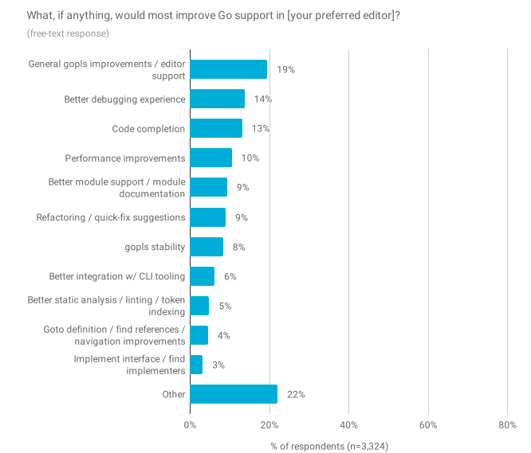

## The Go community Go社区

Roughly two thirds of respondents used Stack Overflow to answer their Go-related questions (64%). The other top sources of answers were godoc.org (47%), directly reading source code (42%), and golang.org (33%).

大约有三分之二的受访者使用Stack Overflow来回答他们与Go相关的问题（64%）。其他最主要的答案来源是godoc.org（47%），直接阅读源代码（42%），以及golang.org（33%）。

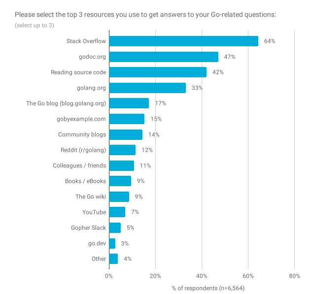

The long tail on the previous chart highlights the large variety of different sources (nearly all of them community-driven) and modalities that respondents rely on to overcome challenges while developing with Go. Indeed, for many Gophers, this may be one of their main points of interaction with the larger community: as our community expands, we’ve seen higher and higher proportions of respondents who do not attend any Go-related events. For 2019, that proportion nearly reached two thirds of respondents (62%).

前面图表中的长尾强调了受访者在使用Go开发时依靠的大量不同来源（几乎都是社区驱动的）和模式来克服挑战。事实上，对于许多Gophers来说，这可能是他们与大社区互动的主要点之一：随着我们社区的扩大，我们看到不参加任何Go相关活动的受访者比例越来越高。对于2019年，这一比例几乎达到三分之二的受访者（62%）。

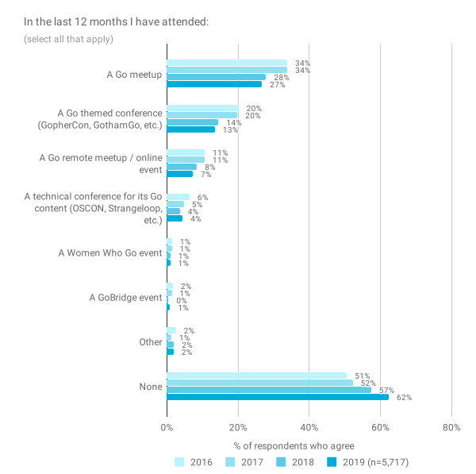

Due to updated Google-wide privacy guidelines, we can no longer ask about which countries respondents live in. Instead we asked about preferred spoken/written language as a very rough proxy for Go’s worldwide usage, with the benefit of providing data for potential localization efforts.

由于更新了谷歌范围内的隐私准则，我们不能再询问受访者居住在哪些国家。相反，我们询问了首选的口语/书面语，作为Go全球使用情况的一个非常粗略的代表，其好处是为潜在的本地化工作提供数据。

Because this survey is in English, there is likely a strong bias toward English speakers and people from areas where English is a common second or third language. Thus, the non-English numbers should be interpreted as likely minimums rather than an approximation of Go’s global audience.

因为这个调查是用英语进行的，所以很可能对讲英语的人和来自英语是常见的第二或第三语言的地区的人有很大的偏见。因此，非英语的数字应该被解释为可能是最低限度的，而不是Go全球观众的近似值。

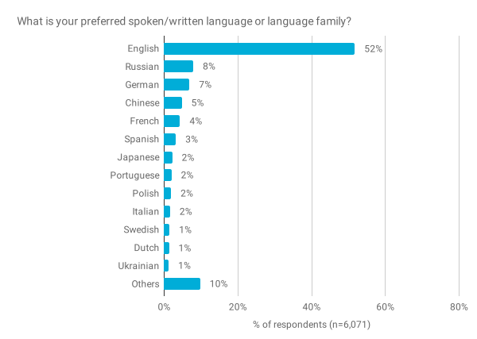

We found 12% of respondents identify with a traditionally underrepresented group (e.g., ethnicity, gender identity, et al.) and 3% identify as female. (This question should have said “woman” instead of “female”. The mistake has been corrected in our draft survey for 2020, and we apologize for it.) We strongly suspect this 3% is undercounting women in the Go community. For example, we know women software developers in the US respond to the StackOverflow Developer Survey at [about half the rate we’d expect based on US employment figures](https://insights.stackoverflow.com/survey/2019#developer-profile-_-developer-type) (11% vs 20%). Since we don’t know the proportion of responses in the US, we can’t safely extrapolate from these numbers beyond saying the actual proportion is likely higher than 3%. Furthermore, GDPR required us to change how we ask about sensitive information, which includes gender and traditionally underrepresented groups. Unfortunately these changes prevent us from being able to make valid comparisons of these numbers with prior years.

我们发现12%的受访者认同传统上代表性不足的群体（如种族、性别认同等），3%的受访者认同为女性。 这个问题应该说是 "女性 "而不是 "女性"。这个错误已经在我们2020年的调查草案中得到纠正，我们对此表示道歉）。我们强烈怀疑这3%的比例是少算了Go界的女性。例如，我们知道美国的女性软件开发者对StackOverflow开发者调查的回应率大约是我们根据美国就业数据所预期的一半（11% vs 20%）。由于我们不知道美国的答复比例，我们不能安全地从这些数字中推断，只能说实际比例可能高于3%。此外，GDPR要求我们改变询问敏感信息的方式，其中包括性别和传统上代表不足的群体。不幸的是，这些变化使我们无法将这些数字与往年进行有效比较。

Respondents who identified with underrepresented groups or preferred not to answer this question showed higher rates of disagreement with the statement “I feel welcome in the Go community” (8% vs. 4%) than those who do not identify with an underrepresented group, highlighting the importance of our continued outreach efforts.

与那些不属于代表不足的群体的受访者相比，那些认同代表不足的群体或不愿意回答这个问题的受访者对 "我觉得自己在Go界很受欢迎 "这一说法的不认同率较高（8%对4%），这凸显了我们继续开展外联工作的重要性。

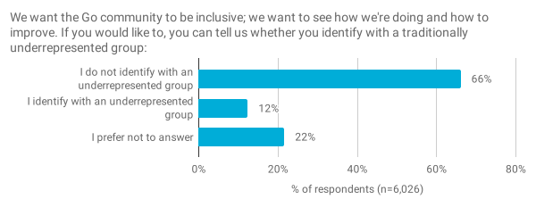

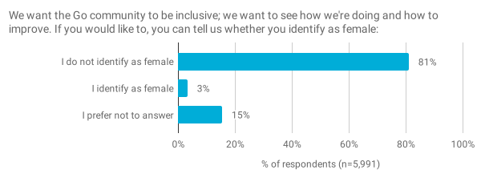

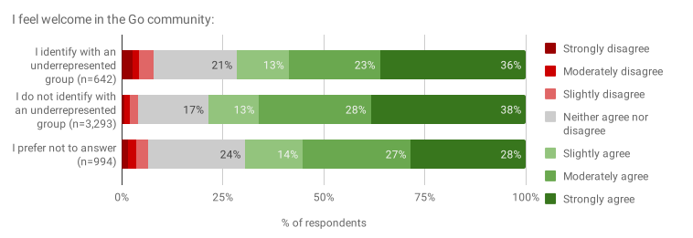

## Conclusion 总结

We hope you’ve enjoyed seeing the results of our 2019 developer survey. Understanding developers’ experiences and challenges helps us plan and prioritize work for 2020. Once again, an enormous thank you to everyone who contributed to this survey—your feedback is helping to steer Go’s direction in the coming year and beyond.

我们希望你喜欢看到我们2019年开发者调查的结果。了解开发者的经验和挑战有助于我们规划2020年的工作并确定优先次序。再次感谢为本次调查做出贡献的所有人--你们的反馈有助于引导Go在未来一年及以后的发展方向。
