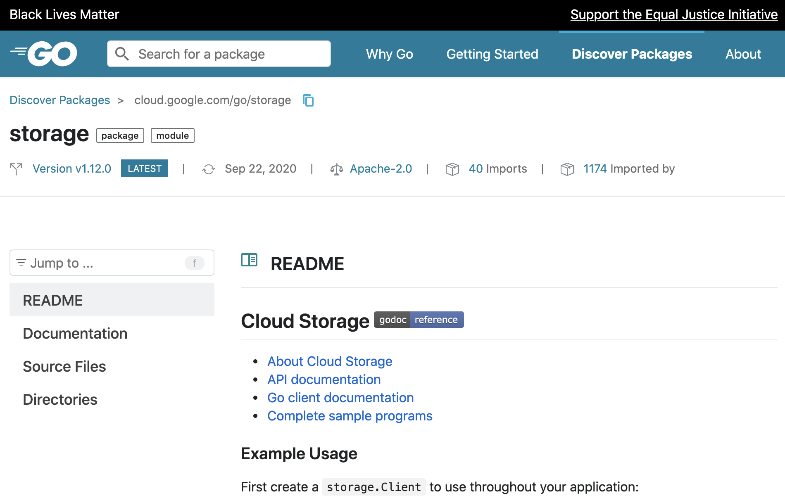

+++
title = "pkg.go.dev有了新的面貌!"
weight = 9
date = 2023-05-18T17:03:08+08:00
description = ""
isCJKLanguage = true
draft = false
+++

# Pkg.go.dev has a new look! - pkg.go.dev有了新的面貌!

https://go.dev/blog/pkgsite-redesign

Julie Qiu
10 November 2020

Since launching [pkg.go.dev](https://pkg.go.dev/), we’ve received a lot of great feedback on design and usability. In particular, it was clear that the way information was organized confused users when navigating the site.

自从推出pkg.go.dev以来，我们收到了很多关于设计和可用性的良好反馈。特别是，很明显，信息的组织方式让用户在浏览网站时感到困惑。

Today we’re excited to share a redesigned pkg.go.dev, which we hope will be clearer and more helpful. This blog post presents the highlights. For details, see [Go issue 41585](https://go.dev/issue/41585).

今天，我们很高兴与大家分享重新设计的pkg.go.dev，我们希望它能更清晰、更有帮助。这篇博文介绍了其中的亮点。详情请见 Go issue 41585。

## Consistent landing page for all paths 所有路径都有一致的登陆页面

The main change is that the pkg.go.dev/<path> page has been reorganized around the idea of a path. A path represents a directory in a particular version of a module. Now, regardless of what’s in that directory, every path page will have the same layout, with the goal of making the experience consistently useful and predictable.

主要的变化是，pkg.go.dev/<path>页面已经围绕路径的概念进行了重新组织。路径代表一个模块的特定版本中的一个目录。现在，无论该目录下有什么，每个路径页面都将有相同的布局，目的是使体验始终有用和可预测。

Landing page for cloud.google.com/go/storage

cloud.google.com/go/storage的登陆页面

Fig 1. Landing page for https://pkg.go.dev/cloud.google.com/go/storage.

图1. https://pkg.go.dev/cloud.google.com/go/storage 的登陆页面。

The path page will display the README at that path if there is one. Previously, the overview tab only showed the README if present at the module root. This is one of many changes we’re making to place the most important information up front.

如果有的话，路径页将显示该路径的README。以前，概览标签只显示模块根部的README。这是我们为把最重要的信息放在前面所做的许多改变之一。

## Documentation navigation 文档导航

The documentation section now displays an index along with a sidenav. This gives the ability to see the full package API, while having context as they are navigating the documentation section. There is also a new Jump To input box in the left sidenav, to search for identifiers.

文档部分现在显示一个索引和一个侧边导航。这使人们能够看到完整的包的API，同时在他们浏览文档部分时有一个背景。在左边的侧边栏也有一个新的Jump To输入框，可以搜索标识符。

Jump To feature navigating net/http

跳转到导航net/http的功能

Fig 2. Jump To feature on https://pkg.go.dev/net/http.

图2. https://pkg.go.dev/net/http 上的Jump To功能。

See [Go issue 41587](https://go.dev/issue/41587) for details on changes in the documentation section.

关于文档部分的变化，请参见Go issue 41587。

## Metadata on main page 主页面上的元数据

The top bar on each page now shows additional metadata, such as each package’s “imports” and “imported by” counts. Banners also show information about the latest minor and major versions of a module. See [Go issue 41588](https://go.dev/issue/41588) for details.

现在每个页面的顶栏都会显示额外的元数据，例如每个软件包的 "进口 "和 "进口国 "的数量。横幅也会显示模块的最新次要和主要版本的信息。详见 Go issue 41588。

Header metadata for github.com/russross/blackfriday

github.com/russross/blackfriday的标题元数据

Fig 3. Header metadata for https://pkg.go.dev/github.com/russross/blackfriday.

图3. https://pkg.go.dev/github.com/russross/blackfriday 的标头元数据。

## Video Walkthrough 视频演练

Last week at [Google Open Source Live](https://opensourcelive.withgoogle.com/events/go), we presented a walkthrough of the new site experience in our talk, [Level Up: Go Package Discovery and Editor Tooling](https://www.youtube.com/watch?v=n7ayE29b7QA&feature=emb_logo).

上周在Google Open Source Live上，我们在演讲《Level Up》中介绍了新网站的体验。Go软件包发现和编辑工具。

<iframe src="https://www.youtube.com/embed/n7ayE29b7QA" width="650" height="400" frameborder="0" allowfullscreen="" mozallowfullscreen="" webkitallowfullscreen="" style="box-sizing: border-box;"></iframe>

## Feedback 反馈

We’re excited to share this updated design with you. As always, please let us know what you think via the “Share Feedback” and “Report an Issue” links at the bottom of every page of the site.

我们很高兴能与您分享这一更新的设计。像往常一样，请通过网站每个页面底部的 "分享反馈 "和 "报告问题 "链接让我们了解您的想法。

And if you’re interested in contributing to this project, pkg.go.dev is open source! Check out the [contribution guidelines](https://go.googlesource.com/pkgsite/+/refs/heads/master/CONTRIBUTING.md) to find out more.

如果你有兴趣为这个项目做出贡献，pkg.go.dev是开放源代码的。请查看贡献指南以了解更多信息。
