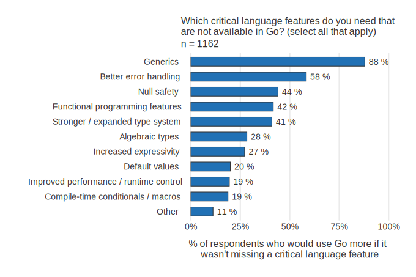

+++
title = "2020年 go 开发者调查结果"
weight = 87
date = 2023-05-18T17:03:08+08:00
description = ""
isCJKLanguage = true
draft = false
+++

# Go Developer Survey 2020 Results - 2020年 go 开发者调查结果

https://go.dev/blog/survey2020-results

Alice Merrick
9 March 2021

## Thank you for the amazing response! 感谢您们的惊人回应！

In 2020, we had another great turnout with 9,648 responses, about [as many as 2019](https://blog.golang.org/survey2019-results). Thank you for putting in the time to provide the community with these insights on your experiences using Go!

在2020年，我们又有了很大的收获，有9,648份回复，和2019年差不多多。感谢您们花时间为社区提供这些关于您们使用Go的经验的见解

## New modular survey design 新的模块化调查设计

You may notice some questions have smaller sample sizes ("n=") than others. That’s because some questions were shown to everyone while others were only shown to a random subset of respondents.

您可能注意到有些问题的样本量（"n="）比其他问题小。这是因为有些问题是向所有人展示的，而有些问题只向随机的受访者子集展示。

## Highlights 亮点

- Go usage is expanding in the workplace and enterprise with 76% of respondents using [Go at work](https://go.dev/blog/survey2020-results#TOC_4.1) and 66% saying [Go is critical to their company’s success](https://go.dev/blog/survey2020-results#TOC_6.1).Go在工作场所和企业中的使用正在扩大，76%的受访者在工作中使用Go，66%的人说Go对他们公司的成功至关重要。
- [Overall satisfaction](https://go.dev/blog/survey2020-results#TOC_6.) is high with 92% of respondents being satisfied using Go.总体满意度很高，92%的受访者对使用Go感到满意。
- The majority of [respondents felt productive](https://go.dev/blog/survey2020-results#TOC_6.2) in Go in less than 3 months, with 81% feeling very or extremely productive in Go.大多数受访者在不到3个月的时间里感觉到了Go的生产力，81%的受访者感觉Go的生产力非常高或非常高。
- Respondents reported [upgrading promptly to the latest Go version](https://go.dev/blog/survey2020-results#TOC_7.), with 76% in the first 5 months.受访者表示会及时升级到最新的Go版本，76%的受访者在头5个月就升级了。
- [Respondents using pkg.go.dev are more successful (91%)](https://go.dev/blog/survey2020-results#TOC_12.) at finding Go packages than non-users (82%).使用pkg.go.dev的受访者比非用户（82%）更成功地找到Go软件包（91%）。
- Go [modules adoption is nearly universal](https://go.dev/blog/survey2020-results#TOC_8.) with 77% satisfaction, but respondents also highlight a need for improved docs.Go模块的采用几乎是普遍的，有77%的满意度，但受访者也强调了对改进文档的需求。
- Go continues to be heavily used for [APIs, CLIs, Web, DevOps & Data Processing](https://go.dev/blog/survey2020-results#TOC_7.).Go继续被大量用于API、CLI、Web、DevOps和数据处理。
- [Underrepresented groups](https://go.dev/blog/survey2020-results#TOC_12.1) tend to feel less welcome in the community.代表性不足的群体往往感到在社区中不太受欢迎。

## Who did we hear from? 我们听取了谁的意见？

Demographic questions help us distinguish which year-over-year differences may result from changes in who responded to the survey versus changes in sentiment or behavior. Because our demographics are similar to last year, we can be reasonably confident that other year-over-year changes aren’t primarily due to demographic shifts.

人口统计学问题有助于我们区分哪些年与年之间的差异可能是由响应调查的人的变化与情绪或行为的变化造成的。由于我们的人口统计学与去年相似，我们可以有理由相信，其他同比变化主要不是由于人口统计学的变化。

For example, the distribution of organization sizes, developer experience, and industries remained about the same from 2019 to 2020.

例如，从2019年到2020年，组织规模、开发人员经验和行业的分布基本保持不变。

  

Bar chart of organization size for 2019 to 2020 where the majority have fewer than 1000 employees Bar chart of years of professional experience for 2019 to 2020 with the majority having 3 to 10 years of experience Bar chart of organization industries for 2019 to 2020 with the majority in Technology

2019年至2020年的组织规模柱状图，其中大多数员工少于1000人 2019年至2020年的专业经验年限柱状图，大多数有3至10年的经验 2019年至2020年的组织行业柱状图，大多数在技术领域

Almost half (48%) of respondents have been using Go for less than two years. In 2020, we had fewer responses from those using Go for less than a year.

几乎一半（48%）的受访者使用Go的时间不到两年。在2020年，我们从使用Go不到一年的人那里得到的答复较少。

Bar chart of years of experience using Go

使用Go的年限柱状图

Majorities said they use Go at work (76%) and outside of work (62%). The percentage of respondents using Go at work has been trending up each year.

大多数人说他们在工作中（76%）和在工作之外（62%）使用Go。在工作中使用Go的受访者比例每年都有上升的趋势。

在工作中或工作之外使用Go的条形图

This year we introduced a new question on primary job responsibilities. We found that 70% of respondents’ primary responsibility is developing software and applications, but a significant minority (10%) are designing IT systems and architectures.

今年我们引入了一个关于主要工作职责的新问题。我们发现，70%的受访者的主要职责是开发软件和应用程序，但也有相当一部分人（10%）是设计IT系统和架构。

主要工作职责

As in prior years, we found that most respondents are not frequent contributors to Go open-source projects, with 75% saying they do so "infrequently" or "never".

与往年一样，我们发现大多数受访者并不经常为Go开源项目做贡献，75%的人表示他们 "不经常 "或 "从不 "这样做。

How often respondents contribute to open source projects written in Go from 2017 to 2020 where results remain about the same each year and only 7% contribute daily

从2017年到2020年，受访者对用Go编写的开源项目的贡献频率，其中每年的结果基本相同，只有7%的人每天贡献

## Developer tools and practices 开发者工具和实践

As in prior years, the vast majority of survey respondents reported working with Go on Linux (63%) and macOS (55%) systems. The proportion of respondents who primarily develop on Linux appears to be slightly trending down over time.

与往年一样，绝大部分调查对象表示在Linux（63%）和macOS（55%）系统上使用Go。主要在Linux上开发的受访者的比例似乎随着时间的推移略有下降的趋势。

Primary operating system from 2017 to 2020

2017年至2020年的主要操作系统

For the first time, editor preferences appear to have stabilized: VS Code remains the most preferred editor (41%), with GoLand a strong second (35%). Together these editors made up 76% of responses, and other preferences did not continue to decrease as they had in previous years.

第一次，编辑器的偏好似乎已经稳定下来。VS Code仍然是最受欢迎的编辑器（41%），GoLand是第二位（35%）。这些编辑器加起来占了76%的回复，其他偏好没有像前几年那样继续减少。

Editor preferences from 2017 to 2020

2017年至2020年的编辑偏好

This year we asked respondents to prioritize improvements to their editor by how much they would hypothetically spend if they had 100 "GopherCoins" (a fictional currency). Code completion received the highest average number of GopherCoins per respondent. Half of respondents gave the top 4 features (code completion, navigating code, editor performance and refactoring) 10 or more coins.

今年，我们要求受访者按照如果他们有100个 "GopherCoins"（一种虚构的货币），他们假设会花多少钱来优先考虑对编辑器的改进。每个受访者的代码完成度获得了最高的平均GopherCoins数量。一半的受访者给了前4个功能（代码完成、代码导航、编辑器性能和重构）10个或更多硬币。

Bar char of average number of GopherCoins spent per respondent

每个受访者平均花费的GopherCoins数量的条形图

A majority of respondents (63%) spend 10–30% of their time refactoring, suggesting that this is a common task and we want to investigate ways to improve it. It also explains why refactoring support was one of the most-funded editor improvements.

大多数受访者（63%）花了10-30%的时间进行重构，这表明这是一项常见的任务，我们要研究如何改进它。这也解释了为什么重构支持是资金最多的编辑器改进之一。

Bar chart of time spent refactoring

重构时间的柱状图

Last year we asked about specific developer techniques and found that almost 90% of respondents were using text logging for debugging, so this year we added a follow-up question to find out why. Results show that 43% use it because it allows them to use the same debugging strategy across different languages, and 42% prefer to use text logging over other debugging techniques. However, 27% don’t know how to get started with Go’s debugging tools and 24% have never tried using Go’s debugging tools, so there’s an opportunity to improve the debugger tooling in terms of discoverability, usability and documentation. Additionally, because a quarter of respondents have never tried using debugging tools, pain points may be underreported.

去年我们询问了具体的开发者技术，发现几乎90%的受访者都在使用文本记录进行调试，所以今年我们增加了一个后续问题来了解原因。结果显示，43%的人使用它是因为它允许他们在不同的语言中使用相同的调试策略，42%的人喜欢使用文本日志而不是其他调试技术。然而，27%的人不知道如何开始使用Go的调试工具，24%的人从未尝试过使用Go的调试工具，因此在可发现性、可用性和文档方面有机会改善调试器工具。此外，由于四分之一的受访者从未尝试过使用调试工具，所以痛点可能被低估了。

## Sentiments towards Go 对Go的感情

For the first time, this year we asked about overall satisfaction. 92% of respondents said they were very or somewhat satisfied using Go during the past year.

今年，我们首次询问了总体满意度。92%的受访者表示他们在过去一年中对Go的使用非常满意或比较满意。

Bar chart of overall satisfaction on a 5 points scale from very dissatisfied to very satisfied

总体满意度柱状图，从非常不满意到非常满意的5分制。

This is the 3rd year we’ve asked the "Would you recommend…" [Net Promoter Score](https://en.wikipedia.org/wiki/Net_Promoter) (NPS) question. This year our NPS result is a 61 (68% "promoters" minus 6% "detractors"), statistically unchanged from 2019 and 2018.

这是我们第三年询问 "您是否会推荐...... "的问题。Net Promoter Score（NPS）问题。今年我们的NPS结果是61分（68%的 "促进者 "减去6%的 "反对者"），与2019年和2018年相比，统计上没有变化。

Stacked bar chart of promoters, passives, and detractors

推动者、被动者和诋毁者的堆积条形图

Similar to previous years, 91% of respondents said they would prefer to use Go for their next new project. 89% said Go is working well for their team. This year we saw an increase in respondents who agreed that Go is critical to their company’s success from 59% in 2019 to 66% in 2020. Respondents working at organizations of 5,000 or more employees were less likely to agree (63%), while those at smaller organizations were more likely to agree (73%).

与往年类似，91%的受访者表示他们更愿意在下一个新项目中使用Go。89%的人说Go对他们的团队来说效果不错。今年，我们看到同意Go对他们公司的成功至关重要的受访者从2019年的59%增加到2020年的66%。在5000名或更多员工的组织工作的受访者不太可能同意（63%），而在较小的组织工作的受访者则更可能同意（73%）。

Bar chart of agreement with statements I would prefer to use Go for my next project, Go is working well for me team, 89%, and Go is critical to my company's success

我更愿意在我的下一个项目中使用Go，Go对我的团队来说运行良好，89%，Go对我公司的成功至关重要等说法的同意率条形图

Like last year, we asked respondents to rate specific areas of Go development according to satisfaction and importance. Satisfaction with using cloud services, debugging, and using modules (areas that last year were highlighted as opportunities for improvement) increased while most importance scores remained about the same. We also introduced a couple new topics: API and Web frameworks. We see that web frameworks satisfaction is lower than other areas (64%). It wasn’t as critically important to most current users (only 28% of respondents said it was very or critically important), but it could be a missing critical feature for would-be Go developers.

和去年一样，我们要求受访者根据满意度和重要性对Go开发的具体领域进行评分。对使用云服务、调试和使用模块（去年被强调为改进机会的领域）的满意度有所提高，而大多数重要性得分保持不变。我们还引入了几个新的主题。API和网络框架。我们看到，网络框架的满意度低于其他领域（64%）。对于大多数当前用户来说，它并不那么关键（只有28%的受访者说它非常重要或关键重要），但对于未来的Go开发者来说，它可能是一个缺失的关键功能。

Bar chart of satisfaction with aspects of Go from 2019 to 2020, showing highest satisfaction with build speed, reliability and using concurrency and lowest with web frameworks

2019年至2020年对Go各方面的满意度条形图，显示对构建速度、可靠性和使用并发性的满意度最高，对网络框架的满意度最低。

81% of respondents said they felt very or extremely productive using Go. Respondents at larger organizations were more likely to feel extremely productive than those at smaller organizations.

81%的受访者表示，他们使用Go感到非常或非常有成效。大型组织的受访者比小型组织的受访者更有可能感到非常有成效。

Stacked bar chart of perceived productivity on 5 point scale from not all to extremely productive 

叠加的生产力条形图，以5点为单位，从不是全部到极高的生产力。

We’ve heard anecdotally that it’s easy to become productive quickly with Go. We asked respondents who felt at least slightly productive how long it took them to become productive. 93% said it took less than one year, with the majority feeling productive within 3 months.

我们从轶事中得知，使用Go很容易迅速提高生产力。我们问那些觉得至少有一点生产力的受访者，他们花了多长时间来提高生产力。93%的人说他们花了不到一年的时间，大多数人在3个月内感觉到了生产力。

Bar chart of length of time before feeling productive

感觉有成效之前的时间长度柱状图

Although about the same as last year, the percentage of respondents who agreed with the statement "I feel welcome in the Go community" appears to be trending down over time, or at least not holding to the same upward trends as other areas.

尽管与去年差不多，同意 "我在Go界感到受欢迎 "这一说法的受访者比例似乎随着时间的推移呈下降趋势，或者至少没有像其他领域那样保持上升趋势。

We’ve also seen a significant year-over-year increase in the proportion of respondents who feel Go’s project leadership understands their needs (63%).

我们还看到，认为Go项目领导层了解其需求的受访者比例（63%）也在逐年大幅上升。

All of these results show a pattern of higher agreement correlated with increased Go experience, beginning at about two years. In other words, the longer a respondent has been using Go, the more likely they were to agree with each of these statements.

所有这些结果都显示出一种模式，即从两年左右开始，较高的认同度与Go经验的增加相关。换句话说，受访者使用Go的时间越长，他们就越有可能同意这些陈述的内容。

Bar chart showing agreement with statements I feel welcome in the Go community, I am confident in the Go leadership, I feel welcome to contribute, The Go project leadership understands my needs, and The process of contributing to the Go project is clear to me

条形图显示了对以下陈述的同意程度：我觉得自己在Go社区很受欢迎，我对Go领导层很有信心，我觉得自己可以做出贡献，Go项目领导层了解我的需求，以及我对Go项目的贡献过程很清楚。

We asked an open text question on what we could do to make the Go community more welcoming and the most common recommendations (21%) were related to different forms of or improvements/additions to learning resources and documentation.

我们提出了一个开放性的文本问题，即我们可以做些什么来使Go社区更受欢迎，最常见的建议（21%）与不同形式的或改进/增加的学习资源和文件有关。

Bar chart of recommendations for improving the welcomeness of the Go community

改善Go社区欢迎度的建议条形图

## Working with Go 使用Go的工作

Building API/RPC services (74%) and CLIs (65%) remain the most common uses of Go. We don’t see any significant changes from last year, when we introduced randomization into the ordering of options. (Prior to 2019, options towards the beginning of the list were disproportionately selected.) We also broke this out by organization size and found that respondents use Go similarly at large enterprises or smaller organizations, although large orgs are a little less likely to use Go for web services returning HTML.

构建API/RPC服务（74%）和CLI（65%）仍然是Go的最常见用途。与去年相比，我们没有看到任何重大变化，当时我们在选项的排序中引入了随机化。(在2019年之前，列表开头的选项被选中的比例过高）。我们还按组织规模进行了细分，发现受访者在大型企业或小型组织中使用Go的情况类似，尽管大型组织使用Go进行网络服务返回HTML的可能性稍低。

Bar chart of Go use cases from 2019 to 2020 including API or RPC services, CLIs, frameworks, web services, automation, agents and daemons, data processing, GUIs, games and mobile apps

2019年至2020年Go使用案例柱状图，包括API或RPC服务、CLI、框架、网络服务、自动化、代理和守护进程、数据处理、GUI、游戏和移动应用

This year we now have a better understanding of which kinds of software respondents write in Go at home versus at work. Although web services returning HTML is the 4th most common use case, this is due to non-work related use. More respondents use Go for automation/scripts, agents and daemons, and data processing for work than web services returning HTML. A greater proportion of the least common uses (desktop/GUI apps, games, and mobile apps) are being written outside of work.

今年，我们现在对受访者在家里与在工作中用Go编写的哪种软件有了更好的了解。尽管返回HTML的网络服务是第四大最常见的用例，但这是由于与工作无关的使用。与返回HTML的网络服务相比，更多的受访者将Go用于自动化/脚本、代理和守护程序，以及工作中的数据处理。在最不常见的用途（桌面/GUI应用程序、游戏和移动应用程序）中，在工作之外编写的比例更大。

Stacked bar charts of proportion of use case is at work, outside of work, or both 

堆叠的条形图显示了工作中、工作外或两者的用例比例 

Another new question asked how satisfied respondents were for each use case. CLIs had the highest satisfaction, with 85% of respondents saying they were very, moderately or slightly satisfied using Go for CLIs. Common uses for Go tended to have higher satisfaction scores, but satisfaction and popularity don’t perfectly correspond. For example, agents and daemons has 2nd highest proportion of satisfaction but it’s 6th in usage.

另一个新问题是问受访者对每个用例的满意程度。CLI的满意度最高，85%的受访者表示他们对在CLI中使用Go感到非常、一般或略为满意。Go的常见用途往往有更高的满意度，但满意度和受欢迎程度并不完全对应。例如，代理和守护进程的满意度占第二位，但它的使用率却占第六位。

Bar chart of satisfaction with each use case

每个用例的满意度条形图

Additional follow-up questions explored different use cases, for example, which platforms respondents target with their CLIs. It’s not surprising to see Linux (93%) and macOS (59%) highly represented, given the high developer use of Linux and macOS and high Linux cloud usage), but even Windows is targeted by almost a third of CLI developers.

额外的后续问题探讨了不同的使用情况，例如，受访者用他们的CLI针对哪些平台。鉴于开发者对Linux和macOS的高使用率以及Linux云计算的高使用率，看到Linux（93%）和macOS（59%）的高度代表性并不令人惊讶，但甚至Windows也被几乎三分之一的CLI开发者所瞄准。

Bar chart of platforms being targeted for CLIs

CLI的目标平台柱状图

A closer look at Go for data processing showed that Kafka is the only broadly adopted engine, but a majority of respondents said they use Go with a custom data processing engine.

仔细观察Go的数据处理，发现Kafka是唯一被广泛采用的引擎，但大多数受访者表示，他们使用Go的时候有一个自定义的数据处理引擎。

Bar chart of data processing engines used by those who use Go for data processing

使用Go进行数据处理的人使用的数据处理引擎条形图

We also asked about larger areas in which respondents work with Go. The most common area by far was web development (68%), but other common areas included databases (46%), DevOps (42%) network programming (41%) and systems programming (40%).

我们还询问了受访者使用Go工作的较大领域。到目前为止，最常见的领域是网页开发（68%），但其他常见的领域包括数据库（46%）、DevOps（42%）网络编程（41%）和系统编程（40%）。

Bar chart of the kind of work where Go is being used

使用Go的工作种类柱状图

Similar to last year, we found that 76% of respondents evaluate the current Go release for production use, but this year we refined our time scale and found that 60% begin evaluating a new version before or within 2 months of release. This highlights the importance for platform-as-a-service providers to quickly support new stable releases of Go.

与去年类似，我们发现76%的受访者评估当前Go版本用于生产，但今年我们完善了时间尺度，发现60%的人在新版本发布前或发布后2个月内开始评估。这凸显了平台即服务提供者快速支持新的稳定版Go的重要性。

Bar chart of how soon respondents begin evaluating a new Go release

受访者开始评估新Go版本的时间条形图

## Modules 模块

This year we found near-universal adoption for Go modules, and a significant increase in the proportion of respondents who only use modules for package management. 96% of respondents said they were using modules for package management, up from 89% last year. 87% of respondents said they were using *only* modules for package management, up from 71% last year. Meanwhile, the use of other package management tools has decreased.

今年，我们发现Go模块几乎被普遍采用，而只使用模块进行包管理的受访者的比例也有显著增加。96%的受访者表示他们正在使用模块进行包管理，比去年的89%高。87%的受访者说他们只使用模块进行包管理，高于去年的71%。同时，对其他软件包管理工具的使用有所减少。

Bar chart of methods used for Go package management

用于Go软件包管理的方法条形图

Satisfaction with modules also increased from last year. 77% of respondents said they were very, moderately or slightly satisfied with modules, compared to 68% in 2019.

对模块的满意度也比去年有所提高。77%的受访者表示，他们对模块非常满意、中度满意或略微满意，而2019年为68%。

Stacked bar chart of satisfaction with using modules on a 7 point scale from very dissatisfied to very satisfied

对使用模块的满意度的堆积条形图，从非常不满意到非常满意的7分制

## Official documentation 官方文件

Most respondents said they struggle with official documentation. 62% of respondents struggle to find enough information to fully implement a feature of their application and over a third have struggled to get started with something they haven’t done before.

大多数受访者表示，他们在官方文件方面很挣扎。62%的受访者努力寻找足够的信息来完全实现他们的应用程序的功能，超过三分之一的受访者在开始使用他们以前没有做过的东西时感到很费劲。

Bar chart of struggles using official Go documentation

使用Go官方文档的挣扎的柱状图

The most problematic areas of official documentation were on using modules and CLI development, with 20% of respondents finding modules documentation slightly or not at all helpful, and 16% for documentation around CLI development.

官方文档中最有问题的领域是使用模块和CLI开发，20%的受访者认为模块文档稍有帮助或完全没有帮助，16%的人认为围绕CLI开发的文档有帮助。

Stacked bar charts on helpfulness of specific areas of documentation including using modules, CLI tool development, error handling, web service development, data access, concurrency and file input/output, rated on a 5 point scale from not at all to very helpful

堆积的条形图显示了特定领域文档的帮助性，包括使用模块、CLI工具开发、错误处理、网络服务开发、数据访问、并发性和文件输入/输出，评分标准为5分，从完全没有帮助到非常有帮助。

## Go in the clouds 云中的 Go

Go was designed with modern distributed computing in mind, and we want to continue to improve the developer experience of building cloud services with Go.

Go的设计考虑到了现代分布式计算，我们希望继续改善开发者用Go构建云服务的体验。

- The three largest global cloud providers (Amazon Web Services, Google Cloud Platform, and Microsoft Azure) continue to increase in usage among survey respondents, while most other providers are used by a smaller proportion of respondents each year. Azure in particular had a significant increase from 7% to 12%.全球三大云计算供应商（亚马逊网络服务、谷歌云平台和微软Azure）在调查对象中的使用率持续上升，而其他大多数供应商的使用比例每年都在减少。特别是Azure，从7%大幅增加到12%。
- On-prem deployments to self-owned or company-owned servers continue to decrease as the most common deployment targets.作为最常见的部署目标，内部部署到自我拥有或公司拥有的服务器上的情况继续减少。

Bar chart of cloud providers used to deploy Go programs where AWS is the most common at 44%

用于部署Go程序的云供应商条形图，其中AWS是最常见的，占44%。

Respondents deploying to AWS and Azure saw increases in deploying to a managed Kubernetes platform, now at 40% and 54%, respectively. Azure saw a significant drop in the proportion of users deploying Go programs to VMs and some growth in container usage from 18% to 25%. Meanwhile, GCP (which already had a high proportion of respondents reporting managed Kubernetes use) saw some growth in deploying to serverless Cloud Run from 10% to 17%.

部署到AWS和Azure的受访者在部署到管理的Kubernetes平台方面出现了增长，现在分别为40%和54%。Azure将Go程序部署到虚拟机上的用户比例大幅下降，而容器的使用则从18%增长到25%。同时，GCP（已经有很高比例的受访者报告管理Kubernetes的使用）在部署到无服务器的云运行方面有一些增长，从10%到17%。

Bar charts of proportion of services being used with each provider

各供应商使用的服务比例柱状图

Overall, a majority of respondents were satisfied with using Go on all three major cloud providers, and the figures are statistically unchanged from last year. Respondents reported similar satisfaction levels with Go development for AWS (82% satisfied) and GCP (80%). Azure received a lower satisfaction score (58% satisfied), and free-text responses often cited a need for improvements to Azure’s Go SDK and Go support for Azure functions.

总的来说，大多数受访者对在所有三个主要云供应商上使用Go感到满意，这些数字与去年相比在统计上没有变化。受访者表示对AWS（82%满意）和GCP（80%）的Go开发的满意程度相似。Azure的满意度较低（58%满意），自由文本回复中经常提到需要改进Azure的Go SDK和Go对Azure函数的支持。

Stacked bar chart of satisfaction with using Go with AWS, GCP and Azure

在AWS、GCP和Azure上使用Go的满意度堆叠条形图

## Pain points 痛点

The top reasons respondents say they are unable to use Go more remain working on a project in another language (54%), working on a team that prefers to use another language (34%), and the lack of a critical feature in Go itself (26%).

受访者说他们无法更多使用Go的首要原因仍然是在用另一种语言进行项目工作（54%），在一个喜欢使用另一种语言的团队工作（34%），以及Go本身缺乏关键功能（26%）。

This year we introduced a new option, "I already use Go everywhere I would like to," so that respondents could opt out of making selections that don’t prevent them from using Go. This significantly lowered the rate of selection of all other options, but did not change their relative ordering. We also introduced an option for "Go lacks critical frameworks".

今年我们引入了一个新的选项，"我已经在所有我想使用的地方使用Go"，这样受访者就可以选择不做那些不妨碍他们使用Go的选择。这大大降低了所有其他选项的选择率，但并没有改变它们的相对排序。我们还引入了一个 "Go缺乏关键框架 "的选项。

If we look at only the respondents who selected reasons for not using Go, we can get a better idea of year-over-year trends. Working on an existing project in another language and project/team/lead preference for another language are decreasing over time.

如果我们只看选择不使用Go的原因的受访者，我们可以更好地了解同比的趋势。在另一种语言的现有项目中工作以及项目/团队/领导对另一种语言的偏好随着时间的推移而减少。

Bar charts of reasons preventing respondents from using Go more

阻碍受访者更多使用Go的原因柱状图

Among the 26% of respondents who said Go lacks language features they need, 88% selected generics as a critical missing feature. Other critical missing features were better error handling (58%), null safety (44%), functional programming features(42%) and a stronger / expanded type system (41%).

在26%的受访者表示Go缺乏他们需要的语言功能中，88%的人选择泛型作为关键的缺失功能。其他重要的缺失功能是更好的错误处理（58%），空值安全（44%），函数式编程功能（42%）和更强大/扩展的类型系统（41%）。

To be clear, these numbers are from the subset of respondents who said they would be able to use Go more were it not missing one or more critical features they need, not the entire population of survey respondents. To put that in perspective, 18% of respondents are prevented from using Go because of a lack of generics.

明确地说，这些数字是来自于那些说如果Go不缺少他们需要的一个或多个关键功能，他们就会更多地使用Go的受访者，而不是整个调查对象。从这个角度来看，18%的受访者因为缺乏泛型而无法使用Go。

Bar chart of missing critical features

缺少关键功能的柱状图

The top challenge respondents reported when using Go was again Go’s lack of generics (18%), while modules/package management and problems with learning curve/best practices/docs were both 13%.

受访者在使用Go时报告的最大挑战还是Go缺乏泛型（18%），而模块/包管理和学习曲线/最佳实践/文档方面的问题都是13%。

Bar chart of biggest challenges respondents face when using Go

受访者在使用Go时面临的最大挑战条形图

## The Go community Go社区

This year we asked respondents for their top 5 resources for answering their Go-related questions. Last year we only asked for top 3, so the results aren’t directly comparable, however, StackOverflow remains the most popular resource at 65%. Reading source code (57%) remains another popular resource while reliance on godoc.org (39%) has significantly decreased. The package discovery site pkg.go.dev is new to the list this year and was a top resource for 32% of respondents. Respondents who use pkg.go.dev are more likely to agree they are able to quickly find Go packages / libraries they need: 91% for pkg.go.dev users vs. 82% for everyone else.

今年，我们要求受访者提供他们回答与Go相关问题的前5个资源。去年我们只问了前三名，所以结果没有直接的可比性，不过，StackOverflow仍然是最受欢迎的资源，占65%。阅读源代码（57%）仍然是另一个受欢迎的资源，而对godoc.org的依赖（39%）则明显减少。软件包发现网站pkg.go.dev是今年新上榜的，是32%的受访者的首要资源。使用pkg.go.dev的受访者更有可能同意他们能够快速找到他们需要的Go软件包/库。91%的pkg.go.dev用户与82%的其他用户。

Bar chart of top 5 resources respondents use to answer Go-related questions

受访者用来回答Go相关问题的前5个资源柱状图

Over the years, the proportion of respondents who do not attend any Go-related events has been trending up. Due to Covid-19, this year we modified our question around Go events, and found over a quarter of respondents have spent more time in online Go channels than in prior years, and 14% attended a virtual Go meetup, twice as many as last year. 64% of those who attended a virtual event said this was their first virtual event.

多年来，不参加任何Go相关活动的受访者比例一直呈上升趋势。由于Covid-19的原因，今年我们修改了围绕Go活动的问题，发现超过四分之一的受访者比往年花更多时间在网上Go渠道，14%的人参加了虚拟Go聚会，是去年的两倍。64%参加过虚拟活动的人说这是他们第一次参加虚拟活动。

Bar chart of respondents participation in online channels and events

受访者参与在线渠道和活动的柱状图

We found 12% of respondents identify with a traditionally underrepresented group (e.g., ethnicity, gender identity, et al.), the same as 2019, and 2% identify as women, fewer than in 2019 (3%). Respondents who identified with underrepresented groups showed higher rates of disagreement with the statement "I feel welcome in the Go community" (10% vs. 4%) than those who do not identify with an underrepresented group. These questions allow us to measure diversity in the community and highlight opportunities for outreach and growth.

我们发现12%的受访者认同传统上代表性不足的群体（如种族、性别认同等），与2019年相同，2%的人认同女性，比2019年少（3%）。与不认同代表不足的群体的受访者相比，认同代表不足的群体的受访者对 "我在Go界感到受欢迎 "这一说法的不认同率更高（10%对4%）。这些问题使我们能够衡量社区的多样性，并突出宣传和发展的机会。

  

Bar chart of underrepresented groups Bar chart of those who identify as women Bar chart of welcomeness of underrepresented groups

代表性不足的群体柱状图 代表性不足的群体的女性柱状图 代表性不足的群体的欢迎程度柱状图

We added an additional question this year on assistive technology usage, and found that 8% of respondents are using some form of assistive technology. The most commonly used assistive tech was contrast or color settings (2%). This is a great reminder that we have users with accessibility needs and helps drive some of our design decisions on websites managed by the Go team.

今年我们增加了一个关于辅助技术使用的问题，发现8%的受访者正在使用某种形式的辅助技术。最常使用的辅助技术是对比度或颜色设置（2%）。这很好地提醒了我们有无障碍需求的用户，有助于推动我们在Go团队管理的网站上的一些设计决策。

Bar chart of assistive technology usage

辅助技术使用情况柱状图

The Go team values diversity and inclusion, not simply as the right thing to do, but because diverse voices can illuminate our blindspots and ultimately benefit all users. The way we ask about sensitive information, including gender and traditionally underrepresented groups, has changed according to data privacy regulations and we hope to make these questions, particularly around gender diversity, more inclusive in the future.

Go团队重视多样性和包容性，不仅仅是因为这是一件正确的事情，还因为不同的声音可以照亮我们的盲点，最终使所有用户受益。我们询问敏感信息的方式，包括性别和传统上代表性不足的群体，已经根据数据隐私法规进行了改变，我们希望在未来使这些问题，特别是围绕性别多样性的问题，更具包容性。

## Conclusion 结语

Thank you for joining us in reviewing the results of our 2020 developer survey! Understanding developers’ experiences and challenges helps us measure our progress and directs the future of Go. Thanks again to everyone who contributed to this survey—we couldn’t have done it without you. We hope to see you next year!

感谢您和我们一起回顾2020年开发者调查的结果! 了解开发者的经验和挑战有助于我们衡量我们的进展，并指导Go的未来。再次感谢所有为这次调查做出贡献的人--没有您们，我们不可能做到这一点。我们希望明年再见到您!
