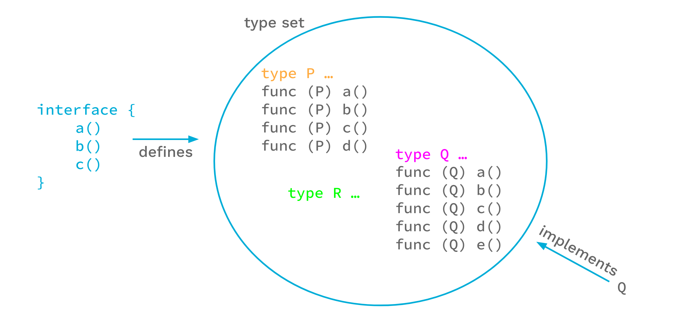

+++
title = "泛型简介"
weight = 96
date = 2023-05-18T17:03:08+08:00
description = ""
isCJKLanguage = true
draft = false
+++

# An Introduction To Generics - 泛型简介

https://go.dev/blog/intro-generics

Robert Griesemer and Ian Lance Taylor
22 March 2022

## Introduction 简介

This blog post is based on our talk at GopherCon 2021:

这篇博文是基于我们在2021年GopherCon上的演讲：

<iframe src="https://www.youtube.com/embed/Pa_e9EeCdy8" width="560" height="315" frameborder="0" allowfullscreen="" mozallowfullscreen="" webkitallowfullscreen="" style="box-sizing: border-box;"></iframe>

The Go 1.18 release adds support for generics. Generics are the biggest change we’ve made to Go since the first open source release. In this article we’ll introduce the new language features. We won’t try to cover all the details, but we will hit all the important points. For a more detailed and much longer description, including many examples, see the [proposal document](https://go.googlesource.com/proposal/+/HEAD/design/43651-type-parameters.md). For a more precise description of the language changes, see the [updated language spec](https://go.dev/ref/spec). (Note that the actual 1.18 implementation imposes some restrictions on what the proposal document permits; the spec should be accurate. Future releases may lift some of the restrictions.)

Go 1.18版本增加了对泛型的支持。泛型是Go自第一个开源版本以来所做的最大改变。在这篇文章中，我们将介绍新的语言特性。我们不会试图涵盖所有的细节，但我们会抓住所有重要的点。关于更详细和更长的描述，包括许多例子，请看提案文件。关于语言变化的更精确描述，请看更新的语言规范。(请注意，实际的1.18实现对提案文件所允许的内容施加了一些限制；该规范应该是准确的。未来的版本可能会取消一些限制）。

Generics are a way of writing code that is independent of the specific types being used. Functions and types may now be written to use any of a set of types.

泛型是一种编写代码的方式，它独立于正在使用的特定类型。函数和类型现在可以被写成使用一组类型中的任何一种。

Generics add three new big things to the language:

泛型在语言中增加了三个新的重要内容：

1. Type parameters for function and types.为函数和类型提供类型参数。
2. Defining interface types as sets of types, including types that don’t have methods.将接口类型定义为类型集，包括没有方法的类型。
3. Type inference, which permits omitting type arguments in many cases when calling a function.类型推理，它允许在许多情况下调用函数时省略类型参数。

## Type Parameters 类型参数

Functions and types are now permitted to have type parameters. A type parameter list looks like an ordinary parameter list, except that it uses square brackets instead of parentheses.

函数和类型现在被允许有类型参数。一个类型参数列表看起来就像一个普通的参数列表，只是它用方括号代替了小括号。

To show how this works, let’s start with the basic non-generic `Min` function for floating point values:

为了说明这一点，让我们从浮点值的基本非通用的Min函数开始：

```go linenums="1"
func Min(x, y float64) float64 {
    if x < y {
        return x
    }
    return y
}
```

We can make this function generic–make it work for different types–by adding a type parameter list. In this example we add a type parameter list with a single type parameter `T`, and replace the uses of `float64` with `T`.

我们可以通过添加一个类型参数列表来使这个函数通用化--使其适用于不同的类型。在这个例子中，我们用一个单一的类型参数T添加了一个类型参数列表，并用T代替float64的使用：

```go linenums="1"
import "golang.org/x/exp/constraints"

func GMin[T constraints.Ordered](x, y T) T {
    if x < y {
        return x
    }
    return y
}
```

It is now possible to call this function with a type argument by writing a call like

现在可以通过写一个类型参数来调用这个函数，例如

```go linenums="1"
x := GMin[int](2, 3)
```

Providing the type argument to `GMin`, in this case `int`, is called *instantiation*. Instantiation happens in two steps. First, the compiler substitutes all type arguments for their respective type parameters throughout the generic function or type. Second, the compiler verifies that each type argument satisfies the respective constraint. We’ll get to what that means shortly, but if that second step fails, instantiation fails and the program is invalid.

向GMin提供类型参数，在本例中是int，称为实例化。实例化分两步进行。首先，编译器在整个泛型函数或类型中把所有的类型参数替换成它们各自的类型参数。第二，编译器验证每个类型参数是否满足各自的约束条件。我们很快就会知道这意味着什么，但是如果第二步失败，实例化就会失败，程序就会无效。

After successful instantiation we have a non-generic function that can be called just like any other function. For example, in code like

在成功的实例化之后，我们有一个非通用的函数，可以像其他函数一样被调用。例如，在如下代码中

```go linenums="1"
fmin := GMin[float64]
m := fmin(2.71, 3.14)
```

the instantiation `GMin[float64]` produces what is effectively our original floating-point `Min` function, and we can use that in a function call.

GMin[float64]的实例化产生了一个有效的原始浮点Min函数，我们可以在函数调用中使用它。

Type parameters can be used with types also.

类型参数也可以与类型一起使用。

```go linenums="1"
type Tree[T interface{}] struct {
    left, right *Tree[T]
    value       T
}

func (t *Tree[T]) Lookup(x T) *Tree[T] { ... }

var stringTree Tree[string]
```

Here the generic type `Tree` stores values of the type parameter `T`. Generic types can have methods, like `Lookup` in this example. In order to use a generic type, it must be instantiated; `Tree[string]` is an example of instantiating `Tree` with the type argument `string`.

这里，通用类型Tree存储了类型参数T的值。通用类型可以有方法，就像本例中的Lookup。为了使用一个泛型，它必须被实例化；Tree[string]是一个用类型参数string来实例化Tree的例子。

## Type sets 类型集

Let’s look a bit deeper at the type arguments that can be used to instantiate a type parameter.

让我们更深入地看一下可以用来实例化类型参数的类型参数。

An ordinary function has a type for each value parameter; that type defines a set of values. For instance, if we have a `float64` type as in the non-generic function `Min` above, the permissible set of argument values is the set of floating-point values that can be represented by the `float64` type.

一个普通的函数对每个值参数都有一个类型；该类型定义了一个值集。例如，如果我们像上面的非通用函数Min那样有一个float64类型，那么允许的参数值集合就是可以由float64类型表示的浮点值集合。


Similarly, type parameter lists have a type for each type parameter. Because a type parameter is itself a type, the types of type parameters define sets of types. This meta-type is called a *type constraint*.

同样地，类型参数列表中的每个类型参数都有一个类型。因为类型参数本身就是一个类型，所以类型参数的类型定义了类型的集合。这种元类型被称为类型约束。


In the generic `GMin`, the type constraint is imported from the [constraints package](https://golang.org/x/exp/constraints). The `Ordered` constraint describes the set of all types with values that can be ordered, or, in other words, compared with the < operator (or <= , > , etc.). The constraint ensures that only types with orderable values can be passed to `GMin`. It also means that in the `GMin` function body values of that type parameter can be used in a comparison with the < operator.

在通用的GMin中，类型约束是从约束包中导入的。有序约束描述了所有类型的集合，这些类型的值可以被排序，或者换句话说，用<运算符（或<= , > , 等）进行比较。该约束确保只有具有可排序值的类型才能被传递给GMin。这也意味着在GMin的函数体中，该类型参数的值可以被用于与<运算符的比较。

In Go, type constraints must be interfaces. That is, an interface type can be used as a value type, and it can also be used as a meta-type. Interfaces define methods, so obviously we can express type constraints that require certain methods to be present. But `constraints.Ordered` is an interface type too, and the < operator is not a method.

在Go中，类型约束必须是接口。也就是说，一个接口类型可以作为一个值类型使用，也可以作为一个元类型使用。接口定义了方法，所以显然我们可以表达要求某些方法存在的类型约束。但是约束.Ordered也是一个接口类型，而且<操作符不是一个方法。

To make this work, we look at interfaces in a new way.

为了让这一点发挥作用，我们以一种新的方式来看待接口。

Until recently, the Go spec said that an interface defines a method set, which is roughly the set of methods enumerated in the interface. Any type that implements all those methods implements that interface.

直到最近，Go规范说，一个接口定义了一个方法集，大概就是接口中列举的方法集。任何实现了所有这些方法的类型都实现了该接口。


But another way of looking at this is to say that the interface defines a set of types, namely the types that implement those methods. From this perspective, any type that is an element of the interface’s type set implements the interface.

但另一种看法是，接口定义了一个类型集，即实现这些方法的类型。从这个角度看，任何作为接口类型集的一个元素的类型都实现了接口。



The two views lead to the same outcome: For each set of methods we can imagine the corresponding set of types that implement those methods, and that is the set of types defined by the interface.

这两种观点导致了相同的结果。对于每一组方法，我们都可以想象出实现这些方法的相应类型集，这就是接口所定义的类型集。

For our purposes, though, the type set view has an advantage over the method set view: we can explicitly add types to the set, and thus control the type set in new ways.

不过对于我们的目的来说，类型集的观点比方法集的观点更有优势：我们可以明确地将类型添加到集合中，从而以新的方式控制类型集。

We have extended the syntax for interface types to make this work. For instance, `interface{ int|string|bool }` defines the type set containing the types `int`, `string`, and `bool`.

我们已经扩展了接口类型的语法，以使其发挥作用。例如，interface{ int|string|bool }定义了包含int、string和bool这三种类型的类型集。


Another way of saying this is that this interface is satisfied by only `int`, `string`, or `bool`.

另一种说法是，这个接口只被int、string或bool所满足。

Now let’s look at the actual definition of `constraints.Ordered`:

现在我们来看看 constraints.Ordered 的实际定义：

```go linenums="1"
type Ordered interface {
    Integer|Float|~string
}
```

This declaration says that the `Ordered` interface is the set of all integer, floating-point, and string types. The vertical bar expresses a union of types (or sets of types in this case). `Integer` and `Float` are interface types that are similarly defined in the `constraints` package. Note that there are no methods defined by the `Ordered` interface.

这个声明说，Ordered接口是所有整数、浮点和字符串类型的集合。竖条表达的是类型的联合（或者在这里是类型的集合）。Integer和Float是接口类型，在约束包中也有类似的定义。注意，Ordered接口没有定义任何方法。

For type constraints we usually don’t care about a specific type, such as `string`; we are interested in all string types. That is what the `~` token is for. The expression `~string` means the set of all types whose underlying type is `string`. This includes the type `string` itself as well as all types declared with definitions such as `type MyString string`.

对于类型约束，我们通常不关心一个特定的类型，比如字符串；我们对所有的字符串类型感兴趣。这就是~标记的作用。表达式~string意味着底层类型为string的所有类型的集合。这包括string类型本身，以及所有用定义声明的类型，如type MyString string。

Of course we still want to specify methods in interfaces, and we want to be backward compatible. In Go 1.18 an interface may contain methods and embedded interfaces just as before, but it may also embed non-interface types, unions, and sets of underlying types.

当然，我们仍然想在接口中指定方法，而且我们想向后兼容。在Go 1.18中，一个接口可以像以前一样包含方法和嵌入接口，但它也可以嵌入非接口类型、联合体和底层类型的集合。

When used as a type constraint, the type set defined by an interface specifies exactly the types that are permitted as type arguments for the respective type parameter. Within a generic function body, if the type of a operand is a type parameter `P` with constraint `C`, operations are permitted if they are permitted by all types in the type set of `C` (there are currently some implementation restrictions here, but ordinary code is unlikely to encounter them).

当作为类型约束使用时，由接口定义的类型集准确地指定了允许作为各自类型参数的类型参数的类型。在一个通用函数体中，如果一个操作数的类型是带有约束C的类型参数P，那么如果操作被C的类型集中的所有类型所允许，那么这些操作就是允许的（目前这里有一些实现限制，但是普通的代码不太可能遇到这些限制）。

Interfaces used as constraints may be given names (such as `Ordered`), or they may be literal interfaces inlined in a type parameter list. For example:

用作约束的接口可以被赋予名称（比如Ordered），也可以是类型参数列表中的字面接口。比如说：

```go linenums="1"
[S interface{~[]E}, E interface{}]
```

Here `S` must be a slice type whose element type can be any type.

这里S必须是一个片断类型，其元素类型可以是任何类型。

Because this is a common case, the enclosing `interface{}` may be omitted for interfaces in constraint position, and we can simply write:

因为这是一种常见的情况，对于处于约束位置的接口，可以省略包围的interface{}，我们可以简单地写：

```go linenums="1"
[S ~[]E, E interface{}]
```

Because the empty interface is common in type parameter lists, and in ordinary Go code for that matter, Go 1.18 introduces a new predeclared identifier `any` as an alias for the empty interface type. With that, we arrive at this idiomatic code:

因为空接口在类型参数列表中很常见，在普通的Go代码中也是如此，Go 1.18引入了一个新的预先声明的标识符any作为空接口类型的别名。这样，我们就有了这样的习惯性代码：

```go linenums="1"
[S ~[]E, E any]
```

Interfaces as type sets is a powerful new mechanism and is key to making type constraints work in Go. For now, interfaces that use the new syntactic forms may only be used as constraints. But it’s not hard to imagine how explicitly type-constrained interfaces might be useful in general.

作为类型集的接口是一个强大的新机制，是使类型约束在Go中发挥作用的关键。目前，使用新语法形式的接口只能作为约束条件使用。但不难想象，明确的类型约束的接口在一般情况下是多么有用。

## Type inference 类型推理

The last new major language feature is type inference. In some ways this is the most complicated change to the language, but it is important because it lets people use a natural style when writing code that calls generic functions.

最后一个新的主要语言特性是类型推理。在某些方面，这是语言中最复杂的变化，但它很重要，因为它让人们在编写调用通用函数的代码时使用自然的风格。

### Function argument type inference 函数参数类型推断

With type parameters comes the need to pass type arguments, which can make for verbose code. Going back to our generic `GMin` function:

有了类型参数，就需要传递类型参数，这可能会使代码变得冗长。回到我们的通用GMin函数：

```go linenums="1"
func GMin[T constraints.Ordered](x, y T) T { ... }
```

the type parameter `T` is used to specify the types of the ordinary non-type arguments `x`, and `y`. As we saw earlier, this can be called with an explicit type argument

类型参数T被用来指定普通非类型参数x和y的类型。正如我们前面看到的，这可以用一个显式类型参数来调用

```go linenums="1"
var a, b, m float64

m = GMin[float64](a, b) // explicit type argument
```

In many cases the compiler can infer the type argument for `T` from the ordinary arguments. This makes the code shorter while remaining clear.

在许多情况下，编译器可以从普通参数中推断出T的类型参数。这使得代码更短，同时保持清晰。

```go linenums="1"
var a, b, m float64

m = GMin(a, b) // no type argument
```

This works by matching the types of the arguments `a` and `b` with the types of the parameters `x`, and `y`.

这通过将参数a和b的类型与参数x，和y的类型相匹配来实现。

This kind of inference, which infers the type arguments from the types of the arguments to the function, is called *function argument type inference*.

这种从函数的参数类型推断出参数类型的推理，被称为函数参数类型推理。

Function argument type inference only works for type parameters that are used in the function parameters, not for type parameters used only in function results or only in the function body. For example, it does not apply to functions like `MakeT[T any]() T`, that only uses `T` for a result.

函数参数类型推断只适用于在函数参数中使用的类型参数，不适用于只在函数结果中使用的类型参数或只在函数主体中使用的类型参数。例如，它不适用于像MakeT[T any]() T这样的函数，它只在结果中使用T。

### Constraint type inference 约束类型推理

The language supports another kind of type inference, *constraint type inference*. To describe this, let’s start with this example of scaling a slice of integers:

该语言支持另一种类型推理，即约束类型推理。为了描述这一点，让我们从缩放一个整数片的例子开始：

```go linenums="1"
// Scale returns a copy of s with each element multiplied by c.
// This implementation has a problem, as we will see.
func Scale[E constraints.Integer](s []E, c E) []E {
    r := make([]E, len(s))
    for i, v := range s {
        r[i] = v * c
    }
    return r
}
```

This is a generic function that works for a slice of any integer type.

这是一个通用函数，适用于任何整数类型的片断。

Now suppose that we have a multi-dimensional `Point` type, where each `Point` is simply a list of integers giving the coordinates of the point. Naturally this type will have some methods.

现在假设我们有一个多维的Point类型，其中每个Point只是一个给出点的坐标的整数列表。自然，这个类型会有一些方法。

```go linenums="1"
type Point []int32

func (p Point) String() string {
    // Details not important.
}
```

Sometimes we want to scale a `Point`. Since a `Point` is just a slice of integers, we can use the `Scale` function we wrote earlier:

有时我们想对一个点进行缩放。因为一个点只是一个整数切片，我们可以使用我们之前写的Scale函数：

```go linenums="1"
// ScaleAndPrint doubles a Point and prints it.
func ScaleAndPrint(p Point) {
    r := Scale(p, 2)
    fmt.Println(r.String()) // DOES NOT COMPILE
}
```

Unfortunately this does not compile, failing with an error like `r.String undefined (type []int32 has no field or method String)`.

不幸的是，这个函数不能编译，会出现r.String未定义的错误（type []int32 has no field or method String）。

The problem is that the `Scale` function returns a value of type `[]E` where `E` is the element type of the argument slice. When we call `Scale` with a value of type `Point`, whose underlying type is `[]int32`, we get back a value of type `[]int32`, not type `Point`. This follows from the way that the generic code is written, but it’s not what we want.

问题是Scale函数返回一个[]E类型的值，其中E是参数片的元素类型。当我们用一个Point类型的值调用Scale时，它的底层类型是[]int32，我们得到的是一个[]int32类型的值，而不是Point类型。这是由通用代码的写法决定的，但这并不是我们想要的。

In order to fix this, we have to change the `Scale` function to use a type parameter for the slice type.

为了解决这个问题，我们必须改变Scale函数，使其使用一个类型参数来表示片断类型。

```go linenums="1"
// Scale returns a copy of s with each element multiplied by c.
func Scale[S ~[]E, E constraints.Integer](s S, c E) S {
    r := make(S, len(s))
    for i, v := range s {
        r[i] = v * c
    }
    return r
}
```

We’ve introduced a new type parameter `S` that is the type of the slice argument. We’ve constrained it such that the underlying type is `S` rather than `[]E`, and the result type is now `S`. Since `E` is constrained to be an integer, the effect is the same as before: the first argument has to be a slice of some integer type. The only change to the body of the function is that now we pass `S`, rather than `[]E`, when we call `make`.

我们引入了一个新的类型参数S，它是分片参数的类型。我们对它进行了约束，使其底层类型是S而不是[]E，结果类型现在是S。由于E被约束为一个整数，其效果与之前一样：第一个参数必须是某个整数类型的切片。该函数主体的唯一变化是，现在我们在调用make时传递S，而不是[]E。

The new function acts the same as before if we call it with a plain slice, but if we call it with the type `Point` we now get back a value of type `Point`. That is what we want. With this version of `Scale` the earlier `ScaleAndPrint` function will compile and run as we expect.

如果我们用一个普通的片断来调用它，新函数的作用和以前一样，但是如果我们用Point类型来调用它，我们现在得到一个Point类型的值。这就是我们想要的。有了这个版本的Scale，早先的ScaleAndPrint函数将如我们所期望的那样编译和运行。

But it’s fair to ask: why is it OK to write the call to `Scale` without passing explicit type arguments? That is, why can we write `Scale(p, 2)`, with no type arguments, rather than having to write `Scale[Point, int32](p, 2)`? Our new `Scale` function has two type parameters, `S` and `E`. In a call to `Scale` not passing any type arguments, function argument type inference, described above, lets the compiler infer that the type argument for `S` is `Point`. But the function also has a type parameter `E` which is the type of the multiplication factor `c`. The corresponding function argument is `2`, and because `2` is an *untyped* constant, function argument type inference cannot infer the correct type for `E` (at best it might infer the default type for `2` which is `int` and which would be incorrect). Instead, the process by which the compiler infers that the type argument for `E` is the element type of the slice is called *constraint type inference*.

但我们可以问：为什么写Scale的调用时不传递明确的类型参数就可以了？也就是说，为什么我们可以写Scale(p, 2)，没有类型参数，而不是必须写Scale[Point, int32](p, 2)？我们的新Scale函数有两个类型参数，S和E。在不传递任何类型参数的Scale调用中，上面描述的函数参数类型推理让编译器推断出S的类型参数是Point。但该函数还有一个类型参数E，它是乘法因子c的类型。相应的函数参数是2，由于2是一个未定型的常数，函数参数类型推理不能推断出E的正确类型（最多可能推断出2的默认类型是int，这将是错误的）。相反，编译器推断E的类型参数是切片的元素类型的过程被称为约束类型推理。

Constraint type inference deduces type arguments from type parameter constraints. It is used when one type parameter has a constraint defined in terms of another type parameter. When the type argument of one of those type parameters is known, the constraint is used to infer the type argument of the other.

约束类型推理是从类型参数约束中推断出类型参数。当一个类型参数有一个定义在另一个类型参数上的约束时，它就被使用。当这些类型参数中的一个的类型参数是已知的，该约束被用来推断另一个的类型参数。

The usual case where this applies is when one constraint uses the form `~`*`type`* for some type, where that type is written using other type parameters. We see this in the `Scale` example. `S` is `~[]E`, which is `~` followed by a type `[]E` written in terms of another type parameter. If we know the type argument for `S` we can infer the type argument for `E`. `S` is a slice type, and `E` is the element type of that slice.

通常适用的情况是，当一个约束对某个类型使用~type的形式，而这个类型是用其他类型参数写的。我们在Scale的例子中看到了这一点。S是~[]E，它是~后面的类型[]E用另一个类型参数来写。如果我们知道S的类型参数，我们就可以推断出E的类型参数。S是一个片断类型，而E是该片断的元素类型。

This was just an introduction to constraint type inference. For full details see the [proposal document](https://go.googlesource.com/proposal/+/HEAD/design/43651-type-parameters.md) or the [language spec](https://go.dev/ref/spec).

这只是对约束类型推理的一个介绍。完整的细节见提案文件或语言规范。

### Type inference in practice 实践中的类型推理

The exact details of how type inference works are complicated, but using it is not: type inference either succeeds or fails. If it succeeds, type arguments can be omitted, and calling generic functions looks no different than calling ordinary functions. If type inference fails, the compiler will give an error message, and in those cases we can just provide the necessary type arguments.

类型推理如何工作的确切细节很复杂，但使用它并不复杂：类型推理要么成功，要么失败。如果它成功了，类型参数可以被省略，而且调用泛型函数看起来与调用普通函数没有什么不同。如果类型推理失败，编译器会给出一个错误信息，在这些情况下，我们可以直接提供必要的类型参数。

In adding type inference to the language we’ve tried to strike a balance between inference power and complexity. We want to ensure that when the compiler infers types, those types are never surprising. We’ve tried to be careful to err on the side of failing to infer a type rather than on the side of inferring the wrong type. We probably have not gotten it entirely right, and we may continue to refine it in future releases. The effect will be that more programs can be written without explicit type arguments. Programs that don’t need type arguments today won’t need them tomorrow either.

在向语言添加类型推理时，我们试图在推理能力和复杂性之间取得平衡。我们想确保当编译器推断出类型时，这些类型永远不会令人惊讶。我们试图小心翼翼地站在未能推断出类型的一边，而不是站在推断出错误类型的一边。我们可能没有完全做到这一点，而且我们可能会在未来的版本中继续完善它。其效果是，更多的程序可以在没有显式类型参数的情况下编写。今天不需要类型参数的程序，明天也不会需要。

## Conclusion 总结

Generics are a big new language feature in 1.18. These new language changes required a large amount of new code that has not had significant testing in production settings. That will only happen as more people write and use generic code. We believe that this feature is well implemented and high quality. However, unlike most aspects of Go, we can’t back up that belief with real world experience. Therefore, while we encourage the use of generics where it makes sense, please use appropriate caution when deploying generic code in production.

泛型是1.18版本中一个很大的新语言特性。这些新的语言变化需要大量的新代码，这些代码还没有在生产环境中进行过大量的测试。这只会随着越来越多的人编写和使用泛型代码而发生。我们相信这个功能实现得很好，质量很高。然而，与Go的大多数方面不同，我们无法用现实世界的经验来支持这一信念。因此，虽然我们鼓励在有意义的地方使用泛型，但在生产中部署泛型代码时，请使用适当的谨慎措施。

That caution aside, we’re excited to have generics available, and we hope that they will make Go programmers more productive.

除此以外，我们很高兴能提供泛型，并希望它们能使 Go 程序员的工作效率更高。
