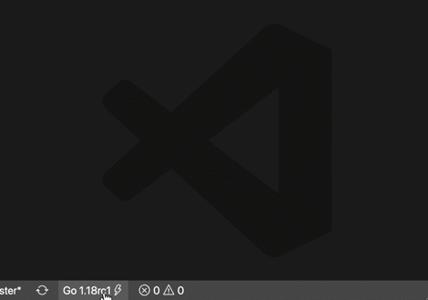

+++
title = "熟悉工作空间"
weight = 94
date = 2023-05-18T17:03:08+08:00
description = ""
isCJKLanguage = true
draft = false
+++

# Get familiar with workspaces - 熟悉工作空间

https://go.dev/blog/get-familiar-with-workspaces

Beth Brown, for the Go team
5 April 2022

Go 1.18 adds workspace mode to Go, which lets you work on multiple modules simultaneously.

Go 1.18为Go增加了工作区模式，可以让您同时在多个模块上工作。

You can get Go 1.18 by visiting the [download](https://go.dev/dl/) page. The [release notes](https://go.dev/doc/go1.18) have more details about all the changes.

您可以通过访问下载页面获得Go 1.18。发行说明中有关于所有变化的更多细节。

## Workspaces 工作区

[Workspaces](https://go.dev/ref/mod#workspaces) in Go 1.18 let you work on multiple modules simultaneously without having to edit `go.mod` files for each module. Each module within a workspace is treated as a main module when resolving dependencies.

Go 1.18中的工作空间让您可以同时处理多个模块，而不必为每个模块编辑go.mod文件。在解决依赖关系时，工作区中的每个模块都被视为一个主模块。

Previously, to add a feature to one module and use it in another module, you needed to either publish the changes to the first module, or [edit the go.mod](https://go.dev/doc/tutorial/call-module-code) file of the dependent module with a `replace` directive for your local, unpublished module changes. In order to publish without errors, you had to remove the `replace` directive from the dependent module’s `go.mod` file after you published the local changes to the first module.

以前，如果要在一个模块中增加一个功能，并在另一个模块中使用，您需要在第一个模块中发布修改，或者在依赖模块的go.mod文件中编辑一个替换指令，用于本地的、未发布的模块修改。为了不出错地发布，您必须在向第一个模块发布本地修改后，从依赖模块的go.mod文件中删除替换指令。

With Go workspaces, you control all your dependencies using a `go.work` file in the root of your workspace directory. The `go.work` file has `use` and `replace` directives that override the individual `go.mod` files, so there is no need to edit each `go.mod` file individually.

使用Go工作区，您可以使用工作区目录根部的go.work文件来控制所有的依赖关系。go.work文件有使用和替换指令，可以覆盖各个go.mod文件，所以不需要单独编辑每个go.mod文件。

You create a workspace by running `go work init` with a list of module directories as space-separated arguments. The workspace doesn’t need to contain the modules you’re working with. The` init` command creates a `go.work` file that lists modules in the workspace. If you run `go work init` without arguments, the command creates an empty workspace.

您可以通过运行go work init来创建一个工作区，并将模块目录列表作为空格分隔的参数。工作区不需要包含您正在使用的模块。init命令创建一个go.work文件，列出工作区的模块。如果您运行go work init而没有参数，该命令会创建一个空的工作区。

To add modules to the workspace, run `go work use [moddir]` or manually edit the `go.work` file. Run `go work use -r` to recursively add directories in the argument directory with a `go.mod` file to your workspace. If a directory doesn’t have a `go.mod` file, or no longer exists, the `use` directive for that directory is removed from your `go.work` file.

要向工作区添加模块，可以运行go work use [moddir] 或手动编辑go.work文件。运行go work使用-r来递归添加参数目录中带有go.mod文件的目录到您的工作区。如果一个目录没有go.mod文件，或者不再存在，该目录的使用指令将从您的go.work文件中删除。

The syntax of a `go.work` file is similar to a `go.mod` file and contains the following directives:

go.work文件的语法与go.mod文件相似，包含以下指令：

- `go`: the go toolchain version e.g. `go 1.18`go：go工具链的版本，例如：go 1.18
- `use`: adds a module on disk to the set of main modules in a workspace. Its argument is a relative path to the directory containing the module’s `go.mod` file. A `use` directive doesn’t add modules in subdirectories of the specified directory.use：在磁盘上添加一个模块到工作区的主模块集。它的参数是包含该模块go.mod文件的目录的相对路径。use指令不会在指定目录的子目录中添加模块。
- `replace`: Similar to a `replace` directive in a `go.mod` file, a `replace` directive in a `go.work` file replaces the contents of a *specific version* of a module, or *all versions* of a module, with contents found elsewhere.replace: 类似于go.mod文件中的替换指令，go.work文件中的替换指令用其他地方的内容替换一个模块的特定版本，或一个模块的所有版本。

## Workflows 工作流

Workspaces are flexible and support a variety of workflows. The following sections are a brief overview of the ones we think will be the most common.

工作区很灵活，支持各种工作流程。下面几节是对我们认为最常见的工作流程的简要概述。

### Add a feature to an upstream module and use it in your own module 在上游模块中添加一个功能，并在您自己的模块中使用它

1. Create a directory for your workspace. 为您的工作区创建一个目录。

2. Clone the upstream module you want to edit. If you haven’t contributed to Go before, read the [contribution guide](https://go.dev/doc/contribute). 克隆您想编辑的上游模块。如果您以前没有为Go贡献过，请阅读贡献指南。

3. Add your feature to the local version of the upstream module.将您的功能添加到上游模块的本地版本中。

4. Run `go work init [path-to-upstream-mod-dir]` in the workspace folder.在工作区文件夹中运行go work init [path-to-upstream-mod-dir] 。

5. Make changes to your own module in order to implement the feature added to the upstream module.对您自己的模块进行修改，以实现添加到上游模块的功能。

6. Run `go work use [path-to-your-module]` in the workspace folder.在工作区文件夹中运行go work use [path-to-your-module]。

   The `go work use` command adds the path to your module to your `go.work` file:go work use命令将您的模块的路径添加到您的go.work文件中：

   ```
   go 1.18
   
   use (
          ./path-to-upstream-mod-dir
          ./path-to-your-module
   )
   ```

7. Run and test your module using the new feature added to the upstream module.使用添加到上游模块的新功能运行并测试您的模块。

8. Publish the upstream module with the new feature.发布带有新功能的上游模块。

9. Publish your module using the new feature.使用新功能发布您的模块。

### Work with multiple interdependent modules in the same repository 在同一个版本库中处理多个相互依赖的模块

While working on multiple modules in the same repository, the `go.work` file defines the workspace instead of using `replace` directives in each module’s `go.mod` file.

当在同一版本库中处理多个模块时，go.work文件定义了工作空间，而不是在每个模块的go.mod文件中使用替换指令。

1. Create a directory for your workspace.为您的工作区创建一个目录。

2. Clone the repository with the modules you want to edit. The modules don’t have to be in your workspace folder as you specify the relative path to each with the `use` directive.克隆您要编辑的模块的版本库。这些模块不一定要在您的工作区文件夹中，因为您用use指令指定了每个模块的相对路径。

3. Run `go work init [path-to-module-one] [path-to-module-two]` in your workspace directory.在您的工作区目录下运行 go work init [path-to-module-one] [path-to-module-two] 。

   Example: You are working on `example.com/x/tools/groundhog` which depends on other packages in the `example.com/x/tools` module.例子。您正在开发 example.com/x/tools/groundhog，它依赖于 example.com/x/tools 模块中的其他软件包。

   You clone the repository and then run `go work init tools tools/groundhog` in your workspace folder.您克隆了软件仓库，然后在您的工作区文件夹中运行go work init tools tools/groundhog。

   The contents of your `go.work` file resemble the following:您的go.work文件的内容类似于以下内容。

   ```
   go 1.18
   
   use (
           ./tools
           ./tools/groundhog
   )
   ```

   Any local changes made in the `tools` module will be used by `tools/groundhog` in your workspace.任何在工具模块中做出的本地修改都会被您工作区中的tools/groundhog所使用。

### Switching between dependency configurations 依赖关系配置之间的切换

To test your modules with different dependency configurations you can either create multiple workspaces with separate `go.work` files, or keep one workspace and comment out the `use` directives you don’t want in a single `go.work` file.

要用不同的依赖配置测试您的模块，您可以用独立的go.work文件创建多个工作空间，或者保留一个工作空间，并在一个go.work文件中注释掉您不需要的使用指令。

To create multiple workspaces:

要创建多个工作空间：

1. Create separate directories for different dependency needs.为不同的依赖性需求创建独立的目录。
2. Run `go work init` in each of your workspace directories.在每个工作空间的目录中运行go work init。
3. Add the dependencies you want within each directory via `go work use [path-to-dependency]`.通过go work use [path-to-dependency]在每个目录中添加您想要的依赖性。
4. Run `go run [path-to-your-module]` in each workspace directory to use the dependencies specified by its `go.work` file.在每个工作区目录中运行go run [path-to-your-module]，以使用其go.work文件所指定的依赖。

To test out different dependencies within the same workspace, open the `go.work` file and add or comment out the desired dependencies.

要在同一工作空间内测试不同的依赖关系，可以打开go.work文件并添加或注释所需的依赖关系。

### Still using GOPATH? 还在使用GOPATH？

Maybe using workspaces will change your mind. `GOPATH` users can resolve their dependencies using a `go.work` file located at the base of their `GOPATH` directory. Workspaces don’t aim to completely recreate all `GOPATH` workflows, but they can create a setup that shares some of the convenience of `GOPATH` while still providing the benefits of modules.

也许使用工作空间会改变您的想法。GOPATH用户可以使用位于其GOPATH目录底部的go.work文件来解决他们的依赖关系。工作空间的目的不是要完全重新创建所有的GOPATH工作流程，但它们可以创建一个设置，分享GOPATH的一些便利，同时仍然提供模块的好处。

To create a workspace for GOPATH:

要为GOPATH创建一个工作空间：

1. Run `go work init` in the root of your `GOPATH` directory.在您的GOPATH目录的根部运行go work init。
2. To use a local module or specific version as a dependency in your workspace, run `go work use [path-to-module]`.要在您的工作空间中使用一个本地模块或特定版本作为依赖，运行go work use [path-to-module]。
3. To replace existing dependencies in your modules' `go.mod` files use `go work replace [path-to-module]`.要替换您的模块的go.mod文件中现有的依赖关系，使用go work replace [path-to-module]。
4. To add all the modules in your GOPATH or any directory, run `go work use -r` to recursively add directories with a `go.mod` file to your workspace. If a directory doesn’t have a `go.mod` file, or no longer exists, the `use` directive for that directory is removed from your `go.work` file.要添加您的GOPATH或任何目录中的所有模块，运行go work use -r来递归地添加有go.mod文件的目录到您的工作区。如果一个目录没有go.mod文件，或者不再存在，该目录的使用指令将从您的go.work文件中删除。

> Note: If you have projects without `go.mod` files that you want to add to the workspace, change into their project directory and run `go mod init`, then add the new module to your workspace with `go work use [path-to-module].`
>
> 注意：如果您有没有go.mod文件的项目，而您想将其添加到工作区，请切换到其项目目录并运行go mod init，然后用go work use [path-to-module]将新模块添加到工作区。

## Workspace commands 工作区命令

Along with `go work init` and `go work use`, Go 1.18 introduces the following commands for workspaces:

除了go work init和go work use，Go 1.18为工作区引入了以下命令：

- `go work sync`: pushes the dependencies in the `go.work` file back into the `go.mod` files of each workspace module.go work sync：将go.work文件中的依赖关系推回到每个工作空间模块的go.mod文件中。
- `go work edit`: provides a command-line interface for editing `go.work`, for use primarily by tools or scripts.go work edit：为编辑go.work提供一个命令行界面，主要由工具或脚本使用。

Module-aware build commands and some `go mod` subcommands examine the `GOWORK` environment variable to determine if they are in a workspace context.

模块感知的构建命令和一些go mod子命令会检查GOWORK环境变量，以确定它们是否处于工作区环境中。

Workspace mode is enabled if the `GOWORK` variable names a path to a file that ends in `.work`. To determine which `go.work` file is being used, run `go env GOWORK`. The output is empty if the `go` command is not in workspace mode.

如果GOWORK变量命名了一个以.work结尾的文件路径，那么工作区模式就会被激活。要确定哪个go.work文件正在被使用，请运行go env GOWORK。如果go命令不在工作区模式下，则输出为空。

When workspace mode is enabled, the `go.work` file is parsed to determine the three parameters for workspace mode: A Go version, a list of directories, and a list of replacements.

当工作区模式被启用时，go.work文件会被解析以确定工作区模式的三个参数。一个Go版本，一个目录列表，以及一个替换列表。

Some commands to try in workspace mode (provided you already know what they do!):

一些可以在工作区模式下尝试的命令（前提是您已经知道它们的作用！）：

```
go work init
go work sync
go work use
go list
go build
go test
go run
go vet
```

## Editor experience improvements 编辑器体验的改进

We’re particularly excited about the upgrades to Go’s language server [gopls](https://pkg.go.dev/golang.org/x/tools/gopls) and the [VSCode Go extension](https://marketplace.visualstudio.com/items?itemName=golang.go) that make working with multiple modules in an LSP-compatible editor a smooth and rewarding experience.

我们对Go语言服务器gopls和VSCode Go扩展的升级感到特别兴奋，这使得在兼容LSP的编辑器中处理多个模块成为一种流畅而有意义的体验。

Find references, code completion, and go to definitions work across modules within the workspace. Version [0.8.1](https://github.com/golang/tools/releases/tag/gopls%2Fv0.8.1) of `gopls` introduces diagnostics, completion, formatting, and hover for `go.work` files. You can take advantage of these gopls features with any [LSP](https://microsoft.github.io/language-server-protocol/)-compatible editor.

查找参考文献、代码补全和转到定义在工作区中跨模块工作。0.8.1版的gopls为go.work文件引入了诊断、完成、格式化和悬停。您可以用任何与LSP兼容的编辑器来利用这些gopls的功能。

#### Editor specific notes 编辑器的具体说明

- The latest [vscode-go release](https://github.com/golang/vscode-go/releases/tag/v0.32.0) allows quick access to your workspace’s `go.work` file via the Go status bar’s Quick Pick menu.最新的vscode-go版本允许通过Go状态栏的快速选择菜单快速访问工作区的go.work文件。

 通过Go状态栏的 "快速选择 "菜单访问go.work文件  

- [GoLand](https://www.jetbrains.com/go/) supports workspaces and has plans to add syntax highlighting and code completion for `go.work` files.GoLand支持工作区，并计划为go.work文件增加语法高亮和代码完成功能。

For more information on using `gopls` with different editors see the `gopls`[ documentation](https://pkg.go.dev/golang.org/x/tools/gopls#readme-editors).

关于在不同编辑器中使用gopls的更多信息，请参见gopls文档。


## What’s next?  下一步是什么？

- Download and install [Go 1.18](https://go.dev/dl/). 下载并安装 Go 1.18。
- Try using [workspaces](https://go.dev/ref/mod#workspaces) with the [Go workspaces Tutorial](https://go.dev/doc/tutorial/workspaces). 使用Go工作空间教程尝试使用工作空间。
- If you encounter any problems with workspaces, or want to suggest something, file an [issue](https://github.com/golang/go/issues/new/choose).如果您在使用工作空间时遇到任何问题，或想提出建议，请提交问题。
- Read the [workspace maintenance documentation](https://pkg.go.dev/cmd/go#hdr-Workspace_maintenance). 阅读工作空间维护文档。
- Explore module commands for [working outside of a single module](https://go.dev/ref/mod#commands-outside) including `go work init`, `go work sync` and more.探索在单个模块之外工作的模块命令，包括go work init、go work sync等。
