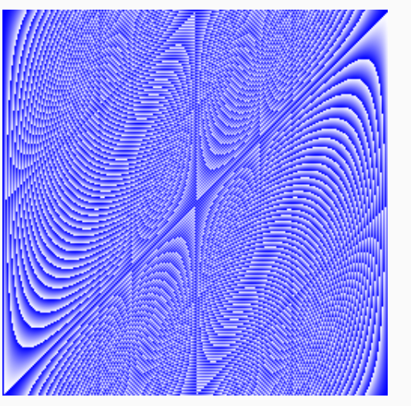

+++
title = "More types: structs, slices, and maps"
weight = 3
date = 2023-05-17T12:10:24+08:00
description = ""
isCJKLanguage = true
draft = false
+++
# More types: structs, slices, and maps.

## Pointers 指针

> 原文：[https://go.dev/tour/moretypes/1](https://go.dev/tour/moretypes/1)

​	Go拥有指针。指针保存了值的内存地址。

​	类型`*T`是一个指向`T`类型值的指针。它的零值是`nil`。

```go 
var p *int
```

​	`&`操算符产生一个指向其操作数的指针。

```go 
i := 42
p = &i
```

`*`操算符表示指针指向的底层值。

```go 
fmt.Println(*p) // read i through the pointer p
*p = 21         // set i through the pointer p
```

这就是所谓的 "dereferencing "或 "indirecting "。

与C不同，`Go没有指针运算`。

```go title="main.go" 
package main

import "fmt"

func main() {
	i, j := 42, 2701

	p := &i         // point to i
	fmt.Println(*p) // read i through the pointer
	*p = 21         // set i through the pointer
	fmt.Println(i)  // see the new value of i

	p = &j         // point to j
	*p = *p / 37   // divide j through the pointer
	fmt.Println(j) // see the new value of j
}

```

##  Structs 结构体

> 原文：[https://go.dev/tour/moretypes/2](https://go.dev/tour/moretypes/2)

一个结构体（`struct`）就是一组字段（field）的集合。

```go title="main.go" 
package main

import "fmt"

type Vertex struct {
	X int
	Y int
}

func main() {
	fmt.Println(Vertex{1, 2})
}

```

##  Struct Fields 结构体字段

> 原文：[https://go.dev/tour/moretypes/3](https://go.dev/tour/moretypes/3)

​	结构体字段使用点号来访问。

```go title="main.go" 
package main

import "fmt"

type Vertex struct {
	X int
	Y int
}

func main() {
	v := Vertex{1, 2}
	v.X = 4
	fmt.Println(v.X)
}

```

## Pointers to structs 结构体指针

> 原文：[https://go.dev/tour/moretypes/4](https://go.dev/tour/moretypes/4)

​	结构字段可以通过结构体指针来访问。

​	当我们拥有结构体指针`p`时，要访问结构体的字段`X`，我们可以写成`(*p).X`。然而，这种记法很麻烦，所以`Go语言允许我们只写 p.X`。

```go title="main.go" 
package main

import "fmt"

type Vertex struct {
	X int
	Y int
}

func main() {
	v := Vertex{1, 2}
	p := &v
	p.X = 1e9
	fmt.Println(v)
}

```

## Struct Literals 结构体字面量

> 原文：[https://go.dev/tour/moretypes/5](https://go.dev/tour/moretypes/5)

​	结构字面量通过直接列出字段的值来分配一个新的结构体。

​	您可以通过使用`Name:` 语法，只列出部分字段。(命名字段的顺序并不重要）。

​	特殊前缀`&`会返回一个指向结构体值的指针。

```go title="main.go" 
package main

import "fmt"

type Vertex struct {
	X, Y int
}

var (
	v1 = Vertex{1, 2}  // has type Vertex
	v2 = Vertex{X: 1}  // Y:0 is implicit
	v3 = Vertex{}      // X:0 and Y:0
	p  = &Vertex{1, 2} // has type *Vertex
)

func main() {
	fmt.Println(v1, p, v2, v3)
}

```

## Arrays 数组

> 原文：[https://go.dev/tour/moretypes/6](https://go.dev/tour/moretypes/6)

​	类型`[n]T`是一个包含`n`个`T`类型的值的数组。

表达式：

```go 
var a [10]int
```

声明了一个变量`a`是一个包含10个整数的数组。

​	`数组的长度是其类型的一部分`，所以`数组不能被改变大小`。这似乎很有局限性，但不用担心；Go提供了更加便利的方式来使用数组。

```go title="main.go" 
package main

import "fmt"

func main() {
	var a [2]string
	a[0] = "Hello"
	a[1] = "World"
	fmt.Println(a[0], a[1])
	fmt.Println(a)

	primes := [6]int{2, 3, 5, 7, 11, 13}
	fmt.Println(primes)
}

```

## Slices 切片

> 原文：[https://go.dev/tour/moretypes/7](https://go.dev/tour/moretypes/7)

​	每个数组的大小是固定的。而切片则为数组元素提供一个动态的、灵活的的视角。在实践中，切片比数组更常用。

​	类型`[]T`是一个具有`T`类型元素的切片。

​	切片通过指定两个索引：下限索引和上限索引，两者以冒号隔开来形成的：

```
a[low : high]
```

​	这种方式会选择一个半开区间，包括第一个元素，但`排除最后一个元素`。

下面的表达式创建了一个包含`a`的索引为`1`到`3`元素的切片：

```
a[1:4]
```

```go title="main.go" 
package main

import "fmt"

func main() {
	primes := [6]int{2, 3, 5, 7, 11, 13}

	var s []int = primes[1:4]
	fmt.Println(s)
}

```

## Slices are like references to arrays 切片就像是对数组的引用

> 原文：[https://go.dev/tour/moretypes/8](https://go.dev/tour/moretypes/8)

​	切片不存储任何数据，它只是描述底层数组的一个部分。

​	改变切片的元素会修改其底层数组对应的元素。

​	共享同一底层数组的其他切片将观测这些改变。

```go title="main.go" 
package main

import "fmt"

func main() {
	names := [4]string{
		"John",
		"Paul",
		"George",
		"Ringo",
	}
	fmt.Println(names)

	a := names[0:2]
	b := names[1:3]
	fmt.Println(a, b)

	b[0] = "XXX"
	fmt.Println(a, b)
	fmt.Println(names)
}

```

```text
[John Paul George Ringo]
[John Paul] [Paul George]
[John XXX] [XXX George]
[John XXX George Ringo]
```


## Slice literals 切片字面量

> 原文：[https://go.dev/tour/moretypes/9](https://go.dev/tour/moretypes/9)

​	切片字面量类似没有长度的数组字面量。

这是一个数组字面量：

```go 
[3]bool{true, true, false}
```

下面这样，则将创建一个与上面相同的数组，然后建立一个引用它的切片：

```go 
[]bool{true, true, false}
```

```go title="main.go" 
package main

import "fmt"

func main() {
	q := []int{2, 3, 5, 7, 11, 13}
	fmt.Println(q)

	r := []bool{true, false, true, true, false, true}
	fmt.Println(r)

	s := []struct {
		i int
		b bool
	}{
		{2, true},
		{3, false},
		{5, true},
		{7, true},
		{11, false},
		{13, true},
	}
	fmt.Println(s)
}

```

##  Slice defaults 切片的默认行为

> 原文：[https://go.dev/tour/moretypes/10](https://go.dev/tour/moretypes/10)

​	在进行切片时，您可以省略上界或下界，而使用它的默认行为。

​	下界的默认值是0，上界的默认值是该切片的长度。

对于数组：

```go 
var a [10]int
```

来说，这些切片表达式是等价的：

```go 
a[0:10]
a[:10]
a[0:]
a[:]
```


```go title="main.go" 
package main

import "fmt"

func main() {
	s := []int{2, 3, 5, 7, 11, 13}

	s = s[1:4]
	fmt.Println(s)

	s = s[:2]
	fmt.Println(s)

	s = s[1:]
	fmt.Println(s)
}

```

## Slice length and capacity 切片的长度和容量

> 原文：[https://go.dev/tour/moretypes/11](https://go.dev/tour/moretypes/11)

​	切片有长度和容量。

​	`切片的长度`是它所包含的元素的个数。

​	`切片的容量`是从切片的第一个元素开始计算，到其底层数组元素末尾的个数。

​	切片`s`的长度和容量可以通过表达式`len(s)`和`cap(s)`得到。

​	只要有足够的容量，您可以通过重新切片来扩展一个切片。试着改变示例程序中的切片操作，使其超过其容量，看看会发生什么。

```go title="main.go" 
package main

import "fmt"

func main() {
	s := []int{2, 3, 5, 7, 11, 13}
	printSlice(s)

	// Slice the slice to give it zero length.
	s = s[:0]
	printSlice(s)

	// Extend its length.
	s = s[:4]
	printSlice(s)

	// Drop its first two values.
	s = s[2:]
	printSlice(s)
}

func printSlice(s []int) {
	fmt.Printf("len=%d cap=%d %v\n", len(s), cap(s), s)
}

```

##  Nil slices - nil 切片

> 原文：[https://go.dev/tour/moretypes/12](https://go.dev/tour/moretypes/12)

​	切片的零值是`nil`。

​	`nil` 切片的长度和容量为0，`并且没有底层数组`。

```go title="main.go" 
package main

import "fmt"

func main() {
	var s []int
	fmt.Println(s, len(s), cap(s)) // [] 0 0
	if s == nil {
		fmt.Println("nil!") // nil!
	}
}

```

## Creating a slice with make 用 make 创建切片

> 原文：[https://go.dev/tour/moretypes/13](https://go.dev/tour/moretypes/13)

​	切片可以用内置的`make`函数来创建；这也是您创建动态数组的方式。

​	`make`函数分配了一个元素为零值数组，并返回一个指向该数组的切片：

```go 
a := make([]int, 5)  // len(a)=5
```

要指定容量，可以向`make`传递第三个参数：

```go 
b := make([]int, 0, 5) // len(b)=0, cap(b)=5

b = b[:cap(b)] // len(b)=5, cap(b)=5
b = b[1:]      // len(b)=4, cap(b)=4
```

```go title="main.go" 
package main

import "fmt"

func main() {
	a := make([]int, 5)
	printSlice("a", a)

	b := make([]int, 0, 5)
	printSlice("b", b)

	c := b[:2]
	printSlice("c", c)

	d := c[2:5]
	printSlice("d", d)
}

func printSlice(s string, x []int) {
	fmt.Printf("%s len=%d cap=%d %v\n",
		s, len(x), cap(x), x)
}

```

##  Slices of slices 切片的切片

> 原文：[https://go.dev/tour/moretypes/14](https://go.dev/tour/moretypes/14)

​	切片可包含任何类型，甚至包括其它的切片。

```go title="main.go" 
package main

import (
	"fmt"
	"strings"
)

func main() {
	// Create a tic-tac-toe board. => 创建一个井字板 （经典游戏）
	board := [][]string{
		[]string{"_", "_", "_"},
		[]string{"_", "_", "_"},
		[]string{"_", "_", "_"},
	}

	// The players take turns.
	board[0][0] = "X"
	board[2][2] = "O"
	board[1][2] = "X"
	board[1][0] = "O"
	board[0][2] = "X"

	for i := 0; i < len(board); i++ {
		fmt.Printf("%s\n", strings.Join(board[i], " "))
	}
}

```

##  Appending to a slice - 向切片追加（元素）

> 原文：[https://go.dev/tour/moretypes/15](https://go.dev/tour/moretypes/15)

​	将新的元素追加到切片中是很常见的，因此Go提供了一个内置的`append`函数。内置包的[文档](https://go.dev/pkg/builtin/#append)描述了`append`。

```go 
func append(s []T, vs ...T) []T
```

​	`append`的第一个参数`s`是一个`T`类型的切片，其余的是要追加到该切片的`T`类型值。

​	`append`的结果是一个切片，其包含原始切片的所有元素和新追加的所有元素的值。

​	如果`s`的底层数组太小，无法容纳所有给定的值，那么将分配一个更大的数组。`返回的切片将指向新分配的数组`。

(要了解更多关于切片的信息，请阅读[Slices: usage and internals]()文章)。

```go title="main.go" 
package main

import "fmt"

func main() {
	var s []int
	printSlice(s)

	// append works on nil slices.
    // => 在 nil 切片上追加
	s = append(s, 0)
	printSlice(s)

	// The slice grows as needed.
    // => 这个切片将按需扩展
	s = append(s, 1)
	printSlice(s)

	// We can add more than one element at a time. 
    // => 可以一次性追加多个元素
	s = append(s, 2, 3, 4)
	printSlice(s)
}

func printSlice(s []int) {
	fmt.Printf("len=%d cap=%d %v\n", len(s), cap(s), s)
}

```

##  Range

> 原文：[https://go.dev/tour/moretypes/16](https://go.dev/tour/moretypes/16)

​	`for`循环的`range`形式可遍历切片或映射。

​	当对一个切片使用 `range` 进行遍历时，每次迭代都会返回两个值。`第一个是索引`，`第二个是该索引对应元素的副本`。

```go title="main.go" 
package main

import "fmt"

var pow = []int{1, 2, 4, 8, 16, 32, 64, 128}

func main() {
	for i, v := range pow {
		fmt.Printf("2**%d = %d\n", i, v)
	}
}

```

##  Range continued - range （续）

> 原文：[https://go.dev/tour/moretypes/17](https://go.dev/tour/moretypes/17)

​	可以通过赋值给`_`来忽略索引或值。

```go 
for i, _ := range pow
for _, value := range pow
```

若您只需得到索引，则可以忽略第二个变量。

```go 
for i := range pow
```

```go title="main.go" 
package main

import "fmt"

func main() {
	pow := make([]int, 10)
	for i := range pow {
		pow[i] = 1 << uint(i) // == 2**i
	}
	for _, value := range pow {
		fmt.Printf("%d\n", value)
	}
}

```

##  Exercise: Slices 练习：切片

> 原文：[https://go.dev/tour/moretypes/18](https://go.dev/tour/moretypes/18)

​	实现`Pic`。它应返回一个长度为`dy`的切片，其中每个元素都是一个长度为`dx`的uint8切片。当您运行该程序时，它将显示您的图片，将整数解释为灰度值（好吧，其实是蓝度值）。

​	图片的选择由您决定。有趣的函数包括：`（x+y）/2`、`x*y`和`x^y`。

(您需要使用循环来分配`[][]uint8`里面的每个`[]uint8`。）

(请使用`uint8(intValue)`在不同类型之间转换。)

```go title="main.go" 
package main

import "golang.org/x/tour/pic"

func Pic(dx, dy int) [][]uint8 {
	pic := make([][]uint8, dy)
	for i := range pic {
		pic[i] = make([]uint8, dx)
		for j := range pic[i] {
			pic[i][j] = uint8(i*j + j*j)
		}
	}
	return pic
}

func main() {
	pic.Show(Pic)
}

```



##  Maps 映射

> 原文：[https://go.dev/tour/moretypes/19](https://go.dev/tour/moretypes/19)

​	映射将键映射到值。

The zero value of a map is `nil`. A `nil` map has no keys, nor can keys be added.

​	映射的零值是`nil`。`nil`映射`没有键，也不能添加键。`

The `make` function returns a map of the given type, initialized and ready for use.

make函数返回一个给定类型的映射，初始化并准备使用。

```go title="main.go" 
package main

import "fmt"

type Vertex struct {
	Lat, Long float64
}

var m map[string]Vertex

func main() {
	m = make(map[string]Vertex)
	m["Bell Labs"] = Vertex{
		40.68433, -74.39967,
	}
	fmt.Println(m["Bell Labs"])
}

```

## Map literals 映射字面量

> 原文：[https://go.dev/tour/moretypes/20](https://go.dev/tour/moretypes/20)

​	映射字面量与结构体字面量类似，不过映射字面量必须有键名。

```go title="main.go"  hl_lines="10 14"
package main

import "fmt"

type Vertex struct {
	Lat, Long float64
}

var m = map[string]Vertex{
	"Bell Labs": Vertex{
		40.68433, -74.39967,
	},
	"Google": Vertex{
		37.42202, -122.08408,
	},
}

func main() {
	fmt.Println(m)
}

```

##  Map literals continued 映射字面量（续）

> 原文：[https://go.dev/tour/moretypes/21](https://go.dev/tour/moretypes/21)

如果顶层类型只是一个类型名，您可以从字面量的元素中省略它。

```go title="main.go"  hl_lines="10 11"
package main

import "fmt"

type Vertex struct {
	Lat, Long float64
}

var m = map[string]Vertex{
	"Bell Labs": {40.68433, -74.39967},
	"Google":    {37.42202, -122.08408},
}

func main() {
	fmt.Println(m)
}

```

##  Mutating Maps 修改映射

> 原文：[https://go.dev/tour/moretypes/22](https://go.dev/tour/moretypes/22)

​	在映射`m`中插入或修改元素：

```go 
m[key] = elem
```

​	获取元素：

```go 
elem = m[key]
```

​	删除元素：

```go 
delete(m, key)
```

​	用双赋值来测试某个键是否存在：

```go 
elem, ok = m[key]
```

​	如果`key`在`m`中，`ok`为`true`。如果不存在，则`ok`为`false`。

​	如果`key`不在映射中，那么`elem`是映射元素类型的`零值`。

注意：如果`elem`或`ok`还未被声明，您可以使用短变量声明。

```go 
elem, ok := m[key]
```

```go title="main.go" 
package main

import "fmt"

func main() {
	m := make(map[string]int)

	m["Answer"] = 42
	fmt.Println("The value:", m["Answer"])

	m["Answer"] = 48
	fmt.Println("The value:", m["Answer"])

	delete(m, "Answer")
	fmt.Println("The value:", m["Answer"])

	v, ok := m["Answer"]
	fmt.Println("The value:", v, "Present?", ok)
}

```

##  Exercise: Maps 练习：映射

> 原文：[https://go.dev/tour/moretypes/23](https://go.dev/tour/moretypes/23)

​	实现`WordCount`。它应当返回一个映射，其中包含字符串`s`中的每个"单词"。函数`wc.Test`会对函数执行一系列测试用例，并输出成功或失败。

​	您会发现[strings.Fields](https://go.dev/pkg/strings/#Fields)很有帮助。

```go title="main.go" 
package main

import (
	"golang.org/x/tour/wc"
    "strings"
)

func WordCount(s string) map[string]int {
	m := make(map[string]int)
	words := strings.Fields(s)
	for _, word := range words {
		m[word] = m[word] + 1
	}
	return m
}

func main() {
	wc.Test(WordCount)
}

```

##  Function values 函数值

> 原文：[https://go.dev/tour/moretypes/24](https://go.dev/tour/moretypes/24)

​	函数也是值。它们可以像其他值一样被传递。

​	函数值可以作为函数的实参和返回值使用。

```go title="main.go" 
package main

import (
	"fmt"
	"math"
)

func compute(fn func(float64, float64) float64) float64 {
	return fn(3, 4)
}

func main() {
	hypot := func(x, y float64) float64 {
		return math.Sqrt(x*x + y*y)
	}
	fmt.Println(hypot(5, 12))

	fmt.Println(compute(hypot))
	fmt.Println(compute(math.Pow))
}

```

##  Function closures 函数闭包

> 原文：[https://go.dev/tour/moretypes/25](https://go.dev/tour/moretypes/25)

​	Go函数可以是一个`闭包`的。`闭包`是一个函数值，它从其函数体之外引用变量。该函数可以访问并赋予其引用的变量的值；在这个意义上，该函数被 "绑定 "到这些变量上。

​	例如，`adder`函数返回一个`闭包`。每个闭包都被绑定在其各自的`sum`变量上。

```go title="main.go"  hl_lines="6 6"
package main

import "fmt"

func adder() func(int) int {
	sum := 0
	return func(x int) int {
		sum += x
		return sum
	}
}

func main() {
	pos, neg := adder(), adder()
	for i := 0; i < 10; i++ {
		fmt.Println(
			pos(i),
			neg(-2*i),
		)
	}
}

```

##  Exercise: Fibonacci closure 练习：斐波那契闭包

> 原文：[https://go.dev/tour/moretypes/26](https://go.dev/tour/moretypes/26)

​	让我们用函数做些好玩的吧。

​	实现一个 `fibonacci` 函数，它返回一个函数（闭包），该函数返回连续的 [fibonacci 数字](https://en.wikipedia.org/wiki/Fibonacci_number)（0, 1, 1, 2, 3, 5, ...）。

```go title="main.go" 
package main

import "fmt"

// fibonacci is a function that returns
// a function that returns an int.
func fibonacci() func() int {
    a, b := 0, 1
	return func() int {
		c := a
		a, b = b, a+b
		return c
	}
}

func main() {
	f := fibonacci()
	for i := 0; i < 10; i++ {
		fmt.Println(f())
	}
}

```

##  Congratulations! 祝贺您!

> 原文：[https://go.dev/tour/moretypes/27](https://go.dev/tour/moretypes/27)

您完成了这一课!

您可以回到`模块`列表中寻找下一步要学习的内容，或者继续学习下一课。
