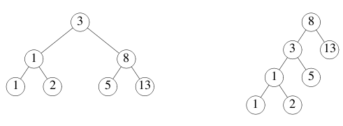

+++
title = "并发"
linkTitle = "并发"
weight = 5
date = 2023-05-17T12:10:24+08:00
description = ""
isCJKLanguage = true
draft = false
+++
# Concurrency

## Goroutines

[https://go.dev/tour/concurrency/1](https://go.dev/tour/concurrency/1)

​	goroutine是一个由Go运行时管理的轻量级线程。

```go 
go f(x, y, z)
```

会启动一个新的goroutine，并运行

```go 
f(x, y, z)
```

`f`、`x`、`y`和`z`的`求值`发生在当前的goroutine中，`f`的`执行`发生在新的goroutine中。

​	goroutine 在相同的地址空间中运行，因此在访问共享内存时必须进行同步。[sync](https://go.dev/pkg/sync/)包提供了这种能力，不过在Go中并不经常用到，因为还有其他的办法。(见下一张幻灯片）。

```go title="main.go" 
package main

import (
	"fmt"
	"time"
)

func say(s string) {
	for i := 0; i < 5; i++ {
		time.Sleep(100 * time.Millisecond)
		fmt.Println(s)
	}
}

func main() {
	go say("world")
	say("hello")
}

```

## Channels 通道

[https://go.dev/tour/concurrency/2](https://go.dev/tour/concurrency/2)

​	通道是一个类型化的管道，您可以通过通道操作符`<-`来发送和接收值。

```go 
ch <- v    // Send v to channel ch. => 将 v 发送至通道 ch。
v := <-ch  // Receive from ch, and assign value to v. => 从 ch 接收值并赋予 v。
```

(数据按照箭头的方向流动)。

像映射和切片一样，通道在使用前必须被创建：

```go 
ch := make(chan int)
```

​	默认情况下，发送和接收操作都是阻塞的，直到双方都准备好。这使得goroutines可以在没有显式锁或条件变量的情况下进行同步。

​	这个例子的代码是对切片中的数字进行求和，将任务分配给两个goroutine。一旦两个goroutines都完成了计算，它就会计算出最终结果。

```go title="main.go" 
package main

import "fmt"

func sum(s []int, c chan int) {
	sum := 0
	for _, v := range s {
		sum += v
	}
	c <- sum // send sum to c
}

func main() {
	s := []int{7, 2, 8, -9, 4, 0}

	c := make(chan int)
	go sum(s[:len(s)/2], c)
	go sum(s[len(s)/2:], c)
	x, y := <-c, <-c // receive from c

	fmt.Println(x, y, x+y)
}

```

## Buffered Channels 缓冲通道

[https://go.dev/tour/concurrency/3](https://go.dev/tour/concurrency/3)

​	通道可以是带缓冲的。提供缓冲区长度作为`make`的第二个参数，以初始化一个缓冲通道：

```go 
ch := make(chan int, 100)
```

​	仅当信道的缓冲区填满后，向其发送数据时才会阻塞。当缓冲区为空时，接受方会阻塞。

修改示例填满缓冲区，然后看看会发生什么。

```go title="main.go" 
package main

import "fmt"

func main() {
	ch := make(chan int, 2)
	ch <- 1
	ch <- 2
    // ch <- 3 // fatal error: all goroutines are asleep - deadlock!
	fmt.Println(<-ch)
	fmt.Println(<-ch)
}

```

##  Range and Close

[https://go.dev/tour/concurrency/4](https://go.dev/tour/concurrency/4)

​	发送者可以`close`（关闭）一个通道，表示不再发送任何值。接收者可以通过给`接收表达式`分配`第二个参数`来测试一个通道是否被关闭，在执行完

```go 
v, ok := <-ch
```

之后，若没有更多的值要接收，并且通道关闭，那么`ok` 会被设置为 `false`。

​	循环`for i := range c`从通道中反复接收数值，直到通道关闭。

> 注意：只有发送方应当关闭一个通道，而不是接收方。在一个关闭的通道上发送会引起恐慌。

> 另一个注意事项：通道不像文件，您通常不需要关闭它们。只有当接收方必须被告知没有更多的值时才需要关闭，例如终止一个`range`循环。

```go title="main.go" 
package main

import (
	"fmt"
)

func fibonacci(n int, c chan int) {
	x, y := 0, 1
	for i := 0; i < n; i++ {
		c <- x
		x, y = y, x+y
	}
	close(c)
}

func main() {
	c := make(chan int, 10)
	go fibonacci(cap(c), c)
	for i := range c {
		fmt.Println(i)
	}
}

```

## Select

[https://go.dev/tour/concurrency/5](https://go.dev/tour/concurrency/5)

​	`select`语句允许goroutine等待多个通信操作。

​	`select`语句会阻塞，直到它的一个`case`可以运行，然后它就执行这个`case`。如果有多个准备好了，它就随机选择一个。

```go title="main.go" 
package main

import "fmt"

func fibonacci(c, quit chan int) {
	x, y := 0, 1
	for {
		select {
		case c <- x:
			x, y = y, x+y
		case <-quit:
			fmt.Println("quit")
			return
		}
	}
}

func main() {
	c := make(chan int)
	quit := make(chan int)
	go func() {
		for i := 0; i < 10; i++ {
			fmt.Println(<-c)
		}
		quit <- 0
	}()
	fibonacci(c, quit)
}

```

##  Default Selection

[https://go.dev/tour/concurrency/6](https://go.dev/tour/concurrency/6)

​	当 `select` 中的其它分支都没有准备好时，`default` 分支就会执行。

​	为了在尝试发送或者接收时不发生阻塞，可使用 `default` 分支：

```go 
select {
case i := <-c:
    // use i
default:
    // receiving from c would block => 从 c 中接收会阻塞时执行
}
```

```go title="main.go" 
package main

import (
	"fmt"
	"time"
)

func main() {
	tick := time.Tick(100 * time.Millisecond)
	boom := time.After(500 * time.Millisecond)
	for {
		select {
		case <-tick:
			fmt.Println("tick.")
		case <-boom:
			fmt.Println("BOOM!")
			return
		default:
			fmt.Println("    .")
			time.Sleep(50 * time.Millisecond)
		}
	}
}

```

##  Exercise: Equivalent Binary Trees  练习：等价二叉查找树

[https://go.dev/tour/concurrency/7](https://go.dev/tour/concurrency/7)

​	可以有许多不同的二进制树，其中存储着相同的数值序列。例如，这里有两棵二叉树，都存储着序列1, 1, 2, 3, 5, 8, 13。



​	在大多数语言中，检查两个二叉树是否存储相同序列的函数是相当复杂的。我们将使用Go的并发性和通道来编写一个简单的解决方案。

这个例子使用了`tree`包，它定义了类型：

```go 
type Tree struct {
    Left  *Tree
    Value int
    Right *Tree
}
```

在下一页继续描述。

##  Exercise: Equivalent Binary Trees 练习：等价二叉查找树

[https://go.dev/tour/concurrency/8](https://go.dev/tour/concurrency/8)

**1.** 实现`Walk`函数。

**2.** 测试`Walk`函数。

​	函数`tree.New(k)`用于构造一个随机结构的（但总是排序的）二进制树，它保存了值`k`、`2k`、`3k`、...、`10k`。

创建一个新的通道`ch`并且对其进行步进：

```go 
go Walk(tree.New(1), ch)
```

Then read and print 10 values from the channel. It should be the numbers 1, 2, 3, ..., 10.

然后从通道中读取并打印10个值。它应该是数字1，2，3，...，10。

**3.** 使用`Walk`实现`Same`函数，以确定`t1`和`t2`是否存储相同的值。

**4.** 测试`Same`函数。

`Same(tree.New(1), tree.New(1))`应该返回`true`，而

`Same(tree.New(1), tree.New(2))`应该返回`false`。

Tree的文档可以在[这里](https://godoc.org/golang.org/x/tour/tree#Tree)找到。

```go title="main.go" 
package main

import (
	"fmt"
	"golang.org/x/tour/tree"
)

// Walk walks the tree t sending all values
// from the tree to the channel ch.
func Walk(t *tree.Tree, ch chan int) {
    if t.Left != nil {
		Walk(t.Left, ch)
	}
	ch <- t.Value
	if t.Right != nil {
		Walk(t.Right, ch)
	}
}

// Same determines whether the trees
// t1 and t2 contain the same values.
func Same(t1, t2 *tree.Tree) bool {
    var v1, v2 int
	c1 := make(chan int)
	c2 := make(chan int)
	go Walk(t1, c1)
	go Walk(t2, c2)
	for i := 0; i < 10; i++ {
		v1 = <-c1
		v2 = <-c2
		if v1 != v2 {
			return false
		}
	}
	return true
}

func main() {
    ch := make(chan int)
	go Walk(tree.New(10), ch)
	for i := 0; i < 10; i++ {
		fmt.Println(<-ch)
	}
	fmt.Println(Same(tree.New(1), tree.New(1)))
}

```

##  sync.Mutex

[https://go.dev/tour/concurrency/9](https://go.dev/tour/concurrency/9)

​	我们已经看到通道是如何在goroutines之间进行通信的。

​	但如果我们不需要通信呢？若我们只是想保证每次只有一个goroutine可以访问一个变量以避免冲突呢？

​	这个概念被称为`互斥`，而提供这种概念的数据结构的传统名称是`mutex`。

​	Go的标准库提供了[sync.Mutex](https://go.dev/pkg/sync/#Mutex)互斥锁类型以其两个方法：

- `Lock`
- `Unlock`

​	我们可以通过在代码前调用 `Lock` 方法，在代码后调用 `Unlock` 方法来保证一段代码的互斥执行。参见 `Inc` 方法。

​	我们也可以用 `defer` 语句来保证互斥锁一定会被解锁。参见`Value`方法。

```go title="main.go" 
package main

import (
	"fmt"
	"sync"
	"time"
)

// SafeCounter is safe to use concurrently.
type SafeCounter struct {
	mu sync.Mutex
	v  map[string]int
}

// Inc increments the counter for the given key.
func (c *SafeCounter) Inc(key string) {
	c.mu.Lock()
	// Lock so only one goroutine at a time can access the map c.v.
	c.v[key]++
	c.mu.Unlock()
}

// Value returns the current value of the counter for the given key.
func (c *SafeCounter) Value(key string) int {
	c.mu.Lock()
	// Lock so only one goroutine at a time can access the map c.v.
	defer c.mu.Unlock()
	return c.v[key]
}

func main() {
	c := SafeCounter{v: make(map[string]int)}
	for i := 0; i < 1000; i++ {
		go c.Inc("somekey")
	}

	time.Sleep(time.Second)
	fmt.Println(c.Value("somekey"))
}

```

##  Exercise: Web Crawler 练习：网络爬虫

[https://go.dev/tour/concurrency/10](https://go.dev/tour/concurrency/10)

​	在这个练习中，您将使用 Go 的并发特性来并行处理一个网络爬虫。

​	修改`Crawl`函数，以并行获取URL，并且不获取同一个URL两次。

*Hint*: you can keep a cache of the URLs that have been fetched on a map, but maps alone are not safe for concurrent use!

提示：您可以用一个 map 来缓存已经获取的 URL，但是要注意 map 本身并不是并发安全的！

```go title="main.go" 
package main

import (
	"fmt"
	"sync"
)

type Fetcher interface {
	// Fetch returns the body of URL and
	// a slice of URLs found on that page.
	Fetch(url string) (body string, urls []string, err error)
}

type UrlChecker struct {
	urls map[string]bool
	mux sync.Mutex
}

func (c *UrlChecker) Crawled(url string) bool {
	c.mux.Lock()
	if c.urls[url] {
		defer c.mux.Unlock()
		return true
	}
	c.urls[url] = true
	defer c.mux.Unlock()
	return false
}

var uc = UrlChecker{urls: make(map[string]bool)}

// Crawl uses fetcher to recursively crawl
// pages starting with url, to a maximum of depth.
func Crawl(url string, depth int, fetcher Fetcher, ret chan string) {
	// TODO: Fetch URLs in parallel.
	// TODO: Don't fetch the same URL twice.
	// This implementation doesn't do either:
	defer close(ret)
	if depth <= 0 {
		return
	}
	if uc.Crawled(url) {
		return
	}
	body, urls, err := fetcher.Fetch(url)
	if err != nil {
		fmt.Println(err)
		return
	}
	ret <- fmt.Sprintf("found: %s %q\n", url, body)
	results := make([]chan string, len(urls))
	for i, u := range urls {
		results[i] = make(chan string)
		go Crawl(u, depth-1, fetcher, results[i])
	}
	
	for _, result := range results {
		for s := range result {
			ret <- s
		}
	}
	
	return
}

func main() {
	result := make(chan string)
	go Crawl("https://golang.org/", 4, fetcher, result)
	for s := range result {
		fmt.Println(s)
	}
}

// fakeFetcher is Fetcher that returns canned results.
type fakeFetcher map[string]*fakeResult

type fakeResult struct {
	body string
	urls []string
}

func (f fakeFetcher) Fetch(url string) (string, []string, error) {
	if res, ok := f[url]; ok {
		return res.body, res.urls, nil
	}
	return "", nil, fmt.Errorf("not found: %s", url)
}

// fetcher is a populated fakeFetcher.
var fetcher = fakeFetcher{
	"https://golang.org/": &fakeResult{
		"The Go Programming Language",
		[]string{
			"https://golang.org/pkg/",
			"https://golang.org/cmd/",
		},
	},
	"https://golang.org/pkg/": &fakeResult{
		"Packages",
		[]string{
			"https://golang.org/",
			"https://golang.org/cmd/",
			"https://golang.org/pkg/fmt/",
			"https://golang.org/pkg/os/",
		},
	},
	"https://golang.org/pkg/fmt/": &fakeResult{
		"Package fmt",
		[]string{
			"https://golang.org/",
			"https://golang.org/pkg/",
		},
	},
	"https://golang.org/pkg/os/": &fakeResult{
		"Package os",
		[]string{
			"https://golang.org/",
			"https://golang.org/pkg/",
		},
	},
}

```

## Where to Go from here... 从这里开始去哪里...

[https://go.dev/tour/concurrency/11](https://go.dev/tour/concurrency/11)

​	您可以从[安装Go](../../../GettingStarted/InstallingGo)开始。

​	一旦您安装了Go，[Go文档](../../../GoUserManual)是一个继续学习的好地方。它包含参考、教程、视频等等。

​	要学习如何组织和处理Go代码，请阅读[How to Write Go Code](../../../GettingStarted/HowToWriteGoCode)。

​	如果您需要关于标准库的帮助，请看[包参考手册](https://go.dev/pkg/)。对于语言本身的帮助，您可能会惊讶地发现 [Language Spec]() 是相当可读的。

​	要进一步探索 Go 的并发模型，请观看 [Go Concurrency Patterns](https://go.dev/talks/2012/concurrency.slide)和[Advanced Go Concurrency Patterns](https://www.youtube.com/watch?v=QDDwwePbDtw)，并阅读代码漫步中的[Share Memory by Communicating](https://go.dev/doc/codewalk/sharemem/)。

​	要开始编写Web应用程序，请观看[A simple programming environment](https://vimeo.com/53221558)并阅读[Writing Web Applications](../../../GettingStarted/WritingWebApplications)教程。

代码漫步 [First Class Functions in Go](https://go.dev/doc/codewalk/functions/)对Go的函数类型给出了一个有趣的观点。

​	[Go博客]()有大量内容丰富的Go文章档案。

​	请访问[Go主页](https://go.dev/)了解更多内容。