+++
title = "godoc Analysis Help"
weight = 8
date = 2023-05-18T17:03:08+08:00
description = ""
isCJKLanguage = true
draft = false
+++
# Help

> 原文：[https://go.dev/lib/godoc/analysis/help](https://go.dev/lib/godoc/analysis/help)

When invoked with the `-analysis` flag, godoc performs static analysis on the Go packages it indexes and displays the results in the source and package views. This document provides a brief tour of these features.

## Type analysis features

`godoc -analysis=type` performs static checking similar to that done by a compiler: it detects ill-formed programs, resolves each identifier to the entity it denotes, computes the type of each expression and the method set of each type, and determines which types are assignable to each interface type. **Type analysis** is relatively quick, requiring about 10 seconds for the >200 packages of the standard library, for example.

### Compiler errors

If any source file contains a compilation error, the source view will highlight the errant location in red. Hovering over it displays the error message.

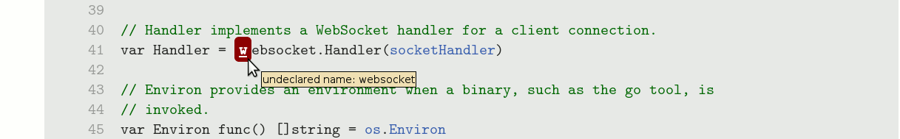

### Identifier resolution

In the source view, every referring identifier is annotated with information about the language entity it refers to: a package, constant, variable, type, function or statement label. Hovering over the identifier reveals the entity's kind and type (e.g. `var x int` or `func f func(int) string`).

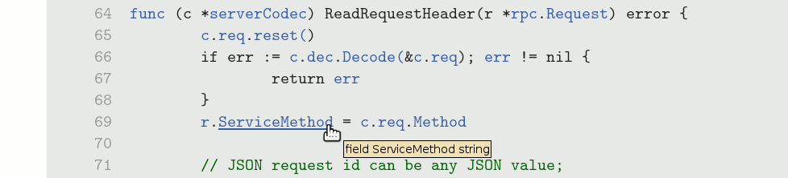

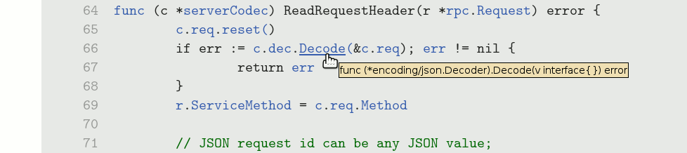

Clicking the link takes you to the entity's definition.

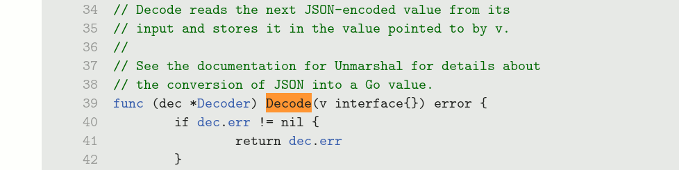

### Type information: size/alignment, method set, interfaces

Clicking on the identifier that defines a named type causes a panel to appear, displaying information about the named type, including its size and alignment in bytes, its [method set](https://go.dev/ref/spec#Method_sets), and its *implements* relation: the set of types T that are assignable to or from this type U where at least one of T or U is an interface. This example shows information about `net/rpc.methodType`.

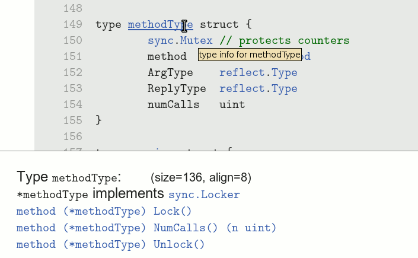

The method set includes not only the declared methods of the type, but also any methods "promoted" from anonymous fields of structs, such as `sync.Mutex` in this example. In addition, the receiver type is displayed as `*T` or `T` depending on whether it requires the address or just a copy of the receiver value.

The method set and *implements* relation are also available via the package view.

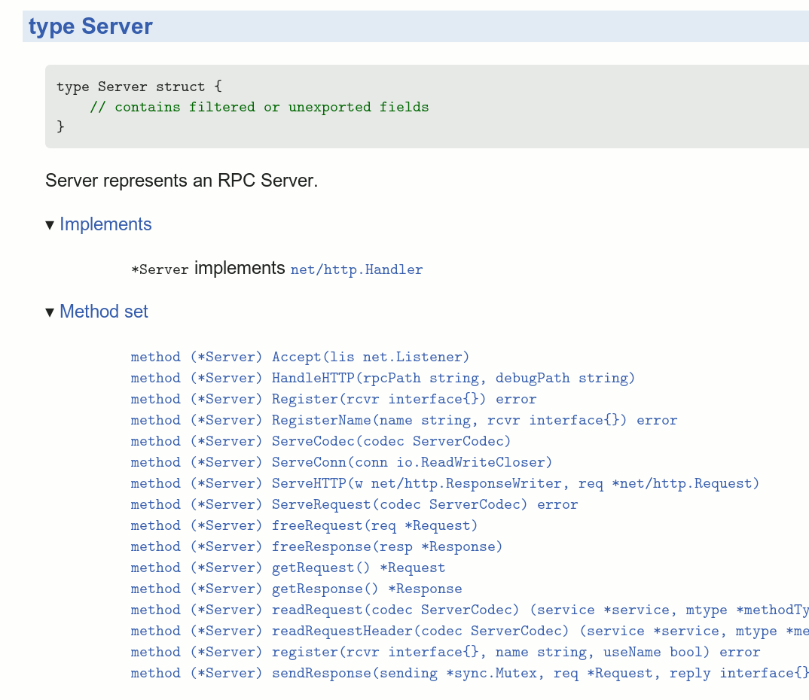

## Pointer analysis features

`godoc -analysis=pointer` additionally performs a precise whole-program **pointer analysis**. In other words, it approximates the set of memory locations to which each reference—not just vars of kind `*T`, but also `[]T`, `func`, `map`, `chan`, and `interface`—may refer. This information reveals the possible destinations of each dynamic call (via a `func` variable or interface method), and the relationship between send and receive operations on the same channel.

Compared to type analysis, pointer analysis requires more time and memory, and is impractical for code bases exceeding a million lines.

### Call graph navigation

When pointer analysis is complete, the source view annotates the code with **callers** and **callees** information: callers information is associated with the `func` keyword that declares a function, and callees information is associated with the open paren '`(`' of a function call.

In this example, hovering over the declaration of the `rot13` function (defined in strings/strings_test.go) reveals that it is called in exactly one place.

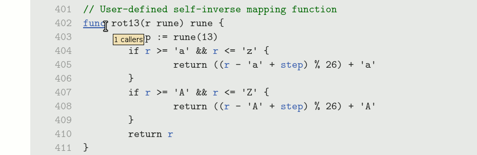

Clicking the link navigates to the sole caller. (If there were multiple callers, a list of choices would be displayed first.)

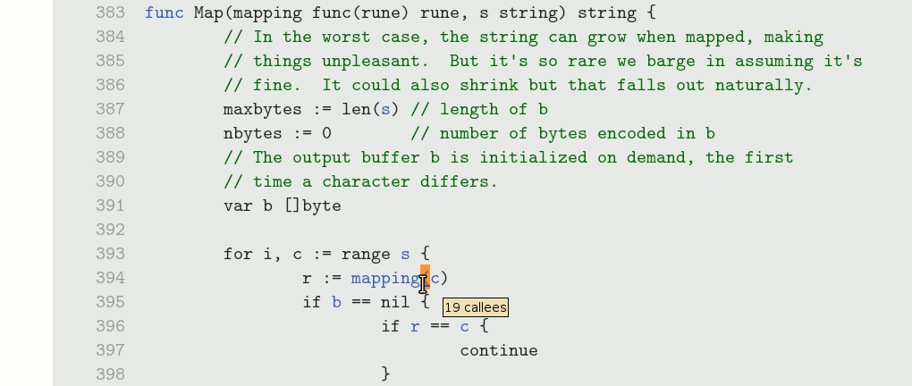

Notice that hovering over this call reveals that there are 19 possible callees at this site, of which our `rot13` function was just one: this is a dynamic call through a variable of type `func(rune) rune`. Clicking on the call brings up the list of all 19 potential callees, shown truncated. Many of them are anonymous functions.

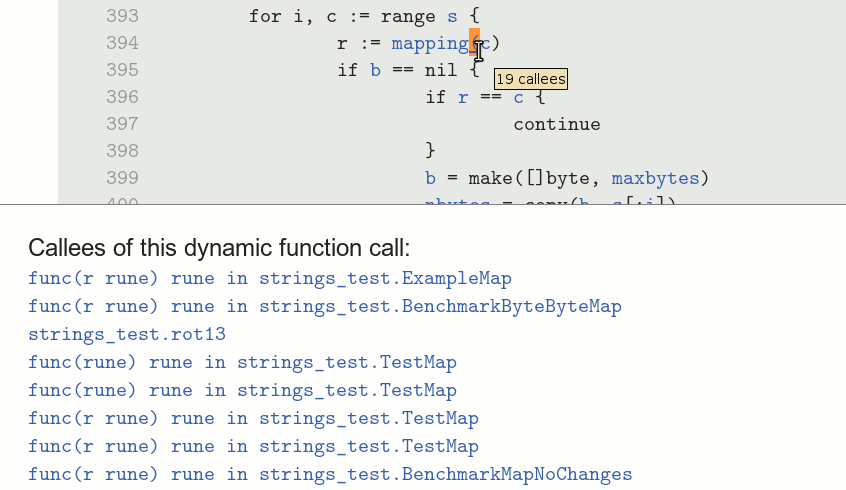

Pointer analysis gives a very precise approximation of the call graph compared to type-based techniques. As a case in point, the next example shows the dynamic call inside the `testing` package responsible for calling all user-defined functions named `Example*XYZ*`.

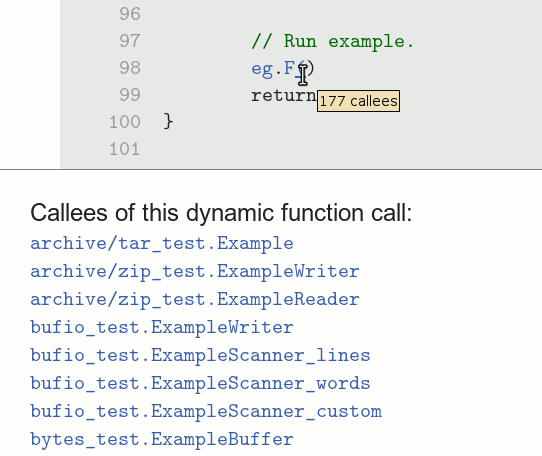

Recall that all such functions have type `func()`, i.e. no arguments and no results. A type-based approximation could only conclude that this call might dispatch to any function matching that type—and these are very numerous in most programs—but pointer analysis can track the flow of specific `func` values through the testing package. As an indication of its precision, the result contains only functions whose name starts with `Example`.

### Intra-package call graph

The same call graph information is presented in a very different way in the package view. For each package, an interactive tree view allows exploration of the call graph as it relates to just that package; all functions from other packages are elided. The roots of the tree are the external entry points of the package: not only its exported functions, but also any unexported or anonymous functions that are called (dynamically) from outside the package.

This example shows the entry points of the `path/filepath` package, with the call graph for `Glob` expanded several levels

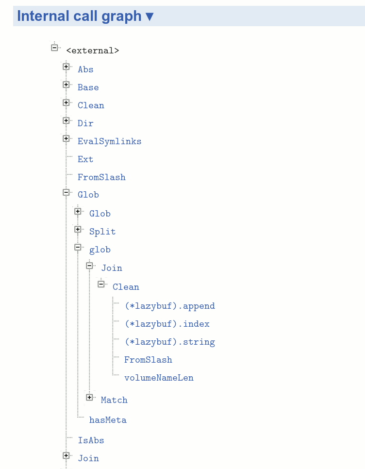

Notice that the nodes for Glob and Join appear multiple times: the tree is a partial unrolling of a cyclic graph; the full unrolling is in general infinite.

For each function documented in the package view, another interactive tree view allows exploration of the same graph starting at that function. This is a portion of the internal graph of `net/http.ListenAndServe`.

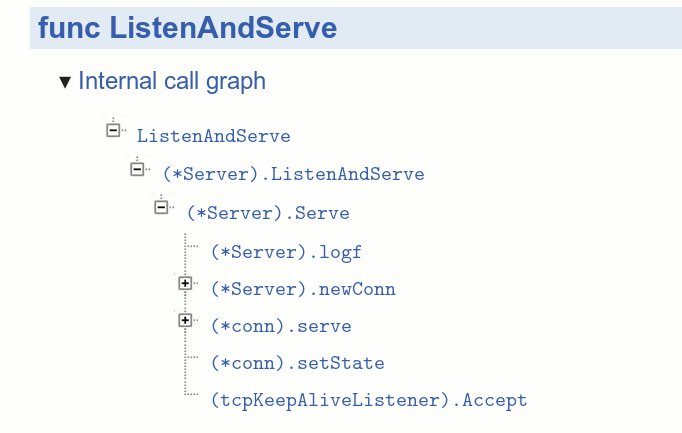

### Channel peers (send ↔ receive)

Because concurrent Go programs use channels to pass not just values but also control between different goroutines, it is natural when reading Go code to want to navigate from a channel send to the corresponding receive so as to understand the sequence of events.

Godoc annotates every channel operation—make, send, range, receive, close—with a link to a panel displaying information about other operations that might alias the same channel.

This example, from the tests of `net/http`, shows a send operation on a `chan bool`.

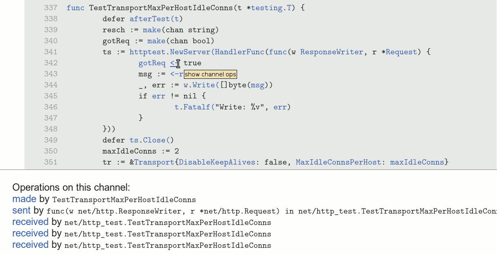

Clicking on the `<-` send operator reveals that this channel is made at a unique location (line 332) and that there are three receive operations that might read this value. It hardly needs pointing out that some channel element types are very widely used (e.g. struct{}, bool, int, interface{}) and that a typical Go program might contain dozens of receive operations on a value of type `chan bool`; yet the pointer analysis is able to distinguish operations on channels at a much finer precision than based on their type alone.

Notice also that the send occurs in a different (anonymous) function from the outer one containing the `make` and the receive operations.

Here's another example of send on a different `chan bool`, also in package `net/http`:

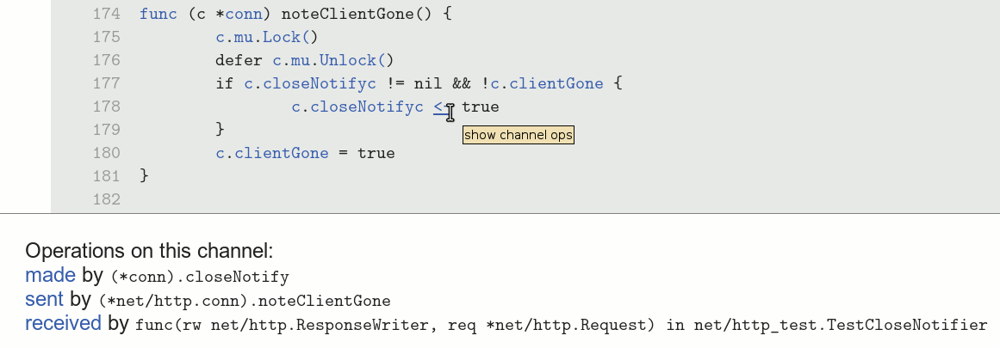

The analysis finds just one receive operation that might receive from this channel, in the test for this feature.

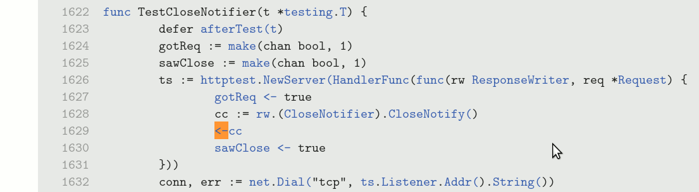

## Known issues

All analysis results pertain to exactly one configuration (e.g. amd64 linux). Files that are conditionally compiled based on different platforms or build tags are not visible to the analysis.

Files that `import "C"` require preprocessing by the cgo tool. The file offsets after preprocessing do not align with the unpreprocessed file, so markup is misaligned.

Files are not periodically re-analyzed. If the files change underneath the running server, the displayed markup is misaligned.

Additional issues are listed at [tools/godoc/analysis/README](https://go.googlesource.com/tools/+/master/godoc/analysis/README).