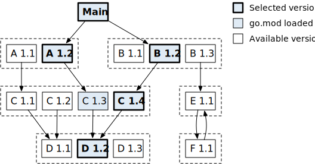
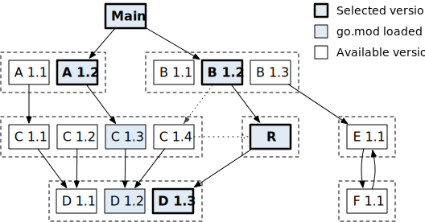
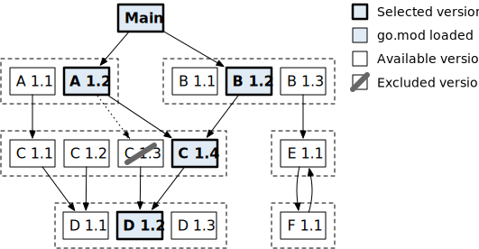
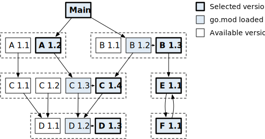
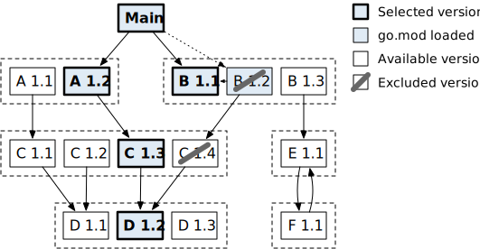

+++
title = "最小版本选择 (MVS)"
date = 2023-05-17T09:59:21+08:00
weight = 4
description = ""
isCJKLanguage = true
draft = false
+++
## Minimal version selection (MVS) 最小版本选择 (MVS)

> 原文：[https://go.dev/ref/mod#minimal-version-selection](https://go.dev/ref/mod#minimal-version-selection)

​	Go 使用一种叫做最小版本选择（`MVS`）的算法来选择一组模块的版本，以便在构建包时使用。在Russ Cox的[Minimal Version Selection（最小版本选择）](https://research.swtch.com/vgo-mvs)中详细描述了`MVS`。

​	从概念上讲，MVS在模块的有向图上操作，用[go.mod文件](../gomodFiles)指定。图中的每个顶点代表一个模块版本。每条边代表一个依赖的最小需求版本，用[require](../gomodFiles#require-directive)指令指定。该图可以通过主模块的`go.mod`文件中的[exclude](../gomodFiles#exclude-directive)和[replace](../gomodFiles#replace-directive)指令以及`go.work`文件中的[replace](../Workspaces#replace-directive)指令来修改。

​	MVS 生成[build list（构建列表）](../Glossary#build-list)作为输出，即用于构建的模块版本列表。

​	MVS 从主模块（图中没有版本的特殊顶点）开始，遍历图，跟踪每个模块所需的最高版本。在遍历结束后，所需的最高版本组成了构建列表：它们是满足所有requirements的最小版本。

​	可以用 [go list -m all](../Module-awareCommands#go-list-m) 命令来检查构建列表。与其他依赖项管理系统不同，构建列表不保存在一个 "lock"文件中。MVS是确定性的，当新版本的依赖项发布时，构建列表不会改变，因此在每个模块感知命令的开头使用MVS进行计算。

​	考虑下图中的示例。主模块要求模块 A 的版本为 1.2 或更高，模块 B 的版本为 1.2 或更高。A 1.2和B 1.2分别需要C 1.3和C 1.4。C 1.3和C 1.4都需要D 1.2。

​		Module version graph with visited versions highlighted

​      模块版本图，访问过的版本突出显示

​	MVS访问并加载用蓝色突出显示的每个模块版本的`go.mod`文件。在该图遍历结束时，MVS返回一个包含加粗版本的构建列表：A 1.2, B 1.2, C 1.4, 和 D 1.2。注意，B和D的更高版本是可用的，但MVS并没有选择它们，因为没有任何东西需要它们。

### Replacement 替换

​	模块的内容（包括它的`go.mod`文件）可以用主模块的`go.mod`文件或工作区的`go.work`文件中的`replace`指令来替换。`replace`指令可以应用于模块的特定版本或模块的所有版本。

​	替换会改变模块图，因为替换的模块可能与被替换的版本有不同的依赖项。

​	考虑下面的例子，其中 C 1.4被 R 替换。R依赖于D 1.3而不是D 1.2，所以MVS返回一个包含A 1.2、B 1.2、C 1.4（用R替换）和D 1.3的构建列表。

​								Module version graph with a replacement 

​									 带替换的模块版本图

### Exclusion 排除

​	模块也可以用主模块`go.mod`文件中的[exclude 指令](../gomodFiles#exclude-directive)在特定的版本中被排除。

​	排除也会改变模块图。当一个版本被排除时，它被从模块图中移除，对它的 requirements 被重定向到下一个更高版本。

​	考虑下面的例子。C 1.3 已经被排除。MVS 将表现得好像 A 1.2 需要 C 1.4（下一个更高版本）而不是 C 1.3 。

​								Module version graph with an exclusion

​										带排除的模块版本图

### Upgrades 升级

​	[go get](../Module-awareCommands#go-get) 命令可以用来升级一组模块。为了执行升级，`go` 命令在运行 MVS 之前更改了模块图，增加了从访问的版本到升级的版本的 edges （边）。

Consider the example below. Module B may be upgraded from 1.2 to 1.3, C may be upgraded from 1.3 to 1.4, and D may be upgraded from 1.2 to 1.3.

​	考虑下面的例子。模块 B 可以从 1.2 升级到 1.3，C 可以从 1.3 升级到 1.4，D 可以从 1.2 升级到 1.3。

​						Module version graph with upgrades

​												带有升级的模块版本图

​	升级（和降级）可能会增加或移除间接依赖项。在这种情况下，E 1.1和F 1.1在升级后出现在构建列表中，因为E 1.1是B 1.3所需要的。

​	为了保护升级，`go`命令更新了`go.mod`中的 requirements 。它将更改B的 requirement 为1.3版本。它还将添加对C 1.4和D 1.3的 requirements ，并加上`// indirect`注释，因为这些版本在其他情况下不会被选中。

### Downgrade 降级

​	[go get](../Module-awareCommands#go-get) 命令也可以用来降级一组模块。为了执行降级，`go`命令通过移除降级后的版本来更改模块图。它也会移除依赖于被移除版本的其他模块的版本，因为它们可能与降级后的依赖版本不兼容。如果主模块需要一个被降级移除的模块版本，该 requirement 将被更改为未被移除的先前版本。如果没有先前的版本，该 requirement 将被放弃。

​	考虑下面的例子。假设发现 C 1.4 有问题，所以我们降级到 C 1.3。C 1.4被从模块图中移除。B 1.2 也被移除，因为它需要 C 1.4 或更高版本。主模块对B的 requirement 被改为1.1。

​				Module version graph with downgrade

​										带有降级的模块版本图

​	[go get](../Module-awareCommands#go-get)也可以完全移除依赖项，在参数后使用`@none`后缀。这与降级的工作原理类似。所有被命名的模块的版本都会从模块图中移除。