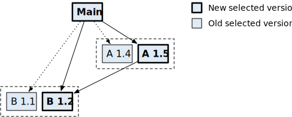
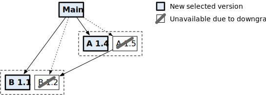

+++
title = "具有模块感知的命令"
date = 2023-05-17T09:59:21+08:00
weight = 8
description = ""
isCJKLanguage = true
draft = false
+++
## Module-aware commands 具有模块感知的命令

> 原文：[https://go.dev/ref/mod#mod-commands](https://go.dev/ref/mod#mod-commands)

​	大多数 `go` 命令可以在模块感知模式或 `GOPATH` 模式下运行。在模块感知模式下，`go`命令使用`go.mod`文件来查找版本依赖项，它通常从[module cache（模块缓存）](../Glossary#module-cache)中加载包，如果缺少模块则下载模块。在`GOPATH`模式下，`go`命令忽略了模块；它在[vendor 目录](../Glossary#vendor-directory)和`GOPATH`中寻找依赖项。

​	从Go 1.16开始，无论`go.mod`文件是否存在，模块感知模式都是默认启用的。在较低的版本中，当当前目录或任何父目录中存在`go.mod`文件时，模块感知模式被启用。

​	模块感知模式可以通过`GO111MODULE`环境变量来控制，该变量可以设置为`on`、`off`、或`auto`。

- 如果`GO111MODULE=off`，`go`命令会忽略`go.mod`文件，并在`GOPATH`模式下运行。
- 如果`GO111MODULE=on`或未设置，则`go`命令在模块感知模式下运行，即使没有`go.mod`文件存在。并非所有命令在没有`go.mod`文件的情况下都能运行：参见[Module commands outside a module（模块外的模块命令）](#module-commands-outside-a-module)。
- 如果`GO111MODULE=auto`，如果当前目录或任何父目录中存在`go.mod`文件，`go`命令将以模块感知模式运行。在Go 1.15及更低版本中，这是默认行为。即使没有`go.mod`文件，`go mod`子命令和带[version query（版本查询）](#version-queries)的`go install`也会以模块感知模式运行。

​	在模块感知模式下，`GOPATH` 在构建过程中不再定义导入的含义，但它仍然存储下载的依赖项（在 `GOPATH/pkg/mod` 中；参见[Module cache（模块缓存）](../ModuleCache)）和安装的命令（在 `GOPATH/bin` 中，除非设置了 `GOBIN`）。

### Build commands 构建命令

​	所有加载包信息的命令都是模块感知的。这包括：

- `go build`
- `go fix`
- `go generate`
- `go get`
- `go install`
- `go list`
- `go run`
- `go test`
- `go vet`

​	在模块感知模式下运行时，这些命令使用`go.mod`文件来解释命令行中列出的或写在Go源文件中的导入路径。这些命令接受以下所有模块命令通用的标志：

（a）`-mod`标志控制`go.mod`是否可以自动更新以及是否使用`vendor`目录。

- `-mod=mod`告诉`go`命令忽略 `vendor` 目录并[automatically update（自动更新）](../gomodFiles#automatic-updates)`go.mod`，例如，当没有任何已知模块提供导入的包时。
- `-mod=readonly`告诉`go`命令忽略`vendor`目录，并在`go.mod`需要更新时报告一个错误。
- `-mod=vendor`告诉`go`命令使用`vendor`目录。在这种模式下，`go`命令将不使用网络或模块缓存。
- 默认情况下，如果`go.mod`中的[go 版本](../gomodFiles#go-directive)是`1.14`或更高，并且有一个`vendor`目录，`go`命令就会像使用`-mod=vendor`一样行事。否则，`go`命令会像使用了`-mod=readonly`一样行事。

（b）`-modcacherw`标志指示`go`命令以读写权限在模块缓存中创建新目录，而不是让它们成为只读。当这个标志被一致地使用时（通常是通过在环境中设置`GOFLAGS=-modcacherw`或运行`go env -w GOFLAGS=-modcacherw`），模块缓存可以用`rm -r`等命令删除，而不必先更改权限。[go clean -modcache](#go-clean-modcache)命令可以用来删除模块缓存，无论是否使用了`-modcacherw`。

（c）`-modfile=file.mod`标志指示`go`命令读取（也可能写入）一个替代文件，而不是模块根目录下的`go.mod`。该文件的名称必须以`.mod`结尾。一个名为`go.mod`的文件必须仍然存在，以便确定模块根目录，但它不会被访问。当指定`-modfile`时，也会使用另一个`go.sum`文件：它的路径是通过修剪`.mod`扩展名和附加`.sum`从`-modfile`标志中得出的。

### Vendoring

​	当使用模块时，`go`命令通常通过将模块从它们的源下载到模块缓存中，然后从这些下载的副本中加载包来满足依赖项。Vendoring 可以用来允许与旧版本的Go互操作，或者确保所有用于构建的文件都存储在单个文件树中。

​	[go mod vendor](#go-mod-vendor)命令在主模块的根目录下构建一个名为`vendor`的目录，其中包含[主模块](../Glossary#main-module)中构建和测试包所需的所有包的副本。那些只被主模块外的包测试所导入的包不包括在内。与[go mod tidy](#go-mod-tidy)和其他模块命令一样，在构建`vendor`目录时，除了`ignore`之外，不考虑其他的[build constraints（构建约束）](../Glossary#build-constraint)。

​	`go mod vendor`还创建了包含供应商包列表和从中复制包的模块版本的`vendor/modules.txt`文件。启用 vendoring 时，这个清单被用作模块版本信息的来源，正如 [go list -m](#go-list-m) 和 [go version -m](#go-version-m) 所报告的那样。当 `go` 命令读取 `vendor/modules.txt` 时，它会检查模块的版本是否与 `go.mod` 一致。如果`go.mod`在`vendor/modules.txt`生成后发生了变化，`go`命令将报告一个错误。应再次运行`go mod vendor`以更新`vendor`目录。

​	如果`vendor`目录存在于主模块的根目录中，如果主模块的`go.mod`文件中的 go 版本是`1.14`或更高，它将被自动使用。要显式地启用 vendoring 功能，请在调用`go`命令时使用`-mod=vendor`标志。要禁用 vendoring，请使用 `-mod=readonly` 或 `-mod=mod`标志。

​	启用vendoring后，像`go build`和`go test`这样的[build commands（构建命令）](#build-commands)会从`vendor`目录中加载包，而不是访问网络或本地模块缓存。[go list -m](#go-list-m)命令只打印`go.mod`中列出的模块信息。当启用 vendoring 时，`go mod`命令（如[go mod download](#go-mod-download) 和 [go mod tidy](#go-mod-tidy)）的工作方式不会有所不同，它们仍然会下载模块和访问模块缓存。 当启用 vendoring 时，[go get](#go-get)也不会有不同工作方式。

​	与[在`GOPATH`模式下 vendoring](../../../Other/Go1_5VendorExperiment) 不同的是，`go`命令忽略了主模块根目录以外的 `vendor` 目录。此外，由于不使用其他模块中的 `vendor` 目录，`go`命令在构建[module zip files（模块压缩文件）](../ModuleZipFiles)时不包括`vendor` 目录（但请参阅已知 bugs [#31562](https://go.dev/issue/31562)和[#37397](https://go.dev/issue/37397)）。

### go get

使用方法：

```
go get [-d] [-t] [-u] [build flags] [packages]
```

示例：

```
# Upgrade a specific module. 
# 升级特定模块。
$ go get golang.org/x/net

# Upgrade modules that provide packages imported by packages in the main module.
# 升级被主模块中包所导入的包的模块。
$ go get -u ./...

# Upgrade or downgrade to a specific version of a module.
# 升级或降级到模块的特定版本。
$ go get golang.org/x/text@v0.3.2

# Update to the commit on the module's master branch.
# 更新到模块的主分支上的提交。
$ go get golang.org/x/text@master

# Remove a dependency on a module and downgrade modules that require it
# to versions that don't require it.
# 移除模块上的依赖项，并将需要它的模块降级为不需要它的版本。
$ go get golang.org/x/text@none
```

​	`go get`命令更新[main module （主模块）](../Glossary#main-module)的`go.mod`文件中的模块依赖项，然后构建并安装命令行中列出的包。

​	第一步是确定要更新哪些模块。`go get`接受包、包模式和模块路径的列表作为参数。如果指定了包参数，`go get`将更新提供该包的模块。如果指定了包模式（例如，`all`或带有`...`通配符的路径），`go get` 将该模式扩展为一组包，然后更新提供包的模块。如果一个参数命名了一个模块而不是一个包（例如，模块 `golang.org/x/net` 在其根目录下没有包），`go get` 将会更新模块，但不会构建包。如果没有指定参数，`go get`的行为就像指定了`.`（当前目录下的包）；这可以和`-u`标志一起使用，以更新提供导入包的模块。

​	每个参数可以包括一个版本查询后缀，表示所需的版本，如`go get golang.org/x/text@v0.3.0`。版本查询后缀由`@`符号和[version query（版本查询）](#version-queries)组成，后者可以表示一个特定的版本（`v0.3.0`），一个版本前缀（`v0.3`），一个分支或标签名称（`master`），一个修订版（`1234abcd`），或者一个特殊的查询`latest`，`upgrade`，`patch`，或`none`。如果没有给出版本，`go get`使用`@upgrade`查询。

​	一旦`go get`将参数解析为特定的模块和版本，`go get`将在主模块的`go.mod`文件中添加、更改或移除[require 指令](../gomodFiles#require-directive)，以确保这些模块在未来保持所需的版本。注意，`go.mod`文件中的要求版本是***最小版本***，可能会随着新的依赖项的加入而自动增加。参见[Minimal version selection (MVS)（最小版本选择（MVS））](../MVS)，了解如何通过模块感知命令选择版本和解决冲突的细节。

​	当命令行上命名的模块被添加、升级或降级时，如果命名的模块的新版本需要其他更高版本的模块，其他模块可能被升级。例如，假设模块`example.com/a`升级到`v1.5.0`版本，该版本需要`v1.2.0`版本的模块`example.com/b`。如果模块`example.com/b`目前需要`v1.1.0`版本，`go get example.com/a@v1.5.0`也会将`example.com/b`升级到`v1.2.0`。



​		go get upgrading a transitive requirement

​					go get 升级一个过渡性需求

​	当命令行上命名的模块被降级或移除时，其他模块可能会被降级。继续上面的例子，假设模块 `example.com/b` 被降级到 `v1.1.0`。模块 `example.com/a` 也将被降级为需要`v1.1.0`的 `example.com/b`  的版本或更低的版本。



​		go get downgrading a transitive requirement

​				go get 降级一个过渡性需求

​	可以使用版本后缀`@none` 移除模块需求。这是一种特殊的降级。依赖于被移除模块的模块将被降级或根据需要被移除。模块需求可以被移除，即使它的一个或多个包被主模块的包所导入。在这种情况下，下一个构建命令可能会添加一个新的模块需求。

​	如果需要两个不同的版本的模块（在命令行参数中明确指定或为了满足升级和降级），`go get`将报告一个错误。

​	在`go get`选择了一组新的版本后，它会检查任何新选择的模块版本或任何在命令行上命名的提供包的模块是否被[retracted（撤回）](../Glossary#retracted-version)或[deprecated（废弃）](../Glossary#deprecated-module)。`go get`为它发现的每个撤回的版本或废弃的模块打印一个警告。`go list -m -u all`可以用来检查所有依赖项中的撤回和废弃。

After `go get` updates the `go.mod` file, it builds the packages named on the command line. Executables will be installed in the directory named by the `GOBIN` environment variable, which defaults to `$GOPATH/bin` or `$HOME/go/bin` if the `GOPATH` environment variable is not set.

​	在`go get`更新`go.mod`文件后，它将构建命令行上指定的包。可执行文件将被安装在由`GOBIN`环境变量命名的目录中，如果没有设置`GOBIN`环境变量，则默认为`$GOPATH/bin或$HOME/go/bin`。=>仍有疑问？？这里应该是："如果没有设置`GOBIN`环境变量"。


`go get`支持以下标志：

- `-d` 标志告诉 `go get` 不要构建或安装包。当使用 `-d` 时，`go get` 将只管理 `go.mod` 中的依赖项。在没有`-d`的情况下使用`go get`来构建和安装包已经被废弃了（从Go 1.17开始）。在 Go 1.18 中，`-d` 将永远被启用。
- `-u` 标志告诉 `go get` 升级提供直接或间接由命令行上命名的包导入的模块。由 `-u` 选择的每个模块将被升级到其最新版本，除非它已经被要求在一个更高的（预发布版）版本。
- `-u=patch`标志（不是`-u patch`）也告诉`go get`升级依赖项，但`go get`将把每个依赖项升级到最新的修订版本（类似于`@patch`版本查询）。
- `-t` 标志告诉 `go get` 考虑构建命令行上命名的包的测试所需的模块。当`-t`和`-u`一起使用时，`go get`也会更新测试依赖。
- 不应再使用 `-insecure` 标志。它允许`go get`解析自定义导入路径，并使用不安全的方案（如HTTP）从存储库和模块代理处获取。`GOINSECURE` [environment variable（环境变量）](../EnvironmentVariables)提供了更精细的控制，应该使用它来代替。

​	从 Go 1.16 开始，[go install](#go-install) 是推荐用于构建和安装程序的命令。当与版本后缀一起使用时（如`@latest`或`@v1.4.6`），`go install`以模块感知模式构建包，忽略当前目录或任何父目录中的`go.mod`文件（如果有的话）。

​	`go get` 更加专注于管理 `go.mod` 中的需求。`-d` 标志已被弃用，在 Go 1.18 中，它将一直被启用。

### go install

使用方法：

```
go install [build flags] [packages]
```

示例：

```
# Install the latest version of a program,
# ignoring go.mod in the current directory (if any).
# 安装一个程序的最新版本。忽略当前目录中的 go.mod（如果有的话）。
$ go install golang.org/x/tools/gopls@latest

# Install a specific version of a program.
# 安装一个特定版本的程序。
$ go install golang.org/x/tools/gopls@v0.6.4

# Install a program at the version selected by the module in the current directory.
# 在当前目录下安装一个由模块选择的版本的程序。
$ go install golang.org/x/tools/gopls

# Install all programs in a directory.
# 在一个目录中安装所有程序。
$ go install ./cmd/...
```

The `go install` command builds and installs the packages named by the paths on the command line. Executables (`main` packages) are installed to the directory named by the `GOBIN` environment variable, which defaults to `$GOPATH/bin` or `$HOME/go/bin` if the `GOPATH` environment variable is not set. Executables in `$GOROOT` are installed in `$GOROOT/bin` or `$GOTOOLDIR` instead of `$GOBIN`. Non-executable packages are built and cached but not installed.

​	`go install`命令建立并安装由命令行上的路径命名的包。可执行文件（`main`包）被安装到由`GOBIN`环境变量命名的目录中，如果没有设置`GOPATH`环境变量，则默认为`$GOPATH/bin`或`$HOME/go/bin`。`$GOROOT`中的可执行程序会被安装到`$GOROOT/bin`或`$GOTOOLDIR`中，而不是`$GOBIN`。非可执行包会被构建和缓存，但不会安装。=>仍有疑问？？这里应该是："如果没有设置`GOBIN`环境变量"？

​	从Go 1.16开始，如果参数有版本后缀（如`@latest`或`@v1.0.0`），`go install`会以模块感知模式构建包，忽略当前目录或任何父目录中的`go.mod`文件（如果有）。这对于安装可执行文件而不影响主模块的依赖项很有用。

​	为了消除在构建中使用哪些模块版本的歧义，参数必须满足以下限制：

（a）参数必须是包路径或包模式（带有"`...`"通配符）。它们不能是标准包（如`fmt`）、元模式（`std`、`cmd`、`all`）或相对或绝对文件路径。

（b）所有参数必须具有相同的版本后缀。不允许使用不同的查询，即使它们引用的是同一个版本。

（c）所有参数必须引用同一模块中同一版本的包。

（d）包路径参数必须指的是`main`包。模式参数将只匹配`main`包。

（e）没有模块被认为是主模块。

- 如果命令行中包含包的模块有一个 `go.mod`文件，那么它就不能包含指令（`replace`和`exclude`），如果它是主模块，那么这些指令会导致对它的解释不同。
- 该模块不能要求自己有更高的版本。
- 在任何模块中都不使用`vendor`目录。(`vendor`目录不包括在[module zip files（模块压缩文件）](../ModuleZipFiles)中，所以`go install`不会下载它们）。

​	有关支持的版本查询语法，请参见[Version queries（版本查询）](#version-queries)。Go 1.15 及以下版本不支持在 `go install` 中使用版本查询。

​	如果参数没有版本后缀，`go install` 可能以模块感知模式或 `GOPATH` 模式运行，这取决于 `GO111MODULE` 环境变量和 `go.mod` 文件的存在。详情请参见[模块感知命令](#module-aware-commands)。如果启用了模块感知模式，`go install` 在主模块的上下文中运行，这可能与包含正在安装的包的模块不同。

### go list -m

使用方法：

```
go list -m [-u] [-retracted] [-versions] [list flags] [modules]
```

示例：

```
$ go list -m all
$ go list -m -versions example.com/m
$ go list -m -json example.com/m@latest
```

​	`-m`标志使`go list`列出模块而不是包。在这种模式下，`go list`的参数可以是模块、模块模式（包含`...`通配符）、[版本查询](#version-queries)，或者特殊模式`all`（它匹配[build list（构建列表）](../Glossary#build-list)中的所有模块）。如果没有指定参数，[main module（主模块）](../Glossary#main-module)将被列出。

​	当列出模块时，`-f`标志仍然指定应用于`Go` 结构体的格式模板，但现在是一个`Module`结构体：

```
type Module struct {
    Path       string        // module path
    Version    string        // module version
    Versions   []string      // available module versions
    Replace    *Module       // replaced by this module
    Time       *time.Time    // time version was created
    Update     *Module       // available update (with -u)
    Main       bool          // is this the main module?
    Indirect   bool          // module is only indirectly needed by main module
    Dir        string        // directory holding local copy of files, if any
    GoMod      string        // path to go.mod file describing module, if any
    GoVersion  string        // go version used in module
    Retracted  []string      // retraction information, if any (with -retracted or -u)
    Deprecated string        // deprecation message, if any (with -u)
    Error      *ModuleError  // error loading module
}

type ModuleError struct {
    Err string // the error itself
}
```

​	默认输出是打印模块路径，然后是版本和替换信息（如果有）。例如，`go list -m all`可能会打印：

```
example.com/main/module
golang.org/x/net v0.1.0
golang.org/x/text v0.3.0 => /tmp/text
rsc.io/pdf v0.1.1
```

​	`Module`结构体有一个`String`方法用来格式化这一行的输出，因此默认格式相当于`-f '{{.String}}'`。

​	注意，当一个模块被替换时，它的`Replace`字段描述了替换的模块，它的`Dir`字段被设置为替换模块的源代码（如果存在的话）。(也就是说，如果`Replace`不是nil，那么Dir被设置为`Replace.Dir`，不能访问被替换的源代码。)

​	`-u` 标志增加了关于可用升级的信息。当一个给定模块的最新版本比当前版本新时，`list -u`将模块的`Update`字段设置为较新模块的信息。`list -u`还打印当前选择的版本是否[retracted（被撤回）](../Glossary#retracted-version)，以及该模块是否[deprecated（被废弃）](../gomodFiles#deprecation)。模块的 `String` 方法通过在当前版本后面的方括号中格式化较新的版本来表示可用的升级。例如，`go list -m -u all`可能打印：

```
example.com/main/module
golang.org/x/old v1.9.9 (deprecated)
golang.org/x/net v0.1.0 (retracted) [v0.2.0]
golang.org/x/text v0.3.0 [v0.4.0] => /tmp/text
rsc.io/pdf v0.1.1 [v0.1.2]
```

(对于工具来说，`go list -m -u -json all` 可能更方便解析。)

​	`-versions` 标志使 `list` 将模块的 `Versions` 字段设置为该模块的所有已知版本的列表，按照语义版本划分从低到高排序。该标志还改变了默认的输出格式，以显示模块路径后跟空格分隔的版本列表。除非同时指定了`-retracted`标志，否则这个列表中会省略掉被撤回的版本。

​	`-retracted` 标志指示 `list` 在用 `-versions` 标志打印的列表中显示撤回的版本，并在解析版本查询时考虑撤回的版本。例如，`go list -m -retracted example.com/m@latest` 显示了 `example.com/m` 模块的最高发布或预发布版本，即使该版本已被撤回。[retract 指令](../gomodFiles#retract-directive)和[废弃](../gomodFiles#deprecation)的内容会以该版本从 `go.mod` 文件加载。`-retracted`标志是在Go 1.16中加入的。

​	模板函数`module`接收单个字符串参数，该参数必须是模块路径或查询，并将指定的模块作为`Module`结构体返回。如果发生错误，结果将是一个带有非nil`Error`字段的`Module`结构体。

### go mod download

使用方法：

```
go mod download [-json] [-x] [modules]
```

示例：

```
$ go mod download
$ go mod download golang.org/x/mod@v0.2.0
```

​	`go mod download`命令将命名的模块下载到[module cache（模块缓存）](../Glossary#module-cache)中。参数可以是选择主模块的依赖项的模块路径或模块模式，也可以是`path@version`形式的[版本查询](#version-queries)。如果没有参数，`download`适用于[主模块](../Glossary#main-module)的所有依赖项。

`go`命令会在正常执行过程中根据需要自动下载模块。`go mod download`命令主要用于预先填充模块缓存或加载由[module proxy（模块代理）](../Glossary#module-proxy)提供的数据。

​	默认情况下，`download`不向标准输出写入任何内容。它将进度信息和错误打印到标准错误中。

​	`-json`标志使`download`将一连串的JSON对象打印到标准输出，描述每个下载的模块（或失败），对应于这个Go结构体：

```
type Module struct {
    Path     string // module path
    Query    string // version query corresponding to this version
    Version  string // module version
    Error    string // error loading module
    Info     string // absolute path to cached .info file
    GoMod    string // absolute path to cached .mod file
    Zip      string // absolute path to cached .zip file
    Dir      string // absolute path to cached source root directory
    Sum      string // checksum for path, version (as in go.sum)
    GoModSum string // checksum for go.mod (as in go.sum)
    Origin   any    // provenance of module
    Reuse    bool   // reuse of old module info is safe
}
```

​	`-x` 标志使`download`将`download`执行的命令打印到标准错误中。

### go mod edit

使用方法：

```
go mod edit [editing flags] [-fmt|-print|-json] [go.mod]
```

示例：

```
# Add a replace directive.
# 添加一个替换指令。
$ go mod edit -replace example.com/a@v1.0.0=./a

# Remove a replace directive.
# 移除一个替换指令。
$ go mod edit -dropreplace example.com/a@v1.0.0

# Set the go version, add a requirement, and print the file
# instead of writing it to disk.
# 设置go 版本，添加一个需求，并打印文件，而不是将其写入磁盘。
$ go mod edit -go=1.14 -require=example.com/m@v1.0.0 -print

# Format the go.mod file.
# 格式化 go.mod 文件
$ go mod edit -fmt

# Format and print a different .mod file.
# 格式化并打印一个不同的.mod文件。
$ go mod edit -print tools.mod

# Print a JSON representation of the go.mod file.
# 打印go.mod文件的JSON表示。
$ go mod edit -json
```

​	`go mod edit`命令为编辑和格式化`go.mod`文件提供了一个命令行界面，主要供工具和脚本使用。`go mod edit`只读取一个`go.mod`文件；它不查询其他模块的信息。默认情况下，`go mod edit`读写主模块的`go.mod`文件，但可以在编辑标志后指定一个不同的目标文件。

​	编辑标志指定了一连串的编辑操作。

- `-module`标志更改模块的路径（`go.mod`文件的模块行）。

- `-go=version` 标志设置预期的 Go 语言版本。

- `-require=path@version` 和 `-droprequire=path` 标志在给定的模块路径和版本上添加和移除一个需求。注意 `-require` 会覆盖路径上的任何现有需求。这些标志主要用于理解模块图的工具。用户应该更喜欢 `go get path@version` 或 `go get path@none`，它们会根据需要进行其他 `go.mod` 调整，以满足其他模块施加的约束。参见[go get](#go-get)。

- `-exclude=path@version` 和 `-dropexclude=path@version` 标志为指定的模块路径和版本添加和移除一个排除项。请注意，如果排除已经存在，则`-exclude=path@version`是一个no-op。

- `-replace=old[@v]=new[@v]` 标志增加对给定模块路径和版本的替换。如果省略了`old@v`中的`@v`，就会添加一个左侧没有版本的替换，它适用于旧模块路径的所有版本。如果`new@v`中的`@v`被省略，新路径应该是本地模块根目录，而不是模块路径。注意，`-replace` 覆盖了`old[@v]`的所有冗余替换，因此省略`@v`将移除对特定版本的替换。

- `-dropreplace=old[@v]` 标志会放弃对给定模块路径和版本的替换。如果提供了`@v`，就会移除具有给定版本的替换。左侧没有版本的现有替换仍然可以替换该模块。如果省略了`@v`，没有版本的替换将被移除。

- `-retract=version`和`-dropretract=version`标志为给定的版本添加和移除一个撤回，这个版本可以是一个单一的版本（如`v1.2.3`）或一个间隔（如`[v1.1.0,v1.2.0]`）。注意，`-retract`标志不能为`retract`指令添加理由注释。理由注释是推荐的，可以通过`go list -m -u`和其他命令显示。

  

​		编辑标志可以重复使用。更改是按照给出的顺序进行的。

​		`go mod edit`有额外的标志来控制其输出。

- `-fmt`标志对`go.mod`文件进行重新格式化，而不做其他修改。使用或重写 `go.mod` 文件的任何其他修改也暗示了这种重新格式化。只有在没有指定其他标志的情况下才需要这个标志，如`go mod edit -fmt`。
- `-print`标志以文本格式打印最终的`go.mod`，而不是将其写回磁盘。
- `-json`标志以JSON格式打印最终的`go.mod`，而不是以文本格式写回磁盘。JSON输出对应的是这些Go类型：

```
type Module struct {
    Path    string
    Version string
}

type GoMod struct {
    Module  ModPath
    Go      string
    Require []Require
    Exclude []Module
    Replace []Replace
    Retract []Retract
}

type ModPath struct {
    Path       string
    Deprecated string
}

type Require struct {
    Path     string
    Version  string
    Indirect bool
}

type Replace struct {
    Old Module
    New Module
}

type Retract struct {
    Low       string
    High      string
    Rationale string
}
```

​	注意，这只是描述`go.mod`文件本身，而不是间接引用的其他模块。要想知道构建中可用的全部模块，请使用`go list -m -json all`。参见[go list -m](#go-list-m)。

​	例如，一个工具可以通过解析`go mod edit -json`的输出来获得作为数据结构的`go.mod`文件，然后可以通过调用`go mod edit`的`-require`、`-exclude`等来进行更改。

​	工具也可以使用[golang.org/x/mod/modfile](https://pkg.go.dev/golang.org/x/mod/modfile?tab=doc)包来解析、编辑和格式化`go.mod`文件。

### go mod graph

使用方法：

```
go mod graph [-go=version]
```

​	`go mod graph`命令以文本形式打印[module requirement graph（模块需求图）](../Glossary#module-graph)（已应用替换）。例如：

```
example.com/main example.com/a@v1.1.0
example.com/main example.com/b@v1.2.0
example.com/a@v1.1.0 example.com/b@v1.1.1
example.com/a@v1.1.0 example.com/c@v1.3.0
example.com/b@v1.1.0 example.com/c@v1.1.0
example.com/b@v1.2.0 example.com/c@v1.2.0
```

​	模块图中的每个顶点代表一个模块的特定版本。图中的每条边代表对一个最小版本的依赖项的需求。

​	`go mod graph` 打印图中的边，每行一个。每行有两个空格分隔的字段：一个模块版本及其一个依赖项。每个模块版本是以`path@version`的形式标识的。主模块没有`@version`后缀，因为它没有版本。

​	`-go` 标志使 `go mod graph` 报告由给定 Go 版本加载的模块图，而不是 `go.mod` 文件中 [go 指令](../gomodFiles#go-directive)指示的版本。

​	参见[Minimal version selection (MVS)（最小版本选择（MVS））](../MVS)以了解更多关于如何选择版本的信息。参见 [go list -m](#go-list-m) 以打印选定的版本，以及 [go mod why](#go-mod-why) 以了解为什么需要某个模块。

### go mod init

使用方法：

```
go mod init [module-path]
```

示例：

```
go mod init
go mod init example.com/m
```

​	`go mod init`命令在当前目录下初始化并写入一个新的`go.mod`文件，实际上是在当前目录下创建一个新模块。这个`go.mod`文件必须事先不存在。

​	`init`接受一个可选参数，即新模块的[module path（模块路径）](../Glossary#module-path)。关于选择模块路径的说明，见[Module paths（模块路径）](../ModulesPackagesAndVersions#module-paths)。如果省略了模块路径参数，`init`将尝试使用`.go`文件中的导入注释、vendoring 工具配置文件和当前目录（如果在`GOPATH`）来推断模块路径。

​	如果 vendoring 工具的配置文件存在，`init`将尝试从其中导入模块需求。`init` 支持以下配置文件：

- `GLOCKFILE` (Glock)
- `Godeps/Godeps.json` (Godeps)
- `Gopkg.lock` (dep)
- `dependencies.tsv` (godeps)
- `glide.lock` (glide)
- `vendor.conf` (trash)
- `vendor.yml` (govend)
- `vendor/manifest` (gvt)
- `vendor/vendor.json` (govendor)

​	vendoring 工具的配置文件不可能总是以完美的保真度进行翻译。例如，如果同一存储库中的多个包以不同的版本被导入，而存储库只包含一个模块，那么导入的`go.mod`只能要求该模块的一个版本。您可能希望运行 [go list -m all](#go-list-m) 来检查构建列表中的所有版本，并运行 [go mod tidy](#go-mod-tidy) 来添加缺失的需求和移除未使用的需求。

### go mod tidy

使用方法：

```
go mod tidy [-e] [-v] [-go=version] [-compat=version]
```

​	`go mod tidy`确保`go.mod`文件与模块的源代码匹配。它添加任何缺失的模块需求，以构建当前模块的包和依赖项，并移除不提供任何相关包的模块的需求。它还会在`go.sum`中添加任何缺失的条目，并移除不必要的条目。

​	`-e` 标志（在 Go 1.16 中加入）使 `go mod tidy` 在加载包时遇到错误的情况下仍然尝试继续。

​	`-v`标志使`go mod tidy`将移除模块的信息打印到标准错误中。

​	`go mod tidy`的工作方式是以递归方式加载[main module（主模块）](../Glossary#main-module)中的所有包和它们导入的所有包。这包括由测试导入的包（包括其他模块中的测试）。`go mod tidy`的行为就像所有的构建标签都是启用的，所以它会考虑特定平台的源文件和需要自定义构建标签的文件，即使这些源文件通常不会被构建。有一个例外：`ignore`构建标签没有被启用，所以具有`//+build ignore`构建约束的文件将不会被考虑。注意，`go mod tidy`不会考虑主模块中名为`testdata`的目录或名称以`.`或`_`开头的包，除非这些包被其他包明确导入。

​	一旦`go mod tidy`加载了这组包，它将确保每个提供一个或多个包的模块在主模块的`go.mod`文件中都有`require`指令，或者 —— 如果主模块在`go 1.16`或以下 —— 被另一个`require`模块所需要。`go mod tidy`将在每个缺失的模块的最新版本上添加`require`（最新版本的定义参见[版本查询](#version-queries)）。

​	`go mod tidy` 也可以在 `require` 指令上添加或移除`// indirect`注释。一个`// indirect`注释表示一个模块没有提供被主模块中的包导入的包。(关于何时添加`// indirect`依赖项和注释的更多细节，请参见 [require 指令)](../gomodFiles#require-directive)。

​	如果设置了 `-go` 标志，`go mod tidy` 将更新 [go 指令](../gomodFiles#go-directive)到指定的版本，根据该版本启用或禁用[module graph pruning（模块图修剪）](../ModuleGraphPruning)和[lazy module loading（延迟模块加载）](../ModuleGraphPruning#lazy-module-loading)（并根据需要添加或移除间接需求）。

​	默认情况下，当模块图被`go`指令中指定的版本之前的Go版本加载时，`go mod tidy`将检查所选模块的版本是否没有发生变化。兼容性检查的版本也可以通过`-compat`标志显式指定。

### go mod vendor

使用方法：

```
go mod vendor [-e] [-v] [-o]
```

​	`go mod vendor` 命令在主模块的根目录下构建一个名为 `vendor` 的目录，其中包含所有支持主模块中的包的构建和测试所需的包的副本。那些只被主模块外的包测试所导入的包不包括在内。与[go mod tidy](#go-mod-tidy)和其他模块命令一样，在构建`vendor`目录时，不考虑其他的[build constraints（构建约束）](../Glossary#build-constraint)（`ignore`除外）。

​	当vendoring被启用时，`go`命令将从`vendor`目录中加载包，而不是将模块从它们的源下载到模块缓存中并使用那些下载的包。更多信息请参见[Vendoring](#vendoring)。

​	`go mod vendor`还创建`vendor/modules.txt`文件，该文件中包含供应商包列表和从中复制包的模块版本。启用vendoring时，这个清单被用作模块版本信息的来源，正如[go list -m](#go-list-m)和[go version -m](#go-version-m)所报告的。当 `go` 命令读取 `vendor/modules.txt` 时，它会检查模块的版本是否与 `go.mod` 一致。如果`go.mod`在`vendor/modules.txt`生成后发生了变化，那么应该再次运行`go mod vendor`。

​	注意，如果`vendor`目录存在，`go mod vendor`会在重新构造之前移除它。 不应该对vendored包进行本地修改。`go`命令并不检查`vendor`目录下的包是否被修改过，但可以通过运行`go mod vendor`并检查是否有修改来验证`vendor`目录的完整性。

​	`-e`标志（在Go 1.16中加入）使`go mod vendor`在加载包时遇到错误的情况下仍然尝试继续进行。

​	`-v` 标志使 `go mod vendor` 打印出 vendored 的模块和包的名称到标准错误。

​	`-o`标志（在Go 1.18中加入）使`go mod vendor`输出指定目录下的vendor树，而不是`vendor`。参数可以是绝对路径或相对于模块根的路径。

### go mod verify

使用方法：

```
go mod verify
```

​	`go mod verify`检查存储在[module cache（模块缓存）](../Glossary#module-cache)中的[main module（主模块）](../Glossary#main-module)的依赖项在下载后有没有被修改。为了进行这项检查，`go mod verify`对每个下载的模块[.zip文件](../ModuleZipFiles)和提取的目录进行散列，然后将这些散列与模块首次下载时记录的散列进行比较。`go mod verify`检查构建列表中的每个模块（可以用[go list -m all](#go-list-m)打印）。

​	如果所有的模块都没有被修改，`go mod verify`会打印出 "all modules verified"。否则，它会报告哪些模块被更改了，并以非零状态退出。

​	注意，所有的模块感知命令都会验证主模块的`go.sum`文件中的哈希值是否与下载到模块缓存中的模块的哈希值一致。如果`go.sum`文件中缺少哈希值（例如，因为模块是第一次使用），`go`命令会使用[校验数据库](../AuthenticatingModules#checksum-database)验证其哈希值（除非模块路径与`GOPRIVATE`或`GONOSUMDB`匹配）。详见[Authenticating modules（验证模块）](../AuthenticatingModules)。

​	相比之下，`go mod verify`会检查模块`.zip`文件及其提取的目录的哈希值是否与首次下载时模块缓存中记录的哈希值一致。这对检测模块下载和验证后模块缓存中文件的变化非常有用。`go mod verify`不下载缓存中没有的模块内容，也不使用`go.sum`文件来验证模块内容。然而，`go mod verify`可能会下载`go.mod`文件，以进行[minimal version selection（最小的版本选择）](../MVS)。它将使用`go.sum`来验证这些文件，并可能为缺少的哈希值添加`go.sum`条目。

### go mod why

使用方法：

```
go mod why [-m] [-vendor] packages...
```

​	`go mod why`在导入图中显示了从主模块到每个列出的包的最短路径。

​	输出是一个节序列，命令行上命名的每个包或模块对应一个节，用空行分隔。每个节都以`#`开头的注释行开始，给出目标包或模块。随后的行给出了通过导入图的路径，每行一个包。如果该包或模块没有被主模块引用，节将显示一个带圆括号的注释来说明这一事实。

示例：

```
$ go mod why golang.org/x/text/language golang.org/x/text/encoding
# golang.org/x/text/language
rsc.io/quote
rsc.io/sampler
golang.org/x/text/language

# golang.org/x/text/encoding
(main module does not need package golang.org/x/text/encoding)
```

​	`-m`标志使`go mod why`将其参数视为模块列表。`go mod why`将打印每个模块中任何包的路径。注意，即使使用了`-m`，`go mod why`也会查询包图，而不是[go mod graph](#go-mod-graph)打印的模块图。

​	`-vendor`标志使`go mod why`忽略在主模块之外的包的测试中的导入（就像[go mod vendor](#go-mod-vendor) 所做的那样）。默认情况下，`go mod why`考虑由`all`模式匹配的包图。在声明`go 1.16`或更高版本(使用`go.mod`中的[go 指令](../gomodFiles#go-directive))的模块中，该标志在Go 1.16之后不再生效，因为`all`的含义更改为与`go mod vendor`匹配的包集合相匹配。

### go version -m

使用方法：

```
go version [-m] [-v] [file ...]
```

示例：

```
# Print Go version used to build go.
# 打印用于构建go的Go版本。
$ go version

# Print Go version used to build a specific executable.
# 打印用于构建特定可执行文件的Go版本。
$ go version ~/go/bin/gopls

# Print Go version and module versions used to build a specific executable.
# 打印用于构建特定可执行文件的Go版本和模块版本。
$ go version -m ~/go/bin/gopls

# Print Go version and module versions used to build executables in a directory.
# 打印用于在目录中构建可执行文件的Go版本和模块版本。
$ go version -m ~/go/bin/
```

​	`go version`报告用于构建命令行上命名的每个可执行文件的Go版本。

​	如果命令行上没有指定任何文件，`go version`将打印它自己的版本信息。

​	如果指定了一个目录，`go version`会递归地遍历该目录，查找已识别的Go二进制文件并报告它们的版本。默认情况下，`go version`不报告在目录扫描期间发现的无法识别的文件。`-v` 标志使它报告无法识别的文件。

​	`-m` 标志使 `go version` 在可用时打印每个可执行文件的嵌入式模块版本信息。对于每个可执行文件，`go version -m`会打印一个表格，表格中的列以制表符分隔，如下图所示。

```
$ go version -m ~/go/bin/goimports
/home/jrgopher/go/bin/goimports: go1.14.3
        path    golang.org/x/tools/cmd/goimports
        mod     golang.org/x/tools      v0.0.0-20200518203908-8018eb2c26ba      h1:0Lcy64USfQQL6GAJma8BdHCgeofcchQj+Z7j0SXYAzU=
        dep     golang.org/x/mod        v0.2.0          h1:KU7oHjnv3XNWfa5COkzUifxZmxp1TyI7ImMXqFxLwvQ=
        dep     golang.org/x/xerrors    v0.0.0-20191204190536-9bdfabe68543      h1:E7g+9GITq07hpfrRu66IVDexMakfv52eLZ2CXBWiKr4=
```

​	该表的格式在未来可能会改变。同样的信息可以从[runtime/debug.ReadBuildInfo](https://pkg.go.dev/runtime/debug?tab=doc#ReadBuildInfo)获得。

​	表中每一行的含义是由第一列中的字决定的。

- **`path`**：用于构建可执行文件的`main`包的路径。
- **`mod`**：包含`main`包的模块。这些列分别是模块路径、版本和 sum。主模块有版本（`devel`），没有 sum。
- **`dep`**：提供一个或多个链接到可执行文件的包的模块。格式与`mod`相同。
- **`=>`**：[替换](../gomodFiles#replace-directive)上一行中的模块。如果替换的是本地目录，则只列出目录路径(没有版本或 sum)。如果替换的是模块版本，则会列出路径、版本和 sum，就像`mod`和`dep`一样。被替换的模块没有sum。

### go clean -modcache

使用方法：

```
go clean [-modcache]
```

​	`-modcache`标志使[go clean](../../CommandDocumentation/go#remove-object-files-and-cached-files)移除整个[module cache（模块缓存）](../Glossary#module-cache)，包括版本化依赖项的未打包的源代码。

​	这通常是移除模块缓存的最佳方式。默认情况下，模块缓存中的大多数文件和目录都是只读的，以防止测试和编辑者在通过[authenticated（认证）](../AuthenticatingModules)后无意中改更改文件。不幸的是，这导致像`rm -r`这样的命令失败，因为如果不首先使其父目录可写，就无法移除文件。

​	`-modcacherw`标志（被[go build](../../CommandDocumentation/go#compile-packages-and-dependencies)和其他模块感知命令接受）使模块缓存中的新目录可以被写入。要将`-modcacherw`传递给所有的模块感知命令，请将其加入到`GOFLAGS`变量。`GOFLAGS`可以在环境中设置，也可以用[go env -w](../../CommandDocumentation/go#print-go-environment-information)设置。例如，下面的命令会永久地设置它：

```
go env -w GOFLAGS=-modcacherw
```

​	`-modcacherw`应该谨慎使用；开发者应该注意不要对模块缓存中的文件进行更改。 [go mod verify](#go-mod-verify)可以用来检查缓存中的文件是否与主模块的`go.sum`文件中的哈希值匹配。

### Version queries

​	有一些命令允许您使用版本查询来指定模块的版本，版本查询出现在命令行中模块或包路径后面的`@`字符之后。

示例：

```
go get example.com/m@latest
go mod download example.com/m@master
go list -m -json example.com/m@e3702bed2
```

​	版本查询可以是以下的一种：

- 完全指定的语义版本，例如`v1.2.3`，它选择一个特定的版本。语法参见 [Versions（版本）](../ModulesPackagesAndVersions#versions)。
- 语义版本前缀，例如`v1`或`v1.2`，它选择带有该前缀的最高可用版本。
- 语义上的版本比较，例如`<v1.2.3`或`>=v1.5.6`，它选择与比较目标最接近的可用版本（对于`>`和`>=`来说是最低版本，而对于`<`和`<=`来说是最高版本）。
- 底层源码库的修订标识符，例如提交哈希前缀、修订标签或分支名称。如果修订版被标记为语义版本，则该查询将选择该版本。否则，这个查询会选择底层提交的一个[伪版本](../Glossary#pseudo-version)。请注意，不能以这种方式选择名称与其他版本查询匹配的分支和标签。例如，`v2`查询选择的是以`v2`开头的最新版本，而不是名为`v2`的分支。
- 字符串 `latest`，它选择可用的最高发布版本。如果没有发布版本，`latest`选择的是最高的预发布版本。如果没有标签版本，`latest` 会选择存储库默认分支顶端的提交的伪版本。
- 字符串 `upgrade`，与 `latest` 类似，但如果模块当前需要的版本高于 `latest` 选择的版本（例如，预发布版本），`upgrade` 将选择当前版本。
- 字符串 `patch`，它选择与当前所需版本相同的主版本号和次版本号的最新可用版本。如果当前没有需要的版本，`patch`相当于`latest`。从Go 1.16开始，[go get](#go-get)在使用`patch`时要求有当前版本（但`-u=patch`标志没有这个要求）。

​	除了对特定命名的版本或修订版的查询外，所有的查询都考虑由`go list -m -versions`（见[go list -m](#go-list-m)）报告的可用版本。这个列表只包含带标签的版本，不包含伪版本。不考虑主模块的 `go.mod` 文件中的[exclude 指令](../gomodFiles#exclude-directive)所禁止的模块版本 。除了在`go list -m`中使用`-retracted`标志以及在加载`retract`指令时，`go.mod`文件中的`retract`指令所涵盖的版本也会被忽略。同一模块的`latest`版本的`go.mod`文件中的[retract 指令](../gomodFiles#retract-directive)覆盖的版本也会被忽略，除非`-retract`标志与`go list -m `一起使用，以及加载`retract`指令时除外。

​	[发布版本](../Glossary#release-version)优先于预发布版本。例如，如果有`v1.2.2`和`v1.2.3-pre`两个版本，`latest`的查询会选择`v1.2.2`，尽管`v1.2.3-pre`的版本更高。`<v1.2.4`的查询也会选择`v1.2.2`，即使`v1.2.3-pre`更接近`v1.2.4`。如果没有发行版或预发行版，`latest`、`upgrade`和`patch`查询将选择存储库默认分支顶端的提交的伪版本。其他查询将报告错误。

### Module commands outside a module 模块外的模块命令

​	模块感知的 `go` 命令通常在工作目录或父目录下的 `go.mod` 文件所定义的[main module（主模块）](../Glossary#main-module)上下文中运行。有些命令可以在没有`go.mod`文件的情况下以模块感知模式运行，但大多数命令工作方式不同，或者在没有 `go.mod` 文件时报告错误。

​	关于启用和禁用模块感知模式的信息，请参见[模块感知命令](#module-aware-commands)。

`go build` 、`go doc` 、`go fix`、 `go fmt` 、`go generate`、 `go install`、 `go list` 、`go run`、 `go test` 、`go vet`：只有标准库中的包和在命令行上指定为`.go`文件的包才能被加载、导入和构建。来自其他模块的包不能被构建，因为没有地方可以记录模块需求并确保确定性的构建。

`go get`：包和可执行文件可以像往常一样被构建和安装。注意，当`go get`在没有`go.mod`文件的情况下运行时，没有主模块，所以`replace`和`exclude`指令不被应用。

`go list -m`：大多数参数都需要显式的[版本查询](#version-queries)，除非使用 `-versions` 标志。

`go mod download`：大多数参数都需要显式的[版本查询](#version-queries)。

`go mod edit`：需要一个显式的文件参数。

`go mod graph` 、`go mod tidy`、 `go mod vendor` 、`go mod verify` 、`go mod why`：这些命令需要一个`go.mod`文件，如果没有这个文件，将报告错误。


### go work init

使用方法：

```
go work init [moddirs]
```

​	`init`在当前目录下初始化并写入一个新的`go.work`文件，实际上是在当前目录下创建一个新的工作区。

​	`go work init`可以选择接受工作区模块的路径作为参数。如果省略该参数，将创建一个没有模块的空工作区。

​	每个参数路径都被添加到`go.work`文件中的`use` 指令中。当前的`go`版本也将在`go.work`文件中列出。

### go work edit

使用方法：

```
go work edit [editing flags] [go.work]
```

​	`go work edit` 命令为编辑 `go.work` 提供了一个命令行界面，主要供工具或脚本使用。它只读取`go.work`，并不查询相关模块的信息。如果没有指定文件，`edit` 会在当前目录及其父目录中寻找一个`go.work`文件。

​	编辑标志指定了一系列的编辑操作。

- `-fmt`标志对`go.work`文件进行重新格式化，而不做其他修改。使用或重写 `go.work` 文件的任何其他修改也暗示了这种重新格式化。只有在没有指定其他标志的情况下才需要这个标志，如 "`go work edit -fmt`"。
- `-use=path` 和 `-dropuse=path` 标志从 `go.work` 文件的模块目录组中添加和移除`use`指令。
- `-replace=old[@v]=new[@v]` 标志添加对给定模块路径和版本的替换。如果省略`old@v`中的`@v`，就会添加一个左侧没有版本的替换，这适用于旧模块路径的所有版本。如果`new@v`中的`@v`被省略，新路径应该是本地模块根目录，而不是模块路径。注意，`-replace` 会覆盖`old[@v]`的任何冗余替，因此省略`@v`将移除特定版本的现有替换。
- `-dropreplace=old[@v]`标志会移除对给定模块路径和版本的替换。如果省略`@v`，左侧没有版本的替换会被移除。
- `-go=version` 标志设置预期的 Go 语言版本。


​	编辑标志可以重复使用。更改会按照给定的顺序应用。

​	`go work edit`有额外的标志来控制其输出：

- `-print`标志以文本格式打印最终的`go.work`，而不是将其写回`go.mod`。
- `-json`标志以JSON格式打印最终的`go.work`文件，而不是将其写回`go.mod`。JSON输出对应的是这些Go类型：

```
type Module struct {
    Path    string
    Version string
}

type GoWork struct {
    Go        string
    Directory []Directory
    Replace   []Replace
}

type Use struct {
    Path       string
    ModulePath string
}

type Replace struct {
    Old Module
    New Module
}
```

### go work use

使用方法：

```
go work use [-r] [moddirs]
```

​	`go work use`命令提供了一个向 `go.work` 文件添加目录(可选择递归)的命令行界面。

​	对于命令行`go.work`文件中列出的每个参数目录，如果其在磁盘上存在，将在`go.work`文件中添加一个[use 指令](../Workspaces#use-directive)；如果其在磁盘上不存在，则从`go.work`文件中移除。

​	`-r`标志递归搜索参数目录中的模块，`use`命令的操作就像每个目录都被指定为参数一样：即，对于存在的目录将添加`use`指令，对于不存在的目录将移除`use`指令。

### go work sync

使用方法：

```
go work sync
```

​	`go work sync`命令将工作区的构建列表同步回工作区的模块。

​	工作区的构建列表是用于在工作区进行构建的所有（过渡性的）依赖模块的版本集合。`go work sync`使用[最小版本选择（MVS）](../Glossary#minimal-version-selection)算法生成该构建列表，然后将这些版本同步到工作区指定的每个模块中（使用`use`指令）。

​	一旦计算出工作区的构建列表，工作区中每个模块的`go.mod`文件就会被重写，与该模块相关的依赖项被升级，以匹配工作区的构建列表。请注意，[最小版本选择（MVS）](../Glossary#minimal-version-selection)保证构建列表中的每个模块的版本总是与工作区模块中的版本相同或更高。