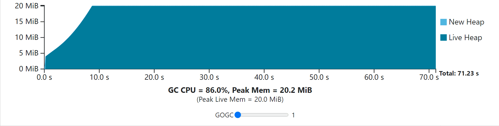
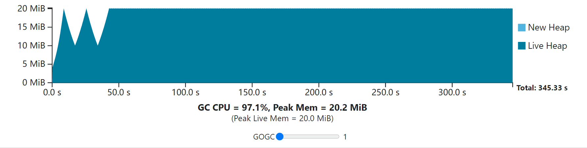
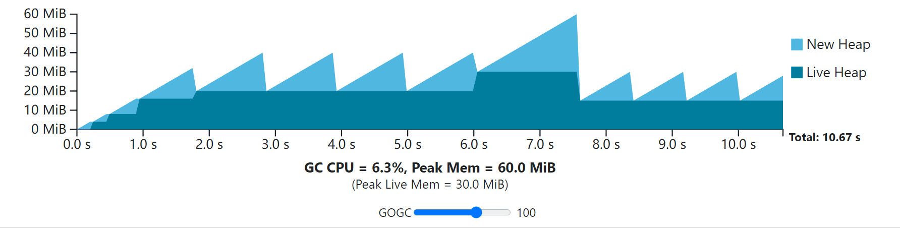
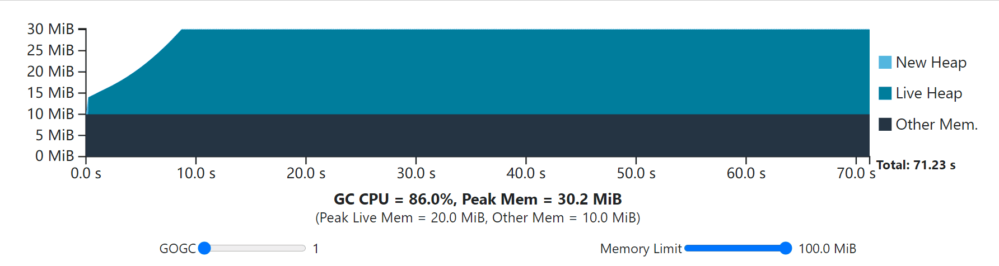
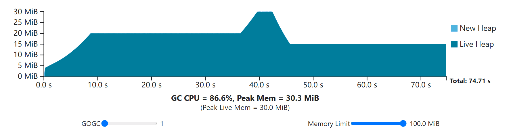

+++
title = "Go 垃圾收集器指南"
linkTitle = "Go 垃圾收集器指南"
weight = 20
date = 2023-05-17T15:03:14+08:00
description = ""
isCJKLanguage = true
draft = false

+++
# A Guide to the Go Garbage Collector - Go 垃圾收集器指南

> 原文：https://go.dev/doc/gc-guide

## Introduction 简介

This guide is intended to aid advanced Go users in better understanding their application costs by providing insights into the Go garbage collector. It also provides guidance on how Go users may use these insights to improve their applications' resource utilization. It does not assume any knowledge of garbage collection, but does assume familiarity with the Go programming language.

本指南旨在通过提供对 Go 垃圾收集器的深入了解，帮助 Go 高级用户更好地理解其应用程序的成本。它还提供了关于Go用户如何使用这些见解来提高其应用程序的资源利用率的指导。本书并不假定有任何关于垃圾收集的知识，但假定熟悉Go编程语言。

The Go language takes responsibility for arranging the storage of Go values; in most cases, a Go developer need not care about where these values are stored, or why, if at all. In practice, however, these values often need to be stored in computer **physical memory** and physical memory is a finite resource. Because it is finite, memory must be managed carefully and recycled in order to avoid running out of it while executing a Go program. It's the job of a Go implementation to allocate and recycle memory as needed.

Go 语言负责安排 Go 值的存储；在大多数情况下，Go 开发人员不需要关心这些值的存储位置，或者为什么存储，如果有的话。然而，在实践中，这些值往往需要存储在计算机物理内存中，而物理内存是一种有限的资源。因为它是有限的，所以必须仔细管理和回收内存，以避免在执行Go程序时耗尽内存。Go实现的工作就是根据需要分配和回收内存。

Another term for automatically recycling memory is **garbage collection**. At a high level, a garbage *collector* (or GC, for short) is a system that recycles memory on behalf of the application by identifying which parts of memory are no longer needed. The Go standard toolchain provides a runtime library that ships with every application, and this runtime library includes a garbage collector.

自动回收内存的另一个术语是垃圾收集。在高层次上，垃圾收集器（简称GC）是一个代表应用程序回收内存的系统，它可以识别哪些部分的内存不再需要。Go标准工具链提供了一个运行时库，与每个应用程序一起提供，这个运行时库包括一个垃圾收集器。

Note that the existence of a garbage collector as described by this guide is not guaranteed by the [Go specification](https://go.dev/ref/spec), only that the underlying storage for Go values is managed by the language itself. This omission is intentional and enables the use of radically different memory management techniques.

请注意，本指南所描述的垃圾收集器的存在并没有得到Go规范的保证，只是说Go值的底层存储由语言本身管理。这种遗漏是有意为之的，它使人们能够使用完全不同的内存管理技术。

Therefore, this guide is about a specific implementation of the Go programming language and *may not apply to other implementations*. Specifically, this following guide applies to the standard toolchain (the `gc` Go compiler and tools). Gccgo and Gollvm both use a very similar GC implementation so many of the same concepts apply, but details may vary.

因此，本指南是关于Go编程语言的一个特定实现，可能不适用于其他实现。具体来说，以下指南适用于标准工具链（gc Go编译器和工具）。Gccgo和Gollvm都使用非常相似的GC实现，因此许多相同的概念都适用，但细节可能会有所不同。

Furthermore, this is a living document and will change over time to best reflect the latest release of Go. This document currently describes the garbage collector as of Go 1.19.

此外，这是一个活的文件，会随着时间的推移而改变，以最好地反映Go的最新版本。本文档目前描述的是Go 1.19的垃圾收集器。

### Where Go Values Live Go 价值的所在

Before we dive into the GC, let's first discuss the memory that doesn't need to be managed by the GC.

在我们深入了解GC之前，我们首先讨论一下不需要由GC管理的内存。

For instance, non-pointer Go values stored in local variables will likely not be managed by the Go GC at all, and Go will instead arrange for memory to be allocated that's tied to the [lexical scope](https://go.dev/ref/spec#Declarations_and_scope) in which it's created. In general, this is more efficient than relying on the GC, because the Go compiler is able to predetermine when that memory may be freed and emit machine instructions that clean up. Typically, we refer to allocating memory for Go values this way as "stack allocation," because the space is stored on the goroutine stack.

例如，存储在局部变量中的非指针式Go值可能根本不需要由Go GC管理，Go会安排分配与创建词法范围相关的内存。一般来说，这比依赖GC更有效，因为Go编译器能够预先确定该内存何时被释放，并发出机器指令进行清理。通常情况下，我们把以这种方式为Go值分配内存称为 "堆栈分配"，因为这些空间被存储在goroutine堆栈中。

Go values whose memory cannot be allocated this way, because the Go compiler cannot determine its lifetime, are said to *escape to the heap*. "The heap" can be thought of as a catch-all for memory allocation, for when Go values need to be placed *somewhere*. The act of allocating memory on the heap is typically referred to as "dynamic memory allocation" because both the compiler and the runtime can make very few assumptions as to how this memory is used and when it can be cleaned up. That's where a GC comes in: it's a system that specifically identifies and cleans up dynamic memory allocations.

由于Go编译器无法确定Go值的寿命，因此不能以这种方式分配内存的Go值被称为逃逸到堆中。"堆 "可以被认为是内存分配的集合体，用于Go值需要放置的地方。在堆上分配内存的行为通常被称为 "动态内存分配"，因为编译器和运行时对这些内存的使用情况以及何时清理都不能做出任何假设。这就是GC的作用：它是一个专门识别和清理动态内存分配的系统。

There are many reasons why a Go value might need to escape to the heap. One reason could be that its size is dynamically determined. Consider for instance the backing array of a slice whose initial size is determined by a variable, rather than a constant. Note that escaping to the heap must also be transitive: if a reference to a Go value is written into another Go value that has already been determined to escape, that value must also escape.

有许多原因导致Go值可能需要转移到堆中。其中一个原因可能是它的大小是动态确定的。例如，考虑一个分片的支持数组，其初始大小是由一个变量而不是常数决定的。请注意，逃逸到堆中也必须是超越性的：如果对一个Go值的引用被写入另一个已经被确定为逃逸的Go值中，该值也必须逃逸。

Whether a Go value escapes or not is a function of the context in which it is used and the Go compiler's escape analysis algorithm. It would be fragile and difficult to try to enumerate precisely when values escape: the algorithm itself is fairly sophisticated and changes between Go releases. For more details on how to identify which values escape and which do not, see the section on [eliminating heap allocations](https://go.dev/doc/gc-guide#Eliminating_heap_allocations).

一个Go值是否转义是由它的使用环境和围棋编译器的转义分析算法决定的。试图精确地列举值的转义是很脆弱和困难的：算法本身是相当复杂的，而且在不同的Go版本中会有变化。关于如何识别哪些值逃逸，哪些值不逃逸的更多细节，请参见消除堆分配的章节。

### Tracing Garbage Collection 追踪垃圾回收

Garbage collection may refer to many different methods of automatically recycling memory; for example, reference counting. In the context of this document, garbage collection refers to **tracing** garbage collection, which identifies in-use, so-called **live**, objects by following pointers transitively.

垃圾收集可以指许多不同的自动回收内存的方法；例如，引用计数。在本文的上下文中，垃圾收集指的是跟踪垃圾收集，它通过跟踪指针来识别正在使用的，所谓的活的对象。

Let's define these terms more rigorously.

让我们更严格地定义这些术语

- **Object**—An object is a dynamically allocated piece of memory that contains one or more Go values.
- **Pointer**—A memory address that references any value within an object. This naturally includes Go values of the form `*T`, but also includes parts of built-in Go values. Strings, slices, channels, maps, and interface values all contain memory addresses that the GC must trace.
- 对象--一个对象是动态分配的一块内存，包含一个或多个Go值。
- 指针--引用对象中任何数值的内存地址。这自然包括*T形式的围棋值，但也包括内置围棋值的一部分。字符串、片断、通道、地图和接口值都包含GC必须追踪的内存地址。

Together, objects and pointers to other objects form the **object graph**. To identify live memory, the GC walks the object graph starting at the program's **roots**, pointers that identify objects that are definitely in-use by the program. Two examples of roots are local variables and global variables. The process of walking the object graph is referred to as **scanning**.

对象和指向其他对象的指针共同构成了对象图。为了识别活的内存，GC从程序的根部开始行走对象图，即识别程序肯定在使用的对象的指针。根的两个例子是局部变量和全局变量。漫步对象图的过程被称为扫描。

This basic algorithm is common to all tracing GCs. Where tracing GCs differ is what they do once they discover memory is live. Go's GC uses the mark-sweep technique, which means that in order to keep track of its progress, the GC also **marks** the values it encounters as live. Once tracing is complete, the GC then walks over all memory in the heap and makes all memory that is *not* marked available for allocation. This process is called **sweeping**.

这种基本算法是所有追踪型GC所共有的。追踪型GC的不同之处在于一旦发现内存是活的，它们会做什么。Go的GC使用标记扫描技术，这意味着为了跟踪其进度，GC也会将其遇到的值标记为活的。一旦追踪完成，GC就会遍历堆中的所有内存，并使所有未被标记的内存可供分配。这个过程被称为清扫。

One alternative technique you may be familiar with is to actually *move* the objects to a new part of memory and leave behind a forwarding pointer that is later used to update all the application's pointers. We call a GC that moves objects in this way a **moving** GC; Go has a **non-moving** GC.

您可能熟悉的另一种技术是将对象实际移动到内存的一个新的部分，并留下一个转发指针，这个指针后来被用来更新所有应用程序的指针。我们把以这种方式移动对象的GC称为移动GC；Go有一个非移动GC。

## The GC cycle GC循环

Because the Go GC is a mark-sweep GC, it broadly operates in two phases: the mark phase, and the sweep phase. While this statement might seem tautological, it contains an important insight: it's not possible to release memory back to be allocated until *all* memory has been traced, because there may still be an un-scanned pointer keeping an object alive. As a result, the act of sweeping must be entirely separated from the act of marking. Furthermore, the GC may also not be active at all, when there's no GC-related work to do. The GC continuously rotates through these three phases of sweeping, off, and marking in what's known as the **GC cycle**. For the purposes of this document, consider the GC cycle starting with sweeping, turning off, then marking.

因为Go的GC是一个标记-扫描的GC，所以它大致分两个阶段运行：标记阶段和扫描阶段。虽然这句话看起来是同义的，但它包含了一个重要的见解：在所有的内存都被追踪到之前，是不可能将内存释放回来分配的，因为可能还有一个未被扫描的指针保持着一个对象。因此，清扫的行为必须与标记的行为完全分开。此外，当没有GC相关的工作要做时，GC也可能根本就不活动。在所谓的GC周期中，GC不断地在清扫、关闭和标记这三个阶段中轮流工作。为了本文的目的，考虑GC周期从清扫开始，关闭，然后标记。

The next few sections will focus on building intuition for the costs of the GC to aid users in tweaking GC parameters for their own benefit.

接下来的几节将着重于建立对GC成本的直觉，以帮助用户为自己的利益调整GC参数。

### Understanding costs 了解成本

The GC is inherently a complex piece of software built on even more complex systems. It's easy to become mired in detail when trying to understand the GC and tweak its behavior. This section is intended to provide a framework for reasoning about the cost of the Go GC and tuning parameters.

GC本质上是一个复杂的软件，建立在更复杂的系统之上。在试图理解GC和调整它的行为时，很容易陷入细节的困扰。本节旨在为推理Go GC的成本和调整参数提供一个框架。

To begin with, consider this model of GC cost based on three simple axioms.

首先，考虑这个基于三个简单公理的GC成本模型。

1. The GC involves only two resources: CPU time, and physical memory.

1. GC只涉及两种资源。CPU时间，和物理内存。

2. The GC's memory costs consist of live heap memory, new heap memory allocated before the mark phase, and space for metadata that, even if proportional to the previous costs, are small in comparison.

4. GC的内存成本由活堆内存、标记阶段前分配的新堆内存和元数据空间组成，即使与之前的成本成正比，相比之下也是很小的。

   注意：活堆内存是指被前一个GC周期确定为活的内存，而新堆内存是指在当前周期分配的任何内存，这些内存到最后可能是活的，也可能不是。

   *Note: live heap memory is memory that was determined to be live by the previous GC cycle, while new heap memory is any memory allocated in the current cycle, which may or may not be live by the end.*

3. The GC's CPU costs are modeled as a fixed cost per cycle, and a marginal cost that scales proportionally with the size of the live heap.

3. GC的CPU成本被建模为每个周期的固定成本，以及与活堆大小成比例的边际成本。

   注意：渐进地讲，清扫的规模比标记和扫描要差，因为它必须执行与整个堆的大小成比例的工作，包括被确定为不活的内存（即 "死"）。然而，在目前的实现中，清扫比标记和扫描快得多，以至于在本讨论中可以忽略其相关的成本。
   
   *Note: Asymptotically speaking, sweeping scales worse than marking and scanning, as it must perform work proportional to the size of the whole heap, including memory that is determined to be not live (i.e. "dead"). However, in the current implementation sweeping is so much faster than marking and scanning that its associated costs can be ignored in this discussion.*

This model is simple but effective: it accurately categorizes the dominant costs of the GC. However, this model says nothing about the magnitude of these costs, nor how they interact. To model that, consider the following situation, referred to from here on as the **steady-state**.

这个模型简单而有效：它准确地分类了GC的主导成本。然而，这个模型没有说明这些成本的大小，也没有说明它们如何相互作用。为了建立这个模型，考虑以下情况，从这里开始称为稳定状态。

- The rate at which the application allocates new memory (in bytes per second) is constant. 应用程序分配新内存的速度（以字节/秒计）是恒定的。

  *Note: it's important to understand that this allocation rate is completely separate from whether or not this new memory is live. None of it could be live, all of it could be live, or some of it could be live. (On top of this, some old heap memory could also die, so it's not necessarily the case that if that memory is live, the live heap size grows.)*

  注意：重要的是要理解这个分配率与这个新内存是否是活的完全分开。这些内存可能都不是活的，可能都是活的，也可能有些是活的。(除此之外，一些旧的堆内存也可能死亡，因此，如果这些内存是活的，活的堆大小就不一定会增长）。

  *To put this more concretely, consider a web service that allocates 2 MiB of total heap memory for each request that it handles. During the request, at most 512 KiB of that 2 MiB stays live while the request is in flight, and when the service is finished handling the request, all that memory dies. Now, for the sake of simplicity suppose each request takes about 1 second to handle end-to-end. Then, a steady stream of requests, say 100 requests per second, results in an allocation rate of 200 MiB/s and a 50 MiB peak live heap.*

  为了更具体地说明这一点，考虑一个网络服务，为它处理的每个请求分配2 MiB的总堆内存。在请求过程中，2 MiB中最多有512 KiB是活的，而当服务处理完请求后，所有的内存都死了。现在，为了简单起见，假设每个请求需要大约1秒钟来处理端到端。那么，一个稳定的请求流，比如每秒100个请求，会导致200 MiB/s的分配率和50 MiB的峰值活堆。

- The application's object graph looks roughly the same each time (objects are similarly sized, there's a roughly constant number of pointers, the maximum depth of the graph is roughly constant). 应用程序的对象图每次看起来都大致相同（对象的大小相似，指针的数量大致恒定，图的最大深度大致恒定）。

  Another way to think about this is that the marginal costs of GC are constant. 另一种思考方式是，GC的边际成本是不变的

*Note: the steady-state may seem contrived, but it's representative of the behavior of an application under some constant workload. Naturally, workloads can change even while an application is executing, but typically application behavior looks like a bunch of these steady-states strung together with some transient behavior in between.*

注意：稳态似乎是刻意的，但它代表了一个应用程序在某些恒定工作负载下的行为。当然，即使在应用程序执行过程中，工作负载也会发生变化，但通常情况下，应用程序的行为看起来就像一堆这些稳定状态串在一起，中间有一些瞬时行为。

*Note: the steady-state makes no assumptions about the live heap. It may be growing with each subsequent GC cycle, it may shrink, or it may stay the same. However, trying to encompass all of these situations in the explanations to follow is tedious and not very illustrative, so the guide will focus on examples where the live heap remains constant. The [GOGC section](https://go.dev/doc/gc-guide#GOGC) explores the non-constant live heap scenario in some more detail.*

注意：稳定状态没有对实时堆进行假设。它可能会随着每个后续的GC周期而增长，可能会缩小，也可能保持不变。然而，试图在接下来的解释中包含所有这些情况是很乏味的，也不太容易说明问题，所以本指南将集中在活堆保持不变的例子上。GOGC部分更详细地探讨了非恒定活堆的情况。

In the steady-state while the live heap size is constant, every GC cycle is going to look identical in the cost model as long as the GC executes after the same amount of time has passed. That's because in that fixed amount of time, with a fixed rate of allocation by the application, a fixed amount of new heap memory will be allocated. So with the live heap size constant, and that new heap memory constant, memory use is always going to be the same. And because the live heap is the same size, the marginal GC CPU costs will be the same, and the fixed costs will be incurred at some regular interval.

在稳定状态下，当活堆大小不变时，只要GC在相同的时间内执行，每个GC周期在成本模型中都是一样的。这是因为在这个固定的时间内，在应用程序的固定分配率下，将分配一个固定数量的新堆内存。因此，在实时堆大小不变，新堆内存不变的情况下，内存的使用总是相同的。因为实时堆的大小是一样的，所以边际GC的CPU成本也是一样的，而固定成本将在某个固定的时间段内发生。

Now consider if the GC were to shift the point at which it runs *later* in time. Then, more memory would be allocated but each GC cycle would still incur the same CPU cost. However over some other fixed window of time fewer GC cycles would finish, resulting in a lower overall CPU cost. The opposite would be true if the GC decided to start *earlier* in time: less memory would be allocated and CPU costs would be incurred more often.

现在考虑一下，如果GC在时间上将其运行的时间点移后。那么，更多的内存将被分配，但每个GC周期仍将产生相同的CPU成本。然而，在其他一些固定的时间窗口中，完成的GC周期会更少，从而导致总体CPU成本的降低。如果GC决定在更早的时间开始，情况就会相反：分配的内存会更少，CPU成本会更多。

This situation represents the fundamental trade-off between CPU time and memory that a GC can make, controlled by how often the GC actually executes. In other words, the trade-off is entirely defined by **GC frequency**.

这种情况代表了GC可以在CPU时间和内存之间进行的基本权衡，由GC实际执行的频率控制。换句话说，这种权衡完全由GC的频率决定。

One more detail remains to be defined, and that's when the GC should decide to start. Note that this directly sets the GC frequency in any particular steady-state, defining the trade-off. In Go, deciding when the GC should start is the main parameter which the user has control over.

还有一个细节需要定义，那就是GC应该何时决定开始。请注意，这直接设定了任何特定稳定状态下的GC频率，定义了权衡。在Go中，决定GC何时启动是用户可以控制的主要参数。

### GOGC

At a high level, GOGC determines the trade-off between GC CPU and memory.

在高层次上，GOGC决定了GC CPU和内存之间的权衡。

It works by determining the target heap size after each GC cycle, a target value for the total heap size in the next cycle. The GC's goal is to finish a collection cycle before the total heap size exceeds the target heap size. Total heap size is defined as the live heap size at the end of the previous cycle, plus any new heap memory allocated by the application since the previous cycle. Meanwhile, target heap memory is defined as:

它的工作方式是在每个GC周期后确定目标堆大小，即下一个周期的总堆大小的目标值。GC的目标是在总堆大小超过目标堆大小之前完成一个收集周期。总堆大小被定义为上一周期结束时的活堆大小，加上自上一周期以来由应用程序分配的任何新的堆内存。同时，目标堆内存被定义为：

*Target heap memory = Live heap + (Live heap + GC roots) \* GOGC / 100*

目标堆内存=活堆+（活堆+GC根）*GOGC/100

As an example, consider a Go program with a live heap size of 8 MiB, 1 MiB of goroutine stacks, and 1 MiB of pointers in global variables. Then, with a GOGC value of 100, the amount of new memory that will be allocated before the next GC runs will be 10 MiB, or 100% of the 10 MiB of work, for a total heap footprint of 18 MiB. With a GOGC value of 50, then it'll be 50%, or 5 MiB. With a GOGC value of 200, it'll be 200%, or 20 MiB.

作为一个例子，考虑一个Go程序，其活堆大小为8 MiB，goroutine栈为1 MiB，全局变量中的指针为1 MiB。那么，在GOGC值为100的情况下，在下一次GC运行前分配的新内存量将是10 MiB，或者是10 MiB工作的100%，总的堆占用量为18 MiB。如果GOGC值为50，那么它将是50%，或5 MiB。如果GOGC值为200，则为200%，即20 MiB。

*Note: GOGC includes the root set only as of Go 1.18. Previously, it would only count the live heap. Often, the amount of memory in goroutine stacks is quite small and the live heap size dominates all other sources of GC work, but in cases where programs had hundreds of thousands of goroutines, the GC was making poor judgements.*

注意：从Go 1.18开始，GOGC只包括根集。在此之前，它只计算实时堆。通常情况下，goroutine栈中的内存量相当小，活堆大小主导了所有其他GC工作的来源，但在程序有成百上千个goroutine的情况下，GC会做出错误的判断。

The heap target controls GC frequency: the bigger the target, the longer the GC can wait to start another mark phase and vice versa. While the precise formula is useful for making estimates, it's best to think of GOGC in terms of its fundamental purpose: a parameter that picks a point in the GC CPU and memory trade-off. The key takeaway is that **doubling GOGC will double heap memory overheads and roughly halve GC CPU cost**, and vice versa. (To see a full explanation as to why, see the [appendix](https://go.dev/doc/gc-guide#Additional_notes_on_GOGC).)

堆的目标控制着GC的频率：目标越大，GC等待开始另一个标记阶段的时间就越长，反之亦然。虽然精确的公式对于做出估计很有用，但最好还是从它的基本目的来考虑GOGC：一个在GC的CPU和内存权衡中挑选一个点的参数。关键的启示是，GOGC翻倍将使堆内存开销翻倍，而GC CPU成本大约减半，反之亦然。(要看关于原因的完整解释，请看附录）。

*Note: the target heap size is just a target, and there are several reasons why the GC cycle might not finish right at that target. For one, a large enough heap allocation can simply exceed the target. However, other reasons appear in GC implementations that go beyond the [GC model](https://go.dev/doc/gc-guide#Understanding_costs) this guide has been using thus far. For some more detail, see the [latency section](https://go.dev/doc/gc-guide#Latency), but the complete details may be found in the [additional resources](https://go.dev/doc/gc-guide#Additional_resources).*

注意：目标堆大小只是一个目标，有几个原因导致GC周期可能不会在这个目标上完成。首先，一个足够大的堆分配可以简单地超过目标。然而，其他原因出现在GC实现中，这些原因超出了本指南迄今为止所使用的GC模型。关于一些更多的细节，请看延迟部分，但完整的细节可以在附加资源中找到。

GOGC may be configured through either the `GOGC` environment variable (which all Go programs recognize), or through the [`SetGCPercent`](https://pkg.go.dev/runtime/debug#SetGCPercent) API in the `runtime/debug` package.

GOGC可以通过GOGC环境变量（所有Go程序都能识别），或者通过运行时/调试包中的SetGCPercent API进行配置。

Note that GOGC may also be used to turn off the GC entirely (provided the [memory limit](https://go.dev/doc/gc-guide#Memory_limit) does not apply) by setting `GOGC=off` or calling `SetGCPercent(-1)`. Conceptually, this setting is equivalent to setting GOGC to a value of infinity, as the amount of new memory before a GC is triggered is unbounded.

请注意，GOGC也可以通过设置GOGC=off或调用SetGCPercent(-1)来完全关闭GC（只要内存限制不适用）。从概念上讲，这种设置相当于将GOGC设置为无穷大的值，因为在触发GC之前的新内存量是无界的。

To better understand everything we've discussed so far, try out the interactive visualization below that is built on the [GC cost model](https://go.dev/doc/gc-guide#Understanding_costs) discussed earlier. This visualization depicts the execution of some program whose non-GC work takes 10 seconds of CPU time to complete. In the first second it performs some initialization step (growing its live heap) before settling into a steady-state. The application allocates 200 MiB in total, with 20 MiB live at a time. It assumes that the only relevant GC work to complete comes from the live heap, and that (unrealistically) the application uses no additional memory.

为了更好地理解我们到目前为止所讨论的一切，请尝试一下下面的交互式可视化，它是建立在前面讨论的GC成本模型上的。这个可视化描述了一些程序的执行情况，其非GC工作需要10秒的CPU时间来完成。在第一秒中，它在进入稳定状态之前执行了一些初始化步骤（增长其实时堆）。该程序总共分配了200MB的空间，每次有20MB。它假设要完成的唯一相关的GC工作来自实时堆，并且（不现实地）应用程序没有使用额外的内存。

Use the slider to adjust the value of GOGC to see how the application responds in terms of total duration and GC overhead. Each GC cycle ends while the new heap drops to zero. The time taken while the new heap drops to zero is the combined time for the mark phase for cycle N, and the sweep phase for the cycle N+1. Note that this visualization (and all the visualizations in this guide) assume the application is paused while the GC executes, so GC CPU costs are fully represented by the time it takes for new heap memory to drop to zero. This is only to make visualization simpler; the same intuition still applies. The X axis shifts to always show the full CPU-time duration of the program. Notice that additional CPU time used by the GC increases the overall duration.

使用滑块来调整GOGC的值，看看应用程序在总时长和GC开销方面是如何反应的。每个GC周期结束时，新的堆会下降到零。新堆降到零时所花的时间是N周期的标记阶段和N+1周期的扫描阶段的综合时间。请注意，这个可视化（以及本指南中的所有可视化）假设应用程序在GC执行时是暂停的，所以GC的CPU成本完全由新堆内存下降到零的时间来表示。这只是为了使可视化更简单；同样的直觉仍然适用。X轴的移动总是显示程序的全部CPU时间。请注意，GC使用的额外CPU时间会增加整个持续时间。




Notice that the GC always incurs some CPU and peak memory overhead. As GOGC increases, CPU overhead decreases, but peak memory increases proportionally to the live heap size. As GOGC decreases, the peak memory requirement decreases at the expense of additional CPU overhead.

请注意，GC总是会产生一些CPU和峰值内存的开销。随着GOGC的增加，CPU开销减少，但是峰值内存与活堆大小成比例地增加。随着GOGC的减少，峰值内存的要求也会减少，但代价是额外的CPU开销。

*Note: the graph displays CPU time, not wall-clock time to complete the program. If the program runs on 1 CPU and fully utilizes its resources, then these are equivalent. A real-world program likely runs on a multi-core system and does not 100% utilize the CPUs at all times. In these cases the wall-time impact of the GC will be lower.*

注意：该图显示的是CPU时间，而不是完成程序的挂钟时间。如果程序在1个CPU上运行并充分利用其资源，那么这些时间是相等的。现实世界的程序很可能在多核系统上运行，并不是在任何时候都能100%利用CPU。在这种情况下，GC的壁垒时间影响会比较小。

*Note: the Go GC has a minimum total heap size of 4 MiB, so if the GOGC-set target is ever below that, it gets rounded up. The visualization reflects this detail.*

注意：Go GC的最小总堆大小为4 MiB，所以如果GOGC设置的目标低于这个大小，它就会被舍弃。可视化反映了这个细节。

Here's another example that's a little bit more dynamic and realistic. Once again, the application takes 10 CPU-seconds to complete without the GC, but the steady-state allocation rate increases dramatically half-way through, and the live heap size shifts around a bit in the first phase. This example demonstrates how the steady-state might look when the live heap size is actually changing, and how a higher allocation rate leads to more frequent GC cycles.

下面是另一个更加动态和现实的例子。再一次，这个应用程序在没有GC的情况下需要10个CPU秒才能完成，但是稳态分配率在中途急剧增加，并且实时堆的大小在第一阶段有一些变化。这个例子展示了当活堆大小实际发生变化时，稳态是怎样的，以及更高的分配率如何导致更频繁的GC周期。



### Memory limit 内存限制

Until Go 1.19, GOGC was the sole parameter that could be used to modify the GC's behavior. While it works great as a way to set a trade-off, it doesn't take into account that available memory is finite. Consider what happens when there's a transient spike in the live heap size: because the GC will pick a total heap size proportional to that live heap size, GOGC must be configured such for the *peak* live heap size, even if in the usual case a higher GOGC value provides a better trade-off.

在Go 1.19之前，GOGC是唯一可以用来修改GC行为的参数。虽然它作为一种设置权衡的方式非常好，但它没有考虑到可用内存是有限的。考虑一下当实时堆大小出现瞬时峰值时会发生什么：因为GC会选择一个与实时堆大小成比例的总堆大小，GOGC必须为实时堆的峰值大小进行配置，即使在通常情况下，更高的GOGC值可以提供更好的权衡。

The visualization below demonstrates this transient heap spike situation.

下面的可视化图展示了这种瞬时堆峰值的情况。



If the example workload is running in a container with a bit over 60 MiB of memory available, then GOGC can't be increased beyond 100, even though the rest of the GC cycles have the available memory to make use of that extra memory. Furthermore, in some applications, these transient peaks can be rare and hard to predict, leading to occasional, unavoidable, and potentially costly out-of-memory conditions.

如果这个例子的工作负载是在一个可用内存超过60 MiB的容器中运行的，那么GOGC就不能增加到100以上，即使其余的GC周期有可用的内存来利用这些额外的内存。此外，在一些应用中，这些瞬时的峰值可能是罕见的，而且很难预测，导致偶尔的、不可避免的、潜在的昂贵的内存不足情况。

That's why in the 1.19 release, Go added support for setting a runtime memory limit. The memory limit may be configured either via the `GOMEMLIMIT` environment variable which all Go programs recognize, or through the `SetMemoryLimit` function available in the `runtime/debug` package.

这就是为什么在1.19版本中，Go增加了对设置运行时内存限制的支持。内存限制可以通过所有Go程序都认可的GOMEMLIMIT环境变量，或者通过运行时/调试包中的SetMemoryLimit函数来配置。

This memory limit sets a maximum on the *total amount of memory that the Go runtime can use*. The specific set of memory included is defined in terms of [`runtime.MemStats`](https://pkg.go.dev/runtime#MemStats) as the expression

这个内存限制设定了Go运行时可以使用的最大内存总量。包括的具体内存集在 runtime.MemStats 方面定义为表达式

```
Sys` `-` `HeapReleased
```

or equivalently in terms of the [`runtime/metrics`](https://pkg.go.dev/runtime/metrics) package,

或等同于在运行时/指标包方面，

```
/memory/classes/total:bytes` `-` `/memory/classes/heap/released:bytes
```

Because the Go GC has explicit control over how much heap memory it uses, it sets the total heap size based on this memory limit and how much other memory the Go runtime uses.

因为Go GC可以明确控制它所使用的堆内存，它根据这个内存限制和Go运行时使用的其他内存的数量来设置总的堆大小。

The visualization below depicts the same single-phase steady-state workload from the GOGC section, but this time with an extra 10 MiB of overhead from the Go runtime and with an adjustable memory limit. Try shifting around both GOGC and the memory limit and see what happens.

下面的可视化图描述了GOGC部分的相同的单阶段稳态工作负载，但这次Go运行时额外增加了10 MiB的开销，并且有一个可调整的内存限制。试着改变GOGC和内存限制的位置，看看会发生什么。



Notice that when the memory limit is lowered below the peak memory that's determined by GOGC (42 MiB for a GOGC of 100), the GC runs more frequently to keep the peak memory within the limit.

请注意，当内存限制降低到由GOGC决定的峰值内存以下时（GOGC为100时为42 MiB），GC会更频繁地运行以保持峰值内存在限制范围内。

Returning to our previous example of the transient heap spike, by setting a memory limit and turning up GOGC, we can get the best of both worlds: no memory limit breach, and better resource economy. Try out the interactive visualization below.

回到我们之前的瞬时堆峰值的例子，通过设置内存限制和调高GOGC，我们可以得到两全其美的结果：没有内存限制的破坏，以及更好的资源经济性。试试下面的交互式可视化。



Notice that with some values of GOGC and the memory limit, peak memory use stops at whatever the memory limit is, but that the rest of the program's execution still obeys the total heap size rule set by GOGC.

请注意，在GOGC和内存限制的某些值下，峰值内存的使用会在内存限制处停止，但程序执行的其余部分仍然遵守GOGC设置的总堆大小规则。

This observation leads to another interesting detail: even when GOGC is set to off, the memory limit is still respected! In fact, this particular configuration represents a *maximization of resource economy* because it sets the minimum GC frequency required to maintain some memory limit. In this case, *all* of the program's execution has the heap size rise to meet the memory limit.

这个观察结果引出了另一个有趣的细节：即使GOGC被设置为关闭，内存限制仍然被遵守！事实上，这个特殊的配置代表了对内存限制的理解。事实上，这种特殊的配置代表了资源经济的最大化，因为它设定了维持某种内存限制所需的最小GC频率。在这种情况下，所有程序的执行都有堆的大小上升以满足内存限制。

Now, while the memory limit is clearly a powerful tool, **the use of a memory limit does not come without a cost**, and certainly doesn't invalidate the utility of GOGC.

现在，虽然内存限制显然是一个强大的工具，但使用内存限制并不是没有代价的，当然也不会使GOGC的效用失效。

Consider what happens when the live heap grows large enough to bring total memory use close to the memory limit. In the steady-state visualization above, try turning GOGC off and then slowly lowering the memory limit further and further to see what happens. Notice that the total time the application takes will start to grow in an unbounded manner as the GC is constantly executing to maintain an impossible memory limit.

考虑一下当实时堆增长到足以使总的内存使用量接近内存限制时会发生什么。在上面的稳态可视化中，尝试关闭GOGC，然后慢慢地将内存限制进一步降低，看看会发生什么。请注意，由于GC不断执行以维持不可能的内存限制，程序所需的总时间将开始无限制地增长。

This situation, where the program fails to make reasonable progress due to constant GC cycles, is called **thrashing**. It's particularly dangerous because it effectively stalls the program. Even worse, it can happen for exactly the same situation we were trying to avoid with GOGC: a large enough transient heap spike can cause a program to stall indefinitely! Try reducing the memory limit (around 30 MiB or lower) in the transient heap spike visualization and notice how the worst behavior specifically starts with the heap spike.

这种情况，即程序由于不断的GC循环而无法取得合理的进展，被称为 thrashing。它特别危险，因为它有效地使程序停滞。更糟糕的是，它的发生与我们试图用GOGC来避免的情况完全一样：一个足够大的瞬时堆尖峰可以导致程序无限期地停滞 试着减少瞬时堆尖峰可视化中的内存限制（大约30 MiB或更低），并注意到最糟糕的行为是如何专门从堆尖峰开始的。

In many cases, an indefinite stall is worse than an out-of-memory condition, which tends to result in a much faster failure.

在许多情况下，无限期的停滞比内存不足的情况更糟糕，因为内存不足的情况往往会导致更快的故障。

For this reason, the memory limit is defined to be **soft**. The Go runtime makes no guarantees that it will maintain this memory limit under all circumstances; it only promises some reasonable amount of effort. This relaxation of the memory limit is critical to avoiding thrashing behavior, because it gives the GC a way out: let memory use surpass the limit to avoid spending too much time in the GC.

出于这个原因，内存限制被定义为软限制。Go运行时并不保证在任何情况下都能维持这个内存限制；它只承诺了一些合理的努力。这种对内存限制的放松对于避免激动行为至关重要，因为它给了GC一条出路：让内存使用超过限制，以避免在GC中花费太多时间。

How this works internally is the GC sets an upper limit on the amount of CPU time it can use over some time window (with some hysteresis for very short transient spikes in CPU use). This limit is currently set at roughly 50%, with a `2 * GOMAXPROCS` CPU-second window. The consequence of limiting GC CPU time is that the GC's work is delayed, meanwhile the Go program may continue allocating new heap memory, even beyond the memory limit.

这在内部是如何运作的呢？GC对它在一些时间窗口内可以使用的CPU时间设置了一个上限（对于CPU使用中非常短的瞬时峰值有一些滞后）。这个限制目前被设定为大约50%，有一个2*GOMAXPROCS CPU秒的窗口。限制GC CPU时间的后果是GC的工作被延迟，同时Go程序可以继续分配新的堆内存，甚至超过内存限制。

The intuition behind the 50% GC CPU limit is based on the worst-case impact on a program with ample available memory. In the case of a misconfiguration of the memory limit, where it is set too low mistakenly, the program will slow down at most by 2x, because the GC can't take more than 50% of its CPU time away.

50%的GC CPU限制背后的直觉是基于对一个有充足可用内存的程序的最坏情况的影响。在内存限制配置错误的情况下，即错误地设置了过低的内存限制，程序最多只能减慢2倍，因为GC不可能占用超过50%的CPU时间。

*Note: the visualizations on this page do not simulate the GC CPU limit.*

注意：本页面上的视觉效果并没有模拟GC的CPU限制。

#### Suggested uses 建议的用途

While the memory limit is a powerful tool, and the Go runtime takes steps to mitigate the worst behaviors from misuse, it's still important to use it thoughtfully. Below is a collection of tidbits of advice about where the memory limit is most useful and applicable, and where it might cause more harm than good.

虽然内存限制是一个强大的工具，而且Go运行时采取了一些措施来减轻滥用的最坏行为，但深思熟虑地使用它仍然很重要。以下是关于内存限制最有用和最适用的地方，以及它可能造成更多伤害的地方的建议集。

- **Do** take advantage of the memory limit when the execution environment of your Go program is entirely within your control, and the Go program is the only program with access to some set of resources (i.e. some kind of memory reservation, like a container memory limit). 当您的Go程序的执行环境完全在您的控制范围内，并且Go程序是唯一可以访问某些资源集（即某种内存保留，如容器内存限制）的程序时，请利用内存限制。

  A good example is the deployment of a web service into containers with a fixed amount of available memory.

  一个很好的例子是将网络服务部署到有固定可用内存的容器中。

  **In this case, a good rule of thumb is to leave an additional 5-10% of headroom to account for memory sources the Go runtime is unaware of.**

  在这种情况下，一个好的经验法则是留出额外的5-10%的空间，以考虑Go运行时不知道的内存来源。

- **Do** feel free to adjust the memory limit in real time to adapt to changing conditions. 请放心地实时调整内存限制，以适应不断变化的条件。

  A good example is a cgo program where C libraries temporarily need to use substantially more memory.

  一个很好的例子是在Cgo程序中，C库暂时需要使用大量的内存。

- **Don't** set GOGC to off with a memory limit if the Go program might share some of its limited memory with other programs, and those programs are generally decoupled from the Go program. Instead, keep the memory limit since it may help to curb undesirable transient behavior, but set GOGC to some smaller, reasonable value for the average case. 如果围棋程序可能与其他程序共享一些有限的内存，而这些程序通常与围棋程序解耦，则不要将GOGC设置为关闭内存限制。相反，保留内存限制，因为它可能有助于抑制不良的瞬时行为，但对于一般情况，将GOGC设置为较小的、合理的值。

  While it may be tempting to try and "reserve" memory for co-tenant programs, unless the programs are fully synchronized (e.g. the Go program calls some subprocess and blocks while its callee executes), the result will be less reliable as inevitably both programs will need more memory. Letting the Go program use less memory when it doesn't need it will generate a more reliable result overall. This advice also applies to overcommit situations, where the sum of memory limits of containers running on one machine may exceed the actual physical memory available to the machine.

  虽然尝试为共同租户程序 "保留 "内存可能很诱人，但除非程序是完全同步的（例如Go程序调用一些子进程并在其被调用者执行时进行阻塞），否则结果将不太可靠，因为不可避免地两个程序都需要更多的内存。当Go程序不需要内存时，让它少用点内存，总体上会产生更可靠的结果。这个建议也适用于过度提交的情况，在一台机器上运行的容器的内存限制之和可能超过机器实际可用的物理内存。

- **Don't** use the memory limit when deploying to an execution environment you don't control, especially when your program's memory use is proportional to its inputs. 当部署到一个您无法控制的执行环境时，不要使用内存限制，特别是当您的程序的内存使用与它的输入成正比时。

  A good example is a CLI tool or a desktop application. Baking a memory limit into the program when it's unclear what kind of inputs it might be fed, or how much memory might be available on the system can lead to confusing crashes and poor performance. Plus, an advanced end-user can always set a memory limit if they wish. 

  一个很好的例子是CLI工具或一个桌面应用程序。当不清楚可能会有什么样的输入，或者系统上可能有多少内存时，在程序中设置内存限制会导致混乱的崩溃和糟糕的性能。另外，如果高级的最终用户愿意，他们总是可以设置一个内存限制。

- **Don't** set a memory limit to avoid out-of-memory conditions when a program is already close to its environment's memory limits. 当程序已经接近其环境的内存限制时，不要设置内存限制来避免内存不足的情况。

  This effectively replaces an out-of-memory risk with a risk of severe application slowdown, which is often not a favorable trade, even with the efforts Go makes to mitigate thrashing. In such a case, it would be much more effective to either increase the environment's memory limits (and *then* potentially set a memory limit) or decrease GOGC (which provides a much cleaner trade-off than thrashing-mitigation does).
  
  这实际上是将内存不足的风险换成了严重的应用减速的风险，这通常不是一个有利的交易，即使Go为减轻激动所做的努力。在这种情况下，增加环境的内存限制（然后可能设置一个内存限制）或减少GOGC（这提供了一个比缓冲更干净的权衡）会更有效。

### Latency 延迟

The visualizations in this document have modeled the application as paused while the GC is executing. GC implementations do exist that behave this way, and they're referred to as "stop-the-world" GCs. 本文中的可视化演示将应用程序建模为在GC执行过程中暂停。确实存在这样的 GC 实现，它们被称为 "停止-世界 "GC。

The Go GC, however, is not fully stop-the-world and does most of its work concurrently with the application. This is primarily to reduce application *latencies*. Specifically, the end-to-end duration of a single unit of computation (e.g. a web request). Thus far, this document mainly considered application *throughput* (e.g. web requests handled per second). Note that each example in the [GC cycle](https://go.dev/doc/gc-guide#The_GC_cycle) section focused on the total CPU duration of an executing program. However, such a duration is far less meaningful for say, a web service. While throughput is still important for a web service (i.e. queries per second), often the latency of each individual request matters even more.

然而，Go GC 并不完全是 "stop-the-world"，它的大部分工作是与应用程序同时进行的。这主要是为了减少应用程序的延迟。具体来说，就是单个计算单元（如一个网络请求）的端到端持续时间。到目前为止，本文主要考虑了应用的吞吐量（如每秒处理的网络请求）。请注意，GC周期部分的每个例子都集中在一个执行程序的总CPU持续时间上。然而，对于网络服务来说，这样的持续时间远没有那么有意义。虽然吞吐量对网络服务来说仍然很重要（即每秒的查询次数），但通常每个单独请求的延迟甚至更重要。

In terms of latency, a stop-the-world GC may require a considerable length of time to execute both its mark and sweep phases, during which the application, and in the context of a web service, any in-flight request, is unable to make further progress. Instead, the Go GC avoids making the length of any global application pauses proportional to the size of the heap, and that the core tracing algorithm is performed while the application is actively executing. (The pauses are more strongly proportional to GOMAXPROCS algorithmically, but most commonly are dominated by the time it takes to stop running goroutines.) Collecting concurrently is not without cost: in practice it often leads to a design with lower throughput than an equivalent stop-the-world garbage collector. However, it's important to note that *lower latency does not inherently mean lower throughput*, and the performance of the Go garbage collector has steadily improved over time, in both latency and throughput.

就延迟而言，停止-世界GC可能需要相当长的时间来执行其标记和扫描阶段，在此期间，应用程序，以及在网络服务的背景下，任何飞行中的请求，都无法取得进一步进展。相反，Go GC避免了使任何全局应用暂停的长度与堆的大小成正比，而且核心跟踪算法是在应用积极执行时执行的。(暂停在算法上与GOMAXPROCS成正比，但最常见的是由停止运行goroutines的时间主导）。并发收集并不是没有代价的：在实践中，它常常导致设计的吞吐量低于同等的停止-世界垃圾收集器。然而，需要注意的是，较低的延迟并不意味着较低的吞吐量，随着时间的推移，Go垃圾收集器的性能在延迟和吞吐量方面都有了稳步的提高。

The concurrent nature of Go's current GC does not invalidate anything discussed in this document so far: none of the statements relied on this design choice. GC frequency is still the primary way the GC trades off between CPU time and memory for throughput, and in fact, it also takes on this role for latency. This is because most of the costs for the GC are incurred while the mark phase is active.

Go当前GC的并发性并没有使本文迄今为止所讨论的任何内容失效：没有一个说法是依赖于这种设计选择的。GC频率仍然是GC在CPU时间和内存之间交换吞吐量的主要方式，事实上，它在延迟方面也承担了这个角色。这是因为GC的大部分成本是在标记阶段活动时产生的。

The key takeaway then, is that **reducing GC frequency may also lead to latency improvements**. This applies not only to reductions in GC frequency from modifying tuning parameters, like increasing GOGC and/or the memory limit, but also applies to the optimizations described in the [optimization guide](https://go.dev/doc/gc-guide#Optimization_guide).

因此，关键的启示是，减少GC频率也可能导致延迟的改善。这不仅适用于通过修改调谐参数来减少GC频率，比如增加GOGC和/或内存限制，而且也适用于优化指南中描述的优化。

However, latency is often more complex to understand than throughput, because it is a product of the moment-to-moment execution of the program and not just an aggregation of costs. As a result, the connection between latency and GC frequency is less direct. Below is a list of possible sources of latency for those inclined to dig deeper.

然而，延迟的理解往往比吞吐量更复杂，因为它是程序时刻执行的产物，而不仅仅是成本的聚合。因此，延迟和GC频率之间的联系不太直接。下面是一个可能的延迟来源的列表，供那些倾向于深入研究的人参考。

1. Brief stop-the-world pauses when the GC transitions between the mark and sweep phases,
2. 当GC在标记和扫描阶段之间转换时，会出现短暂的停止-世界的暂停。
3. 调度延迟，因为GC在标记阶段需要25%的CPU资源。
4. 用户goroutines协助GC应对高分配率。
5. 当GC处于标记阶段时，指针的写入需要额外的工作，以及
6. 正在运行的goroutines必须暂停，以便对其根部进行扫描。
7. Scheduling delays because the GC takes 25% of CPU resources when in the mark phase,
8. User goroutines assisting the GC in response to a high allocation rate,
9. Pointer writes requiring additional work while the GC is in the mark phase, and
5. Running goroutines must be suspended for their roots to be scanned.

These latency sources are visible in [execution traces](https://go.dev/doc/diagnostics#execution-tracer), except for pointer writes requiring additional work.

这些延迟源在执行跟踪中是可见的，除了需要额外工作的指针写入。

### Additional resources 额外的资源

While the information presented above is accurate, it lacks the detail to fully understand costs and trade-offs in the Go GC's design. For more information, see the following additional resources.

虽然上面介绍的信息是准确的，但它缺乏细节，不能完全理解Go GC设计中的成本和权衡。欲了解更多信息，请参见以下额外资源。

- [The GC Handbook](https://gchandbook.org/)—An excellent general resource and reference on garbage collector design.
- [TCMalloc](https://google.github.io/tcmalloc/design.html)—Design document for the C/C++ memory allocator TCMalloc, which the Go memory allocator is based on.
- [Go 1.5 GC announcement](https://go.dev/blog/go15gc)—The blog post announcing the Go 1.5 concurrent GC, which describes the algorithm in more detail.
- [Getting to Go](https://go.dev/blog/ismmkeynote)—An in-depth presentation about the evolution of Go's GC design up to 2018.
- [Go 1.5 concurrent GC pacing](https://docs.google.com/document/d/1wmjrocXIWTr1JxU-3EQBI6BK6KgtiFArkG47XK73xIQ/edit)—Design document for determining when to start a concurrent mark phase.
- [Smarter scavenging](https://github.com/golang/go/issues/30333)—Design document for revising the way the Go runtime returns memory to the operating system.
- [Scalable page allocator](https://github.com/golang/go/issues/35112)—Design document for revising the way the Go runtime manages memory it gets from the operating system.
- [GC pacer redesign (Go 1.18)](https://github.com/golang/go/issues/44167)—Design document for revising the algorithm to determine when to start a concurrent mark phase.
- [Soft memory limit (Go 1.19)](https://github.com/golang/go/issues/48409)—Design document for the soft memory limit.
- The GC Handbook--关于垃圾收集器设计的优秀通用资源和参考资料。
  TCMalloc-C/C++内存分配器TCMalloc的设计文档，Go内存分配器就是基于此设计的。
  Go 1.5 GC 公告-宣布 Go 1.5 并发 GC 的博文，其中更详细地描述了该算法。
  Getting to Go-关于Go的GC设计到2018年的演变的深入介绍。
  Go 1.5 并发 GC 步伐-确定何时开始并发标记阶段的设计文件。
  更加智能的清扫-设计文档，用于修改 Go 运行时向操作系统返回内存的方式。
  可扩展的页面分配器--设计文档，用于修改 Go 运行时管理从操作系统获得的内存的方式。
  GC pacer的重新设计（Go 1.18）--设计文件，用于修改确定何时开始并发标记阶段的算法。
  软内存限制（Go 1.19）--关于软内存限制的设计文档。

## A note about virtual memory 关于虚拟内存的说明

This guide has largely focused on the physical memory use of the GC, but a question that comes up regularly is what exactly that means and how it compares to virtual memory (typically presented in programs like `top` as "VSS").

本指南主要关注GC的物理内存使用，但经常出现的一个问题是这到底是什么意思，以及它与虚拟内存（通常在top等程序中以 "VSS "表示）的比较。

Physical memory is memory housed in the actual physical RAM chip in most computers. [Virtual memory](https://en.wikipedia.org/wiki/Virtual_memory) is an abstraction over physical memory provided by the operating system to isolate programs from one another. It's also typically acceptable for programs to reserve virtual address space that doesn't map to any physical addresses at all.

物理内存是存放在大多数计算机中的实际物理RAM芯片中的内存。虚拟内存是由操作系统提供的对物理内存的一种抽象，以使程序相互隔离。通常情况下，程序保留的虚拟地址空间也是可以接受的，它根本没有映射到任何物理地址。

**Because virtual memory is just a mapping maintained by the operating system, it is typically very cheap to make large virtual memory reservations that don't map to physical memory.**

因为虚拟内存只是一个由操作系统维护的映射，所以一般来说，保留大量的虚拟内存而不映射到物理内存是非常便宜的。

The Go runtime generally relies upon this view of the cost of virtual memory in a few ways:

Go运行时通常在几个方面依赖于这种对虚拟内存成本的看法：

- The Go runtime never deletes virtual memory that it maps. Instead, it uses special operations that most operating systems provide to explicitly release any physical memory resources associated with some virtual memory range. Go运行时从不删除其映射的虚拟内存。相反，它使用大多数操作系统提供的特殊操作来明确释放与某些虚拟内存范围相关的任何物理内存资源。

  This technique is used explicitly to manage the [memory limit](https://go.dev/doc/gc-guide#Memory_limit) and return memory to the operating system that the Go runtime no longer needs. The Go runtime also releases memory it no longer needs continuously in the background. See [the additional resources](https://go.dev/doc/gc-guide#Additional_resources) for more information. 

  这种技术被明确用于管理内存限制，并将Go运行时不再需要的内存返回给操作系统。Go运行时也在后台持续释放它不再需要的内存。更多信息请参见附加资源。

- On 32-bit platforms, the Go runtime reserves between 128 MiB and 512 MiB of address space up-front for the heap to limit fragmentation issues. 在32位平台上，Go运行时预先为堆保留128 MiB到512 MiB的地址空间，以限制碎片化问题。

- The Go runtime uses large virtual memory address space reservations in the implementation of several internal data structures. On 64-bit platforms, these typically have a minimum virtual memory footprint of about 700 MiB. On 32-bit platforms, their footprint is negligible. Go运行时在实现几个内部数据结构时使用了大量的虚拟内存地址空间保留。在64位平台上，这些结构的最小虚拟内存占用空间约为700 MiB。在32位平台上，它们的足迹可以忽略不计。

As a result, virtual memory metrics such as "VSS" in `top` are typically not very useful in understanding a Go program's memory footprint. Instead, focus on "RSS" and similar measurements, which more directly reflect physical memory usage.

因此，虚拟内存指标，如top中的 "VSS"，通常对了解Go程序的内存占用情况没有多大作用。相反，要关注 "RSS "和类似的测量指标，它们能更直接地反映物理内存的使用情况。

## Optimization guide 优化指南

### Identifying costs 识别成本

Before trying to optimize how your Go application interacts with the GC, it's important to first identify that the GC is a major cost in the first place.

在尝试优化您的 Go 程序与 GC 的交互方式之前，首先要确定 GC 首先是一个主要成本。


The Go ecosystem provides a number of tools for identifying costs and optimizing Go applications. For a brief overview of these tools, see the [guide on diagnostics](https://go.dev/doc/diagnostics). Here, we'll focus on a subset of these tools and a reasonable order to apply them in in order to understand GC impact and behavior.

Go 生态系统提供了许多工具用于识别成本和优化 Go 应用程序。关于这些工具的简要概述，请参阅诊断指南。在此，我们将重点介绍这些工具的一个子集，以及应用这些工具的合理顺序，以了解GC的影响和行为。


1. **CPU profiles **CPU配置文件

   A good place to start is with [CPU profiling](https://pkg.go.dev/runtime/pprof#hdr-Profiling_a_Go_program). CPU profiling provides an overview of where CPU time is spent, though to the untrained eye it may be difficult to identify the magnitude of the role the GC plays in a particular application. Luckily, understanding how the GC fits in mostly boils down to knowing what different functions in the `runtime` package mean. Below is a useful subset of these functions for interpreting CPU profiles.

   一个好的开始是CPU剖析。CPU剖析提供了一个关于CPU时间使用情况的概述，尽管对于未经训练的人来说，可能很难确定GC在一个特定的应用程序中所扮演的角色的大小。幸运的是，理解GC的作用主要归结为了解`runtime`包中的不同函数的含义。下面是这些函数的一个有用的子集，用于解释CPU配置文件。

   *Note: the functions listed below are not leaf functions, so they may not show up in the default the `pprof` tool provides with the `top` command. Instead, use the `top -cum` command or use the `list` command on these functions directly and focus on the cumulative percent column.*

   注意：下面列出的函数不是叶子函数，所以它们可能不会出现在pprof工具提供的默认的top命令中。相反，使用top -cum命令或者直接对这些函数使用list命令，并关注累积百分比这一栏。

2. - **`runtime.gcBgMarkWorker`**: Entrypoint to the dedicated mark worker goroutines. Time spent here scales with GC frequency and the complexity and size of the object graph. It represents a baseline for how much time the application spends marking and scanning. runtime.gcBgMarkWorker。专用标记工作程序的入口点。这里花费的时间随着GC频率和对象图的复杂性和大小而变化。它代表了应用程序花在标记和扫描上的时间的基线。

     *Note: In a largely idle Go application, the Go GC is going to use up additional (idle) CPU resources to get its job done faster. As a result, this symbol may represent a large fraction of samples, that it believes are free. One common reason this can happen is if an application runs entirely in one goroutine but* `GOMAXPROCS` *is >1.*

     注意：在一个基本空闲的Go应用程序中，Go GC将使用额外的（空闲的）CPU资源来更快地完成其工作。因此，这个符号可能代表了很大一部分的样本，它认为这些样本是空闲的。发生这种情况的一个常见原因是，如果一个应用程序完全在一个goroutine中运行，但GOMAXPROCS>1。

   - **`runtime.mallocgc`**: Entrypoint to the memory allocator for heap memory. A large amount of cumulative time spent here (>15%) typically indicates a lot of memory being allocated. runtime.mallocgc: 堆内存分配器的入口点。在这里花费的大量累计时间（>15%）通常表明有大量的内存被分配。

   - **`runtime.gcAssistAlloc`**: Function goroutines enter to yield some of their time to assist the GC with scanning and marking. A large amount of cumulative time spent here (>5%) indicates that the application is likely out-pacing the GC with respect to how fast it's allocating. It indicates a particularly high degree of impact from the GC, and also represents time the application spend marking and scanning. Note that this is included in the `runtime.mallocgc` call tree, so it will inflate that as well. runtime.gcAssistAlloc。函数goroutines进入，让出部分时间来协助GC进行扫描和标记。在这里花费的大量累计时间（>5%）表明，应用程序在分配速度方面很可能超过了GC的速度。它表明GC的影响程度特别高，也代表了应用程序花在标记和扫描上的时间。请注意，这包括在runtime.mallocgc的调用树中，所以它也会使其膨胀。

3. **Execution traces **执行跟踪

   While CPU profiles are great for identifying where time is spent in aggregate, they're less useful for indicating performance costs that are more subtle, rare, or related to latency specifically. Execution traces on the other hand provide a rich and deep view into a short window of a Go program's execution. They contain a variety of events related to the Go GC and specific execution paths can be directly observed, along with how the application might interact with the Go GC. All the GC events tracked are conveniently labeled as such in the trace viewer. 虽然CPU配置文件对于识别总体上花费的时间是很好的，但对于显示更微妙的、罕见的或与延迟具体相关的性能成本来说，它们就不太有用。另一方面，执行跟踪提供了一个丰富而深入的视角，可以看到Go程序执行的短暂窗口。它们包含与Go GC相关的各种事件，可以直接观察到具体的执行路径，以及应用程序如何与Go GC互动。所有被跟踪的GC事件在跟踪查看器中都有相应的标签，非常方便。

   See the [documentation for the `runtime/trace`](https://pkg.go.dev/runtime/trace) package for how to get started with execution traces.

   关于如何开始使用执行跟踪，请参见runtime/trace包的文档。

4. **GC traces ** GC跟踪

   When all else fails, the Go GC provides a few different specific traces that provide much deeper insights into GC behavior. These traces are always printed directly to STDERR, one line per GC cycle, and are configured through the `GODEBUG` environment variable that all Go programs recognize. They're mostly useful for debugging the Go GC itself since they require some familiarity with the specifics of the GC's implementation, but nonetheless can occasionally be useful to gain a better understanding of GC behavior.

   当所有其他方法都失败时，Go GC提供了一些不同的特定跟踪，可以更深入地了解GC行为。这些痕迹总是直接打印到STDERR，每个GC周期一行，并通过所有Go程序都能识别的GODEBUG环境变量进行配置。它们主要用于调试 Go GC 本身，因为它们需要对 GC 的具体实现有一定的了解，但尽管如此，偶尔也能对 GC 行为有更好的理解。

   The core GC trace is enabled by setting `GODEBUG=gctrace=1`. The output produced by this trace is documented in the [environment variables section in the documentation for the `runtime` package.](https://pkg.go.dev/runtime#hdr-Environment_Variables)
   
   通过设置GODEBUG=gctrace=1，可以启用核心GC跟踪。这个跟踪所产生的输出在运行时软件包的环境变量部分有记录。
   
   A supplementary GC trace called the "pacer trace" provides even deeper insights and is enabled by setting `GODEBUG=gcpacertrace=1`. Interpreting this output requires an understanding of the GC's "pacer" (see [additional resources](https://go.dev/doc/gc-guide#Additional_resources)), which is outside the scope of this guide.
   
   一个被称为 "pacer trace "的补充GC跟踪提供了更深入的见解，通过设置GODEBUG=gcpacertrace=1来启用。解读这个输出需要了解GC的 "pacer"（见额外资源），这不在本指南的范围之内。

### Eliminating heap allocations 消除堆的分配

One way to reduce costs from the GC is to have the GC manage fewer values to begin with. The techniques described below can produce some of the largest improvements in performance, because as the [GOGC section](https://go.dev/doc/gc-guide#GOGC) demonstrated, the allocation rate of a Go program is a major factor in GC frequency, the key cost metric used by this guide.

减少GC成本的一个方法是让GC从一开始就管理更少的值。下面描述的技术可以产生一些最大的性能改进，因为正如GOGC部分所展示的，Go程序的分配率是影响GC频率的主要因素，而GC频率是本指南所使用的关键成本指标。

#### Heap profiling 堆分析

After [identifying that the GC is a source of significant costs](https://go.dev/doc/gc-guide#Identifying_costs), the next step in eliminating heap allocations is to find out where most of them are coming from. For this purpose, memory profiles (really, heap memory profiles) are very useful. Check out the [documentation](https://pkg.go.dev/runtime/pprof#hdr-Profiling_a_Go_program) for how to get started with them.

在确定GC是重要成本的来源之后，消除堆分配的下一步是找出其中大部分的分配来自哪里。为了这个目的，内存剖析（实际上是堆内存剖析）是非常有用的。请查看文档，了解如何开始使用它们。

Memory profiles describe where in the program heap allocations come from, identifying them by the stack trace at the point they were allocated. Each memory profile can break down memory in four ways.

内存配置文件描述了程序中堆分配的位置，通过堆栈跟踪来识别它们被分配的位置。每个内存配置文件可以从四个方面对内存进行分解。

- `inuse_objects`—Breaks down the number of objects that are live.
- `inuse_space`—Breaks down live objects by how much memory they use in bytes.
- `alloc_objects`—Breaks down the number of objects that have been allocated since the Go program began executing.
- `alloc_space`—Breaks down the total amount of memory allocated since the Go program began executing.
- inuse_objects-分解出活的对象的数量。
- inuse_space--通过它们使用的内存的字节数来细分活的对象。
- alloc_objects-列出Go程序开始执行后被分配的对象的数量。
- alloc_space-列出了自Go程序开始执行以来分配的内存总量。

Switching between these different views of heap memory may be done with either the `-sample_index` flag to the `pprof` tool, or via the `sample_index` option when the tool is used interactively.

在这些不同的堆内存视图之间的切换可以通过pprof工具的-sample_index标志完成，或者在交互式使用工具时通过sample_index选项完成。

*Note: memory profiles by default only sample a subset of heap objects so they will not contain information about every single heap allocation. However, this is sufficient to find hot-spots. To change the sampling rate, see [`runtime.MemProfileRate`](https://pkg.go.dev/runtime#pkg-variables).*

注意：默认情况下，内存配置文件只对堆对象的一个子集进行采样，所以它们不会包含每个堆分配的信息。然而，这足以发现热点问题。要改变采样率，请看runtime.MemProfileRate。

For the purposes of reducing GC costs, `alloc_space` is typically the most useful view as it directly corresponds to the allocation rate. This view will indicate allocation hot spots that would provide the most benefit.

为了降低GC成本，alloc_space通常是最有用的视图，因为它直接对应于分配率。这个视图将指出能提供最大好处的分配热点。

#### Escape analysis 逃逸分析

Once candidate heap allocation sites have been identified with the help of [heap profiles](https://go.dev/doc/gc-guide#Heap_profiling), how can they be eliminated? The key is to leverage the Go compiler's escape analysis to have the Go compiler find alternative, and more efficient storage for this memory, for example in the goroutine stack. Luckily, the Go compiler has the ability to describe why it decides to escape a Go value to the heap. With that knowledge, it becomes a matter of reorganizing your source code to change the outcome of the analysis (which is often the hardest part, but outside the scope of this guide).

一旦在堆配置文件的帮助下确定了候选的堆分配点，如何消除它们呢？关键是利用Go编译器的逃逸分析，让Go编译器为这些内存找到其他更有效的存储方式，例如在goroutine栈中。幸运的是，Go编译器有能力描述它为什么决定将Go值转移到堆中。有了这些知识，重新组织您的源代码以改变分析的结果就成了一个问题（这往往是最难的部分，但不在本指南的范围内）。

As for how to access the information from the Go compiler's escape analysis, the simplest way is through a debug flag supported by the Go compiler that describes all optimizations it applied or did not apply to some package in a text format. This includes whether or not values escape. Try the following command, where `[package]` is some Go package path.

至于如何从Go编译器的逃逸分析中获取信息，最简单的方法是通过Go编译器支持的调试标志，以文本格式描述它对某些包应用或未应用的所有优化。这包括数值是否转义。试试下面的命令，其中 [package] 是一些 Go 包的路径。

```
$ go build -gcflags=-m=3 [package]
```

This information can also be visualized as an overlay in VS Code. This overlay is configured and enabled in the VS Code Go plugin settings.

这些信息也可以在VS Code中以叠加的方式可视化。这个覆盖是在VS Code Go插件设置中配置并启用的。

1. Set the [`ui.codelenses` setting to include `gc_details` ](https://github.com/golang/vscode-go/wiki/settings#uicodelenses).
2. Enable the overlay for escape analysis by [setting `ui.diagnostic.annotations` to include `escape` ](https://github.com/golang/vscode-go/wiki/settings#uidiagnosticannotations).
3. 将ui.codelenses设置为包括gc_details 。
4. 通过将ui.diagnostic.annotations设置为包括escape，启用用于转义分析的覆盖层。

Finally, the Go compiler provides this information in a machine-readable (JSON) format that may be used to build additional custom tooling. For more information on that, see the [documentation in the source Go code](https://cs.opensource.google/go/go/+/master:src/cmd/compile/internal/logopt/log_opts.go;l=25;drc=351e0f4083779d8ac91c05afebded42a302a6893).

最后，Go编译器以机器可读的（JSON）格式提供这些信息，可用于建立额外的自定义工具。关于这方面的更多信息，请参见 Go 源代码中的文档。


### Implementation-specific optimizations 特定于实现的优化

The Go GC is sensitive to the demographics of live memory, because a complex graph of objects and pointers both limits parallelism and generates more work for the GC. As a result, the GC contains a few optimizations for specific common structures. The most directly useful ones for performance optimization are listed below.

Go GC 对实时内存的人口统计很敏感，因为对象和指针的复杂图形既限制了并行性，也为 GC 产生了更多的工作。因此，GC包含了一些针对特定通用结构的优化。下面列出了对性能优化最直接有用的优化。

*Note: Applying the optimizations below may reduce the readability of your code by obscuring intent, and may fail to hold up across Go releases. Prefer to apply these optimizations only in the places they matter most. Such places may be identified by using the tools listed in the [section on identifying costs](https://go.dev/doc/gc-guide#Identifying_costs).*

注意：应用下面的优化可能会掩盖您的意图而降低您的代码的可读性，并且可能无法在Go的各个版本中保持不变。最好是只在最重要的地方应用这些优化。这些地方可以通过使用识别成本一节中列出的工具来识别。

- Pointer-free values are segregated from other values. 无指针值与其他值是分开的。

  As a result, it may be advantageous to eliminate pointers from data structures that do not strictly need them, as this reduces the cache pressure the GC exerts on the program. As a result, data structures that rely on indices over pointer values, while less well-typed, may perform better. This is only worth doing if it's clear that the object graph is complex and the GC is spending a lot of time marking and scanning.

  因此，从不严格需要指针的数据结构中消除指针可能是有利的，因为这可以减少GC对程序的缓存压力。因此，依靠指针值的索引的数据结构，虽然类型不那么好，但可能表现得更好。只有在明确了对象图很复杂，并且GC花了很多时间来标记和扫描的情况下，才值得这样做。

- The GC will stop scanning values at the last pointer in the value. GC会在值中的最后一个指针处停止扫描值。

  As a result, it may be advantageous to group pointer fields in struct-typed values at the beginning of the value. This is only worth doing if it's clear the application spends a lot of its time marking and scanning. (In theory the compiler can do this automatically, but it is not yet implemented, and struct fields are arranged as written in the source code.)
  
  因此，将结构类型的值中的指针字段在值的开头分组可能是有利的。只有在应用程序明显花费大量时间进行标记和扫描时才值得这样做。(理论上，编译器可以自动做到这一点，但目前还没有实现，结构字段是按照源代码中的写法排列的)。

Furthermore, the GC must interact with nearly every pointer it sees, so using indices into an slice, for example, instead of pointers, can aid in reducing GC costs.

此外，GC必须与它所看到的几乎每一个指针进行交互，所以使用索引进入一个片断，例如，代替指针，可以帮助减少GC成本。

## Appendix 附录

### Additional notes on GOGC 关于GOGC的补充说明

The [GOGC section](https://go.dev/doc/gc-guide#GOGC) claimed that doubling GOGC doubles heap memory overheads and halves GC CPU costs. To see why, let's break it down mathematically.

GOGC部分声称，将GOGC翻倍可以使堆内存开销翻倍，并使GC的CPU成本减半。为了了解原因，让我们从数学上进行分解。

Firstly, the heap target sets a target for the total heap size. This target, however, mainly influences the new heap memory, because the live heap is fundamental to the application.

首先，堆目标为总的堆大小设定了一个目标。然而，这个目标主要影响新的堆内存，因为活堆是应用程序的基础。

*Target heap memory = Live heap + (Live heap + GC roots) \* GOGC / 100*

目标堆内存=活堆+（活堆+GC根）*GOGC/100

*Total heap memory = Live heap + New heap memory*

总堆内存=活堆+新堆内存

*⇒*

*New heap memory = (Live heap + GC roots) \* GOGC / 100*

新堆内存=（活堆+GC根）*GOGC/100

From this we can see that doubling GOGC would also double the amount of new heap memory that application will allocate each cycle, which captures heap memory overheads. Note that *Live heap + GC roots* is an approximation of the amount of memory the GC needs to scan.

从中我们可以看出，将GOGC翻倍也会使应用程序每个周期分配的新堆内存量翻倍，这就抓住了堆内存的开销。注意，Live heap + GC roots是GC需要扫描的内存量的近似值。

Next, let's look at GC CPU cost. Total cost can be broken down as the cost per cycle, times GC frequency over some time period T.

接下来，我们来看看GC的CPU成本。总成本可以分解为每个周期的成本，乘以某个时间段T的GC频率。

*Total GC CPU cost = (GC CPU cost per cycle) \* (GC frequency) \* T*

GC CPU总成本=（GC CPU每周期成本）*（GC频率）*T

GC CPU cost per cycle can be derived from the [GC model](https://go.dev/doc/gc-guide#Understanding_costs):

每周期的GC CPU成本可以从GC模型中得出：

*GC CPU cost per cycle = (Live heap + GC roots) \* (Cost per byte) + Fixed cost*

每周期的GC CPU成本=（活堆+GC根）*（每字节成本）+固定成本

Note that sweep phase costs are ignored here as mark and scan costs dominate.

注意，这里忽略了扫频阶段的成本，因为标记和扫描成本占主导地位。

The steady-state is defined by a constant allocation rate and a constant cost per byte, so in the steady-state we can derive a GC frequency from this new heap memory:

稳态是由一个恒定的分配率和每字节的恒定成本定义的，所以在稳态下，我们可以从这个新的堆内存中得出GC频率。

*GC frequency = (Allocation rate) / (New heap memory) = (Allocation rate) / ((Live heap + GC roots) \* GOGC / 100)*

GC频率=（分配率）/（新堆内存）=（分配率）/（（活堆+GC根）*GOGC/100）。

Putting this together, we get the full equation for the total cost:

把这些放在一起，我们可以得到总成本的完整方程式：

*Total GC CPU cost = (Allocation rate) / ((Live heap + GC roots) \* GOGC / 100) \* ((Live heap + GC roots) \* (Cost per byte) + Fixed cost) \* T*

总的GC CPU成本=（分配率）/（（活堆+GC根）*GOGC/100）*（（活堆+GC根）*（每字节成本）+固定成本）*T

For a sufficiently large heap (which represents most cases), the marginal costs of a GC cycle dominate the fixed costs. This allows for a significant simplification of the total GC CPU cost formula.

对于一个足够大的堆（这代表了大多数情况），GC周期的边际成本主导了固定成本。这使得GC CPU总成本的计算公式得到了极大的简化。

*Total GC CPU cost = (Allocation rate) / (GOGC / 100) \* (Cost per byte) \* T*

总的GC CPU成本=（分配率）/（GOGC/100）*（每字节成本）*T

From this simplified formula, we can see that if we double GOGC, we halve total GC CPU cost. (Note that the visualizations in this guide do simulate fixed costs, so the GC CPU overheads reported by them will not exactly halve when GOGC doubles.) Furthermore, GC CPU costs are largely determined by allocation rate and the cost per byte to scan memory. For more information on how to reduce these costs specifically, see the [optimization guide](https://go.dev/doc/gc-guide#Optimization_guide).

从这个简化的公式中，我们可以看到，如果我们把GOGC增加一倍，就可以把GC的CPU总成本降低一半。(请注意，本指南中的可视化演示确实模拟了固定成本，所以当GOGC翻倍时，它们所报告的GC CPU开销不会完全减半）。此外，GC的CPU成本主要由分配率和扫描内存的每字节成本决定。关于如何具体减少这些成本的更多信息，请参阅优化指南。

*Note: there exists a discrepancy between the size of the live heap, and the amount of that memory the GC actually needs to scan: the same size live heap but with a different structure will result in a different CPU cost, but the same memory cost, resulting a different trade-off. This is why the structure of the heap is part of the definition of the steady-state. The heap target should arguably only include the scannable live heap as a closer approximation of memory the GC needs to scan, but this leads to degenerate behavior when there's a very small amount of scannable live heap but the live heap is otherwise large.*

注意：在实时堆的大小和GC实际需要扫描的该内存的数量之间存在差异：同样大小的实时堆，但结构不同，将导致不同的CPU成本，但内存成本相同，导致不同的权衡。这就是为什么堆的结构是稳定状态定义的一部分。可以说，堆的目标应该只包括可扫描的活堆，作为GC需要扫描的内存的更近似值，但这导致了当可扫描的活堆数量非常少，但活堆却很大时的退化行为。