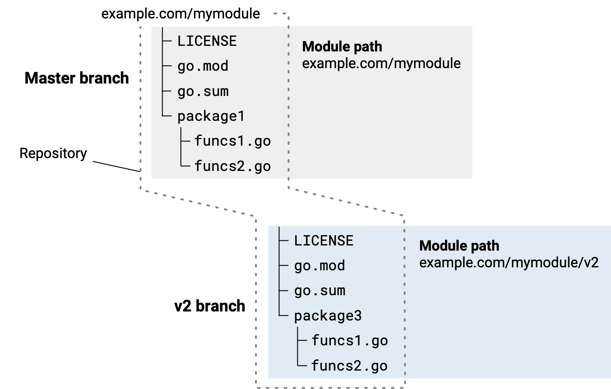

+++
title = "开发主版本更新"
weight = 4
date = 2023-05-17T15:03:14+08:00
description = ""
isCJKLanguage = true
draft = false
+++
# Developing a major version update - 开发主版本更新 

​	当您在潜在的新版本中所做的更改无法保证模块用户的向后兼容性时，您必须更新到一个主要版本。例如，如果您更改了模块的公共API以使其破坏使用先前版本模块的客户端代码，则将进行此更改。

> 注意：每种发布类型——主要、次要、修订或预发布——对于模块的用户都有不同的含义。这些用户依赖于这些差异来理解发布对其自身代码所代表的风险水平。换句话说，在准备发布时，请确保其版本号准确反映了自上一版本发布以来的更改性质。有关版本号的更多信息，请参阅[模块版本编号](../ModuleVersionNumbering)。

另请参阅

- 有关模块开发的概述，请参阅 [开发和发布模块](../DevelopingAndPublishingModules)。 
- 有关端到端的视图，请参阅 [模块发布和版本控制工作流程](../ModuleReleaseAndVersioningWorkflow)。 

## 主要版本更新的注意事项 

​	仅当绝对必要时，您才应更新到新的主要版本。主要版本更新对您和模块的用户都会产生重大变动。在考虑进行主要版本更新时，请考虑以下内容：

- 向用户明确新的主要版本发布对以前主要版本的支持意味着什么。

  以前的版本是否已废弃？是否像以前一样受到支持？您是否将维护以前的版本，包括修复bug？

- 准备好承担两个版本的维护工作：旧版本和新版本。例如，如果您在其中一个版本中修复了bug，则通常会将这些修复移植到另一个版本中。

- 请记住，新的主要版本从依赖管理的角度来看是一个新模块。在您发布之后，您的用户需要更新以使用新模块，而不仅仅是简单地升级。

  这是因为新的主要版本具有不同的模块路径，与前一个主要版本不同。例如，对于其模块路径为`example.com/mymodule`的模块，而v2版本的模块路径为`example.com/mymodule/v2`。

- 当您开发一个新的主要版本时，您还必须更新代码导入包的导入路径，无论从哪个模块导入包。如果您的模块的用户想升级到新的主要版本，他们也必须更新他们的导入路径。


## 为主要版本发布创建分支 

​	在准备开发一个新的主版本时，处理源代码的最直接方法是在上一个主版本的最新版本上对版本库进行分支。

​	例如，在命令提示符下，您可以切换到模块的根目录，然后在那里创建一个新的 v2 分支。

```
$ cd mymodule
$ git checkout -b v2
Switched to a new branch "v2"
```



一张描绘从主分支(master)分支出v2版本的仓库的图示 
{: caption }

​	一旦您创建了源代码的分支，您就需要对新版本的源代码进行以下更改：

- 在新版本的go.mod文件中，在模块路径中添加新的主版本号，如下所示：
  - 现有版本: `example.com/mymodule`
  - 新版本: `example.com/mymodule/v2`
- 在您的Go代码中，更新每个导入的包路径，在您从该模块中导入一个包时，将主版本号附加到模块路径部分。
  - 旧的导入语句: `import "example.com/mymodule/package1"`
  - 新的导入语句: `import "example.com/mymodule/v2/package1"`

​	有关发布步骤，请参阅[发布模块](../PublishingAModule)。