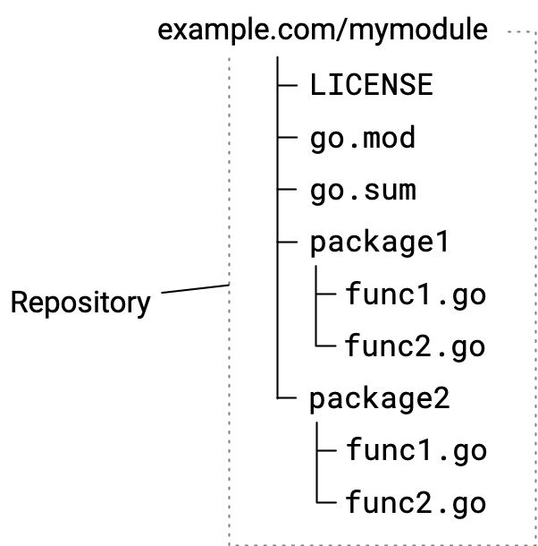

+++
title = "管理模块源代码"
weight = 3
date = 2023-05-17T15:03:14+08:00
description = ""
isCJKLanguage = true
draft = false

+++
# Managing module source - 管理模块源代码

> 原文：[https://go.dev/doc/modules/managing-source](https://go.dev/doc/modules/managing-source)

​	当您开发模块并发布给其他人使用时，您可以通过遵循本主题中描述的存储库约定，来帮助确保您的模块更容易被其他开发者使用。

​	本主题描述了在管理模块存储库时可能采取的操作。有关从一个版本到另一个版本进行修订时所需的工作流步骤的顺序信息，请参阅[模块发布和版本控制工作流程](../ModuleReleaseAndVersioningWorkflow)。

​	这里描述的一些约定是模块中的必需项，而其他一些是最佳实践。本文假设您已经熟悉[管理依赖项]()中描述的基本模块使用方法。

​	Go支持以下用于发布模块和检索其代码的存储库：Git、Subversion、Mercurial、Bazaar和Fossil。

​	有关模块开发的概述，请参阅[开发和发布模块](../DevelopingAndPublishingModules)。

## Go工具如何找到您发布的模块

​	在Go的分布式系统中，您可以在保留代码在存储库中的同时发布模块。Go工具依赖于命名规则，其中包含存储库路径和存储库标签，指示模块的名称和版本号。当您的存储库符合这些要求时，Go工具（如[`go get`命令]()）可以从您的存储库下载模块代码。

​	当开发人员使用`go get`命令获取他们的代码导入的包的源代码时，该命令会执行以下操作：

1. 从Go源代码中的`import`语句中，`go get`识别包路径中的模块路径。
2. 使用从模块路径派生的URL，该命令在模块代理服务器或其存储库中直接定位模块源代码。
3. 通过将模块的版本号与存储库标签进行匹配，找到要下载的模块版本的源代码。当尚不知道要使用的版本号时，`go get`会查找最新的发布版本。
4. 检索模块源代码并将其下载到开发人员的本地模块缓存中。

## 在存储库中组织代码

​	您可以通过遵循这里描述的约定来简化维护并改善开发者对您的模块的体验。将您的模块代码放入存储库通常与其他代码一样简单。

​	下面的图表说明了一个简单模块的源代码层次结构，其中包含两个包。



Diagram illustrating a module source code hierarchy

图示模块源代码的层次结构

​	您的初始提交应包括以下表格中列出的文件： 

| 文件                   | 描述                                                         |
| ---------------------- | ------------------------------------------------------------ |
| LICENSE                | 该模块的许可文件。                                           |
| go.mod                 | 描述该模块，包括模块路径（实际上是模块的名称）和它的依赖项。有关更多信息，请参阅[go.mod参考]()。模块路径将在模块指令中给出，例如：`module example.com/mymodule`。有关选择模块路径的更多信息，请参阅[管理依赖项]()。虽然您可以编辑go.mod文件，但最好使用`go`命令进行更改，这样更可靠。 |
| go.sum                 | 包含代表该模块依赖项的加密哈希。Go工具使用这些哈希来验证下载的模块，以确认下载的模块是否真实可信。如果验证失败，Go将显示安全错误。当没有依赖项时，该文件将为空或不存在。除非使用`go mod tidy`命令删除不需要的条目，否则不应编辑此文件。 |
| 包目录 和 .go 源码文件 | 组成模块中Go包和源的目录和.go文件。                          |

​	通过命令行，您可以创建一个空的存储库，添加将作为初始提交的文件，并附带提交消息。下面是一个使用git的示例：

```shell
$ git init
$ git add --all
$ git commit -m "mycode: initial commit"
$ git push
```

## 选择存储库作用域

​	当代码需要与其他模块的代码独立版本控制时，您可以将代码发布为一个模块。

​	将您的存储库设计为根目录仅包含一个模块将有助于简化维护工作，特别是随着您发布新的次要版本和修补版本，以及进入新的主要版本等情况。然而，如果您的需求需要，您也可以在单个存储库中维护多个模块的集合。

### 每个存储库只包含一个模块的源代码

​	您可以维护一个包含单个模块源代码的存储库。在这种模式下，您将 go.mod 文件放在存储库的根目录下，包的子目录中包含着 Go 源代码。

​	这是最简单的方法，使得随着时间推移，您的模块更容易管理。它避免了需要在模块版本号前加上目录路径的需求。


图示单个模块在其存储库中的源代码

### 在单个存储库中包含多个模块

​	您可以从单个存储库中发布多个模块。例如，您可能有一个单独的存储库包含多个模块，但希望对这些模块进行单独版本管理。

​	每个作为模块根目录的子目录必须有自己的 go.mod 文件。

Sourcing module code in subdirectories changes the form of the version tag you must use when publishing a module. You must prefix the version number part of the tag with the name of the subdirectory that is the module root. For more about version numbers, see [Module version numbering](https://go.dev/doc/modules/version-numbers).

​	在子目录中 sourcing 模块代码会改变发布模块时必须使用的版本标签的形式。您必须在标签的版本号部分前加上作为模块根目录的子目录名称。有关版本号的更多信息，请参阅[模块版本编号](../ModuleVersionNumbering)。（sourcing该怎么翻译？）

​	例如，对于下面的模块 `example.com/mymodules/module1`，版本号 v1.2.3 的情况如下：

- 模块路径是：`example.com/mymodules/module1`

- 版本标签是： `module1/v1.2.3`  

- 用户导入的包路径是：`example.com/mymodules/module1/package1`

- 用户 require 指令中给出的模块路径是：`example.com/mymodules/module1 module1/v1.2.3`


Diagram illustrating two modules in a single repository

图中说明了单个存储库中的两个模块