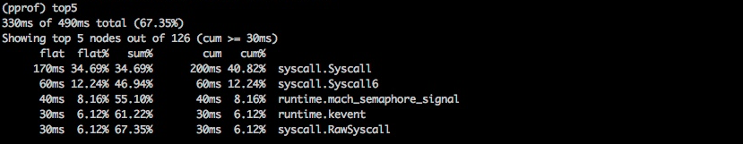
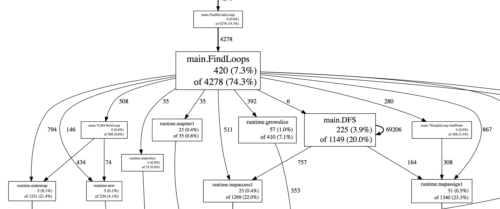
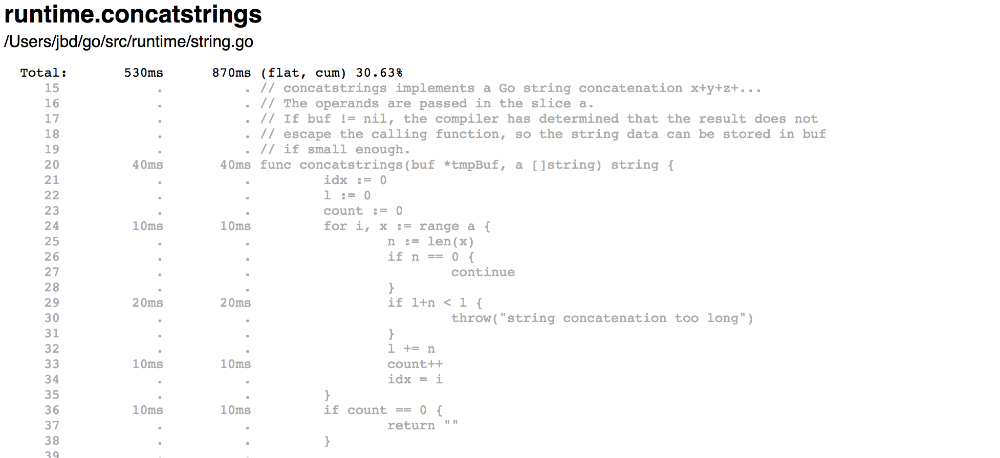
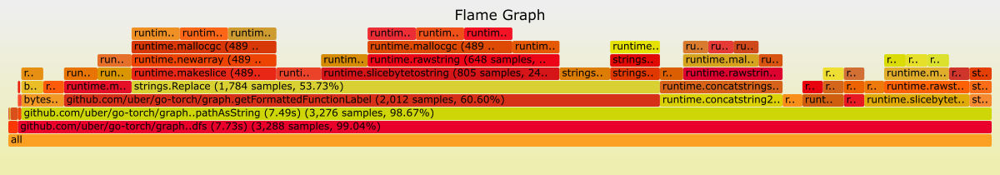
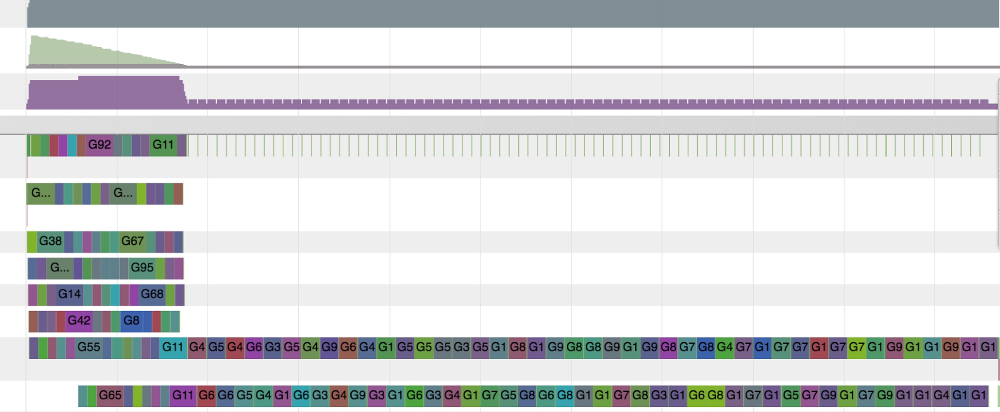

+++
title = "诊断"
linkTitle = "诊断"
weight = 20
date = 2023-05-17T15:03:14+08:00
description = ""
isCJKLanguage = true
draft = false
+++
# Diagnostics 诊断

> 原文：https://go.dev/doc/diagnostics

## 简介

​	Go 生态系统提供了大量的 API 和工具来诊断 Go 程序中的逻辑和性能问题。本页总结了可用的工具，并帮助Go用户为他们的具体问题选择合适的工具。

​	诊断解决方案可以分为以下几类：

- **Profiling（分析）**：分析工具分析Go程序的复杂性和成本，如内存的使用和经常调用的函数，以识别 Go 程序中的昂贵部分。
- **Tracing（跟踪）**：跟踪是一种对代码进行检测的方法，以分析调用或用户请求的整个生命周期中的延迟情况。跟踪提供了一个概览，显示每个组件对系统中的整体延迟的贡献程度。跟踪可以横跨多个Go进程。
- **Debugging（调试）**：调试允许我们暂停Go程序并检查其执行情况。程序的状态和流程可以通过调试得到验证。
- **Runtime statistics and events（运行时统计和事件）**：运行时统计和事件的收集和分析提供了对 Go 程序健康状况的高级概述。度量指标的波动有助于我们识别吞吐量、利用率和性能的变化。

!!! warning "注意"
	注意：某些诊断工具可能会相互干扰。例如，精确的内存分析会使CPU分析出现偏差，而goroutine阻塞分析会影响调度器跟踪。单独使用工具来获取更精确的信息.

## Profiling 分析

​	分析对于识别昂贵或经常调用的代码段非常有用。Go 运行时以[ pprof 可视化工具](https://github.com/google/pprof/blob/master/doc/README.md)所需的格式提供[ 分析数据](../../StdLib/runtime/pprof)。分析数据可以在测试期间通过`go test`或从[ net/http/pprof](../../StdLib/net/http_pprof/) 包中提供的端点收集。用户需要收集分析数据，并使用 pprof 工具来筛选和可视化顶级代码路径.

​	[runtime/pprof](../../StdLib/runtime/pprof)包提供的预定义配置文件（profiles）：

- **cpu**: CPU 配置文件(profile)确定程序在主动消耗 CPU 周期时花费时间的位置（而不是在睡眠或等待 I/O 时）.
- **heap**: 堆配置文件报告内存分配样本；用于监视当前和历史内存使用情况，并检查内存泄漏.
- **threadcreate**: 线程创建配置文件报告导致创建新操作系统线程的程序部分.
- **goroutine**: Goroutine配置文件报告所有当前 goroutine 的栈跟踪.
- **block**: Block配置文件显示 goroutine 阻塞等待同步原语（包括计时器通道）的位置。默认情况下不启用阻塞配置文件；使用`runtime.SetBlockProfileRate`启用它.
- **mutex**: Mutex 配置文件报告锁的争夺情况。当您认为您的 CPU 由于mutex争夺而未充分利用时，请使用此配置文件。Mutex 配置文件默认未启用，请参阅 `runtime.SetMutexProfileFraction`启用它。

**我可以使用哪些其他分析器来分析 Go 程序?**

​	在Linux上，可以使用[perf工具](https://perf.wiki.kernel.org/index.php/Tutorial)来对Go程序进行分析。`perf` 可以分析和展开 `cgo/SWIG` 代码和内核，因此有助于深入了解本机/内核性能瓶颈。在 macOS 上， [Instruments](https://developer.apple.com/library/content/documentation/DeveloperTools/Conceptual/InstrumentsUserGuide/) 套件可用于分析 Go 程序.

**我可以分析我的生产环境的服务吗**？

​	是的。在生产环境中分析程序是安全的，但是启用某些profile（例如 CPU profile）会增加成本。您应该会看到性能下降。性能损失可以通过在生产中打开分析器之前测量分析器的开销来估计。

​	您可能希望定期分析您的生产环境的服务。特别是在具有单个进程的多个副本的系统中，定期选择随机副本是一个安全的选择。选择一个生产过程，每 Y 秒对其进行 X 秒分析，并保存结果以供可视化和分析；然后定期重复。可以手动和/或自动检查结果以发现问题。profile的收集可能会相互干扰，因此建议一次只收集一个profile。

**可视化分析数据的最佳方法是什么**？

​	Go 工具使用 `go tool pprof`提供profile数据的文本、图形和[callgrind](http://valgrind.org/docs/manual/cl-manual.html)可视化。阅读 [分析 Go 程序](../../GoBlog/2011/ProfilingGoPrograms)以查看其运行情况。


以文本形式列出最昂贵的调用。


将最昂贵的调用可视化为图表。

Weblist 视图在 HTML 页面中逐行显示源代码的昂贵部分。在下面的示例中，在`runtime.concatstrings`中花费了 530 毫秒，每行的成本显示在列表中。


将最昂贵的调用可视化为weblist.

​	可视化分析数据的另一种方法是[flame graph（火焰图）](http://www.brendangregg.com/flamegraphs.html)。火焰图允许您在特定的祖先路径中移动，因此您可以放大/缩小代码的特定部分。[上游 pprof](https://github.com/google/pprof) 支持火焰图.


火焰图提供可视化来发现最昂贵的代码路径.

**我是否仅限于内置profiles**？

​	除了运行时提供的内容之外，Go 用户还可以通过[pprof.Profile](https://go.dev/pkg/runtime/pprof/#Profile)创建他们的自定义profiles， 并使用现有工具来检查它们。

**我可以在不同的路径和端口上提供分析器处理程序 (/debug/pprof/...) 吗**？

​	是的。默认情况下，`net/http/pprof`包将其处理程序注册到默认多路复用器（mux），但您也可以使用从包中导出的处理程序自行注册它们.

​	例如，以下示例将在 `/custom_debug_path/profile` 的 `:7777` 上为 pprof.Profile 处理程序提供服务：

```go 
package main

import (
	"log"
	"net/http"
	"net/http/pprof"
)

func main() {
	mux := http.NewServeMux()
	mux.HandleFunc("/custom_debug_path/profile", pprof.Profile)
	log.Fatal(http.ListenAndServe(":7777", mux))
}
```


## Tracing 跟踪

​	跟踪是对代码进行检测的一种方式，以分析一连串调用的整个生命周期的延迟。Go 提供 [golang.org/x/net/trace](https://godoc.org/golang.org/x/net/trace) 包，作为每个 Go 节点的最小跟踪后端，并提供一个带有简单仪表盘的最小检测库。Go还提供了一个执行跟踪器来跟踪一个时间间隔内的运行时事件。

​	跟踪使我们能够：

- 检测和分析Go进程中的应用延迟。
- 测量一长串调用中特定调用的成本。
- 弄清利用率和性能改进情况。如果没有跟踪数据，瓶颈并不总是那么明显。

​	在单体系统中，从程序的构建块中收集诊断数据相对容易。所有模块都存在于一个进程中，并分享共同的资源来报告日志、错误和其他诊断信息。一旦你的系统超过了单一的进程，并开始成为分布式的，就很难跟踪从前端Web服务器到所有后端的调用，直到响应被返回给用户。这就是分布式跟踪在检测和分析你的生产系统方面发挥了很大作用。

​	分布式跟踪是一种对代码进行检测的方法，以分析用户请求的整个生命周期的延迟。当一个系统是分布式的，并且传统的分析和调试工具无法扩展时，您可能希望使用分布式跟踪工具来分析用户请求和 RPC 的性能。

​	分布式跟踪使我们能够：

- 在一个大型系统中检测和分析应用程序的延迟。
- 在用户请求的生命周期内跟踪所有的RPC，并查看仅在生产环境中可见的集成问题。
- 找出可以应用于我们系统的性能改进。在收集跟踪数据之前，许多瓶颈是不明显的。

​	Go生态系统为每个跟踪系统提供了各种分布式跟踪库，以及与后台无关的跟踪库。

**有没有一种方法可以自动拦截每个函数调用并创建跟踪？**

​	Go并没有提供自动拦截每个函数调用并创建跟踪跨度的方法。您需要手动检测您的代码以创建、结束和注释跨度。

**我应该如何在 Go 库中传播跟踪标头？**

​	你可以在[context.Context](../../StdLib/context#type-context)中传播跟踪标识符和标记。目前业界还没有规范的跟踪键或跟踪头的常见表示形式。每个跟踪提供程序都负责在其 Go 库中提供传播实用程序。

**还有哪些来自标准库或运行时的低级事件可以包含在跟踪中？**

​	标准库和运行时正试图公开几个额外的API来通知低级别的内部事件。例如，[httptrace.ClientTrace](https://go.dev/pkg/net/http/httptrace#ClientTrace)提供了API来跟踪传出请求的生命周期中的低级别事件。目前正在努力从运行时执行跟踪器中检索低级别的运行时事件，并允许用户定义和记录他们的用户事件。

## Debugging 调试

​	调试是确定一个程序出现问题的原因的过程。调试器使我们能够了解一个程序的执行流程和当前状态。有几种调试方式；本节将只关注将调试器附加到程序和核心转储的调试。

​	Go用户大多使用以下调试器：

- [Delve](https://github.com/derekparker/delve)：Delve是一个用于Go编程语言的调试器。它支持Go的运行时概念和内置类型。Delve正在努力成为一个功能齐全的可靠的Go程序调试器。
- [GDB](https://go.dev/doc/gdb): Go通过标准Go编译器和Gccgo提供GDB支持。栈管理、线程和运行时所包含的方面与GDB所期望的执行模型有很大不同，以至于它们可能会混淆调试器，即使程序是用gccgo编译的。尽管GDB可以用来调试Go程序，但它并不理想，可能会造成混乱。

**调试器与 Go 程序配合使用的情况如何？**

​	Go 的 `gc` 编译器执行一些优化，例如函数内联和变量寄存器化。这些优化有时会使得使用调试器进行调试更加困难。目前正在努力提高优化二进制文件生成的 DWARF 信息的质量。在这些改进可用之前，建议在构建要调试的代码时禁用优化。以下命令将使用没有编译器优化的方式构建一个包：

```sh
$ go build -gcflags=all="-N -l"
```

​	作为改进工作的一部分，Go 1.10 引入了一个新的编译器标志 `-dwarflocationlists`。该标志会导致编译器添加位置列表，从而帮助调试器与优化的二进制文件配合工作。以下命令将使用优化但包含 DWARF 位置列表的方式构建一个包：

```sh
$ go build -gcflags="-dwarflocationlists=true"
```

**推荐的调试器用户界面是什么？**

​	尽管delve和gdb都提供了CLI，但大多数编辑器集成和IDE都提供了调试的特定用户界面。

**有可能用Go程序进行事后调试吗？**

​	核心转储文件是包含运行进程的内存转储和进程状态的文件。它主要用于程序的死后调试，并在程序仍在运行时了解其状态。这两种情况使得核心转储调试成为分析生产服务的良好诊断工具。可以从 Go 程序获取核心文件，并使用 delve 或 gdb 进行调试，请参阅[核心转储调试](https://go.dev/wiki/CoreDumpDebugging)页面以获取步骤指南。

## Runtime statistics and events 运行时统计和事件

​	运行时提供内部事件的统计和报告，供用户在运行时层面诊断性能和利用率问题。

​	用户可以监控这些统计信息，以更好地了解Go程序的整体健康状况和性能。一些经常被监控的统计信息和状态有：

- `runtime.ReadMemStats`报告与堆分配和垃圾收集有关的指标。内存统计对于监控一个进程消耗了多少内存资源，进程是否能很好地利用内存，以及捕捉内存泄露都很有用。
- `debug.ReadGCStats` 读取有关垃圾收集的统计数据。它可以显示有多少资源花费在垃圾回收暂停上。它还会报告垃圾收集器暂停时间的时间线和百分位数。
- `debug.Stack` 返回当前的栈跟踪。栈跟踪对于查看当前有多少个goroutine在运行，它们在做什么，以及它们是否被阻塞是非常有用的。
- `debug.WriteHeapDump` 暂停所有goroutines的执行，允许你将堆转储到一个文件。堆转储是Go进程在某一特定时间的内存快照。它包含所有分配的对象以及goroutines、finalizers等。
- `runtime.NumGoroutine`返回当前goroutine的数量。该值可以被监控，以查看是否有足够的goroutine被利用，或者检测goroutine的泄漏。

### Execution tracer 执行跟踪器

​	Go 自带的运行时执行跟踪器可以捕捉到大量的运行时事件。调度、系统调用、垃圾回收、堆大小和其他事件都由运行时收集，并可由go工具跟踪进行可视化。执行跟踪器是一个检测延迟和利用率问题的工具。您可以检查 CPU 的利用率以及网络或系统调用何时导致 goroutine 被抢占。

​	Tracer对以下方面很有用：

- 了解你的goroutines是如何执行的。
- 了解一些核心的运行时事件，如GC运行。
- 识别不良的并行化执行。

​	然而，它并不适合于识别热点，比如分析内存或CPU使用过量的原因。首先使用分析工具来代替，以解决这些问题。



​	上面，go工具的跟踪可视化显示执行开始时很好，然后就变成了串行化。这表明可能存在对共享资源的锁争夺，造成了一个瓶颈。

​	参见[go tool trace](https://go.dev/cmd/trace/)跟踪，收集和分析运行时跟踪。

### GODEBUG

​	如果[GODEBUG](https://go.dev/pkg/runtime/#hdr-Environment_Variables)环境变量被相应设置，运行时也会发出事件和信息。

- GODEBUG=gctrace=1 在每次收集时打印垃圾收集器事件，汇总收集的内存量和暂停的时间。
- GODEBUG=inittrace=1 打印完成包初始化工作的执行时间和内存分配信息的摘要。
- GODEBUG=schedtrace=X 打印每隔X毫秒的调度事件。

​	GODEBUG环境变量可以用来禁止使用标准库和运行时中的指令集扩展。

- GODEBUG=cpu.all=off 禁止使用所有可选的指令集扩展。

- GODEBUG=cpu.`extension`=off 禁止使用指定指令集扩展的指令。

  `extension`是指令集扩展的小写名称，如`sse41`或`avx`。