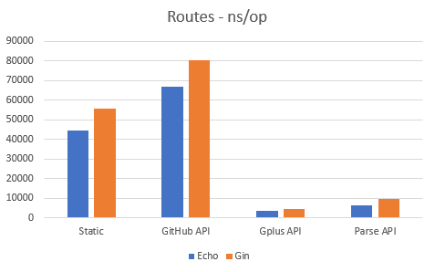
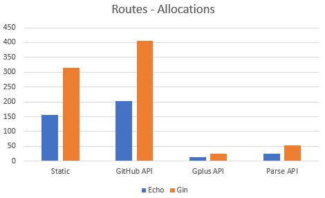

+++
title = "echo 在pkg.go.dev上的文档"
date = 2023-08-22T08:44:25+08:00
type = "docs"
description = ""
isCJKLanguage = true
draft = false

+++


# echo 在pkg.go.dev上的文档

https://pkg.go.dev/github.com/labstack/echo/v4

> version: v4.11.1
>
> published: 2023.7.16

## 支持的 Go 版本

​	最新版本的 Echo 支持最近四个 Go 主要版本[发布](https://go.dev/doc/devel/release)，并且可能与旧版本一起使用。

​	从版本4.0.0开始，Echo 作为一个[Go 模块](https://github.com/golang/go/wiki/Modules)可用。因此，需要一个能理解/vN后缀导入的 Go 版本：

​	这些任何版本都允许您将 Echo 导入为 `github.com/labstack/echo/v4`，这是未来使用 Echo 的推荐方式。

​	对于旧版本，请使用最新的 v3 标签。

## 特性概述

- 优化的 HTTP 路由器，智能优先处理路由
- 构建稳健且可扩展的 RESTful API
- 分组 API
- 可扩展的中间件框架
- 在根、分组或路由级别定义中间件
- 数据绑定支持 JSON、XML 和表单负载
- 便捷的函数用于发送各种 HTTP 响应
- 集中式的 HTTP 错误处理
- 支持使用任意模板引擎进行模板渲染
- 定义日志记录器的格式
- 高度可定制
- 自动通过 Let’s Encrypt 进行 TLS
- 支持 HTTP/2

## 基准测试

Date: 2020/11/11
Source: https://github.com/vishr/web-framework-benchmark
Lower is better!

较低的值表示性能更好！

 

​	上述基准测试在 Intel(R) Core(TM) i7-6820HQ CPU @ 2.70GHz 上运行。

### 指南

#### 安装

```bash
// go get github.com/labstack/echo/{version}
go get github.com/labstack/echo/v4
```

#### 示例

``` go
package main

import (
  "github.com/labstack/echo/v4"
  "github.com/labstack/echo/v4/middleware"
  "net/http"
)

func main() {
  // Echo instance
  e := echo.New()

  // Middleware
  e.Use(middleware.Logger())
  e.Use(middleware.Recover())

  // Routes
  e.GET("/", hello)

  // Start server
  e.Logger.Fatal(e.Start(":1323"))
}

// Handler
func hello(c echo.Context) error {
  return c.String(http.StatusOK, "Hello, World!")
}
```

## 官方中间件仓库

​	以下中间件列表由 Echo 团队维护。

| 仓库                                                         | 描述                                                         |
| ------------------------------------------------------------ | ------------------------------------------------------------ |
| [github.com/labstack/echo-jwt](https://github.com/labstack/echo-jwt) | [JWT](https://github.com/golang-jwt/jwt) 中间件              |
| [github.com/labstack/echo-contrib](https://github.com/labstack/echo-contrib) | [casbin](https://github.com/casbin/casbin), [gorilla/sessions](https://github.com/gorilla/sessions), [jaegertracing](https://github.com/uber/jaeger-client-go), [prometheus](https://github.com/prometheus/client_golang/), [pprof](https://pkg.go.dev/net/http/pprof), [zipkin](https://github.com/openzipkin/zipkin-go) 中间件 |

## 第三方中间件仓库

​	在添加第三方中间件时要小心。Echo 团队没有时间或人力来保证此列表中的中间件的安全性和质量。

| 仓库                                                         | 描述                                                         |
| ------------------------------------------------------------ | ------------------------------------------------------------ |
| [deepmap/oapi-codegen](https://github.com/deepmap/oapi-codegen) | 使用 [OpenAPI](https://swagger.io/specification/) 客户端和服务器代码生成器自动生成 RESTful API 文档 |
| [github.com/swaggo/echo-swagger](https://github.com/swaggo/echo-swagger) | 使用 [Swagger](https://swagger.io/) 2.0 自动生成 RESTful API 文档 |
| [github.com/ziflex/lecho](https://github.com/ziflex/lecho)   | Echo 日志记录器接口的 [Zerolog](https://github.com/rs/zerolog) 日志库封装 |
| [github.com/brpaz/echozap](https://github.com/brpaz/echozap) | Echo 日志记录器接口的 Uber´s [Zap](https://github.com/uber-go/zap) 日志库封装 |
| [github.com/samber/slog-echo](https://github.com/samber/slog-echo) | Echo 日志记录器接口的 Go [slog](https://pkg.go.dev/golang.org/x/exp/slog) 日志库封装 |
| [github.com/darkweak/souin/plugins/echo](https://github.com/darkweak/souin/tree/master/plugins/echo) | 基于 [Souin](https://github.com/darkweak/souin) 的 HTTP 缓存系统，自动缓存您的端点。根据您的需求，它支持一些分布式和非分布式存储系统。 |
| [github.com/mikestefanello/pagoda](https://github.com/mikestefanello/pagoda) | 使用 Echo 构建的快速、简便的全栈 Web 开发入门工具包。        |
| [github.com/go-woo/protoc-gen-echo](https://github.com/go-woo/protoc-gen-echo) | ProtoBuf 生成 Echo 服务器端代码                              |

​	欢迎发送 PR 来添加您自己的库。

### 帮助

- [论坛](https://github.com/labstack/echo/discussions)

### 贡献

**Use issues for everything**

**使用 issues 进行一切交流**

- For a small change, just send a PR.
- 对于小改动，只需发送 PR。
- For bigger changes open an issue for discussion before sending a PR.
- 对于较大的更改，在发送 PR 之前，请开启一个讨论 issue。
- PR should have:
- PR 应包括：
  - Test case
  - Documentation
  - Example (If it makes sense)
  - 测试用例
  - 文档
  - 示例（如果有意义）
- You can also contribute by:
- 您还可以通过以下方式贡献：
  - Reporting issues
  - Suggesting new features or enhancements
  - Improve/fix documentation
  - 报告问题
  - 提出新功能或增强建议
  - 改进/修复文档

### 鸣谢

- [Vishal Rana](https://github.com/vishr)（作者）
- [Nitin Rana](https://github.com/nr17)（顾问）
- [Roland Lammel](https://github.com/lammel)（维护者）
- [Martti T.](https://github.com/aldas)（维护者）
- [Pablo Andres Fuente](https://github.com/pafuent)（维护者）
- [贡献者们](https://github.com/labstack/echo/graphs/contributors)

### 许可证

[MIT](https://github.com/labstack/echo/raw/master/LICENSE)

##  文档

### 概述

​	 echo 包实现了高性能、极简的（minimalist ） Go web 框架。

示例：

``` go
package main

import (
  "net/http"

  "github.com/labstack/echo/v4"
  "github.com/labstack/echo/v4/middleware"
)

// 处理函数
func hello(c echo.Context) error {
  return c.String(http.StatusOK, "Hello, World!")
}

func main() {
  // 创建 Echo 实例
  e := echo.New()

  // 中间件
  e.Use(middleware.Logger())
  e.Use(middleware.Recover())

  // 路由
  e.GET("/", hello)

  // 启动服务器
  e.Logger.Fatal(e.Start(":1323"))
}
```

​	了解更多请访问 [https://echo.labstack.com](https://echo.labstack.com/)

### 常量 

#### HTTP 方法

[View Source](https://github.com/labstack/echo/blob/v4.11.1/echo.go#L157)

``` go
const (
	CONNECT = http.MethodConnect
	DELETE  = http.MethodDelete
	GET     = http.MethodGet
	HEAD    = http.MethodHead
	OPTIONS = http.MethodOptions
	PATCH   = http.MethodPatch
	POST    = http.MethodPost
	// PROPFIND = "PROPFIND"
	PUT   = http.MethodPut
	TRACE = http.MethodTrace
)
```

HTTP methods NOTE: Deprecated, please use the stdlib constants directly instead.

注意：这些HTTP 方法 **已废弃**，请直接使用标准库中的常量。

#### MIME 类型

[View Source](https://github.com/labstack/echo/blob/v4.11.1/echo.go#L171)

``` go
const (
	MIMEApplicationJSON                  = "application/json"
	MIMEApplicationJSONCharsetUTF8       = MIMEApplicationJSON + "; " + charsetUTF8
	MIMEApplicationJavaScript            = "application/javascript"
	MIMEApplicationJavaScriptCharsetUTF8 = MIMEApplicationJavaScript + "; " + charsetUTF8
	MIMEApplicationXML                   = "application/xml"
	MIMEApplicationXMLCharsetUTF8        = MIMEApplicationXML + "; " + charsetUTF8
	MIMETextXML                          = "text/xml"
	MIMETextXMLCharsetUTF8               = MIMETextXML + "; " + charsetUTF8
	MIMEApplicationForm                  = "application/x-www-form-urlencoded"
	MIMEApplicationProtobuf              = "application/protobuf"
	MIMEApplicationMsgpack               = "application/msgpack"
	MIMETextHTML                         = "text/html"
	MIMETextHTMLCharsetUTF8              = MIMETextHTML + "; " + charsetUTF8
	MIMETextPlain                        = "text/plain"
	MIMETextPlainCharsetUTF8             = MIMETextPlain + "; " + charsetUTF8
	MIMEMultipartForm                    = "multipart/form-data"
	MIMEOctetStream                      = "application/octet-stream"
)
```

#### HTTP 方法和相关常量

[View Source](https://github.com/labstack/echo/blob/v4.11.1/echo.go#L191)

``` go
const (

    // PROPFIND 方法可用于集合和属性资源。
	PROPFIND = "PROPFIND"
    // REPORT 方法可用于获取有关资源的信息，参见 rfc 3253
	REPORT = "REPORT"
    // RouteNotFound 是用于处理 "route not found"（404）情况的特殊方法类型
	RouteNotFound = "echo_route_not_found"
)
```

#### HTTP 头字段

[View Source](https://github.com/labstack/echo/blob/v4.11.1/echo.go#L202)

``` go
const (
	HeaderAccept         = "Accept"
	HeaderAcceptEncoding = "Accept-Encoding"
    // HeaderAllow 是 "Allow" 头字段的名称，用于列出目标资源支持的方法集。
	// 对于状态 405（method not found）返回 Allow 头字段是必需的，并且对 OPTIONS 方法的响应很有用。
	// 参见 RFC 7231：https://datatracker.ietf.org/doc/html/rfc7231#section-7.4.1
	HeaderAllow               = "Allow"
	HeaderAuthorization       = "Authorization"
	HeaderContentDisposition  = "Content-Disposition"
	HeaderContentEncoding     = "Content-Encoding"
	HeaderContentLength       = "Content-Length"
	HeaderContentType         = "Content-Type"
	HeaderCookie              = "Cookie"
	HeaderSetCookie           = "Set-Cookie"
	HeaderIfModifiedSince     = "If-Modified-Since"
	HeaderLastModified        = "Last-Modified"
	HeaderLocation            = "Location"
	HeaderRetryAfter          = "Retry-After"
	HeaderUpgrade             = "Upgrade"
	HeaderVary                = "Vary"
	HeaderWWWAuthenticate     = "WWW-Authenticate"
	HeaderXForwardedFor       = "X-Forwarded-For"
	HeaderXForwardedProto     = "X-Forwarded-Proto"
	HeaderXForwardedProtocol  = "X-Forwarded-Protocol"
	HeaderXForwardedSsl       = "X-Forwarded-Ssl"
	HeaderXUrlScheme          = "X-Url-Scheme"
	HeaderXHTTPMethodOverride = "X-HTTP-Method-Override"
	HeaderXRealIP             = "X-Real-Ip"
	HeaderXRequestID          = "X-Request-Id"
	HeaderXCorrelationID      = "X-Correlation-Id"
	HeaderXRequestedWith      = "X-Requested-With"
	HeaderServer              = "Server"
	HeaderOrigin              = "Origin"
	HeaderCacheControl        = "Cache-Control"
	HeaderConnection          = "Connection"
    
    // 访问控制
	HeaderAccessControlRequestMethod    = "Access-Control-Request-Method"
	HeaderAccessControlRequestHeaders   = "Access-Control-Request-Headers"
	HeaderAccessControlAllowOrigin      = "Access-Control-Allow-Origin"
	HeaderAccessControlAllowMethods     = "Access-Control-Allow-Methods"
	HeaderAccessControlAllowHeaders     = "Access-Control-Allow-Headers"
	HeaderAccessControlAllowCredentials = "Access-Control-Allow-Credentials"
	HeaderAccessControlExposeHeaders    = "Access-Control-Expose-Headers"
	HeaderAccessControlMaxAge           = "Access-Control-Max-Age"

    // 安全
	HeaderStrictTransportSecurity         = "Strict-Transport-Security"
	HeaderXContentTypeOptions             = "X-Content-Type-Options"
	HeaderXXSSProtection                  = "X-XSS-Protection"
	HeaderXFrameOptions                   = "X-Frame-Options"
	HeaderContentSecurityPolicy           = "Content-Security-Policy"
	HeaderContentSecurityPolicyReportOnly = "Content-Security-Policy-Report-Only"
	HeaderXCSRFToken                      = "X-CSRF-Token"
	HeaderReferrerPolicy                  = "Referrer-Policy"
)
```

#### 上下文键

[View Source](https://github.com/labstack/echo/blob/v4.11.1/context.go#L215)

``` go
const (
    // ContextKeyHeaderAllow 由 Router 设置，用于在处理程序调用链的后续阶段获取 "Allow" 头字段的值。
	// 对于状态 405（method not found）返回 Allow 头字段是必需的，并且对 OPTIONS 方法的响应很有用。
	// 仅当 Router 在请求中找不到匹配的方法处理程序时，才将其添加到上下文中。
	ContextKeyHeaderAllow = "echo_header_allow"
)
```

#### 版本信息

[View Source](https://github.com/labstack/echo/blob/v4.11.1/echo.go#L260)

``` go
const (
    // Echo 的版本
	Version = "4.11.1"
)
```

### 变量

#### 错误变量

[View Source](https://github.com/labstack/echo/blob/v4.11.1/echo.go#L294)

``` go
var (
	ErrBadRequest                    = NewHTTPError(http.StatusBadRequest)                    // HTTP 400 Bad Request
	ErrUnauthorized                  = NewHTTPError(http.StatusUnauthorized)                  // HTTP 401 Unauthorized
	ErrPaymentRequired               = NewHTTPError(http.StatusPaymentRequired)               // HTTP 402 Payment Required
	ErrForbidden                     = NewHTTPError(http.StatusForbidden)                     // HTTP 403 Forbidden
	ErrNotFound                      = NewHTTPError(http.StatusNotFound)                      // HTTP 404 Not Found
	ErrMethodNotAllowed              = NewHTTPError(http.StatusMethodNotAllowed)              // HTTP 405 Method Not Allowed
	ErrNotAcceptable                 = NewHTTPError(http.StatusNotAcceptable)                 // HTTP 406 Not Acceptable
	ErrProxyAuthRequired             = NewHTTPError(http.StatusProxyAuthRequired)             // HTTP 407 Proxy AuthRequired
	ErrRequestTimeout                = NewHTTPError(http.StatusRequestTimeout)                // HTTP 408 Request Timeout
	ErrConflict                      = NewHTTPError(http.StatusConflict)                      // HTTP 409 Conflict
	ErrGone                          = NewHTTPError(http.StatusGone)                          // HTTP 410 Gone
	ErrLengthRequired                = NewHTTPError(http.StatusLengthRequired)                // HTTP 411 Length Required
	ErrPreconditionFailed            = NewHTTPError(http.StatusPreconditionFailed)            // HTTP 412 Precondition Failed
	ErrStatusRequestEntityTooLarge   = NewHTTPError(http.StatusRequestEntityTooLarge)         // HTTP 413 Payload Too Large
	ErrRequestURITooLong             = NewHTTPError(http.StatusRequestURITooLong)             // HTTP 414 URI Too Long
	ErrUnsupportedMediaType          = NewHTTPError(http.StatusUnsupportedMediaType)          // HTTP 415 Unsupported Media Type
	ErrRequestedRangeNotSatisfiable  = NewHTTPError(http.StatusRequestedRangeNotSatisfiable)  // HTTP 416 Range Not Satisfiable
	ErrExpectationFailed             = NewHTTPError(http.StatusExpectationFailed)             // HTTP 417 Expectation Failed
	ErrTeapot                        = NewHTTPError(http.StatusTeapot)                        // HTTP 418 I'm a teapot
	ErrMisdirectedRequest            = NewHTTPError(http.StatusMisdirectedRequest)            // HTTP 421 Misdirected Request
	ErrUnprocessableEntity           = NewHTTPError(http.StatusUnprocessableEntity)           // HTTP 422 Unprocessable Entity
	ErrLocked                        = NewHTTPError(http.StatusLocked)                        // HTTP 423 Locked
	ErrFailedDependency              = NewHTTPError(http.StatusFailedDependency)              // HTTP 424 Failed Dependency
	ErrTooEarly                      = NewHTTPError(http.StatusTooEarly)                      // HTTP 425 Too Early
	ErrUpgradeRequired               = NewHTTPError(http.StatusUpgradeRequired)               // HTTP 426 Upgrade Required
	ErrPreconditionRequired          = NewHTTPError(http.StatusPreconditionRequired)          // HTTP 428 Precondition Required
	ErrTooManyRequests               = NewHTTPError(http.StatusTooManyRequests)               // HTTP 429 Too Many Requests
	ErrRequestHeaderFieldsTooLarge   = NewHTTPError(http.StatusRequestHeaderFieldsTooLarge)   // HTTP 431 Request Header Fields Too Large
	ErrUnavailableForLegalReasons    = NewHTTPError(http.StatusUnavailableForLegalReasons)    // HTTP 451 Unavailable For Legal Reasons
	ErrInternalServerError           = NewHTTPError(http.StatusInternalServerError)           // HTTP 500 Internal Server Error
	ErrNotImplemented                = NewHTTPError(http.StatusNotImplemented)                // HTTP 501 Not Implemented
	ErrBadGateway                    = NewHTTPError(http.StatusBadGateway)                    // HTTP 502 Bad Gateway
	ErrServiceUnavailable            = NewHTTPError(http.StatusServiceUnavailable)            // HTTP 503 Service Unavailable
	ErrGatewayTimeout                = NewHTTPError(http.StatusGatewayTimeout)                // HTTP 504 Gateway Timeout
	ErrHTTPVersionNotSupported       = NewHTTPError(http.StatusHTTPVersionNotSupported)       // HTTP 505 HTTP Version Not Supported
	ErrVariantAlsoNegotiates         = NewHTTPError(http.StatusVariantAlsoNegotiates)         // HTTP 506 Variant Also Negotiates
	ErrInsufficientStorage           = NewHTTPError(http.StatusInsufficientStorage)           // HTTP 507 Insufficient Storage
	ErrLoopDetected                  = NewHTTPError(http.StatusLoopDetected)                  // HTTP 508 Loop Detected
	ErrNotExtended                   = NewHTTPError(http.StatusNotExtended)                   // HTTP 510 Not Extended
	ErrNetworkAuthenticationRequired = NewHTTPError(http.StatusNetworkAuthenticationRequired) // HTTP 511 Network Authentication Required

	ErrValidatorNotRegistered = errors.New("validator not registered")
	ErrRendererNotRegistered  = errors.New("renderer not registered")
	ErrInvalidRedirectCode    = errors.New("invalid redirect status code")
	ErrCookieNotFound         = errors.New("cookie not found")
	ErrInvalidCertOrKeyType   = errors.New("invalid cert or key type, must be string or []byte")
	ErrInvalidListenerNetwork = errors.New("invalid listener network")
)
```

#### 错误处理程序

[View Source](https://github.com/labstack/echo/blob/v4.11.1/echo.go#L345)

``` go
var (
	NotFoundHandler = func(c Context) error {
		return ErrNotFound
	}

	MethodNotAllowedHandler = func(c Context) error {

		routerAllowMethods, ok := c.Get(ContextKeyHeaderAllow).(string)
		if ok && routerAllowMethods != "" {
			c.Response().Header().Set(HeaderAllow, routerAllowMethods)
		}
		return ErrMethodNotAllowed
	}
)
```


### 函数 

#### func GetPath <- 4.1.17

``` go
func GetPath(r *http.Request) string
```

​	GetPath 函数返回 RawPath，如果为空则返回 URL 中的 Path。RawPath 和 Path 的区别在于： 

- Path 是存储请求路径的地方。值以解码形式存储：/%47%6f%2f 变成 /Go/。
- RawPath 是一个可选字段，只有在默认编码与 Path 不同时才会设置。

#### func MustSubFS <- 4.7.0

``` go
func MustSubFS(currentFs fs.FS, fsRoot string) fs.FS
```

​	MustSubFS 函数从当前文件系统创建子文件系统，如果失败则引发 panic。当 `fsRoot` 包含根据 `fs.ValidPath` 规则无效的路径时，将引发 panic。

​	MustSubFS 函数在处理 `embed.FS` 时非常有用，因为例如 `//go:embed assets/images` 会以包含 `assets/images` 作为前缀的路径嵌入文件。在这种情况下，使用 `fs := echo.MustSubFS(fs, "rootDirectory")` 创建子文件系统，它使用所需的目录路径前缀。

#### func NewBindingError <- 4.2.0

``` go
func NewBindingError(sourceParam string, values []string, message interface{}, internalError error) error
```

​	NewBindingError 函数创建绑定错误的新实例。

### Types 

#### type BindUnmarshaler 

``` go
type BindUnmarshaler interface {
    // UnmarshalParam 解码并从表单或查询参数中分配一个值。
	UnmarshalParam(param string) error
}
```

​	`BindUnmarshaler` 是用于封装 `UnmarshalParam` 方法的接口。没有实现此接口的类型，但实现了 `encoding.TextUnmarshaler` 接口的类型将使用后者。

#### type Binder 

``` go
type Binder interface {
	Bind(i interface{}, c Context) error
}
```

​	`Binder` 是封装 `Bind` 方法的接口。

#### type BindingError <- 4.2.0

``` go
type BindingError struct {
    // Field 是值绑定失败的字段名
	Field string `json:"field"`
    // Values 是无法绑定的参数值。
	Values []string `json:"-"`
	*HTTPError
}
```

​	`BindingError` 表示绑定请求数据时发生的错误。

##### (*BindingError) Error <- 4.2.0

``` go
func (be *BindingError) Error() string
```

​	`Error` 返回错误消息。

#### type Context 

``` go
type Context interface {
    // Request 返回 `*http.Request`。
	Request() *http.Request

    // SetRequest 设置 `*http.Request`。
	SetRequest(r *http.Request)

    // SetResponse 设置 `*Response`。
	SetResponse(r *Response)

    // Response 返回 `*Response`。
	Response() *Response

    // IsTLS 如果 HTTP 连接是 TLS 则返回 true，否则返回 false。
	IsTLS() bool

    // IsWebSocket 如果 HTTP 连接是 WebSocket 则返回 true，否则返回 false。
	IsWebSocket() bool

    // Scheme 返回 HTTP 协议方案，`http` 或 `https`。
	Scheme() string

    // RealIP 返回基于 `X-Forwarded-For` 或 `X-Real-IP` 请求头的客户端网络地址。
	// 可以使用 `Echo#IPExtractor` 配置行为。
	RealIP() string

    // Path 返回处理程序的注册路径。
	Path() string

    // SetPath 设置处理程序的注册路径。
	SetPath(p string)

    // Param 返回指定名称的路径参数。
	Param(name string) string

    // ParamNames 返回路径参数的名称。
	ParamNames() []string

    // SetParamNames 设置路径参数的名称。
	SetParamNames(names ...string)

    // ParamValues 返回路径参数的值。
	ParamValues() []string

    // SetParamValues 设置路径参数的值。
	SetParamValues(values ...string)

    // QueryParam 返回提供名称的查询参数。
	QueryParam(name string) string

    // QueryParams 返回查询参数作为 `url.Values`。
	QueryParams() url.Values

    // QueryString 返回 URL 查询字符串。
	QueryString() string

    // FormValue 返回提供名称的表单字段值。
	FormValue(name string) string

    // FormParams 返回表单参数作为 `url.Values`。
	FormParams() (url.Values, error)

    // FormFile 返回提供名称的多部分表单文件。
	FormFile(name string) (*multipart.FileHeader, error)

    // MultipartForm 返回多部分表单。
	MultipartForm() (*multipart.Form, error)

    // Cookie 返回请求中提供的指定名称的 cookie。
	Cookie(name string) (*http.Cookie, error)

    // SetCookie 在 HTTP 响应中添加 `Set-Cookie` 标头。
	SetCookie(cookie *http.Cookie)

    // Cookies 返回发送到请求的 HTTP cookie。
	Cookies() []*http.Cookie

    // Get 检索上下文中的数据。
	Get(key string) interface{}

    // Set 在上下文中保存数据。
	Set(key string, val interface{})

    // Bind 将路径参数、查询参数和请求体绑定到提供的类型 `i`。默认的绑定器
	// 基于 Content-Type 头绑定请求体。
	Bind(i interface{}) error

    // Validate 验证提供的 `i`。通常在 `Context#Bind()` 之后调用。
	// 验证器必须使用 `Echo#Validator` 进行注册。
	Validate(i interface{}) error

    // Render 使用数据渲染模板并以文本/HTML 响应的状态
	// 代码发送响应。必须使用 `Echo.Renderer` 进行注册。
	Render(code int, name string, data interface{}) error

    // HTML 以状态代码发送带有 HTML 内容的 HTTP 响应。
	HTML(code int, html string) error

    // HTMLBlob 以状态代码发送带有 HTML 内容的 HTTP blob 响应。
	HTMLBlob(code int, b []byte) error

    // String 以状态代码发送带有字符串内容的响应。
	String(code int, s string) error

    // JSON 以状态代码发送带有 JSON 内容的响应。
	JSON(code int, i interface{}) error

    // JSONPretty 以状态代码发送带有漂亮格式的 JSON 内容。
	JSONPretty(code int, i interface{}, indent string) error

    // JSONBlob 以状态代码发送带有 JSON blob 内容的响应。
	JSONBlob(code int, b []byte) error

    // JSONP 以状态代码发送带有 JSONP 内容的响应。它使用 `callback` 构造
	// JSONP 载荷。
	JSONP(code int, callback string, i interface{}) error

    // JSONPBlob 以状态代码发送带有 JSONP blob 内容的响应。它使用 `callback`
	// 构造 JSONP 载荷。
	JSONPBlob(code int, callback string, b []byte) error

    // XML 以状态代码发送带有 XML 内容的响应。
	XML(code int, i interface{}) error

    // XMLPretty 以状态代码发送带有漂亮格式的 XML 内容。
	XMLPretty(code int, i interface{}, indent string) error

    // XMLBlob 以状态代码发送带有 XML blob 内容的响应。
	XMLBlob(code int, b []byte) error

    // Blob 以状态代码和内容类型发送 blob 响应。
	Blob(code int, contentType string, b []byte) error

    // Stream 以状态代码和内容类型发送流响应。
	Stream(code int, contentType string, r io.Reader) error

   // File 发送包含文件内容的响应。
	File(file string) error

    // Attachment 以附件形式发送响应，提示客户端保存文件。
	Attachment(file string, name string) error

    // Inline 以内联形式发送响应，将文件在浏览器中打开。
	Inline(file string, name string) error

    // NoContent 以没有响应体的形式发送响应，并返回状态代码。
	NoContent(code int) error

    // Redirect 以指定的状态代码将请求重定向到提供的 URL。
	Redirect(code int, url string) error

    // Error 调用注册的全局 HTTP 错误处理程序。通常由中间件使用。
	// 调用全局错误处理程序的副作用是 Response 已经提交（发送到客户端），
	// 链中的中间件现在不能再更改 Response 状态代码或 Response 主体。
	//
	// 避免在处理程序中使用此方法，因为在此之后没有中间件能够有效地处理错误。
	Error(err error)

    // Handler 返回与路由器匹配的处理程序。
	Handler() HandlerFunc

    // SetHandler 设置与路由器匹配的处理程序。
	SetHandler(h HandlerFunc)

    // Logger 返回 `Logger` 实例。
	Logger() Logger

    // SetLogger 设置日志记录器
	SetLogger(l Logger)

    // Echo 返回 `Echo` 实例。
	Echo() *Echo

    // Reset 在请求完成后重置上下文。必须与 `Echo#AcquireContext()` 和 `Echo#ReleaseContext()` 一起调用。
	// 见 `Echo#ServeHTTP()`
	Reset(r *http.Request, w http.ResponseWriter)
}
```

​	`Context` 表示当前 HTTP 请求的上下文。它持有请求和响应对象、路径、路径参数、数据和已注册的处理程序。

#### type DefaultBinder 

``` go
type DefaultBinder struct{}
```

​	`DefaultBinder` 是 `Binder` 接口的默认实现。

##### (*DefaultBinder) Bind 

``` go
func (b *DefaultBinder) Bind(i interface{}, c Context) (err error)
```

​	`Bind` 方法实现了 `Binder#Bind` 方法。绑定顺序如下：1) 路径参数；2) 查询参数；3) 请求体。每个步骤都可能覆盖前一个步骤绑定的值。对于单个源绑定，请使用它们自己的方法 `BindBody`、`BindQueryParams`、`BindPathParams`。

##### (*DefaultBinder) BindBody <- 4.2.0

``` go
func (b *DefaultBinder) BindBody(c Context, i interface{}) (err error)
```

​	`BindBody` 方法将请求体内容绑定到可绑定对象。注意，此实现使用标准库的表单解析，如果内容类型不是 `MIMEMultipartForm`，它会从 URL 和 BODY 都解析表单数据。参见非 `MIMEMultipartForm`：https://golang.org/pkg/net/http/#Request.ParseForm 参见 `MIMEMultipartForm`：https://golang.org/pkg/net/http/#Request.ParseMultipartForm

##### (*DefaultBinder) BindHeaders <- 4.4.0

``` go
func (b *DefaultBinder) BindHeaders(c Context, i interface{}) error
```

​	`BindHeaders` 方法将 HTTP 标头绑定到可绑定对象。

##### (*DefaultBinder) BindPathParams <- 4.2.0

``` go
func (b *DefaultBinder) BindPathParams(c Context, i interface{}) error
```

​	`BindPathParams` 方法将路径参数绑定到可绑定对象。

##### (*DefaultBinder) BindQueryParams <- 4.2.0

``` go
func (b *DefaultBinder) BindQueryParams(c Context, i interface{}) error
```

​	`BindQueryParams` 方法将查询参数绑定到可绑定对象。

#### type DefaultJSONSerializer <- 4.4.0

``` go
type DefaultJSONSerializer struct{}
```

​	`DefaultJSONSerializer` 实现使用 `encoding/json` 进行 JSON 编码。

##### (DefaultJSONSerializer) Deserialize <- 4.4.0

``` go
func (d DefaultJSONSerializer) Deserialize(c Context, i interface{}) error
```

​	`Deserialize` 方法从请求体中读取 JSON 并将其转换为接口。

##### (DefaultJSONSerializer) Serialize <- 4.4.0

``` go
func (d DefaultJSONSerializer) Serialize(c Context, i interface{}, indent string) error
```

​	`Serialize` 方法将接口转换为 JSON 并写入响应。您可以选择使用缩进参数生成漂亮的 JSON。

#### type Echo 

``` go
type Echo struct {
	StdLogger        *stdLog.Logger
	Server           *http.Server
	TLSServer        *http.Server
	Listener         net.Listener
	TLSListener      net.Listener
	AutoTLSManager   autocert.Manager
	DisableHTTP2     bool
	Debug            bool
	HideBanner       bool
	HidePort         bool
	HTTPErrorHandler HTTPErrorHandler
	Binder           Binder
	JSONSerializer   JSONSerializer
	Validator        Validator
	Renderer         Renderer
	Logger           Logger
	IPExtractor      IPExtractor
	ListenerNetwork  string

    // OnAddRouteHandler 在 Echo 添加新路由到特定主机路由器时调用。
	OnAddRouteHandler func(host string, route Route, handler HandlerFunc, middleware []MiddlewareFunc)
	// contains filtered or unexported fields
}
```

​	`Echo` 是顶层框架实例。

​	Goroutine 安全性：在服务器启动后不要改变 Echo 实例字段。在处理程序/中间件中访问这些字段并同时更改字段值会导致数据竞争。在服务器启动后添加新的路由也是不安全的！

##### func New 

``` go
func New() (e *Echo)
```

​	New 函数创建一个 Echo 实例。

##### (*Echo) AcquireContext 

``` go
func (e *Echo) AcquireContext() Context
```

​	AcquireContext 方法从池中获取一个空的 `Context` 实例。您必须通过调用 `ReleaseContext()` 方法返回上下文。

##### (*Echo) Add 

``` go
func (e *Echo) Add(method, path string, handler HandlerFunc, middleware ...MiddlewareFunc) *Route
```

​	Add 方法在路由器中注册一个新的路由，用于指定的 HTTP 方法和路径，并提供匹配的处理程序，以及可选的路由级中间件。

##### (*Echo) Any 

``` go
func (e *Echo) Any(path string, handler HandlerFunc, middleware ...MiddlewareFunc) []*Route
```

​	Any 方法在路由器中注册一个新的路由，用于所有（由 Echo 支持的）HTTP 方法和指定的路径，并提供匹配的处理程序，以及可选的路由级中间件。

​	注意：此方法仅添加特定集合的受支持的 HTTP 方法作为处理程序，而不是真正的 "catch-any-arbitrary-method" 方式来匹配请求。

##### (*Echo) CONNECT 

``` go
func (e *Echo) CONNECT(path string, h HandlerFunc, m ...MiddlewareFunc) *Route
```

​	CONNECT 方法在路由器中注册一个新的 CONNECT 路由，用于指定的路径，并提供匹配的处理程序，以及可选的路由级中间件。

##### (*Echo) Close 

``` go
func (e *Echo) Close() error
```

​	Close 方法立即停止服务器。它内部调用 `http.Server#Close()`。

##### (*Echo) DELETE 

``` go
func (e *Echo) DELETE(path string, h HandlerFunc, m ...MiddlewareFunc) *Route
```

​	DELETE 方法在路由器中注册一个新的 DELETE 路由，用于指定的路径，并提供匹配的处理程序，以及可选的路由级中间件。

##### (*Echo) DefaultHTTPErrorHandler 

``` go
func (e *Echo) DefaultHTTPErrorHandler(err error, c Context)
```

​	DefaultHTTPErrorHandler 是默认的 HTTP 错误处理程序。它发送带有状态码的 JSON 响应。

​	注意：在处理中间件调用链中发生错误时（返回自处理程序的错误）。当处理程序已经发送了响应（如 `c.JSON()`）并且在处理程序中存在错误的情况下。然后全局错误处理程序接收到的错误将被忽略，因为我们已经 "提交" 了响应，状态码头已发送到客户端。

##### (*Echo) File 

``` go
func (e *Echo) File(path, file string, m ...MiddlewareFunc) *Route
```

​	File 方法在路由器中注册一个新的路由，用于指定的路径，以便从提供的文件中提供静态文件，并提供可选的路由级中间件。

##### (*Echo) FileFS <- 4.7.0

``` go
func (e *Echo) FileFS(path, file string, filesystem fs.FS, m ...MiddlewareFunc) *Route
```

​	FileFS 方法在路由器中注册一个新的路由，用于指定的路径，以便从提供的文件系统中提供文件。

##### (*Echo) GET 

``` go
func (e *Echo) GET(path string, h HandlerFunc, m ...MiddlewareFunc) *Route
```

​	GET 方法在路由器中注册一个新的 GET 路由，用于指定的路径，并提供匹配的处理程序，以及可选的路由级中间件。

##### (*Echo) Group 

``` go
func (e *Echo) Group(prefix string, m ...MiddlewareFunc) (g *Group)
```

​	Group 方法使用前缀和可选的组级中间件创建一个新的路由组。

##### (*Echo) HEAD 

``` go
func (e *Echo) HEAD(path string, h HandlerFunc, m ...MiddlewareFunc) *Route
```

​	HEAD 方法在路由器中注册一个新的 HEAD 路由，用于指定的路径，并提供匹配的处理程序，以及可选的路由级中间件。

##### (*Echo) Host <- 4.1.0

``` go
func (e *Echo) Host(name string, m ...MiddlewareFunc) (g *Group)
```

​	Host 方法使用提供的主机和可选的主机级中间件创建一个新的路由组。

##### (*Echo) ListenerAddr <- 4.2.0

``` go
func (e *Echo) ListenerAddr() net.Addr
```

​	ListenerAddr 方法返回 Listener 的 net.Addr。

##### (*Echo) Match 

``` go
func (e *Echo) Match(methods []string, path string, handler HandlerFunc, middleware ...MiddlewareFunc) []*Route
```

​	Match 方法在路由器中注册一个新的路由，用于多个 HTTP 方法和指定的路径，并提供匹配的处理程序，以及可选的路由级中间件。

##### (*Echo) NewContext 

``` go
func (e *Echo) NewContext(r *http.Request, w http.ResponseWriter) Context
```

​	NewContext 方法返回一个 Context 实例。

##### (*Echo) OPTIONS 

``` go
func (e *Echo) OPTIONS(path string, h HandlerFunc, m ...MiddlewareFunc) *Route
```

​	OPTIONS 方法在路由器中注册一个新的 OPTIONS 路由，用于指定的路径，并提供匹配的处理程序，以及可选的路由级中间件。

##### (*Echo) PATCH 

``` go
func (e *Echo) PATCH(path string, h HandlerFunc, m ...MiddlewareFunc) *Route
```

​	PATCH 方法在路由器中注册一个新的 PATCH 路由，用于指定的路径，并提供匹配的处理程序，以及可选的路由级中间件。

##### (*Echo) POST 

``` go
func (e *Echo) POST(path string, h HandlerFunc, m ...MiddlewareFunc) *Route
```

​	POST 方法在路由器中注册一个新的 POST 路由，用于指定的路径，并提供匹配的处理程序，以及可选的路由级中间件。

##### (*Echo) PUT 

``` go
func (e *Echo) PUT(path string, h HandlerFunc, m ...MiddlewareFunc) *Route
```

​	PUT 方法在路由器中注册一个新的 PUT 路由，用于指定的路径，并提供匹配的处理程序，以及可选的路由级中间件。

##### (*Echo) Pre 

``` go
func (e *Echo) Pre(middleware ...MiddlewareFunc)
```

​	Pre 方法将中间件添加到在路由器之前运行的链中。

##### (*Echo) ReleaseContext 

``` go
func (e *Echo) ReleaseContext(c Context)
```

​	ReleaseContext 方法将 `Context` 实例返回到池中。您必须在 `AcquireContext()` 之后调用它。

##### (*Echo) Reverse 

``` go
func (e *Echo) Reverse(name string, params ...interface{}) string
```

​	Reverse 方法根据路由名称和提供的参数生成 URL。

##### (*Echo) RouteNotFound <- 4.8.0

``` go
func (e *Echo) RouteNotFound(path string, h HandlerFunc, m ...MiddlewareFunc) *Route
```

​	RouteNotFound 方法注册一个特殊的路由，当没有找到其他路由（即 HTTP 404 情况）时执行该路由，用于当前请求的 URL。路径支持静态和命名/任意参数，就像其他定义的 http 方法一样。通常，路径以通配符/匹配任何字符结尾（`/*`、`/download/*` 等）。

示例：

```go
e.RouteNotFound("/*", func(c echo.Context) error { 
	return c.NoContent(http.StatusNotFound) 
})
```


##### (*Echo) Router 

``` go
func (e *Echo) Router() *Router
```

​	Router 方法返回默认路由器。

##### (*Echo) Routers <- 4.1.1

``` go
func (e *Echo) Routers() map[string]*Router
```

​	Routers 方法返回主机 => 路由器的map。

##### (*Echo) Routes 

``` go
func (e *Echo) Routes() []*Route
```

​	Routes 方法返回默认路由器的已注册路由。在 Echo 为多个主机/域名提供服务时，使用 `e.Routers()["domain2.site"].Routes()` 获取特定主机的路由。

##### (*Echo) ServeHTTP 

``` go
func (e *Echo) ServeHTTP(w http.ResponseWriter, r *http.Request)
```

​	ServeHTTP 方法实现了 `http.Handler` 接口，用于处理 HTTP 请求。

##### (*Echo) Shutdown 

``` go
func (e *Echo) Shutdown(ctx stdContext.Context) error
```

​	Shutdown 方法以优雅的方式停止服务器。它内部调用 `http.Server#Shutdown()`。

##### (*Echo) Start 

``` go
func (e *Echo) Start(address string) error
```

​	Start 方法启动 HTTP 服务器。

##### (*Echo) StartAutoTLS 

``` go
func (e *Echo) StartAutoTLS(address string) error
```

​	StartAutoTLS 方法使用从 [https://letsencrypt.org](https://letsencrypt.org/) 自动安装的证书启动 HTTPS 服务器。

##### (*Echo) StartH2CServer <- 4.1.15

``` go
func (e *Echo) StartH2CServer(address string, h2s *http2.Server) error
```

​	StartH2CServer 方法以 h2c（HTTP/2 Cleartext）方式启动自定义 http/2 服务器。

##### (*Echo) StartServer 

``` go
func (e *Echo) StartServer(s *http.Server) (err error)
```

​	StartServer 方法启动自定义的 http 服务器。

##### (*Echo) StartTLS 

``` go
func (e *Echo) StartTLS(address string, certFile, keyFile interface{}) (err error)
```

​	StartTLS 方法启动 HTTPS 服务器。如果 `certFile` 或 `keyFile` 是 `string`，则将这些值视为文件路径。如果 `certFile` 或 `keyFile` 是 `[]byte`，则将这些值视为证书或密钥。

##### (*Echo) Static 

``` go
func (e *Echo) Static(pathPrefix, fsRoot string) *Route
```

​	Static 方法在路由器中注册一个新的路由，用于指定的路径前缀，以便从提供的根目录中提供静态文件。

##### (*Echo) StaticFS <- 4.7.0

``` go
func (e *Echo) StaticFS(pathPrefix string, filesystem fs.FS) *Route
```

​	StaticFS 方法在路由器中注册一个新的路由，用于指定的路径前缀，以便从提供的文件系统中提供静态文件。

​	当处理 `embed.FS` 时，使用 `fs := echo.MustSubFS(fs, "rootDirectory")` 来创建使用目录路径的子文件系统。这是必需的，因为 `//go:embed assets/images` 将文件与包括 `assets/images` 作为前缀的路径嵌入到文件中。

##### (*Echo) TLSListenerAddr <- 4.2.0

``` go
func (e *Echo) TLSListenerAddr() net.Addr
```

​	TLSListenerAddr 方法返回 TLSListener 的 net.Addr。

##### (*Echo) TRACE 

``` go
func (e *Echo) TRACE(path string, h HandlerFunc, m ...MiddlewareFunc) *Route
```

​	TRACE 方法在路由器中注册一个新的 TRACE 路由，用于指定的路径，并提供匹配的处理程序，以及可选的路由级中间件。

##### (*Echo) URI 

``` go
func (e *Echo) URI(handler HandlerFunc, params ...interface{}) string
```

​	URI 方法根据处理程序生成 URI。

##### (*Echo) URL 

``` go
func (e *Echo) URL(h HandlerFunc, params ...interface{}) string
```

​	URL 方法是 `URI` 函数的别名。

##### (*Echo) Use 

``` go
func (e *Echo) Use(middleware ...MiddlewareFunc)
```

​	Use 方法将中间件添加到在路由器之后运行的链中。

#### type Group 

``` go
type Group struct {
	// contains filtered or unexported fields
}
```

​	Group 表示指定路由的一组子路由。它可用于内部路由，这些路由共享一个常见的中间件或功能，应与父 Echo 实例分离，同时仍然继承自它。

##### (*Group) Add 

``` go
func (g *Group) Add(method, path string, handler HandlerFunc, middleware ...MiddlewareFunc) *Route
```

​	Add 方法实现了在 Group 内部创建子路由的 `Echo#Add()`。

##### (*Group) Any 

``` go
func (g *Group) Any(path string, handler HandlerFunc, middleware ...MiddlewareFunc) []*Route
```

​	Any 方法实现了在 Group 内部创建子路由的 `Echo#Any()`。

##### (*Group) CONNECT 

``` go
func (g *Group) CONNECT(path string, h HandlerFunc, m ...MiddlewareFunc) *Route
```

​	CONNECT 方法实现了在 Group 内部创建子路由的 `Echo#CONNECT()`。

##### (*Group) DELETE 

``` go
func (g *Group) DELETE(path string, h HandlerFunc, m ...MiddlewareFunc) *Route
```

​	DELETE 方法实现了在 Group 内部创建子路由的 `Echo#DELETE()`。

##### (*Group) File 

``` go
func (g *Group) File(path, file string)
```

​	File 方法实现了在 Group 内部创建子路由的 `Echo#File()`。

##### (*Group) FileFS <- 4.7.0

``` go
func (g *Group) FileFS(path, file string, filesystem fs.FS, m ...MiddlewareFunc) *Route
```

​	FileFS 方法实现了在 Group 内部创建子路由的 `Echo#FileFS()`。

##### (*Group) GET 

``` go
func (g *Group) GET(path string, h HandlerFunc, m ...MiddlewareFunc) *Route
```

​	GET 方法实现了在 Group 内部创建子路由的 `Echo#GET()`。

##### (*Group) Group 

``` go
func (g *Group) Group(prefix string, middleware ...MiddlewareFunc) (sg *Group)
```

​	Group 方法创建一个新的子路由组，具有指定的前缀和可选的子组级中间件。

##### (*Group) HEAD 

``` go
func (g *Group) HEAD(path string, h HandlerFunc, m ...MiddlewareFunc) *Route
```

​	HEAD 方法实现了在 Group 内部创建子路由的 `Echo#HEAD()`。

##### (*Group) Match 

``` go
func (g *Group) Match(methods []string, path string, handler HandlerFunc, middleware ...MiddlewareFunc) []*Route
```

​	Match 方法实现了在 Group 内部创建子路由的 `Echo#Match()`。

##### (*Group) OPTIONS 

``` go
func (g *Group) OPTIONS(path string, h HandlerFunc, m ...MiddlewareFunc) *Route
```

​	OPTIONS 方法实现了在 Group 内部创建子路由的 `Echo#OPTIONS()`。

##### (*Group) PATCH 

``` go
func (g *Group) PATCH(path string, h HandlerFunc, m ...MiddlewareFunc) *Route
```

​	PATCH 方法实现了在 Group 内部创建子路由的 `Echo#PATCH()`。

##### (*Group) POST 

``` go
func (g *Group) POST(path string, h HandlerFunc, m ...MiddlewareFunc) *Route
```

​	POST 方法实现了在 Group 内部创建子路由的 `Echo#POST()`。

##### (*Group) PUT 

``` go
func (g *Group) PUT(path string, h HandlerFunc, m ...MiddlewareFunc) *Route
```

​	PUT 方法实现了在 Group 内部创建子路由的 `Echo#PUT()`。

##### (*Group) RouteNotFound <- 4.8.0

``` go
func (g *Group) RouteNotFound(path string, h HandlerFunc, m ...MiddlewareFunc) *Route
```

​	RouteNotFound 方法实现了在 Group 内部创建子路由的 `Echo#RouteNotFound()`。

示例：

```go
g.RouteNotFound("/*", func(c echo.Context) error { 
    return c.NoContent(http.StatusNotFound) 
})
```


##### (*Group) Static 

``` go
func (g *Group) Static(pathPrefix, fsRoot string)
```

​	Static 方法实现了在 Group 内部创建子路由的 `Echo#Static()`。

##### (*Group) StaticFS <- 4.7.0

``` go
func (g *Group) StaticFS(pathPrefix string, filesystem fs.FS)
```

​	StaticFS 方法实现了在 Group 内部创建子路由的 `Echo#StaticFS()`。

​	当处理 `embed.FS` 时，使用 `fs := echo.MustSubFS(fs, "rootDirectory")` 来创建使用目录路径的子文件系统。这是必需的，因为 `//go:embed assets/images` 将文件与包括 `assets/images` 作为前缀的路径嵌入到文件中。

##### (*Group) TRACE 

``` go
func (g *Group) TRACE(path string, h HandlerFunc, m ...MiddlewareFunc) *Route
```

​	TRACE 方法实现了在 Group 内部创建子路由的 `Echo#TRACE()`。

##### (*Group) Use 

``` go
func (g *Group) Use(middleware ...MiddlewareFunc)
```

​	Use 方法实现了在 Group 内部创建子路由的 `Echo#Use()`。

#### type HTTPError 

``` go
type HTTPError struct {
	Code     int         `json:"-"`
	Message  interface{} `json:"message"`
	Internal error       `json:"-"` // Stores the error returned by an external dependency  存储外部依赖返回的错误
}
```

​	HTTPError 表示在处理请求时发生的错误。

##### func NewHTTPError 

``` go
func NewHTTPError(code int, message ...interface{}) *HTTPError
```

​	NewHTTPError 函数创建一个新的 HTTPError 实例。

##### (*HTTPError) Error 

``` go
func (he *HTTPError) Error() string
```

​	Error 方法使其与 `error` 接口兼容。

##### (*HTTPError) SetInternal 

``` go
func (he *HTTPError) SetInternal(err error) *HTTPError
```

​	SetInternal 方法将错误设置为 HTTPError.Internal。

##### (*HTTPError) Unwrap <- 4.1.17

``` go
func (he *HTTPError) Unwrap() error
```

​	Unwrap 方法满足 Go 1.13 错误封装接口。

##### (*HTTPError) WithInternal <- 4.10.0

``` go
func (he *HTTPError) WithInternal(err error) *HTTPError {
	return &HTTPError{
		Code:     he.Code,
		Message:  he.Message,
		Internal: err,
	}
}
```

​	WithInternal 方法返回具有 err 设置为 HTTPError.Internal 字段的 HTTPError 的克隆。

#### type HTTPErrorHandler 

``` go
type HTTPErrorHandler func(err error, c Context)
```

​	HTTPErrorHandler 是一个集中的 HTTP 错误处理程序。

#### type HandlerFunc 

``` go
type HandlerFunc func(c Context) error
```

​	HandlerFunc 定义了用于处理 HTTP 请求的函数。

##### func StaticDirectoryHandler <- 4.7.0

``` go
func StaticDirectoryHandler(fileSystem fs.FS, disablePathUnescaping bool) HandlerFunc
```

​	StaticDirectoryHandler 函数创建处理程序函数，用于从提供的文件系统中提供文件。当设置 disablePathUnescaping 时，路径中的文件名不会被解码，而是按原样提供。

##### func StaticFileHandler <- 4.7.0

``` go
func StaticFileHandler(file string, filesystem fs.FS) HandlerFunc
```

​	StaticFileHandler 函数创建处理程序函数，用于从提供的文件系统中提供文件。

##### func WrapHandler 

``` go
func WrapHandler(h http.Handler) HandlerFunc
```

​	WrapHandler 函数将 `http.Handler` 包装成 `echo.HandlerFunc`。

#### type IPExtractor <- 4.1.15

``` go
type IPExtractor func(*http.Request) string
```

​	IPExtractor 是一个从 http.Request 中提取 IP 地址的函数。将适当的函数设置为 Echo#IPExtractor。详见 https://echo.labstack.com/guide/ip-address 了解更多详情。

##### func ExtractIPDirect <- 4.1.15

``` go
func ExtractIPDirect() IPExtractor
```

​	ExtractIPDirect 函数使用实际 IP 地址提取 IP 地址。如果您的服务器直接面向互联网（即：不使用代理），则使用此选项。

##### func ExtractIPFromRealIPHeader <- 4.1.15

``` go
func ExtractIPFromRealIPHeader(options ...TrustOption) IPExtractor
```

​	ExtractIPFromRealIPHeader 函数使用 x-real-ip 头提取 IP 地址。如果您使用了此头的代理，请使用此函数。

##### func ExtractIPFromXFFHeader <- 4.1.15

``` go
func ExtractIPFromXFFHeader(options ...TrustOption) IPExtractor
```

​	ExtractIPFromXFFHeader 函数使用 x-forwarded-for 头提取 IP 地址。如果您使用了此头的代理，请使用此函数。此函数返回最近不可信的 IP。如果所有 IP 都可信，则返回最远的一个（即：XFF[0]）。

#### type JSONSerializer <- 4.4.0

``` go
type JSONSerializer interface {
	Serialize(c Context, i interface{}, indent string) error
	Deserialize(c Context, i interface{}) error
}
```

​	JSONSerializer 是编码和解码 JSON 与接口之间的接口。

#### type Logger 

``` go
type Logger interface {
	Output() io.Writer
	SetOutput(w io.Writer)
	Prefix() string
	SetPrefix(p string)
	Level() log.Lvl
	SetLevel(v log.Lvl)
	SetHeader(h string)
	Print(i ...interface{})
	Printf(format string, args ...interface{})
	Printj(j log.JSON)
	Debug(i ...interface{})
	Debugf(format string, args ...interface{})
	Debugj(j log.JSON)
	Info(i ...interface{})
	Infof(format string, args ...interface{})
	Infoj(j log.JSON)
	Warn(i ...interface{})
	Warnf(format string, args ...interface{})
	Warnj(j log.JSON)
	Error(i ...interface{})
	Errorf(format string, args ...interface{})
	Errorj(j log.JSON)
	Fatal(i ...interface{})
	Fatalj(j log.JSON)
	Fatalf(format string, args ...interface{})
	Panic(i ...interface{})
	Panicj(j log.JSON)
	Panicf(format string, args ...interface{})
}
```

​	Logger 定义了日志记录接口。

#### type Map 

``` go
type Map map[string]interface{}
```

​	Map 定义了一个 `map[string]interface{}` 类型的通用映射。

#### type MiddlewareFunc 

``` go
type MiddlewareFunc func(next HandlerFunc) HandlerFunc
```

​	MiddlewareFunc 定义了处理中间件的函数。

##### func WrapMiddleware 

``` go
func WrapMiddleware(m func(http.Handler) http.Handler) MiddlewareFunc
```

​	WrapMiddleware 函数将 `func(http.Handler) http.Handler` 包装成 `echo.MiddlewareFunc`。

#### type Renderer 

``` go
type Renderer interface {
	Render(io.Writer, string, interface{}, Context) error
}
```

​	Renderer 是包装 Render 函数的接口。

#### type Response 

``` go
type Response struct {
	Writer    http.ResponseWriter
	Status    int
	Size      int64
	Committed bool
	// 包含过滤或未导出的字段
}
```

​	Response 包装了一个 http.ResponseWriter 并实现其接口，供 HTTP 处理程序用于构建 HTTP 响应。参见：https://golang.org/pkg/net/http/#ResponseWriter

##### func NewResponse 

``` go
func NewResponse(w http.ResponseWriter, e *Echo) (r *Response)
```

​	NewResponse 函数创建一个 Response 的新实例。

##### (*Response) After 

``` go
func (r *Response) After(fn func())
```

​	After 方法注册一个在响应被写入后立即调用的函数。如果 `Content-Length` 是未知的，则不会执行任何 after 函数。

##### (*Response) Before 

``` go
func (r *Response) Before(fn func())
```

​	Before 方法注册一个在响应被写入之前立即调用的函数。

##### (*Response) Flush 

``` go
func (r *Response) Flush()
```

​	Flush 方法实现了 http.Flusher 接口，允许 HTTP 处理程序将缓冲数据刷新到客户端。详见 [http.Flusher](https://pkg.go.dev/net/http#Flusher)（https://golang.org/pkg/net/http/#Flusher）

##### (*Response) Header 

``` go
func (r *Response) Header() http.Header
```

​	Header 方法返回将由 WriteHeader 发送的标头映射。在调用 WriteHeader（或 Write）之后更改标头不会产生任何效果，除非在调用 WriteHeader 之前将修改的标头声明为 trailers（请参见示例）。要取消隐式响应标头，请将其值设置为 nil。示例：https://golang.org/pkg/net/http/#example_ResponseWriter_trailers

##### (*Response) Hijack 

``` go
func (r *Response) Hijack() (net.Conn, *bufio.ReadWriter, error)
```

​	Hijack 方法实现了 http.Hijacker 接口，允许 HTTP 处理程序接管连接。详见 [http.Hijacker](https://pkg.go.dev/net/http#Hijacker)（https://golang.org/pkg/net/http/#Hijacker）

##### (*Response) Unwrap <- 4.11.0

``` go
func (r *Response) Unwrap() http.ResponseWriter
```

​	Unwrap 方法返回原始的 http.ResponseWriter。ResponseController 可以用于访问原始的 http.ResponseWriter。详见 [https://go.dev/blog/go1.20]

##### (*Response) Write 

``` go
func (r *Response) Write(b []byte) (n int, err error)
```

​	Write 方法将数据作为 HTTP 响应的一部分写入连接。

##### (*Response) WriteHeader 

``` go
func (r *Response) WriteHeader(code int)
```

​	WriteHeader 方法发送带有状态码的 HTTP 响应头。如果没有显式调用 WriteHeader，对 Write 的第一次调用会触发隐式的 WriteHeader(http.StatusOK)。因此，显式调用 WriteHeader 的主要用途是发送错误代码。

#### type Route 

``` go
type Route struct {
	Method string `json:"method"`
	Path   string `json:"path"`
	Name   string `json:"name"`
}
```

​	Route 包含处理程序和与请求匹配的信息。

#### type Router 

``` go
type Router struct {
    // 包含被过滤或不导出的字段
}
```

​	Router 是一个 `Echo` 实例的所有注册路由的注册表，用于请求匹配和 URL 路径参数解析。

##### func NewRouter 

``` go
func NewRouter(e *Echo) *Router
```

​	NewRouter 方法返回一个新的 Router 实例。

##### (*Router) Add 

``` go
func (r *Router) Add(method, path string, h HandlerFunc)
```

​	Add 方法注册一个具有匹配处理程序的新路由。

##### (*Router) Find 

``` go
func (r *Router) Find(method, path string, c Context)
```

​	Find 方法查找已注册的用于指定方法和路径的处理程序。它还解析 URL 的路径参数并将其加载到上下文中。

为了性能：

- 从 `Echo#AcquireContext()` 获取上下文
- 重置上下文 `Context#Reset()`
- 返回上下文 `Echo#ReleaseContext()`。

##### (*Router) Reverse <- 4.10.0

``` go
func (r *Router) Reverse(name string, params ...interface{}) string
```

​	Reverse 方法从路由名称和提供的参数生成 URL。

##### (*Router) Routes <- 4.10.0

``` go
func (r *Router) Routes() []*Route
```

​	Routes 方法返回已注册的路由列表。

#### type TrustOption <- 4.1.15

``` go
type TrustOption func(*ipChecker)
```

​	TrustOption 是配置哪些 IP 地址可信的选项。

##### func TrustIPRange <- 4.1.15

``` go
func TrustIPRange(ipRange *net.IPNet) TrustOption
```

​	TrustIPRange 函数使用 CIDR 表示法添加可信任的 IP 范围。

##### func TrustLinkLocal <- 4.1.15

``` go
func TrustLinkLocal(v bool) TrustOption
```

​	TrustLinkLocal 函数配置是否信任链路本地地址（默认为 true）。

##### func TrustLoopback <- 4.1.15

``` go
func TrustLoopback(v bool) TrustOption
```

​	TrustLoopback 函数配置是否信任回环地址（默认为 true）。

##### func TrustPrivateNet <- 4.1.15

``` go
func TrustPrivateNet(v bool) TrustOption
```

​	TrustPrivateNet 函数配置是否信任私有网络地址（默认为 true）。

#### type Validator 

``` go
type Validator interface {
	Validate(i interface{}) error
}
```

​	Validator 是一个包装 Validate 函数的接口。

#### type ValueBinder <- 4.2.0

``` go
type ValueBinder struct {

    // ValueFunc 用于从请求中获取单个参数（第一个）的值
	ValueFunc func(sourceParam string) string
    // ValuesFunc 用于从请求中获取参数的所有值。例如：`/api/search?ids=1&ids=2`
	ValuesFunc func(sourceParam string) []string
    // ErrorFunc 用于创建错误。允许您使用自己的错误类型，例如：将其编组为特定的 JSON 响应
	ErrorFunc func(sourceParam string, values []string, message interface{}, internalError error) error
	// 包含被过滤或不导出的字段
}
```

ValueBinder 提供了将查询参数或路径参数绑定到各种 Go 内置类型的实用方法。

##### func FormFieldBinder <- 4.2.0

``` go
func FormFieldBinder(c Context) *ValueBinder
```

​	FormFieldBinder 函数创建用于表单字段的值绑定器。对于所有请求，FormFieldBinder 解析 URL 的原始查询，并将查询参数用作表单字段。

​	对于 POST、PUT 和 PATCH 请求，它还会读取请求体，将其解析为表单，并将查询参数用作表单字段。请求体参数优先于 URL 查询字符串值。

​	注意：在绑定表单时，请注意此实现使用标准库的表单解析，它会同时从 URL 和请求体解析表单数据，如果内容类型不是 MIMEMultipartForm。详见：https://golang.org/pkg/net/http/#Request.ParseForm

##### func PathParamsBinder <- 4.2.0

``` go
func PathParamsBinder(c Context) *ValueBinder
```

​	PathParamsBinder 函数创建用于路径参数的值绑定器。

##### func QueryParamsBinder <- 4.2.0

``` go
func QueryParamsBinder(c Context) *ValueBinder
```

​	QueryParamsBinder 函数创建用于查询参数的值绑定器。

##### (*ValueBinder) BindError <- 4.2.0

``` go
func (b *ValueBinder) BindError() error
```

​	BindError 方法返回第一个遇到的绑定错误，并在进一步调用时重置/清空绑定器错误。

##### Example

``` go
// 示例路由函数，将查询参数绑定到不同的目标，并在出现第一个绑定错误时停止绑定
failFastRouteFunc := func(c echo.Context) error {
	var opts struct {
		Active bool
		IDs    []int64
	}
	length := int64(50) // default length is 50

    // 创建一个绑定器（binder），在出现第一个错误时停止绑定。
	b := echo.QueryParamsBinder(c)

	err := b.Int64("length", &length).
		Int64s("ids", &opts.IDs).
		Bool("active", &opts.Active).
		BindError() // returns first binding error
	if err != nil {
		bErr := err.(*echo.BindingError)
		return fmt.Errorf("my own custom error for field: %s values: %v", bErr.Field, bErr.Values)
	}
	fmt.Printf("active = %v, length = %v, ids = %v\n", opts.Active, length, opts.IDs)

	return c.JSON(http.StatusOK, opts)
}

e := echo.New()
c := e.NewContext(
	httptest.NewRequest(http.MethodGet, "/api/endpoint?active=true&length=25&ids=1&ids=2&ids=3", nil),
	httptest.NewRecorder(),
)

_ = failFastRouteFunc(c)

```
##### (*ValueBinder) BindErrors <- 4.2.0

``` go
func (b *ValueBinder) BindErrors() []error
```

​	BindErrors 方法返回所有绑定错误，并在进一步调用时重置/清空绑定器错误。

###### BindErrors  Example

``` go
// 示例路由函数，将查询参数绑定到不同的目标，并一次性返回所有绑定错误
routeFunc := func(c echo.Context) error {
	var opts struct {
		Active bool
		IDs    []int64
	}
	length := int64(50) // default length is 50

	b := echo.QueryParamsBinder(c)

	errs := b.Int64("length", &length).
		Int64s("ids", &opts.IDs).
		Bool("active", &opts.Active).
		BindErrors() // returns all errors
	if errs != nil {
		for _, err := range errs {
			bErr := err.(*echo.BindingError)
			log.Printf("in case you want to access what field: %s values: %v failed", bErr.Field, bErr.Values)
		}
		return fmt.Errorf("%v fields failed to bind", len(errs))
	}
	fmt.Printf("active = %v, length = %v, ids = %v", opts.Active, length, opts.IDs)

	return c.JSON(http.StatusOK, opts)
}

e := echo.New()
c := e.NewContext(
	httptest.NewRequest(http.MethodGet, "/api/endpoint?active=true&length=25&ids=1&ids=2&ids=3", nil),
	httptest.NewRecorder(),
)

_ = routeFunc(c)

```
##### (*ValueBinder) BindUnmarshaler <- 4.2.0

``` go
func (b *ValueBinder) BindUnmarshaler(sourceParam string, dest BindUnmarshaler) *ValueBinder
```

​	BindUnmarshaler 方法将参数绑定到实现 BindUnmarshaler 接口的目标上。

##### (*ValueBinder) BindWithDelimiter <- 4.2.0

``` go
func (b *ValueBinder) BindWithDelimiter(sourceParam string, dest interface{}, delimiter string) *ValueBinder
```

​	BindWithDelimiter 方法将参数绑定到目标，使用适当的转换函数。在进行转换之前，会使用分隔符将参数值分割成单独的值。

##### (*ValueBinder) Bool <- 4.2.0

``` go
func (b *ValueBinder) Bool(sourceParam string, dest *bool) *ValueBinder
```

​	Bool 方法将参数绑定到 bool 变量。

##### (*ValueBinder) Bools <- 4.2.0

``` go
func (b *ValueBinder) Bools(sourceParam string, dest *[]bool) *ValueBinder
```

​	Bools 方法将参数值绑定到 bool 切片变量。

##### (*ValueBinder) Byte <- 4.2.0

``` go
func (b *ValueBinder) Byte(sourceParam string, dest *byte) *ValueBinder
```

​	Byte 方法将参数绑定到 byte 变量。

##### (*ValueBinder) CustomFunc <- 4.2.0

``` go
func (b *ValueBinder) CustomFunc(sourceParam string, customFunc func(values []string) []error) *ValueBinder
```

​	CustomFunc 方法使用自定义的函数将参数值绑定到目标。只有在存在参数值时，才会调用 Func。

###### CustomFunc Example

``` go
// 示例路由函数，使用自定义函数闭包绑定查询参数
routeFunc := func(c echo.Context) error {
	length := int64(50) // default length is 50 默认长度为50
	var binary []byte

	b := echo.QueryParamsBinder(c)
	errs := b.Int64("length", &length).
		CustomFunc("base64", func(values []string) []error {
			if len(values) == 0 {
				return nil
			}
			decoded, err := base64.URLEncoding.DecodeString(values[0])
			if err != nil {
                // 在这个示例中，我们仅使用第一个参数值，但实际上 URL 可能包含多个参数，
				// 因此理论上可能产生多个绑定错误
				return []error{echo.NewBindingError("base64", values[0:1], "failed to decode base64", err)}
			}
			binary = decoded
			return nil
		}).
		BindErrors() // returns all errors 返回所有错误

	if errs != nil {
		for _, err := range errs {
			bErr := err.(*echo.BindingError)
			log.Printf("in case you want to access what field: %s values: %v failed", bErr.Field, bErr.Values)
		}
		return fmt.Errorf("%v fields failed to bind", len(errs))
	}
	fmt.Printf("length = %v, base64 = %s", length, binary)

	return c.JSON(http.StatusOK, "ok")
}

e := echo.New()
c := e.NewContext(
	httptest.NewRequest(http.MethodGet, "/api/endpoint?length=25&base64=SGVsbG8gV29ybGQ%3D", nil),
	httptest.NewRecorder(),
)
_ = routeFunc(c)

```
##### (*ValueBinder) Duration <- 4.2.0

``` go
func (b *ValueBinder) Duration(sourceParam string, dest *time.Duration) *ValueBinder
```

​	Duration 方法将参数绑定到 time.Duration 变量。

##### (*ValueBinder) Durations <- 4.2.0

``` go
func (b *ValueBinder) Durations(sourceParam string, dest *[]time.Duration) *ValueBinder
```

​	Durations 方法将参数值绑定到 time.Duration 切片变量。

##### (*ValueBinder) FailFast <- 4.2.0

``` go
func (b *ValueBinder) FailFast(value bool) *ValueBinder
```

​	FailFast 方法设置内部标志，指示绑定方法在前一个绑定失败时是否会提前返回（无需绑定）。注意：在调用其他绑定方法之前调用此方法，因为它会修改绑定方法的行为。

##### (*ValueBinder) Float32 <- 4.2.0

``` go
func (b *ValueBinder) Float32(sourceParam string, dest *float32) *ValueBinder
```

​	Float32 方法将参数绑定到 float32 变量。

##### (*ValueBinder) Float32s <- 4.2.0

``` go
func (b *ValueBinder) Float32s(sourceParam string, dest *[]float32) *ValueBinder
```

​	Float32s 方法将参数值绑定到 float32 切片变量。

##### (*ValueBinder) Float64 <- 4.2.0

``` go
func (b *ValueBinder) Float64(sourceParam string, dest *float64) *ValueBinder
```

​	Float64 方法将参数绑定到 float64 变量。

##### (*ValueBinder) Float64s <- 4.2.0

``` go
func (b *ValueBinder) Float64s(sourceParam string, dest *[]float64) *ValueBinder
```

​	Float64s 方法将参数值绑定到 float64 切片变量。

##### (*ValueBinder) Int <- 4.2.0

``` go
func (b *ValueBinder) Int(sourceParam string, dest *int) *ValueBinder
```

​	Int 方法将参数绑定到 int 变量。

##### (*ValueBinder) Int16 <- 4.2.0

``` go
func (b *ValueBinder) Int16(sourceParam string, dest *int16) *ValueBinder
```

​	Int16 方法将参数绑定到 int16 变量。

##### (*ValueBinder) Int16s <- 4.2.0

``` go
func (b *ValueBinder) Int16s(sourceParam string, dest *[]int16) *ValueBinder
```

​	Int16s 方法将参数绑定到 int16 切片。

##### (*ValueBinder) Int32 <- 4.2.0

``` go
func (b *ValueBinder) Int32(sourceParam string, dest *int32) *ValueBinder
```

​	Int32 方法将参数绑定到 int32 变量。

##### (*ValueBinder) Int32s <- 4.2.0

``` go
func (b *ValueBinder) Int32s(sourceParam string, dest *[]int32) *ValueBinder
```

​	Int32s 方法将参数绑定到 int32 切片。

##### (*ValueBinder) Int64 <- 4.2.0

``` go
func (b *ValueBinder) Int64(sourceParam string, dest *int64) *ValueBinder
```

​	Int64 方法将参数绑定到 int64 变量。

##### (*ValueBinder) Int64s <- 4.2.0

``` go
func (b *ValueBinder) Int64s(sourceParam string, dest *[]int64) *ValueBinder
```

​	Int64s 方法将参数绑定到 int64 切片。

##### (*ValueBinder) Int8 <- 4.2.0

``` go
func (b *ValueBinder) Int8(sourceParam string, dest *int8) *ValueBinder
```

​	Int8 方法将参数绑定到 int8 变量。

##### (*ValueBinder) Int8s <- 4.2.0

``` go
func (b *ValueBinder) Int8s(sourceParam string, dest *[]int8) *ValueBinder
```

​	Int8s 方法将参数绑定到 int8 切片。

##### (*ValueBinder) Ints <- 4.2.0

``` go
func (b *ValueBinder) Ints(sourceParam string, dest *[]int) *ValueBinder
```

​	Ints 方法将参数绑定到 int 切片。

##### (*ValueBinder) JSONUnmarshaler <- 4.8.0

``` go
func (b *ValueBinder) JSONUnmarshaler(sourceParam string, dest json.Unmarshaler) *ValueBinder
```

​	JSONUnmarshaler 方法将参数绑定到实现 json.Unmarshaler 接口的目标。

##### (*ValueBinder) MustBindUnmarshaler <- 4.2.0

``` go
func (b *ValueBinder) MustBindUnmarshaler(sourceParam string, dest BindUnmarshaler) *ValueBinder
```

​	MustBindUnmarshaler 方法要求参数值存在，以将其绑定到实现 BindUnmarshaler 接口的目标上。在值不存在时返回错误。

##### (*ValueBinder) MustBindWithDelimiter <- 4.2.0

``` go
func (b *ValueBinder) MustBindWithDelimiter(sourceParam string, dest interface{}, delimiter string) *ValueBinder
```

​	MustBindWithDelimiter 方法要求参数值存在，以将其绑定到目标，使用适当的转换函数。在转换之前，将使用分隔符将参数值拆分为单独的值。

##### (*ValueBinder) MustBool <- 4.2.0

``` go
func (b *ValueBinder) MustBool(sourceParam string, dest *bool) *ValueBinder
```

​	MustBool 方法要求参数值存在，以将其绑定到 bool 变量上。在值不存在时返回错误。

##### (*ValueBinder) MustBools <- 4.2.0

``` go
func (b *ValueBinder) MustBools(sourceParam string, dest *[]bool) *ValueBinder
```

​	MustBools 方法要求参数值存在，以将其绑定到 bool 切片变量上。在值不存在时返回错误。

##### (*ValueBinder) MustByte <- 4.2.0

``` go
func (b *ValueBinder) MustByte(sourceParam string, dest *byte) *ValueBinder
```

​	MustByte 方法要求参数值存在，以将其绑定到 byte 变量上。在值不存在时返回错误。

##### (*ValueBinder) MustCustomFunc <- 4.2.0

``` go
func (b *ValueBinder) MustCustomFunc(sourceParam string, customFunc func(values []string) []error) *ValueBinder
```

​	MustCustomFunc 方法要求参数值存在，以使用 Func 将其绑定。在值不存在时返回错误。

##### (*ValueBinder) MustDuration <- 4.2.0

``` go
func (b *ValueBinder) MustDuration(sourceParam string, dest *time.Duration) *ValueBinder
```

​	MustDuration 方法要求参数值存在，以将其绑定到 time.Duration 变量上。在值不存在时返回错误。

##### (*ValueBinder) MustDurations <- 4.2.0

``` go
func (b *ValueBinder) MustDurations(sourceParam string, dest *[]time.Duration) *ValueBinder
```

​	MustDurations 方法要求参数值存在，以将其绑定到 time.Duration 切片变量上。在值不存在时返回错误。

##### (*ValueBinder) MustFloat32 <- 4.2.0

``` go
func (b *ValueBinder) MustFloat32(sourceParam string, dest *float32) *ValueBinder
```

​	MustFloat32 方法要求参数值存在，以将其绑定到 float32 变量上。在值不存在时返回错误。

##### (*ValueBinder) MustFloat32s <- 4.2.0

``` go
func (b *ValueBinder) MustFloat32s(sourceParam string, dest *[]float32) *ValueBinder
```

​	MustFloat32s 方法要求参数值存在，以将其绑定到 float32 切片变量上。在值不存在时返回错误。

##### (*ValueBinder) MustFloat64 <- 4.2.0

``` go
func (b *ValueBinder) MustFloat64(sourceParam string, dest *float64) *ValueBinder
```

​	MustFloat64 方法要求参数值存在，以绑定到float64变量。当值不存在时返回错误。

##### (*ValueBinder) MustFloat64s <- 4.2.0

``` go
func (b *ValueBinder) MustFloat64s(sourceParam string, dest *[]float64) *ValueBinder
```

​	MustFloat64s 方法要求参数值存在，以绑定到float64切片变量。当值不存在时返回错误。

##### (*ValueBinder) MustInt <- 4.2.0

``` go
func (b *ValueBinder) MustInt(sourceParam string, dest *int) *ValueBinder
```

​	MustInt 方法要求参数值存在，以绑定到int变量。当值不存在时返回错误。

##### (*ValueBinder) MustInt16 <- 4.2.0

``` go
func (b *ValueBinder) MustInt16(sourceParam string, dest *int16) *ValueBinder
```

​	MustInt16 方法要求参数值存在，以绑定到int16变量。当值不存在时返回错误。

##### (*ValueBinder) MustInt16s <- 4.2.0

``` go
func (b *ValueBinder) MustInt16s(sourceParam string, dest *[]int16) *ValueBinder
```

MustInt16s requires parameter value to exist to bind to int16 slice variable. Returns error when value does not exist

​	MustInt16s 方法要求参数值存在，以绑定到int16切片变量。当值不存在时返回错误。

##### (*ValueBinder) MustInt32 <- 4.2.0

``` go
func (b *ValueBinder) MustInt32(sourceParam string, dest *int32) *ValueBinder
```

​	MustInt32 方法要求参数值存在，以绑定到int32变量。当值不存在时返回错误。

##### (*ValueBinder) MustInt32s <- 4.2.0

``` go
func (b *ValueBinder) MustInt32s(sourceParam string, dest *[]int32) *ValueBinder
```

​	MustInt32s 方法要求参数值存在，以绑定到int32切片变量。当值不存在时返回错误。

##### (*ValueBinder) MustInt64 <- 4.2.0

``` go
func (b *ValueBinder) MustInt64(sourceParam string, dest *int64) *ValueBinder
```

​	MustInt64 方法要求参数值存在，以绑定到int64变量。当值不存在时返回错误。

##### (*ValueBinder) MustInt64s <- 4.2.0

``` go
func (b *ValueBinder) MustInt64s(sourceParam string, dest *[]int64) *ValueBinder
```

​	MustInt64s 方法要求参数值存在，以绑定到int64切片变量。当值不存在时返回错误。

##### (*ValueBinder) MustInt8 <- 4.2.0

``` go
func (b *ValueBinder) MustInt8(sourceParam string, dest *int8) *ValueBinder
```

​	MustInt8 方法要求参数值存在，以绑定到int8变量。当值不存在时返回错误。

##### (*ValueBinder) MustInt8s <- 4.2.0

``` go
func (b *ValueBinder) MustInt8s(sourceParam string, dest *[]int8) *ValueBinder
```

​	MustInt8s 方法要求参数值存在，以绑定到int8切片变量。当值不存在时返回错误。

##### (*ValueBinder) MustInts <- 4.2.0

``` go
func (b *ValueBinder) MustInts(sourceParam string, dest *[]int) *ValueBinder
```

​	MustInts 方法要求参数值存在，以绑定到int切片变量。当值不存在时返回错误。

##### (*ValueBinder) MustJSONUnmarshaler <- 4.8.0

``` go
func (b *ValueBinder) MustJSONUnmarshaler(sourceParam string, dest json.Unmarshaler) *ValueBinder
```

​	MustJSONUnmarshaler 方法要求参数值存在，以绑定到实现json.Unmarshaler接口的目标。当值不存在时返回错误。

##### (*ValueBinder) MustString <- 4.2.0

``` go
func (b *ValueBinder) MustString(sourceParam string, dest *string) *ValueBinder
```

​	MustString 方法要求参数值存在，以绑定到string变量。当值不存在时返回错误。

##### (*ValueBinder) MustStrings <- 4.2.0

``` go
func (b *ValueBinder) MustStrings(sourceParam string, dest *[]string) *ValueBinder
```

​	MustStrings 方法要求参数值存在，以绑定到string切片变量。当值不存在时返回错误。

##### (*ValueBinder) MustTextUnmarshaler <- 4.8.0

``` go
func (b *ValueBinder) MustTextUnmarshaler(sourceParam string, dest encoding.TextUnmarshaler) *ValueBinder
```

​	MustTextUnmarshaler 方法要求参数值存在，以绑定到实现encoding.TextUnmarshaler接口的目标。当值不存在时返回错误。

##### (*ValueBinder) MustTime <- 4.2.0

``` go
func (b *ValueBinder) MustTime(sourceParam string, dest *time.Time, layout string) *ValueBinder
```

​	MustTime 方法要求参数值存在，以绑定到time.Time变量。当值不存在时返回错误。

##### (*ValueBinder) MustTimes <- 4.2.0

``` go
func (b *ValueBinder) MustTimes(sourceParam string, dest *[]time.Time, layout string) *ValueBinder
```

​	MustTimes 方法要求参数值存在，以绑定到time.Time切片变量。当值不存在时返回错误。

##### (*ValueBinder) MustUint <- 4.2.0

``` go
func (b *ValueBinder) MustUint(sourceParam string, dest *uint) *ValueBinder
```

​	MustUint 方法要求参数值存在，以绑定到uint变量。当值不存在时返回错误。

##### (*ValueBinder) MustUint16 <- 4.2.0

``` go
func (b *ValueBinder) MustUint16(sourceParam string, dest *uint16) *ValueBinder
```

​	MustUint16 方法要求参数值存在，以绑定到uint16变量。当值不存在时返回错误。

##### (*ValueBinder) MustUint16s <- 4.2.0

``` go
func (b *ValueBinder) MustUint16s(sourceParam string, dest *[]uint16) *ValueBinder
```

​	MustUint16s 方法要求参数值存在，以绑定到uint16切片变量。当值不存在时返回错误。

##### (*ValueBinder) MustUint32 <- 4.2.0

``` go
func (b *ValueBinder) MustUint32(sourceParam string, dest *uint32) *ValueBinder
```

​	MustUint32 方法要求参数值存在，以绑定到uint32变量。当值不存在时返回错误。

##### (*ValueBinder) MustUint32s <- 4.2.0

``` go
func (b *ValueBinder) MustUint32s(sourceParam string, dest *[]uint32) *ValueBinder
```

​	MustUint32s 方法要求参数值存在，以绑定到uint32切片变量。当值不存在时返回错误。

##### (*ValueBinder) MustUint64 <- 4.2.0

``` go
func (b *ValueBinder) MustUint64(sourceParam string, dest *uint64) *ValueBinder
```

​	MustUint64 方法要求参数值存在，以绑定到uint64变量。当值不存在时返回错误。

##### (*ValueBinder) MustUint64s <- 4.2.0

``` go
func (b *ValueBinder) MustUint64s(sourceParam string, dest *[]uint64) *ValueBinder
```

​	MustUint64s 方法要求参数值存在，以绑定到uint64切片变量。当值不存在时返回错误。

##### (*ValueBinder) MustUint8 <- 4.2.0

``` go
func (b *ValueBinder) MustUint8(sourceParam string, dest *uint8) *ValueBinder
```

​	MustUint8 方法要求参数值存在，以绑定到uint8变量。当值不存在时返回错误。

##### (*ValueBinder) MustUint8s <- 4.2.0

``` go
func (b *ValueBinder) MustUint8s(sourceParam string, dest *[]uint8) *ValueBinder
```

​	MustUint8s 方法要求参数值存在，以绑定到uint8切片变量。当值不存在时返回错误。

##### (*ValueBinder) MustUints <- 4.2.0

``` go
func (b *ValueBinder) MustUints(sourceParam string, dest *[]uint) *ValueBinder
```

​	MustUints 方法要求参数值存在，以绑定到uint切片变量。当值不存在时返回错误。

##### (*ValueBinder) MustUnixTime <- 4.2.0

``` go
func (b *ValueBinder) MustUnixTime(sourceParam string, dest *time.Time) *ValueBinder
```

​	MustUnixTime 方法要求参数值存在，以绑定到time.Duration变量（在本地时间中对应给定的Unix时间）。当值不存在时返回错误。

示例：将1609180603绑定到2020-12-28T18:36:43.000000000+00:00

注意：time.Time{}（参数为空）和time.Unix(0,0)（参数为"0"）不相等

##### (*ValueBinder) MustUnixTimeMilli <- 4.8.0

``` go
func (b *ValueBinder) MustUnixTimeMilli(sourceParam string, dest *time.Time) *ValueBinder
```

​	MustUnixTimeMilli 方法要求参数值存在，以绑定到time.Duration变量（在毫秒精度下对应给定的Unix时间）。当值不存在时返回错误。

示例：将1647184410140绑定到2022-03-13T15:13:30.140000000+00:00

注意：time.Time{}（参数为空）和time.Unix(0,0)（参数为"0"）不相等

##### (*ValueBinder) MustUnixTimeNano <- 4.2.0

``` go
func (b *ValueBinder) MustUnixTimeNano(sourceParam string, dest *time.Time) *ValueBinder
```

​	MustUnixTimeNano 方法要求参数值存在，以绑定到time.Duration变量（在纳秒精度下对应给定的Unix时间值）。当值不存在时返回错误。

示例：将1609180603123456789绑定到2020-12-28T18:36:43.123456789+00:00 

示例：将1000000000绑定到1970-01-01T00:00:01.000000000+00:00 示例：将999999999绑定到1970-01-01T00:00:00.999999999+00:00

注意：

- time.Time{}（参数为空）和time.Unix(0,0)（参数为"0"）不相等
- JavaScript的Number类型只有约53位的精度（Number.MAX_SAFE_INTEGER = 9007199254740991）。将其与示例中的1609180603123456789进行比较。

##### (*ValueBinder) String <- 4.2.0

``` go
func (b *ValueBinder) String(sourceParam string, dest *string) *ValueBinder
```

​	String 方法将参数绑定到string变量。

##### (*ValueBinder) Strings <- 4.2.0

``` go
func (b *ValueBinder) Strings(sourceParam string, dest *[]string) *ValueBinder
```

​	Strings 方法将参数值绑定到string切片。

##### (*ValueBinder) TextUnmarshaler <- 4.8.0

``` go
func (b *ValueBinder) TextUnmarshaler(sourceParam string, dest encoding.TextUnmarshaler) *ValueBinder
```

​	TextUnmarshaler 方法将参数绑定到实现encoding.TextUnmarshaler接口的目标。

##### (*ValueBinder) Time <- 4.2.0

``` go
func (b *ValueBinder) Time(sourceParam string, dest *time.Time, layout string) *ValueBinder
```

​	Time 方法将参数绑定到time.Time变量。

##### (*ValueBinder) Times <- 4.2.0

``` go
func (b *ValueBinder) Times(sourceParam string, dest *[]time.Time, layout string) *ValueBinder
```

​	Times 方法将参数值绑定到time.Time切片。

##### (*ValueBinder) Uint <- 4.2.0

``` go
func (b *ValueBinder) Uint(sourceParam string, dest *uint) *ValueBinder
```

​	Uint 方法将参数绑定到uint变量。

##### (*ValueBinder) Uint16 <- 4.2.0

``` go
func (b *ValueBinder) Uint16(sourceParam string, dest *uint16) *ValueBinder
```

​	Uint16 方法将参数绑定到uint16变量。

##### (*ValueBinder) Uint16s <- 4.2.0

``` go
func (b *ValueBinder) Uint16s(sourceParam string, dest *[]uint16) *ValueBinder
```

​	Uint16s 方法将参数绑定到uint16切片。

##### (*ValueBinder) Uint32 <- 4.2.0

``` go
func (b *ValueBinder) Uint32(sourceParam string, dest *uint32) *ValueBinder
```

​	Uint32 方法将参数绑定到uint32变量。

##### (*ValueBinder) Uint32s <- 4.2.0

``` go
func (b *ValueBinder) Uint32s(sourceParam string, dest *[]uint32) *ValueBinder
```

​	Uint32s 方法将参数绑定到uint32切片。

##### (*ValueBinder) Uint64 <- 4.2.0

``` go
func (b *ValueBinder) Uint64(sourceParam string, dest *uint64) *ValueBinder
```

​	Uint64 方法将参数绑定到uint64变量。

##### (*ValueBinder) Uint64s <- 4.2.0

``` go
func (b *ValueBinder) Uint64s(sourceParam string, dest *[]uint64) *ValueBinder
```

​	Uint64s 方法将参数绑定到uint64切片。

##### (*ValueBinder) Uint8 <- 4.2.0

``` go
func (b *ValueBinder) Uint8(sourceParam string, dest *uint8) *ValueBinder
```

​	Uint8 方法将参数绑定到uint8变量。

##### (*ValueBinder) Uint8s <- 4.2.0

``` go
func (b *ValueBinder) Uint8s(sourceParam string, dest *[]uint8) *ValueBinder
```

​	Uint8s 方法将参数绑定到uint8切片。

##### (*ValueBinder) Uints <- 4.2.0

``` go
func (b *ValueBinder) Uints(sourceParam string, dest *[]uint) *ValueBinder
```

​	Uints 方法将参数绑定到uint切片。

##### (*ValueBinder) UnixTime <- 4.2.0

``` go
func (b *ValueBinder) UnixTime(sourceParam string, dest *time.Time) *ValueBinder
```

​	UnixTime 方法将参数绑定到time.Time变量（在本地时间中对应给定的Unix时间）。

示例：将1609180603绑定到2020-12-28T18:36:43.000000000+00:00

注意：time.Time{}（参数为空）和time.Unix(0,0)（参数为"0"）不相等

##### (*ValueBinder) UnixTimeMilli <- 4.8.0

``` go
func (b *ValueBinder) UnixTimeMilli(sourceParam string, dest *time.Time) *ValueBinder
```

​	UnixTimeMilli 方法将参数绑定到time.Time变量（在毫秒精度下对应给定的Unix时间）。

示例：将1647184410140绑定到2022-03-13T15:13:30.140000000+00:00

注意：time.Time{}（参数为空）和time.Unix(0,0)（参数为"0"）不相等

##### (*ValueBinder) UnixTimeNano <- 4.2.0

``` go
func (b *ValueBinder) UnixTimeNano(sourceParam string, dest *time.Time) *ValueBinder
```

​	UnixTimeNano 方法将参数绑定到time.Time变量（在纳秒精度下对应给定的Unix时间值）。

示例：将1609180603123456789绑定到2020-12-28T18:36:43.123456789+00:00 

示例：将1000000000绑定到1970-01-01T00:00:01.000000000+00:00 示例：将999999999绑定到1970-01-01T00:00:00.999999999+00:00

注意：

- time.Time{}（参数为空）和time.Unix(0,0)（参数为"0"）不相等
- JavaScript的Number类型只有约53位的精度（Number.MAX_SAFE_INTEGER = 9007199254740991）。将其与示例中的1609180603123456789进行比较。