+++
title = "基准测试"
date = 2024-02-05T09:14:15+08:00
weight = 10
type = "docs"
description = ""
isCJKLanguage = true
draft = false

+++

> 原文： [https://docs.gofiber.io/extra/benchmarks]()

# 📊 Benchmarks  基准测试

## TechEmpower TechEmpower TechEmpower 提供了许多 Web 应用程序框架的性能比较，这些框架执行基本任务，例如 JSON 序列化、数据库访问和服务器端模板组合。

[TechEmpower](https://www.techempower.com/benchmarks/#section=data-r19&hw=ph&test=composite) provides a performance comparison of many web application frameworks executing fundamental tasks such as JSON serialization, database access, and server-side template composition.

​	每个框架都在现实的生产配置中运行。结果在云实例和物理硬件上捕获。测试实现主要由社区贡献，所有源代码都可以在 GitHub 存储库中找到。

Each framework is operating in a realistic production configuration. Results are captured on cloud instances and on physical hardware. The test implementations are largely community-contributed and all source is available at the [GitHub repository](https://github.com/TechEmpower/FrameworkBenchmarks).

​	Fiber

- Fiber `v1.10.0`
- 28 HT Cores Intel(R) Xeon(R) Gold 5120 CPU @ 2.20GHz
  28 个 HT 内核英特尔(R) 至强(R) 金牌 5120 CPU @ 2.20GHz
- 32GB RAM
  32GB 内存
- Ubuntu 18.04.3 4.15.0-88-generic
- Dedicated Cisco 10-Gbit Ethernet switch.
  专用思科 10 千兆以太网交换机。

### Plaintext 纯文本 

The Plaintext test is an exercise of the request-routing fundamentals only, designed to demonstrate the capacity of high-performance platforms in particular. Requests will be sent using HTTP pipelining. The response payload is still small, meaning good performance is still necessary in order to saturate the gigabit Ethernet of the test environment.

​	纯文本测试仅是对请求路由基础知识的练习，旨在展示高性能平台的容量。将使用 HTTP 管道发送请求。响应负载仍然很小，这意味着为了使测试环境的千兆以太网饱和，仍然需要良好的性能。

See [Plaintext requirements](https://github.com/TechEmpower/FrameworkBenchmarks/wiki/Project-Information-Framework-Tests-Overview#single-database-query)

​	请参阅纯文本要求

**Fiber** - **6,162,556** responses per second with an average latency of **2.0** ms.

​	光纤 - 每秒 6,162,556 次响应，平均延迟为 2.0 毫秒。
**Express** - **367,069** responses per second with an average latency of **354.1** ms.

​	Express - 每秒 367,069 次响应，平均延迟为 354.1 毫秒。

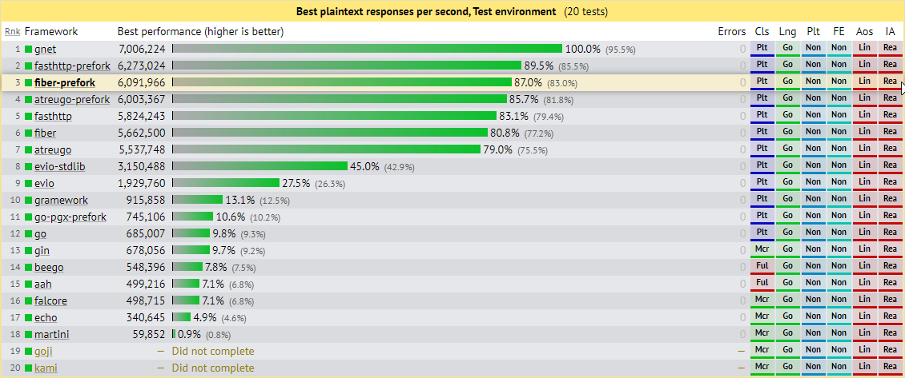

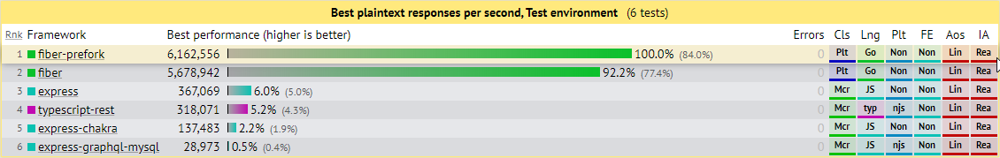

### Data Updates 数据更新 

**Fiber** handled **11,846** responses per second with an average latency of **42.8** ms.

​	光纤每秒处理 11,846 次响应，平均延迟为 42.8 毫秒。
**Express** handled **2,066** responses per second with an average latency of **390.44** ms.

​	Express 每秒处理 2,066 个响应，平均延迟为 390.44 毫秒。

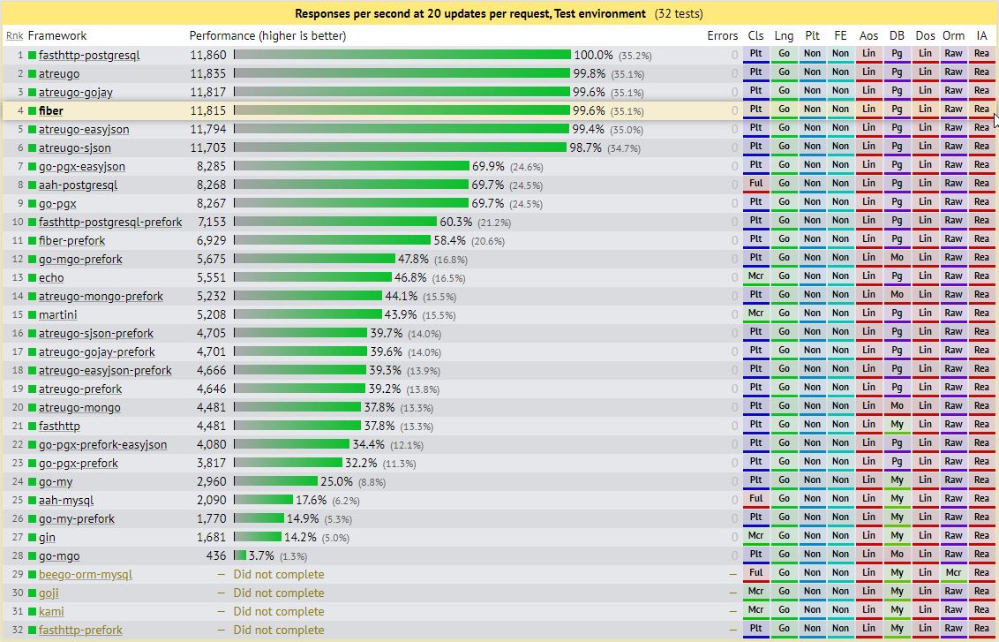

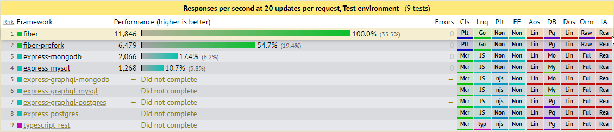

### Multiple Queries 多重查询 

**Fiber** handled **19,664** responses per second with an average latency of **25.7** ms.

​	Fiber 每秒处理 19,664 个响应，平均延迟为 25.7 毫秒。
**Express** handled **4,302** responses per second with an average latency of **117.2** ms.

​	Express 每秒处理 4,302 个响应，平均延迟为 117.2 毫秒。

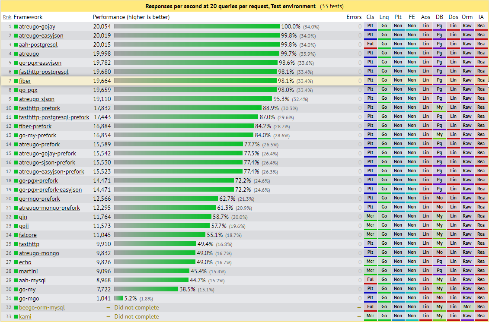

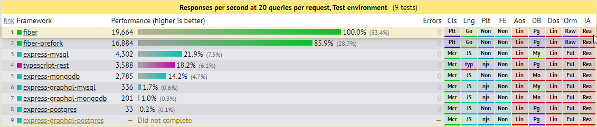

### Single Query 单一查询 

**Fiber** handled **368,647** responses per second with an average latency of **0.7** ms.

​	Fiber 每秒处理 368,647 个响应，平均延迟为 0.7 毫秒。
**Express** handled **57,880** responses per second with an average latency of **4.4** ms.

​	Express 每秒处理 57,880 个响应，平均延迟为 4.4 毫秒。

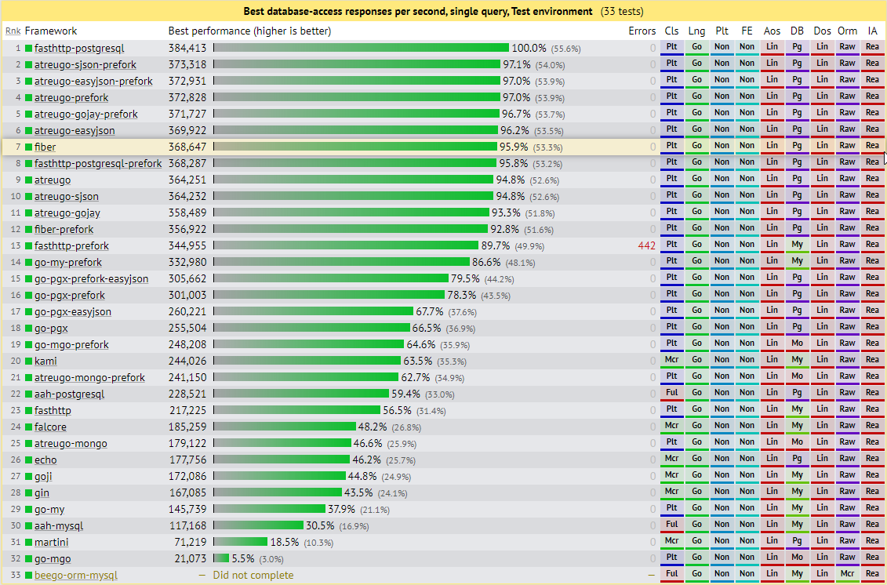

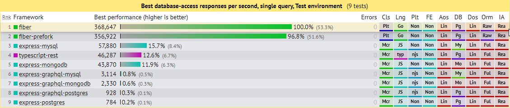

### JSON Serialization JSON 序列化 

**Fiber** handled **1,146,667** responses per second with an average latency of **0.4** ms.

​	Fiber 每秒处理 1,146,667 个响应，平均延迟为 0.4 毫秒。
**Express** handled **244,847** responses per second with an average latency of **1.1** ms.

​	Express 每秒处理 244,847 个响应，平均延迟为 1.1 毫秒。

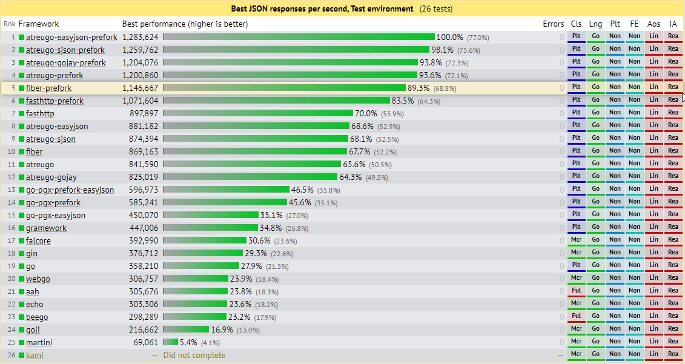

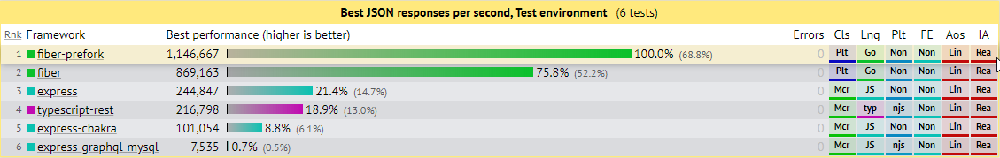

## Go web framework benchmark Go web 框架基准 

🔗 https://github.com/smallnest/go-web-framework-benchmark

- **CPU** Intel(R) Xeon(R) Gold 6140 CPU @ 2.30GHz
- **MEM** 4GB
  内存 4GB
- **GO** go1.13.6 linux/amd64
- **OS** Linux
  操作系统 Linux

The first test case is to mock **0 ms**, **10 ms**, **100 ms**, **500 ms** processing time in handlers.

​	第一个测试用例是在处理程序中模拟 0 毫秒、10 毫秒、100 毫秒、500 毫秒的处理时间。

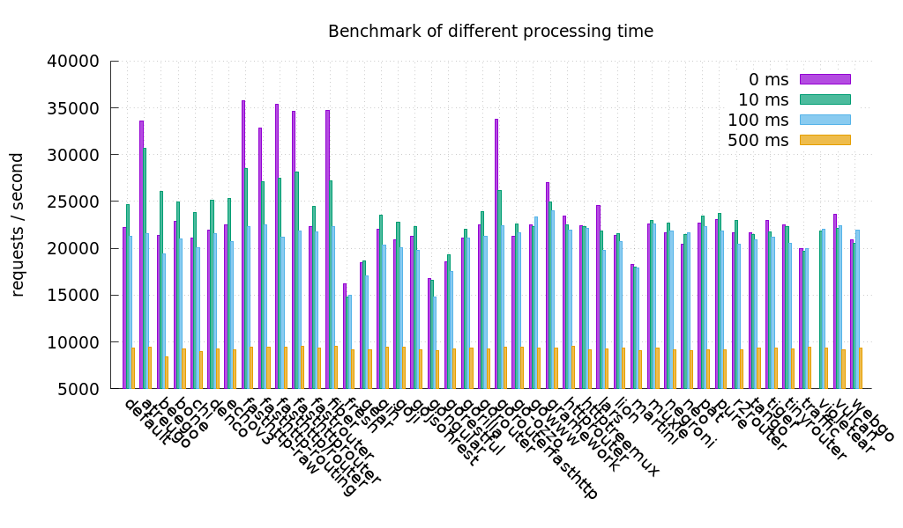

The concurrency clients are **5000**.

​	并发客户端为 5000。

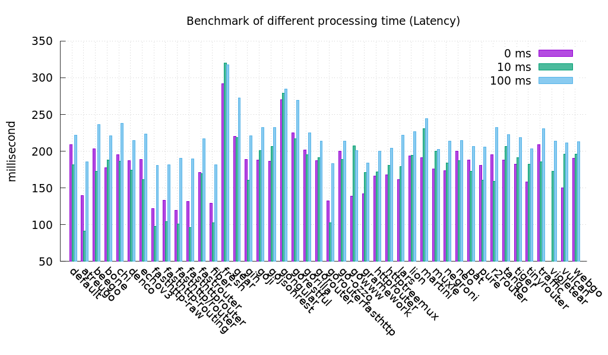

Latency is the time of real processing time by web servers. *The smaller is the better.*

​	延迟是 Web 服务器实际处理时间。越小越好。

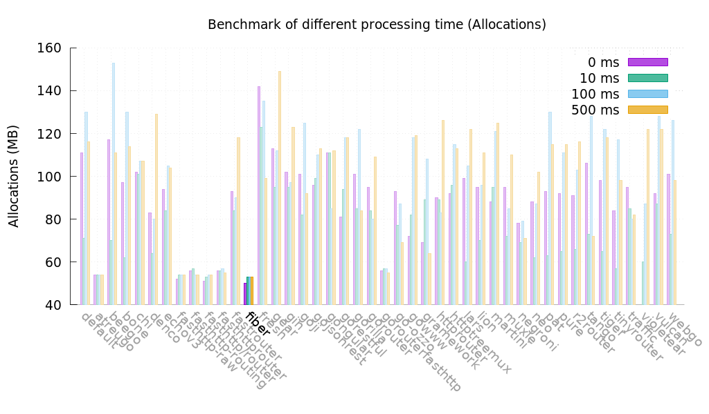

Allocs is the heap allocations by web servers when test is running. The unit is MB. *The smaller is the better.*

​	在测试运行时，Allocs 是 Web 服务器的堆分配。单位是 MB。越小越好。

If we enable **http pipelining**, test result as below:

​	如果我们启用 http 流水线，测试结果如下：

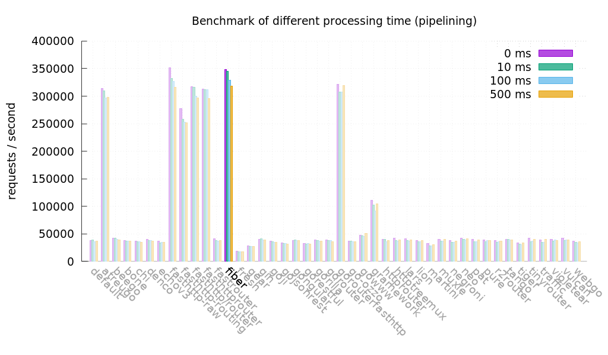

Concurrency test in **30 ms** processing time, the test result for **100**, **1000**, **5000** clients is:

​	在 30 毫秒处理时间内的并发测试，100、1000、5000 个客户端的测试结果为：

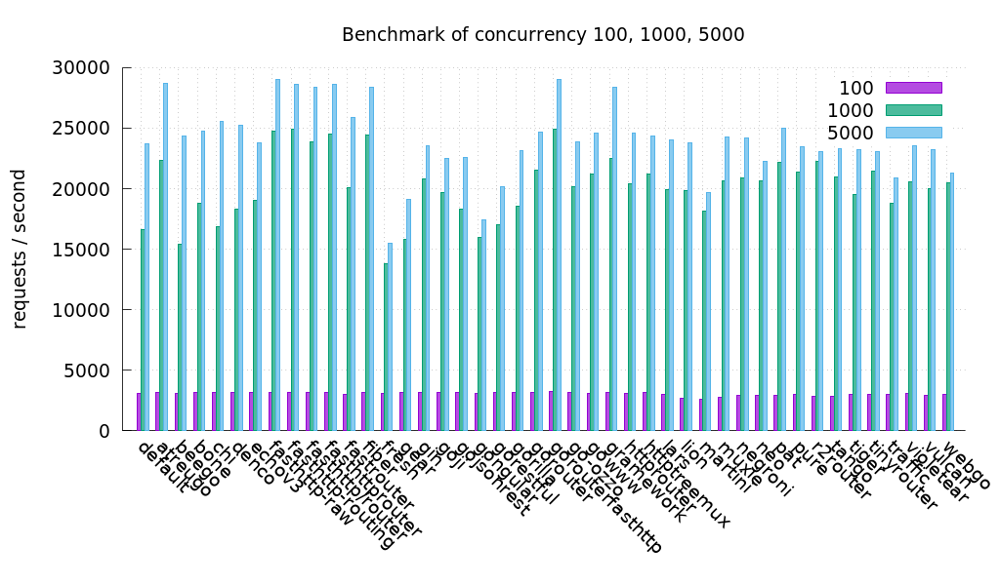

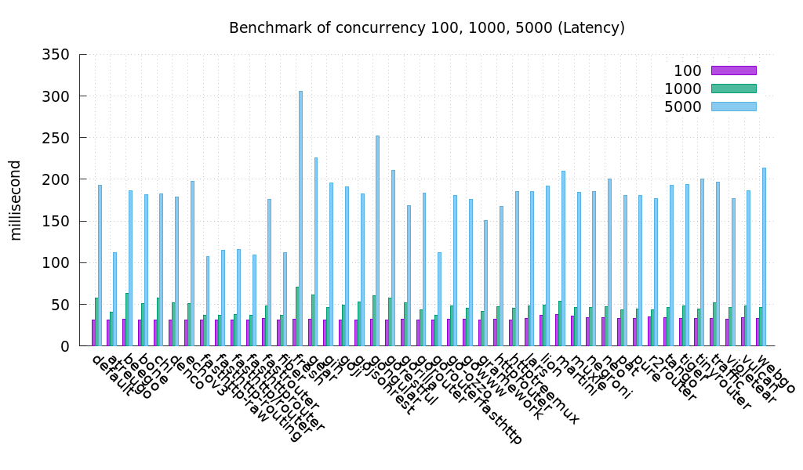

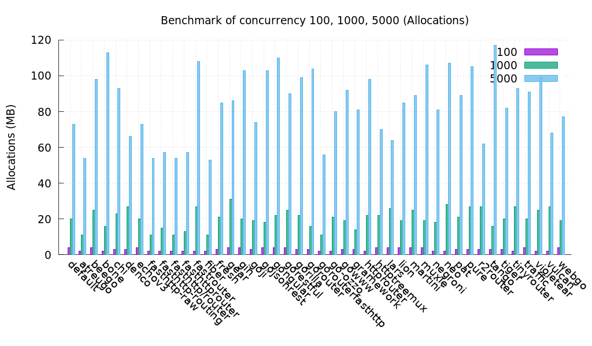

If we enable **http pipelining**, test result as below:

​	如果我们启用 http 管道，测试结果如下：

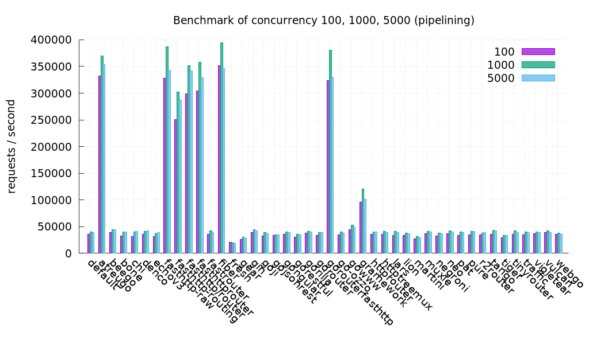

Dependency graph for `v1.9.0`

​	 `v1.9.0` 的依赖关系图

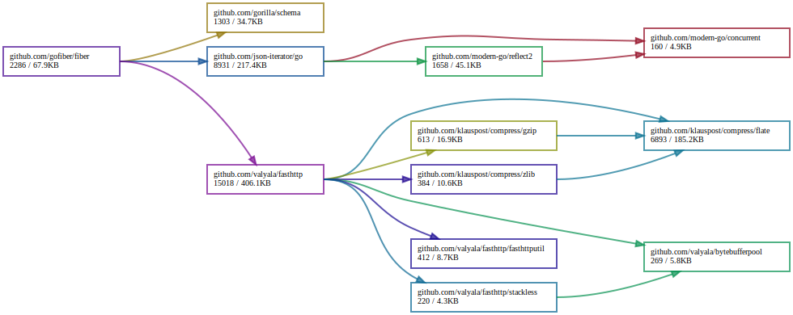
