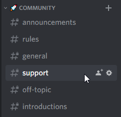

+++
title = "FAQ"
date = 2024-02-05T09:14:15+08:00
weight = 1
type = "docs"
description = ""
isCJKLanguage = true
draft = false
+++

> 原文： [https://docs.gofiber.io/extra/faq]()

# 🤔 FAQ

## How should I structure my application? 我应该如何构建我的应用程序？

There is no definitive answer to this question. The answer depends on the scale of your application and the team that is involved. To be as flexible as possible, Fiber makes no assumptions in terms of structure.

​	这个问题没有明确的答案。答案取决于应用程序的规模和参与的团队。为了尽可能灵活，Fiber 在结构方面没有任何假设。

Routes and other application-specific logic can live in as many files as you wish, in any directory structure you prefer. View the following examples for inspiration:

​	路由和其他特定于应用程序的逻辑可以存在于任意数量的文件中，您可以在任何您喜欢的目录结构中。查看以下示例以获取灵感：

- [gofiber/boilerplate](https://github.com/gofiber/boilerplate)
- [thomasvvugt/fiber-boilerplate](https://github.com/thomasvvugt/fiber-boilerplate)
- [Youtube - Building a REST API using Gorm and Fiber
  Youtube - 使用 Gorm 和 Fiber 构建 REST API](https://www.youtube.com/watch?v=Iq2qT0fRhAA)
- [embedmode/fiberseed](https://github.com/embedmode/fiberseed)

## How do I handle custom 404 responses? 如何处理自定义 404 响应？

If you're using v2.32.0 or later, all you need to do is to implement a custom error handler. See below, or see a more detailed explanation at [Error Handling]().

​	如果您使用的是 v2.32.0 或更高版本，您需要做的就是实现一个自定义错误处理程序。请参阅下文，或在错误处理中查看更详细的说明。

If you're using v2.31.0 or earlier, the error handler will not capture 404 errors. Instead, you need to add a middleware function at the very bottom of the stack (below all other functions) to handle a 404 response:

​	如果您使用的是 v2.31.0 或更低版本，错误处理程序将不会捕获 404 错误。相反，您需要在堆栈的底部（所有其他函数的下方）添加一个中间件函数来处理 404 响应：

Example
示例

```go
app.Use(func(c *fiber.Ctx) error {
    return c.Status(fiber.StatusNotFound).SendString("Sorry can't find that!")
})
```


## How can i use live reload ? 如何使用实时重新加载？

[Air](https://github.com/cosmtrek/air) is a handy tool that automatically restarts your Go applications whenever the source code changes, making your development process faster and more efficient.

​	Air 是一款便捷的工具，每当源代码发生更改时，它都会自动重新启动您的 Go 应用程序，从而使您的开发过程更快、更高效。

To use Air in a Fiber project, follow these steps:

​	要在 Fiber 项目中使用 Air，请按照以下步骤操作：

1. Install Air by downloading the appropriate binary for your operating system from the GitHub release page or by building the tool directly from source.
   从 GitHub 发布页面下载适用于您操作系统的相应二进制文件或直接从源代码构建该工具，以安装 Air。
2. Create a configuration file for Air in your project directory. This file can be named, for example, .air.toml or air.conf. Here's a sample configuration file that works with Fiber:
   在您的项目目录中为 Air 创建一个配置文件。此文件可以命名为 .air.toml 或 air.conf。以下是一个适用于 Fiber 的示例配置文件：

```toml
# .air.toml
root = "."
tmp_dir = "tmp"
[build]
  cmd = "go build -o ./tmp/main ."
  bin = "./tmp/main"
  delay = 1000 # ms
  exclude_dir = ["assets", "tmp", "vendor"]
  include_ext = ["go", "tpl", "tmpl", "html"]
  exclude_regex = ["_test\\.go"]
```


1. Start your Fiber application using Air by running the following command in the terminal:
   通过在终端中运行以下命令，使用 Air 启动您的 Fiber 应用程序：

```sh
air
```


As you make changes to your source code, Air will detect them and automatically restart the application.

​	随着您对源代码进行更改，Air 将检测到它们并自动重新启动应用程序。

A complete example demonstrating the use of Air with Fiber can be found in the [Fiber Recipes repository](https://github.com/gofiber/recipes/tree/master/air). This example shows how to configure and use Air in a Fiber project to create an efficient development environment.

​	可以在 Fiber Recipes 存储库中找到一个演示如何将 Air 与 Fiber 配合使用的完整示例。此示例展示了如何在 Fiber 项目中配置和使用 Air 以创建高效的开发环境。

## How do I set up an error handler? 如何设置错误处理程序？

To override the default error handler, you can override the default when providing a [Config]() when initiating a new [Fiber instance]().

​	要覆盖默认错误处理程序，您可以在启动新 Fiber 实例时提供 Config 时覆盖默认值。

Example
示例

```go
app := fiber.New(fiber.Config{
    ErrorHandler: func(c *fiber.Ctx, err error) error {
        return c.Status(fiber.StatusInternalServerError).SendString(err.Error())
    },
})
```


We have a dedicated page explaining how error handling works in Fiber, see [Error Handling]().

​	我们有一个专门的页面来解释 Fiber 中的错误处理方式，请参阅错误处理。

## Which template engines does Fiber support? Fiber 支持哪些模板引擎？

Fiber currently supports 9 template engines in our [gofiber/template](https://docs.gofiber.io/template/) middleware:

​	Fiber 目前在我们的 gofiber/template 中间件中支持 9 个模板引擎：

- [ace](https://docs.gofiber.io/template/ace/)
- [amber](https://docs.gofiber.io/template/amber/)
- [django](https://docs.gofiber.io/template/django/)
- [handlebars](https://docs.gofiber.io/template/handlebars)
- [html](https://docs.gofiber.io/template/html)
- [jet](https://docs.gofiber.io/template/jet)
- [mustache](https://docs.gofiber.io/template/mustache)
- [pug](https://docs.gofiber.io/template/pug)
- [slim](https://docs.gofiber.io/template/pug)

To learn more about using Templates in Fiber, see [Templates]().

​	要了解有关在 Fiber 中使用模板的更多信息，请参阅模板。

## Does Fiber have a community chat? Fiber 是否有社区聊天室？

Yes, we have our own [Discord ](https://gofiber.io/discord)server, where we hang out. We have different rooms for every subject.

​	是的，我们有自己的 Discord 服务器，我们经常在那里闲逛。我们为每个主题都有不同的房间。
If you have questions or just want to have a chat, feel free to join us via this **>** [**invite link**](https://gofiber.io/discord) **<**.

​	如果您有疑问或只是想聊天，请随时通过此 > 邀请链接< 加入我们。



## Does fiber support sub domain routing ? Fiber 是否支持子域路由？

Yes we do, here are some examples: This example works v2

​	是的，我们支持，这里有一些示例：此示例适用于 v2

```go
package main

import (
    "log"

    "github.com/gofiber/fiber/v2"
    "github.com/gofiber/fiber/v2/middleware/logger"
)

type Host struct {
    Fiber *fiber.App
}

func main() {
    // Hosts
    hosts := map[string]*Host{}
    //-----
    // API
    //-----
    api := fiber.New()
    api.Use(logger.New(logger.Config{
        Format: "[${ip}]:${port} ${status} - ${method} ${path}\n",
    }))
    hosts["api.localhost:3000"] = &Host{api}
    api.Get("/", func(c *fiber.Ctx) error {
        return c.SendString("API")
    })
    //------
    // Blog
    //------
    blog := fiber.New()
    blog.Use(logger.New(logger.Config{
        Format: "[${ip}]:${port} ${status} - ${method} ${path}\n",
    }))
    hosts["blog.localhost:3000"] = &Host{blog}
    blog.Get("/", func(c *fiber.Ctx) error {
        return c.SendString("Blog")
    })
    //---------
    // Website
    //---------
    site := fiber.New()
    site.Use(logger.New(logger.Config{
        Format: "[${ip}]:${port} ${status} - ${method} ${path}\n",
    }))

    hosts["localhost:3000"] = &Host{site}
    site.Get("/", func(c *fiber.Ctx) error {
        return c.SendString("Website")
    })
    // Server
    app := fiber.New()
    app.Use(func(c *fiber.Ctx) error {
        host := hosts[c.Hostname()]
        if host == nil {
            return c.SendStatus(fiber.StatusNotFound)
        } else {
            host.Fiber.Handler()(c.Context())
            return nil
        }
    })
    log.Fatal(app.Listen(":3000"))
}
```


If more information is needed, please refer to this issue [#750](https://github.com/gofiber/fiber/issues/750)

​	如果需要更多信息，请参阅此问题 #750
