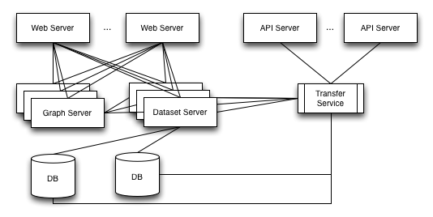

+++
title = "用 Go 构建StatHat"
weight = 2
date = 2023-05-18T17:03:08+08:00
type = "docs"
description = ""
isCJKLanguage = true
draft = false
+++

# Building StatHat with Go - 用 Go 构建StatHat

> 原文：[https://go.dev/blog/stathat](https://go.dev/blog/stathat)

Patrick Crosby
19 December 2011

## Introduction 简介

My name is Patrick Crosby and I’m the founder of a company called Numerotron. We recently released [StatHat](http://www.stathat.com/). This post is about why we chose to develop StatHat in [Go](https://go.dev/), including details about how we are using Go.

我叫Patrick Crosby，是一家名为Numerotron的公司的创始人。我们最近发布了StatHat。这篇文章是关于我们为什么选择用Go开发StatHat，包括我们如何使用Go的细节。

[StatHat](http://www.stathat.com/) is a tool to track statistics and events in your code. Everyone from HTML designers to backend engineers can use StatHat easily, as it supports sending stats from HTML, JavaScript, Go, and twelve other languages.

StatHat是一个用于跟踪代码中的统计数据和事件的工具。从HTML设计师到后端工程师都可以轻松使用StatHat，因为它支持从HTML、JavaScript、Go和其他12种语言中发送统计信息。

You send your numbers to StatHat; it generates beautiful, fully-embeddable graphs of your data. StatHat will alert you when specified triggers occur, send you daily email reports, and much more. So instead of spending time writing tracking or reporting tools for your application, you can concentrate on the code. While you do the real work, StatHat remains intensely vigilant, like an eagle in its mountaintop nest, or a babysitter on meth.

您向StatHat发送您的数字；它为您的数据生成漂亮的、可完全嵌入的图表。StatHat会在指定的触发器发生时提醒您，向您发送每日电子邮件报告，以及更多。因此，您不必花时间为您的应用程序编写跟踪或报告工具，而是可以集中精力编写代码。当您做真正的工作时，StatHat会保持高度的警惕，就像山顶上的老鹰，或者是吸食冰毒的保姆。

Here’s an example of a StatHat graph of the temperature in NYC, Chicago, and San Francisco:

下面是StatHat对纽约市、芝加哥和旧金山的温度图表的一个例子。

## Architecture Overview 架构概述

StatHat consists of two main services: incoming statistic/event API calls and the web application for viewing and analyzing stats. We wanted to keep these as separate as possible to isolate the data collection from the data interaction. We did this for many reasons, but one major reason is that we anticipate handling a ton of automated incoming API HTTP requests and would thus have different optimization strategies for the API service than a web application interacting with humans.

StatHat由两个主要服务组成：传入的统计/事件API调用和用于查看和分析统计的网络应用。我们希望将这些服务尽可能地分开，以便将数据收集与数据交互隔离开来。我们这样做有很多原因，但其中一个主要原因是我们预计会处理大量自动传入的API HTTP请求，因此对API服务的优化策略与与人互动的Web应用不同。

The web application service is multi-tiered. The web server processes all requests and sends them to an interactor layer. For simple tasks, the interactor will handle generating any necessary data. For complex tasks, the interactor relies on multiple application servers to handle tasks like generating graphs or analyzing data sets. After the interactor is finished, the web server sends the result to a presenter. The presenter responds to the HTTP request with either HTML or JSON. We can horizontally scale the web, API, application servers, and databases as the demand for services grows and changes over time. There is no single point of failure as each application server has multiple copies running. The interactor layer allows us to have different interfaces to the system: http, command line, automated tests, mobile API. StatHat uses MySQL for data storage.

网络应用程序服务是多层次的。网络服务器处理所有的请求并将它们发送到交互器层。对于简单的任务，交互器将处理生成任何必要的数据。对于复杂的任务，交互器依靠多个应用服务器来处理生成图形或分析数据集等任务。在交互器完成后，网络服务器将结果发送给演示者。演示器用HTML或JSON对HTTP请求做出响应。随着服务需求的增长和变化，我们可以横向扩展网络、API、应用服务器和数据库。没有单点故障，因为每个应用服务器有多个副本在运行。交互器层允许我们对系统有不同的接口：http、命令行、自动测试、移动API。StatHat使用MySQL进行数据存储。

## Choosing Go 选择Go

When we designed StatHat, we had the following check list for our development tools:

当我们设计StatHat时，我们对开发工具有以下检查清单。

- same programming language for backend and frontend systems 后台和前台系统使用相同的编程语言
- good, fast HTML templating system 良好、快速的HTML模板系统
- fast start-up, recompilation, testing for lots of tinkering 快速启动、重新编译、测试，以便进行大量修补工作
- lots of connections on one machine  在一台机器上有大量的连接
- language tools for handling application-level concurrency 用于处理应用级并发的语言工具
- good performance 良好的性能
- robust RPC layer to talk between tiers 健全的RPC层，在各层之间进行对话
- lots of libraries 大量的库
- open source 开放源代码

We evaluated many popular and not-so-popular web technologies and ended up choosing to develop it in Go.

我们评估了许多流行的和不太流行的网络技术，最后选择用Go开发。

When Go was released in November 2009, I immediately installed it and loved the fast compilation times, goroutines, channels, garbage collection, and all the packages that were available. I was especially pleased with how few lines of code my applications were using. I soon experimented with making a web app called [Langalot](http://langalot.com/) that concurrently searched through five foreign language dictionaries as you typed in a query. It was blazingly fast. I put it online and it’s been running since February, 2010.

当Go在2009年11月发布时，我立即安装了它，并喜欢它的快速编译时间、goroutines、通道、垃圾收集以及所有可用的包。我对我的应用程序所使用的代码行数之少感到特别高兴。我很快就尝试着做了一个叫Langalot的网络应用，当您输入查询时，它可以同时搜索五个外语词典。它的速度快得惊人。我把它放在网上，从2010年2月开始运行。

The following sections detail how Go meets StatHat’s requirements and our experience using Go to solve our problems.

下文将详细介绍 Go 如何满足 StatHat 的要求，以及我们使用 Go 解决问题的经验。

## Runtime 运行时间

We use the standard Go [http package](https://go.dev/pkg/http/) for our API and web app servers. All requests first go through Nginx and any non-file requests are proxied to the Go-powered http servers. The backend servers are all written in Go and use the [rpc package](https://go.dev/pkg/rpc/) to communicate with the frontend.

我们的 API 和 Web 应用程序服务器使用标准的 Go http 包。所有的请求首先经过Nginx，任何非文件请求都被代理到由Go驱动的http服务器。后台服务器都是用Go编写的，并使用rpc包与前台通信。

## Templating 模板化

We built a template system using the standard [template package](https://go.dev/pkg/template/). Our system adds layouts, some common formatting functions, and the ability to recompile templates on-the-fly during development. We are very pleased with the performance and functionality of the Go templates.

我们使用标准的模板包建立了一个模板系统。我们的系统增加了布局、一些常用的格式化功能，以及在开发过程中即时重新编译模板的能力。我们对Go模板的性能和功能非常满意。

## Tinkering 修修补补

In a previous job, I worked on a video game called Throne of Darkness that was written in C++. We had a few header files that, when modified, required a full rebuild of the entire system, 20-30 minutes long. If anyone ever changed `Character.h`, he would be subject to the wrath of every other programmer. Besides this suffering, it also slowed down development time significantly.

在以前的工作中，我参与了一个用C++编写的名为《黑暗王座》的视频游戏。我们有几个头文件，一旦修改，就需要对整个系统进行全面重建，时间长达二三十分钟。如果有人修改了Character.h，他就会受到其他所有程序员的愤怒。除了这种痛苦，它还大大减慢了开发时间。

Since then, I’ve always tried to choose technologies that allowed fast, frequent tinkering. With Go, compilation time is a non-issue. We can recompile the entire system in seconds, not minutes. The development web server starts instantly, tests complete in a few seconds. As mentioned previously, templates are recompiled as they change. The result is that the StatHat system is very easy to work with, and the compiler is not a bottleneck.

从那时起，我就一直试图选择那些允许快速、频繁修补的技术。有了Go，编译时间就不是问题了。我们可以在几秒钟内重新编译整个系统，而不是几分钟。开发网络服务器立即启动，测试在几秒钟内完成。如前所述，模板在变化时也会被重新编译。结果是StatHat系统非常容易操作，而且编译器不是一个瓶颈。

## RPC

Since StatHat is a multi-tiered system, we wanted an RPC layer so that all communication was standard. With Go, we are using the [rpc package](https://go.dev/pkg/rpc/) and the [gob package](https://go.dev/pkg/gob/) for encoding Go objects. In Go, the RPC server just takes any Go object and registers its exported methods. There is no need for an intermediary interface description language. We’ve found it very easy to use and many of our core application servers are under 300 lines of code.

由于StatHat是一个多层系统，我们希望有一个RPC层，这样所有的通信都是标准的。通过Go，我们使用rpc包和gob包对Go对象进行编码。在Go中，RPC服务器只需接收任何Go对象并注册其导出的方法。没有必要使用中间的接口描述语言。我们发现它非常容易使用，我们的许多核心应用服务器的代码都在300行以下。

## Libraries

We don’t want to spend time rewriting libraries for things like SSL, database drivers, JSON/XML parsers. Although Go is a young language, it has a lot of system packages and a growing number of user-contributed packages. With only a few exceptions, we have found Go packages for everything we have needed.

我们不想花时间为SSL、数据库驱动、JSON/XML解析器等重写库。虽然Go是一种年轻的语言，但它有很多系统包和越来越多的用户贡献的包。除了少数例外，我们已经为我们所需要的一切找到了Go软件包。

## Open source 开放源代码

In our experience, it has been invaluable to work with open source tools. If something is going awry, it is immensely helpful to be able to examine the source through every layer and not have any black boxes. Having the code for the language, web server, packages, and tools allows us to understand how every piece of the system works. Everything in Go is open source. In the Go codebase, we frequently read the tests as they often give great examples of how to use packages and language features.

根据我们的经验，与开源工具一起工作是非常有价值的。如果有什么问题，能够通过每一层来检查源码，而不是有任何黑盒子，这是非常有帮助的。拥有语言、网络服务器、软件包和工具的代码使我们能够了解系统的每一部分是如何工作的。Go中的所有东西都是开源的。在Go代码库中，我们经常阅读测试，因为它们经常给出如何使用包和语言功能的很好的例子。

## Performance 性能

People rely on StatHat for up to the minute analysis of their data and we need the system to be as responsive as possible. In our tests, Go’s performance blew away most of the competition. We tested it against Rails, Sinatra, OpenResty, and Node. StatHat has always monitored itself by tracking all kinds of performance metrics about requests, the duration of certain tasks, the amount of memory in use. Because of this, we were able to easily evaluate different technologies. We’ve also taken advantage of the benchmark performance testing features of the Go testing package.

人们依靠StatHat对他们的数据进行最新的分析，我们需要系统尽可能的反应迅速。在我们的测试中，Go 的性能超越了大多数的竞争对手。我们将其与Rails、Sinatra、OpenResty和Node进行了测试。StatHat一直通过跟踪各种性能指标来监控自己，包括请求、某些任务的持续时间、使用的内存量。正因为如此，我们能够轻松地评估不同的技术。我们还利用了Go测试包的基准性能测试功能。

## Application-Level Concurrency 应用程序级别的并发性

In a former life, I was the CTO at OkCupid. My experience there using OKWS taught me the importance of async programming, especially when it comes to dynamic web applications. There is no reason you should ever do something like this synchronously: load a user from the database, then find their stats, then find their alerts. These should all be done concurrently, yet surprisingly, many popular frameworks have no async support. Go supports this at the language level without any callback spaghetti. StatHat uses goroutines extensively to run multiple functions concurrently and channels for sharing data between goroutines.

在以前的生活中，我是OkCupid的CTO。我在那里使用OKWS的经验告诉我异步编程的重要性，特别是当涉及到动态网络应用时。您没有理由同步地做这样的事情：从数据库中加载一个用户，然后找到他们的统计信息，然后找到他们的警报。这些都应该是并发进行的，然而令人惊讶的是，许多流行的框架都没有异步支持。Go在语言层面上支持这一点，没有任何回调的花边。StatHat广泛使用goroutines来同时运行多个函数，并在goroutines之间共享数据的通道。

## Hosting and Deployment 托管和部署

StatHat runs on Amazon’s EC2 servers. Our servers are divided into several types:

StatHat在亚马逊的EC2服务器上运行。我们的服务器分为几种类型。

- API
- Web
- Application servers
- Database

There are at least two of each type of server, and they are in different zones for high availability. Adding a new server to the mix takes just a couple of minutes.

每种类型的服务器至少有两台，而且它们位于不同的区域，以实现高可用性。添加一个新的服务器到这个组合中只需要几分钟的时间。

To deploy, we first build the entire system into a time-stamped directory. Our packaging script builds the Go applications, compresses the CSS and JS files, and copies all the scripts and configuration files. This directory is then distributed to all the servers, so they all have an identical distribution. A script on each server queries its EC2 tags and determines what it is responsible for running and starts/stops/restarts any services. We frequently only deploy to a subset of the servers.

为了进行部署，我们首先将整个系统构建到一个有时间戳的目录中。我们的打包脚本构建Go应用程序，压缩CSS和JS文件，并复制所有的脚本和配置文件。然后，这个目录被分发到所有的服务器上，因此它们都有一个相同的分布。每台服务器上的脚本查询其EC2标签，并确定其负责运行的内容，并启动/停止/重启任何服务。我们经常只部署到服务器的一个子集。

## More 更多

For more information on StatHat, please visit [stathat.com](http://www.stathat.com/). We are releasing some of the Go code we’ve written. Go to [www.stathat.com/src](http://www.stathat.com/src) for all of the open source StatHat projects.

关于StatHat的更多信息，请访问stathat.com。我们正在发布我们编写的一些Go代码。请到www.stathat.com/src，了解所有开源的StatHat项目。

To learn more about Go, visit [golang.org](https://go.dev/).

要了解更多关于Go的信息，请访问golang.org。
