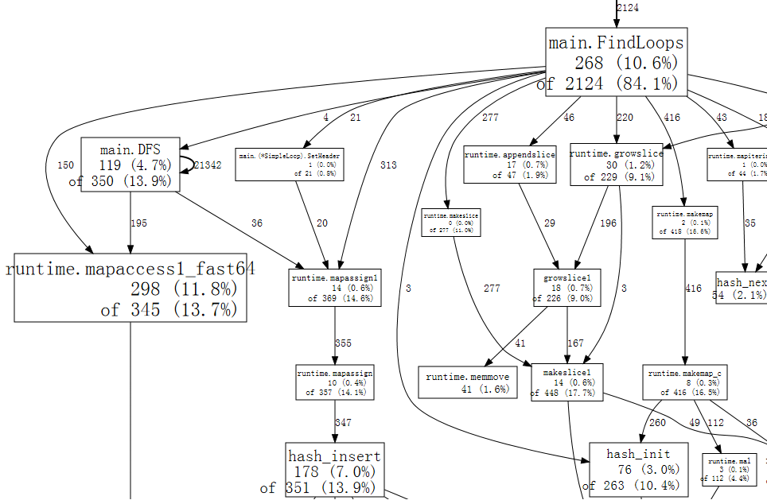
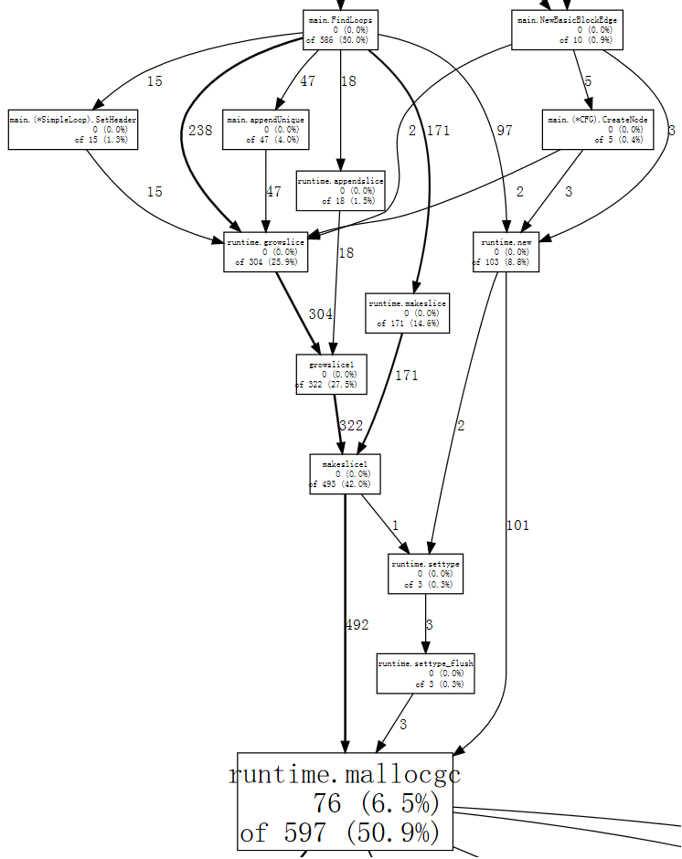

+++
title = "分析 go  程序"
weight = 17
date = 2023-05-18T17:03:08+08:00
type = "docs"
description = ""
isCJKLanguage = true
draft = false

+++

# Profiling Go Programs - 分析 go  程序

Russ Cox, July 2011; updated by Shenghou Ma, May 2013
24 June 2011

Russ Cox，2011年7月；Shenghou Ma更新，2013年5月 2011年6月24日

At Scala Days 2011, Robert Hundt presented a paper titled [Loop Recognition in C++/Java/Go/Scala.](http://research.google.com/pubs/pub37122.html) The paper implemented a specific loop finding algorithm, such as you might use in a flow analysis pass of a compiler, in C++, Go, Java, Scala, and then used those programs to draw conclusions about typical performance concerns in these languages. The Go program presented in that paper runs quite slowly, making it an excellent opportunity to demonstrate how to use Go’s profiling tools to take a slow program and make it faster.

​	在2011年的Scala Days上，Robert Hundt发表了一篇名为《在C++/Java/Go/Scala中进行循环识别》的论文。该论文实现了一种特定的循环查找算法，类似于编译器中流分析阶段可能使用的算法，使用了C++、Go、Java、Scala编程语言，然后利用这些程序得出了关于这些语言中典型性能问题的结论。在该论文中展示的Go程序运行速度相当慢，这为演示如何使用Go的分析工具来优化慢速程序提供了绝佳的机会。

*By using Go’s profiling tools to identify and correct specific bottlenecks, we can make the Go loop finding program run an order of magnitude faster and use 6x less memory.* (Update: Due to recent optimizations of `libstdc++` in `gcc`, the memory reduction is now 3.7x.)

​	*通过使用Go的分析工具来识别和纠正特定的瓶颈，我们可以使Go循环查找程序的运行速度提高一个数量级，并且内存使用减少了6倍。*（更新：由于`gcc`中`libstdc++`的最新优化，内存减少现在是3.7倍。）

Hundt’s paper does not specify which versions of the C++, Go, Java, and Scala tools he used. In this blog post, we will be using the most recent weekly snapshot of the `6g` Go compiler and the version of `g++` that ships with the Ubuntu Natty distribution. (We will not be using Java or Scala, because we are not skilled at writing efficient programs in either of those languages, so the comparison would be unfair. Since C++ was the fastest language in the paper, the comparisons here with C++ should suffice.) (Update: In this updated post, we will be using the most recent development snapshot of the Go compiler on amd64 and the most recent version of `g++` – 4.8.0, which was released in March 2013.)

​	Hundt的论文没有指定他使用的C++、Go、Java和Scala工具的版本。在这篇博文中，我们将使用最新的`6g` Go编译器的每周快照以及随Ubuntu Natty分发的`g++`版本。（我们不会使用Java或Scala，因为我们在这两种语言中都不擅长编写高效的程序，所以比较将是不公平的。由于C++在论文中是最快的语言，这里与C++的比较应该足够。）（更新：在这篇更新的博文中，我们将使用amd64架构上最新的Go编译器开发快照和最新的`g++`版本-4.8.0，该版本于2013年3月发布。）

```bash
$ go version
go version devel +08d20469cc20 Tue Mar 26 08:27:18 2013 +0100 linux/amd64
$ g++ --version
g++ (GCC) 4.8.0
Copyright (C) 2013 Free Software Foundation, Inc.
...
$
```

The programs are run on a computer with a 3.4GHz Core i7-2600 CPU and 16 GB of RAM running Gentoo Linux’s 3.8.4-gentoo kernel. The machine is running with CPU frequency scaling disabled via

​	这些程序在一台配备3.4GHz的Core i7-2600 CPU和16GB内存的计算机上运行，该计算机运行Gentoo Linux的3.8.4-gentoo内核。该机器通过以下方式禁用了CPU频率缩放：

```bash
$ sudo bash
# for i in /sys/devices/system/cpu/cpu[0-7]
do
    echo performance > $i/cpufreq/scaling_governor
done
#
```

We’ve taken [Hundt’s benchmark programs](https://github.com/hundt98847/multi-language-bench) in C++ and Go, combined each into a single source file, and removed all but one line of output. We’ll time the program using Linux’s `time` utility with a format that shows user time, system time, real time, and maximum memory usage:

​	我们使用了[Hundt的基准程序](https://github.com/hundt98847/multi-language-bench)中的C++和Go版本，将它们合并为一个单一的源文件，并只保留了一行输出。我们将使用Linux的`time`实用程序来计时程序运行时间，并使用一个格式显示用户时间、系统时间、实际时间和最大内存使用：

```bash
$ cat xtime
#!/bin/sh
/usr/bin/time -f '%Uu %Ss %er %MkB %C' "$@"
$

$ make havlak1cc
g++ -O3 -o havlak1cc havlak1.cc
$ ./xtime ./havlak1cc
# of loops: 76002 (total 3800100)
loop-0, nest: 0, depth: 0
17.70u 0.05s 17.80r 715472kB ./havlak1cc
$

$ make havlak1
go build havlak1.go
$ ./xtime ./havlak1
# of loops: 76000 (including 1 artificial root node)
25.05u 0.11s 25.20r 1334032kB ./havlak1
$
```

The C++ program runs in 17.80 seconds and uses 700 MB of memory. The Go program runs in 25.20 seconds and uses 1302 MB of memory. (These measurements are difficult to reconcile with the ones in the paper, but the point of this post is to explore how to use `go tool pprof`, not to reproduce the results from the paper.)

​	C++程序运行时间为17.80秒，内存使用为700 MB。Go程序运行时间为25.20秒，内存使用为1302 MB。（这些测量结果与论文中的测量结果难以对应，但本文的重点是探索如何使用`go tool pprof`，而不是复制论文中的结果。）

To start tuning the Go program, we have to enable profiling. If the code used the [Go testing package](https://go.dev/pkg/testing/)’s benchmarking support, we could use gotest’s standard `-cpuprofile` and `-memprofile` flags. In a standalone program like this one, we have to import `runtime/pprof` and add a few lines of code:

​	要开始优化Go程序，我们必须启用分析。如果代码使用了[Go测试包](https://go.dev/pkg/testing/)的基准支持，我们可以使用gotest的标准`-cpuprofile`和`-memprofile`标志。在像这样的独立程序中，我们必须导入`runtime/pprof`并添加几行代码：

```go
var cpuprofile = flag.String("cpuprofile", "", "write cpu profile to file")

func main() {
    flag.Parse()
    if *cpuprofile != "" {
        f, err := os.Create(*cpuprofile)
        if err != nil {
            log.Fatal(err)
        }
        pprof.StartCPUProfile(f)
        defer pprof.StopCPUProfile()
    }
    ...
```

The new code defines a flag named `cpuprofile`, calls the [Go flag library](https://go.dev/pkg/flag/) to parse the command line flags, and then, if the `cpuprofile` flag has been set on the command line, [starts CPU profiling](https://go.dev/pkg/runtime/pprof/#StartCPUProfile) redirected to that file. The profiler requires a final call to [`StopCPUProfile`](https://go.dev/pkg/runtime/pprof/#StopCPUProfile) to flush any pending writes to the file before the program exits; we use `defer` to make sure this happens as `main` returns.

​	新代码定义了一个名为`cpuprofile`的标志，调用[Go标志库](https://go.dev/pkg/flag/)来解析命令行标志，然后，如果命令行上设置了`cpuprofile`标志，就将[开始CPU分析](https://go.dev/pkg/runtime/pprof/#StartCPUProfile)重定向到该文件。分析器需要在程序退出之前通过最终调用[`StopCPUProfile`](https://go.dev/pkg/runtime/pprof/#StopCPUProfile)来刷新任何待写入的文件。我们使用`defer`来确保这在`main`返回时发生。

After adding that code, we can run the program with the new `-cpuprofile` flag and then run `go tool pprof` to interpret the profile.

​	在添加了该代码后，我们可以使用新的`-cpuprofile`标志运行程序，然后运行`go tool pprof`来解释分析结果。

```bash
$ make havlak1.prof
./havlak1 -cpuprofile=havlak1.prof
# of loops: 76000 (including 1 artificial root node)
$ go tool pprof havlak1 havlak1.prof
Welcome to pprof!  For help, type 'help'.
(pprof)
```

The `go tool pprof` program is a slight variant of [Google’s `pprof` C++ profiler](https://github.com/gperftools/gperftools). The most important command is `topN`, which shows the top `N` samples in the profile:

​	`go tool pprof`程序是[Google的`pprof` C++分析器](https://github.com/gperftools/gperftools)的一个变种。最重要的命令是`topN`，它显示分析中前`N`个样本：

```bash
(pprof) top10
Total: 2525 samples
     298  11.8%  11.8%      345  13.7% runtime.mapaccess1_fast64
     268  10.6%  22.4%     2124  84.1% main.FindLoops
     251   9.9%  32.4%      451  17.9% scanblock
     178   7.0%  39.4%      351  13.9% hash_insert
     131   5.2%  44.6%      158   6.3% sweepspan
     119   4.7%  49.3%      350  13.9% main.DFS
      96   3.8%  53.1%       98   3.9% flushptrbuf
      95   3.8%  56.9%       95   3.8% runtime.aeshash64
      95   3.8%  60.6%      101   4.0% runtime.settype_flush
      88   3.5%  64.1%      988  39.1% runtime.mallocgc
```

When CPU profiling is enabled, the Go program stops about 100 times per second and records a sample consisting of the program counters on the currently executing goroutine’s stack. The profile has 2525 samples, so it was running for a bit over 25 seconds. In the `go tool pprof` output, there is a row for each function that appeared in a sample. The first two columns show the number of samples in which the function was running (as opposed to waiting for a called function to return), as a raw count and as a percentage of total samples. The `runtime.mapaccess1_fast64` function was running during 298 samples, or 11.8%. The `top10` output is sorted by this sample count. The third column shows the running total during the listing: the first three rows account for 32.4% of the samples. The fourth and fifth columns show the number of samples in which the function appeared (either running or waiting for a called function to return). The `main.FindLoops` function was running in 10.6% of the samples, but it was on the call stack (it or functions it called were running) in 84.1% of the samples.

​	当启用CPU分析时，Go程序大约每秒停止约100次，并记录了当前正在执行的goroutine栈上的程序计数器的样本。分析中有2525个样本，所以它运行了25秒左右。`go tool pprof`输出中的每一行都对应于样本中出现的每个函数。前两列显示函数在其中运行的样本数（与等待调用函数返回的样本数相对应），作为原始计数和总样本的百分比。`runtime.mapaccess1_fast64`函数在298个样本中运行，占总样本数的11.8%。`top10`输出按此样本计数进行排序。第三列显示在列表中的累计运行总数：前三行占总样本的32.4%。第四和第五列显示函数出现的样本数（无论是在运行还是在等待调用函数返回时）。`main.FindLoops`函数在10.6%的样本中运行，但在84.1%的样本中它在调用栈中（它或它调用的函数在运行）。

To sort by the fourth and fifth columns, use the `-cum` (for cumulative) flag:

​	要按照第四和第五列进行排序，请使用`-cum`（用于cumulative的缩写）标志：

```bash
(pprof) top5 -cum
Total: 2525 samples
       0   0.0%   0.0%     2144  84.9% gosched0
       0   0.0%   0.0%     2144  84.9% main.main
       0   0.0%   0.0%     2144  84.9% runtime.main
       0   0.0%   0.0%     2124  84.1% main.FindHavlakLoops
     268  10.6%  10.6%     2124  84.1% main.FindLoops
(pprof) top5 -cum
```

In fact the total for `main.FindLoops` and `main.main` should have been 100%, but each stack sample only includes the bottom 100 stack frames; during about a quarter of the samples, the recursive `main.DFS` function was more than 100 frames deeper than `main.main` so the complete trace was truncated.

​	事实上，`main.FindLoops`和`main.main`的总和应该是100%，但每个栈样本仅包含底部的100个栈帧；在大约四分之一的样本中，递归的`main.DFS`函数的深度超过`main.main`，因此完整的跟踪被截断。

The stack trace samples contain more interesting data about function call relationships than the text listings can show. The `web` command writes a graph of the profile data in SVG format and opens it in a web browser. (There is also a `gv` command that writes PostScript and opens it in Ghostview. For either command, you need [graphviz](http://www.graphviz.org/) installed.)

​	栈跟踪样本包含有关函数调用关系的比文本列表更有趣的数据。`web`命令会以SVG格式编写分析数据的图形，并在Web浏览器中打开它。（还有一个`gv`命令，它以PostScript格式编写图形，并在Ghostview中打开它。无论哪个命令，都需要安装[graphviz](http://www.graphviz.org/)。）

```bash
(pprof) web
```

A small fragment of [the full graph](https://rawgit.com/rsc/benchgraffiti/master/havlak/havlak1.svg) looks like:

​	[完整图的一个小片段](https://rawgit.com/rsc/benchgraffiti/master/havlak/havlak1.svg)如下所示：



Each box in the graph corresponds to a single function, and the boxes are sized according to the number of samples in which the function was running. An edge from box X to box Y indicates that X calls Y; the number along the edge is the number of times that call appears in a sample. If a call appears multiple times in a single sample, such as during recursive function calls, each appearance counts toward the edge weight. That explains the 21342 on the self-edge from `main.DFS` to itself.

​	图中的每个方框对应一个单独的函数，方框的大小取决于运行该函数的样本数。从方框X到方框Y的边表示X调用Y；边上的数字表示该调用在样本中出现的次数。如果单个样本中出现多次调用（例如在递归函数调用期间），每次出现都会计入边的权重。这就解释了从`main.DFS`到其自身的自循环边上的21342。

Just at a glance, we can see that the program spends much of its time in hash operations, which correspond to use of Go’s `map` values. We can tell `web` to use only samples that include a specific function, such as `runtime.mapaccess1_fast64`, which clears some of the noise from the graph:

​	仅从一瞥之间，我们就可以看到程序大部分时间都花在哈希操作上，这对应于使用Go的`map`值。我们可以告诉`web`只使用包含特定函数的样本，例如`runtime.mapaccess1_fast64`，这将从图中清除一些噪声：

```bash
(pprof) web mapaccess1
```


If we squint, we can see that the calls to `runtime.mapaccess1_fast64` are being made by `main.FindLoops` and `main.DFS`.

​	如果我们眯着眼睛看，就可以看到`runtime.mapaccess1_fast64`的调用是由`main.FindLoops`和`main.DFS`发起的。

Now that we have a rough idea of the big picture, it’s time to zoom in on a particular function. Let’s look at `main.DFS` first, just because it is a shorter function:

​	既然我们对整体情况有了一个大致的了解，现在是时候放大到特定的函数上了。让我们首先查看`main.DFS`，只是因为这是一个比较短的函数：

```bash
(pprof) list DFS
Total: 2525 samples
ROUTINE ====================== main.DFS in /home/rsc/g/benchgraffiti/havlak/havlak1.go
   119    697 Total samples (flat / cumulative)
     3      3  240: func DFS(currentNode *BasicBlock, nodes []*UnionFindNode, number map[*BasicBlock]int, last []int, current int) int {
     1      1  241:     nodes[current].Init(currentNode, current)
     1     37  242:     number[currentNode] = current
     .      .  243:
     1      1  244:     lastid := current
    89     89  245:     for _, target := range currentNode.OutEdges {
     9    152  246:             if number[target] == unvisited {
     7    354  247:                     lastid = DFS(target, nodes, number, last, lastid+1)
     .      .  248:             }
     .      .  249:     }
     7     59  250:     last[number[currentNode]] = lastid
     1      1  251:     return lastid
(pprof)
```

The listing shows the source code for the `DFS` function (really, for every function matching the regular expression `DFS`). The first three columns are the number of samples taken while running that line, the number of samples taken while running that line or in code called from that line, and the line number in the file. The related command `disasm` shows a disassembly of the function instead of a source listing; when there are enough samples this can help you see which instructions are expensive. The `weblist` command mixes the two modes: it shows [a source listing in which clicking a line shows the disassembly](https://rawgit.com/rsc/benchgraffiti/master/havlak/havlak1.html).

​	列表显示了`DFS`函数的源代码（实际上是匹配正则表达式`DFS`的每个函数的源代码）。前三列是在运行该行时采样的次数，以及在运行该行或从该行调用的代码中采样的次数，以及文件中的行号。相关命令`disasm`显示函数的反汇编，而不是源代码列表；当有足够的样本时，这可以帮助您看到哪些指令是昂贵的。`weblist`命令混合了这两种模式：它显示[源代码列表，点击其中一行会显示反汇编](https://rawgit.com/rsc/benchgraffiti/master/havlak/havlak1.html)。

Since we already know that the time is going into map lookups implemented by the hash runtime functions, we care most about the second column. A large fraction of time is spent in recursive calls to `DFS` (line 247), as would be expected from a recursive traversal. Excluding the recursion, it looks like the time is going into the accesses to the `number` map on lines 242, 246, and 250. For that particular lookup, a map is not the most efficient choice. Just as they would be in a compiler, the basic block structures have unique sequence numbers assigned to them. Instead of using a `map[*BasicBlock]int` we can use a `[]int`, a slice indexed by the block number. There’s no reason to use a map when an array or slice will do.

​	由于我们已经知道时间花在了由哈希运行时函数实现的映射查找中，我们最关心的是第二列。很大一部分时间花在了对`DFS`的递归调用上（第247行），这在递归遍历中是预期的。不包括递归，看起来时间花在了对`number`映射的访问上（242、246和250行）。对于这种特定的查找，使用映射并不是最高效的选择。与编译器一样，基本块结构具有分配给它们的唯一序列号。在这种情况下，我们可以使用`[]int`，即由块编号索引的切片。当存在数组或切片时，没有理由使用映射。

Changing `number` from a map to a slice requires editing seven lines in the program and cut its run time by nearly a factor of two:

​	通过将`number`从映射更改为切片，需要编辑程序中的七行代码，将其运行时间减少了近一半的时间：

```bash
$ make havlak2
go build havlak2.go
$ ./xtime ./havlak2
# of loops: 76000 (including 1 artificial root node)
16.55u 0.11s 16.69r 1321008kB ./havlak2
$
```

(See the [diff between `havlak1` and `havlak2`](https://github.com/rsc/benchgraffiti/commit/58ac27bcac3ffb553c29d0b3fb64745c91c95948))

（查看[`havlak1`和`havlak2`之间的差异](https://github.com/rsc/benchgraffiti/commit/58ac27bcac3ffb553c29d0b3fb64745c91c95948)）

We can run the profiler again to confirm that `main.DFS` is no longer a significant part of the run time:

​	我们可以再次运行分析器，确认`main.DFS`不再是运行时间的显著部分：

```bash
$ make havlak2.prof
./havlak2 -cpuprofile=havlak2.prof
# of loops: 76000 (including 1 artificial root node)
$ go tool pprof havlak2 havlak2.prof
Welcome to pprof!  For help, type 'help'.
(pprof)
(pprof) top5
Total: 1652 samples
     197  11.9%  11.9%      382  23.1% scanblock
     189  11.4%  23.4%     1549  93.8% main.FindLoops
     130   7.9%  31.2%      152   9.2% sweepspan
     104   6.3%  37.5%      896  54.2% runtime.mallocgc
      98   5.9%  43.5%      100   6.1% flushptrbuf
(pprof)
```

The entry `main.DFS` no longer appears in the profile, and the rest of the program runtime has dropped too. Now the program is spending most of its time allocating memory and garbage collecting (`runtime.mallocgc`, which both allocates and runs periodic garbage collections, accounts for 54.2% of the time). To find out why the garbage collector is running so much, we have to find out what is allocating memory. One way is to add memory profiling to the program. We’ll arrange that if the `-memprofile` flag is supplied, the program stops after one iteration of the loop finding, writes a memory profile, and exits:

​	`main.DFS`的条目不再出现在分析中，程序的其余运行时间也有所下降。现在，程序主要花费时间在内存分配和垃圾回收上（`runtime.mallocgc`同时分配内存并进行定期垃圾回收，占用了54.2%的时间）。要找出为什么垃圾收集会运行这么多次，我们需要找出是什么在分配内存。一种方法是将内存分析添加到程序中。我们将使程序在循环查找的一次迭代后停止，写入内存分析文件，并退出，如果提供了`-memprofile`标志：

```bash
var memprofile = flag.String("memprofile", "", "write memory profile to this file")
...

    FindHavlakLoops(cfgraph, lsgraph)
    if *memprofile != "" {
        f, err := os.Create(*memprofile)
        if err != nil {
            log.Fatal(err)
        }
        pprof.WriteHeapProfile(f)
        f.Close()
        return
    }
```

We invoke the program with `-memprofile` flag to write a profile:

​	我们使用`-memprofile`标志运行程序以写入一个分析文件：

```bash
$ make havlak3.mprof
go build havlak3.go
./havlak3 -memprofile=havlak3.mprof
$
```

(See the [diff from havlak2](https://github.com/rsc/benchgraffiti/commit/b78dac106bea1eb3be6bb3ca5dba57c130268232))

（查看[`havlak2`的差异](https://github.com/rsc/benchgraffiti/commit/b78dac106bea1eb3be6bb3ca5dba57c130268232)）

We use `go tool pprof` exactly the same way. Now the samples we are examining are memory allocations, not clock ticks.

​	我们可以以与之前相同的方式运行`go tool pprof`。现在我们要检查的样本是内存分配，而不是时钟周期。

```bash
$ go tool pprof havlak3 havlak3.mprof
Adjusting heap profiles for 1-in-524288 sampling rate
Welcome to pprof!  For help, type 'help'.
(pprof) top5
Total: 82.4 MB
    56.3  68.4%  68.4%     56.3  68.4% main.FindLoops
    17.6  21.3%  89.7%     17.6  21.3% main.(*CFG).CreateNode
     8.0   9.7%  99.4%     25.6  31.0% main.NewBasicBlockEdge
     0.5   0.6% 100.0%      0.5   0.6% itab
     0.0   0.0% 100.0%      0.5   0.6% fmt.init
(pprof)
```

The command `go tool pprof` reports that `FindLoops` has allocated approximately 56.3 of the 82.4 MB in use; `CreateNode` accounts for another 17.6 MB. To reduce overhead, the memory profiler only records information for approximately one block per half megabyte allocated (the “1-in-524288 sampling rate”), so these are approximations to the actual counts.

​	`go tool pprof`命令报告`FindLoops`分配了大约82.4 MB 的内存；`CreateNode`占用了另外的 17.6 MB。为了减少开销，内存分析器仅记录了每半兆字节分配的信息的大约一个块（“1-in-524288 sampling rate”），因此这些只是实际计数的近似值。

To find the memory allocations, we can list those functions.

​	为了找到内存分配，我们可以列出这些函数。

```bash
(pprof) list FindLoops
Total: 82.4 MB
ROUTINE ====================== main.FindLoops in /home/rsc/g/benchgraffiti/havlak/havlak3.go
  56.3   56.3 Total MB (flat / cumulative)
...
   1.9    1.9  268:     nonBackPreds := make([]map[int]bool, size)
   5.8    5.8  269:     backPreds := make([][]int, size)
     .      .  270:
   1.9    1.9  271:     number := make([]int, size)
   1.9    1.9  272:     header := make([]int, size, size)
   1.9    1.9  273:     types := make([]int, size, size)
   1.9    1.9  274:     last := make([]int, size, size)
   1.9    1.9  275:     nodes := make([]*UnionFindNode, size, size)
     .      .  276:
     .      .  277:     for i := 0; i < size; i++ {
   9.5    9.5  278:             nodes[i] = new(UnionFindNode)
     .      .  279:     }
...
     .      .  286:     for i, bb := range cfgraph.Blocks {
     .      .  287:             number[bb.Name] = unvisited
  29.5   29.5  288:             nonBackPreds[i] = make(map[int]bool)
     .      .  289:     }
...
```

It looks like the current bottleneck is the same as the last one: using maps where simpler data structures suffice. `FindLoops` is allocating about 29.5 MB of maps.

​	看起来当前的瓶颈与上一个瓶颈相同：在简单的数据结构足以满足需求的情况下，使用了映射。`FindLoops`分配了约 29.5 MB 的映射。

As an aside, if we run `go tool pprof` with the `--inuse_objects` flag, it will report allocation counts instead of sizes:

​	顺便说一下，如果我们使用`--inuse_objects`标志运行`go tool pprof`，它将报告分配次数而不是大小：

```bash
$ go tool pprof --inuse_objects havlak3 havlak3.mprof
Adjusting heap profiles for 1-in-524288 sampling rate
Welcome to pprof!  For help, type 'help'.
(pprof) list FindLoops
Total: 1763108 objects
ROUTINE ====================== main.FindLoops in /home/rsc/g/benchgraffiti/havlak/havlak3.go
720903 720903 Total objects (flat / cumulative)
...
     .      .  277:     for i := 0; i < size; i++ {
311296 311296  278:             nodes[i] = new(UnionFindNode)
     .      .  279:     }
     .      .  280:
     .      .  281:     // Step a:
     .      .  282:     //   - initialize all nodes as unvisited.
     .      .  283:     //   - depth-first traversal and numbering.
     .      .  284:     //   - unreached BB's are marked as dead.
     .      .  285:     //
     .      .  286:     for i, bb := range cfgraph.Blocks {
     .      .  287:             number[bb.Name] = unvisited
409600 409600  288:             nonBackPreds[i] = make(map[int]bool)
     .      .  289:     }
...
(pprof)
```

Since the ~200,000 maps account for 29.5 MB, it looks like the initial map allocation takes about 150 bytes. That’s reasonable when a map is being used to hold key-value pairs, but not when a map is being used as a stand-in for a simple set, as it is here.

​	由于大约 20 万个映射占用了 29.5 MB，看起来初始映射分配大约需要 150 字节。当映射用于保存键值对时，这是合理的，但是当映射用作简单集合的替代品时却不合理。

Instead of using a map, we can use a simple slice to list the elements. In all but one of the cases where maps are being used, it is impossible for the algorithm to insert a duplicate element. In the one remaining case, we can write a simple variant of the `append` built-in function:

​	我们可以使用简单的切片来替代映射。在除了一个例外的情况下，算法无法插入重复的元素。在最后一个例外情况中，我们可以编写`append`内置函数的简单变体：

```go
func appendUnique(a []int, x int) []int {
    for _, y := range a {
        if x == y {
            return a
        }
    }
    return append(a, x)
}
```

In addition to writing that function, changing the Go program to use slices instead of maps requires changing just a few lines of code.

​	除了编写这个函数之外，将 Go 程序更改为使用切片而不是映射只需要更改少数代码行。

```bash
$ make havlak4
go build havlak4.go
$ ./xtime ./havlak4
# of loops: 76000 (including 1 artificial root node)
11.84u 0.08s 11.94r 810416kB ./havlak4
$
```

(See the [diff from havlak3](https://github.com/rsc/benchgraffiti/commit/245d899f7b1a33b0c8148a4cd147cb3de5228c8a))

（查看[`havlak3`的差异](https://github.com/rsc/benchgraffiti/commit/245d899f7b1a33b0c8148a4cd147cb3de5228c8a)）

We’re now at 2.11x faster than when we started. Let’s look at a CPU profile again.

​	我们现在的运行时间比开始时快了 2.11 倍。让我们再次查看 CPU 分析。

```bash
$ make havlak4.prof
./havlak4 -cpuprofile=havlak4.prof
# of loops: 76000 (including 1 artificial root node)
$ go tool pprof havlak4 havlak4.prof
Welcome to pprof!  For help, type 'help'.
(pprof) top10
Total: 1173 samples
     205  17.5%  17.5%     1083  92.3% main.FindLoops
     138  11.8%  29.2%      215  18.3% scanblock
      88   7.5%  36.7%       96   8.2% sweepspan
      76   6.5%  43.2%      597  50.9% runtime.mallocgc
      75   6.4%  49.6%       78   6.6% runtime.settype_flush
      74   6.3%  55.9%       75   6.4% flushptrbuf
      64   5.5%  61.4%       64   5.5% runtime.memmove
      63   5.4%  66.8%      524  44.7% runtime.growslice
      51   4.3%  71.1%       51   4.3% main.DFS
      50   4.3%  75.4%      146  12.4% runtime.MCache_Alloc
(pprof)
```

Now memory allocation and the consequent garbage collection (`runtime.mallocgc`) accounts for 50.9% of our run time. Another way to look at why the system is garbage collecting is to look at the allocations that are causing the collections, the ones that spend most of the time in `mallocgc`:

​	现在，内存分配和由此引起的垃圾回收（`runtime.mallocgc`）占用了 50.9% 的运行时间。另一种查看为什么系统正在进行垃圾收集的方法是查看导致收集的分配，这些分配在`mallocgc`中花费了大部分时间：

```
(pprof) web mallocgc
```



It’s hard to tell what’s going on in that graph, because there are many nodes with small sample numbers obscuring the big ones. We can tell `go tool pprof` to ignore nodes that don’t account for at least 10% of the samples:

​	由于有许多具有较小样本数的节点遮挡了大节点，因此很难在图中看出发生了什么。我们可以告诉`go tool pprof`忽略那些不占至少 10% 样本的节点：

```bash
$ go tool pprof --nodefraction=0.1 havlak4 havlak4.prof
Welcome to pprof!  For help, type 'help'.
(pprof) web mallocgc
```


We can follow the thick arrows easily now, to see that `FindLoops` is triggering most of the garbage collection. If we list `FindLoops` we can see that much of it is right at the beginning:

​	现在我们可以轻松地跟随厚箭头，以查看`FindLoops`触发了大部分的垃圾回收。如果我们列出`FindLoops`，我们可以看到其中很大部分是在开头：

```bash
(pprof) list FindLoops
...
     .      .  270: func FindLoops(cfgraph *CFG, lsgraph *LSG) {
     .      .  271:     if cfgraph.Start == nil {
     .      .  272:             return
     .      .  273:     }
     .      .  274:
     .      .  275:     size := cfgraph.NumNodes()
     .      .  276:
     .    145  277:     nonBackPreds := make([][]int, size)
     .      9  278:     backPreds := make([][]int, size)
     .      .  279:
     .      1  280:     number := make([]int, size)
     .     17  281:     header := make([]int, size, size)
     .      .  282:     types := make([]int, size, size)
     .      .  283:     last := make([]int, size, size)
     .      .  284:     nodes := make([]*UnionFindNode, size, size)
     .      .  285:
     .      .  286:     for i := 0; i < size; i++ {
     2     79  287:             nodes[i] = new(UnionFindNode)
     .      .  288:     }
...
(pprof)
```

Every time `FindLoops` is called, it allocates some sizable bookkeeping structures. Since the benchmark calls `FindLoops` 50 times, these add up to a significant amount of garbage, so a significant amount of work for the garbage collector.

​	每次调用`FindLoops`时，它都会分配一些相当大的保留结构。由于基准调用了 50 次`FindLoops`，这些保留结构会累积成相当大的垃圾，从而导致垃圾收集需要相当多的工作。

Having a garbage-collected language doesn’t mean you can ignore memory allocation issues. In this case, a simple solution is to introduce a cache so that each call to `FindLoops` reuses the previous call’s storage when possible. (In fact, in Hundt’s paper, he explains that the Java program needed just this change to get anything like reasonable performance, but he did not make the same change in the other garbage-collected implementations.)

​	拥有垃圾回收的语言并不意味着您可以忽略内存分配问题。在这种情况下，一个简单的解决方案是引入一个缓存，以便每次对`FindLoops`的调用在可能的情况下重用上一次调用的存储。 （实际上，在 Hundt 的论文中，他解释了 Java 程序只需要这个更改才能获得类似合理的性能，但他没有在其他垃圾收集的实现中做出相同的更改。）

We’ll add a global `cache` structure:

​	我们将添加一个全局的`cache`结构：

```go
var cache struct {
    size int
    nonBackPreds [][]int
    backPreds [][]int
    number []int
    header []int
    types []int
    last []int
    nodes []*UnionFindNode
}
```

and then have `FindLoops` consult it as a replacement for allocation:

然后，让`FindLoops`在分配时查看它作为分配替代品：

```go
if cache.size < size {
    cache.size = size
    cache.nonBackPreds = make([][]int, size)
    cache.backPreds = make([][]int, size)
    cache.number = make([]int, size)
    cache.header = make([]int, size)
    cache.types = make([]int, size)
    cache.last = make([]int, size)
    cache.nodes = make([]*UnionFindNode, size)
    for i := range cache.nodes {
        cache.nodes[i] = new(UnionFindNode)
    }
}

nonBackPreds := cache.nonBackPreds[:size]
for i := range nonBackPreds {
    nonBackPreds[i] = nonBackPreds[i][:0]
}
backPreds := cache.backPreds[:size]
for i := range nonBackPreds {
    backPreds[i] = backPreds[i][:0]
}
number := cache.number[:size]
header := cache.header[:size]
types := cache.types[:size]
last := cache.last[:size]
nodes := cache.nodes[:size]
```

Such a global variable is bad engineering practice, of course: it means that concurrent calls to `FindLoops` are now unsafe. For now, we are making the minimal possible changes in order to understand what is important for the performance of our program; this change is simple and mirrors the code in the Java implementation. The final version of the Go program will use a separate `LoopFinder` instance to track this memory, restoring the possibility of concurrent use.

​	这样的全局变量不是良好的工程实践，当然，这意味着并发调用`FindLoops`现在不安全。目前，我们只是进行最小的可能改变，以便了解程序性能的重要因素；这个更改很简单，与 Java 实现中的代码相似。最终版本的 Go 程序将使用单独的`LoopFinder`实例来跟踪此内存，从而恢复并发使用的可能性。

```bash
$ make havlak5
go build havlak5.go
$ ./xtime ./havlak5
# of loops: 76000 (including 1 artificial root node)
8.03u 0.06s 8.11r 770352kB ./havlak5
$
```

(See the [diff from havlak4](https://github.com/rsc/benchgraffiti/commit/2d41d6d16286b8146a3f697dd4074deac60d12a4))

（查看[`havlak4`的差异](https://github.com/rsc/benchgraffiti/commit/2d41d6d16286b8146a3f697dd4074deac60d12a4)）

There’s more we can do to clean up the program and make it faster, but none of it requires profiling techniques that we haven’t already shown. The work list used in the inner loop can be reused across iterations and across calls to `FindLoops`, and it can be combined with the separate “node pool” generated during that pass. Similarly, the loop graph storage can be reused on each iteration instead of reallocated. In addition to these performance changes, the [final version](https://github.com/rsc/benchgraffiti/blob/master/havlak/havlak6.go) is written using idiomatic Go style, using data structures and methods. The stylistic changes have only a minor effect on the run time: the algorithm and constraints are unchanged.

​	还有更多可以做的来清理程序并使其运行更快，但这些都不需要我们之前没有展示过的分析技术。内部循环中使用的工作列表可以在迭代和对`FindLoops`的调用之间重复使用，并且可以与在该过程中生成的单独的“节点池”合并。同样地，循环图存储可以在每次迭代中重复使用，而不是重新分配。除了这些性能更改之外，[最终版本](https://github.com/rsc/benchgraffiti/blob/master/havlak/havlak6.go) 使用了 Go 的惯用风格，使用了数据结构和方法。这些样式上的改变对运行时间只有轻微的影响：算法和约束保持不变。

The final version runs in 2.29 seconds and uses 351 MB of memory:

​	最终版本的运行时间为 2.29 秒，内存使用量为 351 MB：

```bash
$ make havlak6
go build havlak6.go
$ ./xtime ./havlak6
# of loops: 76000 (including 1 artificial root node)
2.26u 0.02s 2.29r 360224kB ./havlak6
$
```

That’s 11 times faster than the program we started with. Even if we disable reuse of the generated loop graph, so that the only cached memory is the loop finding bookkeeping, the program still runs 6.7x faster than the original and uses 1.5x less memory.

​	这比我们开始的程序快了 11 倍。即使我们禁用了生成的循环图的重用，以便唯一缓存的内存是循环查找的簿记，程序仍然比原始版本快 6.7 倍，并且使用的内存少了 1.5 倍。

```
$ ./xtime ./havlak6 -reuseloopgraph=false
# of loops: 76000 (including 1 artificial root node)
3.69u 0.06s 3.76r 797120kB ./havlak6 -reuseloopgraph=false
$
```

Of course, it’s no longer fair to compare this Go program to the original C++ program, which used inefficient data structures like `set`s where `vector`s would be more appropriate. As a sanity check, we translated the final Go program into [equivalent C++ code](https://github.com/rsc/benchgraffiti/blob/master/havlak/havlak6.cc). Its execution time is similar to the Go program’s:

​	当然，现在不再公平地将这个 Go 程序与原始的 C++ 程序进行比较，原始的 C++ 程序使用了效率低下的数据结构，例如`set`，而更适合使用`vector`。为了进行合理检查，我们将最终的 Go 程序翻译成了[等效的 C++ 代码](https://github.com/rsc/benchgraffiti/blob/master/havlak/havlak6.cc)。其执行时间与 Go 程序类似：

```bash
$ make havlak6cc
g++ -O3 -o havlak6cc havlak6.cc
$ ./xtime ./havlak6cc
# of loops: 76000 (including 1 artificial root node)
1.99u 0.19s 2.19r 387936kB ./havlak6cc
```

The Go program runs almost as fast as the C++ program. As the C++ program is using automatic deletes and allocation instead of an explicit cache, the C++ program a bit shorter and easier to write, but not dramatically so:

​	这个 Go 程序的运行速度几乎与 C++ 程序一样快。由于 C++ 程序使用的是自动删除和分配，而不是显式的缓存，因此 C++ 程序更短，编写起来更容易，但并没有特别显著的差异：

```
$ wc havlak6.cc; wc havlak6.go
 401 1220 9040 havlak6.cc
 461 1441 9467 havlak6.go
$
```

(See [havlak6.cc](https://github.com/rsc/benchgraffiti/blob/master/havlak/havlak6.cc) and [havlak6.go](https://github.com/rsc/benchgraffiti/blob/master/havlak/havlak6.go))

（参见[havlak6.cc](https://github.com/rsc/benchgraffiti/blob/master/havlak/havlak6.cc)和[havlak6.go](https://github.com/rsc/benchgraffiti/blob/master/havlak/havlak6.go)）

Benchmarks are only as good as the programs they measure. We used `go tool pprof` to study an inefficient Go program and then to improve its performance by an order of magnitude and to reduce its memory usage by a factor of 3.7. A subsequent comparison with an equivalently optimized C++ program shows that Go can be competitive with C++ when programmers are careful about how much garbage is generated by inner loops.

​	基准测试的好坏取决于它们测量的程序。我们使用`go tool pprof`来研究一个低效的 Go 程序，然后通过一个数量级提高其性能，并将其内存使用量减少了 3.7 倍。随后与等效优化的 C++ 程序进行比较，显示出在内部循环中生成的垃圾量时，Go 可以与 C++ 竞争。

The program sources, Linux x86-64 binaries, and profiles used to write this post are available in the [benchgraffiti project on GitHub](https://github.com/rsc/benchgraffiti/).

​	编写这篇文章时使用的程序源代码、Linux x86-64 二进制文件和分析文件都可以在 [GitHub 上的 benchgraffiti 项目](https://github.com/rsc/benchgraffiti/)中找到。

As mentioned above, [`go test`](https://go.dev/cmd/go/#Test_packages) includes these profiling flags already: define a [benchmark function](https://go.dev/pkg/testing/) and you’re all set. There is also a standard HTTP interface to profiling data. In an HTTP server, adding

​	如上所述，[`go test`](https://go.dev/cmd/go/#Test_packages) 已经包含了这些分析标志：定义一个[基准测试函数](https://go.dev/pkg/testing/)，然后就可以了。还有一种标准的 HTTP 接口用于分析数据。在 HTTP 服务器中，添加以下代码：

```go
import _ "net/http/pprof"
```

will install handlers for a few URLs under `/debug/pprof/`. Then you can run `go tool pprof` with a single argument—the URL to your server’s profiling data and it will download and examine a live profile.

将会为`/debug/pprof/`下的几个 URL 安装处理程序。然后，您可以使用单个参数运行`go tool pprof`，即服务器分析数据的 URL，它会下载并分析一个实时的分析数据。

```bash
go tool pprof http://localhost:6060/debug/pprof/profile   # 30-second CPU profile
go tool pprof http://localhost:6060/debug/pprof/heap      # heap profile
go tool pprof http://localhost:6060/debug/pprof/block     # goroutine blocking profile
```

The goroutine blocking profile will be explained in a future post. Stay tuned.

​	关于 goroutine 阻塞分析将在未来的文章中进行说明。敬请关注。