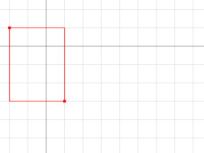
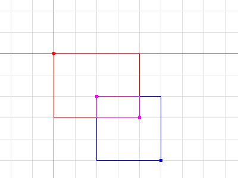
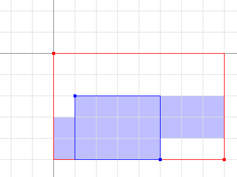

+++
title = "go 的image包"
weight = 11
date = 2023-05-18T17:03:08+08:00
type = "docs"
description = ""
isCJKLanguage = true
draft = false
+++

# The Go image package - go 的image包

https://go.dev/blog/image

Nigel Tao
21 September 2011

## Introduction 简介

The [image](https://go.dev/pkg/image/) and [image/color](https://go.dev/pkg/image/color/) packages define a number of types: `color.Color` and `color.Model` describe colors, `image.Point` and `image.Rectangle` describe basic 2-D geometry, and `image.Image` brings the two concepts together to represent a rectangular grid of colors. A [separate article](https://go.dev/doc/articles/image_draw.html) covers image composition with the [image/draw](https://go.dev/pkg/image/draw/) package.

image和image/color包定义了许多类型：color.Color和color.Model描述了颜色，image.Point和image.Rectangle描述了基本的二维几何图形，image.Image将这两个概念结合起来，表示一个矩形的颜色网格。另一篇文章介绍了用image/draw包进行的图像合成。

## Colors and Color Models 颜色和颜色模型

[Color](https://go.dev/pkg/image/color/#Color) is an interface that defines the minimal method set of any type that can be considered a color: one that can be converted to red, green, blue and alpha values. The conversion may be lossy, such as converting from CMYK or YCbCr color spaces.

颜色是一个接口，它定义了任何类型的最小方法集，可以被认为是一种颜色：一个可以被转换为红、绿、蓝和阿尔法值的颜色。这种转换可能是有损的，比如从CMYK或YCbCr颜色空间转换。

```go linenums="1"
type Color interface {
    // RGBA returns the alpha-premultiplied red, green, blue and alpha values
    // for the color. Each value ranges within [0, 0xFFFF], but is represented
    // by a uint32 so that multiplying by a blend factor up to 0xFFFF will not
    // overflow.
    RGBA() (r, g, b, a uint32)
}
```

There are three important subtleties about the return values. First, the red, green and blue are alpha-premultiplied: a fully saturated red that is also 25% transparent is represented by RGBA returning a 75% r. Second, the channels have a 16-bit effective range: 100% red is represented by RGBA returning an r of 65535, not 255, so that converting from CMYK or YCbCr is not as lossy. Third, the type returned is `uint32`, even though the maximum value is 65535, to guarantee that multiplying two values together won’t overflow. Such multiplications occur when blending two colors according to an alpha mask from a third color, in the style of [Porter and Duff’s](https://en.wikipedia.org/wiki/Alpha_compositing) classic algebra:

关于返回值有三个重要的微妙之处。首先，红色、绿色和蓝色是α-预乘的：一个完全饱和的红色，同时也是25%的透明，RGBA返回75%的r。100%的红色由RGBA表示，返回的r是65535，而不是255，这样从CMYK或YCbCr转换就不会有损失。第三，返回的类型是uint32，尽管最大值是65535，以保证将两个值相乘不会溢出。在根据第三种颜色的阿尔法掩码混合两种颜色时，会发生这样的乘法，这是波特和达夫的经典代数风格：

```go linenums="1"
dstr, dstg, dstb, dsta := dst.RGBA()
srcr, srcg, srcb, srca := src.RGBA()
_, _, _, m := mask.RGBA()
const M = 1<<16 - 1
// The resultant red value is a blend of dstr and srcr, and ranges in [0, M].
// The calculation for green, blue and alpha is similar.
dstr = (dstr*(M-m) + srcr*m) / M
```

The last line of that code snippet would have been more complicated if we worked with non-alpha-premultiplied colors, which is why `Color` uses alpha-premultiplied values.

如果我们处理的是非alpha-remultiplied的颜色，该代码片断的最后一行会更加复杂，这就是为什么Color使用alpha-remultiplied的值。

The image/color package also defines a number of concrete types that implement the `Color` interface. For example, [`RGBA`](https://go.dev/pkg/image/color/#RGBA) is a struct that represents the classic "8 bits per channel" color.

image/color包还定义了一些实现Color接口的具体类型。例如，RGBA是一个表示经典的 "每通道8比特 "颜色的结构。

```go linenums="1"
type RGBA struct {
    R, G, B, A uint8
}
```

Note that the `R` field of an `RGBA` is an 8-bit alpha-premultiplied color in the range [0, 255]. `RGBA` satisfies the `Color` interface by multiplying that value by 0x101 to generate a 16-bit alpha-premultiplied color in the range [0, 65535]. Similarly, the [`NRGBA`](https://go.dev/pkg/image/color/#NRGBA) struct type represents an 8-bit non-alpha-premultiplied color, as used by the PNG image format. When manipulating an `NRGBA`’s fields directly, the values are non-alpha-premultiplied, but when calling the `RGBA` method, the return values are alpha-premultiplied.

请注意，RGBA的R字段是一个范围为[0, 255]的8位alpha-remultiplied颜色。RGBA通过将该值乘以0x101来生成范围为[0, 65535]的16位alpha-remultiplied颜色来满足颜色接口。同样地，NRGBA结构类型表示8位非alpha-remultiplied颜色，如PNG图像格式所使用的。当直接操作NRGBA的字段时，其值是非alpha-remultiplied，但当调用RGBA方法时，其返回值是alpha-remultiplied。

A [`Model`](https://go.dev/pkg/image/color/#Model) is simply something that can convert `Color`s to other `Color`s, possibly lossily. For example, the `GrayModel` can convert any `Color` to a desaturated [`Gray`](https://go.dev/pkg/image/color/#Gray). A `Palette` can convert any `Color` to one from a limited palette.

一个模型只是能够将颜色转换为其他颜色的东西，可能是有损的。例如，GrayModel可以将任何颜色转换为不饱和的灰色。一个调色板可以将任何颜色转换为有限的调色板中的一种。

```go linenums="1"
type Model interface {
    Convert(c Color) Color
}

type Palette []Color
```

## Points and Rectangles 点和矩形

A [`Point`](https://go.dev/pkg/image/#Point) is an (x, y) co-ordinate on the integer grid, with axes increasing right and down. It is neither a pixel nor a grid square. A `Point` has no intrinsic width, height or color, but the visualizations below use a small colored square.

一个点是整数网格上的一个（x，y）坐标，轴线向右和向下递增。它既不是一个像素，也不是一个网格方块。一个点没有内在的宽度、高度或颜色，但下面的可视化使用了一个彩色的小方块。

```go linenums="1"
type Point struct {
    X, Y int
}
```


```
p := image.Point{2, 1}
```

A [`Rectangle`](https://go.dev/pkg/image/#Rectangle) is an axis-aligned rectangle on the integer grid, defined by its top-left and bottom-right `Point`. A `Rectangle` also has no intrinsic color, but the visualizations below outline rectangles with a thin colored line, and call out their `Min` and `Max` `Point`s.

矩形是整数网格上的一个轴对齐的矩形，由其左上角和右下角的Point定义。矩形也没有固有的颜色，但是下面的可视化图示用一条细的彩色线条勾勒出矩形，并叫出它们的最小和最大点数。

```go linenums="1"
type Rectangle struct {
    Min, Max Point
}
```

For convenience, `image.Rect(x0, y0, x1, y1)` is equivalent to `image.Rectangle{image.Point{x0, y0}, image.Point{x1, y1}}`, but is much easier to type.

为了方便起见，image.Rect(x0, y0, x1, y1)等同于image.Rectangle{image.Point{x0, y0}, image.Point{x1, y1}}，但更容易输入。

A `Rectangle` is inclusive at the top-left and exclusive at the bottom-right. For a `Point p` and a `Rectangle r`, `p.In(r)` if and only if `r.Min.X <= p.X && p.X < r.Max.X`, and similarly for `Y`. This is analogous to how a slice `s[i0:i1]` is inclusive at the low end and exclusive at the high end. (Unlike arrays and slices, a `Rectangle` often has a non-zero origin.)

一个矩形在左上角是包容的，在右下角是排斥的。对于一个点p和一个矩形r，p.In(r)当且仅当r.Min.X <= p.X && p.X < r.Max.X，对于Y也是如此。这类似于一个片断s[i0:i1]在低端是包容的，在高端是排他的。(与数组和切片不同，矩形通常有一个非零的原点）。


```go linenums="1"
r := image.Rect(2, 1, 5, 5)
// Dx and Dy return a rectangle's width and height.
fmt.Println(r.Dx(), r.Dy(), image.Pt(0, 0).In(r)) // prints 3 4 false
```

Adding a `Point` to a `Rectangle` translates the `Rectangle`. Points and Rectangles are not restricted to be in the bottom-right quadrant.

将一个点添加到一个矩形中，可以翻译该矩形。点和矩形不被限制在右下角的象限内。



```go linenums="1"
r := image.Rect(2, 1, 5, 5).Add(image.Pt(-4, -2))
fmt.Println(r.Dx(), r.Dy(), image.Pt(0, 0).In(r)) // prints 3 4 true
```

Intersecting two Rectangles yields another Rectangle, which may be empty.

将两个矩形相交会产生另一个矩形，它可能是空的。



```go linenums="1"
r := image.Rect(0, 0, 4, 3).Intersect(image.Rect(2, 2, 5, 5))
// Size returns a rectangle's width and height, as a Point.
fmt.Printf("%#v\n", r.Size()) // prints image.Point{X:2, Y:1}
```

Points and Rectangles are passed and returned by value. A function that takes a `Rectangle` argument will be as efficient as a function that takes two `Point` arguments, or four `int` arguments.

点和矩形是按值传递和返回的。一个接受矩形参数的函数将和一个接受两个Point参数或四个int参数的函数一样有效。

## Images 图像

An [Image](https://go.dev/pkg/image/#Image) maps every grid square in a `Rectangle` to a `Color` from a `Model`. "The pixel at (x, y)" refers to the color of the grid square defined by the points (x, y), (x+1, y), (x+1, y+1) and (x, y+1).

一个图像将矩形中的每个网格方块映射到模型中的一个颜色。"(x, y)处的像素 "指的是由(x, y)、(x+1, y)、(x+1, y+1)和(x, y+1)这几个点定义的网格方块的颜色。

```go linenums="1"
type Image interface {
    // ColorModel returns the Image's color model.
    ColorModel() color.Model
    // Bounds returns the domain for which At can return non-zero color.
    // The bounds do not necessarily contain the point (0, 0).
    Bounds() Rectangle
    // At returns the color of the pixel at (x, y).
    // At(Bounds().Min.X, Bounds().Min.Y) returns the upper-left pixel of the grid.
    // At(Bounds().Max.X-1, Bounds().Max.Y-1) returns the lower-right one.
    At(x, y int) color.Color
}
```

A common mistake is assuming that an `Image`’s bounds start at (0, 0). For example, an animated GIF contains a sequence of Images, and each `Image` after the first typically only holds pixel data for the area that changed, and that area doesn’t necessarily start at (0, 0). The correct way to iterate over an `Image` m’s pixels looks like:

一个常见的错误是假设一个图像的边界从（0，0）开始。例如，一个GIF动画包含一连串的图像，第一个图像之后的每个图像通常只保存变化区域的像素数据，而这个区域不一定从（0，0）开始。迭代一个图像m的像素的正确方法看起来像：

```go linenums="1"
b := m.Bounds()
for y := b.Min.Y; y < b.Max.Y; y++ {
 for x := b.Min.X; x < b.Max.X; x++ {
  doStuffWith(m.At(x, y))
 }
}
```

`Image` implementations do not have to be based on an in-memory slice of pixel data. For example, a [`Uniform`](https://go.dev/pkg/image/#Uniform) is an `Image` of enormous bounds and uniform color, whose in-memory representation is simply that color.

图像的实现不一定要基于内存中的像素数据片断。例如，Uniform是一个具有巨大边界和统一颜色的图像，其内存中的表示方法仅仅是该颜色。

```go linenums="1"
type Uniform struct {
    C color.Color
}
```

Typically, though, programs will want an image based on a slice. Struct types like [`RGBA`](https://go.dev/pkg/image/#RGBA) and [`Gray`](https://go.dev/pkg/image/#Gray) (which other packages refer to as `image.RGBA` and `image.Gray`) hold slices of pixel data and implement the `Image` interface.

不过，通常情况下，程序会想要一个基于切片的图像。像RGBA和Gray这样的结构类型（其他软件包称其为image.RGBA和image.Gray）持有像素数据的片断，并实现了Image接口。

```go linenums="1"
type RGBA struct {
    // Pix holds the image's pixels, in R, G, B, A order. The pixel at
    // (x, y) starts at Pix[(y-Rect.Min.Y)*Stride + (x-Rect.Min.X)*4].
    Pix []uint8
    // Stride is the Pix stride (in bytes) between vertically adjacent pixels.
    Stride int
    // Rect is the image's bounds.
    Rect Rectangle
}
```

These types also provide a `Set(x, y int, c color.Color)` method that allows modifying the image one pixel at a time.

这些类型还提供了一个Set(x, y int, c color.Color)方法，可以一次修改图像的一个像素。

```go linenums="1"
m := image.NewRGBA(image.Rect(0, 0, 640, 480))
m.Set(5, 5, color.RGBA{255, 0, 0, 255})
```

If you’re reading or writing a lot of pixel data, it can be more efficient, but more complicated, to access these struct type’s `Pix` field directly.

如果您要读或写大量的像素数据，直接访问这些结构类型的Pix字段会更有效，但也更复杂。

The slice-based `Image` implementations also provide a `SubImage` method, which returns an `Image` backed by the same array. Modifying the pixels of a sub-image will affect the pixels of the original image, analogous to how modifying the contents of a sub-slice `s[i0:i1]` will affect the contents of the original slice `s`.

基于切片的图像实现也提供了一个SubImage方法，它返回一个由相同数组支持的图像。修改子图像的像素会影响原始图像的像素，类似于修改子片s[i0:i1]的内容会影响原始片s的内容。



```go linenums="1"
m0 := image.NewRGBA(image.Rect(0, 0, 8, 5))
m1 := m0.SubImage(image.Rect(1, 2, 5, 5)).(*image.RGBA)
fmt.Println(m0.Bounds().Dx(), m1.Bounds().Dx()) // prints 8, 4
fmt.Println(m0.Stride == m1.Stride)             // prints true
```

For low-level code that works on an image’s `Pix` field, be aware that ranging over `Pix` can affect pixels outside an image’s bounds. In the example above, the pixels covered by `m1.Pix` are shaded in blue. Higher-level code, such as the `At` and `Set` methods or the [image/draw package](https://go.dev/pkg/image/draw/), will clip their operations to the image’s bounds.

对于在图像的Pix字段上工作的底层代码，要注意在Pix上的范围会影响到图像边界以外的像素。在上面的例子中，m1.Pix所覆盖的像素用蓝色阴影表示。更高级别的代码，如At和Set方法或image/draw包，将把它们的操作剪辑到图像的边界上。

## Image Formats 图像格式

The standard package library supports a number of common image formats, such as GIF, JPEG and PNG. If you know the format of a source image file, you can decode from an [`io.Reader`](https://go.dev/pkg/io/#Reader) directly.

标准包库支持许多常见的图像格式，如GIF、JPEG和PNG。如果您知道一个源图像文件的格式，您可以直接从io.Reader解码。

```go linenums="1"
import (
 "image/jpeg"
 "image/png"
 "io"
)

// convertJPEGToPNG converts from JPEG to PNG.
func convertJPEGToPNG(w io.Writer, r io.Reader) error {
 img, err := jpeg.Decode(r)
 if err != nil {
  return err
 }
 return png.Encode(w, img)
}
```

If you have image data of unknown format, the [`image.Decode`](https://go.dev/pkg/image/#Decode) function can detect the format. The set of recognized formats is constructed at run time and is not limited to those in the standard package library. An image format package typically registers its format in an init function, and the main package will "underscore import" such a package solely for the side effect of format registration.

如果您有未知格式的图像数据，image.Decode函数可以检测格式。识别的格式集是在运行时构建的，不限于标准包库中的格式。一个图像格式包通常在一个init函数中注册其格式，主包将 "下划线导入 "这样一个包，完全是为了实现格式注册的附带效果。

```go linenums="1"
import (
 "image"
 "image/png"
 "io"

 _ "code.google.com/p/vp8-go/webp"
 _ "image/jpeg"
)

// convertToPNG converts from any recognized format to PNG.
func convertToPNG(w io.Writer, r io.Reader) error {
 img, _, err := image.Decode(r)
 if err != nil {
  return err
 }
 return png.Encode(w, img)
}
```
