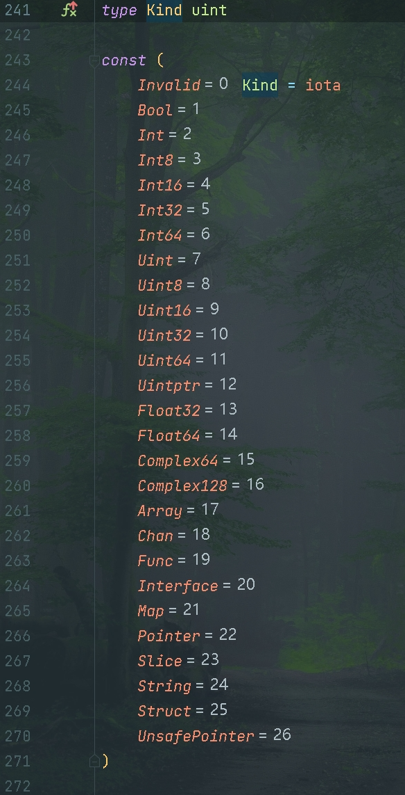

+++
title = "反射法则"
weight = 12
date = 2023-05-18T17:03:08+08:00
type = "docs"
description = ""
isCJKLanguage = true
draft = false

+++

# The Laws of Reflection - 反射法则

[https://go.dev/blog/laws-of-reflection](https://go.dev/blog/laws-of-reflection)

Rob Pike
6 September 2011

罗布·派克 2011年9月6日

## 简介 Introduction 

Reflection in computing is the ability of a program to examine its own structure, particularly through types; it’s a form of metaprogramming. It’s also a great source of confusion.

​	在计算机中，反射是程序通过类型等方式检查自身结构的能力，它是元编程的一种形式。它也是一个常常引起混淆的概念。

In this article we attempt to clarify things by explaining how reflection works in Go. Each language’s reflection model is different (and many languages don’t support it at all), but this article is about Go, so for the rest of this article the word "reflection" should be taken to mean "reflection in Go".

​	在本文中，我们尝试通过解释Go中的反射工作原理来澄清这一概念。每种编程语言的反射模型都不同（而且许多编程语言根本不支持反射），但本文是关于Go的，因此在本文的其余部分中，"反射"一词应被理解为"Go中的反射"。

Note added January 2022: This blog post was written in 2011 and predates parametric polymorphism (a.k.a. generics) in Go. Although nothing important in the article has become incorrect as a result of that development in the language, it has been tweaked in a few places to avoid confusing someone familiar with modern Go.

2022年1月添加的注释：这篇博文是在2011年撰写的，早于Go中的参数多态（也称为泛型）的引入。虽然文章中没有因Go语言的这一发展而变得不正确的重要内容，但为了避免混淆熟悉现代Go的人，文章在一些地方进行了微调。

## 类型和接口 Types and interfaces

Because reflection builds on the type system, let’s start with a refresher about types in Go.

​	由于反射基于类型系统，让我们从Go中的类型方面进行一个复习。

Go is statically typed. Every variable has a static type, that is, exactly one type known and fixed at compile time: `int`, `float32`, `*MyType`, `[]byte`, and so on. If we declare

​	Go是一种静态类型语言。每个变量都有一个静态类型，也就是在编译时已知和固定的一个类型：`int`、`float32`、`*MyType`、`[]byte`等等。如果我们声明：

```go
type MyInt int

var i int
var j MyInt
```

then `i` has type `int` and `j` has type `MyInt`. The variables `i` and `j` have distinct static types and, although they have the same underlying type, they cannot be assigned to one another without a conversion.

那么`i`的类型是`int`，`j`的类型是`MyInt`。变量`i`和`j`具有不同的静态类型，尽管它们有相同的基础类型，但它们不能在没有转换的情况下相互赋值。

One important category of type is interface types, which represent fixed sets of methods. (When discussing reflection, we can ignore the use of interface definitions as constraints within polymorphic code.) An interface variable can store any concrete (non-interface) value as long as that value implements the interface’s methods. A well-known pair of examples is `io.Reader` and `io.Writer`, the types `Reader` and `Writer` from the [io package](https://go.dev/pkg/io/):

​	一个重要的类型类别是接口类型，它表示一组固定的方法集。 （在讨论反射时，我们可以忽略接口定义用于约束多态代码的情况。）一个接口变量可以存储任何具体（非接口）值，只要该值实现了接口的方法。一个著名的示例是`io.Reader`和`io.Writer`，它们是来自`io`包的`Reader`和`Writer`类型：

```go
// Reader is the interface that wraps the basic Read method.
type Reader interface {
    Read(p []byte) (n int, err error)
}

// Writer is the interface that wraps the basic Write method.
type Writer interface {
    Write(p []byte) (n int, err error)
}
```

Any type that implements a `Read` (or `Write`) method with this signature is said to implement `io.Reader` (or `io.Writer`). For the purposes of this discussion, that means that a variable of type `io.Reader` can hold any value whose type has a `Read` method:

任何用这个签名实现读（或写）方法的类型都被称为实现了io.Reader（或io.Writer）。在本讨论中，这意味着一个io.Reader类型的变量可以持有任何类型具有Read方法的值：

​	任何实现了具有以下签名的`Read`（或`Write`）方法的类型都被认为实现了`io.Reader`（或`io.Writer`）。在本文中，这意味着类型为`io.Reader`的变量可以持有具有`Read`方法的任何类型的值：

```go
var r io.Reader
r = os.Stdin
r = bufio.NewReader(r)
r = new(bytes.Buffer)
// and so on
// 等等
```

It’s important to be clear that whatever concrete value `r` may hold, `r`’s type is always `io.Reader`: Go is statically typed and the static type of `r` is `io.Reader`.

​	需要明确的是，无论`r`可能包含哪种具体值，`r`的类型始终为`io.Reader`：Go是静态类型的，`r`的静态类型是`io.Reader`。

An extremely important example of an interface type is the empty interface:

​	一个极为重要的接口类型示例是空接口：

```go
interface{}
```

or its equivalent alias,

或其等效的别名：

```go
any
```

It represents the empty set of methods and is satisfied by any value at all, since every value has zero or more methods.

​	它表示空方法集，并且可以被任何值所满足，因为每个值都具有零个或多个方法。

Some people say that Go’s interfaces are dynamically typed, but that is misleading. They are statically typed: a variable of interface type always has the same static type, and even though at run time the value stored in the interface variable may change type, that value will always satisfy the interface.

​	**有些人说Go的接口是动态类型的，但这是一种误导**。它们是静态类型的：接口类型的变量始终具有相同的静态类型，尽管在运行时存储在接口变量中的值可能会更改类型，但该值将始终满足该接口。

We need to be precise about all this because reflection and interfaces are closely related.

​	我们需要明确所有这些，因为反射和接口密切相关。

## 接口的表示 The representation of an interface 

Russ Cox has written a [detailed blog post](https://research.swtch.com/2009/12/go-data-structures-interfaces.html) about the representation of interface values in Go. It’s not necessary to repeat the full story here, but a simplified summary is in order.

​	Russ Cox 已经写了一篇关于 Go 中接口值表示的[详细博文](https://research.swtch.com/2009/12/go-data-structures-interfaces.html)文章。在这里不需要重复全部故事，但简化的总结如下：

A variable of interface type stores a pair: the concrete value assigned to the variable, and that value’s type descriptor. To be more precise, the value is the underlying concrete data item that implements the interface and the type describes the full type of that item. For instance, after

一个接口类型的变量存储了一对：分配给该变量的具体数值，以及该数值的类型描述符。更准确地说，值是实现接口的底层具体数据项，而类型则描述了该数据项的完整类型。例如，在

​	接口类型的变量存储一对内容：分配给变量的具体值，以及该值的类型描述符。更准确地说，值是实现接口的底层具体数据项，而类型描述了该项的完整类型。例如，经过以下操作之后：

```go
var r io.Reader
tty, err := os.OpenFile("/dev/tty", os.O_RDWR, 0)
if err != nil {
    return nil, err
}
r = tty
```

`r` contains, schematically, the (value, type) pair, (`tty`, `*os.File`). Notice that the type `*os.File` implements methods other than `Read`; even though the interface value provides access only to the `Read` method, the value inside carries all the type information about that value. That’s why we can do things like this:

​	`r`包含（值、类型）对，即（`tty`, `*os.File`）。注意，类型`*os.File`实现了除`Read`之外的其他方法；尽管该接口值仅提供对`Read`方法的访问，但值本身携带了关于该值的所有类型信息。这就是我们可以执行类似以下的操作的原因：

```go
var w io.Writer
w = r.(io.Writer)
```

The expression in this assignment is a type assertion; what it asserts is that the item inside `r` also implements `io.Writer`, and so we can assign it to `w`. After the assignment, `w` will contain the pair (`tty`, `*os.File`). That’s the same pair as was held in `r`. The static type of the interface determines what methods may be invoked with an interface variable, even though the concrete value inside may have a larger set of methods.

这个赋值中的表达式是一个类型断言；它断言r里面的项目也实现了io.Writer，所以我们可以把它赋给w。接口的静态类型决定了哪些方法可以被接口变量调用，即使里面的具体值可能有更大的方法集。

​	此赋值中的表达式是一种类型断言；它断言`r`内部的项还实现了`io.Writer`，因此我们可以将其赋给`w`。在赋值之后，`w`将包含（`tty`, `*os.File`）对，这与`r`中保持的内容相同。接口的静态类型决定了哪些方法可以被接口变量调用，尽管内部可能具有更多的方法集。

Continuing, we can do this:

​	接着，我们可以这样做：

```go
var empty interface{}
empty = w
```

and our empty interface value `empty` will again contain that same pair, (`tty`, `*os.File`). That’s handy: an empty interface can hold any value and contains all the information we could ever need about that value.

​	我们的空接口值`empty`再次包含相同的（`tty`、`*os.File`）对。这很方便：空接口可以持有任何值，并包含了我们可能需要的有关该值的所有信息。

(We don’t need a type assertion here because it’s known statically that `w` satisfies the empty interface. In the example where we moved a value from a `Reader` to a `Writer`, we needed to be explicit and use a type assertion because `Writer`’s methods are not a subset of `Reader`’s.)

（在这里不需要类型断言，因为已在静态上知道`w`满足空接口。在我们将值从`Reader`移动到`Writer`的示例中，我们需要显式使用类型断言，因为`Writer`的方法不是`Reader`的子集。）

One important detail is that the pair inside an interface variable always has the form (value, concrete type) and cannot have the form (value, interface type). Interfaces do not hold interface values.

​	一个重要的细节是，接口变量内部的一对总是以（值，具体类型）的形式存在，不能以（值，接口类型）的形式存在。接口不持有接口值。

Now we’re ready to reflect.

​	现在我们准备好进行反射了。

## 反射的第一法则 The first law of reflection 

## 1. 反射从接口值到反射对象。 1. Reflection goes from interface value to reflection object. 

At the basic level, reflection is just a mechanism to examine the type and value pair stored inside an interface variable. To get started, there are two types we need to know about in [package reflect](https://go.dev/pkg/reflect/): [Type](https://go.dev/pkg/reflect/#Type) and [Value](https://go.dev/pkg/reflect/#Value). Those two types give access to the contents of an interface variable, and two simple functions, called `reflect.TypeOf` and `reflect.ValueOf`, retrieve `reflect.Type` and `reflect.Value` pieces out of an interface value. (Also, from a `reflect.Value` it’s easy to get to the corresponding `reflect.Type`, but let’s keep the `Value` and `Type` concepts separate for now.)

​	在基本层面上，反射只是一种检查存储在**接口变量**内部的类型和值对的机制。为了入门，我们需要了解[reflect包]()中的两种类型：[Type]()和[Value]()。这两种类型提供了访问接口变量内容的功能，而两个名为`reflect.TypeOf`和`reflect.ValueOf`的简单函数可以从**接口值**中提取`reflect.Type`和`reflect.Value`的部分。 （同样，从`reflect.Value`很容易得到相应的`reflect.Type`，但让我们暂时将`Value`和`Type`的概念分开。）

Let’s start with `TypeOf`:

​	让我们从`TypeOf`开始：

```go
package main

import (
    "fmt"
    "reflect"
)

func main() {
    var x float64 = 3.4
    fmt.Println("type:", reflect.TypeOf(x))
}
```

This program prints

​	这个程序会输出：

```go
type: float64
```

You might be wondering where the interface is here, since the program looks like it’s passing the `float64` variable `x`, not an interface value, to `reflect.TypeOf`. But it’s there; as [godoc reports](https://go.dev/pkg/reflect/#TypeOf), the signature of `reflect.TypeOf` includes an empty interface:

​	也许你会疑惑这里的接口在哪里，因为程序似乎将`float64`（类型的）变量`x`，而不是接口值，传递给`reflect.TypeOf`。但它确实存在；正如 [godoc 所报告的]()，`reflect.TypeOf`的签名包括一个空接口：

```go
// TypeOf returns the reflection Type of the value in the interface{}.
// TypeOf 返回interface{}中值的反射类型。
func TypeOf(i interface{}) Type
```

When we call `reflect.TypeOf(x)`, `x` is first stored in an empty interface, which is then passed as the argument; `reflect.TypeOf` unpacks that empty interface to recover the type information.

​	当我们调用`reflect.TypeOf(x)`时，`x`首先被存储在一个空接口中，然后作为实参传递；`reflect.TypeOf`解开这个空接口以恢复类型信息。

The `reflect.ValueOf` function, of course, recovers the value (from here on we’ll elide the boilerplate and focus just on the executable code):

​	当然，`reflect.ValueOf`函数会恢复值（从此处开始我们将省略样板代码并专注于可执行代码）：

```go
var x float64 = 3.4
fmt.Println("value:", reflect.ValueOf(x).String())
```

prints

这会输出：

```
value: <float64 Value>
```

(We call the `String` method explicitly because by default the `fmt` package digs into a `reflect.Value` to show the concrete value inside. The `String` method does not.)

（我们明确调用`String`方法，因为默认情况下，`fmt`包会深入`reflect.Value`以显示其中的具体值。`String`方法则不会这样做。） 

Both `reflect.Type` and `reflect.Value` have lots of methods to let us examine and manipulate them. One important example is that `Value` has a `Type` method that returns the `Type` of a `reflect.Value`. Another is that both `Type` and `Value` have a `Kind` method that returns a constant indicating what sort of item is stored: `Uint`, `Float64`, `Slice`, and so on. Also methods on `Value` with names like `Int` and `Float` let us grab values (as `int64` and `float64`) stored inside:

​	`reflect.Type`和`reflect.Value`都有许多方法，可以让我们检查和操作它们。一个重要的示例是，`Value`类型具有一个`Type`方法，该方法返回`reflect.Value`的`Type`。还有`Kind`方法，`Type`类型和`Value`类型都有`Kind`方法，该方法返回一个常数，指示存储的是什么类型的项：`Uint`、`Float64`、`Slice`等等（参见下图）。还有像`Int`和`Float`这样的`Value`方法，让我们提取里面存储的值（作为`int64`和`float64`）： 



```go
var x float64 = 3.4
v := reflect.ValueOf(x)
fmt.Println("type:", v.Type())
fmt.Println("kind is float64:", v.Kind() == reflect.Float64)
fmt.Println("value:", v.Float())
```

prints

这会输出：

```go
type: float64
kind is float64: true
value: 3.4
```

There are also methods like `SetInt` and `SetFloat` but to use them we need to understand settability, the subject of the third law of reflection, discussed below.

​	还有像`SetInt`和`SetFloat`之类的方法，但要使用它们，我们需要理解可设置性（settingability），这是反射的第三法则的主题，如下所述。

The reflection library has a couple of properties worth singling out. First, to keep the API simple, the "getter" and "setter" methods of `Value` operate on the largest type that can hold the value: `int64` for all the signed integers, for instance. That is, the `Int` method of `Value` returns an `int64` and the `SetInt` value takes an `int64`; it may be necessary to convert to the actual type involved:

​	反射库有几个值得特别注意的属性。**首先**，为了保持API简单，`Value`的"getter 获取器 "和"setter 设置器"方法操作的是可以**持有该值的最大类型**：例如，对于所有有符号整数，都是`int64`。也就是说，`Value`类型的`Int`方法返回一个`int64`，`SetInt`方法接受一个`int64`；可能需要转换为实际涉及的类型：

```go
var x uint8 = 'x'
v := reflect.ValueOf(x)
fmt.Println("type:", v.Type())                            // uint8.
fmt.Println("kind is uint8: ", v.Kind() == reflect.Uint8) // true.
x = uint8(v.Uint())                                       // v.Uint returns a uint64.
```

The second property is that the `Kind` of a reflection object describes the underlying type, not the static type. If a reflection object contains a value of a user-defined integer type, as in

​	**第二个属性是反射对象的`Kind`方法描述的是底层类型，而不是静态类型**。如果反射对象包含用户定义的整数类型的值，如下所示：

```go
type MyInt int
var x MyInt = 7
v := reflect.ValueOf(x)
```

the `Kind` of `v` is still `reflect.Int`, even though the static type of `x` is `MyInt`, not `int`. In other words, the `Kind` cannot discriminate an `int` from a `MyInt` even though the `Type` can.

v的Kind仍然是reflect.Int，尽管x的静态类型是MyInt而不是int。换句话说，尽管类型可以区分int和MyInt，但Kind不能区分int。

​	`v`的`Kind`（方法返回的）仍然是`reflect.Int`，尽管`x`的静态类型是`MyInt`，而不是`int`。换句话说，尽管`Type`方法可以区分`int`和`MyInt`，但`Kind`方法却不能。

```go
package main

import (
	"fmt"
	"reflect"
)

func main() {
	type MyInt int
	var x MyInt = 7
	v := reflect.ValueOf(x)
	fmt.Println("use Kind() method:", v.Kind())
	fmt.Println("use Kind().String() method:", v.Kind().String())
	fmt.Println("use Type() method:", v.Type())
	fmt.Println("use Type().String() method:", v.Type().String())
}

// Output:
//use Kind() method: int
//use Kind().String() method: int
//use Type() method: main.MyInt
//use Type().String() method: main.MyInt
```


## 反射的第二法则 The second law of reflection

## 2. 反射从反射对象到接口值。 2. Reflection goes from reflection object to interface value.  

Like physical reflection, reflection in Go generates its own inverse.

像物理反射一样，Go中的反射也会产生它自己的逆向。

​	与物理反射类似，Go中的反射生成了它自己的反操作。

Given a `reflect.Value` we can recover an interface value using the `Interface` method; in effect the method packs the type and value information back into an interface representation and returns the result:

给定一个reflect.Value，我们可以使用Interface方法恢复一个接口值；实际上，该方法将类型和值信息打包回一个接口表示，并返回结果：

​	给定一个reflect.Value，我们可以使用Interface方法来恢复一个接口值；实际上，该方法将类型和值信息重新打包成一个接口表示，并返回结果：

```go
// Interface returns v's value as an interface{}.
// Interface返回v的值作为interface{}。
func (v Value) Interface() interface{}
```

As a consequence we can say

因此，我们可以说

​	因此，我们可以说

```go
y := v.Interface().(float64) // y will have type float64.
fmt.Println(y)
```

to print the `float64` value represented by the reflection object `v`.

来打印由反射对象v代表的float64值。

来打印由反射对象v表示的float64值。

We can do even better, though. The arguments to `fmt.Println`, `fmt.Printf` and so on are all passed as empty interface values, which are then unpacked by the `fmt` package internally just as we have been doing in the previous examples. Therefore all it takes to print the contents of a `reflect.Value` correctly is to pass the result of the `Interface` method to the formatted print routine:

不过，我们可以做得更好。fmt.Println、fmt.Printf 等的参数都是作为空的接口值传递的，然后由 fmt 包内部解包，就像我们在前面的例子中做的那样。因此，正确打印reflect.Value的内容只需要将接口方法的结果传递给格式化的打印例程：

​	不过，我们可以做得更好。fmt.Println、fmt.Printf等函数的参数都作为空接口值传递，然后由fmt包内部解包，就像我们在先前的示例中所做的那样。因此，要正确打印reflect.Value的内容，只需将Interface方法的结果传递给格式化打印例程：

```go
fmt.Println(v.Interface())
```

(Since this article was first written, a change was made to the `fmt` package so that it automatically unpacks a `reflect.Value` like this, so we could just say

(自从这篇文章第一次写完后，fmt包做了一个修改，这样它就会像这样自动解包一个reflect.Value，所以我们可以直接说

（由于这篇文章最初是在写的，fmt包已经进行了更改，以便自动解包像这样的reflect.Value，因此我们可以只说

```go
fmt.Println(v)
```

for the same result, but for clarity we’ll keep the `.Interface()` calls here.)

得到同样的结果，但为了清楚起见，我们将在这里保留.Interface()的调用）。

获得相同的结果，但为了清晰起见，我们将保留.Interface()调用。）

Since our value is a `float64`, we can even use a floating-point format if we want:

由于我们的值是 float64，如果我们想的话，甚至可以使用浮点格式：

​	由于我们的值是一个float64，如果需要，我们甚至可以使用浮点数格式：

```go
fmt.Printf("value is %7.1e\n", v.Interface())
```

and get in this case

并在本例中得到

在这种情况下，将获得

```
3.4e+00
```

Again, there’s no need to type-assert the result of `v.Interface()` to `float64`; the empty interface value has the concrete value’s type information inside and `Printf` will recover it.

同样，不需要对v.Interface()的结果进行type-assert到float64；空的接口值里面有具体值的type信息，Printf会恢复它。

​	同样，没有必要将v.Interface()的结果类型断言为float64；空接口值内部具有具体值的类型信息，并且Printf会恢复它。

In short, the `Interface` method is the inverse of the `ValueOf` function, except that its result is always of static type `interface{}`.

简而言之，Interface方法是ValueOf函数的倒数，只是它的结果总是静态类型interface{}。

​	总之，Interface方法是ValueOf函数的反操作，不过它的结果始终是静态类型interface{}。

Reiterating: Reflection goes from interface values to reflection objects and back again.

重申一下。反射从接口值到反射对象，然后再返回。

​	再次强调：反射从接口值到反射对象，然后再返回。

## 反射的第三法则 The third law of reflection

## 3. 要修改一个反射对象，其值必须是可设置性。3. To modify a reflection object, the value must be settable. 

The third law is the most subtle and confusing, but it’s easy enough to understand if we start from first principles.

第三条定律是最微妙和令人困惑的，但如果我们从第一条原则出发，就很容易理解。

​	第三法则是最微妙和令人困惑的，但如果我们从基本原理出发，就很容易理解。

Here is some code that does not work, but is worth studying.

下面是一些不起作用的代码，但值得研究。

​	以下是一些代码示例，虽然无法正常工作，但值得学习。

```go
var x float64 = 3.4
v := reflect.ValueOf(x)
v.SetFloat(7.1) // Error: will panic. 错误：会引发panic
```

If you run this code, it will panic with the cryptic message

如果您运行这段代码，它就会出现恐慌，并发出神秘的信息

​	如果运行这段代码，它将引发一个晦涩的错误消息：

```
panic: reflect.Value.SetFloat using unaddressable value
```

The problem is not that the value `7.1` is not addressable; it’s that `v` is not settable. Settability is a property of a reflection `Value`, and not all reflection `Values` have it.

问题不在于7.1这个值不可寻址，而在于v不可设置。可设置性是反射值的一个属性，并不是所有的反射值都有这个属性。

​	问题不在于值`7.1`不可寻址；问题在于v不可设置。可设置性是反射Value的属性，而不是所有反射Values都具备可设置性。

The `CanSet` method of `Value` reports the settability of a `Value`; in our case,

Value的CanSet方法报告一个Value的可设置性；在我们的例子中。

​	Value的CanSet方法报告了Value的可设置性；在我们的案例中，

```go
var x float64 = 3.4
v := reflect.ValueOf(x)
fmt.Println("settability of v:", v.CanSet())
```

prints

打印的结果是

```
settability of v: false
```

It is an error to call a `Set` method on a non-settable `Value`. But what is settability?

在一个不可设置的值上调用一个设置方法是一个错误。但什么是可设置性？

​	在不可设置的Value上调用Set方法是一个错误。但是，可设置性是什么？

Settability is a bit like addressability, but stricter. It’s the property that a reflection object can modify the actual storage that was used to create the reflection object. Settability is determined by whether the reflection object holds the original item. When we say

可设置性有点像可寻址性，但更严格。它是一个反射对象可以修改用于创建反射对象的实际存储的属性。可设置性是由反射对象是否持有原始项目决定的。当我们说

​	可设置性有点像可寻址性，但更为严格。它表示反射对象是否可以修改用于创建反射对象的实际存储。可设置性是由反射对象是否持有原始项来确定的。当我们写下：

```go
var x float64 = 3.4
v := reflect.ValueOf(x)
```

we pass a copy of `x` to `reflect.ValueOf`, so the interface value created as the argument to `reflect.ValueOf` is a copy of `x`, not `x` itself. Thus, if the statement

我们把 x 的副本传递给 reflect.ValueOf，所以作为 reflect.ValueOf 的参数创建的接口值是 x 的副本，而不是 x 本身。因此，如果语句

​	我们将x的一个副本传递给reflect.ValueOf，因此作为reflect.ValueOf参数创建的接口值是x的副本，而不是x本身。因此，如果允许该语句成功执行，

```go
v.SetFloat(7.1)
```

were allowed to succeed, it would not update `x`, even though `v` looks like it was created from `x`. Instead, it would update the copy of `x` stored inside the reflection value and `x` itself would be unaffected. That would be confusing and useless, so it is illegal, and settability is the property used to avoid this issue.

允许成功的话，它不会更新x，尽管v看起来是由x创建的。相反，它将更新存储在反射值中的x的副本，而x本身不会受到影响。这将是混乱和无用的，所以它是非法的，而settability是用来避免这个问题的属性。

它不会更新x，即使v看起来是从x创建的。相反，它将更新存储在反射值内部的x的副本，而x本身将不受影响。这将会令人困惑并且没有用处，因此它是不允许的，可设置性是用来避免这个问题的属性。

If this seems bizarre, it’s not. It’s actually a familiar situation in unusual garb. Think of passing `x` to a function:

如果这看起来很怪异，其实不然。它实际上是一个熟悉的情况，穿着不寻常的衣服。想想把x传给一个函数：

​	如果这看起来很奇怪，实际上它并不奇怪。它实际上是一个常见情况，只是以不同的方式呈现。想象将x传递给一个函数：

```go
f(x)
```

We would not expect `f` to be able to modify `x` because we passed a copy of `x`’s value, not `x` itself. If we want `f` to modify `x` directly we must pass our function the address of `x` (that is, a pointer to `x`):

我们不会期望f能够修改x，因为我们传递的是x的值的拷贝，而不是x本身。如果我们想让f直接修改x，我们必须把x的地址（也就是一个指向x的指针）传给我们的函数：

​	我们不会期望f能够修改x，因为我们传递了x的值的副本，而不是x本身。如果我们希望f直接修改x，我们必须将x的地址传递给我们的函数（即x的指针）：

```go
f(&x)
```

This is straightforward and familiar, and reflection works the same way. If we want to modify `x` by reflection, we must give the reflection library a pointer to the value we want to modify.

这是直接的和熟悉的，反射的工作方式也是如此。如果我们想通过反射来修改x，我们必须给反射库一个指向我们想修改的值的指针。

​	这是简单和常见的，反射也是相同的方式工作。如果我们想要通过反射修改x，我们必须向反射库提供我们要修改的值的指针。

```go
var x float64 = 3.4
p := reflect.ValueOf(&x) // Note: take the address of x.
fmt.Println("type of p:", p.Type())
fmt.Println("settability of p:", p.CanSet())
```

Let’s do that. First we initialize `x` as usual and then create a reflection value that points to it, called `p`.

让我们来做这件事。首先我们像往常一样初始化x，然后创建一个指向它的反射值，叫做p。

​	让我们来做这个。首先，我们像往常一样初始化x，然后创建一个指向它的反射值，称为p。

```go
var x float64 = 3.4
p := reflect.ValueOf(&x) // Note: take the address of x.
fmt.Println("type of p:", p.Type())
fmt.Println("settability of p:", p.CanSet())
```

The output so far is

到目前为止的输出是

到目前为止的输出是

```go
type of p: *float64
settability of p: false
```

The reflection object `p` isn’t settable, but it’s not `p` we want to set, it’s (in effect) `*p`. To get to what `p` points to, we call the `Elem` method of `Value`, which indirects through the pointer, and save the result in a reflection `Value` called `v`:

反射对象p是不可设置的，但我们想设置的不是p，而是（实际上）*p。为了得到p所指向的东西，我们调用Value的Elem方法，它通过指针进行间接操作，并将结果保存在一个叫做v的反射Value中：

​	反射对象p不可设置，但我们不是想设置p本身，而是（实际上）*p。为了获取p指向的内容，我们调用Value的Elem方法，该方法通过指针进行间接操作，并将结果保存在一个名为v的反射Value中：

```go
v := p.Elem()
fmt.Println("settability of v:", v.CanSet())
```

Now `v` is a settable reflection object, as the output demonstrates,

现在v是一个可设置的反射对象，正如输出所演示的那样。

​	现在v是一个可设置的反射对象，如输出所示，

```
settability of v: true
```

and since it represents `x`, we are finally able to use `v.SetFloat` to modify the value of `x`:

并且由于它代表x，我们最终能够使用v.SetFloat来修改x的值：

既然它代表x，我们最终可以使用v.SetFloat来修改x的值：

```go
v.SetFloat(7.1)
fmt.Println(v.Interface())
fmt.Println(x)
```

The output, as expected, is

正如预期的那样，输出结果是

输出如预期的那样：

```
7.1
7.1
```

Reflection can be hard to understand but it’s doing exactly what the language does, albeit through reflection `Types` and `Values` that can disguise what’s going on. Just keep in mind that reflection Values need the address of something in order to modify what they represent.

反射可能很难理解，但它所做的正是语言所做的，尽管通过反射类型和值可以掩盖正在发生的事情。请记住，反射值需要某个东西的地址，以便修改它们所代表的东西。

​	反射可能很难理解，但它实际上就是在执行与反射类型和值相关的操作，尽管这些类型和值可以掩盖发生的事情。只需记住，反射Values需要某物的地址才能修改它们所代表的内容。

## 结构体 Structs 

In our previous example `v` wasn’t a pointer itself, it was just derived from one. A common way for this situation to arise is when using reflection to modify the fields of a structure. As long as we have the address of the structure, we can modify its fields.

在我们前面的例子中，v本身并不是一个指针，它只是从一个指针派生出来的。出现这种情况的一个常见方法是使用反射来修改结构的字段。只要我们有结构的地址，我们就可以修改它的字段。

​	在我们之前的示例中，v本身不是指针，它只是从指针派生而来。在使用反射来修改结构体的字段时，这种情况经常发生。只要我们有结构体的地址，我们就可以修改它的字段。

Here’s a simple example that analyzes a struct value, `t`. We create the reflection object with the address of the struct because we’ll want to modify it later. Then we set `typeOfT` to its type and iterate over the fields using straightforward method calls (see [package reflect](https://go.dev/pkg/reflect/) for details). Note that we extract the names of the fields from the struct type, but the fields themselves are regular `reflect.Value` objects.

下面是一个分析结构值t的简单例子。我们用结构的地址创建反射对象，因为我们以后会想修改它。然后我们将typeOfT设置为它的类型，并使用直接的方法调用遍历字段（详见包reflect）。请注意，我们从结构类型中提取字段的名称，但字段本身是普通的 reflect.Value 对象。

​	下面是一个简单的示例，分析了一个结构体值t。我们使用结构体的地址创建反射对象，因为我们稍后要对其进行修改。然后，我们将typeOfT设置为它的类型，并使用直接的方法调用来迭代字段（有关详细信息，请参阅reflect包）。请注意，我们从结构体类型中提取字段的名称，但字段本身是常规的reflect.Value对象。

```go
type T struct {
    A int
    B string
}
t := T{23, "skidoo"}
s := reflect.ValueOf(&t).Elem()
typeOfT := s.Type()
for i := 0; i < s.NumField(); i++ {
    f := s.Field(i)
    fmt.Printf("%d: %s %s = %v\n", i,
        typeOfT.Field(i).Name, f.Type(), f.Interface())
}
```

The output of this program is

这个程序的输出是

这个程序的输出是

```
0: A int = 23
1: B string = skidoo
```

There’s one more point about settability introduced in passing here: the field names of `T` are upper case (exported) because only exported fields of a struct are settable.

这里还顺便介绍了一个关于可设置性的观点：T的字段名是大写的（导出的），因为只有结构的导出字段是可设置的。

​	这里还有关于可设置性的一个附加点：T的字段名称是大写（已导出字段），因为只有结构体的导出字段是可设置的。

Because `s` contains a settable reflection object, we can modify the fields of the structure.

因为s包含一个可设置的反射对象，我们可以修改结构的字段。

​	由于s包含一个可设置的反射对象，我们可以修改结构体的字段。

```
s.Field(0).SetInt(77)
s.Field(1).SetString("Sunset Strip")
fmt.Println("t is now", t)
```

And here’s the result:

这里是结果：

这是结果：

```
t is now {77 Sunset Strip}
```

If we modified the program so that `s` was created from `t`, not `&t`, the calls to `SetInt` and `SetString` would fail as the fields of `t` would not be settable.

如果我们修改程序，使s是从t而不是&t创建的，那么对SetInt和SetString的调用就会失败，因为t的字段不能被设置。

​	如果我们修改程序，以便s是从t而不是&t创建的，那么对SetInt和SetString的调用将失败，因为t的字段将不可设置。

## 结论 Conclusion 

Here again are the laws of reflection:

这里又是反射的规律：

这里再次提到反射的三个法则：

- Reflection goes from interface value to reflection object. 反射从接口值到反射对象。
- 反射从接口值到反射对象的转换。
- Reflection goes from reflection object to interface value. 反射从反射对象到接口值。
- 反射从反射对象到接口值的转换。
- To modify a reflection object, the value must be settable. 要修改一个反射对象，其值必须是可设置的。
- 要修改反射对象，该值必须是可设置的。

Once you understand these laws reflection in Go becomes much easier to use, although it remains subtle. It’s a powerful tool that should be used with care and avoided unless strictly necessary.

​	一旦理解了这些法则，Go中的反射将变得更容易使用，尽管它仍然有微妙之处。它是一个强大的工具，应谨慎使用，并仅在绝对必要的情况下使用。

There’s plenty more to reflection that we haven’t covered — sending and receiving on channels, allocating memory, using slices and maps, calling methods and functions — but this post is long enough. We’ll cover some of those topics in a later article.

​	反射还有许多内容我们没有涵盖，比如在通道上发送和接收数据、分配内存、使用切片和映射、调用方法和函数等，但这篇文章已经足够长了。我们将在以后的文章中涵盖其中一些主题。
