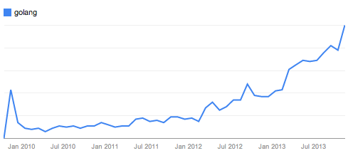

+++
title = "Go 四岁了"
weight = 5
date = 2023-05-18T17:03:08+08:00
type = "docs"
description = ""
isCJKLanguage = true
draft = false
+++

# Four years of Go - Go 四岁了

> 原文：[https://go.dev/blog/4years](https://go.dev/blog/4years)

Andrew Gerrand
10 November 2013

Today marks the fourth anniversary of Go as an open source project.

今天是Go作为一个开源项目的四周年。

Rather than talk about our technical progress (there’ll be much to talk about when we release Go 1.2 in a couple of weeks) we thought we would instead take this occasion to look at how the Go community has grown.

与其谈论我们的技术进步（几周后我们发布Go 1.2时将会有很多话题），我们不如借此机会看看Go社区是如何发展的。

Let’s start with a chart:

让我们从一个图表开始：

This chart shows the growth of Google searches for the term "[golang](http://www.google.com/trends/explore?hl=en-US#q=golang&date=10/2009+50m&cmpt=q)" over the past four years. Notice the knee in the curve around March 2012, when Go 1.0 was released. If these searches are a decent proxy for interest, then it’s clear that interest in Go has grown remarkably since launch, and particularly so in the last 2 years.

这张图显示了过去四年里Google搜索 "golang "一词的增长情况。请注意2012年3月左右曲线的膝部，当时Go 1.0已经发布。如果这些搜索是对兴趣的一种适当的代理，那么很明显，自Go发布以来，人们对它的兴趣已经有了明显的增长，特别是在过去的两年里。

But where is the interest coming from?

但是这些兴趣来自哪里呢？

The open source community has embraced Go, with our community wiki listing [hundreds of Go projects](https://go.dev/wiki/Projects). Some popular ones:

开源社区已经接受了Go，我们的社区维基列出了数百个Go项目。一些流行的项目：

- [Docker](http://docker.io/) is a tool for packaging and running applications in lightweight containers. Docker makes it easy to isolate, package, and deploy applications, and is beloved by system administrators. Its creator Solomon Hykes cited Go’s standard library, concurrency primitives, and ease of deployment as key factors, and said "To put it simply, if Docker had not been written in Go, it would not have been as successful." Docker是一个用于在轻量级容器中打包和运行应用程序的工具。Docker使隔离、打包和部署应用程序变得容易，并受到系统管理员的喜爱。它的创建者Solomon Hykes将Go的标准库、并发原语和易于部署作为关键因素，并说："简单地说，如果Docker不是用Go编写的，它就不会如此成功。"
- [Packer](http://packer.io/) is a tool for automating the creation of machine images for deployment to virtual machines or cloud services. Its author, Mitchell Hashimoto, is now working on another Go project, [serf](http://www.serfdom.io/), a decentralized discovery service. Like Docker, these projects help with management of large-scale, cluster-based services. Packer是一个自动创建机器图像的工具，用于部署到虚拟机或云服务。它的作者Mitchell Hashimoto现在正在开发另一个Go项目，Serf，一个分散的发现服务。像Docker一样，这些项目有助于管理大规模、基于集群的服务。
- [Bitly](http://bit.ly/)’s [NSQ](http://bitly.github.io/nsq/) is a realtime distributed messaging platform designed for fault-tolerance and high-availability, and is used in production at bitly and a bunch of other companies. Bitly的NSQ是一个实时分布式消息平台，旨在实现容错和高可用性，并在bitly和其他一些公司的生产中使用。
- [Canonical](http://canonical.com/)’s [JuJu](https://juju.ubuntu.com/) infrastructure automation system was rewritten in Go. Project lead Gustavo Niemeyer said "It’s not a single aspect of Go that makes it a compelling choice, but rather the careful organization of well-crafted small pieces." Canonical的JuJu基础设施自动化系统是用Go重写的。项目负责人Gustavo Niemeyer说："不是Go的某一个方面使它成为一个引人注目的选择，而是精心组织的小片段。"
- The [raft](https://github.com/goraft/raft) package provides an implementation of the [Raft](https://ramcloud.stanford.edu/wiki/download/attachments/11370504/raft.pdf) distributed consensus protocol. It is the basis of Go projects like [etcd](https://github.com/coreos/etcd) and [SkyDNS](https://github.com/skynetservices/skydns). raft包提供了Raft分布式共识协议的实现。它是etcd和SkyDNS等Go项目的基础。
- Other popular projects include [biogo](https://github.com/biogo/biogo), the [Gorilla Web Toolkit](http://www.gorillatoolkit.org/), [groupcache](https://github.com/golang/groupcache), Mozilla’s [heka](https://github.com/mozilla-services/heka), the [kv](https://github.com/cznic/kv) and [ql](https://github.com/cznic/ql) lightweight storage systems, and the [Sky](http://skydb.io/) behavioral database. 其他受欢迎的项目包括biogo、Gorilla Web Toolkit、groupcache、Mozilla的heka、kv和ql轻量级存储系统以及Sky行为数据库。

But this is just the tip of the iceberg. The number of high-quality open source Go projects is phenomenal. Prolific Go hacker [Keith Rarick](http://xph.us/software/) put it well: "The state of the Go ecosystem after only four years is astounding. Compare Go in 2013 to Python in 1995 or Java in 1999. Or C++ in 1987!"

但这仅仅是冰山一角。高质量的开源Go项目的数量是惊人的。多产的Go黑客Keith Rarick说得好："仅仅四年之后，Go生态系统的状况就令人震惊。将2013年的Go与1995年的Python或1999年的Java相比。或者1987年的C++！"

Businesses are enjoying Go, too. The [Go Users wiki page](https://go.dev/wiki/GoUsers) lists dozens of success stories (and if you use Go, please add yourself to it). Some examples:

企业也在享受Go。Go用户维基页面列出了几十个成功案例（如果您使用Go，请将自己加入其中）。一些例子：

- [CloudFlare](https://blog.cloudflare.com/go-at-cloudflare) built their distributed DNS service entirely with Go, and are in the process of migrating their gigabytes-per-minute logging infrastructure to the language. Programmer John Graham-Cumming said "We’ve found Go to be the perfect match for our needs: the combination of familiar syntax, a powerful type system, a strong network library and built-in concurrency means that more and more projects are being built here in Go." CloudFlare完全用Go构建了他们的分布式DNS服务，并且正在将他们每分钟千兆字节的日志基础设施迁移到Go语言中。程序员John Graham-Cumming说："我们发现Go是我们需求的完美匹配：熟悉的语法、强大的类型系统、强大的网络库和内置的并发性的结合意味着越来越多的项目正在这里用Go构建。"
- [SoundCloud](http://soundcloud.com/) is an audio distribution service that has "dozens of [systems in Go](http://backstage.soundcloud.com/2012/07/go-at-soundcloud/), touching almost every part of the site, and in many cases powering features from top to bottom." Engineer Peter Bourgon said "Go demonstrates that the cruft that burdens other languages and ecosystems—stuff that developers have learned to deal with, often in anger—is simply not a necessary part of modern programming. With Go, I have a straightforward and non-adversarial relationship with my tools, from development to production." SoundCloud是一个音频分发服务，它有 "几十个Go系统，几乎触及网站的每一个部分，在许多情况下，从上到下都为功能提供动力"。工程师Peter Bourgon说："Go表明，那些给其他语言和生态系统带来麻烦的东西--那些开发者已经学会处理的东西，往往是在愤怒中处理的--根本不是现代编程的必要部分。有了Go，从开发到生产，我与我的工具有了直接的、非敌对的关系。"
- The [ngrok](https://ngrok.com/) service allows web developers to provide remote access to their development environments. Its author Alan Shreve said that "ngrok’s success as a project is due in no small part to choosing Go as the implementation language," citing Go’s HTTP libraries, efficiency, cross-platform compatibility, and ease of deployment as the major benefits. ngrok服务允许网络开发者提供对其开发环境的远程访问。它的作者Alan Shreve说，"ngrok作为一个项目的成功在很大程度上要归功于选择Go作为实现语言，"他说Go的HTTP库、效率、跨平台兼容性和易于部署是其主要优势。
- [Poptip](http://poptip.com/) provides social analytics services, and product engineer Andy Bonventre said "What started as an experiment in writing a single service in Go turned into moving almost our entire infrastructure over to it. What I love about Go the most is not necessarily the features of the language, but the focus on tooling, testing, and other elements that make writing large applications much more manageable." Poptip提供社会分析服务，产品工程师Andy Bonventre说："最初只是尝试用Go编写一个服务，后来几乎把我们的整个基础设施都搬到了Go上。我最喜欢的不是Go语言的功能，而是对工具、测试和其他元素的关注，这些元素使编写大型应用程序更加容易管理。"
- Music collaboration startup [Splice](http://splice.com/) chose to build their service with Go. Co-founder Matt Aimonetti said "We seriously studied and considered many programming languages, but Go’s simplicity, efficiency, philosophy and community won us over." 音乐协作初创公司Splice选择用Go构建他们的服务。联合创始人Matt Aimonetti说："我们认真研究并考虑了许多编程语言，但Go的简单性、效率、理念和社区赢得了我们的青睐。"
- And, of course, engineering teams across Google are moving to Go. Engineer Matt Welsh recently [shared his experience](http://matt-welsh.blogspot.com.au/2013/08/rewriting-large-production-system-in-go.html) rewriting a large production service in Go. Other notable public examples include YouTube’s [vitess project](https://github.com/youtube/vitess) and [dl.google.com](https://go.dev/talks/2013/oscon-dl.slide). We hope to share more stories like these soon. 当然，整个谷歌的工程团队也在向Go迁移。工程师Matt Welsh最近分享了他用Go重写一个大型生产服务的经验。其他值得注意的公开例子包括YouTube的vitess项目和dl.google.com。我们希望能尽快分享更多类似的故事。

In September 2012, [Apcera](http://apcera.com/) CEO Derek Collison [predicted](https://twitter.com/derekcollison/status/245522124666716160) that "Go will become the dominant language for systems work in [Infastructure-as-a-Service], Orchestration, and [Platform-as-a-Service] in 24 months." Looking at the list above, it’s easy to believe that prediction.

2012年9月，Apcera首席执行官Derek Collison预测，"Go将在24个月内成为[基础设施即服务]、协调和[平台即服务]的系统工作的主流语言。" 看看上面的列表，很容易相信这个预测。

So how can you get involved? Whether you’re a seasoned Go programmer or just Go-curious, there are many ways to get started in the Go community:

那么，您怎样才能参与其中呢？无论您是经验丰富的Go程序员还是对Go充满好奇，都有很多方法可以在Go社区开始工作：

- [Join your nearest Go User Group](https://blog.golang.org/getthee-to-go-meetup), where your local gophers meet to share their knowledge and experience. These groups are popping up all over the world. I have personally spoken at Go groups in Amsterdam, Berlin, Gothenburg, London, Moscow, Munich, New York City, Paris, San Francisco, Seoul, Stockholm, Sydney, Tokyo, and Warsaw; but there are [many more](https://go.dev/wiki/GoUserGroups)! 加入离您最近的Go用户组，当地的地鼠们在那里聚会，分享他们的知识和经验。这些小组在全世界范围内不断涌现。我曾在阿姆斯特丹、柏林、哥德堡、伦敦、莫斯科、慕尼黑、纽约、巴黎、旧金山、首尔、斯德哥尔摩、悉尼、东京和华沙的Go小组中发言；但还有更多的小组
- Create or contribute to an open source Go project (or [to Go itself](https://go.dev/doc/contribute.html)). (And if you’re building something, we’d love to hear from you on the [Go mailing list](http://groups.google.com/group/golang-nuts).) 创建或贡献于一个开源的Go项目（或Go本身）。(如果您正在建立一些项目，我们很乐意在Go邮件列表中听到您的声音）。
- If you’re in Europe in February 2014, come along to the [Go Devroom](https://code.google.com/p/go-wiki/wiki/Fosdem2014) at [FOSDEM 2014](https://fosdem.org/2014/). 如果您2014年2月在欧洲，请来参加FOSDEM 2014的Go Devroom。
- Attend [GopherCon](http://gophercon.com/), the first major Go conference, in Denver in April 2014. The event is organized by the [Gopher Academy](http://www.gopheracademy.com/), who also run a [Go job board](http://www.gopheracademy.com/jobs). 参加2014年4月在丹佛举行的第一个大型Go会议GopherCon。该活动是由Gopher学院组织的，他们还经营着一个Go招聘网站。

The Go team has been amazed by the growth of the Go community over the past four years. We are thrilled to see so many great things being built with Go, and deeply grateful to work with our wonderful and dedicated contributors. Thank you, everyone.

Go团队对Go社区在过去四年中的发展感到惊讶。我们很高兴看到有这么多伟大的东西在使用Go，并深深感谢与我们优秀的、专注的贡献者合作。谢谢大家。

Here’s to four more years!

为四年后的今天干杯!
